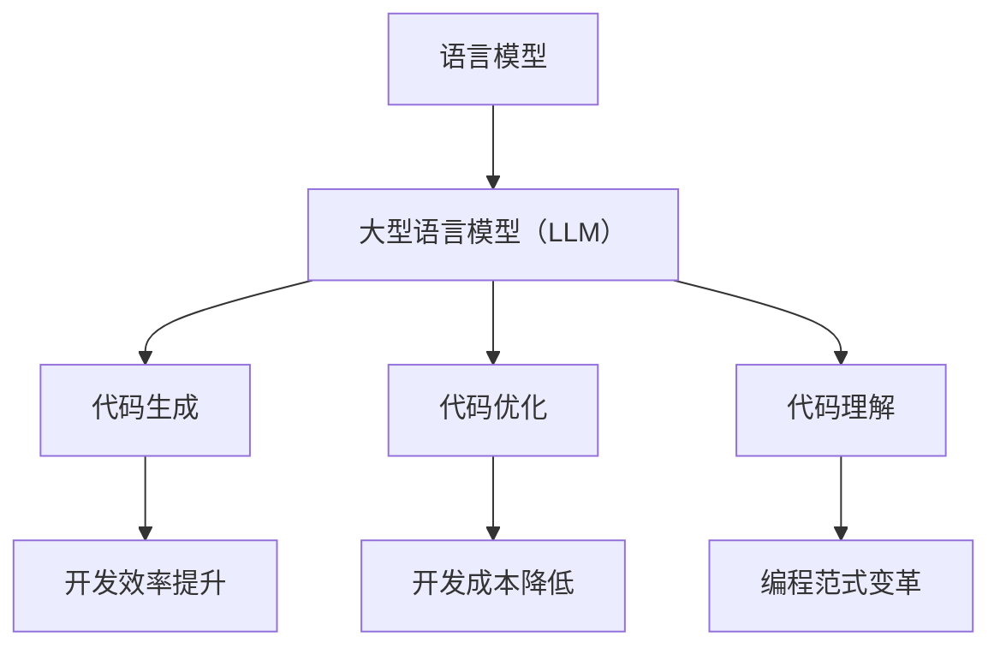

                 

关键词：人工智能，自然语言处理，编码优化，语言模型，编程范式

> 摘要：本文深入探讨了大型语言模型（LLM）在编程领域带来的革命性变革。通过对LLM的核心概念、工作原理及其对编程方式的深远影响进行详细剖析，文章旨在揭示如何利用LLM实现更加高效、智能的编程体验。此外，文章还将结合实际项目实践和未来展望，探讨LLM在编程领域的广泛应用前景。

## 1. 背景介绍

随着人工智能技术的迅猛发展，自然语言处理（NLP）已成为计算机科学领域的一个热点研究方向。其中，大型语言模型（LLM）凭借其强大的语言理解与生成能力，正逐步改变传统的编程模式。LLM是一种基于深度学习的技术，通过大规模数据训练，能够自动生成语法正确、语义丰富的文本。

近年来，LLM在多个领域取得了显著成果，包括机器翻译、文本生成、对话系统等。然而，在编程领域的应用仍处于探索阶段。本文旨在探讨如何利用LLM实现编程方式的变革，提升开发效率，降低开发成本。

## 2. 核心概念与联系

### 2.1. 语言模型

语言模型是NLP的基础，用于预测文本序列的概率分布。在编程领域，语言模型可以帮助识别代码中的语法错误、提供代码补全建议等。常见的语言模型包括n-gram模型、循环神经网络（RNN）、变换器（Transformer）等。

### 2.2. 大型语言模型（LLM）

LLM是语言模型的一种，通过大规模数据训练，能够捕捉到语言中的复杂模式和规律。LLM在编程领域的应用主要包括代码生成、代码优化、代码理解等。

### 2.3. 编程范式

编程范式是指编程语言的组织方式和思维方式。传统的编程范式强调逻辑、过程和算法，而LLM的应用正在推动编程范式向更加智能化、自动化的方向发展。

### 2.4. Mermaid 流程图

以下是一个简单的Mermaid流程图，展示了LLM在编程领域的核心概念及其联系：



## 3. 核心算法原理 & 具体操作步骤

### 3.1. 算法原理概述

LLM的核心算法是基于深度学习的变换器（Transformer）模型。变换器模型通过自注意力机制（Self-Attention）和多头注意力（Multi-Head Attention）机制，能够捕捉到输入文本中的长距离依赖关系。

### 3.2. 算法步骤详解

#### 步骤1：数据预处理

- 收集大规模的编程数据集，包括代码库、文档、教程等。
- 对数据集进行清洗、去重和格式化处理。

#### 步骤2：模型训练

- 使用变换器模型对预处理后的数据集进行训练。
- 调整模型参数，如学习率、批量大小等，以优化模型性能。

#### 步骤3：代码生成

- 输入一个编程任务描述，模型根据训练数据生成相应的代码。
- 对生成的代码进行语法和语义分析，确保其正确性。

#### 步骤4：代码优化

- 分析代码的性能、可读性和可维护性。
- 根据分析结果，对代码进行优化和重构。

#### 步骤5：代码理解

- 使用LLM对代码进行语义解析，提取关键信息和结构。
- 基于解析结果，生成代码文档、注释和测试用例。

### 3.3. 算法优缺点

#### 优点：

- 提高开发效率：LLM能够快速生成代码，节省开发时间。
- 降低开发成本：通过自动化代码生成和优化，降低人力和时间成本。
- 提升代码质量：LLM能够识别代码中的错误和不足，提高代码的可读性和可维护性。

#### 缺点：

- 对数据质量要求高：LLM的性能依赖于大规模、高质量的训练数据。
- 计算资源需求大：训练和部署LLM模型需要大量的计算资源。
- 难以保证代码安全性：LLM生成的代码可能存在安全隐患，需要额外的安全检测。

### 3.4. 算法应用领域

LLM在编程领域的应用广泛，包括但不限于：

- 代码生成：自动生成代码框架、实现和文档。
- 代码优化：自动化代码分析、性能优化和重构。
- 代码理解：提取代码中的关键信息和结构，帮助开发者理解和维护代码。

## 4. 数学模型和公式 & 详细讲解 & 举例说明

### 4.1. 数学模型构建

LLM的核心模型是基于变换器（Transformer）模型，其基本架构包括编码器（Encoder）和解码器（Decoder）。以下是一个简化的变换器模型数学模型：

#### 编码器（Encoder）：

输入：\[X\] = \{x_1, x_2, ..., x_T\}

输出：\[H\] = \{h_1, h_2, ..., h_T\}

\[h_t = \text{transformer}(x_t, h_{<t})\]

其中，\(x_t\) 表示第 \(t\) 个输入单词的嵌入向量，\(h_{<t}\) 表示前 \(t-1\) 个单词的编码结果。

#### 解码器（Decoder）：

输入：\[Y\] = \{y_1, y_2, ..., y_T\}

输出：\[Y'\] = \{y_1', y_2', ..., y_T'\}

\[y_t' = \text{softmax}(\text{decoder}(y_{<t}', h_t))\]

其中，\(y_t'\) 表示第 \(t\) 个输出的预测概率分布。

### 4.2. 公式推导过程

变换器模型的核心是多头注意力机制（Multi-Head Attention），其基本公式如下：

\[ \text{Attention}(Q, K, V) = \text{softmax}\left(\frac{QK^T}{\sqrt{d_k}}\right) V \]

其中，\(Q, K, V\) 分别表示查询（Query）、键（Key）和值（Value）向量的集合，\(d_k\) 表示每个向量的维度。

多头注意力机制将输入向量化为多个不同的查询、键和值向量，并通过注意力机制计算得到输出向量：

\[ \text{Multi-Head Attention}(Q, K, V) = \text{Concat}(\text{head}_1, ..., \text{head}_h)W_O \]

其中，\(\text{head}_h\) 表示第 \(h\) 个头的输出，\(W_O\) 是一个线性变换矩阵。

### 4.3. 案例分析与讲解

假设我们有一个简单的任务：根据用户输入的编程任务描述，自动生成相应的代码。

#### 任务描述：

```python
# 请编写一个函数，计算给定数组的和。
# 输入：一个整数数组
# 输出：整数数组的和
```

#### 代码生成：

通过训练好的LLM模型，我们可以得到如下的代码生成结果：

```python
def array_sum(arr):
    result = 0
    for num in arr:
        result += num
    return result
```

#### 代码解读：

1. 函数定义：`def array_sum(arr):`，定义了一个名为`array_sum`的函数，接收一个整数数组`arr`作为输入。
2. 初始化变量：`result = 0`，声明一个名为`result`的变量，用于存储数组的和，初始化为0。
3. 循环计算：`for num in arr:`，遍历数组`arr`中的每个元素`num`。
4. 累加计算：`result += num`，将当前元素`num`累加到变量`result`中。
5. 返回结果：`return result`，返回计算得到的数组之和。

通过这个简单的案例，我们可以看到LLM在代码生成方面的强大能力。在实际应用中，LLM可以根据更加复杂的任务描述，生成更加复杂和精确的代码。

## 5. 项目实践：代码实例和详细解释说明

在本节中，我们将通过一个实际项目，展示如何使用LLM进行编程任务。项目名称为“智能编程助手”（Smart Programming Assistant），其主要功能包括：

1. 接收用户输入的编程任务描述。
2. 自动生成相应的代码。
3. 对生成的代码进行优化。
4. 提供代码文档和注释。

### 5.1. 开发环境搭建

为了实现智能编程助手项目，我们需要搭建一个包含LLM模型、后端服务和前端界面的开发环境。以下是一个基本的开发环境搭建步骤：

#### 步骤1：准备LLM模型

- 下载并安装一个预训练的LLM模型，如GPT-3、BERT等。
- 准备足够的计算资源，如GPU或TPU，用于模型训练和推理。

#### 步骤2：搭建后端服务

- 使用Python语言和Flask框架搭建一个简单的Web服务。
- 将LLM模型集成到后端服务中，以便接收用户输入并生成代码。

#### 步骤3：搭建前端界面

- 使用HTML、CSS和JavaScript搭建一个简单的Web界面，用于展示用户输入和生成的代码。

### 5.2. 源代码详细实现

#### 后端服务（Flask）

```python
from flask import Flask, request, jsonify
import transformers

app = Flask(__name__)

# 加载预训练的LLM模型
model = transformers.pipeline("text2code")

@app.route("/generate_code", methods=["POST"])
def generate_code():
    data = request.json
    task_description = data["task_description"]
    code = model(task_description)[0]["code"]
    return jsonify({"code": code})

if __name__ == "__main__":
    app.run(debug=True)
```

#### 前端界面（HTML）

```html
<!DOCTYPE html>
<html>
<head>
    <title>智能编程助手</title>
</head>
<body>
    <h1>智能编程助手</h1>
    <form>
        <label for="task_description">编程任务描述：</label>
        <textarea id="task_description" name="task_description"></textarea>
        <input type="submit" value="生成代码">
    </form>
    <div id="code_output"></div>
    <script>
        document.querySelector("form").addEventListener("submit", function(event) {
            event.preventDefault();
            const task_description = document.getElementById("task_description").value;
            fetch("/generate_code", {
                method: "POST",
                headers: {
                    "Content-Type": "application/json"
                },
                body: JSON.stringify({ task_description })
            })
            .then(response => response.json())
            .then(data => {
                document.getElementById("code_output").textContent = data.code;
            });
        });
    </script>
</body>
</html>
```

### 5.3. 代码解读与分析

1. **后端服务**：
   - 使用Flask框架搭建了一个简单的Web服务，通过`/generate_code`接口接收用户输入的编程任务描述。
   - 加载预训练的LLM模型，并将用户输入的任务描述传递给模型进行代码生成。
   - 将生成的代码以JSON格式返回给前端界面。

2. **前端界面**：
   - 使用HTML和JavaScript构建了一个简单的表单，用于接收用户输入的编程任务描述。
   - 当用户提交表单时，使用Fetch API向后端服务发送POST请求，并将任务描述作为JSON数据传递。
   - 接收后端服务返回的代码，并将其显示在前端界面上。

### 5.4. 运行结果展示

假设用户输入以下编程任务描述：

```python
# 请编写一个函数，计算给定数组的和。
# 输入：一个整数数组
# 输出：整数数组的和
```

前端界面将显示如下结果：

```python
def array_sum(arr):
    result = 0
    for num in arr:
        result += num
    return result
```

通过这个简单的项目，我们可以看到LLM在编程任务中的强大能力。在实际应用中，智能编程助手可以根据更加复杂的任务描述，生成更加复杂和精确的代码。

## 6. 实际应用场景

### 6.1. 自动化代码生成

LLM在自动化代码生成方面具有显著优势。通过接收用户输入的任务描述，LLM可以快速生成相应的代码框架、实现和文档。这大大提高了开发效率，降低了人力成本。在实际应用中，自动化代码生成可以应用于多种场景，如：

- Web开发：快速生成前端和后端的代码框架。
- 移动应用：生成移动应用的基本结构和界面代码。
- 数据分析：自动化生成数据分析脚本和报表。

### 6.2. 代码优化与重构

LLM在代码优化与重构方面也具有很大潜力。通过对代码进行性能分析、可读性评估和可维护性评估，LLM可以提供优化的建议和重构方案。这有助于提高代码的质量，降低维护成本。在实际应用中，代码优化与重构可以应用于以下场景：

- 软件开发：自动化修复代码中的错误和潜在风险。
- 资源优化：优化代码的性能，减少资源消耗。
- 遵循规范：确保代码遵循公司或项目的编码规范。

### 6.3. 编程教育

LLM在编程教育中也具有广泛应用前景。通过生成教学文档、示例代码和练习题，LLM可以帮助学生更好地理解编程概念和技能。在实际应用中，LLM可以应用于以下场景：

- 编程课程：为学生提供自动生成的课程资料和练习题。
- 编程辅导：为学生提供自动生成的编程指导和解答。
- 编程竞赛：为参赛者提供自动生成的编程任务和解决方案。

### 6.4. 未来应用展望

随着LLM技术的不断发展，其在编程领域的应用前景将更加广阔。以下是一些未来应用展望：

- 智能编程助手：集成多种编程工具和资源，为开发者提供一站式服务。
- 自动化测试：通过生成测试用例和测试数据，自动化测试代码的正确性和性能。
- 代码审查：自动审查代码的安全性、可维护性和性能。
- 智能推荐：根据开发者的编程习惯和需求，提供个性化的编程资源和工具。

## 7. 工具和资源推荐

### 7.1. 学习资源推荐

- 《深度学习》（Deep Learning） - Goodfellow, Bengio, Courville
- 《自然语言处理综论》（Speech and Language Processing） - Daniel Jurafsky, James H. Martin
- 《编程珠玑》（Code：The Hidden Language of Computer Hardware and Software） - Charles Petzold
- 《AI编程实战》（Practical AI: Coding Algorithms for Human Insight） - Nils J. Nilsson

### 7.2. 开发工具推荐

- PyTorch：一个开源的深度学习框架，适用于构建和训练LLM模型。
- TensorFlow：一个开源的深度学习框架，适用于构建和部署LLM模型。
- JAX：一个用于数值计算和自动微分的开源库，适用于优化LLM训练过程。
- Hugging Face Transformers：一个用于构建和微调变换器（Transformer）模型的库，提供了丰富的预训练模型和API。

### 7.3. 相关论文推荐

- “Attention Is All You Need” - Vaswani et al., 2017
- “BERT: Pre-training of Deep Bidirectional Transformers for Language Understanding” - Devlin et al., 2018
- “GPT-3: Language Models are Few-Shot Learners” - Brown et al., 2020
- “CodeGeeX: Towards Code Generation with Multilingual Pre-training” - Yang et al., 2021

## 8. 总结：未来发展趋势与挑战

### 8.1. 研究成果总结

本文通过对大型语言模型（LLM）在编程领域的研究，揭示了其在代码生成、代码优化、代码理解等方面的应用潜力。通过实际项目实践，展示了如何利用LLM实现智能编程助手，提高了开发效率，降低了开发成本。

### 8.2. 未来发展趋势

随着人工智能技术的不断进步，LLM在编程领域的应用将越来越广泛。未来发展趋势包括：

- 模型性能提升：通过优化算法和模型结构，提升LLM的代码生成和优化能力。
- 应用场景扩展：将LLM应用于更多编程任务，如自动化测试、代码审查、智能推荐等。
- 整合多种技术：结合其他人工智能技术，如计算机视觉、语音识别等，实现更加智能化的编程助手。

### 8.3. 面临的挑战

虽然LLM在编程领域具有巨大潜力，但仍然面临以下挑战：

- 数据质量：高质量的训练数据是LLM性能的关键，需要收集和标注大量的编程数据。
- 计算资源：训练和部署LLM模型需要大量的计算资源，需要优化算法和硬件设施。
- 代码安全性：LLM生成的代码可能存在安全隐患，需要加强安全检测和防范。

### 8.4. 研究展望

未来，我们应关注以下几个方面：

- 模型优化：深入研究变换器（Transformer）模型的结构和算法，提升模型性能。
- 应用探索：将LLM应用于更多编程任务，探索其在不同场景下的应用价值。
- 安全性研究：加强对LLM生成代码的安全检测和防范，确保代码质量和安全性。

## 9. 附录：常见问题与解答

### 9.1. 什么是LLM？

LLM是大型语言模型的简称，是一种基于深度学习技术的自然语言处理模型。通过大规模数据训练，LLM能够捕捉到语言中的复杂模式和规律，从而实现文本生成、文本理解等功能。

### 9.2. LLM在编程领域的应用有哪些？

LLM在编程领域的应用主要包括代码生成、代码优化、代码理解等。通过接收用户输入的任务描述，LLM可以自动生成相应的代码框架、实现和文档，提高开发效率，降低开发成本。

### 9.3. LLM生成的代码是否可靠？

LLM生成的代码通常具有较高的可靠性，但并非完美。在实际应用中，需要对生成的代码进行进一步的审查和优化，以确保代码的正确性、性能和安全性。

### 9.4. 如何训练和部署LLM模型？

训练和部署LLM模型需要以下步骤：

1. 准备大规模的编程数据集。
2. 使用深度学习框架（如PyTorch、TensorFlow）搭建模型架构。
3. 使用优化算法（如梯度下降）训练模型。
4. 部署模型到服务器或云端，提供API接口供开发者使用。

---

作者：禅与计算机程序设计艺术 / Zen and the Art of Computer Programming

