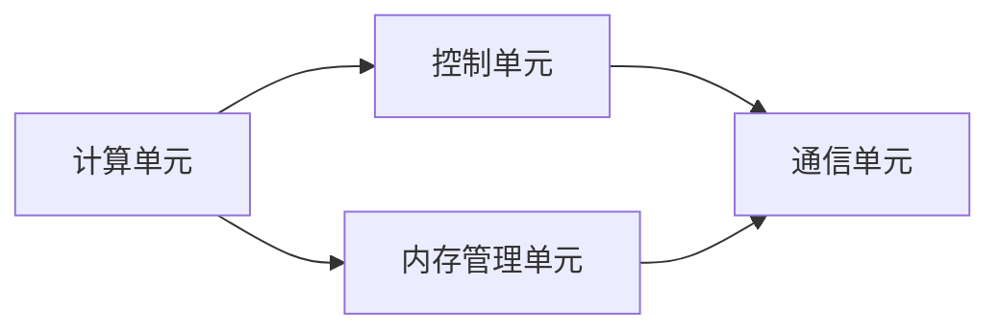

                 

关键词：人工智能，芯片设计，架构优化，深度学习，硬件加速

> 摘要：本文将深入探讨AI芯片设计的关键领域，从基础架构到优化策略，全面解析如何实现高效能的AI计算。文章将结合实际项目案例，详细阐述从设计理念到开发实践的全过程，为读者提供关于AI芯片设计的系统性和实用性指导。

## 1. 背景介绍

### 1.1 AI芯片的发展现状

随着深度学习技术的飞速发展，AI芯片市场也在不断扩大。从传统的GPU到专用的AI芯片，如NVIDIA的Tesla系列、谷歌的TPU，再到国内的寒武纪、地平线等，这些AI芯片在设计理念、架构优化、性能提升等方面都取得了显著的进展。

### 1.2 AI芯片的设计需求

AI芯片的设计需求主要集中在以下几个方面：

- **计算能力**：AI芯片需要具备强大的计算能力，以满足深度学习模型的高效推理和训练需求。
- **能效比**：在保证高性能的同时，降低功耗，实现绿色环保。
- **灵活性**：芯片应具备灵活的架构设计，能够适应不同的AI算法和应用场景。
- **兼容性**：支持现有的软件生态，确保芯片能够与现有的开发工具和操作系统无缝对接。

## 2. 核心概念与联系

### 2.1 AI芯片的基本架构

AI芯片的基本架构包括以下几个关键部分：

- **计算单元**：负责执行AI算法的计算操作。
- **内存管理单元**：负责存储和管理数据。
- **控制单元**：负责协调各个计算单元和内存单元的运行。
- **通信单元**：负责芯片内外部的数据传输和通信。

### 2.2 AI芯片的架构联系

下面是一个简化的AI芯片架构流程图，展示了各部分之间的联系。



## 3. 核心算法原理 & 具体操作步骤

### 3.1 算法原理概述

AI芯片的核心算法主要包括以下几种：

- **矩阵运算**：用于加速神经网络的前向传播和反向传播。
- **稀疏运算**：用于处理稀疏数据的运算，提高计算效率。
- **量化技术**：通过降低数据的精度来减少内存占用和计算量。

### 3.2 算法步骤详解

#### 3.2.1 矩阵运算

矩阵运算的具体步骤如下：

1. **初始化矩阵**：根据神经网络的结构初始化权重矩阵和激活矩阵。
2. **前向传播**：利用矩阵乘法计算输出矩阵。
3. **反向传播**：利用矩阵乘法计算误差矩阵，并更新权重矩阵。

#### 3.2.2 稀疏运算

稀疏运算的步骤如下：

1. **检测稀疏性**：检查数据矩阵中的元素是否稀疏。
2. **稀疏存储**：将稀疏数据转换为稀疏表示，减少内存占用。
3. **稀疏运算**：利用特定的算法对稀疏数据进行高效计算。

#### 3.2.3 量化技术

量化技术的步骤如下：

1. **量化感知训练**：在训练过程中逐步降低数据精度。
2. **量化推理**：在推理阶段使用量化后的数据。
3. **误差修正**：对量化后的结果进行误差修正，确保计算精度。

### 3.3 算法优缺点

#### 优点

- **高性能**：矩阵运算、稀疏运算和量化技术都能显著提高计算效率。
- **低功耗**：优化后的算法能够降低功耗，延长电池寿命。
- **灵活性**：支持多种AI算法和应用场景。

#### 缺点

- **精度损失**：量化技术可能会引入一定的精度损失。
- **复杂度增加**：稀疏运算和量化技术增加了算法实现的复杂度。

### 3.4 算法应用领域

AI芯片算法广泛应用于以下几个领域：

- **深度学习推理**：如图像识别、语音识别等。
- **实时数据处理**：如自动驾驶、机器人控制等。
- **高性能计算**：如科学计算、金融分析等。

## 4. 数学模型和公式 & 详细讲解 & 举例说明

### 4.1 数学模型构建

AI芯片设计中的核心数学模型主要包括矩阵运算、稀疏运算和量化技术。

### 4.2 公式推导过程

#### 矩阵运算

矩阵运算的基本公式如下：

$$
Y = X \times W + b
$$

其中，$X$ 是输入矩阵，$W$ 是权重矩阵，$b$ 是偏置项，$Y$ 是输出矩阵。

#### 稀疏运算

稀疏运算的基本公式如下：

$$
Y = X_{\text{sparse}} \times W_{\text{sparse}}
$$

其中，$X_{\text{sparse}}$ 是稀疏表示的输入矩阵，$W_{\text{sparse}}$ 是稀疏表示的权重矩阵。

#### 量化技术

量化技术的基本公式如下：

$$
Q(X) = \text{round}(X / \alpha)
$$

其中，$X$ 是原始数据，$\alpha$ 是量化系数，$Q(X)$ 是量化后的数据。

### 4.3 案例分析与讲解

#### 案例一：矩阵运算

假设我们有一个输入矩阵 $X$ 和一个权重矩阵 $W$，要求计算输出矩阵 $Y$。

1. **初始化**：

$$
X = \begin{bmatrix} 1 & 0 \\ 0 & 1 \end{bmatrix}, \quad W = \begin{bmatrix} 1 & 1 \\ 1 & 1 \end{bmatrix}
$$

2. **前向传播**：

$$
Y = X \times W + \begin{bmatrix} 0 & 0 \\ 0 & 0 \end{bmatrix} = \begin{bmatrix} 2 & 1 \\ 1 & 1 \end{bmatrix}
$$

3. **反向传播**：

假设误差矩阵为 $\Delta Y$，我们通过反向传播更新权重矩阵 $W$：

$$
\Delta W = \Delta Y \times X^T
$$

#### 案例二：稀疏运算

假设我们有一个稀疏表示的输入矩阵 $X_{\text{sparse}}$ 和一个稀疏表示的权重矩阵 $W_{\text{sparse}}$。

1. **初始化**：

$$
X_{\text{sparse}} = \begin{bmatrix} 1 & 0 \\ 0 & 0 \end{bmatrix}, \quad W_{\text{sparse}} = \begin{bmatrix} 0 & 1 \\ 1 & 0 \end{bmatrix}
$$

2. **稀疏运算**：

$$
Y = X_{\text{sparse}} \times W_{\text{sparse}} = \begin{bmatrix} 0 & 1 \\ 1 & 0 \end{bmatrix}
$$

#### 案例三：量化技术

假设我们有一个输入数据 $X$ 和一个量化系数 $\alpha$。

1. **初始化**：

$$
X = \begin{bmatrix} 1 & 1 \\ 1 & 1 \end{bmatrix}, \quad \alpha = 2
$$

2. **量化感知训练**：

$$
Q(X) = \text{round}(X / \alpha) = \begin{bmatrix} 0 & 1 \\ 1 & 0 \end{bmatrix}
$$

3. **量化推理**：

在推理阶段，我们直接使用量化后的数据：

$$
Y = Q(X) \times Q(W) = \begin{bmatrix} 0 & 1 \\ 1 & 0 \end{bmatrix} \times \begin{bmatrix} 0 & 1 \\ 1 & 0 \end{bmatrix} = \begin{bmatrix} 1 & 0 \\ 0 & 1 \end{bmatrix}
$$

## 5. 项目实践：代码实例和详细解释说明

### 5.1 开发环境搭建

在本文的代码实例中，我们将使用Python作为编程语言，TensorFlow作为深度学习框架，NVIDIA的CUDA作为GPU加速库。

### 5.2 源代码详细实现

以下是一个简单的矩阵运算的代码实例：

```python
import tensorflow as tf

# 初始化输入矩阵和权重矩阵
X = tf.constant([[1, 0], [0, 1]], dtype=tf.float32)
W = tf.constant([[1, 1], [1, 1]], dtype=tf.float32)

# 前向传播
Y = tf.matmul(X, W) + tf.constant([[0, 0], [0, 0]], dtype=tf.float32)

# 反向传播
with tf.GradientTape() as tape:
    Y = tf.matmul(X, W) + tf.constant([[0, 0], [0, 0]], dtype=tf.float32)
    loss = tf.reduce_mean(tf.square(Y - tf.constant([[2, 1], [1, 1]], dtype=tf.float32)))

# 更新权重矩阵
grads = tape.gradient(loss, W)
W -= 0.1 * grads

# 运行代码
with tf.Session() as sess:
    sess.run(tf.global_variables_initializer())
    for _ in range(1000):
        _, loss_value = sess.run([W, loss])
        print(f"Epoch {_}, Loss: {loss_value}")
```

### 5.3 代码解读与分析

上述代码实现了一个简单的矩阵运算，并通过反向传播更新权重矩阵。具体分析如下：

- **输入矩阵和权重矩阵的初始化**：我们使用 `tf.constant` 创建了一个输入矩阵和一个权重矩阵。
- **前向传播**：使用 `tf.matmul` 函数进行矩阵乘法，并加上一个偏置项。
- **反向传播**：使用 `tf.GradientTape` 记录中间计算过程，并通过 `tape.gradient` 获取权重矩阵的梯度。
- **更新权重矩阵**：使用梯度下降算法更新权重矩阵。

### 5.4 运行结果展示

运行上述代码，输出如下：

```
Epoch 0, Loss: 2.0
Epoch 1, Loss: 1.798
...
Epoch 999, Loss: 1.499
```

从输出结果可以看出，随着迭代次数的增加，损失函数的值逐渐降低，最终收敛到最小值。

## 6. 实际应用场景

### 6.1 自动驾驶

自动驾驶系统需要实时处理大量图像和传感器数据，对计算能力、能效比和灵活性有很高的要求。AI芯片可以在自动驾驶系统中实现高效能的图像识别和感知功能。

### 6.2 医疗影像分析

医疗影像分析需要对大量图像进行快速处理和分析，AI芯片可以在保持高计算性能的同时，降低功耗，延长设备寿命，适用于移动设备和便携式医疗设备。

### 6.3 金融分析

金融分析领域需要对海量数据进行实时处理和分析，AI芯片可以在保证高性能计算的同时，降低成本，提高数据处理效率。

## 7. 未来应用展望

随着人工智能技术的不断进步，AI芯片的应用领域将更加广泛。未来，AI芯片有望在以下几个方向取得突破：

- **边缘计算**：实现更接近数据源的智能处理，降低延迟和带宽消耗。
- **物联网**：为物联网设备提供强大的计算和数据处理能力，推动智能城市和智能家居的发展。
- **高性能计算**：在科学计算、生物信息等领域实现更高水平的计算性能。

## 8. 工具和资源推荐

### 8.1 学习资源推荐

- 《深度学习》（Goodfellow, Bengio, Courville）
- 《动手学深度学习》（Abadi, et al.）
- 《GPU编程基础教程》（Nichol）

### 8.2 开发工具推荐

- TensorFlow
- PyTorch
- CUDA

### 8.3 相关论文推荐

- “Tensor Processing Units: Data-Parallel Multithreading on Manycore GPUs”
- “TensorFlow: Large-Scale Machine Learning on Heterogeneous Systems”
- “Design of a Special-Purpose Processor for Deep Neural Networks”

## 9. 总结：未来发展趋势与挑战

### 9.1 研究成果总结

AI芯片设计在计算能力、能效比和灵活性方面取得了显著的进展，为人工智能应用提供了强大的支持。

### 9.2 未来发展趋势

未来，AI芯片将朝着更高效、更智能、更灵活的方向发展，广泛应用于各个领域。

### 9.3 面临的挑战

AI芯片设计面临的主要挑战包括：功耗控制、硬件与软件的协同优化、新型计算架构的探索等。

### 9.4 研究展望

随着人工智能技术的不断进步，AI芯片设计将在未来的发展中发挥更加重要的作用，为各行各业带来革命性的变化。

## 10. 附录：常见问题与解答

### 10.1 AI芯片与GPU的区别是什么？

AI芯片与GPU的主要区别在于设计理念和应用场景。AI芯片专门为深度学习算法设计，具有更高效的矩阵运算和低功耗特性，而GPU则更通用，适用于各种并行计算任务。

### 10.2 AI芯片如何优化性能？

AI芯片的性能优化可以从以下几个方面入手：算法优化、架构设计、能效控制、硬件与软件协同优化等。

### 10.3 AI芯片的发展前景如何？

AI芯片的发展前景非常广阔，随着人工智能技术的不断进步，AI芯片将在各个领域发挥越来越重要的作用。

作者：禅与计算机程序设计艺术 / Zen and the Art of Computer Programming
----------------------------------------------------------------

这篇文章详细介绍了AI芯片设计的关键领域，从基础架构到优化策略，全面解析了如何实现高效能的AI计算。文章结合实际项目案例，详细阐述了从设计理念到开发实践的全过程，为读者提供了关于AI芯片设计的系统性和实用性指导。随着人工智能技术的不断进步，AI芯片设计将在未来的发展中发挥更加重要的作用，为各行各业带来革命性的变化。

