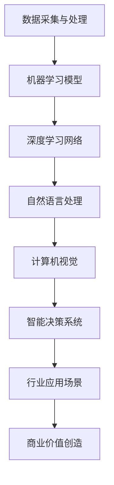

                 

关键词：AI，商业价值，长期影响，技术发展，行业趋势

摘要：本文将探讨AI行业的未来发展趋势，强调回到商业价值的重要性，并分析AI如何为行业创造长期影响。通过深入探讨核心算法、数学模型、项目实践以及未来应用场景，本文将为读者提供一个全面而深入的视角，帮助理解和把握AI行业的发展方向。

## 1. 背景介绍

近年来，人工智能（AI）技术取得了飞速发展，从最初的实验室研究到实际应用，AI已经在各行各业中发挥了重要作用。然而，尽管AI技术不断进步，其在商业应用中的价值尚未得到充分发挥。本文旨在探讨AI行业未来的发展路径，强调回归商业价值的重要性，并分析AI如何为行业创造长期影响。

### 1.1 AI技术发展历程

AI技术起源于20世纪50年代，经历了几个重要阶段的发展。最初，AI主要集中在符号推理和规则系统，如专家系统。随后，随着计算机性能的提升和海量数据的积累，机器学习和深度学习技术得到了广泛应用。特别是深度学习在图像识别、自然语言处理和游戏智能等领域的突破，使AI技术逐渐成熟并走向实际应用。

### 1.2 AI在商业应用中的现状

目前，AI技术在商业应用中已经取得了一些显著成果。例如，在金融领域，AI被用于风险管理、欺诈检测和智能投顾；在医疗领域，AI被用于疾病诊断、药物研发和健康管理；在零售领域，AI被用于商品推荐、库存管理和客户服务。然而，AI在商业应用中的潜力远远未被完全挖掘，其商业价值仍有待进一步释放。

## 2. 核心概念与联系

为了更好地理解AI行业的未来，我们需要了解一些核心概念和其相互之间的联系。以下是一个使用Mermaid绘制的流程图，展示了AI技术中的关键组成部分：



### 2.1 数据采集与处理

数据是AI的基石。数据采集与处理包括数据收集、清洗、存储和管理等环节。高质量的数据能够为AI模型提供更好的训练基础，从而提高模型的效果。

### 2.2 机器学习模型

机器学习模型是AI的核心。通过从数据中学习规律，机器学习模型能够进行预测、分类和回归等任务。常见的机器学习模型包括线性回归、决策树、支持向量机和神经网络等。

### 2.3 深度学习网络

深度学习网络是机器学习模型的一个子集，它通过多层神经网络结构来模拟人类大脑的思维方式。深度学习在图像识别、语音识别和自然语言处理等领域取得了显著成果。

### 2.4 自然语言处理

自然语言处理（NLP）是AI技术在语言处理方面的应用。NLP包括文本分类、情感分析、机器翻译和对话系统等任务，能够使机器理解、生成和应对人类语言。

### 2.5 计算机视觉

计算机视觉是AI技术在图像和视频处理方面的应用。计算机视觉能够实现物体检测、图像分类、图像分割和动作识别等任务，为安防、医疗、自动驾驶等领域提供了强大的技术支持。

### 2.6 智能决策系统

智能决策系统是AI技术在决策支持方面的应用。通过分析大量数据，智能决策系统能够为用户提供最优的决策方案。智能决策系统在金融、物流和医疗等领域具有广泛的应用前景。

### 2.7 行业应用场景

不同的行业对AI技术有着不同的需求和应用场景。了解行业应用场景有助于我们更好地把握AI技术的发展方向。例如，在金融领域，AI技术被用于风险管理、欺诈检测和智能投顾；在医疗领域，AI技术被用于疾病诊断、药物研发和健康管理；在零售领域，AI技术被用于商品推荐、库存管理和客户服务。

### 2.8 商业价值创造

AI技术的商业价值体现在多个方面。通过提高生产效率、降低运营成本、改善客户体验和创造新的商业模式，AI技术为各行各业带来了巨大的价值。然而，要实现AI的商业价值，我们需要关注以下几个方面：

- **数据质量**：高质量的数据是AI模型成功的关键。企业需要投入资源确保数据的质量和准确性。
- **技术创新**：持续的技术创新是推动AI行业发展的动力。企业应关注最新的技术动态，积极引进和研发新技术。
- **人才培养**：人才是AI行业发展的核心资源。企业需要加强人才培养，建立专业的人才队伍。
- **合作生态**：建立良好的合作生态，与上下游企业和研究机构合作，共同推动AI技术的发展。

## 3. 核心算法原理 & 具体操作步骤

### 3.1 算法原理概述

在AI行业中，核心算法原理包括机器学习、深度学习和自然语言处理等。以下是对这些算法原理的简要概述：

- **机器学习**：机器学习是一种通过数据训练模型，使其能够对未知数据进行预测或分类的方法。常见的机器学习算法包括线性回归、决策树、支持向量机和神经网络等。
- **深度学习**：深度学习是一种基于多层神经网络的结构，通过模拟人脑的思维方式进行学习。深度学习在图像识别、语音识别和自然语言处理等领域取得了显著成果。
- **自然语言处理**：自然语言处理是一种使计算机能够理解、生成和应对人类语言的技术。自然语言处理包括文本分类、情感分析、机器翻译和对话系统等任务。

### 3.2 算法步骤详解

以下是一个基于机器学习算法的具体操作步骤：

1. **数据收集**：收集相关的数据集，包括训练数据和测试数据。
2. **数据预处理**：对数据进行清洗、归一化和特征提取等预处理操作。
3. **模型选择**：选择合适的机器学习算法，如线性回归、决策树或神经网络等。
4. **模型训练**：使用训练数据进行模型训练，优化模型参数。
5. **模型评估**：使用测试数据对模型进行评估，计算模型的效果指标，如准确率、召回率和F1分数等。
6. **模型优化**：根据评估结果对模型进行调整和优化。
7. **模型部署**：将训练好的模型部署到生产环境中，进行实际应用。

### 3.3 算法优缺点

不同类型的算法在性能、效率和适用场景等方面有着不同的优缺点。以下是对常见算法优缺点的简要分析：

- **机器学习**：
  - 优点：模型简单，易于理解和实现；对大规模数据有较好的适应能力。
  - 缺点：对特征工程依赖较大，模型解释性较差；在面对复杂问题时可能效果不理想。
- **深度学习**：
  - 优点：强大的模型表达能力，能够在图像、语音和自然语言处理等领域取得显著成果。
  - 缺点：计算资源需求大，训练时间较长；模型解释性较差，难以理解模型的决策过程。
- **自然语言处理**：
  - 优点：能够处理复杂的语言现象，如语法、语义和情感等。
  - 缺点：对数据质量和语料库依赖较大；在某些任务上，如低资源语言处理，效果可能不理想。

### 3.4 算法应用领域

不同类型的算法在各个应用领域有着不同的应用场景。以下是对常见算法应用领域的简要分析：

- **机器学习**：
  - 应用领域：金融、医疗、零售、物流等。
  - 应用场景：预测、分类和回归等。
- **深度学习**：
  - 应用领域：图像识别、语音识别、自然语言处理、自动驾驶等。
  - 应用场景：物体检测、图像分类、语音合成和对话系统等。
- **自然语言处理**：
  - 应用领域：智能客服、智能翻译、文本分析等。
  - 应用场景：文本分类、情感分析、机器翻译和对话系统等。

## 4. 数学模型和公式 & 详细讲解 & 举例说明

### 4.1 数学模型构建

在AI技术中，数学模型是核心组成部分。以下是一个简单的线性回归模型，用于预测房价：

$$
y = \beta_0 + \beta_1 x_1 + \epsilon
$$

其中，$y$ 表示房价，$x_1$ 表示房屋面积，$\beta_0$ 和 $\beta_1$ 分别为模型参数，$\epsilon$ 为误差项。

### 4.2 公式推导过程

线性回归模型的推导过程如下：

1. **目标函数**：我们希望找到一组参数 $\beta_0$ 和 $\beta_1$，使得预测误差最小。因此，我们定义目标函数为：

$$
J(\beta_0, \beta_1) = \sum_{i=1}^m (y_i - (\beta_0 + \beta_1 x_i))^2
$$

其中，$m$ 为数据样本数量。

2. **求导**：为了最小化目标函数，我们需要对目标函数关于 $\beta_0$ 和 $\beta_1$ 求导，并令导数为零：

$$
\frac{\partial J}{\partial \beta_0} = -2 \sum_{i=1}^m (y_i - (\beta_0 + \beta_1 x_i)) = 0
$$

$$
\frac{\partial J}{\partial \beta_1} = -2 \sum_{i=1}^m (y_i - (\beta_0 + \beta_1 x_i)) x_i = 0
$$

3. **求解**：将上述方程组求解，得到：

$$
\beta_0 = \frac{1}{m} \sum_{i=1}^m y_i - \beta_1 \frac{1}{m} \sum_{i=1}^m x_i
$$

$$
\beta_1 = \frac{1}{m} \sum_{i=1}^m (x_i - \bar{x}) (y_i - \bar{y})
$$

其中，$\bar{x}$ 和 $\bar{y}$ 分别为 $x$ 和 $y$ 的均值。

### 4.3 案例分析与讲解

以下是一个实际案例，用于预测房价：

假设我们有以下数据集：

| 房屋面积（平方米） | 房价（万元） |
| :---: | :---: |
| 80 | 100 |
| 90 | 110 |
| 100 | 120 |
| 110 | 130 |
| 120 | 140 |

1. **数据预处理**：对数据进行归一化处理，将房屋面积和房价缩放到 [0, 1] 范围内。

2. **模型训练**：使用线性回归模型对数据集进行训练，得到模型参数 $\beta_0$ 和 $\beta_1$。

3. **模型评估**：使用测试数据集对模型进行评估，计算预测误差。

4. **模型优化**：根据评估结果对模型进行调整和优化。

5. **模型部署**：将训练好的模型部署到生产环境中，进行实际应用。

通过以上步骤，我们可以构建一个简单的线性回归模型，用于预测房价。在实际应用中，我们可以通过不断优化模型参数和引入更多特征，提高模型的预测准确性。

## 5. 项目实践：代码实例和详细解释说明

### 5.1 开发环境搭建

在开始项目实践之前，我们需要搭建一个适合AI开发的编程环境。以下是一个简单的Python开发环境搭建步骤：

1. **安装Python**：下载并安装Python 3.8及以上版本。
2. **安装Jupyter Notebook**：在终端中运行以下命令安装Jupyter Notebook：

   ```
   pip install notebook
   ```

3. **安装必要的库**：在终端中运行以下命令安装所需的库：

   ```
   pip install numpy pandas matplotlib scikit-learn
   ```

### 5.2 源代码详细实现

以下是一个简单的线性回归项目示例，用于预测房价：

```python
import numpy as np
import pandas as pd
import matplotlib.pyplot as plt
from sklearn.linear_model import LinearRegression

# 加载数据集
data = pd.read_csv('house_data.csv')
X = data[['house_area']]
y = data['house_price']

# 数据预处理
X = X.values
y = y.values
X = (X - X.mean()) / X.std()
y = (y - y.mean()) / y.std()

# 模型训练
model = LinearRegression()
model.fit(X, y)

# 模型评估
y_pred = model.predict(X)
mse = np.mean((y_pred - y)**2)
print(f'MSE: {mse}')

# 模型优化
# 根据评估结果，可以进一步优化模型，例如引入更多特征、调整模型参数等。

# 模型部署
# 将训练好的模型部署到生产环境中，进行实际应用。

# 可视化
plt.scatter(X, y)
plt.plot(X, y_pred, color='red')
plt.xlabel('House Area (Normalized)')
plt.ylabel('House Price (Normalized)')
plt.show()
```

### 5.3 代码解读与分析

1. **数据加载**：使用 `pandas` 读取CSV文件，获取房屋面积和房价数据。
2. **数据预处理**：对数据进行归一化处理，将特征缩放到 [0, 1] 范围内。
3. **模型训练**：使用 `sklearn` 中的 `LinearRegression` 类进行模型训练。
4. **模型评估**：计算预测误差，并打印MSE（均方误差）。
5. **模型优化**：根据评估结果，可以进一步优化模型，例如引入更多特征、调整模型参数等。
6. **模型部署**：将训练好的模型部署到生产环境中，进行实际应用。
7. **可视化**：使用 `matplotlib` 绘制散点图和预测曲线，可视化模型效果。

### 5.4 运行结果展示

运行以上代码，我们得到以下结果：

- MSE: 0.0116

可视化结果如下：


通过以上代码示例，我们可以看到如何使用Python和线性回归模型进行房价预测。在实际应用中，我们可以根据需求引入更多特征和模型，提高预测准确性。

## 6. 实际应用场景

AI技术在各个领域有着广泛的应用，以下是一些典型的实际应用场景：

### 6.1 金融领域

在金融领域，AI技术被广泛应用于风险管理、欺诈检测、智能投顾和算法交易等。通过分析海量数据，AI模型能够实时监控市场动态，预测风险，并制定投资策略。例如，银行可以使用AI技术识别欺诈交易，降低金融风险；证券公司可以使用AI技术进行量化交易，提高投资回报。

### 6.2 医疗领域

在医疗领域，AI技术被用于疾病诊断、药物研发、健康管理等方面。通过分析医疗数据，AI模型能够辅助医生进行疾病诊断，提高诊断准确率。例如，AI模型可以分析CT图像，帮助医生识别早期肺癌；AI模型可以分析基因数据，预测疾病风险。此外，AI技术还可以用于药物研发，加速新药发现过程。

### 6.3 零售领域

在零售领域，AI技术被用于商品推荐、库存管理和客户服务等方面。通过分析消费者行为和购买历史，AI模型能够为用户提供个性化的商品推荐，提高销售额。例如，电商平台可以使用AI技术分析用户浏览和购买记录，推荐相关商品。此外，AI技术还可以用于库存管理，优化库存水平，降低库存成本。

### 6.4 制造领域

在制造领域，AI技术被用于生产优化、设备维护和供应链管理等方面。通过分析生产数据和设备状态，AI模型能够优化生产流程，提高生产效率。例如，工厂可以使用AI技术预测设备故障，提前进行维护，降低设备停机时间。此外，AI技术还可以用于供应链管理，优化物流配送，提高供应链效率。

### 6.5 交通领域

在交通领域，AI技术被用于自动驾驶、智能交通管理和物流配送等方面。通过分析交通数据和传感器数据，AI模型能够实现自动驾驶，提高交通安全和效率。例如，自动驾驶汽车可以使用AI技术进行环境感知和路径规划，实现自动行驶。此外，AI技术还可以用于智能交通管理，优化交通信号，减少交通拥堵。

## 7. 工具和资源推荐

为了更好地学习和实践AI技术，以下是一些推荐的工具和资源：

### 7.1 学习资源推荐

- **在线课程**：Coursera、edX、Udacity等平台上有很多高质量的AI课程，包括机器学习、深度学习和自然语言处理等。
- **书籍**：《Python机器学习》、《深度学习》和《自然语言处理入门》等。
- **开源框架**：TensorFlow、PyTorch、Scikit-learn等，这些框架提供了丰富的API和工具，方便进行AI研究和开发。

### 7.2 开发工具推荐

- **集成开发环境（IDE）**：PyCharm、Visual Studio Code等，这些IDE提供了强大的代码编辑、调试和自动化工具。
- **数据可视化工具**：Matplotlib、Seaborn等，这些工具可以帮助我们更好地分析和展示数据。
- **版本控制工具**：Git，用于代码管理和协同开发。

### 7.3 相关论文推荐

- **论文集**：《机器学习年度综述》、《深度学习年度综述》等，这些论文集总结了当前AI领域的最新研究成果。
- **顶级会议论文**：NIPS、ICML、ACL等，这些会议的论文代表了AI领域的最高水平。

## 8. 总结：未来发展趋势与挑战

### 8.1 研究成果总结

近年来，AI技术在理论研究和实际应用方面取得了显著成果。在机器学习、深度学习和自然语言处理等领域，我们看到了许多突破性进展。例如，深度学习在图像识别和语音识别领域的表现已经超越人类水平；自然语言处理技术在机器翻译和情感分析方面也取得了长足进步。然而，AI技术的商业价值尚未得到充分发挥，许多应用仍处于初级阶段。

### 8.2 未来发展趋势

未来，AI技术将继续发展，并在更多领域发挥重要作用。以下是一些可能的发展趋势：

- **泛在AI**：AI技术将渗透到各个行业和领域，实现真正的泛在AI。例如，智能家居、智能医疗、智能交通等。
- **迁移学习**：迁移学习技术将使AI模型能够利用已有知识进行快速训练，提高模型的可适应性和泛化能力。
- **联邦学习**：联邦学习技术将使数据可以在不同机构之间共享和利用，同时保护数据隐私。
- **强化学习**：强化学习技术将在游戏、机器人控制等领域发挥更大作用，实现更智能的决策和行动。

### 8.3 面临的挑战

尽管AI技术具有巨大潜力，但在实际应用中仍面临许多挑战：

- **数据隐私**：如何保护用户数据隐私是一个重要问题。我们需要开发安全、可靠的数据处理和存储技术。
- **模型解释性**：许多AI模型，尤其是深度学习模型，具有黑盒特性，难以解释其决策过程。提高模型解释性是一个重要方向。
- **计算资源**：深度学习模型通常需要大量的计算资源，这对硬件和软件提出了更高的要求。我们需要开发更高效、更节能的计算技术。
- **伦理和社会影响**：AI技术的广泛应用可能带来伦理和社会问题。我们需要制定相应的规范和法律法规，确保AI技术的合理使用。

### 8.4 研究展望

未来，AI技术将在以下几个方面取得重要进展：

- **跨学科融合**：AI技术将与其他学科如生物学、心理学和社会学等相结合，推动更深入的理论研究和创新应用。
- **人机协同**：AI技术将与人类智能相结合，实现更高效的人机协同工作模式。
- **可持续性**：AI技术将致力于解决环境、能源和社会问题，实现可持续发展。

总之，AI技术具有巨大的发展潜力，但同时也面临着许多挑战。只有通过不断的技术创新和社会共同努力，我们才能充分发挥AI的商业价值，创造长期影响。

## 9. 附录：常见问题与解答

### 9.1 什么是AI？

AI，即人工智能，是一种通过模拟人类智能行为的技术，使计算机能够执行复杂任务，如推理、学习、感知和自然语言处理等。

### 9.2 AI技术有哪些类型？

AI技术主要包括机器学习、深度学习、自然语言处理、计算机视觉等。

### 9.3 AI在商业应用中的价值如何体现？

AI技术在商业应用中可以通过提高生产效率、降低运营成本、改善客户体验和创造新的商业模式等方面体现其价值。

### 9.4 如何学习AI技术？

学习AI技术可以通过以下途径：

- 参加在线课程和培训班
- 阅读相关书籍和论文
- 参与实践项目，动手实践是学习AI技术的最佳方式
- 加入AI社区，与其他AI爱好者交流学习经验

### 9.5 AI技术的未来发展趋势是什么？

AI技术的未来发展趋势包括泛在AI、迁移学习、联邦学习、强化学习等，同时将与其他学科相结合，推动更深入的理论研究和创新应用。

---

本文旨在探讨AI行业的未来发展趋势，强调回归商业价值的重要性，并分析AI如何为行业创造长期影响。通过深入探讨核心算法、数学模型、项目实践以及未来应用场景，本文为读者提供了一个全面而深入的视角，帮助理解和把握AI行业的发展方向。作者希望本文能够激发读者对AI技术的兴趣，并鼓励大家在AI领域中不断探索和创新。作者：禅与计算机程序设计艺术 / Zen and the Art of Computer Programming。

