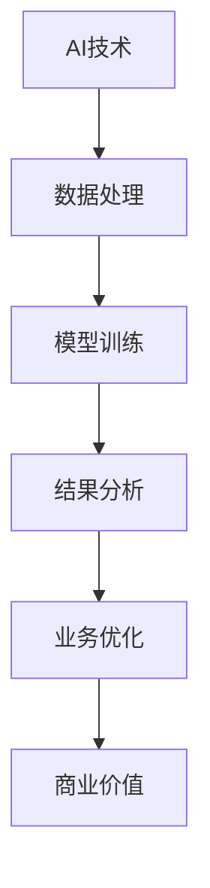

                 

关键词：人工智能，商业价值，长期影响，技术革新，行业应用，未来趋势

> 摘要：本文旨在探讨人工智能（AI）行业的未来发展，强调回归商业价值的重要性，并探讨如何通过技术革新和行业应用，使AI创造长期影响。文章将分析当前AI发展的困境，提出解决方案，并展望未来发展趋势和面临的挑战。

## 1. 背景介绍

随着人工智能技术的飞速发展，AI已经逐渐渗透到各个行业，从医疗、金融到制造业、零售业，AI的应用场景日益丰富。然而，尽管AI技术取得了显著成果，许多企业却在AI的商业应用上遇到了瓶颈，难以实现预期的长期价值。这主要是因为大多数企业在AI应用过程中过于注重技术本身的实现，而忽视了商业价值的创造。

### 1.1 当前AI应用的现状

当前，AI技术在预测分析、自动化流程、自然语言处理等方面取得了重大突破。例如，通过机器学习算法，企业能够更好地预测市场趋势，优化库存管理；通过自然语言处理，企业能够更高效地处理客户咨询，提高客户满意度。然而，这些技术的应用往往局限于特定场景，难以实现广泛推广和持续影响。

### 1.2 AI应用中的问题

AI应用中的主要问题包括：

- **技术瓶颈**：AI技术在某些领域尚未达到成熟阶段，无法满足实际需求。
- **数据不足**：许多企业缺乏高质量、大规模的数据集，限制了AI模型的训练效果。
- **商业思维不足**：企业在AI应用中过于注重技术实现，忽视了商业价值的挖掘。
- **人才短缺**：具备AI技能的专业人才短缺，限制了企业的AI应用能力。

## 2. 核心概念与联系

### 2.1 AI的核心概念

人工智能（Artificial Intelligence，AI）是指由人制造出的系统所表现出的智能行为。AI技术主要包括机器学习、深度学习、自然语言处理、计算机视觉等。这些技术共同构成了AI的技术体系。

### 2.2 AI与商业价值的联系

AI与商业价值的联系主要体现在以下几个方面：

- **提高效率**：AI技术能够自动化重复性工作，提高工作效率，降低成本。
- **优化决策**：AI技术能够通过数据分析，为企业提供更有依据的决策支持。
- **创造新业务**：AI技术能够为企业带来新的商业模式和机会，推动业务创新。

### 2.3 Mermaid流程图

以下是一个简化的Mermaid流程图，展示了AI技术从应用到商业价值的转化过程：



## 3. 核心算法原理 & 具体操作步骤

### 3.1 算法原理概述

AI技术的核心在于算法，其中最常用的算法包括机器学习算法和深度学习算法。机器学习算法主要通过数据训练模型，使其具备自动预测和决策能力。深度学习算法则通过多层神经网络，模拟人类大脑的思考过程，实现更复杂的任务。

### 3.2 算法步骤详解

- **数据收集**：收集相关领域的原始数据，如市场数据、用户行为数据等。
- **数据预处理**：清洗数据，去除噪声，将数据转换为模型可处理的格式。
- **模型训练**：使用训练数据，通过优化算法，调整模型参数，使模型达到期望的效果。
- **模型评估**：使用验证数据，评估模型的效果，调整模型参数，提高模型性能。
- **模型应用**：将训练好的模型应用于实际问题，实现业务优化和决策支持。

### 3.3 算法优缺点

- **机器学习算法**：优点在于适应性强，能够处理复杂数据。缺点是训练时间较长，对数据质量要求高。
- **深度学习算法**：优点在于能够处理大量数据，效果更好。缺点是计算资源需求大，模型解释性差。

### 3.4 算法应用领域

AI算法广泛应用于各个领域，如：

- **金融**：通过机器学习算法进行风险评估、欺诈检测等。
- **医疗**：通过计算机视觉算法进行医学影像分析、疾病预测等。
- **制造业**：通过深度学习算法进行质量检测、生产优化等。

## 4. 数学模型和公式 & 详细讲解 & 举例说明

### 4.1 数学模型构建

在AI应用中，常用的数学模型包括线性回归、逻辑回归、神经网络等。以下是一个简单的线性回归模型：

$$
y = wx + b
$$

其中，$y$ 为目标变量，$x$ 为输入变量，$w$ 为权重，$b$ 为偏置。

### 4.2 公式推导过程

线性回归模型的推导过程如下：

1. **假设**：假设输入变量 $x$ 和目标变量 $y$ 之间存在线性关系。
2. **损失函数**：定义损失函数，衡量模型预测值与真实值之间的差距。
3. **梯度下降**：通过梯度下降算法，不断调整模型参数，使损失函数最小。

### 4.3 案例分析与讲解

以下是一个简单的线性回归案例：

假设我们要预测一家公司的股票价格，输入变量为公司的净利润。我们收集了历史数据，使用线性回归模型进行预测。

1. **数据收集**：收集历史净利润数据。
2. **数据预处理**：清洗数据，将净利润转换为数值。
3. **模型训练**：使用历史数据，训练线性回归模型。
4. **模型评估**：使用验证数据，评估模型效果。
5. **模型应用**：将模型应用于实际预测。

通过这个案例，我们可以看到数学模型在AI应用中的重要作用。

## 5. 项目实践：代码实例和详细解释说明

### 5.1 开发环境搭建

在开始编写代码之前，我们需要搭建一个开发环境。以下是一个简单的Python开发环境搭建步骤：

1. 安装Python：下载Python安装包，安装Python。
2. 安装库：安装常用的库，如NumPy、Pandas等。
3. 配置Python环境：配置Python环境变量，确保能够在终端中运行Python。

### 5.2 源代码详细实现

以下是一个简单的线性回归代码示例：

```python
import numpy as np
import pandas as pd

# 数据收集
data = pd.read_csv('data.csv')

# 数据预处理
x = data['净利润'].values
y = data['股票价格'].values

# 模型训练
w = np.random.rand(1)
b = np.random.rand(1)

# 梯度下降
for i in range(1000):
    y_pred = w * x + b
    loss = np.mean((y - y_pred)**2)
    dw = 2 * (y - y_pred) * x
    db = 2 * (y - y_pred)
    
    w -= 0.01 * dw
    b -= 0.01 * db

# 模型评估
y_pred = w * x + b
print('预测误差：', loss)

# 模型应用
new_x = np.array([1000000])
new_y = w * new_x + b
print('新股票价格：', new_y)
```

### 5.3 代码解读与分析

1. **数据收集**：使用Pandas库读取数据。
2. **数据预处理**：将数据转换为数值。
3. **模型训练**：初始化模型参数，使用梯度下降算法进行训练。
4. **模型评估**：计算预测误差，评估模型效果。
5. **模型应用**：使用训练好的模型进行新数据的预测。

通过这个代码示例，我们可以看到如何使用Python实现线性回归模型。

## 6. 实际应用场景

### 6.1 金融领域

在金融领域，AI技术被广泛应用于风险评估、股票预测、欺诈检测等方面。例如，通过机器学习算法，金融机构可以更准确地评估借款人的信用风险，降低贷款损失。同时，通过深度学习算法，金融机构可以预测股票价格，为投资者提供决策支持。

### 6.2 医疗领域

在医疗领域，AI技术被广泛应用于疾病诊断、医疗影像分析、药物研发等方面。例如，通过计算机视觉算法，医生可以更快速地诊断疾病，提高诊断准确率。同时，通过深度学习算法，研究人员可以分析大量的医学数据，发现新的药物靶点。

### 6.3 制造业领域

在制造业领域，AI技术被广泛应用于生产优化、质量控制、设备维护等方面。例如，通过机器学习算法，企业可以优化生产流程，提高生产效率。同时，通过计算机视觉算法，企业可以实时监控生产线，及时发现并解决质量问题。

## 7. 未来应用展望

### 7.1 AI与5G的结合

随着5G技术的普及，AI将在更广泛的领域发挥重要作用。AI与5G的结合，将实现更高效的通信，更快速的数据处理，为AI应用提供更强大的支持。

### 7.2 AI与物联网的结合

AI与物联网（IoT）的结合，将实现更智能的家居、城市、交通等。通过AI技术，我们可以实现智能家居、智能城市、智能交通，提高生活品质，优化资源配置。

### 7.3 AI与生物技术的结合

AI与生物技术的结合，将推动医学领域的发展。通过AI技术，我们可以更快速地分析基因数据，发现新的药物靶点，提高疾病诊断和治疗水平。

## 8. 工具和资源推荐

### 8.1 学习资源推荐

1. **《深度学习》（Goodfellow, Bengio, Courville著）**：系统介绍了深度学习的基础知识和应用。
2. **《Python机器学习》（Sebastian Raschka著）**：详细介绍了机器学习在Python中的实现。

### 8.2 开发工具推荐

1. **TensorFlow**：谷歌开发的深度学习框架，功能强大，易于使用。
2. **PyTorch**：Facebook开发的深度学习框架，具有灵活的动态图功能。

### 8.3 相关论文推荐

1. **“Deep Learning”**：Nature杂志发表的专题论文，全面介绍了深度学习的发展和应用。
2. **“Machine Learning: A Probabilistic Perspective”**：提供了一种概率性的机器学习视角。

## 9. 总结：未来发展趋势与挑战

### 9.1 研究成果总结

AI技术在过去几十年中取得了显著成果，从机器学习到深度学习，从计算机视觉到自然语言处理，AI技术在各个领域都取得了重要突破。

### 9.2 未来发展趋势

未来，AI技术将继续发展，与5G、物联网、生物技术等领域的结合将更加紧密。同时，AI技术将更加普及，应用于更多领域，推动社会进步。

### 9.3 面临的挑战

尽管AI技术发展迅速，但仍然面临许多挑战，如数据隐私、算法公平性、技术垄断等。这些问题需要全社会的共同努力，确保AI技术的可持续发展。

### 9.4 研究展望

未来，AI技术将朝着更智能、更高效、更安全的方向发展。通过不断创新和突破，AI技术将为人类社会带来更多福祉。

## 10. 附录：常见问题与解答

### 10.1 什么是一

