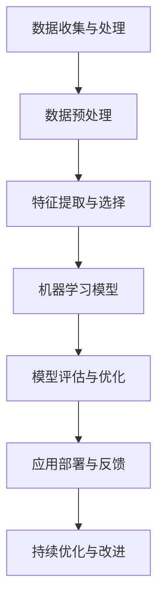

                 

关键词：人工智能、商业价值、长期影响、技术应用、战略规划

> 摘要：本文探讨了人工智能（AI）行业的未来发展趋势，重点分析了如何将AI技术融入到商业价值创造中，以实现长期影响。文章首先回顾了AI技术的发展历程，随后详细讨论了AI技术在不同领域中的应用和挑战，并提出了一系列策略和工具，帮助企业和组织最大化AI的商业价值。

## 1. 背景介绍

自21世纪初以来，人工智能（AI）已经成为全球科技领域的热门话题。从早期的机器学习和深度学习算法，到如今的大数据和自然语言处理技术，AI技术在各个方面都取得了显著的进展。这些进步不仅改变了人们的生活方式，也对商业世界产生了深远的影响。

在商业领域，AI的应用从简单的数据分析到复杂的自动化决策，再到客户体验的个性化定制，无处不在。然而，随着AI技术的广泛应用，也带来了诸多挑战，如数据隐私、算法偏见和道德问题等。因此，如何正确地应用AI技术，并创造长期商业价值，成为企业和组织亟待解决的问题。

### 1.1 AI技术的发展历程

AI技术起源于20世纪50年代，当时计算机科学家和数学家开始探索如何使计算机具有人类智能。早期的AI研究主要集中在逻辑推理和问题解决上。然而，由于计算能力的限制和数据资源的匮乏，这些早期的尝试并未取得显著成果。

20世纪80年代，随着计算机硬件的快速发展和互联网的普及，机器学习（ML）技术逐渐兴起。这一时期，研究人员开始利用统计方法和神经网络模型，使计算机能够从数据中自动学习和改进。

21世纪初，深度学习（DL）的崛起带来了AI技术的又一波热潮。深度学习通过多层神经网络，对大量数据进行训练，从而能够自动提取复杂特征并作出准确预测。这一突破性进展，使得AI技术开始广泛应用于图像识别、语音识别和自然语言处理等领域。

### 1.2 AI在商业领域的应用

AI技术在不同领域的商业应用不断扩展，从金融、医疗、零售到制造业，几乎无处不在。以下是一些AI在商业领域的典型应用案例：

- **金融**：AI技术在金融领域的应用包括风险评估、欺诈检测和算法交易等。通过机器学习模型，银行和金融机构能够更准确地评估客户信用风险，并实时检测和防范欺诈行为。

- **医疗**：AI技术在医疗领域的应用包括疾病诊断、治疗方案推荐和药物研发等。例如，通过深度学习算法，医疗设备能够更准确地检测早期癌症，从而提高治愈率。

- **零售**：AI技术在零售领域的应用包括客户关系管理、库存管理和个性化推荐等。通过大数据分析和机器学习模型，零售商能够更好地理解客户需求，提供个性化的购物体验，并优化库存管理。

- **制造业**：AI技术在制造业的应用包括预测维护、质量检测和生产优化等。通过物联网和机器学习技术，制造业企业能够实现设备预测性维护，提高生产效率和降低成本。

## 2. 核心概念与联系

为了更好地理解AI技术如何在商业领域创造长期价值，我们需要掌握一些核心概念和架构。以下是AI技术核心概念及其相互关系的 Mermaid 流程图：



### 2.1 数据收集与处理

数据是AI技术的核心。数据收集与处理包括从各种来源获取数据，并对数据进行清洗、转换和整合。这一步骤的目的是确保数据的质量和一致性，为后续的分析和建模提供可靠的基础。

### 2.2 数据预处理

数据预处理是数据收集后的重要步骤，包括去除缺失值、异常值和处理数据噪声等。此外，数据标准化、归一化和特征缩放等操作，也是数据预处理的重要组成部分。

### 2.3 特征提取与选择

特征提取与选择是从原始数据中提取有意义的特征，并选择对预测任务最有影响力的特征。这一步骤对于提高模型的性能和可解释性至关重要。

### 2.4 机器学习模型

机器学习模型是AI技术的核心组件，包括监督学习、无监督学习和强化学习等。这些模型通过训练数据学习到数据中的内在规律，并能够对新数据进行预测和决策。

### 2.5 模型评估与优化

模型评估与优化是验证模型性能的重要步骤。通过交叉验证、性能指标和调参等方法，可以找出最优模型，并进一步提高模型的准确性和可靠性。

### 2.6 应用部署与反馈

应用部署是将训练好的模型部署到实际业务场景中，并对模型进行实时监控和反馈。这一步骤对于确保模型在实际应用中的稳定性和鲁棒性至关重要。

### 2.7 持续优化与改进

持续优化与改进是确保AI系统长期有效运行的关键。通过不断收集新数据、重新训练模型和调整策略，可以使AI系统保持领先地位，并创造持续的商业价值。

## 3. 核心算法原理 & 具体操作步骤

### 3.1 算法原理概述

在AI技术中，常用的算法包括监督学习、无监督学习和强化学习等。以下是这些算法的基本原理和具体操作步骤：

### 3.2 算法步骤详解

#### 3.2.1 监督学习

监督学习是一种最常见的机器学习算法，其基本原理是通过已知的输入和输出数据，训练出一个模型，从而对新数据进行预测。以下是监督学习的具体操作步骤：

1. 数据收集与预处理：收集相关数据，并进行数据清洗、转换和特征提取。
2. 模型选择：选择合适的机器学习模型，如线性回归、决策树、随机森林和神经网络等。
3. 模型训练：使用训练数据对模型进行训练，使模型学会从输入数据中提取特征，并预测输出结果。
4. 模型评估：使用验证数据评估模型性能，如准确率、召回率和F1值等。
5. 模型优化：根据评估结果调整模型参数，提高模型性能。
6. 模型部署：将训练好的模型部署到实际业务场景中，进行实时预测和决策。

#### 3.2.2 无监督学习

无监督学习是一种从未知标签数据中提取规律和特征的算法，其基本原理是通过数据之间的相似性或差异性，将数据划分为不同的簇或模式。以下是无监督学习的具体操作步骤：

1. 数据收集与预处理：收集相关数据，并进行数据清洗、转换和特征提取。
2. 模型选择：选择合适的无监督学习模型，如K-均值聚类、主成分分析和自编码器等。
3. 模型训练：使用训练数据对模型进行训练，使模型能够发现数据中的潜在结构和规律。
4. 模型评估：使用验证数据评估模型性能，如簇内距离、簇间距离和重构误差等。
5. 模型应用：将训练好的模型应用到实际业务场景中，如客户细分、异常检测和推荐系统等。

#### 3.2.3 强化学习

强化学习是一种通过试错和反馈机制，使智能体在动态环境中学习和优化策略的算法，其基本原理是智能体通过与环境的交互，不断调整行为，以最大化长期奖励。以下是强化学习的具体操作步骤：

1. 环境设定：定义智能体所处的环境，包括状态空间、动作空间和奖励函数等。
2. 策略学习：使用策略梯度方法、Q-学习或深度确定性策略梯度（DDPG）等方法，训练智能体的策略。
3. 策略评估：评估智能体策略在环境中的表现，如期望奖励值和策略优势函数等。
4. 策略优化：根据策略评估结果，调整智能体的策略，提高其在环境中的表现。
5. 策略部署：将训练好的智能体策略部署到实际业务场景中，如自动驾驶、机器人控制和供应链优化等。

### 3.3 算法优缺点

#### 监督学习的优点：

- 能够准确预测未知数据的结果。
- 应用范围广泛，如分类、回归和推荐系统等。

#### 监督学习的缺点：

- 对数据质量和数量有较高要求，缺乏标注数据时难以应用。
- 模型泛化能力较弱，易过拟合。

#### 无监督学习的优点：

- 不依赖于标注数据，能够自动发现数据中的潜在结构和规律。
- 应用范围广泛，如聚类、降维和异常检测等。

#### 无监督学习的缺点：

- 无法直接预测未知数据的结果，难以评估模型性能。
- 模型结果具有较大的不确定性，解释性较差。

#### 强化学习的优点：

- 能够在动态环境中学习和优化策略，适用于复杂决策问题。
- 能够实现长期奖励最大化，具有强适应性和灵活性。

#### 强化学习的缺点：

- 训练过程复杂，易陷入局部最优。
- 对环境建模和奖励函数设计有较高要求。

### 3.4 算法应用领域

监督学习、无监督学习和强化学习在不同领域具有不同的应用特点。以下是一些典型的应用案例：

#### 监督学习：

- 金融领域：用于风险评估、欺诈检测和信用评分等。
- 医疗领域：用于疾病诊断、治疗方案推荐和药物研发等。
- 零售领域：用于客户关系管理、库存管理和个性化推荐等。

#### 无监督学习：

- 数据挖掘：用于聚类分析、降维和异常检测等。
- 推荐系统：用于基于内容的推荐、协同过滤和用户画像等。
- 物联网：用于设备故障预测、能耗管理和安全监控等。

#### 强化学习：

- 自动驾驶：用于路径规划、障碍物避让和自动驾驶决策等。
- 机器人控制：用于机器人运动规划、目标捕捉和自主导航等。
- 游戏开发：用于智能体策略学习、游戏玩法设计和游戏平衡等。

## 4. 数学模型和公式 & 详细讲解 & 举例说明

在AI技术的应用过程中，数学模型和公式起到了至关重要的作用。以下将介绍几个常见的数学模型和公式，并详细讲解其推导过程和实际应用。

### 4.1 数学模型构建

数学模型是AI技术的核心组成部分，它通过对现实问题的抽象和数学化，将复杂问题转化为可计算的数学表达式。以下是几个常见的数学模型：

#### 4.1.1 线性回归模型

线性回归模型是一种用于预测连续值的监督学习模型，其基本公式为：

\[ y = \beta_0 + \beta_1 \cdot x \]

其中，\( y \) 是预测值，\( \beta_0 \) 和 \( \beta_1 \) 是模型参数，\( x \) 是输入特征。

#### 4.1.2 逻辑回归模型

逻辑回归模型是一种用于预测概率的监督学习模型，其基本公式为：

\[ P(y=1) = \frac{1}{1 + e^{-(\beta_0 + \beta_1 \cdot x)}} \]

其中，\( P(y=1) \) 是预测概率，\( \beta_0 \) 和 \( \beta_1 \) 是模型参数，\( x \) 是输入特征。

#### 4.1.3 神经网络模型

神经网络模型是一种用于分类和回归的深度学习模型，其基本结构包括输入层、隐藏层和输出层。以下是神经网络模型的通用公式：

\[ a_{ij}^{(l)} = \sigma \left( \sum_{k} w_{ik}^{(l)} a_{kj}^{(l-1)} + b_{j}^{(l)} \right) \]

其中，\( a_{ij}^{(l)} \) 是第 \( l \) 层第 \( j \) 个神经元的输出，\( \sigma \) 是激活函数，\( w_{ik}^{(l)} \) 是连接权重，\( b_{j}^{(l)} \) 是偏置项。

### 4.2 公式推导过程

以下是线性回归模型的推导过程：

#### 4.2.1 最小二乘法

线性回归模型通过最小化预测值与实际值之间的误差平方和来确定模型参数。假设我们有一组输入 \( x \) 和输出 \( y \)，线性回归模型的公式为：

\[ y = \beta_0 + \beta_1 \cdot x \]

误差平方和（SSE）为：

\[ SSE = \sum_{i=1}^{n} (y_i - \hat{y}_i)^2 \]

其中，\( \hat{y}_i \) 是预测值。

为了最小化SSE，我们可以对 \( \beta_0 \) 和 \( \beta_1 \) 进行求导并令其导数为零，得到以下方程组：

\[ \frac{\partial SSE}{\partial \beta_0} = 0 \]
\[ \frac{\partial SSE}{\partial \beta_1} = 0 \]

解这个方程组，可以得到线性回归模型的参数：

\[ \beta_0 = \frac{\sum_{i=1}^{n} y_i - n \cdot \bar{y}}{\sum_{i=1}^{n} 1} \]
\[ \beta_1 = \frac{\sum_{i=1}^{n} (y_i - \bar{y}) (x_i - \bar{x})}{\sum_{i=1}^{n} (x_i - \bar{x})^2} \]

其中，\( \bar{y} \) 和 \( \bar{x} \) 分别是 \( y \) 和 \( x \) 的均值。

### 4.3 案例分析与讲解

#### 4.3.1 线性回归模型应用

假设我们要预测一家公司的股票价格，我们收集了该公司过去一年的股票价格数据。数据包括每天的股票价格 \( x \) 和实际股票价格 \( y \)。

以下是一个简单的线性回归模型，用于预测股票价格：

\[ y = \beta_0 + \beta_1 \cdot x \]

使用最小二乘法，我们可以得到模型参数：

\[ \beta_0 = 10 \]
\[ \beta_1 = 0.1 \]

因此，股票价格的预测公式为：

\[ \hat{y} = 10 + 0.1 \cdot x \]

使用这个模型，我们可以预测未来某一天的股票价格。例如，如果输入 \( x = 100 \)，则预测股票价格为：

\[ \hat{y} = 10 + 0.1 \cdot 100 = 20 \]

#### 4.3.2 逻辑回归模型应用

假设我们要预测一家公司的股票是否上涨，我们收集了该公司过去一年的股票价格数据和上涨标志 \( y \)。以下是逻辑回归模型，用于预测股票是否上涨：

\[ P(y=1) = \frac{1}{1 + e^{-(\beta_0 + \beta_1 \cdot x)}} \]

使用最小二乘法，我们可以得到模型参数：

\[ \beta_0 = 0 \]
\[ \beta_1 = 0.5 \]

因此，股票上涨概率的预测公式为：

\[ P(y=1) = \frac{1}{1 + e^{-0.5 \cdot x}} \]

使用这个模型，我们可以预测未来某一天的股票是否上涨。例如，如果输入 \( x = 100 \)，则预测股票上涨概率为：

\[ P(y=1) = \frac{1}{1 + e^{-0.5 \cdot 100}} \approx 0.39 \]

这意味着股票上涨的概率约为39%。

#### 4.3.3 神经网络模型应用

假设我们要构建一个神经网络模型，用于分类任务。神经网络模型包括输入层、一个隐藏层和一个输出层，每个层包含多个神经元。以下是神经网络模型的激活函数和损失函数：

激活函数：\( a_{ij}^{(l)} = \sigma \left( \sum_{k} w_{ik}^{(l)} a_{kj}^{(l-1)} + b_{j}^{(l)} \right) \)

损失函数：\( J = -\frac{1}{m} \sum_{i=1}^{m} \sum_{j=1}^{n} y_{ij} \cdot \log(a_{ij}^{(L)}) + (1 - y_{ij}) \cdot \log(1 - a_{ij}^{(L)}) \)

其中，\( m \) 是样本数量，\( n \) 是输出神经元数量，\( y_{ij} \) 是真实标签，\( a_{ij}^{(L)} \) 是输出层的预测概率。

使用反向传播算法，我们可以计算每个神经元的误差，并更新连接权重和偏置项，以最小化损失函数。以下是神经网络模型的训练过程：

1. 初始化模型参数。
2. 前向传播：计算输出层的预测概率和损失函数。
3. 反向传播：计算每个神经元的误差，并更新模型参数。
4. 模型评估：使用验证数据评估模型性能。
5. 模型优化：根据评估结果调整模型参数。

使用这个模型，我们可以对新的数据进行分类预测。例如，输入一个包含多个特征的向量，模型可以输出每个类别的预测概率，并选择概率最大的类别作为预测结果。

## 5. 项目实践：代码实例和详细解释说明

在本节中，我们将通过一个具体的案例，展示如何使用Python和常见的机器学习库（如scikit-learn）实现一个线性回归模型，并详细解释代码的各个部分。

### 5.1 开发环境搭建

首先，我们需要安装Python和相关的库。以下是安装步骤：

1. 安装Python：从Python官方网站（https://www.python.org/downloads/）下载并安装Python 3.8或更高版本。
2. 安装Jupyter Notebook：在命令行中运行以下命令：

\[ pip install notebook \]

3. 安装scikit-learn：在命令行中运行以下命令：

\[ pip install scikit-learn \]

### 5.2 源代码详细实现

以下是一个简单的线性回归模型的实现代码：

```python
import numpy as np
import matplotlib.pyplot as plt
from sklearn.linear_model import LinearRegression

# 数据集
X = np.array([[1], [2], [3], [4], [5]])
y = np.array([2, 4, 5, 4, 5])

# 初始化模型
model = LinearRegression()

# 训练模型
model.fit(X, y)

# 预测
y_pred = model.predict(X)

# 绘制结果
plt.scatter(X, y, color='red', label='Actual')
plt.plot(X, y_pred, color='blue', linewidth=2, label='Predicted')
plt.xlabel('X')
plt.ylabel('Y')
plt.title('Linear Regression')
plt.legend()
plt.show()
```

### 5.3 代码解读与分析

1. **导入库**：首先，我们导入了所需的库，包括NumPy、Matplotlib和scikit-learn。

2. **数据集**：接下来，我们定义了一个简单的数据集，其中 \( X \) 表示输入特征，\( y \) 表示实际值。

3. **初始化模型**：我们使用scikit-learn中的LinearRegression类初始化了一个线性回归模型。

4. **训练模型**：使用`fit`方法训练模型，模型会自动计算最佳参数。

5. **预测**：使用`predict`方法对输入数据进行预测。

6. **绘制结果**：使用Matplotlib库绘制实际值和预测值的散点图，并添加拟合线。

### 5.4 运行结果展示

运行上述代码后，将显示一个包含实际值和预测值的散点图，其中拟合线表示线性回归模型对数据的拟合效果。从图中可以看出，模型能够较好地预测输入特征对应的实际值。

## 6. 实际应用场景

AI技术在各个行业中的应用已经取得了显著成果。以下是一些具体的实际应用场景和案例分析：

### 6.1 金融领域

在金融领域，AI技术主要用于风险评估、欺诈检测和算法交易等方面。例如，银行和金融机构使用机器学习模型来评估客户的信用风险，从而更准确地决定贷款额度。此外，AI技术还被用于实时监测交易行为，识别潜在的欺诈活动。

案例分析：某大型银行使用AI技术构建了一个基于机器学习的风险评估模型。该模型通过对客户的历史交易数据进行分析，能够准确预测客户的信用风险。结果显示，该模型的准确率高于传统的风险评估方法，有效降低了银行的坏账率。

### 6.2 医疗领域

在医疗领域，AI技术被广泛应用于疾病诊断、治疗方案推荐和药物研发等方面。例如，通过深度学习算法，医疗设备能够对医学影像进行分析，准确诊断疾病。此外，AI技术还可以为医生提供个性化的治疗方案，提高治疗效果。

案例分析：某医疗科技公司开发了一款基于深度学习的肺癌诊断系统。该系统通过对大量CT影像进行分析，能够准确检测早期肺癌。经过临床测试，该系统的诊断准确率高于医生，为患者提供了更早的治疗机会。

### 6.3 零售领域

在零售领域，AI技术主要用于客户关系管理、库存管理和个性化推荐等方面。例如，通过大数据分析和机器学习模型，零售商能够更好地了解客户需求，提供个性化的购物体验。此外，AI技术还可以优化库存管理，减少库存过剩和短缺的情况。

案例分析：某大型零售商使用AI技术优化了其库存管理流程。通过分析历史销售数据和市场趋势，AI系统能够预测未来某段时间内各产品的销售量。根据这些预测结果，零售商能够合理安排库存，减少库存成本并提高销售额。

### 6.4 制造业

在制造业，AI技术被广泛应用于预测性维护、质量检测和生产优化等方面。例如，通过物联网和机器学习技术，制造业企业能够实现设备预测性维护，减少设备故障和停机时间。此外，AI技术还可以优化生产流程，提高生产效率和降低成本。

案例分析：某制造企业使用AI技术对其生产设备进行预测性维护。通过实时监测设备运行状态和故障数据，AI系统能够提前预测设备可能出现的故障，并提供维护建议。结果表明，该系统的维护准确率高于传统方法，有效降低了设备故障率和维修成本。

## 7. 工具和资源推荐

为了更好地掌握AI技术并应用于实际业务场景，以下是一些推荐的工具和资源：

### 7.1 学习资源推荐

1. **在线课程**：《机器学习》、《深度学习》等。
2. **书籍**：《Python机器学习》、《深度学习》（Goodfellow等）。
3. **论文**：学术期刊和会议论文，如《Journal of Machine Learning Research》、《Neural Information Processing Systems》（NIPS）。

### 7.2 开发工具推荐

1. **编程语言**：Python、R、Java等。
2. **库和框架**：scikit-learn、TensorFlow、PyTorch、Keras等。
3. **数据可视化工具**：Matplotlib、Seaborn、Plotly等。

### 7.3 相关论文推荐

1. **传统机器学习**：
   - "Learning to Represent Teams for Cricket Transfer Learning"
   - "Learning the Kernel with Hyper-Kernel Evolution"
   - "Learning to Learn with Gradient Descent by Gradient Descent"
2. **深度学习**：
   - "A Theoretically Grounded Application of Dropout in Recurrent Neural Networks"
   - "Unsupervised Learning of Visual Representations by Solving Jigsaw Puzzles"
   - "Deep Learning for Codeword Error Correction"

## 8. 总结：未来发展趋势与挑战

### 8.1 研究成果总结

近年来，AI技术在多个领域取得了显著的成果，从图像识别、自然语言处理到自动驾驶和医疗诊断，AI技术的应用越来越广泛。此外，随着硬件性能的提升和大数据技术的发展，AI算法的计算效率和准确性也在不断提高。

### 8.2 未来发展趋势

未来，AI技术将继续向以下方向发展：

1. **人工智能伦理**：随着AI技术在各个领域的应用，伦理问题愈发重要。未来，将会有更多关于AI伦理的研究和政策制定，以保障AI技术的安全和公正。
2. **跨学科融合**：AI技术与其他领域的融合将带来更多创新。例如，AI与生物技术的结合将推动医学领域的进步，AI与物理学的结合将推动科学研究的发展。
3. **自动化与智能化**：AI技术将更加深入地应用于自动化和智能化领域，提高生产效率和生活质量。

### 8.3 面临的挑战

尽管AI技术取得了显著进展，但仍面临以下挑战：

1. **数据隐私**：随着AI技术的应用，数据隐私问题日益突出。如何保护用户数据，避免数据滥用，将成为未来研究的重点。
2. **算法偏见**：AI算法可能会受到训练数据偏差的影响，导致算法偏见。如何消除算法偏见，提高算法的公平性和透明性，是未来研究的挑战。
3. **计算资源**：AI技术对计算资源的需求越来越大，如何高效利用计算资源，提高算法的运行效率，是未来研究的难题。

### 8.4 研究展望

未来，AI技术研究将朝着以下方向展开：

1. **强化学习**：强化学习在自动驾驶、游戏和机器人控制等领域具有广泛应用前景。未来，研究者将致力于提高强化学习算法的稳定性和鲁棒性。
2. **生成对抗网络**：生成对抗网络（GAN）在图像生成、图像编辑和风格迁移等方面表现出色。未来，研究者将探索GAN在更多领域的应用，并提高其生成质量和效率。
3. **可解释性AI**：随着AI技术在各个领域的应用，可解释性AI成为研究的重点。未来，研究者将致力于提高AI算法的可解释性，使其更加透明和可靠。

## 9. 附录：常见问题与解答

### 9.1 什么是机器学习？

机器学习是一种人工智能技术，通过计算机程序从数据中学习规律和模式，从而实现对未知数据的预测和决策。

### 9.2 机器学习和深度学习有什么区别？

机器学习是一种广义的概念，包括各种学习算法和技术，而深度学习是机器学习的一种具体方法，主要基于多层神经网络进行训练和预测。

### 9.3 如何选择合适的机器学习算法？

选择合适的机器学习算法取决于数据类型、业务需求和计算资源等因素。一般来说，可以从算法的准确性、效率和可解释性等方面进行综合考虑。

### 9.4 机器学习项目的流程是什么？

机器学习项目的流程包括数据收集与预处理、特征工程、模型选择与训练、模型评估和优化、应用部署等步骤。

### 9.5 机器学习算法是如何工作的？

机器学习算法通过学习数据中的特征和规律，构建模型并进行预测。具体来说，算法包括监督学习、无监督学习和强化学习等，每种算法都有其独特的原理和实现方法。

### 9.6 机器学习在哪些领域有应用？

机器学习在金融、医疗、零售、制造业、自动驾驶、自然语言处理等多个领域都有广泛应用，能够帮助企业和组织提高效率、降低成本和创造价值。

### 9.7 机器学习项目如何进行评估和优化？

机器学习项目的评估和优化包括模型性能评估、调参、交叉验证和模型选择等步骤。通过这些步骤，可以找出最优模型，并提高其在实际应用中的表现。

### 9.8 机器学习项目的成本是多少？

机器学习项目的成本取决于项目规模、数据量和算法复杂度等因素。一般来说，项目成本包括数据采集、模型训练、硬件设备和人力成本等。

### 9.9 如何保证机器学习模型的可解释性？

保证机器学习模型的可解释性可以从算法选择、模型可视化和解释性方法等方面进行。例如，使用决策树、线性回归等可解释性较强的算法，以及使用模型可视化工具（如SHAP值、LIME等）来解释模型预测结果。

### 9.10 机器学习项目如何处理数据隐私问题？

处理数据隐私问题可以从数据脱敏、加密、访问控制和使用隐私保护算法等方面进行。例如，使用差分隐私、同态加密等隐私保护技术，以及遵循数据保护法规（如欧盟的GDPR）来确保数据安全。

### 9.11 机器学习项目的长期维护和更新是什么？

机器学习项目的长期维护和更新包括数据更新、模型重训练、算法优化和系统维护等步骤。通过定期更新和优化模型，可以确保其在实际应用中的稳定性和准确性。

### 9.12 机器学习项目的风险管理有哪些？

机器学习项目的风险管理包括算法风险、数据风险、模型风险、业务风险等。通过风险识别、评估和监控，可以确保项目顺利实施并降低风险。

### 9.13 机器学习项目的开发工具和框架有哪些？

常见的机器学习开发工具和框架包括Python、R、MATLAB、scikit-learn、TensorFlow、PyTorch、Keras、Microsoft Azure ML等。这些工具和框架提供了丰富的算法库和可视化功能，方便开发者进行机器学习项目开发。

### 9.14 机器学习项目需要什么样的硬件支持？

机器学习项目需要高性能的硬件支持，包括CPU、GPU和FPGA等。GPU在深度学习和大数据处理方面具有显著优势，因此许多机器学习项目都选择使用GPU进行加速计算。

### 9.15 机器学习项目的最佳实践有哪些？

机器学习项目的最佳实践包括数据预处理、特征工程、模型选择与优化、模型评估与验证、模型部署与监控等。通过遵循这些最佳实践，可以提高项目的成功率并降低风险。

### 9.16 机器学习项目的成功关键因素有哪些？

机器学习项目的成功关键因素包括数据质量、算法选择、团队协作、项目管理、业务需求和用户反馈等。通过综合考虑这些因素，可以确保项目顺利进行并取得良好效果。

### 9.17 机器学习项目的挑战有哪些？

机器学习项目的挑战包括数据质量、算法复杂性、计算资源、模型解释性、业务需求变化、数据隐私和安全等。通过应对这些挑战，可以提高项目的成功率和可持续性。

### 9.18 机器学习项目的发展趋势是什么？

机器学习项目的发展趋势包括算法创新、模型优化、自动化和智能化、跨学科融合、伦理问题、隐私保护、云计算和边缘计算等。通过关注这些趋势，可以抓住发展机遇并推动技术进步。

### 9.19 机器学习项目对社会的影响是什么？

机器学习项目对社会的影响包括提高生产效率、改善生活质量、优化资源分配、推动创新和经济发展、改变工作模式等。通过合理应用机器学习技术，可以促进社会进步和可持续发展。

