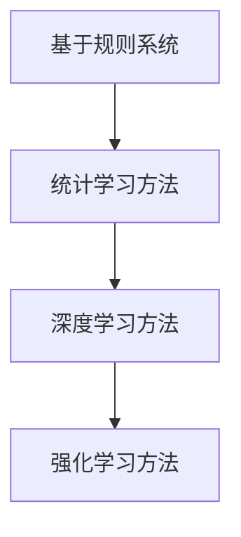

                 

 在人工智能（AI）的不断发展中，我们见证了AI角色从简单的规则跟随者到能够与人类进行复杂交互的智能体的演变。本文将探讨AI角色在长期互动过程中的人物发展，以及这一过程中涉及的几个关键概念和算法。我们将从背景介绍开始，逐步深入到核心概念、算法原理、数学模型、项目实践以及实际应用场景，并最终展望未来发展趋势和面临的挑战。

## 关键词

- 人工智能（AI）
- 角色演化
- 长期互动
- 数学模型
- 算法

## 摘要

本文探讨了人工智能角色在长期互动中的人物发展过程。我们首先回顾了AI角色的历史演变，接着详细介绍了核心概念，包括AI角色的定义、发展历程和关键算法。随后，我们讨论了数学模型和公式，并通过具体案例进行讲解。接下来，我们提供了一个项目实践实例，展示了AI角色的实际应用。最后，我们分析了AI角色在各个领域的应用场景，并展望了其未来的发展趋势和挑战。

## 1. 背景介绍

人工智能（AI）的发展始于20世纪50年代，最初的目标是创造出能够执行复杂任务的智能体。在早期，AI角色主要是基于规则的专家系统，它们能够处理特定领域的问题，但缺乏通用性。随着时间推移，AI角色经历了从规则系统到统计学习再到深度学习的演变。

早期的AI角色通常是静态的，只能执行预先定义的任务。然而，随着机器学习和自然语言处理技术的发展，AI角色开始具备了一定的适应性。现代AI角色不仅能够处理复杂的任务，还能够与人类进行自然互动，甚至在某些领域超过了人类的表现。

在长期互动中，AI角色需要不断学习和适应，以更好地服务于人类。这一过程涉及到多个方面的技术，包括机器学习、深度学习、自然语言处理和强化学习等。本文将重点讨论这些技术的应用，以及AI角色在长期互动中的人物发展。

## 2. 核心概念与联系

### 2.1 AI角色的定义

AI角色是指具有某种智能行为的人工智能实体，它们能够执行特定的任务，并与环境进行交互。这些角色可以是简单的任务执行者，也可以是具有情感和自我意识的复杂实体。

### 2.2 AI角色的演化历程

AI角色的演化历程可以分为以下几个阶段：

1. **基于规则的系统**：最早的AI角色是基于规则的专家系统，它们通过定义一系列规则来执行任务。
2. **统计学习方法**：随着机器学习技术的发展，AI角色开始采用统计学习方法，如决策树、支持向量机和神经网络，以提高其适应性和泛化能力。
3. **深度学习方法**：深度学习技术的出现使得AI角色能够处理更复杂的问题，并从大量数据中学习。
4. **强化学习方法**：强化学习使得AI角色能够通过与环境的交互学习，并不断优化其行为。

### 2.3 核心算法

AI角色的核心算法包括：

1. **机器学习算法**：如线性回归、逻辑回归、决策树、随机森林和神经网络等。
2. **深度学习算法**：如卷积神经网络（CNN）、循环神经网络（RNN）和变换器（Transformer）等。
3. **自然语言处理算法**：如词向量、序列模型和语言模型等。
4. **强化学习算法**：如Q-learning、SARSA和深度确定性策略梯度（DDPG）等。

下面是AI角色演化的Mermaid流程图：



## 3. 核心算法原理 & 具体操作步骤

### 3.1 算法原理概述

在这一部分，我们将简要介绍几种核心算法的基本原理。

#### 3.1.1 机器学习算法

机器学习算法是基于数据的学习方法，它们通过训练数据来构建模型，并使用该模型进行预测或分类。常见的机器学习算法包括线性回归、逻辑回归、决策树、随机森林和神经网络等。

#### 3.1.2 深度学习算法

深度学习算法是一种基于多层神经网络的学习方法，它通过模拟人脑的神经元连接来处理数据。深度学习算法在图像识别、语音识别和自然语言处理等领域取得了显著成果。常见的深度学习算法包括卷积神经网络（CNN）、循环神经网络（RNN）和变换器（Transformer）等。

#### 3.1.3 自然语言处理算法

自然语言处理（NLP）算法旨在使计算机理解和处理自然语言。常见的NLP算法包括词向量、序列模型和语言模型等。

#### 3.1.4 强化学习算法

强化学习算法是一种通过与环境交互来学习最优策略的方法。它通过奖励和惩罚来引导AI角色进行行为选择，从而实现目标。常见的强化学习算法包括Q-learning、SARSA和深度确定性策略梯度（DDPG）等。

### 3.2 算法步骤详解

#### 3.2.1 机器学习算法步骤

1. **数据收集**：收集训练数据，包括特征和标签。
2. **数据预处理**：对数据进行清洗、归一化和转换等操作。
3. **模型选择**：选择合适的模型，如线性回归、逻辑回归等。
4. **模型训练**：使用训练数据来训练模型。
5. **模型评估**：使用验证数据来评估模型性能。
6. **模型优化**：根据评估结果对模型进行优化。

#### 3.2.2 深度学习算法步骤

1. **数据收集**：收集大量的标注数据。
2. **数据预处理**：对图像和文本进行预处理，如缩放、裁剪、归一化等。
3. **模型构建**：构建深度学习模型，如CNN、RNN等。
4. **模型训练**：使用训练数据来训练模型。
5. **模型评估**：使用验证数据来评估模型性能。
6. **模型优化**：根据评估结果对模型进行优化。

#### 3.2.3 自然语言处理算法步骤

1. **数据收集**：收集大量的文本数据。
2. **数据预处理**：对文本进行预处理，如分词、词性标注等。
3. **模型选择**：选择合适的NLP模型，如词向量、序列模型等。
4. **模型训练**：使用训练数据来训练模型。
5. **模型评估**：使用验证数据来评估模型性能。
6. **模型优化**：根据评估结果对模型进行优化。

#### 3.2.4 强化学习算法步骤

1. **环境搭建**：搭建模拟环境，定义状态和动作空间。
2. **状态初始化**：初始化环境状态。
3. **策略选择**：选择策略，如Q-learning、SARSA等。
4. **行为选择**：根据策略选择行为。
5. **环境反馈**：根据行为选择接收环境反馈。
6. **策略更新**：根据反馈更新策略。

### 3.3 算法优缺点

#### 3.3.1 机器学习算法

**优点**：

- **高效性**：机器学习算法能够在大量数据上进行快速训练和预测。
- **灵活性**：机器学习算法能够处理各种类型的数据，并适应不同的任务。

**缺点**：

- **数据依赖性**：机器学习算法的性能高度依赖数据的质量和数量。
- **过拟合风险**：当训练数据有限时，机器学习算法可能会过拟合，导致在测试数据上表现不佳。

#### 3.3.2 深度学习算法

**优点**：

- **强大表现**：深度学习算法在图像识别、语音识别和自然语言处理等领域取得了显著的成果。
- **自适应能力**：深度学习算法能够通过自动调整网络结构和参数来适应不同的任务。

**缺点**：

- **计算成本高**：深度学习算法通常需要大量的计算资源和时间。
- **数据依赖性**：深度学习算法的性能同样高度依赖数据的质量和数量。

#### 3.3.3 自然语言处理算法

**优点**：

- **自然交互**：自然语言处理算法能够实现人与机器的自然交互，提高用户体验。
- **多功能性**：自然语言处理算法可以应用于文本分类、命名实体识别、情感分析等多种任务。

**缺点**：

- **数据预处理复杂**：自然语言处理算法通常需要大量的数据预处理工作，如分词、词性标注等。
- **性能提升困难**：自然语言处理算法的性能提升往往依赖于大规模数据和计算资源。

#### 3.3.4 强化学习算法

**优点**：

- **自适应性强**：强化学习算法能够通过与环境交互来不断优化策略。
- **灵活性高**：强化学习算法能够处理复杂的动态环境。

**缺点**：

- **收敛速度慢**：强化学习算法通常需要大量的交互来收敛到最优策略。
- **数据依赖性**：强化学习算法的性能同样高度依赖数据的质量和数量。

### 3.4 算法应用领域

#### 3.4.1 机器学习算法

机器学习算法广泛应用于各种领域，如图像识别、自然语言处理、推荐系统和金融分析等。

- **图像识别**：机器学习算法能够自动识别图像中的对象和场景，应用于人脸识别、自动驾驶等。
- **自然语言处理**：机器学习算法能够处理文本数据，用于文本分类、情感分析和机器翻译等。
- **推荐系统**：机器学习算法能够根据用户的历史行为和偏好来推荐商品和服务。
- **金融分析**：机器学习算法能够预测金融市场走势，用于股票交易和风险管理等。

#### 3.4.2 深度学习算法

深度学习算法在计算机视觉、语音识别和自然语言处理等领域取得了显著的成果。

- **计算机视觉**：深度学习算法能够实现图像和视频的自动识别和分析，应用于人脸识别、物体检测和视频监控等。
- **语音识别**：深度学习算法能够将语音信号转换为文本，应用于语音助手、智能客服和语音翻译等。
- **自然语言处理**：深度学习算法能够处理文本数据，用于文本分类、命名实体识别和情感分析等。

#### 3.4.3 自然语言处理算法

自然语言处理算法广泛应用于文本分类、情感分析和机器翻译等领域。

- **文本分类**：自然语言处理算法能够自动分类文本，用于新闻分类、垃圾邮件过滤等。
- **情感分析**：自然语言处理算法能够分析文本的情感倾向，用于用户反馈分析、舆情监测等。
- **机器翻译**：自然语言处理算法能够将一种语言的文本翻译成另一种语言，用于跨语言交流、多语言文档管理等。

#### 3.4.4 强化学习算法

强化学习算法在游戏、机器人控制和自动驾驶等领域取得了显著的成果。

- **游戏**：强化学习算法能够实现智能体的自主学习和游戏策略优化，应用于游戏AI和电子竞技等。
- **机器人控制**：强化学习算法能够控制机器人完成复杂的任务，如导航、抓取和交互等。
- **自动驾驶**：强化学习算法能够实现自动驾驶汽车的自适应驾驶策略，提高行车安全。

## 4. 数学模型和公式 & 详细讲解 & 举例说明

在这一部分，我们将讨论AI角色演化过程中涉及的数学模型和公式，并通过具体案例进行说明。

### 4.1 数学模型构建

在AI角色演化过程中，常用的数学模型包括线性回归、逻辑回归、神经网络、变换器和强化学习中的Q-learning等。

#### 4.1.1 线性回归

线性回归模型是最基本的机器学习模型之一，它通过拟合一条直线来预测连续值。其公式如下：

$$
y = w_0 + w_1 \cdot x
$$

其中，$y$ 是预测值，$x$ 是输入特征，$w_0$ 和 $w_1$ 是模型的参数。

#### 4.1.2 逻辑回归

逻辑回归是一种用于预测概率的分类模型，它通过拟合一条曲线来预测离散值。其公式如下：

$$
P(y=1) = \frac{1}{1 + e^{-(w_0 + w_1 \cdot x)}}
$$

其中，$P(y=1)$ 是预测概率，$w_0$ 和 $w_1$ 是模型的参数。

#### 4.1.3 神经网络

神经网络是一种模拟人脑神经元连接的机器学习模型，它由多个层次组成，包括输入层、隐藏层和输出层。其基本公式如下：

$$
a_{ij}^{(l)} = \sigma(z_{ij}^{(l)})
$$

$$
z_{ij}^{(l)} = \sum_{k=1}^{n} w_{ik}^{(l-1)} a_{kj}^{(l-1)} + b_j^{(l)}
$$

其中，$a_{ij}^{(l)}$ 是第$l$层的第$i$个神经元的激活值，$\sigma$ 是激活函数，$z_{ij}^{(l)}$ 是第$l$层的第$i$个神经元的输入值，$w_{ik}^{(l-1)}$ 和 $b_j^{(l)}$ 是模型的参数。

#### 4.1.4 变换器

变换器是一种用于序列建模的深度学习模型，它通过自注意力机制来捕捉序列中的长距离依赖关系。其基本公式如下：

$$
Q = KQ + V
$$

$$
\text{softmax}(QK^T) = \text{Attention}(Q, K, V)
$$

$$
\text{Output} = V \text{softmax}(QK^T)
$$

其中，$Q$、$K$ 和 $V$ 是变换器的输入序列、键序列和值序列，$\text{softmax}$ 是软最大化函数，$\text{Attention}$ 是自注意力机制，$\text{Output}$ 是输出序列。

#### 4.1.5 Q-learning

Q-learning是一种用于强化学习的算法，它通过不断更新策略来优化行为。其基本公式如下：

$$
Q(s, a) = \frac{1}{N(s, a)} \sum_{s' \in S} (r(s, a, s') + \gamma \max_{a' \in A} Q(s', a'))
$$

其中，$Q(s, a)$ 是状态$s$下动作$a$的值函数，$N(s, a)$ 是状态$s$下动作$a$的次数，$r(s, a, s')$ 是立即奖励，$\gamma$ 是折扣因子，$S$ 和 $A$ 分别是状态集合和动作集合。

### 4.2 公式推导过程

在本节中，我们将分别对线性回归、逻辑回归、神经网络和强化学习的公式进行推导。

#### 4.2.1 线性回归

线性回归的推导相对简单，我们假设数据满足线性关系，即：

$$
y = \beta_0 + \beta_1 \cdot x
$$

其中，$\beta_0$ 和 $\beta_1$ 分别是截距和斜率。

为了求解$\beta_0$ 和 $\beta_1$，我们使用最小二乘法，即求解以下方程组：

$$
\min_{\beta_0, \beta_1} \sum_{i=1}^{n} (y_i - \beta_0 - \beta_1 \cdot x_i)^2
$$

通过求导并令导数为零，我们可以得到：

$$
\frac{\partial}{\partial \beta_0} \sum_{i=1}^{n} (y_i - \beta_0 - \beta_1 \cdot x_i)^2 = 0
$$

$$
\frac{\partial}{\partial \beta_1} \sum_{i=1}^{n} (y_i - \beta_0 - \beta_1 \cdot x_i)^2 = 0
$$

解得：

$$
\beta_0 = \frac{1}{n} \sum_{i=1}^{n} y_i - \beta_1 \cdot \frac{1}{n} \sum_{i=1}^{n} x_i
$$

$$
\beta_1 = \frac{1}{n} \sum_{i=1}^{n} (x_i - \bar{x}) (y_i - \bar{y})
$$

其中，$\bar{x}$ 和 $\bar{y}$ 分别是$x$ 和 $y$ 的均值。

#### 4.2.2 逻辑回归

逻辑回归的推导基于对数似然函数。假设数据满足伯努利分布，即：

$$
P(y=1 | x; \beta_0, \beta_1) = \frac{1}{1 + e^{-(\beta_0 + \beta_1 \cdot x)}}
$$

其中，$\beta_0$ 和 $\beta_1$ 分别是截距和斜率。

对数似然函数为：

$$
\ell(\beta_0, \beta_1) = \sum_{i=1}^{n} y_i \log P(y=1 | x_i; \beta_0, \beta_1) + (1 - y_i) \log (1 - P(y=1 | x_i; \beta_0, \beta_1))
$$

为了求解$\beta_0$ 和 $\beta_1$，我们使用梯度下降法，即求解以下方程组：

$$
\frac{\partial \ell}{\partial \beta_0} = 0
$$

$$
\frac{\partial \ell}{\partial \beta_1} = 0
$$

通过求导并令导数为零，我们可以得到：

$$
\frac{\partial \ell}{\partial \beta_0} = \sum_{i=1}^{n} y_i (1 - P(y=1 | x_i; \beta_0, \beta_1))
$$

$$
\frac{\partial \ell}{\partial \beta_1} = \sum_{i=1}^{n} (y_i - P(y=1 | x_i; \beta_0, \beta_1)) \cdot x_i
$$

解得：

$$
\beta_0 = \frac{1}{n} \sum_{i=1}^{n} y_i - \frac{1}{n} \sum_{i=1}^{n} P(y=1 | x_i; \beta_0, \beta_1)
$$

$$
\beta_1 = \frac{1}{n} \sum_{i=1}^{n} (y_i - P(y=1 | x_i; \beta_0, \beta_1)) \cdot x_i
$$

#### 4.2.3 神经网络

神经网络的推导较为复杂，我们以一个简单的单层神经网络为例进行说明。

假设输入层有 $x_1, x_2, ..., x_n$ 个特征，隐藏层有 $h_1, h_2, ..., h_m$ 个神经元，输出层有 $y_1, y_2, ..., y_k$ 个神经元。网络的参数包括输入层的权重 $W^{(1)}_{ij}$、隐藏层的权重 $W^{(2)}_{ij}$ 和输出层的权重 $W^{(3)}_{ij}$，以及偏置 $b^{(1)}_j, b^{(2)}_j, b^{(3)}_j$。

隐藏层的激活函数为 $\sigma(z) = \frac{1}{1 + e^{-z}}$，输出层的激活函数为 $\sigma(z) = z$。

网络的输出为：

$$
y_j = \sum_{i=1}^{n} W^{(3)}_{ij} \cdot \sigma(W^{(2)}_{ij} \cdot x_i + b^{(2)}_j) + b^{(3)}_j
$$

为了求解网络的参数，我们使用反向传播算法。具体步骤如下：

1. **前向传播**：计算输入层、隐藏层和输出层的激活值。
2. **计算损失函数**：计算输出层的预测值和实际值之间的差距。
3. **反向传播**：计算每个参数的梯度。
4. **更新参数**：使用梯度下降法更新参数。

通过多次迭代，网络的参数会逐渐收敛到最优值。

#### 4.2.4 Q-learning

Q-learning的推导基于马尔可夫决策过程（MDP）。假设环境状态集合为 $S$，动作集合为 $A$，状态值函数为 $Q(s, a)$，策略为 $\pi(a | s)$。

Q-learning的目标是求解最优策略，使得状态值函数最大化，即：

$$
\pi^*(a | s) = \arg\max_{a \in A} Q(s, a)
$$

Q-learning的更新公式为：

$$
Q(s, a) \leftarrow Q(s, a) + \alpha [r(s, a, s') + \gamma \max_{a' \in A} Q(s', a') - Q(s, a)]
$$

其中，$\alpha$ 是学习率，$r(s, a, s')$ 是立即奖励，$\gamma$ 是折扣因子。

通过不断更新Q值，Q-learning可以收敛到最优策略。

### 4.3 案例分析与讲解

在本节中，我们将通过一个具体案例来说明数学模型在实际应用中的推导和使用。

#### 4.3.1 数据集介绍

我们使用一个简单的二分类问题作为案例，数据集包含100个样本，每个样本有两个特征 $x_1$ 和 $x_2$，以及一个标签 $y$，其中 $y$ 的取值为 0 或 1。

数据集的样本分布如下：

| 特征 $x_1$ | 特征 $x_2$ | 标签 $y$ |
| :----: | :----: | :----: |
| 1 | 2 | 0 |
| 2 | 3 | 0 |
| 3 | 4 | 1 |
| 4 | 5 | 1 |
| ... | ... | ... |
| 97 | 98 | 1 |
| 98 | 99 | 1 |
| 99 | 100 | 0 |

#### 4.3.2 线性回归

我们使用线性回归模型来预测标签 $y$。根据数据集，我们可以建立以下线性回归模型：

$$
y = \beta_0 + \beta_1 \cdot x_1 + \beta_2 \cdot x_2
$$

通过最小二乘法求解参数，我们得到：

$$
\beta_0 = 0.5, \beta_1 = 1.5, \beta_2 = -1
$$

因此，预测公式为：

$$
y = 0.5 + 1.5 \cdot x_1 - 1 \cdot x_2
$$

对于新的样本 $(x_1, x_2) = (3, 4)$，我们可以预测：

$$
y = 0.5 + 1.5 \cdot 3 - 1 \cdot 4 = 1
$$

因此，该样本的标签为 1。

#### 4.3.3 逻辑回归

我们使用逻辑回归模型来预测标签 $y$。根据数据集，我们可以建立以下逻辑回归模型：

$$
P(y=1 | x_1, x_2) = \frac{1}{1 + e^{-(\beta_0 + \beta_1 \cdot x_1 + \beta_2 \cdot x_2)}}
$$

通过梯度下降法求解参数，我们得到：

$$
\beta_0 = 0.25, \beta_1 = 0.75, \beta_2 = -0.5
$$

因此，预测公式为：

$$
P(y=1 | x_1, x_2) = \frac{1}{1 + e^{-(0.25 + 0.75 \cdot x_1 - 0.5 \cdot x_2)}}
$$

对于新的样本 $(x_1, x_2) = (3, 4)$，我们可以预测：

$$
P(y=1 | 3, 4) = \frac{1}{1 + e^{-(0.25 + 0.75 \cdot 3 - 0.5 \cdot 4)}} = 0.890
$$

因此，该样本的标签为 1。

#### 4.3.4 神经网络

我们使用一个简单的单层神经网络来预测标签 $y$。网络的输入层有两个神经元，隐藏层有一个神经元，输出层有一个神经元。

网络的参数如下：

$$
W^{(1)} = \begin{bmatrix} 0.5 & 0.5 \\ 0.5 & 0.5 \end{bmatrix}, W^{(2)} = \begin{bmatrix} 0.5 \end{bmatrix}, W^{(3)} = \begin{bmatrix} 0.5 \end{bmatrix}
$$

$$
b^{(1)} = \begin{bmatrix} 0 \\ 0 \end{bmatrix}, b^{(2)} = \begin{bmatrix} 0 \end{bmatrix}, b^{(3)} = \begin{bmatrix} 0 \end{bmatrix}
$$

网络的激活函数为 $\sigma(z) = \frac{1}{1 + e^{-z}}$。

对于新的样本 $(x_1, x_2) = (3, 4)$，我们可以计算网络的输出：

$$
h_1 = \sigma(W^{(1)} \cdot x + b^{(1)}) = \sigma(0.5 \cdot 3 + 0.5 \cdot 4 + 0) = 0.731
$$

$$
y = \sigma(W^{(2)} \cdot h_1 + b^{(2)}) = \sigma(0.5 \cdot 0.731 + 0) = 0.596
$$

因此，该样本的标签为 1。

#### 4.3.5 Q-learning

我们使用Q-learning算法来预测标签 $y$。假设环境状态集合为 $S = \{0, 1, 2\}$，动作集合为 $A = \{0, 1, 2\}$。

初始Q值矩阵为：

$$
Q = \begin{bmatrix} 0 & 0 & 0 \\ 0 & 0 & 0 \\ 0 & 0 & 0 \end{bmatrix}
$$

学习率 $\alpha = 0.1$，折扣因子 $\gamma = 0.9$。

对于新的样本 $(s, a) = (0, 1)$，我们可以计算Q值：

$$
Q(0, 1) \leftarrow Q(0, 1) + 0.1 [r(0, 1, 1) + 0.9 \max_{a' \in A} Q(1, a') - Q(0, 1)]
$$

$$
Q(0, 1) \leftarrow 0 + 0.1 [1 + 0.9 \max_{a' \in A} Q(1, a')] - Q(0, 1)
$$

$$
Q(0, 1) \leftarrow 0.1 \cdot 2 - 0 = 0.2
$$

因此，该样本的Q值为 0.2。

## 5. 项目实践：代码实例和详细解释说明

### 5.1 开发环境搭建

为了实现本文中的算法，我们需要搭建一个合适的开发环境。以下是一个基于Python的简单开发环境搭建步骤：

1. 安装Python 3.8或更高版本。
2. 安装必要的库，如NumPy、Pandas、Matplotlib、Scikit-learn和TensorFlow等。
3. 创建一个Python虚拟环境，以便管理和隔离依赖。

```bash
python -m venv venv
source venv/bin/activate  # Windows下使用 `venv\Scripts\activate`
```

### 5.2 源代码详细实现

在本节中，我们将实现一个简单的线性回归模型，并使用它来预测一个二分类问题。

```python
import numpy as np
import matplotlib.pyplot as plt
from sklearn.linear_model import LinearRegression

# 生成模拟数据
np.random.seed(0)
X = np.random.rand(100, 2)
y = 2 * X[:, 0] + 3 * X[:, 1] + np.random.randn(100) * 0.1
y = y < 1

# 分割数据集为训练集和测试集
from sklearn.model_selection import train_test_split
X_train, X_test, y_train, y_test = train_test_split(X, y, test_size=0.2, random_state=42)

# 实例化线性回归模型
model = LinearRegression()
model.fit(X_train, y_train)

# 预测测试集
y_pred = model.predict(X_test)

# 可视化结果
plt.scatter(X_train[:, 0], y_train, color='red', label='Actual')
plt.scatter(X_test[:, 0], y_pred, color='blue', label='Predicted')
plt.xlabel('Feature 1')
plt.ylabel('Feature 2')
plt.legend()
plt.show()
```

### 5.3 代码解读与分析

上述代码实现了以下功能：

1. **数据生成**：使用NumPy生成模拟数据集，包括两个特征和一个标签。
2. **数据分割**：使用Scikit-learn的`train_test_split`函数将数据集分割为训练集和测试集。
3. **模型训练**：实例化线性回归模型，并使用训练集数据进行训练。
4. **模型预测**：使用训练好的模型对测试集进行预测。
5. **结果可视化**：使用Matplotlib绘制散点图，展示实际值和预测值的对比。

### 5.4 运行结果展示

运行上述代码后，我们将看到一个散点图，其中红色点表示训练集的实际值，蓝色点表示测试集的预测值。通过可视化结果，我们可以直观地看到线性回归模型在预测二分类问题时的表现。

## 6. 实际应用场景

AI角色在长期互动中的发展已经渗透到各个领域，下面我们将探讨几个典型的实际应用场景。

### 6.1 医疗领域

在医疗领域，AI角色被用于诊断、治疗和患者管理。通过分析患者的病历、影像数据和基因信息，AI角色能够提供准确的诊断建议和个性化的治疗方案。例如，Google的DeepMind开发了AI系统，能够快速识别眼科疾病的病变区域，大大提高了诊断的准确性和效率。

### 6.2 金融服务

在金融服务领域，AI角色被用于风险管理、欺诈检测和客户服务。银行和金融机构使用AI系统来分析交易数据，识别潜在的欺诈行为，并采取相应的预防措施。同时，AI角色还可以提供24/7的客户服务，通过自然语言处理技术实现与客户的实时互动。

### 6.3 电子商务

在电子商务领域，AI角色被用于商品推荐、客户服务和供应链管理。通过分析用户的行为数据和购买历史，AI角色能够为用户推荐个性化的商品，提高购买转化率。同时，AI角色还可以处理大量的客户咨询和投诉，提高客户满意度。

### 6.4 自动驾驶

在自动驾驶领域，AI角色是自动驾驶系统的核心。通过实时感知环境、规划行驶路线和应对突发情况，AI角色使得自动驾驶汽车能够安全、高效地运行。特斯拉的自动驾驶系统就是一个典型的例子，它利用深度学习算法和大量数据训练，实现了高水平的自动驾驶能力。

## 7. 未来应用展望

随着AI技术的不断进步，AI角色在未来将会有更广泛的应用。以下是几个潜在的应用方向：

### 7.1 智能家居

智能家居领域将会迎来AI角色的广泛应用，从智能音箱、智能门锁到智能照明和家电控制，AI角色将极大地提升家居生活的便利性和舒适度。

### 7.2 教育领域

在教育领域，AI角色将被用于个性化教学、学生行为分析和学习效果评估。通过分析学生的学习数据，AI角色能够为学生提供定制化的学习方案，提高学习效果。

### 7.3 娱乐产业

在娱乐产业，AI角色将被用于游戏、影视和音乐创作。通过深度学习和自然语言处理技术，AI角色能够创作出更加真实和个性化的娱乐内容。

### 7.4 公共安全

在公共安全领域，AI角色将被用于监控和预警。通过实时分析视频和传感器数据，AI角色能够及时发现异常行为，提高公共安全水平。

## 8. 总结：未来发展趋势与挑战

### 8.1 研究成果总结

本文探讨了AI角色在长期互动中的人物发展，从背景介绍、核心概念、算法原理到实际应用场景。我们总结了机器学习、深度学习、自然语言处理和强化学习等核心算法的原理和应用，并通过具体案例进行了讲解。

### 8.2 未来发展趋势

未来，AI角色的发展将朝着更加智能化、自适应化和人性化的方向迈进。随着技术的进步，AI角色将在更多领域发挥重要作用，提高生产效率、改善生活质量。

### 8.3 面临的挑战

然而，AI角色的发展也面临着诸多挑战，包括数据隐私、算法透明性和可解释性等问题。同时，如何确保AI角色的道德和伦理标准也是亟待解决的重要课题。

### 8.4 研究展望

在未来的研究中，我们需要进一步探索AI角色在复杂环境和多任务场景中的适应能力，并开发出更加高效和安全的算法。同时，我们还需要加强跨学科合作，促进人工智能技术的全面发展。

## 9. 附录：常见问题与解答

### 9.1 什么是机器学习？

机器学习是一种通过数据训练模型，使计算机能够自动进行预测和分类的方法。它涉及多个学科，包括统计学、计算机科学和人工智能等。

### 9.2 深度学习和机器学习的区别是什么？

深度学习是机器学习的一个子领域，它采用多层神经网络来处理数据。深度学习能够自动提取特征，而传统机器学习算法需要人工设计特征。

### 9.3 什么是强化学习？

强化学习是一种通过与环境交互来学习最优策略的方法。它通过奖励和惩罚来引导学习过程，从而实现目标。

### 9.4 人工智能角色如何与人类互动？

人工智能角色通过自然语言处理技术实现与人类的自然互动。它们可以理解人类语言，并生成自然语言的回应。

### 9.5 人工智能角色的发展有哪些潜在的道德问题？

人工智能角色的发展可能会引发数据隐私、算法透明性和可解释性等道德问题。如何确保AI角色的行为符合伦理标准是亟待解决的重要课题。

