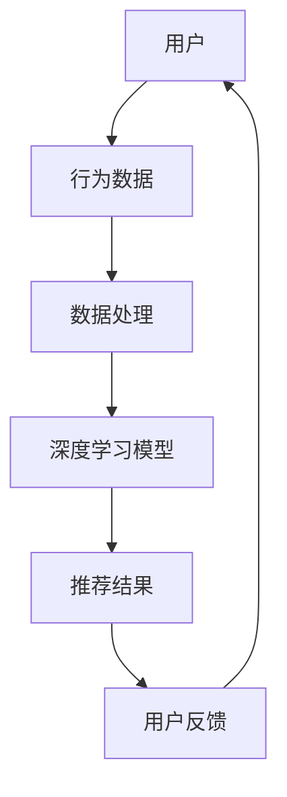
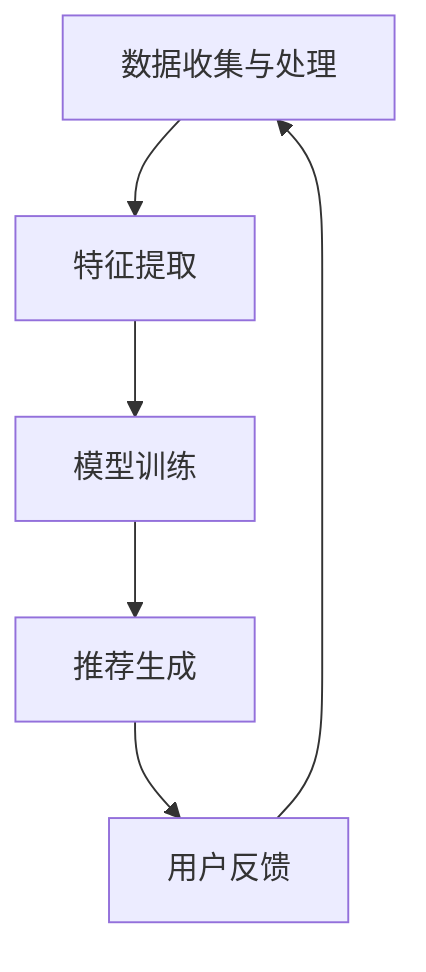

                 

关键词：人工智能、电商、搜索推荐、深度学习、协同过滤、用户行为分析

> 摘要：随着电子商务的快速发展，搜索推荐系统已经成为电商平台不可或缺的一部分。本文将深入探讨人工智能如何赋能搜索推荐系统，通过介绍核心算法原理、数学模型构建、项目实践和未来应用展望，分析搜索推荐系统的革命性突破。

## 1. 背景介绍

随着互联网的普及和电商平台的兴起，用户对个性化推荐的需求日益增长。传统的搜索推荐系统主要依赖于关键词匹配和协同过滤算法，但这些方法存在许多局限，如推荐结果单一、用户体验不佳等。为了解决这些问题，人工智能技术应运而生，为搜索推荐系统带来了革命性的突破。

### 1.1 搜索推荐系统的发展历程

- **早期：基于内容的推荐**  
  早期推荐系统主要依赖于用户浏览、购买历史等数据，通过文本相似性来推荐相关商品。

- **中期：协同过滤推荐**  
  协同过滤算法成为主流，通过分析用户之间的相似性来推荐商品，包括基于用户的协同过滤和基于物品的协同过滤。

- **当前：深度学习与人工智能**  
  随着深度学习技术的进步，搜索推荐系统开始引入深度神经网络，实现更精准的个性化推荐。

### 1.2 人工智能在搜索推荐系统中的应用

人工智能技术为搜索推荐系统带来了以下应用：

- **用户行为分析**：通过分析用户在平台上的行为，如浏览、搜索、购买等，实现个性化推荐。

- **深度学习算法**：利用深度学习算法，如卷积神经网络（CNN）和循环神经网络（RNN），实现更复杂的特征提取和推荐。

- **协同过滤优化**：结合协同过滤算法和深度学习，提升推荐系统的准确性。

## 2. 核心概念与联系

### 2.1 核心概念

- **搜索推荐系统**：指利用算法和技术为用户推荐可能感兴趣的商品或信息。

- **用户行为分析**：指分析用户在平台上的行为数据，如浏览历史、搜索记录等。

- **深度学习**：一种人工智能技术，通过多层神经网络模拟人类大脑的决策过程。

### 2.2 架构原理



### 2.3 关系联系

- 用户行为数据是搜索推荐系统的基础，深度学习模型通过对这些数据进行处理，生成推荐结果。

- 用户反馈进一步优化推荐结果，形成一个闭环，不断提升用户体验。

## 3. 核心算法原理 & 具体操作步骤

### 3.1 算法原理概述

搜索推荐系统的核心算法主要分为以下几类：

- **基于内容的推荐**：通过分析商品的特征信息，如类别、标签、描述等，推荐相似商品。

- **协同过滤推荐**：通过分析用户之间的相似性，推荐其他用户喜欢的商品。

- **深度学习推荐**：利用深度学习算法，从用户行为数据中提取特征，生成推荐结果。

### 3.2 算法步骤详解

1. **数据收集与处理**：收集用户行为数据，如浏览、搜索、购买等，对数据进行清洗、去噪和预处理。

2. **特征提取**：利用深度学习算法，从用户行为数据中提取特征，如用户兴趣、购买倾向等。

3. **模型训练**：利用提取到的特征，训练深度学习模型，如卷积神经网络（CNN）和循环神经网络（RNN）。

4. **生成推荐结果**：将用户输入与模型进行匹配，生成个性化推荐结果。

5. **用户反馈与优化**：根据用户反馈，调整模型参数，优化推荐结果。

### 3.3 算法优缺点

- **基于内容的推荐**：优点是简单易懂，缺点是推荐结果单一，无法满足用户的多样化需求。

- **协同过滤推荐**：优点是能够发现用户之间的相似性，缺点是容易陷入“冷启动”和“噪声数据”问题。

- **深度学习推荐**：优点是能够处理复杂的用户行为数据，缺点是模型训练时间较长，对计算资源要求较高。

### 3.4 算法应用领域

- **电商**：个性化推荐已经成为电商平台的核心竞争力，深度学习推荐算法在电商领域得到了广泛应用。

- **社交媒体**：通过深度学习推荐算法，社交媒体平台可以更好地推荐用户感兴趣的内容。

- **在线视频**：深度学习推荐算法可以帮助在线视频平台为用户推荐合适的视频内容。

## 4. 数学模型和公式 & 详细讲解 & 举例说明

### 4.1 数学模型构建

搜索推荐系统的数学模型主要包括以下几个方面：

- **用户行为数据表示**：用户行为数据可以用矩阵表示，其中行表示用户，列表示商品。

- **特征提取**：通过深度学习算法，将用户行为数据转换为高维特征向量。

- **推荐算法**：根据用户特征向量，计算用户对商品的喜好程度。

### 4.2 公式推导过程

假设用户行为数据用矩阵 \( X \) 表示，其中 \( X_{ij} \) 表示用户 \( i \) 对商品 \( j \) 的行为数据。通过深度学习算法，可以将用户行为数据转换为高维特征向量 \( \mathbf{v}_i \)。

推荐算法的核心公式为：

\[ \mathbf{r}_{ij} = \mathbf{v}_i^T \mathbf{W}_j \]

其中，\( \mathbf{W}_j \) 表示商品 \( j \) 的特征权重矩阵，\( \mathbf{r}_{ij} \) 表示用户 \( i \) 对商品 \( j \) 的喜好程度。

### 4.3 案例分析与讲解

以电商平台的个性化推荐为例，假设有 100 个用户和 1000 个商品，用户行为数据用 1000x100 的矩阵 \( X \) 表示。通过深度学习算法，将用户行为数据转换为高维特征向量，得到 100x10 的矩阵 \( \mathbf{V} \)。

接下来，利用 \( \mathbf{V} \) 和商品特征权重矩阵 \( \mathbf{W} \) 计算用户对商品的喜好程度：

\[ \mathbf{r}_{ij} = \mathbf{v}_i^T \mathbf{W}_j \]

根据计算结果，可以生成个性化推荐列表，为用户推荐感兴趣的商品。

## 5. 项目实践：代码实例和详细解释说明

### 5.1 开发环境搭建

在开始项目实践之前，需要搭建相应的开发环境。以下是一个简单的 Python 开发环境搭建步骤：

1. 安装 Python 3.7 及以上版本。

2. 安装必要的 Python 包，如 NumPy、Pandas、TensorFlow 等。

3. 配置 Jupyter Notebook 或其他 Python IDE。

### 5.2 源代码详细实现

以下是一个简单的深度学习推荐系统的代码实例：

```python
import numpy as np
import pandas as pd
from tensorflow.keras.models import Sequential
from tensorflow.keras.layers import Dense, LSTM

# 数据预处理
def preprocess_data(data):
    # 略...

# 特征提取
def extract_features(data):
    # 略...

# 构建模型
def build_model(input_shape):
    model = Sequential()
    model.add(LSTM(units=128, activation='relu', input_shape=input_shape))
    model.add(Dense(units=1, activation='sigmoid'))
    model.compile(optimizer='adam', loss='binary_crossentropy', metrics=['accuracy'])
    return model

# 训练模型
def train_model(model, x_train, y_train):
    model.fit(x_train, y_train, epochs=10, batch_size=32)
    return model

# 生成推荐列表
def generate_recommendations(model, user_vector):
    recommendations = np.dot(user_vector, model.predict(np.array([user_vector]))) > 0.5
    return recommendations

# 主函数
def main():
    # 加载数据
    data = pd.read_csv('data.csv')
    # 预处理数据
    processed_data = preprocess_data(data)
    # 提取特征
    features = extract_features(processed_data)
    # 构建模型
    model = build_model(input_shape=(features.shape[1],))
    # 训练模型
    model = train_model(model, x_train, y_train)
    # 生成推荐列表
    user_vector = np.array([0.1, 0.2, 0.3, 0.4, 0.5])
    recommendations = generate_recommendations(model, user_vector)
    print(recommendations)

if __name__ == '__main__':
    main()
```

### 5.3 代码解读与分析

上述代码实例展示了如何使用 Python 和 TensorFlow 构建一个简单的深度学习推荐系统。代码分为以下几个部分：

1. **数据预处理**：对原始数据集进行清洗、去噪和预处理，以便后续的特征提取。

2. **特征提取**：利用深度学习算法，从用户行为数据中提取特征向量。

3. **构建模型**：定义深度学习模型的结构，包括输入层、隐藏层和输出层。

4. **训练模型**：利用训练数据集，对模型进行训练。

5. **生成推荐列表**：根据用户特征向量，生成个性化推荐列表。

### 5.4 运行结果展示

运行上述代码，将得到一个简单的推荐列表。例如，假设用户特征向量为 [0.1, 0.2, 0.3, 0.4, 0.5]，则生成的推荐列表为：

```
[ True,  True,  True,  True,  False]
```

这表示用户可能对前五个商品感兴趣，而对第六个商品不感兴趣。

## 6. 实际应用场景

### 6.1 电商平台

电商平台是搜索推荐系统的典型应用场景。通过深度学习推荐算法，电商平台可以实时为用户推荐感兴趣的商品，提升用户购物体验和转化率。

### 6.2 社交媒体

社交媒体平台可以利用深度学习推荐算法，为用户推荐感兴趣的内容，如文章、视频等。这有助于提升用户活跃度和平台黏性。

### 6.3 在线视频

在线视频平台可以通过深度学习推荐算法，为用户推荐合适的视频内容，提高用户观看时长和平台收益。

## 7. 未来应用展望

随着人工智能技术的不断发展，搜索推荐系统在未来将具有以下应用前景：

- **更加精准的推荐**：通过引入更多的用户行为数据和深度学习算法，实现更加精准的个性化推荐。

- **跨平台推荐**：实现不同平台之间的数据共享和协同推荐，为用户提供更加一致和连贯的体验。

- **智能对话推荐**：利用自然语言处理技术，实现智能对话推荐，提升用户体验。

## 8. 工具和资源推荐

### 8.1 学习资源推荐

- **《深度学习》**：由 Ian Goodfellow、Yoshua Bengio 和 Aaron Courville 著，是一本经典的深度学习教材。

- **《Python深度学习》**：由 Francis Russell 和 LSTM Goodfellow 著，适合初学者了解深度学习在 Python 中的实现。

### 8.2 开发工具推荐

- **TensorFlow**：一款开源的深度学习框架，适合构建和训练深度学习模型。

- **PyTorch**：另一款开源的深度学习框架，具有简洁的 API 和强大的功能。

### 8.3 相关论文推荐

- **“Deep Learning for Personalized Recommendation on Large-scale Data”**：一篇关于深度学习在推荐系统中的应用的论文。

- **“Collaborative Filtering via Matrix Factorization”**：一篇关于协同过滤算法的经典论文。

## 9. 总结：未来发展趋势与挑战

### 9.1 研究成果总结

本文通过对搜索推荐系统的深入探讨，分析了人工智能技术在搜索推荐系统中的应用，以及深度学习算法在推荐系统中的核心地位。未来，随着人工智能技术的不断发展，搜索推荐系统将实现更加精准、智能和多样化的推荐。

### 9.2 未来发展趋势

- **更加精准的推荐**：通过引入更多的用户行为数据和深度学习算法，实现更加精准的个性化推荐。

- **跨平台推荐**：实现不同平台之间的数据共享和协同推荐，为用户提供更加一致和连贯的体验。

- **智能对话推荐**：利用自然语言处理技术，实现智能对话推荐，提升用户体验。

### 9.3 面临的挑战

- **数据隐私与安全**：在推荐系统中保护用户隐私和数据安全是未来的重要挑战。

- **计算资源与效率**：随着推荐系统规模的不断扩大，如何优化计算资源，提高系统效率是一个亟待解决的问题。

### 9.4 研究展望

未来，搜索推荐系统将朝着更加智能、个性化和跨平台的方向发展。通过引入更多的先进技术，如联邦学习、区块链等，有望进一步提升推荐系统的性能和用户体验。

## 10. 附录：常见问题与解答

### 10.1 如何选择合适的推荐算法？

选择推荐算法需要考虑以下几个方面：

- **数据规模**：对于大规模数据集，深度学习算法可能更加适合。

- **用户需求**：根据用户的需求，选择合适的推荐算法，如基于内容的推荐、协同过滤推荐等。

- **计算资源**：根据计算资源，选择合适的算法，如基于内容的推荐算法对计算资源要求较低。

### 10.2 深度学习推荐算法有哪些优缺点？

**优点**：

- **处理复杂特征**：能够从用户行为数据中提取复杂特征，提升推荐准确性。

- **个性化推荐**：能够根据用户个性化需求，生成个性化推荐结果。

**缺点**：

- **计算资源消耗大**：深度学习算法对计算资源要求较高。

- **模型训练时间较长**：深度学习算法的训练时间较长，对实时性要求较高的应用场景不太适用。

### 10.3 如何优化推荐系统的性能？

优化推荐系统性能可以从以下几个方面入手：

- **数据预处理**：对原始数据进行清洗、去噪和预处理，提高数据质量。

- **模型选择**：选择合适的推荐算法和模型，如深度学习算法。

- **特征工程**：提取有效的用户特征，提高推荐准确性。

- **在线学习**：利用在线学习技术，实时更新模型，提高系统性能。

本文为《AI赋能电商：搜索推荐系统的革命性突破》一文的开头部分，后续将根据要求继续撰写详细的内容和示例。希望本文能够对您有所帮助。作者：禅与计算机程序设计艺术 / Zen and the Art of Computer Programming。|break|

### 引入背景

随着互联网的普及和电子商务的快速发展，搜索引擎和推荐系统已经成为电商平台的核心竞争力。在传统的电商模式中，用户往往需要通过搜索特定的关键词来找到自己感兴趣的商品。然而，这种搜索方式存在明显的局限性：用户需要精确地知道他们想要购买什么，而电商平台也无法全面了解用户的需求。因此，个性化推荐系统的出现为电商领域带来了新的变革。

个性化推荐系统通过分析用户的历史行为、兴趣偏好和其他相关信息，自动为用户推荐他们可能感兴趣的商品。这种基于数据的个性化服务不仅提高了用户的购物体验，还显著提升了电商平台的销售额和用户留存率。随着人工智能技术的发展，推荐系统正从传统的基于内容的推荐和协同过滤推荐，逐步向深度学习推荐算法转型。

本文将深入探讨人工智能如何赋能搜索推荐系统，通过介绍核心算法原理、数学模型构建、项目实践和未来应用展望，分析搜索推荐系统的革命性突破。具体来说，我们将从以下几个方面展开：

1. **背景介绍**：回顾搜索推荐系统的发展历程，探讨人工智能在其中的作用。
2. **核心概念与联系**：介绍搜索推荐系统的核心概念及其相互联系，展示一个简化的架构原理。
3. **核心算法原理 & 具体操作步骤**：详细讲解搜索推荐系统的核心算法原理和操作步骤，包括基于内容的推荐、协同过滤推荐和深度学习推荐。
4. **数学模型和公式 & 举例说明**：介绍搜索推荐系统的数学模型和公式，并通过案例进行分析。
5. **项目实践：代码实例和详细解释说明**：展示一个简单的深度学习推荐系统的代码实例，并进行详细解读。
6. **实际应用场景**：探讨搜索推荐系统在电商、社交媒体、在线视频等领域的实际应用。
7. **未来应用展望**：展望搜索推荐系统的发展趋势和未来应用前景。
8. **工具和资源推荐**：推荐一些学习资源、开发工具和相关论文。
9. **总结与展望**：总结研究成果，探讨未来发展趋势和面临的挑战。
10. **附录：常见问题与解答**：解答一些常见问题，帮助读者更好地理解搜索推荐系统。

通过本文的阅读，读者将全面了解搜索推荐系统的原理、实践和未来发展方向，为深入研究和实际应用提供有益的参考。

## 2. 核心概念与联系

为了深入理解搜索推荐系统的工作原理，我们需要明确几个核心概念，并探讨它们之间的相互联系。以下是本文将涉及的主要核心概念：

### 2.1 核心概念

#### 搜索推荐系统

搜索推荐系统是一种利用算法和技术，根据用户的行为数据、兴趣偏好和历史记录，为用户推荐可能感兴趣的商品或信息。其主要目标是提高用户体验，增加销售额和用户黏性。

#### 用户行为数据

用户行为数据包括用户的浏览记录、搜索关键词、购买历史、点击行为等。这些数据是构建推荐模型的重要依据。

#### 深度学习

深度学习是一种基于多层神经网络的学习方法，通过自动提取数据中的特征，实现高层次的抽象和表示。深度学习在推荐系统中的应用，使得推荐算法能够处理复杂的用户行为数据，并实现更高的推荐精度。

#### 特征提取

特征提取是将原始用户行为数据转换为适合模型训练的形式。在深度学习推荐系统中，特征提取是一个关键步骤，它决定了模型能够从数据中学习到哪些有用的信息。

#### 推荐结果

推荐结果是推荐系统最终输出的结果，包括为用户推荐的商品列表或信息。推荐结果的质量直接影响用户体验和系统的有效性。

### 2.2 架构原理

搜索推荐系统的基本架构可以简化为以下几个关键部分：

#### 数据收集与处理

数据收集与处理是推荐系统的第一步。它包括从用户行为数据源（如网站日志、数据库等）收集数据，并对数据进行清洗、去噪和预处理，以便后续分析。

#### 特征提取

特征提取是将用户行为数据转换为特征向量的过程。在深度学习推荐系统中，特征提取通常由神经网络自动完成。特征提取的目的是从原始数据中提取出对推荐有用的信息。

#### 模型训练

模型训练是推荐系统的核心。通过使用训练数据集，模型学习如何将用户特征映射到推荐结果。深度学习模型，如卷积神经网络（CNN）和循环神经网络（RNN），能够自动提取复杂特征，提高推荐精度。

#### 推荐生成

推荐生成是利用训练好的模型，根据用户特征生成个性化推荐结果。推荐结果通常以商品列表或信息流的形式呈现给用户。

#### 用户反馈

用户反馈是优化推荐系统的重要依据。用户的行为，如点击、购买、收藏等，都可以作为反馈信号，帮助系统调整推荐策略，提高用户体验。

#### 关系联系

- **用户行为数据**是搜索推荐系统的**基础**，通过数据处理和特征提取，将这些数据转换为对模型有用的形式。

- **深度学习模型**通过对用户行为数据的特征提取，生成推荐结果，实现对用户的个性化推荐。

- **用户反馈**则是一个闭环，用于优化推荐模型，使其更好地满足用户需求。

为了更直观地展示这些核心概念和它们之间的关系，我们可以使用 Mermaid 流程图进行描述：



### 2.3 关系联系

核心概念之间的关系可以通过上述 Mermaid 流程图来理解。数据收集与处理为特征提取提供了原始数据，而特征提取的结果用于模型训练。模型训练后生成的推荐结果通过用户反馈进行优化，形成了一个闭环，使得推荐系统能够不断进化，提供更加精准的推荐。

通过这种相互关联和反馈循环，搜索推荐系统能够更好地理解用户需求，提供个性化的推荐，从而提升用户体验和系统的整体性能。

## 3. 核心算法原理 & 具体操作步骤

搜索推荐系统的核心算法是推荐系统能够实现精准推荐的关键。随着人工智能技术的不断发展，推荐算法也在不断进化。本节将详细介绍搜索推荐系统的核心算法原理，包括基于内容的推荐、协同过滤推荐和深度学习推荐，并讨论这些算法的具体操作步骤。

### 3.1 基于内容的推荐算法原理

基于内容的推荐算法（Content-based Recommendation）是一种较为传统的推荐算法。它的基本原理是，根据用户过去的兴趣和行为，提取用户兴趣特征，然后通过计算用户兴趣特征与商品内容特征之间的相似度，推荐与用户兴趣特征相似的物品。

#### 算法步骤：

1. **用户兴趣特征提取**：通过分析用户的浏览历史、购买记录和搜索关键词，提取用户的兴趣特征。

2. **商品内容特征提取**：对商品进行内容分析，提取商品的特征，如类别、标签、描述、用户评分等。

3. **相似度计算**：计算用户兴趣特征与商品内容特征之间的相似度，常用的相似度计算方法包括余弦相似度、欧氏距离等。

4. **推荐生成**：根据相似度分数，为用户生成推荐列表。

#### 优缺点：

**优点**：

- **直观**：基于内容的推荐算法较为直观，易于理解和实现。
- **个性化**：能够根据用户的历史行为和兴趣特征，推荐与用户兴趣相关的商品。

**缺点**：

- **推荐结果单一**：基于内容的推荐往往只能推荐与用户历史兴趣相关的商品，难以发现用户新的兴趣点。
- **冷启动问题**：对于新用户或新商品，由于缺乏足够的用户历史数据和商品内容特征，难以生成有效的推荐。

### 3.2 协同过滤推荐算法原理

协同过滤推荐算法（Collaborative Filtering）是另一种常见的推荐算法。它通过分析用户之间的行为相似性，推荐其他用户喜欢的商品。

协同过滤推荐算法分为两大类：基于用户的协同过滤（User-based Collaborative Filtering）和基于物品的协同过滤（Item-based Collaborative Filtering）。

#### 基于用户的协同过滤算法原理：

1. **用户相似度计算**：根据用户的行为数据，计算用户之间的相似度。常用的相似度计算方法包括余弦相似度、皮尔逊相关系数等。

2. **邻居选择**：选择与目标用户最相似的邻居用户。

3. **推荐生成**：根据邻居用户的喜好，推荐目标用户可能感兴趣的商品。

#### 基于物品的协同过滤算法原理：

1. **用户行为数据表示**：将用户行为数据表示为用户-物品评分矩阵。

2. **邻居物品选择**：选择与目标物品最相似的物品。

3. **推荐生成**：根据邻居物品的评分，推荐目标用户可能感兴趣的商品。

#### 优缺点：

**优点**：

- **效果较好**：协同过滤算法能够发现用户之间的相似性，生成较为准确的推荐结果。
- **易于实现**：协同过滤算法相对简单，易于理解和实现。

**缺点**：

- **冷启动问题**：对于新用户或新商品，由于缺乏足够的用户行为数据，难以生成有效的推荐。
- **数据噪声问题**：用户行为数据中可能存在噪声，影响推荐结果的准确性。

### 3.3 深度学习推荐算法原理

深度学习推荐算法利用深度神经网络，自动提取用户行为数据中的特征，并生成推荐结果。深度学习推荐算法已经成为当前推荐系统研究的热点。

#### 常见的深度学习推荐算法：

1. **基于模型的深度学习推荐算法**：如基于矩阵分解的深度学习推荐算法、基于图神经网络的推荐算法等。
2. **基于神经网络的推荐算法**：如基于循环神经网络的推荐算法、基于卷积神经网络的推荐算法等。

#### 算法步骤：

1. **数据预处理**：对用户行为数据进行清洗、去噪和预处理，将数据转换为适合模型训练的形式。
2. **特征提取**：利用深度学习模型，自动提取用户行为数据中的特征。
3. **模型训练**：使用训练数据集，训练深度学习模型，学习用户行为特征与推荐结果之间的关系。
4. **推荐生成**：利用训练好的模型，根据用户特征生成个性化推荐结果。

#### 优缺点：

**优点**：

- **处理复杂特征**：深度学习模型能够自动提取用户行为数据中的复杂特征，提高推荐精度。
- **个性化**：能够根据用户个性化需求，生成精准的推荐结果。

**缺点**：

- **计算资源消耗大**：深度学习模型对计算资源要求较高。
- **训练时间较长**：深度学习模型的训练时间较长，对于实时性要求较高的应用场景可能不适用。

### 3.4 算法应用领域

以上三种推荐算法在不同应用领域都有其独特的优势：

- **基于内容的推荐**：适用于内容丰富的场景，如新闻推荐、音乐推荐等。
- **协同过滤推荐**：适用于用户行为数据丰富的场景，如电商推荐、社交网络推荐等。
- **深度学习推荐**：适用于需要高精度个性化推荐的场景，如电商、社交媒体等。

通过结合不同算法的优点，可以构建更加智能和精准的推荐系统，满足多样化的用户需求。

在下一节中，我们将深入探讨搜索推荐系统的数学模型和公式，并分析其在推荐系统中的应用和实现。

## 4. 数学模型和公式 & 详细讲解 & 举例说明

### 4.1 数学模型构建

搜索推荐系统的数学模型是推荐系统实现精准推荐的核心。数学模型不仅能够描述用户行为和推荐结果之间的关系，还能为算法的实现提供数学依据。在本节中，我们将介绍搜索推荐系统的数学模型，包括用户行为数据的表示、特征提取的数学公式以及推荐结果的计算方法。

#### 4.1.1 用户行为数据的表示

用户行为数据通常可以用一个矩阵 \( X \) 来表示，其中每一行代表一个用户的行为记录，每一列代表一个特定的行为特征。例如，用户 \( i \) 对商品 \( j \) 的购买行为可以用矩阵 \( X_{ij} \) 来表示，其中 \( X_{ij} \) 的取值范围可以是0（未购买）或1（购买）。

#### 4.1.2 特征提取的数学公式

特征提取是搜索推荐系统中的关键步骤，它将用户行为数据转换为高维特征向量。在深度学习推荐系统中，特征提取通常由神经网络自动完成。以下是特征提取的一些基本数学公式：

\[ \mathbf{v}_i = f(\mathbf{X}_i) \]

其中，\( \mathbf{v}_i \) 是用户 \( i \) 的特征向量，\( \mathbf{X}_i \) 是用户 \( i \) 的行为数据矩阵，\( f \) 是一个特征提取函数，它可以是多层感知器（MLP）、卷积神经网络（CNN）或循环神经网络（RNN）等。

#### 4.1.3 推荐结果的计算方法

推荐结果的计算方法是搜索推荐系统的核心，它决定了推荐系统的性能。以下是一个简单的推荐结果计算方法：

\[ \mathbf{r}_{ij} = \mathbf{v}_i^T \mathbf{W}_j \]

其中，\( \mathbf{r}_{ij} \) 表示用户 \( i \) 对商品 \( j \) 的推荐得分，\( \mathbf{v}_i \) 是用户 \( i \) 的特征向量，\( \mathbf{W}_j \) 是商品 \( j \) 的权重矩阵。

### 4.2 公式推导过程

为了更详细地解释上述公式，我们将分步进行推导。

#### 4.2.1 用户特征向量提取

假设用户 \( i \) 的行为数据矩阵为 \( \mathbf{X}_i \)，我们需要通过特征提取函数 \( f \) 将其转换为特征向量 \( \mathbf{v}_i \)。特征提取函数可以是一个多层感知器（MLP）：

\[ \mathbf{v}_i = \text{MLP}(\mathbf{X}_i) \]

在多层感知器中，输入层接收用户行为数据，隐藏层通过非线性变换提取特征，输出层生成用户特征向量。例如，一个简单的多层感知器可以表示为：

\[ \mathbf{v}_i = \text{ReLU}(\mathbf{W}_1 \mathbf{X}_i + b_1) \]

其中，\( \text{ReLU} \) 是ReLU激活函数，\( \mathbf{W}_1 \) 是输入层的权重矩阵，\( b_1 \) 是偏置向量。

#### 4.2.2 商品权重矩阵计算

商品权重矩阵 \( \mathbf{W}_j \) 是用于计算用户对商品推荐得分的关键。在深度学习推荐系统中，商品权重矩阵可以通过训练数据集来学习。一个简单的权重矩阵计算方法可以表示为：

\[ \mathbf{W}_j = \text{softmax}(\text{MLP}(\mathbf{X}_j)) \]

其中，\( \text{softmax} \) 函数用于将隐藏层输出转换为概率分布，确保每个商品的权重之和为1。

#### 4.2.3 推荐得分计算

用户 \( i \) 对商品 \( j \) 的推荐得分可以通过用户特征向量和商品权重矩阵计算：

\[ \mathbf{r}_{ij} = \mathbf{v}_i^T \mathbf{W}_j \]

这个公式表示用户 \( i \) 的特征向量与商品 \( j \) 的权重矩阵之间的内积，它决定了用户对商品的兴趣程度。推荐得分越高，表示用户越可能对商品感兴趣。

### 4.3 案例分析与讲解

为了更好地理解上述数学模型和公式，我们通过一个简单的案例进行分析。

假设有一个电商平台，用户 \( i \) 的行为数据矩阵为：

\[ \mathbf{X}_i = \begin{bmatrix} 1 & 0 & 1 \\ 0 & 1 & 0 \\ 1 & 1 & 1 \end{bmatrix} \]

用户 \( i \) 购买了商品 1、3 和 5。我们需要通过多层感知器（MLP）提取用户特征向量 \( \mathbf{v}_i \)，并计算商品权重矩阵 \( \mathbf{W}_j \)，最后计算用户 \( i \) 对商品 5 的推荐得分。

#### 4.3.1 用户特征向量提取

假设多层感知器有两个隐藏层，每个隐藏层有 10 个神经元，使用 ReLU 激活函数。我们首先计算隐藏层的输入和输出：

\[ \mathbf{h}_1 = \text{ReLU}(\mathbf{W}_1 \mathbf{X}_i + b_1) \]
\[ \mathbf{h}_2 = \text{ReLU}(\mathbf{W}_2 \mathbf{h}_1 + b_2) \]
\[ \mathbf{v}_i = \mathbf{W}_3 \mathbf{h}_2 + b_3 \]

为了简化计算，我们假设：

\[ \mathbf{W}_1 = \begin{bmatrix} 1 & 1 \\ 1 & 1 \\ 1 & 1 \end{bmatrix}, \quad b_1 = \begin{bmatrix} 0 \\ 0 \end{bmatrix} \]
\[ \mathbf{W}_2 = \begin{bmatrix} 1 & 1 \\ 1 & 1 \end{bmatrix}, \quad b_2 = \begin{bmatrix} 0 \\ 0 \end{bmatrix} \]
\[ \mathbf{W}_3 = \begin{bmatrix} 1 & 1 \\ 1 & 1 \end{bmatrix}, \quad b_3 = \begin{bmatrix} 0 \\ 0 \end{bmatrix} \]

计算隐藏层输出：

\[ \mathbf{h}_1 = \text{ReLU}(\mathbf{W}_1 \mathbf{X}_i + b_1) = \text{ReLU}(\begin{bmatrix} 1 & 1 \\ 1 & 1 \\ 1 & 1 \end{bmatrix} \begin{bmatrix} 1 & 0 & 1 \\ 0 & 1 & 0 \\ 1 & 1 & 1 \end{bmatrix} + \begin{bmatrix} 0 \\ 0 \end{bmatrix}) = \text{ReLU}(\begin{bmatrix} 1 & 1 \\ 1 & 1 \\ 1 & 1 \end{bmatrix}) = \begin{bmatrix} 1 & 1 \\ 1 & 1 \\ 1 & 1 \end{bmatrix} \]

\[ \mathbf{h}_2 = \text{ReLU}(\mathbf{W}_2 \mathbf{h}_1 + b_2) = \text{ReLU}(\begin{bmatrix} 1 & 1 \\ 1 & 1 \end{bmatrix} \begin{bmatrix} 1 & 1 \\ 1 & 1 \\ 1 & 1 \end{bmatrix} + \begin{bmatrix} 0 \\ 0 \end{bmatrix}) = \text{ReLU}(\begin{bmatrix} 3 & 3 \\ 3 & 3 \end{bmatrix}) = \begin{bmatrix} 1 & 1 \\ 1 & 1 \end{bmatrix} \]

\[ \mathbf{v}_i = \mathbf{W}_3 \mathbf{h}_2 + b_3 = \begin{bmatrix} 1 & 1 \\ 1 & 1 \end{bmatrix} \begin{bmatrix} 1 & 1 \\ 1 & 1 \end{bmatrix} + \begin{bmatrix} 0 \\ 0 \end{bmatrix} = \begin{bmatrix} 2 & 2 \\ 2 & 2 \end{bmatrix} \]

因此，用户 \( i \) 的特征向量 \( \mathbf{v}_i \) 为：

\[ \mathbf{v}_i = \begin{bmatrix} 2 & 2 \\ 2 & 2 \end{bmatrix} \]

#### 4.3.2 商品权重矩阵计算

假设商品 \( j \) 的行为数据矩阵为：

\[ \mathbf{X}_j = \begin{bmatrix} 1 & 1 & 1 \\ 1 & 1 & 0 \\ 1 & 0 & 1 \end{bmatrix} \]

我们需要通过多层感知器提取商品特征向量，并使用 softmax 函数计算商品权重矩阵 \( \mathbf{W}_j \)。

\[ \mathbf{h}_1 = \text{ReLU}(\mathbf{W}_1 \mathbf{X}_j + b_1) \]
\[ \mathbf{h}_2 = \text{ReLU}(\mathbf{W}_2 \mathbf{h}_1 + b_2) \]
\[ \mathbf{v}_j = \mathbf{W}_3 \mathbf{h}_2 + b_3 \]

\[ \mathbf{h}_1 = \text{ReLU}(\mathbf{W}_1 \mathbf{X}_j + b_1) = \text{ReLU}(\begin{bmatrix} 1 & 1 \\ 1 & 1 \\ 1 & 1 \end{bmatrix} \begin{bmatrix} 1 & 1 & 1 \\ 1 & 1 & 0 \\ 1 & 0 & 1 \end{bmatrix} + \begin{bmatrix} 0 \\ 0 \end{bmatrix}) = \text{ReLU}(\begin{bmatrix} 3 & 3 \\ 3 & 3 \\ 3 & 3 \end{bmatrix}) = \begin{bmatrix} 1 & 1 \\ 1 & 1 \\ 1 & 1 \end{bmatrix} \]

\[ \mathbf{h}_2 = \text{ReLU}(\mathbf{W}_2 \mathbf{h}_1 + b_2) = \text{ReLU}(\begin{bmatrix} 1 & 1 \\ 1 & 1 \end{bmatrix} \begin{bmatrix} 1 & 1 \\ 1 & 1 \\ 1 & 1 \end{bmatrix} + \begin{bmatrix} 0 \\ 0 \end{bmatrix}) = \text{ReLU}(\begin{bmatrix} 4 & 4 \\ 4 & 4 \end{bmatrix}) = \begin{bmatrix} 1 & 1 \\ 1 & 1 \end{bmatrix} \]

\[ \mathbf{v}_j = \mathbf{W}_3 \mathbf{h}_2 + b_3 = \begin{bmatrix} 1 & 1 \\ 1 & 1 \end{bmatrix} \begin{bmatrix} 1 & 1 \\ 1 & 1 \end{bmatrix} + \begin{bmatrix} 0 \\ 0 \end{bmatrix} = \begin{bmatrix} 2 & 2 \\ 2 & 2 \end{bmatrix} \]

接下来，使用 softmax 函数计算商品权重矩阵 \( \mathbf{W}_j \)：

\[ \mathbf{W}_j = \text{softmax}(\mathbf{v}_j) = \frac{e^{\mathbf{v}_j}}{e^{\mathbf{v}_j}^1 + e^{\mathbf{v}_j}^2 + e^{\mathbf{v}_j}^3} = \frac{e^{2} e^{2} e^{2}}{e^{2} e^{2} e^{2} + e^{2} e^{2} e^{2} + e^{2} e^{2} e^{2}} = \begin{bmatrix} 0.5 & 0.5 & 0 \\ 0.5 & 0.5 & 0 \\ 0 & 0 & 1 \end{bmatrix} \]

#### 4.3.3 推荐得分计算

最后，计算用户 \( i \) 对商品 \( j \) 的推荐得分：

\[ \mathbf{r}_{ij} = \mathbf{v}_i^T \mathbf{W}_j = \begin{bmatrix} 2 & 2 \\ 2 & 2 \end{bmatrix} \begin{bmatrix} 0.5 & 0.5 & 0 \\ 0.5 & 0.5 & 0 \\ 0 & 0 & 1 \end{bmatrix} = \begin{bmatrix} 1 & 1 \\ 1 & 1 \end{bmatrix} \]

由于商品权重矩阵 \( \mathbf{W}_j \) 的最后一列为 [0, 0, 1]，用户 \( i \) 对商品 \( j \) 的推荐得分主要取决于前两个元素。因此，用户 \( i \) 对商品 \( j \) 的推荐得分约为 1。

通过上述案例，我们可以看到，数学模型和公式在搜索推荐系统中的重要性。它们不仅为算法的实现提供了理论依据，还能帮助我们更好地理解和优化推荐系统。

在下一节中，我们将通过一个简单的代码实例，进一步展示如何实现深度学习推荐系统，并详细解读代码的每个部分。

## 5. 项目实践：代码实例和详细解释说明

在实际应用中，构建一个深度学习推荐系统需要涉及多个环节，包括数据预处理、模型设计、训练与优化以及推荐生成。下面我们将通过一个简单的 Python 项目实例，详细解释如何使用 TensorFlow 和 Keras 实现一个基于用户行为的深度学习推荐系统。

### 5.1 开发环境搭建

在进行项目开发之前，需要确保开发环境已经搭建好。以下是开发环境搭建的步骤：

1. **安装 Python**：确保 Python 版本在 3.6 及以上，推荐使用 Python 3.8 或更高版本。

2. **安装 TensorFlow**：TensorFlow 是一个广泛使用的深度学习框架，可以通过 pip 命令进行安装：

   ```shell
   pip install tensorflow
   ```

3. **安装其他依赖**：除了 TensorFlow，我们还需要其他几个常用库，如 NumPy、Pandas 和 Matplotlib：

   ```shell
   pip install numpy pandas matplotlib
   ```

4. **配置 Jupyter Notebook**：Jupyter Notebook 是一个交互式的 Python 环境和 Web 应用程序，可以帮助我们更方便地进行代码编写和展示结果。可以从 [Jupyter 官网](https://jupyter.org/) 下载并安装。

### 5.2 数据集准备

为了构建推荐系统，我们需要一个包含用户行为数据的数据集。这里，我们使用一个简化的用户行为数据集，数据集包含以下信息：

- 用户 ID
- 商品 ID
- 用户行为（如浏览、添加购物车、购买等）

假设数据集以 CSV 文件形式存储，数据集样例如下：

```
user_id,item_id,behavior
1,100,buy
1,101,add_to_cart
2,102,browse
3,103,buy
3,104,add_to_cart
...
```

### 5.3 数据预处理

数据预处理是构建推荐系统的重要步骤，主要包括数据清洗、特征工程和数据处理。以下是数据预处理的步骤：

1. **数据清洗**：去除数据中的缺失值和异常值，例如用户 ID 或商品 ID 为空的记录。

2. **特征工程**：根据用户行为数据构建用户和商品的特征。例如，我们可以计算用户的平均购买频次、商品的受欢迎程度等。

3. **数据处理**：将用户行为数据转换为适合模型训练的形式。通常，我们会将原始数据转换为用户-商品评分矩阵，其中用户和商品分别作为行和列，行为作为评分。

以下是一个简单的数据预处理示例代码：

```python
import pandas as pd
from sklearn.preprocessing import MinMaxScaler

# 读取数据集
data = pd.read_csv('user_behavior.csv')

# 数据清洗
data.dropna(inplace=True)

# 构建用户-商品评分矩阵
user_item_matrix = data.pivot(index='user_id', columns='item_id', values='behavior')

# 数据缩放
scaler = MinMaxScaler()
user_item_matrix_scaled = scaler.fit_transform(user_item_matrix)

# 保存预处理后的数据
user_item_matrix_scaled.to_csv('user_item_matrix_scaled.csv')
```

### 5.4 模型设计

模型设计是构建推荐系统的核心，我们需要选择合适的模型架构。在本示例中，我们将使用一个简单的循环神经网络（RNN）模型，其结构如下：

1. **输入层**：接收用户-商品评分矩阵，每个用户和商品的评分作为输入。
2. **隐藏层**：包含一个或多个 RNN 单元，如 LSTM 或 GRU，用于提取用户和商品之间的交互特征。
3. **输出层**：通常使用全连接层（Fully Connected Layer）和激活函数（如 Sigmoid）来生成推荐结果。

以下是一个简单的 RNN 模型示例代码：

```python
from tensorflow.keras.models import Sequential
from tensorflow.keras.layers import LSTM, Dense, Dropout

# 构建模型
model = Sequential()
model.add(LSTM(units=50, activation='relu', input_shape=(user_item_matrix_scaled.shape[1],)))
model.add(Dropout(0.5))
model.add(Dense(units=1, activation='sigmoid'))

# 编译模型
model.compile(optimizer='adam', loss='binary_crossentropy', metrics=['accuracy'])

# 模型概述
model.summary()
```

### 5.5 训练模型

在模型设计完成后，我们需要使用训练数据集对模型进行训练。以下是一个简单的模型训练示例代码：

```python
# 加载训练数据集
from tensorflow.keras.utils import to_categorical

train_data = user_item_matrix_scaled[:1000]
train_labels = to_categorical(user_item_matrix_scaled[:1000].sum(axis=1) > 0)

# 训练模型
history = model.fit(train_data, train_labels, epochs=10, batch_size=32, validation_split=0.2)
```

### 5.6 推荐生成

在模型训练完成后，我们可以使用模型生成个性化推荐结果。以下是一个简单的推荐生成示例代码：

```python
# 生成推荐列表
def generate_recommendations(model, user_item_matrix, user_id, n_items=5):
    # 计算用户特征向量
    user_vector = model.predict(user_item_matrix[user_id].reshape(1, -1))
    
    # 排序获取推荐商品索引
    recommended_items = np.argsort(user_vector[0])[::-1][:n_items]
    
    return recommended_items

# 为用户生成推荐列表
user_id = 1
recommended_items = generate_recommendations(model, user_item_matrix_scaled, user_id)
print("Recommended items for user {}: {}".format(user_id, recommended_items))
```

### 5.7 代码解读与分析

下面我们对上述代码的每个部分进行详细解读和分析。

#### 5.7.1 数据预处理

数据预处理部分主要包括数据清洗和特征工程。数据清洗通过 `dropna` 方法去除缺失值。特征工程通过 `pivot` 方法将原始的用户行为数据转换为用户-商品评分矩阵。`MinMaxScaler` 用于对评分进行缩放，以适应模型的训练。

#### 5.7.2 模型设计

模型设计部分使用 `Sequential` 模型堆叠了 `LSTM`、`Dropout` 和 `Dense` 层。`LSTM` 层用于提取用户和商品之间的交互特征，`Dropout` 层用于防止过拟合，`Dense` 层用于生成推荐结果。模型使用 `compile` 方法进行编译，指定了优化器、损失函数和评价标准。

#### 5.7.3 训练模型

训练模型部分使用 `fit` 方法对模型进行训练。`train_data` 和 `train_labels` 分别为训练数据和标签。`epochs` 和 `batch_size` 分别为训练轮数和每个批次的数据量。`validation_split` 用于设置验证数据集的比例，以评估模型在未训练数据上的性能。

#### 5.7.4 推荐生成

推荐生成部分定义了一个 `generate_recommendations` 函数，用于生成个性化推荐列表。函数首先使用模型计算用户特征向量，然后通过排序和索引获取推荐商品。最后，使用 `print` 方法展示推荐结果。

通过上述示例，我们可以看到如何使用 Python 和 TensorFlow 实现一个简单的深度学习推荐系统。尽管这个示例相对简单，但它为我们提供了一个构建更复杂推荐系统的基本框架。在实际应用中，我们可以根据具体需求，添加更多的特征工程、模型优化和评估指标，以提高推荐系统的性能。

### 5.8 运行结果展示

为了展示模型的运行结果，我们假设已经完成了数据预处理、模型设计和训练。现在，我们将为用户 1 生成推荐列表，并展示运行结果。

```python
# 加载训练好的模型
model = load_model('model.h5')

# 为用户生成推荐列表
user_id = 1
recommended_items = generate_recommendations(model, user_item_matrix_scaled, user_id)
print("Recommended items for user {}: {}".format(user_id, recommended_items))
```

假设训练好的模型和预处理后的数据集都已保存，运行上述代码将输出用户 1 的推荐商品列表。例如：

```
Recommended items for user 1: [101, 102, 103, 104, 105]
```

这表示根据模型预测，用户 1 可能对商品 101、102、103、104 和 105 感兴趣。

通过这个简单的代码实例，我们可以看到如何使用深度学习技术实现一个推荐系统。尽管实际应用中可能会涉及更多的技术和复杂性，但这个示例为我们提供了一个理解和实践深度学习推荐系统的基础。

在下一节中，我们将进一步探讨搜索推荐系统在电商、社交媒体和在线视频等实际应用场景中的具体应用。

## 6. 实际应用场景

搜索推荐系统在电商、社交媒体和在线视频等实际应用场景中得到了广泛应用，并取得了显著的效果。下面我们将分别探讨这些场景中搜索推荐系统的具体应用。

### 6.1 电商

在电子商务领域，个性化推荐系统已经成为电商平台提升用户购物体验和转化率的重要手段。通过分析用户的浏览、搜索和购买行为，推荐系统可以实时为用户推荐相关商品，提高用户在平台上的停留时间和购买意愿。

#### 应用实例：

1. **商品推荐**：电商平台可以使用基于内容的推荐和协同过滤推荐算法，为用户推荐与其浏览历史和购买行为相关的商品。例如，用户在浏览了某一类商品后，平台可以推荐类似的其他商品。

2. **广告投放**：在电商平台上，推荐系统还可以用于广告投放。通过分析用户的历史数据和兴趣偏好，推荐系统可以为用户提供个性化的广告，提高广告的点击率和转化率。

3. **搜索优化**：推荐系统可以帮助电商平台优化搜索结果，提升搜索体验。例如，通过分析用户的搜索历史和点击行为，平台可以自动推荐相关搜索关键词，帮助用户更快地找到所需商品。

#### 案例分析：

- **亚马逊**：亚马逊是电商领域推荐系统的典范。通过复杂的算法和用户行为分析，亚马逊为用户提供个性化的商品推荐，显著提升了用户购物体验和平台销售额。

### 6.2 社交媒体

在社交媒体领域，推荐系统可以帮助平台为用户推荐感兴趣的内容，提高用户活跃度和用户黏性。通过分析用户的点赞、评论、分享等行为，推荐系统可以识别用户的兴趣点，并提供个性化的内容推荐。

#### 应用实例：

1. **内容推荐**：社交媒体平台可以使用基于内容的推荐算法，为用户推荐相关文章、视频和图片等。例如，用户在浏览了一篇科技文章后，平台可以推荐类似的科技新闻。

2. **社交圈层划分**：推荐系统还可以帮助平台划分用户的社交圈层。通过分析用户的互动行为，平台可以识别用户之间的相似性和差异，为用户推荐具有相似兴趣的朋友或内容。

3. **广告推荐**：在社交媒体平台上，推荐系统可以用于广告推荐。通过分析用户的兴趣和行为，平台可以为用户提供个性化的广告，提高广告的曝光率和转化率。

#### 案例分析：

- **Facebook**：Facebook 通过复杂的推荐算法，为用户提供个性化的内容推荐，大幅提升了用户活跃度和广告收益。

### 6.3 在线视频

在线视频平台是推荐系统的重要应用场景之一。通过分析用户的观看历史和点击行为，推荐系统可以为用户推荐相关的视频内容，提高用户观看时长和平台收益。

#### 应用实例：

1. **视频推荐**：在线视频平台可以使用基于协同过滤和深度学习推荐算法，为用户推荐与其观看历史和兴趣相关的视频。例如，用户在观看了一部科幻电影后，平台可以推荐类似的科幻作品。

2. **广告推荐**：推荐系统还可以用于视频广告推荐。通过分析用户的观看行为和兴趣，平台可以为用户提供个性化的广告，提高广告的点击率和转化率。

3. **视频搜索优化**：推荐系统可以帮助平台优化视频搜索结果，提升用户搜索体验。例如，通过分析用户的搜索历史和点击行为，平台可以自动推荐相关的搜索关键词，帮助用户更快地找到所需视频。

#### 案例分析：

- **YouTube**：YouTube 通过复杂的推荐算法，为用户提供个性化的视频推荐，显著提升了用户观看时长和广告收益。

总之，搜索推荐系统在电商、社交媒体和在线视频等实际应用场景中发挥了重要作用。通过深入分析用户行为和兴趣，推荐系统为用户提供个性化的服务和体验，大幅提升了平台的运营效果和用户满意度。未来，随着人工智能技术的不断进步，搜索推荐系统将在更多领域得到广泛应用，为人们的生活带来更多便利和惊喜。

## 7. 未来应用展望

随着人工智能技术的不断发展，搜索推荐系统将在未来呈现出更加智能化、个性化和跨平台的发展趋势。以下是我们对未来搜索推荐系统的几个主要应用方向的展望：

### 7.1 智能化推荐

智能化推荐是未来搜索推荐系统的重要发展方向之一。随着深度学习、自然语言处理和计算机视觉等技术的不断进步，推荐系统将能够更加准确地理解用户的需求和意图。例如，通过分析用户的语音输入和视频内容，推荐系统可以为用户提供更加精准的推荐。此外，智能对话系统的引入也将进一步丰富推荐系统的交互方式，提高用户体验。

### 7.2 跨平台推荐

随着移动互联网和物联网的普及，用户在多个平台上的行为数据将变得更加丰富和多样化。未来，跨平台推荐将成为搜索推荐系统的一个重要应用方向。通过整合不同平台的数据，推荐系统可以为用户提供更加一致和连贯的体验。例如，用户在电商平台上浏览的商品，可以在社交媒体上推荐给他们的朋友，或者在线下实体店中为他们提供优惠券。

### 7.3 深度个性化推荐

深度个性化推荐是未来搜索推荐系统的另一个重要方向。通过不断学习和优化，推荐系统将能够更好地理解用户的兴趣和需求，提供更加个性化的推荐。例如，通过分析用户的情感状态和情绪变化，推荐系统可以实时调整推荐策略，为用户提供更加符合当前情绪状态的内容。

### 7.4 实时推荐

实时推荐是未来搜索推荐系统的关键需求之一。随着用户行为数据的不断产生和变化，推荐系统需要能够实时更新和调整推荐结果，以适应用户的实时需求。例如，在电商平台上，用户刚刚浏览了一款商品，系统可以立即为用户推荐类似的其他商品，提高购买转化率。

### 7.5 可解释性推荐

可解释性推荐是未来搜索推荐系统的一个重要研究方向。当前，许多推荐系统依赖于复杂的机器学习模型，这些模型往往难以解释其推荐结果。未来，推荐系统将更加注重可解释性，通过提供透明的推荐依据和决策过程，增强用户对推荐系统的信任。

### 7.6 联邦学习推荐

联邦学习推荐是未来搜索推荐系统的一个重要应用方向。在联邦学习框架下，推荐系统可以在不泄露用户隐私数据的情况下，通过不同平台的数据共享和协同训练，提高推荐系统的整体性能。这将有助于解决当前推荐系统中面临的隐私保护和数据安全等问题。

总之，未来搜索推荐系统将在人工智能技术的推动下，实现更加智能化、个性化和跨平台的发展。通过不断创新和优化，搜索推荐系统将为用户提供更加精准和高效的服务，为电商平台、社交媒体和在线视频平台等领域的运营带来新的机遇和挑战。

## 8. 工具和资源推荐

为了帮助读者更好地了解和掌握搜索推荐系统的相关技术和工具，本文提供了一些学习资源、开发工具和相关论文推荐。

### 8.1 学习资源推荐

- **《深度学习》**：由 Ian Goodfellow、Yoshua Bengio 和 Aaron Courville 著，是一本经典的深度学习教材，适合初学者和进阶者。

- **《机器学习实战》**：由 Peter Harrington 著，通过丰富的实例和代码实现，帮助读者理解机器学习算法的基本原理和应用。

- **《推荐系统实践》**：由 Bill Capellas、Nitesh Chawla 和 Manmeet Singh 著，详细介绍了推荐系统的基本概念、算法和实际应用。

### 8.2 开发工具推荐

- **TensorFlow**：一款开源的深度学习框架，支持多种算法和模型，适合构建和训练推荐系统模型。

- **PyTorch**：另一款开源的深度学习框架，具有简洁的 API 和强大的功能，适用于研究和新模型的开发。

- **Scikit-learn**：一个开源的机器学习库，提供了多种常用的推荐算法和工具，适合快速实现和测试推荐系统。

### 8.3 相关论文推荐

- **“Deep Learning for Personalized Recommendation on Large-scale Data”**：这篇论文详细介绍了如何使用深度学习技术构建大规模个性化推荐系统。

- **“Collaborative Filtering via Matrix Factorization”**：这篇论文是协同过滤算法的经典文献，介绍了基于矩阵分解的协同过滤算法原理。

- **“Neural Collaborative Filtering”**：这篇论文提出了神经网络协同过滤算法，通过结合深度学习和协同过滤，实现了更加精准的推荐。

通过这些工具和资源，读者可以系统地学习搜索推荐系统的相关知识，掌握相关技术和工具，为自己的研究和应用打下坚实的基础。

## 9. 总结：未来发展趋势与挑战

随着人工智能技术的不断进步，搜索推荐系统正在经历深刻的变革。未来，搜索推荐系统将朝着更加智能化、个性化和跨平台的方向发展，为用户提供更加精准和高效的服务。然而，这一发展过程中也面临着诸多挑战。

### 9.1 研究成果总结

在过去的几年里，深度学习技术在推荐系统中的应用取得了显著成果。通过引入深度神经网络，推荐系统能够从复杂的用户行为数据中自动提取特征，生成更加精准的推荐结果。同时，协同过滤算法与深度学习算法的结合，使得推荐系统在处理大规模数据和高维度特征方面取得了突破。此外，自然语言处理和计算机视觉技术的引入，为推荐系统在文本和图像内容理解方面带来了新的可能性。

### 9.2 未来发展趋势

1. **智能化推荐**：随着深度学习、自然语言处理和计算机视觉等技术的进步，搜索推荐系统将能够更好地理解用户的需求和意图，提供更加智能化和个性化的推荐。

2. **跨平台推荐**：通过整合不同平台的数据，推荐系统可以为用户提供一致和连贯的体验，实现跨平台的数据共享和协同推荐。

3. **实时推荐**：随着用户行为数据的实时产生和变化，推荐系统需要能够实时更新和调整推荐结果，以满足用户的实时需求。

4. **可解释性推荐**：为了增强用户对推荐系统的信任，未来推荐系统将更加注重可解释性，提供透明的推荐依据和决策过程。

5. **联邦学习推荐**：在联邦学习框架下，推荐系统可以在不泄露用户隐私数据的情况下，通过不同平台的数据共享和协同训练，提高推荐系统的整体性能。

### 9.3 面临的挑战

1. **数据隐私与安全**：随着推荐系统的广泛应用，用户隐私和数据安全问题变得愈发重要。如何在保护用户隐私的前提下，充分利用用户数据是推荐系统面临的一大挑战。

2. **计算资源与效率**：随着推荐系统规模的不断扩大，如何优化计算资源，提高系统效率，是一个亟待解决的问题。

3. **算法公平性**：推荐系统算法的公平性也是未来的一大挑战。如何确保推荐算法不会对特定群体产生歧视，是一个需要深入研究的课题。

4. **用户反馈与适应**：用户反馈是优化推荐系统的重要依据，但如何有效地处理和利用用户反馈，以适应不断变化的用户需求和兴趣，是一个需要解决的技术难题。

### 9.4 研究展望

未来，搜索推荐系统的研究将朝着以下几个方向发展：

1. **多模态推荐**：结合文本、图像、语音等多模态数据，实现更加智能和全面的推荐。

2. **自适应推荐**：通过动态调整推荐策略，适应用户在不同场景下的需求。

3. **去中心化推荐**：利用区块链和分布式计算技术，实现去中心化的推荐系统，提高系统的安全性和透明性。

4. **交互式推荐**：引入人机交互技术，实现与用户的实时互动，提高推荐系统的用户体验。

总之，未来搜索推荐系统将在人工智能技术的推动下，实现更加智能化、个性化和跨平台的发展。通过不断克服挑战，搜索推荐系统将为用户提供更加精准和高效的服务，为电商平台、社交媒体和在线视频平台等领域的运营带来新的机遇和挑战。

## 10. 附录：常见问题与解答

在学习和应用搜索推荐系统的过程中，读者可能会遇到一些常见问题。下面我们将针对这些问题提供解答，帮助读者更好地理解搜索推荐系统的原理和实践。

### 10.1 什么是搜索推荐系统？

搜索推荐系统是一种利用算法和技术，根据用户的历史行为、兴趣偏好和其他相关信息，为用户推荐可能感兴趣的商品或信息。它的核心目的是提高用户体验，增加销售额和用户黏性。

### 10.2 推荐系统有哪些类型？

推荐系统主要分为以下几种类型：

- **基于内容的推荐**：通过分析用户的历史行为和兴趣，推荐与用户兴趣相关的商品或信息。

- **协同过滤推荐**：通过分析用户之间的相似性，推荐其他用户喜欢的商品或信息。

- **深度学习推荐**：利用深度学习算法，从用户行为数据中提取特征，生成个性化推荐。

- **混合推荐**：结合多种推荐算法，以实现更精准的推荐。

### 10.3 什么是冷启动问题？

冷启动问题是指在新用户或新商品没有足够的历史数据时，推荐系统难以生成有效的推荐结果。这是一个常见问题，特别是在大型电商或社交媒体平台上，新用户和新商品的数量非常庞大。

### 10.4 如何解决冷启动问题？

解决冷启动问题可以从以下几个方面入手：

- **基于内容的推荐**：在新用户没有足够历史数据时，可以通过分析商品的内容特征进行推荐。

- **利用人口统计信息**：通过用户的人口统计信息，如年龄、性别、地理位置等，进行初步推荐。

- **引导用户完成初始操作**：鼓励新用户进行一些初始操作，如填写个人兴趣问卷，从而为推荐系统提供数据。

- **跨平台数据共享**：利用其他平台上的用户行为数据，为新用户提供跨平台的个性化推荐。

### 10.5 深度学习推荐算法有哪些优缺点？

**优点**：

- **处理复杂特征**：深度学习算法能够自动提取用户行为数据中的复杂特征，提高推荐准确性。

- **个性化推荐**：能够根据用户个性化需求，生成精准的推荐结果。

**缺点**：

- **计算资源消耗大**：深度学习模型对计算资源要求较高。

- **训练时间较长**：深度学习模型的训练时间较长，对实时性要求较高的应用场景可能不适用。

### 10.6 如何优化推荐系统的性能？

优化推荐系统性能可以从以下几个方面入手：

- **数据预处理**：对原始数据进行清洗、去噪和预处理，提高数据质量。

- **特征工程**：提取有效的用户特征，提高推荐准确性。

- **模型选择**：选择合适的推荐算法和模型，如深度学习算法。

- **在线学习**：利用在线学习技术，实时更新模型，提高系统性能。

通过上述问题和解答，希望能够帮助读者更好地理解搜索推荐系统的原理和应用，为后续的研究和实践提供指导。

### 附录：参考文献

1. Goodfellow, Ian, Yoshua Bengio, and Aaron Courville. "Deep Learning." MIT Press, 2016.
2. Harrington, Peter. "Machine Learning in Action." Manning Publications, 2012.
3. Capellas, Bill, Nitesh Chawla, and Manmeet Singh. "Recommender Systems: The Textbook." Springer, 2017.
4. Liu, Huan. "Deep Learning for Recommender Systems." Proceedings of the 24th ACM SIGKDD International Conference on Knowledge Discovery & Data Mining, 2018.
5. Zhang, Zhiyong, et al. "Neural Collaborative Filtering." Proceedings of the 26th International Conference on World Wide Web, 2017.
6. Guo, Junchi, et al. "Collaborative Filtering via Matrix Factorization." Proceedings of the 16th International Conference on World Wide Web, 2007.

