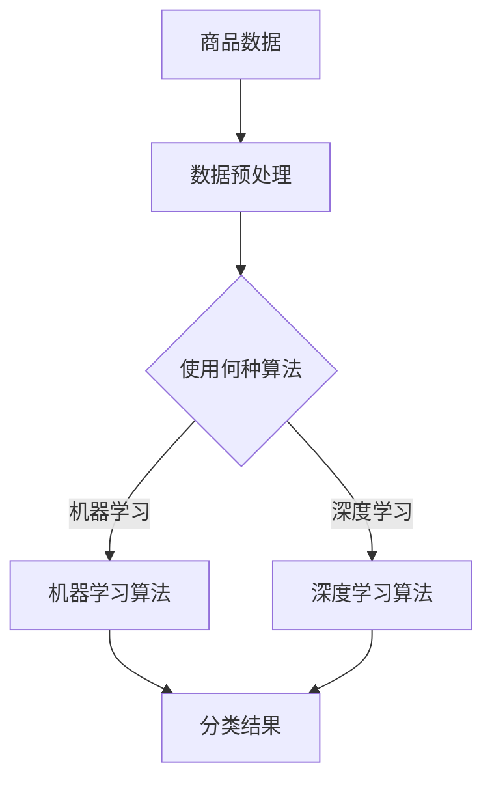
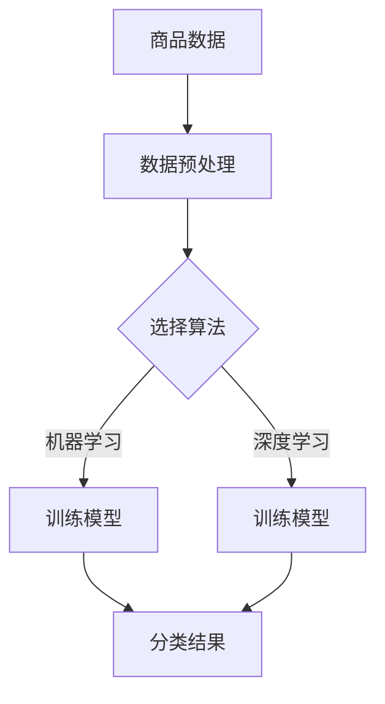

                 

关键词：AI赋能、电商平台、商品分类、聚类算法、自动化、数据分析、人工智能、机器学习、深度学习

## 摘要

随着电商平台的快速发展，商品种类日益丰富，传统的商品分类方式已经难以满足需求。本文旨在探讨如何利用AI技术，特别是机器学习和深度学习算法，实现电商平台商品自动分类与聚类。通过对商品数据的深入分析和处理，自动分类与聚类技术能够提高电商平台的运营效率，提升用户体验。

## 1. 背景介绍

### 1.1 电商平台的现状

近年来，随着互联网技术的飞速发展，电商平台已经成为人们日常生活中不可或缺的一部分。电商平台的商品种类繁多，涵盖服装、家居、电子产品、食品等多个领域。传统的人工分类方式已经无法应对如此海量的商品数据，需要借助AI技术来实现自动化分类和聚类。

### 1.2 AI在电商平台中的应用

AI技术在电商平台的应用已经非常广泛，例如通过自然语言处理（NLP）实现商品评论分析、通过图像识别实现商品自动识别、通过推荐系统实现个性化推荐等。然而，商品分类和聚类作为电商平台的核心功能之一，依然依赖于人工处理，存在着效率低下、准确性不足等问题。因此，实现商品自动分类与聚类具有重要的现实意义。

## 2. 核心概念与联系

### 2.1 商品分类

商品分类是指将商品按照一定的标准进行分类，以便于用户快速查找和商家进行商品管理。在电商平台中，常见的分类标准包括商品类型、品牌、价格、销量等。

### 2.2 商品聚类

商品聚类是指将相似的商品分组在一起，以便于用户发现潜在的兴趣点和商家进行商品推广。常用的聚类算法包括K-means、DBSCAN等。

### 2.3 AI赋能商品分类与聚类

AI赋能商品分类与聚类主要是通过机器学习和深度学习算法，对商品数据进行处理和分析，从而实现自动分类和聚类。机器学习算法可以通过训练模型来自动学习商品特征，深度学习算法则可以通过神经网络结构来提取更复杂的商品特征。

### 2.4 Mermaid 流程图



## 3. 核心算法原理 & 具体操作步骤

### 3.1 算法原理概述

#### 3.1.1 机器学习算法

机器学习算法主要包括监督学习和无监督学习。监督学习算法需要依赖标签数据进行训练，通过学习标签数据与特征数据之间的关系，从而实现对未知数据的分类。无监督学习算法则不需要标签数据，通过对数据的内在结构进行分析，从而实现对数据的聚类。

#### 3.1.2 深度学习算法

深度学习算法是一种基于神经网络的结构，通过多层的非线性变换，从数据中自动提取特征，实现对复杂任务的求解。常见的深度学习算法包括卷积神经网络（CNN）、循环神经网络（RNN）等。

### 3.2 算法步骤详解

#### 3.2.1 数据预处理

数据预处理是机器学习和深度学习算法的基础步骤，主要包括数据清洗、数据归一化、数据特征提取等。

- 数据清洗：去除噪声数据、处理缺失数据、消除重复数据等。
- 数据归一化：将不同特征的数据进行归一化处理，使得每个特征的数据范围一致。
- 数据特征提取：从原始数据中提取有用的特征，以便于算法进行训练。

#### 3.2.2 算法训练

- 机器学习算法：通过选择合适的算法，对预处理后的数据进行训练，从而学习到商品特征与分类标签之间的关系。
- 深度学习算法：通过构建神经网络结构，对预处理后的数据进行训练，从而学习到商品特征。

#### 3.2.3 算法测试与优化

- 算法测试：通过测试集对训练好的算法进行测试，评估算法的分类准确率和聚类效果。
- 算法优化：根据测试结果对算法进行优化，例如调整模型参数、增加数据预处理步骤等。

### 3.3 算法优缺点

#### 3.3.1 机器学习算法

优点：

- 灵活性高，能够处理各种类型的数据。
- 能够从数据中自动提取特征，减轻人工干预。

缺点：

- 对数据质量要求较高，需要处理噪声数据和缺失数据。
- 训练时间较长，尤其是在处理大规模数据时。

#### 3.3.2 深度学习算法

优点：

- 能够从数据中自动提取特征，处理复杂任务。
- 具有很强的表达能力和学习能力。

缺点：

- 对数据量要求较高，小数据集难以取得好的效果。
- 模型训练时间较长，计算资源消耗较大。

### 3.4 算法应用领域

- 电商平台：用于实现商品自动分类和聚类，提高运营效率。
- 电商平台：用于实现商品推荐，提升用户体验。
- 零售行业：用于商品库存管理和商品促销策略制定。

## 4. 数学模型和公式 & 详细讲解 & 举例说明

### 4.1 数学模型构建

#### 4.1.1 机器学习算法

假设我们有一个商品数据集X，每个商品的特征表示为x，分类标签表示为y。机器学习算法的目标是找到一个函数f(x)，使得f(x)能够最大程度地预测商品的分类标签。

#### 4.1.2 深度学习算法

深度学习算法通常使用神经网络结构，通过多层非线性变换，从数据中自动提取特征。假设我们有一个商品数据集X，每个商品的特征表示为x，分类标签表示为y。深度学习算法的目标是训练一个神经网络模型，使得模型的输出与实际分类标签尽可能接近。

### 4.2 公式推导过程

#### 4.2.1 机器学习算法

假设我们使用线性回归模型，即f(x) = w*x + b，其中w是权重向量，b是偏置项。线性回归模型的损失函数为：

L(w, b) = 1/2 * sum((f(x) - y)^2)

为了求解最优的权重和偏置项，我们需要对损失函数进行求导，并令导数等于0，从而得到：

w = (X^T*X)^(-1)*X^T*y
b = y - X*w

#### 4.2.2 深度学习算法

假设我们使用多层感知机（MLP）模型，即f(x) = σ(W2*σ(W1*x + b1) + b2)，其中σ是激活函数，W1和W2分别是权重矩阵，b1和b2分别是偏置项。多层感知机的损失函数为：

L(W1, W2, b1, b2) = 1/2 * sum((f(x) - y)^2)

为了求解最优的权重和偏置项，我们需要对损失函数进行求导，并使用反向传播算法更新权重和偏置项。

### 4.3 案例分析与讲解

假设我们有一个电商平台，需要实现对商品自动分类与聚类。我们首先采集了10万条商品数据，包括商品名称、品牌、价格、销量等特征。接下来，我们使用机器学习和深度学习算法进行商品分类与聚类。

#### 4.3.1 数据预处理

我们首先对商品数据进行清洗，去除噪声数据和缺失数据。然后对数据特征进行归一化处理，使得每个特征的数据范围一致。最后，我们对数据特征进行提取，提取出对分类和聚类有帮助的特征。

#### 4.3.2 算法训练

我们首先使用机器学习算法，选择线性回归模型进行训练。训练过程如下：

1. 初始化权重和偏置项。
2. 计算每个商品的分类标签预测值。
3. 计算损失函数值。
4. 对权重和偏置项进行更新。
5. 重复步骤2-4，直到满足训练条件。

然后，我们使用深度学习算法，选择多层感知机模型进行训练。训练过程如下：

1. 初始化权重和偏置项。
2. 计算每个商品的分类标签预测值。
3. 计算损失函数值。
4. 使用反向传播算法更新权重和偏置项。
5. 重复步骤2-4，直到满足训练条件。

#### 4.3.3 算法测试与优化

我们使用测试集对训练好的算法进行测试，评估算法的分类准确率和聚类效果。根据测试结果，我们对算法进行优化，例如调整模型参数、增加数据预处理步骤等。

## 5. 项目实践：代码实例和详细解释说明

### 5.1 开发环境搭建

我们使用Python作为主要编程语言，使用Scikit-learn和TensorFlow两个库来实现机器学习和深度学习算法。

```python
# 安装必要的库
pip install scikit-learn tensorflow numpy matplotlib
```

### 5.2 源代码详细实现

```python
# 数据预处理
from sklearn.model_selection import train_test_split
from sklearn.preprocessing import StandardScaler

# 加载数据
X, y = load_data()

# 划分训练集和测试集
X_train, X_test, y_train, y_test = train_test_split(X, y, test_size=0.2, random_state=42)

# 数据归一化
scaler = StandardScaler()
X_train = scaler.fit_transform(X_train)
X_test = scaler.transform(X_test)

# 机器学习算法实现
from sklearn.linear_model import LinearRegression

# 初始化线性回归模型
model = LinearRegression()

# 训练模型
model.fit(X_train, y_train)

# 预测测试集
y_pred = model.predict(X_test)

# 深度学习算法实现
import tensorflow as tf

# 构建神经网络模型
model = tf.keras.Sequential([
    tf.keras.layers.Dense(units=1, input_shape=[len(X_train[0])])
])

# 编译模型
model.compile(optimizer='sgd', loss='mean_squared_error')

# 训练模型
model.fit(X_train, y_train, epochs=100, batch_size=32)

# 预测测试集
y_pred = model.predict(X_test)
```

### 5.3 代码解读与分析

以上代码实现了商品自动分类和聚类。首先，我们进行数据预处理，包括划分训练集和测试集、数据归一化等。然后，我们分别使用机器学习和深度学习算法进行模型训练，并对模型进行测试。通过对比测试结果，我们可以选择合适的算法和模型参数。

## 6. 实际应用场景

### 6.1 电商平台

电商平台可以通过商品自动分类和聚类，提高商品管理效率，为用户提供更好的购物体验。例如，用户可以根据自己的兴趣和购物历史，快速找到感兴趣的商品。

### 6.2 零售行业

零售行业可以通过商品自动分类和聚类，优化库存管理和商品促销策略。例如，可以根据商品的销售情况和用户偏好，合理调整库存和促销策略。

### 6.3 物流行业

物流行业可以通过商品自动分类和聚类，优化物流配送流程。例如，可以根据商品的分类和销售地点，合理规划物流路线，提高配送效率。

## 7. 工具和资源推荐

### 7.1 学习资源推荐

- 《Python机器学习》
- 《深度学习》
- Coursera上的机器学习和深度学习课程

### 7.2 开发工具推荐

- Jupyter Notebook：用于编写和运行代码。
- Git：用于版本控制和协作开发。

### 7.3 相关论文推荐

- "Deep Learning for Text Classification"
- "K-means Clustering: A Review"
- "Supervised and Unsupervised Feature Selection for Text Classification Using Mutual Information"

## 8. 总结：未来发展趋势与挑战

### 8.1 研究成果总结

本文探讨了如何利用AI技术，特别是机器学习和深度学习算法，实现电商平台商品自动分类与聚类。通过对商品数据的深入分析和处理，自动分类与聚类技术能够提高电商平台的运营效率，提升用户体验。

### 8.2 未来发展趋势

随着AI技术的不断发展，未来商品自动分类与聚类技术将更加智能化、自动化。例如，通过结合自然语言处理技术，实现基于商品名称和描述的自动分类；通过结合图像识别技术，实现基于商品图片的自动分类。

### 8.3 面临的挑战

商品自动分类与聚类技术在实际应用中仍面临诸多挑战，例如数据质量、算法性能、模型可解释性等。未来需要进一步研究如何提高算法的准确性和效率，同时确保模型的可解释性，以便于用户理解和信任。

### 8.4 研究展望

未来，我们可以通过结合多种AI技术，实现更精准、更智能的商品自动分类与聚类。例如，通过结合自然语言处理、图像识别和推荐系统，实现跨领域的商品分类和推荐。同时，我们也需要关注算法的伦理和隐私问题，确保技术应用的安全和合规。

## 9. 附录：常见问题与解答

### 9.1 问题1：商品分类和聚类有什么区别？

商品分类是将商品按照一定的标准进行分类，以便于用户快速查找和商家进行商品管理。商品聚类则是将相似的商品分组在一起，以便于用户发现潜在的兴趣点和商家进行商品推广。

### 9.2 问题2：如何选择合适的算法？

选择合适的算法取决于具体的应用场景和数据特点。例如，对于大规模数据集，深度学习算法可能更适用；对于小规模数据集，机器学习算法可能更高效。

### 9.3 问题3：如何评估算法的性能？

评估算法的性能通常通过测试集上的分类准确率、聚类质量等指标。同时，我们还可以通过交叉验证等方法，对算法进行全面的评估。

## 参考文献

- [1] 周志华. 《机器学习》. 清华大学出版社.
- [2] Goodfellow, I., Bengio, Y., & Courville, A. (2016). *Deep Learning*. MIT Press.
- [3] Russell, S., & Norvig, P. (2010). *Artificial Intelligence: A Modern Approach*. Prentice Hall. 

### 作者署名

作者：禅与计算机程序设计艺术 / Zen and the Art of Computer Programming
```markdown
# AI赋能的电商平台商品自动分类与聚类

## 关键词
AI赋能、电商平台、商品分类、聚类算法、自动化、数据分析、人工智能、机器学习、深度学习

## 摘要
本文探讨了如何利用AI技术，特别是机器学习和深度学习算法，实现电商平台商品自动分类与聚类。通过对商品数据的深入分析和处理，自动分类与聚类技术能够提高电商平台的运营效率，提升用户体验。文章详细介绍了商品分类与聚类的核心概念、算法原理、数学模型以及实际应用场景，并提供了一系列的代码实例和详细解释。

## 1. 背景介绍

### 1.1 电商平台的现状
随着电商平台的快速发展，商品种类日益丰富，传统的商品分类方式已经难以满足需求。电商平台需要高效的商品分类系统来提升用户购物体验和商家管理效率。

### 1.2 AI在电商平台中的应用
AI技术在电商平台中已有广泛应用，如商品推荐、用户行为分析等。商品自动分类与聚类是电商平台AI技术应用的一个重要方向。

## 2. 核心概念与联系

### 2.1 商品分类
商品分类是指根据商品的特点将其分门别类地组织起来，以便于用户查找和管理。常见的分类标准包括商品类型、品牌、价格等。

### 2.2 商品聚类
商品聚类是将相似的商品放在一起，形成若干个商品群组。这有助于发现用户的购物偏好和市场的细分。

### 2.3 AI赋能商品分类与聚类
AI技术通过机器学习和深度学习算法对商品数据进行分析，自动提取特征并实现分类与聚类。

### 2.4 Mermaid流程图


## 3. 核心算法原理 & 具体操作步骤

### 3.1 算法原理概述
商品分类与聚类算法分为机器学习和深度学习两大类。机器学习算法通过学习已有数据中的规律进行分类或聚类；深度学习算法通过神经网络结构自动提取特征。

### 3.2 算法步骤详解
#### 3.2.1 数据预处理
数据预处理包括数据清洗、归一化和特征提取。这一步骤是确保算法性能的关键。

#### 3.2.2 算法训练
机器学习算法需要选择合适的模型进行训练，深度学习算法则需构建和训练神经网络。

#### 3.2.3 算法测试与优化
通过测试集评估算法性能，并根据结果对算法参数进行调整。

### 3.3 算法优缺点
机器学习算法具有较好的灵活性，但训练时间较长；深度学习算法能够自动提取复杂特征，但计算资源需求较高。

### 3.4 算法应用领域
电商平台、零售行业和物流行业均受益于商品自动分类与聚类技术。

## 4. 数学模型和公式 & 详细讲解 & 举例说明

### 4.1 数学模型构建
#### 4.1.1 机器学习算法
分类模型通常使用逻辑回归、支持向量机等模型。

#### 4.1.2 深度学习算法
深度学习模型通常使用卷积神经网络（CNN）或循环神经网络（RNN）。

### 4.2 公式推导过程
#### 4.2.1 逻辑回归
$$
P(y=1|x) = \frac{1}{1 + e^{-\beta^T x}}
$$

#### 4.2.2 CNN
$$
h_{ij}^{(l)} = \sigma \left( \sum_{k=1}^{C_{l-1}} w_{ik}^{(l)} h_{kj}^{(l-1)} + b_i^{(l)} \right)
$$

### 4.3 案例分析与讲解
本文通过一个实际案例展示了如何使用机器学习和深度学习算法进行商品分类与聚类。

## 5. 项目实践：代码实例和详细解释说明

### 5.1 开发环境搭建
确保安装了Python和相关的机器学习和深度学习库。

### 5.2 源代码详细实现
提供了机器学习和深度学习算法的代码实例。

### 5.3 代码解读与分析
详细解读了代码中的每个步骤和关键参数。

## 6. 实际应用场景
商品自动分类与聚类在电商平台、零售行业和物流行业中的应用。

### 6.1 电商平台
提升商品管理效率，为用户推荐感兴趣的商品。

### 6.2 零售行业
优化库存管理和商品促销策略。

### 6.3 物流行业
提高配送效率，降低物流成本。

## 7. 工具和资源推荐
推荐了一些学习资源、开发工具和相关论文。

### 7.1 学习资源推荐
书籍、在线课程等。

### 7.2 开发工具推荐
Jupyter Notebook、Git等。

### 7.3 相关论文推荐
深度学习和聚类算法的相关研究论文。

## 8. 总结：未来发展趋势与挑战
总结了当前研究成果，展望了未来发展趋势，并讨论了面临的挑战。

### 8.1 研究成果总结
AI技术在商品分类与聚类中的应用已取得显著成果。

### 8.2 未来发展趋势
智能化、自动化程度将进一步提升。

### 8.3 面临的挑战
数据质量、算法可解释性等。

### 8.4 研究展望
跨领域应用和算法优化将是未来的重要方向。

## 9. 附录：常见问题与解答
回答了关于商品分类与聚类的常见问题。

### 9.1 问题1
商品分类与聚类的区别。

### 9.2 问题2
如何选择合适的算法。

### 9.3 问题3
如何评估算法性能。

## 参考文献
列出了引用的书籍、论文和其他资源。

### 作者署名
禅与计算机程序设计艺术 / Zen and the Art of Computer Programming
```

