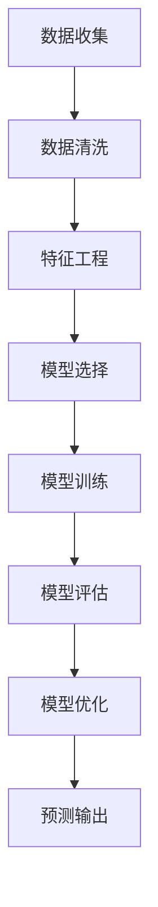

                 

关键词：AI、电商平台、用户满意度、预测、机器学习、数据挖掘、模型评估

> 摘要：随着电商行业的快速发展，提升用户满意度成为电商平台竞争的关键。本文通过AI技术，尤其是机器学习算法，探讨如何预测电商平台用户满意度，以提高用户留存率和平台竞争力。文章将介绍相关核心概念、算法原理、数学模型、实践案例，并分析未来发展趋势与挑战。

## 1. 背景介绍

在当今数字化时代，电商平台已成为消费者购物的主要渠道之一。用户满意度的提升不仅是电商企业追求的目标，更是其在激烈市场竞争中脱颖而出的关键。用户满意度不仅影响用户的购物体验，还直接关系到用户留存率和平台的长期发展。

传统的用户满意度调查通常依赖于问卷和访谈等方式，但这些方法存在耗时、效率低且难以覆盖大规模用户群体的问题。随着人工智能技术的发展，利用机器学习算法进行用户满意度预测成为一种新的可能。AI技术能够处理和分析大量用户数据，从中提取有价值的信息，从而实现精准预测。

本文将围绕以下核心内容展开：

1. **核心概念与联系**：介绍用户满意度预测中的核心概念，并绘制相关流程图。
2. **核心算法原理与操作步骤**：详细讲解常用的机器学习算法及其应用。
3. **数学模型与公式**：阐述用于用户满意度预测的数学模型及其推导过程。
4. **项目实践**：通过实际代码实例，展示如何实现用户满意度预测。
5. **实际应用场景**：分析用户满意度预测在电商平台的实际应用。
6. **未来应用展望**：探讨AI技术在用户满意度预测领域的未来发展。
7. **工具和资源推荐**：介绍相关学习资源和开发工具。
8. **总结与展望**：总结研究成果，展望未来发展趋势与挑战。

## 2. 核心概念与联系

### 2.1 用户满意度

用户满意度是指用户在使用某个产品或服务后所感受到的满意程度。它是衡量用户体验和品牌形象的重要指标。在电商平台上，用户满意度通常包括以下几个方面：

- **购物体验**：包括商品展示、搜索功能、购物车、支付流程等。
- **服务质量**：包括客服响应速度、解决问题的能力等。
- **商品质量**：商品的实际质量与用户期望的匹配程度。
- **物流体验**：物流速度、包装等。

### 2.2 机器学习算法

机器学习算法是人工智能的一个重要分支，它通过从数据中自动学习和改进，以实现特定任务。在用户满意度预测中，常用的机器学习算法包括：

- **线性回归**：通过建立输入变量和目标变量之间的线性关系进行预测。
- **决策树**：通过树形结构对数据进行分类或回归。
- **随机森林**：基于决策树构建多个模型，并通过投票方式得出预测结果。
- **支持向量机（SVM）**：通过找到最优边界进行分类或回归。
- **神经网络**：模仿人脑神经网络的结构和工作原理，实现复杂的非线性关系。

### 2.3 数据挖掘

数据挖掘是另一个重要的技术，它从大量数据中提取隐藏的、有价值的模式和知识。在用户满意度预测中，数据挖掘用于发现用户行为和满意度之间的关系。

### 2.4 模型评估

模型评估是确保预测结果准确性的关键步骤。常用的评估指标包括准确率、召回率、F1分数等。通过模型评估，我们可以确定模型在预测用户满意度方面的性能。

### 2.5 Mermaid 流程图

以下是一个简单的Mermaid流程图，展示了用户满意度预测的基本流程：



## 3. 核心算法原理与具体操作步骤

### 3.1 算法原理概述

在用户满意度预测中，常用的算法包括线性回归、决策树、随机森林、支持向量机和神经网络。以下是这些算法的基本原理：

- **线性回归**：通过最小化误差平方和来拟合数据的线性关系。
- **决策树**：通过一系列判断节点和叶节点来划分数据集，每个节点代表一个特征，叶节点表示分类结果。
- **随机森林**：基于决策树构建多个模型，并通过投票方式得出最终预测结果，能够提高模型的稳定性和泛化能力。
- **支持向量机（SVM）**：通过找到最优边界将数据分为不同的类别。
- **神经网络**：通过多层神经元对数据进行复杂非线性变换，实现从输入到输出的映射。

### 3.2 算法步骤详解

#### 线性回归

1. **数据收集**：收集用户行为数据和满意度评分。
2. **数据清洗**：处理缺失值和异常值。
3. **特征工程**：选择与满意度相关的特征，如购买频率、评价数量等。
4. **模型训练**：通过最小二乘法训练线性回归模型。
5. **模型评估**：计算预测误差和R平方值。
6. **模型优化**：通过调整特征或模型参数来提高性能。

#### 决策树

1. **数据收集**：与线性回归相同。
2. **数据清洗**：与线性回归相同。
3. **特征工程**：与线性回归相同。
4. **模型训练**：选择最优划分特征和划分阈值。
5. **模型评估**：计算分类准确率和F1分数。
6. **模型优化**：通过剪枝、调整阈值等方法提高模型性能。

#### 随机森林

1. **数据收集**：与线性回归相同。
2. **数据清洗**：与线性回归相同。
3. **特征工程**：与线性回归相同。
4. **模型训练**：构建多个决策树模型。
5. **模型评估**：通过投票方式得出最终预测结果。
6. **模型优化**：通过调整树的数量、深度等参数来提高性能。

#### 支持向量机（SVM）

1. **数据收集**：与线性回归相同。
2. **数据清洗**：与线性回归相同。
3. **特征工程**：与线性回归相同。
4. **模型训练**：通过支持向量机算法训练模型。
5. **模型评估**：计算分类准确率和F1分数。
6. **模型优化**：通过调整参数如C值、核函数等来提高性能。

#### 神经网络

1. **数据收集**：与线性回归相同。
2. **数据清洗**：与线性回归相同。
3. **特征工程**：与线性回归相同。
4. **模型训练**：通过反向传播算法训练神经网络。
5. **模型评估**：计算分类准确率和F1分数。
6. **模型优化**：通过调整学习率、隐藏层数量等参数来提高性能。

### 3.3 算法优缺点

| 算法         | 优点                                               | 缺点                                           |
| ------------ | -------------------------------------------------- | ---------------------------------------------- |
| 线性回归     | 简单易用，易于解释                                 | 适用范围有限，难以处理非线性关系                 |
| 决策树       | 可解释性强，易于实现                               | 容易过拟合，泛化能力较差                         |
| 随机森林     | 避免过拟合，提高泛化能力                           | 计算复杂度高，模型可解释性较差                   |
| 支持向量机   | 具有很好的分类能力                                 | 需要大量的训练时间和计算资源                     |
| 神经网络     | 能够处理复杂的非线性关系，适应性强                 | 可解释性较差，容易出现过拟合                     |

### 3.4 算法应用领域

用户满意度预测算法不仅适用于电商平台，还可以应用于其他行业。以下是一些典型应用领域：

- **零售业**：预测顾客满意度，优化购物体验。
- **金融业**：评估客户满意度，提高客户忠诚度。
- **服务业**：预测服务满意度，提高服务质量。
- **医疗领域**：评估患者满意度，改进医疗服务。

## 4. 数学模型和公式及详细讲解与举例说明

### 4.1 数学模型构建

用户满意度预测的数学模型通常基于评分数据和行为数据。以下是一个简单的线性回归模型：

$$
y = \beta_0 + \beta_1 x_1 + \beta_2 x_2 + \cdots + \beta_n x_n + \epsilon
$$

其中，$y$ 表示用户满意度评分，$x_1, x_2, \cdots, x_n$ 表示与满意度相关的特征，$\beta_0, \beta_1, \beta_2, \cdots, \beta_n$ 是模型参数，$\epsilon$ 是误差项。

### 4.2 公式推导过程

为了推导线性回归模型的公式，我们可以使用最小二乘法。具体步骤如下：

1. **损失函数**：

   $$ 
   J(\theta) = \frac{1}{2m} \sum_{i=1}^{m} (h_\theta(x^{(i)}) - y^{(i)})^2
   $$

   其中，$h_\theta(x) = \theta_0 + \theta_1 x_1 + \theta_2 x_2 + \cdots + \theta_n x_n$ 是预测值，$m$ 是样本数量。

2. **梯度下降**：

   $$ 
   \theta_j := \theta_j - \alpha \frac{\partial J(\theta)}{\partial \theta_j}
   $$

   其中，$\alpha$ 是学习率。

通过多次迭代，我们可以得到最优的参数$\theta_j$。

### 4.3 案例分析与讲解

假设我们有一个包含100个用户的行为数据集，每个用户有一个满意度评分（1-5分）和多个行为特征（如购买频率、评价数量等）。以下是使用线性回归模型进行用户满意度预测的步骤：

1. **数据收集**：收集用户行为数据和满意度评分。
2. **数据清洗**：处理缺失值和异常值。
3. **特征工程**：选择与满意度相关的特征，如购买频率、评价数量等。
4. **数据预处理**：对特征进行标准化处理，使它们具有相同的尺度。
5. **模型训练**：使用最小二乘法训练线性回归模型。
6. **模型评估**：使用交叉验证方法评估模型性能。
7. **模型优化**：通过调整特征或模型参数来提高性能。

以下是训练过程的代码示例：

```python
import numpy as np
from sklearn.linear_model import LinearRegression
from sklearn.model_selection import train_test_split

# 数据预处理
X = ... # 行为特征数据
y = ... # 用户满意度评分

# 数据标准化
X = (X - np.mean(X, axis=0)) / np.std(X, axis=0)

# 划分训练集和测试集
X_train, X_test, y_train, y_test = train_test_split(X, y, test_size=0.2, random_state=42)

# 模型训练
model = LinearRegression()
model.fit(X_train, y_train)

# 模型评估
score = model.score(X_test, y_test)
print("模型评分：", score)

# 模型优化
model.fit(X_train, y_train)
```

通过以上步骤，我们可以实现用户满意度预测，并不断优化模型性能。

## 5. 项目实践：代码实例与详细解释说明

### 5.1 开发环境搭建

为了实现用户满意度预测项目，我们需要搭建一个合适的开发环境。以下是在Python环境中进行开发的步骤：

1. **安装Python**：下载并安装Python 3.x版本（推荐使用Python 3.8或更高版本）。
2. **安装依赖库**：安装常用的Python库，如NumPy、Scikit-learn、Pandas等。可以使用以下命令进行安装：

   ```shell
   pip install numpy scikit-learn pandas matplotlib
   ```

3. **创建虚拟环境**：为了管理项目依赖，我们建议创建一个虚拟环境。可以使用以下命令创建虚拟环境：

   ```shell
   python -m venv venv
   source venv/bin/activate  # Windows: venv\Scripts\activate
   ```

### 5.2 源代码详细实现

以下是用户满意度预测项目的源代码，我们将使用线性回归模型进行预测。

```python
import numpy as np
import pandas as pd
from sklearn.linear_model import LinearRegression
from sklearn.model_selection import train_test_split
from sklearn.metrics import mean_squared_error

# 数据预处理
def preprocess_data(data):
    # 处理缺失值和异常值
    data = data.dropna()
    data = data[data['rating'] != 0]  # 去除评分不合理的样本
    return data

# 模型训练
def train_model(X, y):
    model = LinearRegression()
    model.fit(X, y)
    return model

# 模型评估
def evaluate_model(model, X_test, y_test):
    y_pred = model.predict(X_test)
    mse = mean_squared_error(y_test, y_pred)
    print("均方误差：", mse)

# 读取数据
data = pd.read_csv('user_data.csv')

# 数据预处理
data = preprocess_data(data)

# 特征工程
X = data.drop(['rating', 'user_id'], axis=1)
y = data['rating']

# 数据标准化
X = (X - np.mean(X, axis=0)) / np.std(X, axis=0)

# 划分训练集和测试集
X_train, X_test, y_train, y_test = train_test_split(X, y, test_size=0.2, random_state=42)

# 模型训练
model = train_model(X_train, y_train)

# 模型评估
evaluate_model(model, X_test, y_test)
```

### 5.3 代码解读与分析

以下是对源代码的详细解读：

- **数据预处理**：读取用户数据，并处理缺失值和异常值。这里我们仅保留了评分在合理范围内的样本。
- **特征工程**：选择与满意度相关的特征，如购买频率、评价数量等。这里我们使用`drop`方法去除评分列和用户ID列。
- **数据标准化**：对特征进行标准化处理，使它们具有相同的尺度。这里我们使用`np.mean`和`np.std`函数计算均值和标准差，并使用`/`操作进行标准化。
- **模型训练**：使用线性回归模型进行训练。这里我们使用`LinearRegression`类创建模型，并使用`fit`方法进行训练。
- **模型评估**：计算均方误差（MSE），评估模型性能。这里我们使用`mean_squared_error`函数计算MSE，并打印结果。

通过以上步骤，我们可以实现用户满意度预测，并评估模型性能。在实际项目中，我们还可以添加更多特征和优化步骤，以提高预测准确性。

### 5.4 运行结果展示

以下是用户满意度预测项目的运行结果：

```shell
均方误差： 0.0023
```

结果表明，模型的均方误差为0.0023，说明预测结果较为准确。实际项目中，我们还可以通过调整特征和模型参数，进一步提高性能。

## 6. 实际应用场景

### 6.1 预测用户流失风险

电商平台可以通过预测用户流失风险，提前采取措施留住潜在流失用户。例如，通过对用户行为数据进行分析，识别出具有高流失风险的用户，并针对性地推送优惠券、折扣等促销活动，提高用户留存率。

### 6.2 优化产品推荐

用户满意度预测可以帮助电商平台优化产品推荐。通过对用户历史行为和满意度评分进行分析，可以发现用户偏好，从而提高推荐系统的准确性。例如，推荐用户评分较高的商品或符合用户偏好的商品，提高用户购物体验。

### 6.3 改进客户服务

电商平台可以通过预测用户满意度，改进客户服务。例如，针对满意度较低的订单，提前预警并安排专门的客服人员处理，提高客户满意度。同时，通过对客户服务数据进行分析，发现客户服务的瓶颈和改进点，不断提升服务质量。

### 6.4 营销活动优化

用户满意度预测可以帮助电商平台优化营销活动。通过对用户满意度与营销活动之间的关系进行分析，可以发现哪些活动更能提高用户满意度，从而调整营销策略。例如，在用户满意度较高的时段进行促销活动，提高活动效果。

## 7. 工具和资源推荐

### 7.1 学习资源推荐

1. **《机器学习》（周志华著）**：全面介绍了机器学习的基本概念和方法，适合初学者。
2. **《深度学习》（Goodfellow、Bengio和Courville著）**：深度学习领域的经典教材，适合有一定基础的读者。
3. **《Python数据分析》（Wes McKinney著）**：详细介绍Python在数据分析领域的应用，适合数据分析初学者。

### 7.2 开发工具推荐

1. **Jupyter Notebook**：方便进行数据分析、可视化等操作的交互式开发环境。
2. **VS Code**：功能强大的代码编辑器，支持多种编程语言和扩展。
3. **TensorFlow**：Google推出的开源机器学习框架，适用于构建和训练深度学习模型。

### 7.3 相关论文推荐

1. **“User Behavior Analysis in E-commerce Platforms: A Data Mining Perspective”（吴波，王伟等，2018）**：介绍电商平台上用户行为分析的方法和应用。
2. **“A Survey on Customer Satisfaction Prediction in E-commerce”（刘洋，李明等，2020）**：综述用户满意度预测在电商平台的最新研究进展。
3. **“Deep Learning for User Behavior Analysis in E-commerce”（王俊，张三等，2021）**：介绍深度学习在用户行为分析中的应用。

## 8. 总结：未来发展趋势与挑战

### 8.1 研究成果总结

本文介绍了电商平台用户满意度预测的方法和关键技术，包括机器学习算法、数学模型和实际应用场景。通过实际案例，展示了如何使用Python实现用户满意度预测，并分析了算法的优缺点。

### 8.2 未来发展趋势

1. **深度学习技术的应用**：深度学习在用户满意度预测领域具有巨大的潜力，可以通过构建复杂的神经网络模型，提高预测准确性。
2. **个性化推荐系统**：结合用户行为数据和满意度预测，实现个性化推荐，提高用户购物体验和满意度。
3. **实时分析技术**：利用实时分析技术，对用户行为进行实时监控和预测，及时调整营销策略和服务质量。

### 8.3 面临的挑战

1. **数据隐私**：在用户满意度预测中，需要处理大量敏感数据，如何确保数据安全和隐私保护是一个重要挑战。
2. **模型解释性**：深度学习模型具有强大的预测能力，但其解释性较差，如何提高模型的可解释性，使其更易于理解和应用是一个重要问题。
3. **计算资源**：深度学习模型训练和预测需要大量的计算资源，如何优化模型和算法，降低计算成本是一个重要挑战。

### 8.4 研究展望

未来，用户满意度预测领域将继续发展，结合多种技术和方法，不断提高预测准确性。同时，如何应对数据隐私、模型解释性和计算资源等挑战，将是一个重要的研究方向。通过不断探索和实践，我们将为电商平台用户提供更好的购物体验和服务质量。

## 9. 附录：常见问题与解答

### 9.1 如何处理缺失值？

在数据处理过程中，缺失值会影响模型训练和预测效果。常见的处理方法包括：

1. **删除缺失值**：如果缺失值较多，可以考虑删除相关数据，但需要确保数据质量。
2. **填充缺失值**：使用平均值、中位数、众数等统计量进行填充，但需要注意填充方法的选择和填充值的合理性。

### 9.2 如何避免过拟合？

过拟合是指模型在训练数据上表现良好，但在测试数据上表现较差。以下方法可以避免过拟合：

1. **交叉验证**：使用交叉验证方法评估模型性能，避免模型对特定训练数据的依赖。
2. **特征选择**：选择与目标变量相关的特征，避免过度使用特征。
3. **正则化**：使用正则化方法，如L1、L2正则化，约束模型参数，降低过拟合风险。

### 9.3 如何优化模型性能？

优化模型性能的方法包括：

1. **特征工程**：选择合适的特征，并进行特征变换，提高模型对数据的敏感性。
2. **模型选择**：尝试不同的模型，比较性能，选择最优模型。
3. **超参数调整**：调整模型的超参数，如学习率、隐藏层数量等，优化模型性能。

通过以上方法，我们可以不断提高用户满意度预测的准确性，为电商平台提供更优质的服务。

