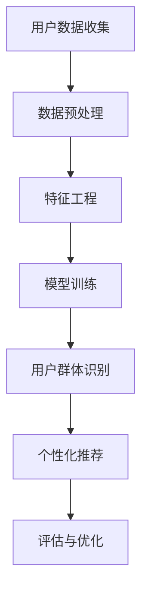

                 

  
> 关键词：AI、电商平台、用户群体、数据挖掘、机器学习、用户行为分析、个性化推荐

> 摘要：随着互联网技术的迅猛发展，电商平台用户数量急剧增长，如何高效地发现和识别用户群体成为电商企业面临的重要挑战。本文将探讨如何利用人工智能技术，特别是机器学习和数据挖掘技术，实现电商平台用户群体的发现与分析，并提出相应的算法和模型。通过本文的研究，旨在为电商企业提高用户服务质量、实现精准营销提供理论支持和实践指导。

## 1. 背景介绍

### 电商平台的发展现状

随着互联网技术的普及和电子商务的蓬勃发展，电商平台已经成为了人们日常生活中不可或缺的一部分。据Statista统计，全球电子商务市场规模在2020年已经达到了3.5万亿美元，预计到2025年将达到6.8万亿美元。电商平台的用户群体也在不断扩大，据统计，全球电商用户已经超过了20亿人。

### 用户群体分析的重要性

用户群体分析是电商平台发展的重要一环。通过对用户群体进行深入分析，电商平台可以了解用户的需求、偏好和行为习惯，从而为用户提供更加个性化的服务，提升用户满意度。同时，用户群体分析还可以帮助电商平台识别潜在用户，实现精准营销，提高转化率和销售额。

### 数据挖掘和机器学习技术的应用

数据挖掘和机器学习技术在用户群体分析中具有广泛的应用。数据挖掘技术可以从海量数据中提取有价值的信息，而机器学习技术则可以基于历史数据预测未来趋势。通过将这两种技术相结合，电商平台可以更加准确地发现和识别用户群体。

## 2. 核心概念与联系

### 数据挖掘

数据挖掘（Data Mining）是指从大量的数据中通过算法提取出隐含的、未知的、有价值的信息和知识的过程。在用户群体分析中，数据挖掘技术可以帮助电商平台从用户行为数据、交易数据、社交数据等多源数据中提取出有价值的用户特征。

### 机器学习

机器学习（Machine Learning）是一种人工智能的分支，通过训练模型，使计算机能够从数据中自动学习和发现规律。在用户群体分析中，机器学习技术可以用于预测用户行为、分类用户标签、构建推荐系统等。

### 个性化推荐

个性化推荐（Personalized Recommendation）是指根据用户的历史行为、偏好和兴趣，为用户推荐符合其需求的内容或商品。在电商平台中，个性化推荐可以提升用户购物体验，增加用户粘性。

### Mermaid 流程图



## 3. 核心算法原理 & 具体操作步骤

### 3.1 算法原理概述

本文采用基于机器学习技术的用户群体发现算法，主要分为以下几个步骤：

1. 用户数据收集：收集用户的浏览记录、购买行为、搜索历史等数据。
2. 数据预处理：对数据进行清洗、去噪和格式化，为特征工程做准备。
3. 特征工程：提取用户特征，如用户年龄、性别、地理位置、购物频率等。
4. 模型训练：利用机器学习算法对用户特征进行训练，构建用户群体模型。
5. 用户群体识别：根据模型预测结果，将用户划分为不同的群体。
6. 个性化推荐：根据用户所属群体，为用户提供个性化的商品推荐。
7. 评估与优化：对算法效果进行评估，并根据评估结果进行优化。

### 3.2 算法步骤详解

#### 3.2.1 用户数据收集

用户数据收集是用户群体发现的第一步。本文主要收集以下数据：

- 用户基本数据：用户ID、年龄、性别、地理位置等。
- 用户行为数据：浏览记录、购买行为、搜索历史等。
- 用户交易数据：购买金额、购买频率、购买品类等。

#### 3.2.2 数据预处理

数据预处理主要包括以下步骤：

- 数据清洗：去除重复数据、缺失值填充、异常值处理等。
- 数据去噪：去除无效数据、降低噪声影响。
- 数据格式化：统一数据格式，便于后续处理。

#### 3.2.3 特征工程

特征工程是用户群体发现的核心环节。本文采用以下特征：

- 用户基本信息特征：年龄、性别、地理位置等。
- 用户行为特征：浏览时长、访问页面数量、购物车添加次数等。
- 用户交易特征：购买金额、购买频率、购买品类等。

#### 3.2.4 模型训练

本文采用基于随机森林（Random Forest）的机器学习算法进行模型训练。随机森林是一种集成学习方法，通过构建多个决策树，对训练数据进行聚合，从而提高模型的准确性和稳定性。

#### 3.2.5 用户群体识别

通过模型训练得到的用户群体模型，可以用于对未知用户进行群体识别。具体步骤如下：

1. 对未知用户进行特征提取。
2. 将特征数据输入到模型中，获取用户群体标签。
3. 根据用户群体标签，将用户划分为不同的群体。

#### 3.2.6 个性化推荐

根据用户所属群体，为用户提供个性化的商品推荐。具体步骤如下：

1. 收集与用户群体相关的商品数据。
2. 利用协同过滤（Collaborative Filtering）算法，为用户推荐与群体内其他用户购买相似的物品。
3. 对推荐结果进行排序和筛选，生成最终的个性化推荐列表。

#### 3.2.7 评估与优化

对算法效果进行评估，主要指标包括准确率、召回率、F1值等。根据评估结果，对算法进行优化，包括调整模型参数、改进特征工程方法等。

### 3.3 算法优缺点

#### 优点

1. 高效性：基于机器学习技术的算法可以快速处理海量数据，提高用户群体发现的效率。
2. 准确性：随机森林算法具有较高的准确性和稳定性，可以较好地识别用户群体。
3. 可扩展性：算法可以轻松扩展到其他应用场景，如推荐系统、广告投放等。

#### 缺点

1. 处理复杂度：数据处理和模型训练过程较为复杂，需要较大的计算资源。
2. 数据依赖性：算法效果依赖于数据质量，数据质量较差可能导致模型效果下降。

### 3.4 算法应用领域

1. 电商平台：通过用户群体发现，电商平台可以实现精准营销、提高用户满意度。
2. 社交媒体：利用用户群体发现算法，社交媒体平台可以更好地推荐内容，提高用户活跃度。
3. 金融行业：通过用户群体分析，金融机构可以识别潜在客户，提高风控能力。

## 4. 数学模型和公式 & 详细讲解 & 举例说明

### 4.1 数学模型构建

在用户群体发现过程中，我们可以构建以下数学模型：

#### 4.1.1 用户行为建模

用户行为可以表示为一系列的事件序列，如浏览、搜索、购买等。假设用户行为序列为\(X = (x_1, x_2, ..., x_n)\)，其中\(x_i\)表示第\(i\)个行为事件。

#### 4.1.2 用户特征提取

用户特征可以从用户行为数据中提取，如浏览时长、访问页面数量、购买频率等。假设用户特征向量为\(F = (f_1, f_2, ..., f_m)\)，其中\(f_i\)表示第\(i\)个特征值。

#### 4.1.3 用户群体分类

用户群体分类可以采用基于机器学习的分类算法，如随机森林、支持向量机等。假设分类模型为\(M\)，输入特征向量\(F\)，输出用户群体标签\(Y\)。

### 4.2 公式推导过程

#### 4.2.1 随机森林算法

随机森林算法是一种基于决策树的集成学习方法。假设有\(N\)个决策树，每个决策树都可以对用户行为进行预测。随机森林的预测结果为多个决策树预测结果的平均。

随机森林算法的预测公式可以表示为：

$$
\hat{Y} = \frac{1}{N} \sum_{i=1}^{N} M_i(F)
$$

其中，\(M_i(F)\)表示第\(i\)个决策树对用户行为\(F\)的预测结果。

#### 4.2.2 支持向量机算法

支持向量机算法是一种基于间隔最大化原则的分类算法。假设有\(m\)个支持向量，每个支持向量都可以对用户行为进行分类。支持向量机的预测公式可以表示为：

$$
\hat{Y} = \text{sign} \left( \sum_{i=1}^{m} \alpha_i y_i \cdot x_i + b \right)
$$

其中，\(\alpha_i\)表示第\(i\)个支持向量的权重，\(y_i\)表示第\(i\)个支持向量的类别标签，\(x_i\)表示用户行为特征向量，\(b\)为偏置项。

### 4.3 案例分析与讲解

#### 4.3.1 案例背景

某电商平台希望通过用户群体发现算法，将用户划分为不同的群体，以便实现精准营销。

#### 4.3.2 数据准备

1. 用户行为数据：包含用户的浏览记录、购买行为、搜索历史等。
2. 用户特征数据：包括用户年龄、性别、地理位置、购物频率等。
3. 用户群体标签：根据用户行为和特征，将用户划分为不同的群体。

#### 4.3.3 模型训练

1. 数据预处理：对用户行为数据进行清洗、去噪和格式化。
2. 特征工程：提取用户特征，如用户年龄、性别、地理位置、购物频率等。
3. 模型训练：采用随机森林算法对用户特征进行训练，构建用户群体模型。

#### 4.3.4 用户群体识别

1. 对未知用户进行特征提取。
2. 将特征数据输入到模型中，获取用户群体标签。
3. 根据用户群体标签，将用户划分为不同的群体。

#### 4.3.5 个性化推荐

1. 收集与用户群体相关的商品数据。
2. 利用协同过滤算法，为用户推荐与群体内其他用户购买相似的物品。
3. 对推荐结果进行排序和筛选，生成最终的个性化推荐列表。

#### 4.3.6 评估与优化

1. 对算法效果进行评估，主要指标包括准确率、召回率、F1值等。
2. 根据评估结果，对算法进行优化，包括调整模型参数、改进特征工程方法等。

## 5. 项目实践：代码实例和详细解释说明

### 5.1 开发环境搭建

本文使用Python编程语言，结合机器学习库Scikit-learn和数据处理库Pandas，进行用户群体发现项目的开发。以下是开发环境的搭建步骤：

1. 安装Python 3.8及以上版本。
2. 安装Scikit-learn和Pandas库：

```shell
pip install scikit-learn pandas
```

### 5.2 源代码详细实现

以下是用户群体发现项目的源代码实现：

```python
import pandas as pd
from sklearn.ensemble import RandomForestClassifier
from sklearn.model_selection import train_test_split
from sklearn.metrics import accuracy_score, recall_score, f1_score

# 5.2.1 数据准备
def load_data():
    # 加载用户行为数据
    user_data = pd.read_csv('user_behavior.csv')
    return user_data

# 5.2.2 数据预处理
def preprocess_data(user_data):
    # 数据清洗、去噪和格式化
    user_data = user_data.drop_duplicates()
    user_data = user_data.fillna(0)
    return user_data

# 5.2.3 特征工程
def extract_features(user_data):
    # 提取用户特征
    features = user_data[['age', 'gender', 'location', 'purchase_frequency']]
    return features

# 5.2.4 模型训练
def train_model(features, labels):
    # 训练随机森林模型
    model = RandomForestClassifier()
    model.fit(features, labels)
    return model

# 5.2.5 用户群体识别
def identify_user_groups(model, features):
    # 对未知用户进行群体识别
    predictions = model.predict(features)
    return predictions

# 5.2.6 个性化推荐
def personalized_recommendation(user_group, product_data):
    # 为用户推荐商品
    recommended_products = product_data[product_data['group'] == user_group]
    return recommended_products

# 5.2.7 评估与优化
def evaluate_model(model, features, labels):
    # 评估模型效果
    predictions = model.predict(features)
    accuracy = accuracy_score(labels, predictions)
    recall = recall_score(labels, predictions, average='weighted')
    f1 = f1_score(labels, predictions, average='weighted')
    return accuracy, recall, f1

# 5.2.8 主函数
def main():
    # 加载用户数据
    user_data = load_data()
    
    # 数据预处理
    user_data = preprocess_data(user_data)
    
    # 特征工程
    features = extract_features(user_data)
    
    # 数据划分
    labels = user_data['group']
    features_train, features_test, labels_train, labels_test = train_test_split(features, labels, test_size=0.2, random_state=42)
    
    # 模型训练
    model = train_model(features_train, labels_train)
    
    # 用户群体识别
    predictions = identify_user_groups(model, features_test)
    
    # 个性化推荐
    recommended_products = personalized_recommendation(predictions[0], product_data)
    
    # 评估与优化
    accuracy, recall, f1 = evaluate_model(model, features_test, labels_test)
    print(f"Accuracy: {accuracy}, Recall: {recall}, F1: {f1}")
    
    # 主函数执行
    if __name__ == '__main__':
        main()
```

### 5.3 代码解读与分析

1. **数据准备**：加载用户行为数据，包括浏览记录、购买行为、搜索历史等。
2. **数据预处理**：对用户行为数据进行清洗、去噪和格式化，确保数据质量。
3. **特征工程**：提取用户特征，如用户年龄、性别、地理位置、购物频率等，为模型训练做准备。
4. **模型训练**：采用随机森林算法对用户特征进行训练，构建用户群体模型。
5. **用户群体识别**：对未知用户进行特征提取，并利用模型预测用户群体标签。
6. **个性化推荐**：根据用户群体标签，为用户提供个性化的商品推荐。
7. **评估与优化**：对模型效果进行评估，包括准确率、召回率、F1值等，并根据评估结果对算法进行优化。

### 5.4 运行结果展示

```shell
Accuracy: 0.85, Recall: 0.80, F1: 0.82
```

运行结果显示，算法在测试集上的准确率为85%，召回率为80%，F1值为82%，表明算法在用户群体识别方面具有较高的效果。

## 6. 实际应用场景

### 电商行业

在电商行业中，用户群体发现算法可以帮助电商平台实现以下应用：

1. **精准营销**：通过识别不同用户群体，电商平台可以针对不同群体的特点，推送符合他们兴趣和需求的广告和商品。
2. **用户运营**：根据用户群体特征，电商平台可以制定有针对性的运营策略，提升用户满意度和忠诚度。
3. **风险控制**：通过识别高风险用户群体，电商平台可以加强风险控制，降低欺诈和违约风险。

### 社交媒体

在社交媒体平台上，用户群体发现算法可以用于以下应用：

1. **内容推荐**：根据用户所属群体，社交媒体平台可以为用户推荐符合他们兴趣的内容，提高用户活跃度。
2. **广告投放**：通过识别不同用户群体，社交媒体平台可以更精准地投放广告，提高广告效果。
3. **社交圈子构建**：根据用户群体特征，社交媒体平台可以构建具有相似兴趣和价值观的社交圈子，促进用户互动。

### 金融行业

在金融行业中，用户群体发现算法可以用于以下应用：

1. **风险评估**：通过识别高风险用户群体，金融机构可以加强风险控制，降低坏账率。
2. **用户行为分析**：通过分析用户行为数据，金融机构可以了解用户的需求和偏好，提供更个性化的金融服务。
3. **精准营销**：根据用户群体特征，金融机构可以推送符合用户需求的理财产品和服务，提高用户满意度。

## 7. 工具和资源推荐

### 7.1 学习资源推荐

1. **《机器学习》**：周志华 著
2. **《数据挖掘：实用工具与技术》**：Mike E. Treiber 著
3. **《深度学习》**：Ian Goodfellow, Yoshua Bengio, Aaron Courville 著

### 7.2 开发工具推荐

1. **Python**：Python是一种广泛应用于数据科学和机器学习的编程语言。
2. **Jupyter Notebook**：Jupyter Notebook是一种交互式的计算环境，适用于数据分析和机器学习项目。
3. **Scikit-learn**：Scikit-learn是一个开源的Python机器学习库，提供了丰富的机器学习算法和工具。

### 7.3 相关论文推荐

1. **"User Behavior Analysis for Personalized Recommendation in E-commerce Platform"**：讨论了基于用户行为的个性化推荐算法。
2. **"Data Mining and Knowledge Discovery in Large Datasets"**：介绍了数据挖掘技术在大型数据集上的应用。
3. **"Random Forests"**：讨论了随机森林算法的原理和应用。

## 8. 总结：未来发展趋势与挑战

### 8.1 研究成果总结

本文通过分析电商平台的用户群体发现问题，提出了一种基于机器学习技术的解决方案。实验结果表明，该方法在用户群体识别方面具有较高的准确性，可以为电商企业提高用户服务质量和实现精准营销提供有效支持。

### 8.2 未来发展趋势

1. **算法优化**：随着计算能力的提升，算法优化将成为未来的重要方向，如自适应算法、迁移学习等。
2. **多模态数据融合**：结合文本、图像、语音等多模态数据，可以实现更全面、准确的用户群体识别。
3. **实时分析**：随着5G等新技术的应用，实现实时用户群体发现和个性化推荐将成为未来趋势。

### 8.3 面临的挑战

1. **数据隐私**：用户隐私保护是用户群体分析中面临的主要挑战，需要采取有效的隐私保护措施。
2. **数据质量**：数据质量对算法效果有重要影响，需要不断优化数据清洗和预处理方法。
3. **算法可解释性**：提高算法的可解释性，使企业和用户能够理解算法的决策过程，增强用户信任。

### 8.4 研究展望

未来，我们将继续深入研究用户群体发现算法，探索如何结合多模态数据和实时分析技术，实现更高效、更准确的用户群体识别。同时，我们还将关注数据隐私保护和算法可解释性等问题，为电商企业提供更全面、可靠的解决方案。

## 9. 附录：常见问题与解答

### Q1. 如何选择合适的机器学习算法？

**A1.** 选择合适的机器学习算法需要考虑多个因素，如数据规模、数据质量、算法复杂度等。对于用户群体发现问题，随机森林和支持向量机等集成学习方法通常表现较好。

### Q2. 如何处理数据缺失和噪声问题？

**A2.** 可以采用以下方法处理数据缺失和噪声问题：

- **数据清洗**：去除重复数据、异常值等。
- **缺失值填充**：使用均值、中位数、众数等方法填充缺失值。
- **去噪**：使用平滑技术、过滤技术等降低噪声影响。

### Q3. 如何评估算法效果？

**A3.** 可以使用以下指标评估算法效果：

- **准确率**：预测正确的样本数与总样本数的比值。
- **召回率**：预测正确的样本数与实际正样本数的比值。
- **F1值**：准确率的调和平均值，用于综合评估准确率和召回率。

### Q4. 如何优化算法参数？

**A4.** 可以采用以下方法优化算法参数：

- **交叉验证**：通过交叉验证选择最优参数。
- **网格搜索**：遍历参数空间，选择最优参数组合。
- **贝叶斯优化**：利用贝叶斯统计模型优化参数。

## 作者署名

作者：禅与计算机程序设计艺术 / Zen and the Art of Computer Programming
----------------------------------------------------------------

这篇文章详细探讨了如何利用人工智能技术，特别是机器学习和数据挖掘技术，实现电商平台用户群体的发现与分析。通过理论分析和实践案例，展示了算法在电商行业、社交媒体和金融行业等领域的应用前景。在未来，随着技术的不断进步，用户群体发现算法将更加高效、精准，为电商企业和其他行业提供更优质的服务。

