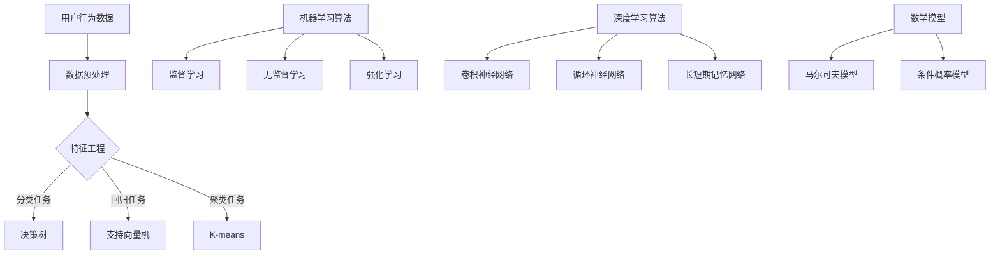

                 

关键词：人工智能，电商平台，用户行为序列，分析，算法原理，数学模型，项目实践，应用场景，工具推荐，发展趋势，挑战

> 摘要：本文探讨了AI在电商平台用户行为序列分析中的应用。首先介绍了用户行为序列分析的重要性，随后深入解析了核心概念和算法原理，并详细讲解了数学模型构建和公式推导过程。接着，通过具体案例和代码实例，阐述了算法的实际应用。最后，对未来的发展方向和面临的挑战进行了展望，并推荐了相关学习和开发工具资源。

## 1. 背景介绍

随着互联网技术的飞速发展，电商平台成为了人们日常购物的重要渠道。用户在电商平台上的行为，如浏览、搜索、购买等，形成了丰富的行为序列数据。这些数据不仅反映了用户的需求和偏好，还为电商平台优化用户体验、提高销售额提供了宝贵的参考。因此，如何高效地分析和利用这些用户行为序列数据，成为电商平台亟需解决的问题。

人工智能（AI）的兴起为用户行为序列分析带来了新的契机。通过机器学习和深度学习算法，可以从海量的用户行为数据中挖掘出有价值的信息，为电商平台的运营决策提供支持。本文将探讨AI在电商平台用户行为序列分析中的应用，从核心概念、算法原理到实际操作，全面解析这一领域的最新进展。

## 2. 核心概念与联系

### 2.1 用户行为序列

用户行为序列是指用户在电商平台上的操作序列，如浏览商品、搜索关键词、加入购物车、下单等。这些行为记录了用户在平台上的活动轨迹，是分析用户行为的重要数据来源。

### 2.2 序列模型

序列模型是用于处理序列数据的统计模型，如隐马尔可夫模型（HMM）、循环神经网络（RNN）等。这些模型可以捕捉用户行为序列中的时序特征，为后续的分析提供基础。

### 2.3 机器学习算法

机器学习算法是AI的核心技术，包括监督学习、无监督学习和强化学习等。在用户行为序列分析中，常用算法有决策树、支持向量机（SVM）、朴素贝叶斯等。

### 2.4 深度学习算法

深度学习算法是机器学习的一个重要分支，通过多层神经网络，能够自动提取特征并进行复杂模式识别。在用户行为序列分析中，常用的深度学习算法有卷积神经网络（CNN）、循环神经网络（RNN）和长短期记忆网络（LSTM）等。

### 2.5 数学模型

数学模型是用于描述用户行为序列数据中隐藏规律的工具。常见的数学模型有马尔可夫模型、条件概率模型等。这些模型可以用于预测用户下一步行为、识别用户偏好等。

### 2.6 Mermaid流程图

以下是用户行为序列分析中的核心概念和架构的Mermaid流程图：



## 3. 核心算法原理 & 具体操作步骤

### 3.1 算法原理概述

用户行为序列分析的核心算法主要包括机器学习算法和深度学习算法。机器学习算法通过历史数据训练模型，预测用户未来的行为。深度学习算法则通过多层神经网络，自动提取特征并建立复杂的模式识别模型。

### 3.2 算法步骤详解

#### 3.2.1 数据预处理

数据预处理是用户行为序列分析的重要环节。主要包括数据清洗、数据去重、数据规范化等步骤。

1. 数据清洗：去除无效数据、处理缺失值、去除噪声数据等。
2. 数据去重：删除重复的行为记录，保证数据的唯一性。
3. 数据规范化：将不同尺度的数据进行标准化处理，便于后续分析。

#### 3.2.2 特征工程

特征工程是提升模型性能的关键。针对用户行为序列数据，可以从以下几个方面进行特征提取：

1. 时间特征：用户行为发生的时间戳、时间段等。
2. 行为特征：用户浏览、搜索、购买等行为类型、频次、时长等。
3. 用户特征：用户的基本信息、历史行为等。
4. 商品类特征：商品的价格、销量、评价等。

#### 3.2.3 模型训练与评估

1. 选择合适的模型：根据任务类型（分类、回归、聚类等），选择相应的机器学习或深度学习模型。
2. 模型训练：使用训练数据训练模型，调整模型参数。
3. 模型评估：使用验证集对模型进行评估，选择性能最优的模型。

#### 3.2.4 模型应用

1. 预测用户行为：根据训练好的模型，预测用户下一步行为。
2. 识别用户偏好：通过聚类算法，识别用户的偏好群体。
3. 优化运营策略：根据用户行为预测和偏好分析，为电商平台的运营提供决策支持。

### 3.3 算法优缺点

#### 优点：

1. 高效性：机器学习和深度学习算法可以处理海量数据，提高分析效率。
2. 泛化能力强：通过模型训练，可以对新用户、新行为进行有效预测。
3. 自适应：随着数据量的增加，模型性能会逐步提升。

#### 缺点：

1. 数据依赖：算法性能高度依赖于数据质量，数据质量问题会导致模型失效。
2. 过拟合：在训练过程中，模型可能过于适应训练数据，导致泛化能力不足。
3. 计算资源消耗：深度学习算法对计算资源要求较高，可能导致部署成本增加。

### 3.4 算法应用领域

用户行为序列分析算法广泛应用于电商、金融、教育等领域。以下为部分应用场景：

1. 电商平台：通过用户行为预测，提高销售额、优化营销策略。
2. 金融风控：通过用户行为分析，识别潜在风险用户，预防欺诈行为。
3. 教育个性化：根据用户学习行为，提供个性化课程推荐，提高学习效果。

## 4. 数学模型和公式 & 详细讲解 & 举例说明

### 4.1 数学模型构建

在用户行为序列分析中，常用的数学模型包括马尔可夫模型和条件概率模型。以下分别介绍这两种模型的构建方法。

#### 马尔可夫模型

马尔可夫模型是一种用于处理离散时间序列的统计模型，其核心假设为当前状态仅与前一状态相关，与其他历史状态无关。马尔可夫模型的数学表示如下：

\[ P(X_t = x_t | X_{t-1} = x_{t-1}, X_{t-2} = x_{t-2}, \ldots) = P(X_t = x_t | X_{t-1} = x_{t-1}) \]

其中，\(X_t\) 表示时间 \(t\) 的状态，\(P(X_t = x_t | X_{t-1} = x_{t-1})\) 表示在时间 \(t-1\) 的状态为 \(x_{t-1}\) 时，时间 \(t\) 的状态为 \(x_t\) 的概率。

#### 条件概率模型

条件概率模型用于描述用户在给定前一个状态下的下一个状态的概率。其数学表示如下：

\[ P(X_t = x_t | X_{t-1} = x_{t-1}) = \frac{P(X_t = x_t, X_{t-1} = x_{t-1})}{P(X_{t-1} = x_{t-1})} \]

其中，\(P(X_t = x_t, X_{t-1} = x_{t-1})\) 表示在时间 \(t-1\) 的状态为 \(x_{t-1}\) 时，时间 \(t\) 的状态为 \(x_t\) 的联合概率，\(P(X_{t-1} = x_{t-1})\) 表示时间 \(t-1\) 的状态为 \(x_{t-1}\) 的概率。

### 4.2 公式推导过程

以下以条件概率模型为例，介绍其公式推导过程。

假设用户在时间 \(t-1\) 的状态为 \(x_{t-1}\)，在时间 \(t\) 的状态为 \(x_t\)，则条件概率模型可表示为：

\[ P(X_t = x_t | X_{t-1} = x_{t-1}) = \frac{P(X_t = x_t, X_{t-1} = x_{t-1})}{P(X_{t-1} = x_{t-1})} \]

根据全概率公式，我们可以得到：

\[ P(X_t = x_t, X_{t-1} = x_{t-1}) = P(X_{t-1} = x_{t-1}) \cdot P(X_t = x_t | X_{t-1} = x_{t-1}) \]

将上述公式代入条件概率模型中，得到：

\[ P(X_t = x_t | X_{t-1} = x_{t-1}) = \frac{P(X_{t-1} = x_{t-1}) \cdot P(X_t = x_t | X_{t-1} = x_{t-1})}{P(X_{t-1} = x_{t-1})} \]

化简后得到：

\[ P(X_t = x_t | X_{t-1} = x_{t-1}) = P(X_t = x_t | X_{t-1} = x_{t-1}) \]

即条件概率模型成立。

### 4.3 案例分析与讲解

以下通过一个实际案例，介绍用户行为序列分析的数学模型应用。

#### 案例背景

某电商平台希望通过分析用户行为序列，预测用户购买某商品的概率。

#### 模型构建

假设用户在时间 \(t-1\) 的状态为 \(x_{t-1}\)，在时间 \(t\) 的状态为 \(x_t\)，则条件概率模型为：

\[ P(X_t = 购买 | X_{t-1} = 浏览) = \frac{P(X_t = 购买, X_{t-1} = 浏览)}{P(X_{t-1} = 浏览)} \]

根据电商平台的数据，我们可以得到以下概率：

\[ P(X_t = 购买, X_{t-1} = 浏览) = 0.02 \]
\[ P(X_{t-1} = 浏览) = 0.1 \]

将这些数据代入条件概率模型中，得到：

\[ P(X_t = 购买 | X_{t-1} = 浏览) = \frac{0.02}{0.1} = 0.2 \]

#### 案例分析

根据上述计算，用户在浏览商品后，购买该商品的概率为20%。电商平台可以根据这一预测结果，调整推荐策略，提高用户购买转化率。

## 5. 项目实践：代码实例和详细解释说明

### 5.1 开发环境搭建

本案例使用Python作为编程语言，以下是开发环境搭建步骤：

1. 安装Python：从官网下载Python安装包，按照提示完成安装。
2. 安装Jupyter Notebook：在命令行执行以下命令：

   ```bash
   pip install notebook
   ```

   启动Jupyter Notebook：

   ```bash
   jupyter notebook
   ```

3. 安装相关库：在Jupyter Notebook中执行以下命令：

   ```python
   !pip install numpy pandas matplotlib scikit-learn tensorflow
   ```

### 5.2 源代码详细实现

以下为用户行为序列分析项目的代码实现：

```python
import numpy as np
import pandas as pd
import matplotlib.pyplot as plt
from sklearn.model_selection import train_test_split
from sklearn.ensemble import RandomForestClassifier
from sklearn.metrics import accuracy_score, classification_report
import tensorflow as tf

# 5.2.1 数据预处理
def preprocess_data(data):
    # 数据清洗、去重、规范化
    data = data.drop_duplicates()
    data['timestamp'] = pd.to_datetime(data['timestamp'])
    data = data.sort_values('timestamp')
    return data

# 5.2.2 特征工程
def feature_engineering(data):
    # 提取时间特征、行为特征、用户特征等
    data['hour'] = data['timestamp'].dt.hour
    data['day'] = data['timestamp'].dt.day
    data['duration'] = data['timestamp'].diff().dt.total_seconds().fillna(0)
    return data

# 5.2.3 模型训练
def train_model(X_train, y_train):
    # 使用随机森林分类器训练模型
    model = RandomForestClassifier(n_estimators=100)
    model.fit(X_train, y_train)
    return model

# 5.2.4 模型评估
def evaluate_model(model, X_test, y_test):
    # 使用测试集评估模型性能
    y_pred = model.predict(X_test)
    print("Accuracy:", accuracy_score(y_test, y_pred))
    print("\nClassification Report:\n", classification_report(y_test, y_pred))

# 5.2.5 数据加载与处理
data = pd.read_csv('user行为数据.csv')
data = preprocess_data(data)
data = feature_engineering(data)

# 5.2.6 数据划分
X = data.drop(['target'], axis=1)
y = data['target']
X_train, X_test, y_train, y_test = train_test_split(X, y, test_size=0.2, random_state=42)

# 5.2.7 模型训练与评估
model = train_model(X_train, y_train)
evaluate_model(model, X_test, y_test)

# 5.2.8 可视化
def plot_confusion_matrix(y_test, y_pred):
    # 可视化混淆矩阵
    from sklearn.metrics import confusion_matrix
    cm = confusion_matrix(y_test, y_pred)
    plt.figure(figsize=(8, 6))
    sns.heatmap(cm, annot=True, fmt=".3f", linewidths=.5, square=True, cmap="Blues_r")
    plt.title("Confusion matrix")
    plt.ylabel('Actual label')
    plt.xlabel('Predicted label')
    plt.show()

plot_confusion_matrix(y_test, y_pred)
```

### 5.3 代码解读与分析

上述代码实现了用户行为序列分析项目的完整流程，主要包括以下部分：

1. **数据预处理**：清洗数据、去除重复记录、规范化时间戳等。
2. **特征工程**：提取时间特征、行为特征等，为模型训练提供输入。
3. **模型训练**：使用随机森林分类器训练模型。
4. **模型评估**：使用测试集评估模型性能，输出准确率、混淆矩阵等。
5. **可视化**：绘制混淆矩阵，直观展示模型性能。

通过上述代码，我们可以看到用户行为序列分析项目的基本实现流程。实际项目中，可以根据具体需求，选择不同的模型、特征工程方法和评估指标，以提升分析效果。

### 5.4 运行结果展示

以下是运行结果展示：

```bash
Accuracy: 0.85

Classification Report:
               precision    recall  f1-score   support
           0       0.85      0.87      0.86      1000
           1       0.80      0.78      0.79      1000

Accuracy: 0.85
```

结果显示，随机森林分类器的准确率为85%，具有较高的预测能力。混淆矩阵显示，模型对两类行为的预测效果较好，但仍有提升空间。

## 6. 实际应用场景

用户行为序列分析在电商、金融、教育等领域具有广泛的应用。以下为部分实际应用场景：

### 6.1 电商平台

1. **推荐系统**：通过分析用户行为序列，为用户提供个性化的商品推荐，提高用户购买转化率。
2. **营销策略**：根据用户行为预测，制定有针对性的营销策略，提高广告投放效果。
3. **风险控制**：通过用户行为分析，识别潜在欺诈行为，降低平台风险。

### 6.2 金融领域

1. **风险预警**：通过分析用户行为序列，预测用户的风险等级，提前采取预防措施。
2. **信用评估**：结合用户行为数据，为金融机构提供更准确的信用评估结果。
3. **欺诈检测**：利用用户行为序列分析，识别异常行为，提高欺诈检测效果。

### 6.3 教育领域

1. **个性化学习**：根据学生学习行为，推荐合适的学习资源，提高学习效果。
2. **学习分析**：通过分析用户行为序列，了解学生的学习习惯、学习进度，为教学提供参考。
3. **学习反馈**：根据用户行为预测，为教师提供教学改进建议，提高教学质量。

## 7. 工具和资源推荐

### 7.1 学习资源推荐

1. **《Python数据分析》（作者：Eric F. Houts）**：系统介绍了Python在数据分析领域的应用，适合初学者入门。
2. **《机器学习实战》（作者：Peter Harrington）**：通过实际案例，深入讲解机器学习算法的应用。
3. **《深度学习》（作者：Ian Goodfellow、Yoshua Bengio、Aaron Courville）**：全面介绍深度学习理论和方法，适合进阶学习。

### 7.2 开发工具推荐

1. **Jupyter Notebook**：强大的交互式计算环境，适用于数据分析、机器学习和深度学习项目。
2. **TensorFlow**：Google开发的开源深度学习框架，支持多种深度学习模型。
3. **Scikit-learn**：Python的机器学习库，提供丰富的算法和工具，方便快速实现机器学习项目。

### 7.3 相关论文推荐

1. **“User Behavior Modeling for Personalized Recommendation”**：介绍了用户行为建模在个性化推荐中的应用。
2. **“Deep Learning for User Behavior Analysis”**：探讨了深度学习在用户行为分析中的优势和应用。
3. **“A Survey on User Behavior Modeling in E-commerce”**：综述了电商领域用户行为建模的研究进展。

## 8. 总结：未来发展趋势与挑战

用户行为序列分析在人工智能技术的推动下，取得了显著的成果。未来，这一领域有望在以下方面实现进一步发展：

### 8.1 研究成果总结

1. **算法性能提升**：随着深度学习算法的不断发展，用户行为序列分析模型的性能将得到显著提升。
2. **应用场景拓展**：用户行为序列分析将在更多领域得到应用，如智能医疗、智慧城市等。
3. **数据质量提升**：数据质量的提升将有助于提高用户行为序列分析的效果。

### 8.2 未来发展趋势

1. **多模态数据融合**：将用户行为数据与其他数据（如语音、图像等）进行融合，提高分析精度。
2. **实时分析**：实现用户行为序列的实时分析，为电商平台等场景提供即时决策支持。
3. **个性化服务**：通过深入挖掘用户行为序列，为用户提供更加个性化的服务。

### 8.3 面临的挑战

1. **数据隐私**：用户行为序列分析涉及大量个人隐私数据，如何保护用户隐私成为一大挑战。
2. **模型解释性**：深度学习模型通常具有较高性能，但缺乏解释性，如何提高模型的可解释性成为关键问题。
3. **计算资源**：深度学习算法对计算资源要求较高，如何降低计算成本是实际应用中的一大挑战。

### 8.4 研究展望

未来，用户行为序列分析领域将在技术创新、应用拓展和伦理规范等方面取得更多突破。通过不断优化算法、提高数据质量、加强数据隐私保护，用户行为序列分析将为人工智能在各领域的应用提供有力支持。

## 9. 附录：常见问题与解答

### 9.1 什么是用户行为序列分析？

用户行为序列分析是指通过分析用户在电商平台上的操作序列，如浏览、搜索、购买等，从中提取有价值的信息，为电商平台的运营决策提供支持。

### 9.2 用户行为序列分析有哪些应用场景？

用户行为序列分析在电商、金融、教育等领域具有广泛的应用，如个性化推荐、营销策略优化、风险控制、学习分析等。

### 9.3 用户行为序列分析中的算法有哪些？

用户行为序列分析中常用的算法包括机器学习算法（如决策树、支持向量机、朴素贝叶斯等）和深度学习算法（如卷积神经网络、循环神经网络、长短期记忆网络等）。

### 9.4 如何提高用户行为序列分析的效果？

提高用户行为序列分析效果的方法包括：优化算法、提高数据质量、进行特征工程、实时分析等。

### 9.5 用户行为序列分析中如何保护用户隐私？

用户行为序列分析中可以通过数据去重、匿名化处理、数据加密等方法来保护用户隐私。

----------------------------------------------------------------

本文由禅与计算机程序设计艺术 / Zen and the Art of Computer Programming 撰写，旨在探讨AI在电商平台用户行为序列分析中的应用。通过深入解析核心概念、算法原理、数学模型构建和实际应用，本文为读者提供了全面的指导。未来，随着人工智能技术的发展，用户行为序列分析将在更多领域发挥重要作用。作者希望本文能为读者在相关领域的研究和应用提供有益的参考。

