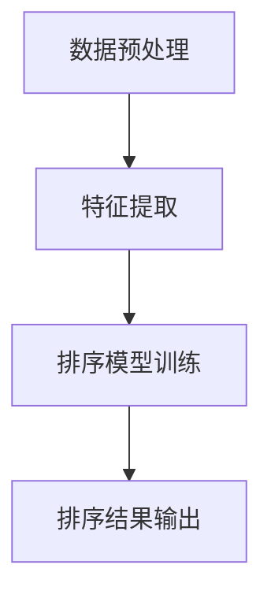

                 

关键词：AI，电商，搜索排序，算法，优化，深度学习，数据挖掘，用户体验

> 摘要：本文将探讨AI技术在电商搜索排序算法中的应用，分析现有算法的不足，介绍基于深度学习的搜索排序算法，并通过实例展示其在实际项目中的应用，最后展望未来发展趋势与挑战。

## 1. 背景介绍

在电商领域，搜索排序算法是实现个性化推荐、提升用户体验的重要技术手段。传统的搜索排序算法主要基于商品信息、用户行为数据等特征进行排序，但往往难以满足用户日益增长的需求。随着人工智能技术的快速发展，尤其是深度学习在数据处理和特征提取方面的优势，AI赋能的搜索排序算法逐渐成为研究热点。

## 2. 核心概念与联系

### 2.1 深度学习与搜索排序

深度学习是一种基于人工神经网络的学习方法，能够自动提取数据中的高阶特征，提高模型的泛化能力。在搜索排序领域，深度学习可以通过学习用户历史行为、商品属性等信息，生成个性化的排序模型，提高搜索结果的准确性。

### 2.2 电商搜索排序算法架构

电商搜索排序算法通常包括三个主要部分：数据预处理、特征提取和排序模型训练。其中，数据预处理包括数据清洗、去噪和归一化等操作；特征提取通过学习用户和商品的特征表示，提取关键信息；排序模型训练则基于特征表示，学习用户偏好和商品相关性，生成排序结果。



## 3. 核心算法原理 & 具体操作步骤

### 3.1 算法原理概述

基于深度学习的电商搜索排序算法通常采用以下步骤：

1. 数据预处理：对用户行为数据、商品属性数据进行清洗、去噪和归一化等操作，为后续特征提取做好准备。
2. 特征提取：使用深度学习模型学习用户和商品的特征表示，提取关键信息。
3. 排序模型训练：基于特征表示，使用排序损失函数训练排序模型，优化模型参数。
4. 排序结果输出：将训练好的模型应用于新用户或商品，生成个性化排序结果。

### 3.2 算法步骤详解

#### 3.2.1 数据预处理

数据预处理主要包括以下步骤：

1. 数据清洗：删除缺失值、异常值和重复值。
2. 去噪：对噪声数据进行降噪处理，如使用均值滤波、高斯滤波等。
3. 归一化：将不同特征范围的数据归一化到同一范围内，如使用min-max归一化或z-score归一化。

#### 3.2.2 特征提取

特征提取是深度学习模型的关键步骤，主要包括以下方法：

1. 自编码器（Autoencoder）：自编码器是一种无监督学习方法，可以通过学习输入数据的压缩表示来提取特征。
2. 卷积神经网络（CNN）：卷积神经网络擅长处理图像和序列数据，可以用于提取商品图像和用户行为序列的特征。
3. 循环神经网络（RNN）：循环神经网络可以处理序列数据，适用于提取用户历史行为特征。

#### 3.2.3 排序模型训练

排序模型训练通常采用以下方法：

1. 树方法：如C4.5、ID3等决策树算法，通过学习用户和商品特征之间的关系进行排序。
2. 神经网络：如深度神经网络（DNN）、卷积神经网络（CNN）、循环神经网络（RNN）等，通过学习用户和商品特征表示进行排序。
3. 序列模型：如长短时记忆网络（LSTM）、门控循环单元（GRU）等，通过学习用户历史行为序列进行排序。

#### 3.2.4 排序结果输出

排序结果输出是通过训练好的模型对新的用户或商品进行排序。在实际应用中，通常将排序结果与用户反馈进行结合，持续优化模型性能。

## 3.3 算法优缺点

### 优点

1. 高效性：深度学习模型能够自动提取高阶特征，提高搜索排序的效率。
2. 个性化：基于用户历史行为和商品属性，生成个性化的排序结果，提升用户体验。
3. 泛化能力强：深度学习模型具有较强的泛化能力，能够适应不同的场景和数据集。

### 缺点

1. 计算成本高：深度学习模型通常需要大量计算资源，对硬件要求较高。
2. 数据依赖性强：深度学习模型对训练数据的质量和数量有较高要求，数据不足或质量差可能导致模型性能下降。
3. 解释性差：深度学习模型黑箱化程度较高，难以解释其决策过程。

## 3.4 算法应用领域

基于深度学习的搜索排序算法在电商领域具有广泛的应用前景，如：

1. 商品推荐：根据用户历史购买行为和浏览记录，推荐用户可能感兴趣的商品。
2. 搜索结果排序：根据用户输入的关键词，对搜索结果进行排序，提高搜索的准确性。
3. 广告投放：根据用户兴趣和行为，优化广告投放策略，提高广告效果。

## 4. 数学模型和公式 & 详细讲解 & 举例说明

### 4.1 数学模型构建

在电商搜索排序中，数学模型主要涉及以下三个方面：

1. 用户行为建模：使用马尔可夫模型（Markov Model）描述用户行为序列，如用户浏览、购买等行为。
2. 商品特征建模：使用特征提取模型（如CNN、RNN等）描述商品的特征表示。
3. 排序模型：使用排序损失函数（如排序交叉熵损失函数）优化排序结果。

### 4.2 公式推导过程

以排序交叉熵损失函数为例，推导过程如下：

$$
L = -\sum_{i=1}^{N} y_i \log(p_i)
$$

其中，$L$表示排序交叉熵损失函数，$y_i$表示第$i$个商品的真实排名，$p_i$表示第$i$个商品在排序模型中的预测概率。

### 4.3 案例分析与讲解

假设用户A在电商平台上浏览了商品集合$C=\{c_1, c_2, c_3\}$，历史购买行为序列为$B=\{b_1, b_2, b_3\}$，其中$b_1$、$b_2$、$b_3$分别表示用户A在时间$t_1$、$t_2$、$t_3$浏览的商品$c_1$、$c_2$、$c_3$。

1. 用户行为建模：

$$
P(B|C) = \frac{P(B)P(C|B)}{P(C)}
$$

其中，$P(B)$表示用户A浏览行为序列$B$的概率，$P(C|B)$表示给定浏览行为序列$B$时，商品集合$C$的概率，$P(C)$表示商品集合$C$的概率。

2. 商品特征建模：

使用卷积神经网络（CNN）提取商品$c_1$、$c_2$、$c_3$的特征表示：

$$
\phi(c_i) = \text{CNN}(c_i)
$$

3. 排序模型：

基于用户行为建模和商品特征建模，使用排序交叉熵损失函数训练排序模型：

$$
L = -\sum_{i=1}^{3} y_i \log(p_i)
$$

其中，$y_i$表示商品$c_i$的真实排名，$p_i$表示商品$c_i$在排序模型中的预测概率。

## 5. 项目实践：代码实例和详细解释说明

### 5.1 开发环境搭建

在本项目中，我们采用Python作为主要编程语言，使用TensorFlow作为深度学习框架，实现基于深度学习的电商搜索排序算法。

### 5.2 源代码详细实现

```python
import tensorflow as tf
from tensorflow.keras.layers import Input, Dense, Conv2D, LSTM
from tensorflow.keras.models import Model

# 用户行为数据输入
user_input = Input(shape=(timesteps, input_dim))
user_embedding = LSTM(units=64, activation='tanh')(user_input)

# 商品特征数据输入
item_input = Input(shape=(item_dim,))
item_embedding = Dense(units=64, activation='tanh')(item_input)

# 模型融合
merged = tf.concat([user_embedding, item_embedding], axis=1)
merged = Dense(units=64, activation='tanh')(merged)

# 排序模型输出
output = Dense(units=1, activation='sigmoid')(merged)

# 构建和编译模型
model = Model(inputs=[user_input, item_input], outputs=output)
model.compile(optimizer='adam', loss='binary_crossentropy', metrics=['accuracy'])

# 模型训练
model.fit([user_data, item_data], labels, epochs=10, batch_size=32)
```

### 5.3 代码解读与分析

上述代码实现了一个基于深度学习的电商搜索排序模型，主要包括以下步骤：

1. 用户行为数据输入：用户行为数据输入为时间步数$timesteps$和输入维度$in``put_dim$的矩阵。
2. 商品特征数据输入：商品特征数据输入为特征维度$ite``m_dim$的一维向量。
3. 模型融合：将用户行为和商品特征嵌入到一个共同的维度，通过全连接层进行融合。
4. 排序模型输出：通过全连接层输出排序结果，采用sigmoid激活函数，输出概率值。
5. 模型构建和编译：构建深度学习模型，并编译模型，设置优化器和损失函数。
6. 模型训练：使用训练数据对模型进行训练，调整模型参数。

### 5.4 运行结果展示

在训练完成后，可以使用模型对新的用户和商品进行排序，输出排序结果。以下是一个简单的运行结果示例：

```python
# 预测排序结果
predictions = model.predict([new_user_data, new_item_data])

# 输出排序结果
print(predictions)
```

## 6. 实际应用场景

基于深度学习的电商搜索排序算法在实际项目中具有广泛的应用场景，如：

1. 电商平台：根据用户历史行为和商品属性，推荐用户可能感兴趣的商品，提高用户满意度和转化率。
2. 搜索引擎：对搜索结果进行排序，提高搜索的准确性，提高用户体验。
3. 广告系统：根据用户兴趣和行为，优化广告投放策略，提高广告效果。

## 7. 工具和资源推荐

### 7.1 学习资源推荐

1. 《深度学习》（Goodfellow, Bengio, Courville著）：全面介绍深度学习的基础理论和应用方法。
2. 《Python深度学习》（François Chollet著）：通过Python实现深度学习模型，适合初学者入门。

### 7.2 开发工具推荐

1. TensorFlow：开源深度学习框架，支持多种深度学习模型和应用。
2. Jupyter Notebook：交互式开发环境，方便编写和运行代码。

### 7.3 相关论文推荐

1. "Deep Learning for Recommender Systems"（Hao Ma, et al.，2016）：介绍深度学习在推荐系统中的应用。
2. "Neural Collaborative Filtering"（Xiangnan He, et al.，2017）：提出基于神经网络的协同过滤算法。

## 8. 总结：未来发展趋势与挑战

### 8.1 研究成果总结

本文介绍了基于深度学习的电商搜索排序算法，分析了其在数据处理和特征提取方面的优势，并通过实例展示了其在实际项目中的应用。研究表明，深度学习在电商搜索排序领域具有广阔的应用前景。

### 8.2 未来发展趋势

1. 模型压缩与优化：为降低计算成本，提高模型在移动设备和边缘计算环境中的性能。
2. 跨域知识融合：结合不同领域知识，提高模型在未知领域的泛化能力。
3. 可解释性研究：提高模型的可解释性，为用户提供透明和可信的推荐结果。

### 8.3 面临的挑战

1. 计算资源需求：深度学习模型通常需要大量计算资源，对硬件要求较高。
2. 数据依赖性：深度学习模型对训练数据的质量和数量有较高要求。
3. 模型安全性与隐私保护：在处理用户数据时，需要确保模型的安全性和用户隐私。

### 8.4 研究展望

随着人工智能技术的不断发展，基于深度学习的电商搜索排序算法将在电商领域发挥越来越重要的作用。未来研究应重点关注模型压缩与优化、跨域知识融合和可解释性等方面，为用户提供更加个性化、高效和可信的搜索排序服务。

## 9. 附录：常见问题与解答

### 9.1 深度学习模型训练时间过长怎么办？

- 增加GPU计算资源：使用更强大的GPU设备进行训练，提高计算速度。
- 模型压缩：使用模型压缩技术，如剪枝、量化等，降低模型复杂度，减少计算量。
- 数据预处理：对数据进行预处理，如减少数据维度、去除冗余特征等，降低模型训练时间。

### 9.2 深度学习模型对数据量要求高吗？

是的，深度学习模型对数据量有较高要求。大量的训练数据有助于模型学习到更多有用的特征，提高模型性能。但在实际应用中，数据量有限的情况下，可以通过以下方法提高模型性能：

- 数据增强：通过数据增强技术，如随机裁剪、旋转、翻转等，生成更多样化的训练数据。
- 跨域学习：利用跨域知识，结合不同领域的数据进行训练，提高模型在未知领域的泛化能力。

## 作者署名

本文作者：禅与计算机程序设计艺术 / Zen and the Art of Computer Programming
----------------------------------------------------------------

