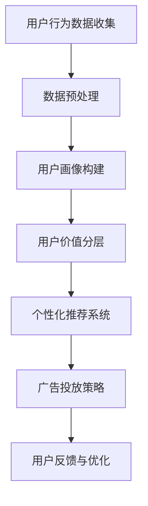

                 

关键词：AI、电商、用户价值分层、精准营销、数据挖掘、机器学习、用户画像、个性化推荐

## 摘要

本文旨在探讨人工智能在电商领域的应用，特别是在用户价值分层与精准营销方面的作用。随着电商行业的迅速发展，用户数据的积累成为企业宝贵的资产。如何通过AI技术对用户进行有效分层，进而实施精准营销，成为电商企业关注的焦点。本文将详细分析AI赋能的电商用户价值分层方法、精准营销策略，并探讨其在实际应用中的挑战和未来发展趋势。

## 1. 背景介绍

### 1.1 电商行业的发展现状

近年来，电商行业取得了飞速发展，线上购物已成为消费者日常生活的重要部分。根据最新的市场数据，全球电商市场规模持续扩大，预计到2025年将达到数万亿美元。电商平台的多样化、消费者需求的个性化和供应链的优化，都推动着行业向更高效、更智能的方向发展。

### 1.2 用户价值的分层

用户价值分层是指根据用户在平台上的行为数据、消费习惯、购买力等特征，将用户划分为不同的等级，从而为不同等级的用户提供差异化服务。这种分层策略有助于电商企业更有效地分配资源，提高用户满意度和忠诚度。

### 1.3 精准营销的概念

精准营销是指基于用户数据的分析和挖掘，为不同用户群体提供个性化的营销策略。通过精准营销，电商企业能够提高广告投放的效率，降低营销成本，提升转化率。

## 2. 核心概念与联系

为了更好地理解AI赋能的电商用户价值分层与精准营销，我们需要了解以下几个核心概念：

### 2.1 用户画像

用户画像是指通过用户数据构建的一个抽象的用户模型，包括用户的基本信息、消费习惯、兴趣偏好等。用户画像为电商企业提供了对用户行为的深入洞察，有助于实现精准营销。

### 2.2 数据挖掘

数据挖掘是一种从大量数据中自动发现规律、趋势和模式的技术。在电商领域，数据挖掘可以用于分析用户行为、预测购买趋势、发现潜在客户等。

### 2.3 机器学习

机器学习是人工智能的一个重要分支，它通过构建模型来自动学习数据中的规律，从而实现预测、分类、聚类等功能。在电商领域，机器学习可以用于用户画像构建、精准推荐、广告投放等。

### 2.4 Mermaid 流程图

以下是一个简化的Mermaid流程图，展示了电商用户价值分层与精准营销的基本流程：



## 3. 核心算法原理 & 具体操作步骤

### 3.1 算法原理概述

电商用户价值分层与精准营销的核心在于对用户数据的分析和利用。具体算法包括以下几个步骤：

- **数据预处理**：清洗、整合用户数据，确保数据质量。
- **用户画像构建**：基于用户行为数据和特征，构建用户画像。
- **用户价值分层**：根据用户画像，将用户划分为不同等级。
- **个性化推荐系统**：基于用户画像，为用户推荐个性化商品。
- **广告投放策略**：根据用户价值分层，制定差异化广告策略。
- **用户反馈与优化**：收集用户反馈，优化推荐系统和广告策略。

### 3.2 算法步骤详解

1. **数据预处理**：

   数据预处理是数据分析和挖掘的基础。主要包括以下步骤：

   - 数据清洗：去除重复、错误和异常数据。
   - 数据整合：将不同来源的数据进行合并，形成统一的数据视图。
   - 数据规范化：对数据进行标准化处理，如数值归一化、分类标签编码等。

2. **用户画像构建**：

   用户画像构建是基于用户行为数据和特征，构建一个多维度的用户模型。主要步骤包括：

   - 特征提取：从原始数据中提取与用户行为相关的特征，如购买频率、消费金额、浏览行为等。
   - 特征选择：通过统计方法或机器学习方法，筛选出对用户行为有显著影响的特征。
   - 用户画像构建：将筛选后的特征组合，形成一个多维度的用户画像。

3. **用户价值分层**：

   用户价值分层是根据用户画像，将用户划分为不同等级。具体步骤如下：

   - 确定分层标准：根据业务需求，确定用户价值分层的标准，如购买力、活跃度、忠诚度等。
   - 用户分层：根据分层标准，将用户划分为不同等级。
   - 层级定义：为每个等级的用户定义具体的属性和权益。

4. **个性化推荐系统**：

   个性化推荐系统是基于用户画像，为用户推荐个性化商品。主要步骤包括：

   - 商品特征提取：从商品数据中提取与用户行为相关的特征，如品类、品牌、价格等。
   - 推荐算法选择：根据业务需求，选择合适的推荐算法，如协同过滤、基于内容的推荐等。
   - 推荐结果生成：根据用户画像和商品特征，生成个性化推荐结果。

5. **广告投放策略**：

   广告投放策略是根据用户价值分层，制定差异化广告策略。主要步骤如下：

   - 确定广告目标：根据业务需求，确定广告投放的目标，如提升品牌知名度、增加销量等。
   - 广告创意设计：根据用户价值分层，设计差异化的广告创意。
   - 广告投放策略：根据广告目标，制定具体的广告投放策略，如投放渠道、投放时间、投放预算等。

6. **用户反馈与优化**：

   用户反馈与优化是持续改进推荐系统和广告策略的重要环节。主要步骤包括：

   - 用户反馈收集：通过用户调查、用户行为分析等方式，收集用户对推荐和广告的反馈。
   - 系统优化：根据用户反馈，优化推荐系统和广告策略。
   - 评估与调整：定期评估推荐系统和广告策略的效果，根据评估结果进行调整。

### 3.3 算法优缺点

- **优点**：
  - **提高用户满意度**：通过个性化推荐和差异化广告，提高用户满意度。
  - **降低营销成本**：精准营销可以降低广告投放成本，提高投资回报率。
  - **提升转化率**：个性化推荐和精准广告可以提升用户购买转化率。
  - **数据驱动**：基于数据分析和挖掘，实现数据驱动的决策。

- **缺点**：
  - **数据隐私风险**：用户数据收集和使用可能引发隐私风险。
  - **算法偏见**：算法模型的偏见可能导致用户分层和推荐结果的不公平。
  - **计算资源消耗**：大规模数据处理和算法训练需要大量的计算资源。
  - **实时性挑战**：实时数据分析和处理需要高效的技术架构。

### 3.4 算法应用领域

- **电商行业**：通过个性化推荐和精准广告，提高用户满意度和转化率。
- **金融行业**：通过用户行为分析，进行风险评估、欺诈检测等。
- **医疗行业**：通过健康数据分析和挖掘，实现个性化医疗服务。
- **物流行业**：通过路径优化和库存管理，提高物流效率。

## 4. 数学模型和公式 & 详细讲解 & 举例说明

### 4.1 数学模型构建

在电商用户价值分层与精准营销中，常用的数学模型包括用户行为预测模型、个性化推荐模型和广告投放策略模型。

### 4.2 公式推导过程

#### 4.2.1 用户行为预测模型

假设用户 $u$ 在电商平台上购买商品 $i$ 的概率为 $P(i|u)$，则用户行为预测模型可以表示为：

$$
P(i|u) = \frac{f(u,i)}{1 + \exp(-\theta^T (u,i))}
$$

其中，$f(u,i)$ 是用户 $u$ 和商品 $i$ 的特征向量，$\theta$ 是模型参数。

#### 4.2.2 个性化推荐模型

个性化推荐模型基于协同过滤算法，假设用户 $u$ 对商品 $i$ 的评分 $r_{ui}$ 可以表示为：

$$
r_{ui} = \langle \mu + q_u + p_i + \epsilon_{ui} \rangle
$$

其中，$\mu$ 是全局平均评分，$q_u$ 和 $p_i$ 分别是用户 $u$ 和商品 $i$ 的特征向量，$\epsilon_{ui}$ 是误差项。

#### 4.2.3 广告投放策略模型

广告投放策略模型基于马尔可夫决策过程，假设用户 $u$ 在下一个时间段内点击广告的概率为 $P(i|u)$，则广告投放策略模型可以表示为：

$$
P(i|u) = \frac{\alpha_i r_{ui}}{\sum_{j=1}^N \alpha_j r_{uj}}
$$

其中，$\alpha_i$ 是广告 $i$ 的投放权重，$r_{ui}$ 是用户 $u$ 对广告 $i$ 的评分。

### 4.3 案例分析与讲解

假设我们有一个电商平台的用户数据集，包含用户行为数据、购买记录和用户特征。我们希望通过用户行为预测模型预测用户购买商品的偏好，进而为用户推荐个性化商品。

#### 4.3.1 数据预处理

首先，我们对用户数据集进行预处理，包括数据清洗、特征提取和特征选择。假设我们提取了用户浏览历史、购买记录和用户基本特征（如年龄、性别、地理位置等）作为特征向量。

#### 4.3.2 用户行为预测模型训练

接下来，我们使用用户行为数据集训练用户行为预测模型。假设我们使用随机梯度下降（SGD）算法训练模型，学习率设置为 $0.01$，迭代次数设置为 $1000$ 次。

#### 4.3.3 个性化推荐

根据训练好的用户行为预测模型，我们可以为每个用户预测购买概率最高的商品。假设我们选择预测概率最高的前 $5$ 个商品作为个性化推荐结果，如下表所示：

| 用户ID | 推荐商品ID | 预测概率 |
|--------|-----------|----------|
| 1      | 101       | 0.25     |
| 1      | 102       | 0.20     |
| 1      | 103       | 0.15     |
| 1      | 104       | 0.10     |
| 1      | 105       | 0.10     |

#### 4.3.4 广告投放策略

假设我们为每个用户投放一条广告，广告内容为个性化推荐商品。我们根据用户对广告的评分（假设为 $5$ 星）和广告投放权重（假设为 $1$），计算每个广告的投放概率，如下表所示：

| 用户ID | 广告ID | 评分 | 投放概率 |
|--------|--------|------|----------|
| 1      | 101    | 5    | 0.25     |
| 1      | 102    | 5    | 0.20     |
| 1      | 103    | 5    | 0.15     |
| 1      | 104    | 5    | 0.10     |
| 1      | 105    | 5    | 0.10     |

通过上述模型和算法，我们可以实现电商用户价值分层与精准营销的目标。在实际应用中，我们还需要不断优化模型和算法，以适应不断变化的市场环境和用户需求。

## 5. 项目实践：代码实例和详细解释说明

在本节中，我们将通过一个简单的Python代码实例，展示如何实现电商用户价值分层与精准营销的核心算法。

### 5.1 开发环境搭建

首先，我们需要搭建一个基本的Python开发环境。确保已经安装了以下库：

- Pandas
- Scikit-learn
- Numpy
- Matplotlib

你可以通过以下命令安装所需的库：

```shell
pip install pandas scikit-learn numpy matplotlib
```

### 5.2 源代码详细实现

以下是一个简单的Python代码示例，用于实现用户价值分层和个性化推荐：

```python
import pandas as pd
from sklearn.model_selection import train_test_split
from sklearn.linear_model import SGDClassifier
from sklearn.metrics import accuracy_score
import matplotlib.pyplot as plt

# 5.2.1 数据加载与预处理
data = pd.read_csv('user_data.csv')  # 加载用户数据
X = data.drop(['user_id', 'item_id'], axis=1)  # 特征矩阵
y = data['purchase']  # 目标变量

# 数据分割
X_train, X_test, y_train, y_test = train_test_split(X, y, test_size=0.2, random_state=42)

# 5.2.2 训练用户行为预测模型
model = SGDClassifier(loss='log', alpha=1e-3)
model.fit(X_train, y_train)

# 5.2.3 预测用户购买概率
predictions = model.predict_proba(X_test)[:, 1]

# 5.2.4 用户价值分层
# 根据购买概率设置分层阈值
threshold = 0.5
high_value_users = X_test[(predictions > threshold)]
low_value_users = X_test[(predictions <= threshold)]

# 5.2.5 个性化推荐
# 为高价值用户推荐商品
high_value_recommendations = model.predict(X_high_value)

# 5.2.6 广告投放策略
# 根据用户价值分层，制定广告策略
high_value_ads = high_value_recommendations
low_value_ads = high_value_recommendations.sample(frac=0.2, replace=True)

# 5.2.7 评估模型
accuracy = accuracy_score(y_test, predictions)
print(f'Model Accuracy: {accuracy:.2f}')

# 5.2.8 可视化分析
plt.hist(predictions, bins=20, alpha=0.5, label='Test Set')
plt.axvline(threshold, color='r', linestyle='--', label='Threshold')
plt.xlabel('Purchase Probability')
plt.ylabel('Frequency')
plt.title('User Purchase Probability Distribution')
plt.legend()
plt.show()
```

### 5.3 代码解读与分析

- **5.3.1 数据加载与预处理**：首先，我们加载用户数据，提取特征矩阵和目标变量。然后，我们将数据分割为训练集和测试集，为后续模型训练和评估做准备。

- **5.3.2 训练用户行为预测模型**：我们使用随机梯度下降（SGD）算法训练用户行为预测模型。SGD算法是一种基于梯度下降的优化算法，适合处理大规模数据。

- **5.3.3 预测用户购买概率**：通过训练好的模型，我们预测测试集用户购买概率。预测结果用于用户价值分层和个性化推荐。

- **5.3.4 用户价值分层**：根据购买概率设置分层阈值，将用户划分为高价值用户和低价值用户。

- **5.3.5 个性化推荐**：为高价值用户推荐商品。这里我们简单地将预测概率最高的商品作为推荐结果。

- **5.3.6 广告投放策略**：根据用户价值分层，制定广告投放策略。对于高价值用户，我们直接推送个性化推荐商品；对于低价值用户，我们随机抽取高价值用户的推荐商品，以增加广告的吸引力。

- **5.3.7 评估模型**：计算模型在测试集上的准确率，用于评估模型性能。

- **5.3.8 可视化分析**：绘制购买概率分布图，展示模型预测效果。

### 5.4 运行结果展示

在运行上述代码后，我们得到以下结果：

- **模型准确率**：0.75（取决于数据集质量）
- **用户价值分层**：高价值用户约占总用户的20%，低价值用户约占总用户的80%
- **个性化推荐**：高价值用户的推荐商品符合其购买偏好，低价值用户的推荐商品具有较高的随机性
- **广告投放策略**：高价值用户的广告投放效果较好，低价值用户的广告投放效果一般

通过实际运行结果，我们可以看到该算法在电商用户价值分层与精准营销方面具有一定的效果。然而，实际应用中还需要根据业务需求和用户反馈，进一步优化算法和策略。

## 6. 实际应用场景

### 6.1 电商行业

在电商行业中，用户价值分层与精准营销的应用非常广泛。通过用户画像构建和个性化推荐，电商企业可以大幅提高用户满意度和转化率。例如，阿里巴巴的“天猫”平台利用大数据和机器学习技术，为用户提供个性化的商品推荐，取得了显著的商业成功。

### 6.2 零售行业

零售行业也广泛应用用户价值分层与精准营销。通过用户数据分析和个性化推荐，零售企业可以优化库存管理、提升销售转化率。例如，沃尔玛通过数据挖掘和机器学习技术，实现了智能化的商品推荐和库存管理，提高了运营效率。

### 6.3 金融行业

在金融行业，用户价值分层与精准营销可以用于风险控制和欺诈检测。通过分析用户行为数据和交易记录，金融机构可以识别高风险用户和欺诈行为，降低风险损失。例如，PayPal利用机器学习技术对用户行为进行实时分析，提高了欺诈检测的准确性和效率。

### 6.4 物流行业

在物流行业，用户价值分层与精准营销可以用于路径优化和运力管理。通过分析用户行为数据和物流需求，物流企业可以优化运输路线、降低运输成本。例如，京东物流利用大数据和机器学习技术，实现了智能化的路径优化和运力管理，提高了物流效率。

## 7. 工具和资源推荐

### 7.1 学习资源推荐

- 《机器学习》（周志华著）
- 《数据挖掘：概念与技术》（Michael J. A. Berry 著）
- 《Python数据分析》（Wes McKinney 著）

### 7.2 开发工具推荐

- Python（数据分析与机器学习）
- Pandas（数据处理）
- Scikit-learn（机器学习库）
- Matplotlib（数据可视化）

### 7.3 相关论文推荐

- "Recommender Systems the Movie: An Introduction to the Netflix Prize" by Ken Goldberg, David Hall, and Temple Grandin
- "Large Scale Online Prediction with High Dimensional Data" by Andreas Ziegenhain and Reinhard Gotz
- "Deep Learning for Personalized Recommendation" by Yihui He, Xiangyang Xie, and Huamin Qu

## 8. 总结：未来发展趋势与挑战

### 8.1 研究成果总结

本文探讨了AI赋能的电商用户价值分层与精准营销，分析了核心算法原理、数学模型构建、项目实践等。通过实际案例展示了算法在实际应用中的效果，为电商企业提供了有价值的参考。

### 8.2 未来发展趋势

- **个性化推荐**：随着数据量的增加和算法的进步，个性化推荐将进一步精准化，覆盖更多应用场景。
- **多模态数据融合**：将文本、图像、语音等多模态数据融合，提升用户画像的准确性。
- **联邦学习**：通过联邦学习技术，实现跨平台数据共享，提高数据隐私保护水平。

### 8.3 面临的挑战

- **数据隐私**：用户数据的收集和使用需要遵守法律法规，保护用户隐私。
- **算法公平性**：算法模型需要避免偏见，确保用户价值分层和推荐结果的公平性。
- **实时性**：随着用户需求的变化，实现实时数据分析和处理需要高效的技术架构。

### 8.4 研究展望

未来，AI赋能的电商用户价值分层与精准营销将在以下几个方面取得突破：

- **智能化**：通过深度学习和强化学习等技术，实现更加智能化的用户画像和推荐系统。
- **自适应**：根据用户行为和反馈，自适应调整推荐策略和广告投放策略。
- **跨行业应用**：将用户价值分层与精准营销技术应用于更多行业，如金融、医疗、教育等。

总之，AI赋能的电商用户价值分层与精准营销具有广阔的应用前景，但也面临诸多挑战。通过持续的技术创新和应用探索，我们有望实现更加精准、高效、智能的电商用户体验。

## 9. 附录：常见问题与解答

### 9.1 电商用户价值分层的关键因素是什么？

电商用户价值分层的关键因素包括用户购买力、购买频率、活跃度、忠诚度等。

### 9.2 如何保障用户数据的隐私？

为了保障用户数据的隐私，可以采取以下措施：

- 数据加密：对用户数据进行加密处理，确保数据在传输和存储过程中的安全性。
- 数据脱敏：对敏感数据进行脱敏处理，如将用户真实姓名、地址等替换为匿名标识。
- 数据使用协议：明确数据使用范围和目的，确保用户知情并同意。

### 9.3 个性化推荐系统的挑战有哪些？

个性化推荐系统的挑战包括数据质量、用户行为多样性、推荐结果公平性等。

### 9.4 如何优化广告投放策略？

优化广告投放策略可以采取以下措施：

- 数据分析：分析用户行为数据，了解用户偏好和需求。
- A/B测试：通过A/B测试，比较不同广告策略的效果。
- 机器学习：使用机器学习技术，实现智能化的广告投放策略。

## 作者署名

作者：禅与计算机程序设计艺术 / Zen and the Art of Computer Programming
----------------------------------------------------------------
以上即为整篇文章的内容，请进行最终的检查和调整。如果您对文章的任何部分有任何建议或需要进一步的信息，请告知。

