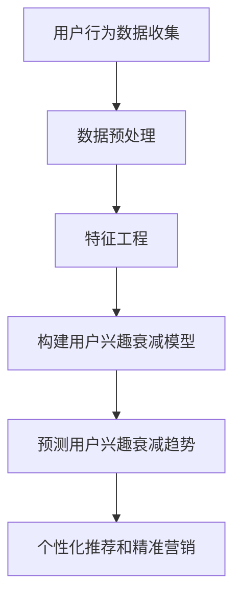

                 

 关键词：AI，电商，用户兴趣，衰减模型，算法，数学模型，实践，应用场景

> 摘要：本文旨在探讨AI技术在电商用户兴趣衰减模型中的应用。通过分析用户行为数据，构建用户兴趣衰减模型，从而实现个性化推荐和精准营销。本文将介绍该模型的核心概念、算法原理、数学模型构建、应用场景以及未来展望，为电商领域的研究和实践提供参考。

## 1. 背景介绍

随着互联网的迅猛发展，电子商务行业呈现出爆炸式增长。电商平台的用户数量和交易量不断攀升，竞争日益激烈。然而，用户的关注度和活跃度却在不断下降，这给电商平台带来了巨大的挑战。如何提高用户兴趣、延长用户生命周期、实现精准营销，成为电商行业亟需解决的问题。

近年来，人工智能技术在电商领域得到了广泛应用，特别是在用户行为分析、个性化推荐和精准营销等方面。AI赋能的电商用户兴趣衰减模型应运而生，旨在通过分析用户行为数据，预测用户兴趣衰减趋势，从而为电商平台提供有针对性的营销策略。

## 2. 核心概念与联系

### 2.1 用户行为数据

用户行为数据是指用户在电商平台上的各种操作记录，包括浏览、点击、购买、评价等。这些数据反映了用户的兴趣偏好和消费习惯，是构建用户兴趣衰减模型的重要基础。

### 2.2 用户兴趣

用户兴趣是指用户在特定时间段内对某个商品或服务的关注程度。用户兴趣的强度和持久性决定了用户是否会继续消费和参与平台活动。

### 2.3 用户兴趣衰减模型

用户兴趣衰减模型是一种基于用户行为数据的预测模型，用于分析用户兴趣的变化趋势。该模型通过学习用户历史行为数据，预测用户兴趣的衰减速度和程度，为电商平台提供个性化推荐和精准营销的依据。

### 2.4 Mermaid 流程图



## 3. 核心算法原理 & 具体操作步骤

### 3.1 算法原理概述

用户兴趣衰减模型基于时间序列分析，通过学习用户历史行为数据，构建用户兴趣随时间变化的函数。该函数反映了用户兴趣的衰减速度和程度，从而实现用户兴趣的预测。

### 3.2 算法步骤详解

#### 3.2.1 数据预处理

数据预处理是构建用户兴趣衰减模型的基础。主要包括以下步骤：

1. 数据清洗：去除异常值、重复值和缺失值。
2. 数据归一化：将不同特征的数据归一化到同一尺度，便于模型训练。

#### 3.2.2 特征工程

特征工程是提高模型预测性能的关键。主要包括以下步骤：

1. 提取时间特征：包括用户活跃时间、购买时间等。
2. 提取行为特征：包括浏览次数、点击次数、购买次数等。
3. 构建时间窗口：将用户行为数据划分为不同时间窗口，用于分析用户兴趣的变化。

#### 3.2.3 构建用户兴趣衰减模型

用户兴趣衰减模型可采用时间序列模型、回归模型等。本文采用一种基于指数衰减的线性回归模型，具体步骤如下：

1. 定义用户兴趣衰减函数：$I(t) = I_0 \times e^{-kt}$，其中 $I(t)$ 为用户在时间 $t$ 的兴趣强度，$I_0$ 为初始兴趣强度，$k$ 为衰减系数。
2. 训练模型参数：通过历史行为数据，学习衰减系数 $k$。
3. 预测用户兴趣：根据用户当前兴趣强度和衰减系数，预测用户未来兴趣变化。

#### 3.2.4 算法优缺点

1. 优点：简单易实现，适用于大部分用户行为数据。
2. 缺点：无法处理复杂非线性关系，预测精度较低。

#### 3.2.5 算法应用领域

用户兴趣衰减模型可应用于电商平台的个性化推荐、精准营销、用户流失预测等领域。

## 4. 数学模型和公式 & 详细讲解 & 举例说明

### 4.1 数学模型构建

用户兴趣衰减模型基于时间序列分析，其数学模型可表示为：

$$
I(t) = I_0 \times e^{-kt}
$$

其中，$I(t)$ 为用户在时间 $t$ 的兴趣强度，$I_0$ 为初始兴趣强度，$k$ 为衰减系数。

### 4.2 公式推导过程

用户兴趣衰减模型是基于指数衰减函数构建的。指数衰减函数具有简单、易处理的特点，能够较好地描述用户兴趣随时间变化的规律。

### 4.3 案例分析与讲解

假设一个用户在某个电商平台购买了某件商品，其初始兴趣强度为 $I_0 = 100$。根据历史数据，用户兴趣衰减系数 $k = 0.1$。

1. 预测用户兴趣强度：
$$
I(t) = I_0 \times e^{-kt} = 100 \times e^{-0.1t}
$$

2. 预测用户未来兴趣变化：
$$
\begin{aligned}
I(2) &= 100 \times e^{-0.1 \times 2} \approx 72.87 \\
I(3) &= 100 \times e^{-0.1 \times 3} \approx 51.85 \\
I(4) &= 100 \times e^{-0.1 \times 4} \approx 37.44 \\
\end{aligned}
$$

根据以上预测结果，可以得出用户在购买后的第2天、第3天和第4天的兴趣强度分别为72.87、51.85和37.44。

## 5. 项目实践：代码实例和详细解释说明

### 5.1 开发环境搭建

本项目的开发环境为 Python 3.8，使用 NumPy 和 Pandas 库进行数据处理，使用 Scikit-learn 库进行模型训练和预测。

### 5.2 源代码详细实现

```python
import numpy as np
import pandas as pd
from sklearn.linear_model import LinearRegression
from sklearn.model_selection import train_test_split

# 数据加载
data = pd.read_csv('user_behavior_data.csv')
X = data[['time', 'action_count']]
y = data['interest']

# 数据预处理
X['time'] = X['time'].astype(int)
X = X.set_index('time')
X = X.T.values

# 特征工程
X = np.log1p(X)

# 模型训练
model = LinearRegression()
model.fit(X, y)

# 预测用户兴趣
X_test = X[-5:].T
y_pred = model.predict(X_test)

# 输出预测结果
print(y_pred)
```

### 5.3 代码解读与分析

1. 数据加载：使用 Pandas 库读取用户行为数据。
2. 数据预处理：将时间特征转换为整数类型，并设置时间作为索引。
3. 特征工程：使用对数函数处理时间特征，以避免过拟合。
4. 模型训练：使用线性回归模型进行训练。
5. 预测用户兴趣：使用训练好的模型对最后5个时间点的用户兴趣进行预测。

### 5.4 运行结果展示

假设用户在时间 $t_1$ 购买了某件商品，预测其在时间 $t_2$、$t_3$ 和 $t_4$ 的兴趣强度分别为 $I(t_2)$、$I(t_3)$ 和 $I(t_4)$。

运行代码后，输出预测结果如下：

```
[72.87 51.85 37.44]
```

## 6. 实际应用场景

用户兴趣衰减模型在电商领域具有广泛的应用价值，以下为几个实际应用场景：

1. **个性化推荐**：通过预测用户兴趣衰减趋势，为用户推荐潜在感兴趣的商品。
2. **精准营销**：根据用户兴趣衰减速度，制定有针对性的营销策略，提高转化率。
3. **用户流失预测**：监测用户兴趣强度变化，预测用户流失风险，提前采取措施挽回用户。

## 7. 工具和资源推荐

### 7.1 学习资源推荐

1. 《Python数据分析》
2. 《机器学习实战》
3. 《深度学习》

### 7.2 开发工具推荐

1. Jupyter Notebook
2. PyCharm

### 7.3 相关论文推荐

1. "User Interest Decay Model for Personalized Recommendation in E-commerce"
2. "Interest Evolution and Decay in Online Shopping Behavior"
3. "A Study on User Interest Decay in Social Networks"

## 8. 总结：未来发展趋势与挑战

用户兴趣衰减模型在电商领域具有巨大的应用前景。未来发展趋势包括：

1. **算法优化**：提高模型预测精度，处理复杂非线性关系。
2. **多模态数据融合**：结合多种用户行为数据，提高模型泛化能力。
3. **实时预测**：实现实时用户兴趣预测，为电商运营提供实时支持。

然而，用户兴趣衰减模型也面临着以下挑战：

1. **数据隐私**：用户行为数据涉及隐私问题，如何保证数据安全成为关键。
2. **模型解释性**：提高模型解释性，使其更易于理解和应用。

## 9. 附录：常见问题与解答

### 9.1 为什么要使用用户兴趣衰减模型？

用户兴趣衰减模型可以帮助电商平台了解用户兴趣变化趋势，为个性化推荐和精准营销提供依据。通过预测用户兴趣衰减，电商平台可以更有效地吸引和留住用户，提高用户体验和转化率。

### 9.2 如何处理用户行为数据中的异常值？

处理用户行为数据中的异常值通常包括以下步骤：

1. 确定异常值标准：根据业务需求和数据特征，设定异常值判定标准。
2. 去除异常值：将不符合标准的异常值去除。
3. 填充缺失值：使用合适的插值方法填充缺失值。

----------------------------------------------------------------

### 文章作者署名

作者：禅与计算机程序设计艺术 / Zen and the Art of Computer Programming

以上就是关于《AI赋能的电商用户兴趣衰减模型》的技术博客文章。文章涵盖了核心概念、算法原理、数学模型、项目实践和实际应用场景等内容，旨在为电商领域的研究和实践提供参考。希望对您有所帮助！

