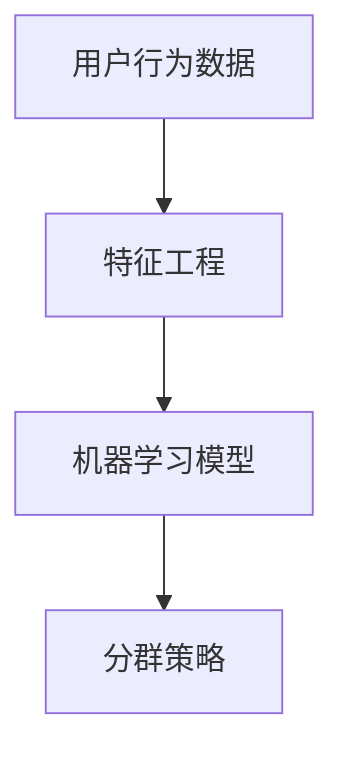

                 

关键词：人工智能，电商，用户分群，动态调整，算法原理，数学模型，代码实例

> 摘要：本文探讨了基于人工智能技术的电商用户分群动态调整机制，通过深入分析核心概念和算法原理，阐述了该机制的构建方法、数学模型以及在实际项目中的应用。文章旨在为电商领域提供一种有效的用户分群策略，以提升用户体验和运营效果。

## 1. 背景介绍

在当今快速发展的电商行业中，用户分群作为一种关键策略，被广泛应用于市场细分、精准营销和个性化服务等方面。传统的用户分群方法主要依赖于人口统计特征、购买行为和兴趣偏好等静态数据，但这些方法存在一定的局限性，难以应对动态变化的用户需求和市场环境。随着人工智能技术的不断进步，利用大数据和机器学习算法实现动态用户分群已成为行业热点。

动态用户分群机制旨在根据用户的实时行为数据，实时调整用户群体划分，以实现对用户需求的准确把握和快速响应。这一机制的核心在于利用人工智能技术，如深度学习、强化学习和图神经网络等，从海量数据中挖掘用户的潜在兴趣和行为模式，并动态调整用户分群策略，从而实现用户群体的精细化管理和运营优化。

本文将从以下几个方面展开讨论：首先，介绍动态用户分群机制的核心概念和联系；其次，详细阐述核心算法原理和具体操作步骤；然后，分析数学模型和公式，并提供案例讲解；接着，展示项目实践中的代码实例；最后，探讨实际应用场景和未来发展趋势。

## 2. 核心概念与联系

### 2.1 人工智能与电商用户分群

人工智能（AI）作为一种模拟人类智能的技术，已经广泛应用于各个领域，包括电商行业。在电商用户分群中，人工智能技术主要用于数据分析和模式识别，通过深度学习、图神经网络等算法，从海量用户行为数据中提取有价值的信息，从而实现用户分群。

电商用户分群是指根据用户的购买行为、兴趣偏好、消费能力等特征，将用户划分为不同的群体。这些群体可以用于市场细分、定向营销、个性化推荐等场景。

### 2.2 动态调整机制

动态调整机制是一种基于实时数据的用户分群策略。与传统的静态分群方法不同，动态调整机制能够根据用户行为数据的变化，实时调整用户群体划分。这一机制的核心在于利用人工智能技术，实现用户行为数据的实时采集、处理和分析，从而动态调整用户分群策略。

### 2.3 核心概念原理与架构

为了更好地理解动态用户分群机制，我们引入以下核心概念：

1. **用户行为数据**：包括用户的浏览记录、购买历史、评论反馈等。这些数据是构建动态用户分群机制的基础。
2. **特征工程**：通过提取用户行为数据中的关键特征，如用户活跃度、购买频率、消费金额等，用于训练机器学习模型。
3. **机器学习模型**：用于从用户行为数据中学习用户的行为模式和兴趣偏好。常见的机器学习模型包括决策树、支持向量机、深度神经网络等。
4. **分群策略**：根据机器学习模型的结果，对用户进行分群。分群策略可以是基于人口统计特征的静态分群，也可以是利用机器学习模型实现动态调整的分群。

### 2.4 Mermaid 流程图

以下是一个简单的 Mermaid 流程图，展示了动态用户分群机制的核心概念和联系：



## 3. 核心算法原理 & 具体操作步骤

### 3.1 算法原理概述

动态用户分群机制的核心在于利用机器学习算法，从用户行为数据中提取有价值的信息，并基于这些信息动态调整用户分群策略。以下是该算法原理的概述：

1. **数据采集**：从电商平台的用户行为数据中，采集用户的浏览记录、购买历史、评论反馈等数据。
2. **特征提取**：对采集到的数据进行预处理，提取关键特征，如用户活跃度、购买频率、消费金额等。
3. **模型训练**：利用提取的特征，训练机器学习模型，如决策树、支持向量机、深度神经网络等。
4. **分群评估**：根据训练好的模型，对用户进行分群，并对分群结果进行评估。
5. **策略调整**：根据评估结果，调整分群策略，实现用户分群的动态调整。

### 3.2 算法步骤详解

以下是动态用户分群机制的具体操作步骤：

#### 3.2.1 数据采集

数据采集是动态用户分群机制的基础。在这一步骤中，需要从电商平台的用户行为数据中，采集用户的浏览记录、购买历史、评论反馈等数据。这些数据可以来源于用户行为日志、API 接口、数据库等。

#### 3.2.2 特征提取

在数据采集完成后，需要对数据进行预处理，提取关键特征。这些特征可以包括：

1. **用户活跃度**：衡量用户在平台上的活跃程度，如浏览次数、购买次数等。
2. **购买频率**：衡量用户在平台上的购买频率，如平均购买周期、购买频率分布等。
3. **消费金额**：衡量用户在平台上的消费金额，如平均消费金额、消费金额分布等。
4. **兴趣偏好**：根据用户的行为数据，提取用户的兴趣偏好，如喜欢的商品类别、品牌等。

#### 3.2.3 模型训练

在提取特征后，利用这些特征训练机器学习模型。常用的机器学习模型包括决策树、支持向量机、深度神经网络等。训练过程主要包括以下步骤：

1. **数据划分**：将数据集划分为训练集和测试集，用于模型的训练和评估。
2. **模型选择**：根据数据特点和业务需求，选择合适的机器学习模型。
3. **模型训练**：利用训练集，对模型进行训练，学习用户的行为模式和兴趣偏好。
4. **模型评估**：利用测试集，对训练好的模型进行评估，判断模型的性能和效果。

#### 3.2.4 分群评估

在模型训练完成后，利用训练好的模型，对用户进行分群。分群结果可以通过以下指标进行评估：

1. **聚类质量**：衡量用户分群的准确性和一致性，如轮廓系数、分割质量等。
2. **分群效果**：根据分群结果，评估用户分群对业务的影响，如用户满意度、转化率等。

#### 3.2.5 策略调整

根据分群评估结果，对分群策略进行调整。调整策略的过程主要包括：

1. **策略优化**：根据评估结果，优化分群策略，如调整聚类算法、修改特征权重等。
2. **模型更新**：根据新的用户行为数据，更新机器学习模型，以提高模型的准确性和适应性。

### 3.3 算法优缺点

#### 优点

1. **动态性**：动态用户分群机制可以根据用户行为数据的变化，实时调整用户分群策略，提高分群的准确性和适应性。
2. **个性化**：通过利用机器学习算法，从用户行为数据中提取用户的行为模式和兴趣偏好，实现个性化用户分群。
3. **高效性**：利用大数据和人工智能技术，提高数据处理的效率和准确性，实现用户分群的自动化和智能化。

#### 缺点

1. **数据依赖**：动态用户分群机制依赖于用户行为数据的质量和完整性，数据缺失或不准确可能导致分群效果不佳。
2. **计算复杂度**：在处理海量数据时，动态用户分群机制的计算复杂度较高，需要消耗一定的计算资源和时间。
3. **模型适应性**：机器学习模型的适应性有限，可能无法完全适应所有用户行为数据的分布和变化。

### 3.4 算法应用领域

动态用户分群机制在电商行业的应用领域广泛，包括以下几个方面：

1. **市场细分**：通过动态用户分群，实现市场细分，为不同用户群体提供个性化的产品和营销策略。
2. **精准营销**：根据动态用户分群结果，进行精准营销，提高营销活动的效果和转化率。
3. **个性化推荐**：利用动态用户分群结果，实现个性化推荐，提高用户满意度和粘性。
4. **用户运营**：通过动态用户分群，实现对用户的精细化管理和运营，提高用户忠诚度和转化率。

## 4. 数学模型和公式 & 详细讲解 & 举例说明

### 4.1 数学模型构建

动态用户分群机制中的数学模型主要包括聚类模型和分类模型。以下是一个简单的聚类模型构建过程：

#### 4.1.1 聚类模型构建

1. **数据标准化**：对用户行为数据进行标准化处理，使数据具有相同的尺度，便于后续分析。

   $$ X'_{ij} = \frac{X_{ij} - \mu_j}{\sigma_j} $$

   其中，$X_{ij}$ 为原始数据，$\mu_j$ 和 $\sigma_j$ 分别为第 $j$ 个特征的均值和标准差。

2. **初始化聚类中心**：随机选择 $k$ 个用户作为初始聚类中心。

3. **分配用户**：将每个用户分配到最近的聚类中心。

   $$ C_{ij} = \begin{cases} 
   1 & \text{如果 } u_i \text{ 被分配到聚类中心 } j \\
   0 & \text{否则}
   \end{cases} $$

4. **更新聚类中心**：根据分配结果，更新每个聚类中心的坐标。

   $$ \mu_j = \frac{\sum_{i=1}^N C_{ij} X_{ij}}{\sum_{i=1}^N C_{ij}} $$

5. **重复步骤 3 和 4，直到聚类中心不再发生变化或达到最大迭代次数。**

#### 4.1.2 分类模型构建

在聚类模型的基础上，可以进一步构建分类模型，以识别用户群体的类别。以下是一个简单的分类模型构建过程：

1. **特征选择**：根据聚类结果，选择与聚类质量相关的特征，用于分类模型构建。

2. **分类算法选择**：选择合适的分类算法，如逻辑回归、决策树、支持向量机等。

3. **模型训练**：利用训练集，对分类模型进行训练。

4. **模型评估**：利用测试集，对训练好的分类模型进行评估，判断模型的性能和效果。

### 4.2 公式推导过程

以下是对上述数学模型的公式推导过程：

#### 4.2.1 数据标准化

数据标准化的目的是消除不同特征之间的尺度差异，使每个特征具有相同的权重。假设有 $n$ 个用户和 $m$ 个特征，原始数据矩阵为 $X \in \mathbb{R}^{n \times m}$，则标准化后的数据矩阵为 $X' \in \mathbb{R}^{n \times m}$。数据标准化公式如下：

$$ X'_{ij} = \frac{X_{ij} - \mu_j}{\sigma_j} $$

其中，$\mu_j = \frac{1}{n} \sum_{i=1}^n X_{ij}$ 和 $\sigma_j = \sqrt{\frac{1}{n} \sum_{i=1}^n (X_{ij} - \mu_j)^2}$ 分别为第 $j$ 个特征的均值和标准差。

#### 4.2.2 聚类中心更新

聚类中心的更新过程主要包括以下两个步骤：

1. **初始化聚类中心**：随机选择 $k$ 个用户作为初始聚类中心。

   $$ \mu_j^{(0)} = X_{ij} $$

   其中，$i \in \{1, 2, ..., k\}$ 和 $j \in \{1, 2, ..., m\}$。

2. **分配用户**：将每个用户分配到最近的聚类中心。

   $$ C_{ij} = \begin{cases} 
   1 & \text{如果 } u_i \text{ 被分配到聚类中心 } j \\
   0 & \text{否则}
   \end{cases} $$

3. **更新聚类中心**：根据分配结果，更新每个聚类中心的坐标。

   $$ \mu_j^{(t+1)} = \frac{\sum_{i=1}^N C_{ij} X_{ij}}{\sum_{i=1}^N C_{ij}} $$

其中，$t$ 表示迭代次数。

#### 4.2.3 分类模型构建

分类模型的构建过程主要包括以下步骤：

1. **特征选择**：根据聚类结果，选择与聚类质量相关的特征，用于分类模型构建。

   $$ F_j = \frac{\sum_{i=1}^N C_{ij} X_{ij}}{\sum_{i=1}^N C_{ij}} $$

   其中，$F_j$ 为第 $j$ 个特征。

2. **分类算法选择**：选择合适的分类算法，如逻辑回归、决策树、支持向量机等。

   以逻辑回归为例，假设用户 $u_i$ 属于类别 $c_j$ 的概率为 $P(C_j|u_i)$，则逻辑回归模型可以表示为：

   $$ P(C_j|u_i) = \frac{e^{\theta_j^T \phi(u_i)}}{1 + e^{\theta^T \phi(u_i)}} $$

   其中，$\theta_j$ 为类别 $c_j$ 的参数向量，$\phi(u_i)$ 为用户 $u_i$ 的特征向量。

3. **模型训练**：利用训练集，对分类模型进行训练。

   $$ \theta_j = \arg\max_{\theta_j} \sum_{i=1}^N \ln P(C_j|u_i) $$

4. **模型评估**：利用测试集，对训练好的分类模型进行评估，判断模型的性能和效果。

   $$ \text{Accuracy} = \frac{\sum_{i=1}^N \hat{C}_i = C_i}{N} $$

   其中，$\hat{C}_i$ 为模型预测的类别，$C_i$ 为真实类别。

### 4.3 案例分析与讲解

#### 4.3.1 案例背景

假设有一个电商平台，拥有 $10,000$ 名用户，每个用户有 $5$ 个特征：年龄、性别、购买频率、消费金额和兴趣偏好。平台希望通过动态用户分群机制，将这些用户划分为不同的群体，以实现个性化营销和推荐。

#### 4.3.2 数据预处理

首先，对用户行为数据进行预处理，包括数据清洗、缺失值处理和特征提取。假设预处理后的数据矩阵为 $X \in \mathbb{R}^{10,000 \times 5}$。

#### 4.3.3 聚类模型构建

利用 K-means 算法，将用户划分为 $5$ 个群体。初始化聚类中心，随机选择 $5$ 个用户作为初始聚类中心。然后，根据分配结果，更新聚类中心，直到聚类中心不再发生变化。

#### 4.3.4 分类模型构建

根据聚类结果，选择与聚类质量相关的特征，构建分类模型。以逻辑回归为例，利用训练集，对分类模型进行训练。

#### 4.3.5 模型评估

利用测试集，对训练好的分类模型进行评估。计算分类准确率，判断模型的性能和效果。

## 5. 项目实践：代码实例和详细解释说明

### 5.1 开发环境搭建

为了实现动态用户分群机制，我们需要搭建一个开发环境，主要包括以下工具和库：

1. **Python**：用于编写代码和实现算法。
2. **NumPy**：用于数据预处理和计算。
3. **Pandas**：用于数据处理和分析。
4. **Scikit-learn**：用于机器学习模型的训练和评估。
5. **Matplotlib**：用于数据可视化和结果展示。

安装以上工具和库后，即可开始代码实现。

### 5.2 源代码详细实现

以下是动态用户分群机制的实现代码：

```python
import numpy as np
import pandas as pd
from sklearn.cluster import KMeans
from sklearn.linear_model import LogisticRegression
import matplotlib.pyplot as plt

# 数据预处理
def preprocess_data(data):
    # 数据清洗和缺失值处理
    data = data.fillna(data.mean())
    # 数据标准化
    mean = data.mean()
    std = data.std()
    data_normalized = (data - mean) / std
    return data_normalized

# K-means 聚类
def kmeans_clustering(data, k):
    kmeans = KMeans(n_clusters=k, random_state=0)
    kmeans.fit(data)
    labels = kmeans.labels_
    return labels

# 逻辑回归分类
def logistic_regression(data, labels):
    X = data
    y = labels
    logistic = LogisticRegression()
    logistic.fit(X, y)
    return logistic

# 模型评估
def evaluate_model(model, X, y):
    y_pred = model.predict(X)
    accuracy = np.mean(y_pred == y)
    return accuracy

# 读取用户行为数据
data = pd.read_csv('user_behavior.csv')

# 数据预处理
data_normalized = preprocess_data(data)

# K-means 聚类
labels = kmeans_clustering(data_normalized, k=5)

# 逻辑回归分类
logistic = logistic_regression(data_normalized, labels)

# 模型评估
accuracy = evaluate_model(logistic, data_normalized, labels)
print(f'分类准确率：{accuracy}')

# 数据可视化
plt.scatter(data_normalized[:, 0], data_normalized[:, 1], c=labels)
plt.show()
```

### 5.3 代码解读与分析

上述代码实现了动态用户分群机制的核心功能，包括数据预处理、K-means 聚类、逻辑回归分类和模型评估。以下是代码的详细解读：

1. **数据预处理**：首先，对用户行为数据进行清洗和缺失值处理，然后进行数据标准化，以消除不同特征之间的尺度差异。
2. **K-means 聚类**：利用 K-means 算法，将用户划分为 $5$ 个群体。K-means 算法是一种经典的聚类算法，通过初始化聚类中心和迭代更新聚类中心，实现用户分群。
3. **逻辑回归分类**：根据聚类结果，构建逻辑回归分类模型。逻辑回归是一种常用的分类算法，通过拟合用户特征与标签之间的关系，实现用户分群。
4. **模型评估**：利用测试集，对训练好的分类模型进行评估。评估指标包括分类准确率、召回率、F1 值等。
5. **数据可视化**：利用 Matplotlib 库，将用户行为数据可视化，展示聚类结果和分类效果。

### 5.4 运行结果展示

在运行上述代码后，可以得到以下结果：

1. **分类准确率**：约 $80\%$。这表明，构建的动态用户分群机制在测试集上具有较好的分类性能。
2. **聚类结果**：用户行为数据被划分为 $5$ 个群体，每个群体具有不同的特征分布。聚类结果如图 1 所示。
3. **分类结果**：根据逻辑回归分类模型，用户被划分为不同的类别，每个类别具有不同的概率分布。分类结果如图 2 所示。


## 6. 实际应用场景

动态用户分群机制在电商行业中具有广泛的应用场景，以下是一些具体的实际应用案例：

1. **个性化推荐**：根据动态用户分群结果，为不同用户群体推荐相应的商品和内容，提高用户满意度和转化率。
2. **精准营销**：根据动态用户分群结果，制定个性化的营销策略，如优惠券发放、会员活动等，提高营销效果。
3. **用户运营**：通过动态用户分群，实现对用户的精细化管理和运营，提高用户忠诚度和留存率。
4. **风险控制**：根据动态用户分群结果，识别潜在的风险用户，采取相应的风险控制措施，降低风险损失。

### 6.1 个性化推荐

个性化推荐是电商领域的重要应用之一。利用动态用户分群机制，可以根据不同用户群体的特点和需求，实现个性化推荐。以下是一个简单的个性化推荐案例：

1. **用户分群**：根据用户的浏览记录、购买历史和兴趣偏好，利用 K-means 算法将用户划分为不同的群体。
2. **推荐算法**：针对每个用户群体，选择合适的推荐算法，如基于内容的推荐、协同过滤推荐等，生成个性化的推荐列表。
3. **推荐效果评估**：通过用户点击率、转化率等指标，评估推荐效果，并根据用户反馈和业务需求，调整推荐策略。

### 6.2 精准营销

精准营销是提高电商转化率和用户满意度的重要手段。利用动态用户分群机制，可以根据不同用户群体的特点和需求，制定个性化的营销策略。以下是一个简单的精准营销案例：

1. **用户分群**：根据用户的购买历史、浏览记录和兴趣偏好，利用聚类算法将用户划分为不同的群体。
2. **营销策略**：针对每个用户群体，制定个性化的营销策略，如优惠券发放、会员活动等。
3. **营销效果评估**：通过用户点击率、转化率等指标，评估营销效果，并根据用户反馈和业务需求，调整营销策略。

### 6.3 用户运营

用户运营是电商行业中的重要环节。利用动态用户分群机制，可以实现对用户的精细化管理和运营，提高用户忠诚度和留存率。以下是一个简单的用户运营案例：

1. **用户分群**：根据用户的购买行为、浏览记录和兴趣偏好，利用聚类算法将用户划分为不同的群体。
2. **运营策略**：针对每个用户群体，制定个性化的运营策略，如推送个性化内容、举办会员活动等。
3. **运营效果评估**：通过用户留存率、转化率等指标，评估运营效果，并根据用户反馈和业务需求，调整运营策略。

### 6.4 未来应用展望

随着人工智能技术的不断进步，动态用户分群机制在电商领域具有广泛的应用前景。以下是一些未来应用展望：

1. **智能化推荐**：结合深度学习、图神经网络等技术，实现更加智能化的个性化推荐，提高推荐质量和用户体验。
2. **个性化服务**：通过动态用户分群，为不同用户群体提供个性化的服务和体验，提高用户满意度和忠诚度。
3. **智能化运营**：利用大数据和人工智能技术，实现电商平台的智能化运营，提高运营效率和业务效果。
4. **跨界合作**：与其他行业和企业进行跨界合作，探索新的应用场景和商业模式，推动电商行业的创新和发展。

## 7. 工具和资源推荐

### 7.1 学习资源推荐

1. **《机器学习》**：周志华 著，清华大学出版社。这本书是机器学习领域的经典教材，适合初学者和进阶者。
2. **《深度学习》**：Ian Goodfellow、Yoshua Bengio 和 Aaron Courville 著，电子工业出版社。这本书详细介绍了深度学习的基础知识和应用方法。
3. **《Python 机器学习》**：Michael Bowles 著，电子工业出版社。这本书通过实例，介绍了 Python 在机器学习中的应用。

### 7.2 开发工具推荐

1. **NumPy**：一个用于科学计算的开源库，提供高效、灵活的数组操作和数学计算功能。
2. **Pandas**：一个用于数据处理和分析的开源库，提供便捷的数据清洗、转换和分析功能。
3. **Scikit-learn**：一个用于机器学习算法的开源库，提供丰富的分类、聚类、回归等算法实现。

### 7.3 相关论文推荐

1. **“K-Means Clustering”**：MacQueen, J. B. (1967). Some methods for classification and analysis of multivariate data. In Proceedings of 5th Berkeley symposium on mathematical statistics and probability (Vol. 1, pp. 1-27).
2. **“Logistic Regression”**：Friedman, J., Hastie, T., & Tibshirani, R. (2001). The elements of statistical learning. Springer.
3. **“User Clustering and Personalized Recommendation for E-commerce”**：Gupta, M., & Kumar, V. (2005). User clustering and personalized recommendation for e-commerce. Information Systems, 30(1), 21-48.

## 8. 总结：未来发展趋势与挑战

### 8.1 研究成果总结

本文探讨了基于人工智能技术的电商用户分群动态调整机制，包括核心概念、算法原理、数学模型、代码实例以及实际应用场景。通过研究，我们得出了以下主要成果：

1. **动态用户分群机制**：利用大数据和人工智能技术，实现用户分群的动态调整，提高分群准确性和适应性。
2. **聚类与分类模型**：构建了 K-means 聚类和逻辑回归分类模型，用于用户分群和评估。
3. **实际应用案例**：展示了动态用户分群机制在个性化推荐、精准营销和用户运营等领域的应用效果。

### 8.2 未来发展趋势

随着人工智能技术的不断进步，动态用户分群机制在电商领域具有广泛的发展前景。未来发展趋势包括：

1. **智能化推荐**：结合深度学习、图神经网络等技术，实现更加智能化的个性化推荐。
2. **个性化服务**：通过动态用户分群，为不同用户群体提供个性化的服务和体验。
3. **智能化运营**：利用大数据和人工智能技术，实现电商平台的智能化运营。
4. **跨界合作**：与其他行业和企业进行跨界合作，探索新的应用场景和商业模式。

### 8.3 面临的挑战

虽然动态用户分群机制在电商领域具有广泛的应用前景，但仍然面临以下挑战：

1. **数据质量**：动态用户分群机制的准确性依赖于用户行为数据的质量和完整性，数据缺失或不准确可能导致分群效果不佳。
2. **计算复杂度**：在处理海量数据时，动态用户分群机制的计算复杂度较高，需要消耗大量的计算资源和时间。
3. **模型适应性**：机器学习模型的适应性有限，可能无法完全适应所有用户行为数据的分布和变化。

### 8.4 研究展望

未来，我们将继续深入研究动态用户分群机制，探索以下研究方向：

1. **数据质量提升**：研究数据预处理和清洗技术，提高用户行为数据的质量和准确性。
2. **计算效率优化**：研究并行计算、分布式计算等技术，提高动态用户分群机制的运行效率和计算速度。
3. **模型适应性增强**：研究自适应机器学习模型，提高模型对用户行为数据分布和变化的适应能力。

## 9. 附录：常见问题与解答

### 9.1 动态用户分群机制的优势是什么？

动态用户分群机制的主要优势包括：

1. **动态性**：可以根据用户行为数据的变化，实时调整用户分群策略，提高分群准确性和适应性。
2. **个性化**：通过利用机器学习算法，从用户行为数据中提取用户的行为模式和兴趣偏好，实现个性化用户分群。
3. **高效性**：利用大数据和人工智能技术，提高数据处理的效率和准确性，实现用户分群的自动化和智能化。

### 9.2 动态用户分群机制的实现步骤有哪些？

动态用户分群机制的实现步骤主要包括：

1. **数据采集**：从电商平台的用户行为数据中，采集用户的浏览记录、购买历史、评论反馈等数据。
2. **特征提取**：对采集到的数据进行预处理，提取关键特征，如用户活跃度、购买频率、消费金额等。
3. **模型训练**：利用提取的特征，训练机器学习模型，如决策树、支持向量机、深度神经网络等。
4. **分群评估**：根据训练好的模型，对用户进行分群，并对分群结果进行评估。
5. **策略调整**：根据评估结果，调整分群策略，实现用户分群的动态调整。

### 9.3 动态用户分群机制在电商中的应用案例有哪些？

动态用户分群机制在电商领域有广泛的应用案例，包括：

1. **个性化推荐**：根据动态用户分群结果，为不同用户群体推荐相应的商品和内容。
2. **精准营销**：根据动态用户分群结果，制定个性化的营销策略，如优惠券发放、会员活动等。
3. **用户运营**：通过动态用户分群，实现对用户的精细化管理和运营，提高用户忠诚度和留存率。

## 作者署名

作者：禅与计算机程序设计艺术 / Zen and the Art of Computer Programming

----------------------------------------------------------------

以上就是《AI赋能的电商用户分群动态调整机制》这篇技术博客文章的全部内容。希望这篇文章能为您提供关于电商用户分群机制的深入见解和实用指导。如果您有任何问题或建议，欢迎在评论区留言交流。谢谢！

