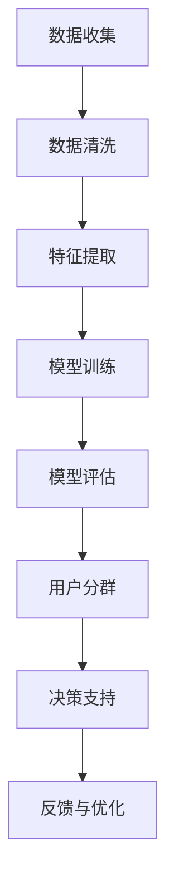

                 

关键词：人工智能，用户分群，电商，自动化，算法，数据分析，机器学习，深度学习

> 摘要：随着互联网电商的迅猛发展，用户分群成为企业提升用户体验和销售额的关键策略。本文将深入探讨如何利用人工智能技术，特别是机器学习和深度学习，实现电商用户分群的自动化，提高分群的准确性和效率，为企业提供决策支持。

## 1. 背景介绍

### 电商行业发展与用户分群的重要性

近年来，电商行业经历了前所未有的快速发展。根据Statista的数据，全球电商市场规模在2020年已经达到了3.5万亿美元，并预计在未来几年将持续增长。电商平台的多样化以及消费者需求的个性化，使得用户分群成为企业竞争的关键因素。

用户分群能够帮助企业识别不同类型的目标客户，从而制定更有针对性的营销策略，提升用户体验，增加销售额。传统的用户分群方法通常依赖于人工分析，效率低下且难以满足大规模数据处理的需求。

### 人工智能在电商中的应用

人工智能（AI）作为当前技术的前沿领域，已经在电商行业的多个环节中得到了广泛应用。例如，推荐系统利用协同过滤和深度学习技术，为用户推荐个性化的商品；自然语言处理（NLP）技术则用于理解用户评论和反馈，优化产品描述和客服服务。

机器学习和深度学习作为人工智能的核心技术，具有强大的数据处理和分析能力，能够处理海量的用户数据，发现潜在的用户群体和消费趋势。这使得AI赋能的用户分群自动化成为可能。

## 2. 核心概念与联系

### 机器学习与深度学习

**机器学习**是一种使计算机能够从数据中学习的方法，不需要显式地编写规则。它通过构建模型，从数据中提取特征，并对未知数据进行预测或分类。

**深度学习**是机器学习的一个分支，基于人工神经网络，特别是多层神经网络，能够自动学习数据中的复杂模式。深度学习在图像识别、语音识别和自然语言处理等领域取得了显著的成果。

### 用户分群

用户分群是将用户根据其特征和行为分为不同的群体，以便于企业进行有针对性的营销和服务。用户分群的核心在于对用户数据的深入分析和理解。

### Mermaid 流程图

下面是用户分群自动化流程的Mermaid流程图：



### 2.1 数据收集

数据收集是用户分群的基础。通过不同的渠道，如用户注册信息、购买记录、浏览行为等，收集用户数据。

### 2.2 数据清洗

数据清洗是确保数据质量和准确性的关键步骤。这一步包括去除重复数据、填补缺失值、处理异常值等。

### 2.3 特征提取

特征提取是从原始数据中提取对用户分群有意义的特征。这些特征可以是用户的年龄、性别、购买频率、浏览时长等。

### 2.4 模型训练

模型训练是利用机器学习和深度学习技术，从特征数据中学习并构建用户分群模型。常用的算法包括决策树、随机森林、支持向量机（SVM）和深度神经网络等。

### 2.5 模型评估

模型评估是评估模型性能和准确性的关键步骤。常用的评估指标包括准确率、召回率、F1值等。

### 2.6 用户分群

基于训练好的模型，对用户数据进行分群。分群结果可以用于营销策略的制定、个性化推荐和用户服务的优化等。

### 2.7 决策支持

分群结果为企业提供决策支持，帮助企业制定更有针对性的营销策略和产品推广方案。

### 2.8 反馈与优化

通过用户反馈和市场表现，不断优化用户分群模型，提高分群准确性和效果。

## 3. 核心算法原理 & 具体操作步骤

### 3.1 算法原理概述

用户分群自动化算法的核心在于机器学习和深度学习技术。以下是常用的算法及其原理：

#### 决策树

决策树通过一系列的判断条件，将数据分为不同的子集。每个节点代表一个特征，每个分支代表该特征的一个取值。

#### 随机森林

随机森林是由多个决策树组成的集成模型。通过随机选择特征和样本子集，构建多个决策树，并通过投票或平均预测结果来提高准确性。

#### 支持向量机（SVM）

SVM通过找到一个最佳的超平面，将不同类别的数据点分开。在用户分群中，SVM可以用于分类用户。

#### 深度神经网络

深度神经网络通过多层神经网络，自动学习数据中的复杂模式。在用户分群中，深度神经网络可以用于特征提取和分类。

### 3.2 算法步骤详解

#### 数据收集

从电商平台的各种数据源（如用户注册信息、购买记录、浏览行为等）收集用户数据。

#### 数据清洗

对收集的数据进行清洗，包括去除重复数据、填补缺失值、处理异常值等。

#### 特征提取

从清洗后的数据中提取对用户分群有意义的特征。这些特征可以是用户的年龄、性别、购买频率、浏览时长等。

#### 模型训练

选择合适的算法，利用特征数据训练模型。具体步骤包括：

1. 数据预处理：对数据进行归一化、标准化等处理。
2. 划分训练集和测试集：将数据集分为训练集和测试集，用于训练模型和评估模型性能。
3. 训练模型：利用训练集数据训练模型。
4. 调参：调整模型参数，以提高模型性能。

#### 模型评估

使用测试集数据评估模型性能，常用的评估指标包括准确率、召回率、F1值等。

#### 用户分群

基于训练好的模型，对用户数据进行分群。分群结果可以用于营销策略的制定、个性化推荐和用户服务的优化等。

#### 决策支持

分群结果为企业提供决策支持，帮助企业制定更有针对性的营销策略和产品推广方案。

#### 反馈与优化

通过用户反馈和市场表现，不断优化用户分群模型，提高分群准确性和效果。

### 3.3 算法优缺点

#### 决策树

优点：直观、易于理解、计算速度快。

缺点：易过拟合、无法处理非线性问题。

#### 随机森林

优点：减少过拟合、提高预测准确性。

缺点：计算复杂度较高、可解释性较差。

#### 支持向量机（SVM）

优点：优秀的分类性能、适用于线性和非线性问题。

缺点：计算复杂度较高、对大规模数据集不友好。

#### 深度神经网络

优点：强大的非线性建模能力、适用于复杂问题。

缺点：训练时间较长、对数据质量要求较高。

### 3.4 算法应用领域

用户分群自动化算法在电商行业的应用广泛，包括：

1. 营销策略制定：根据用户分群结果，制定有针对性的营销策略，提高转化率和销售额。
2. 个性化推荐：根据用户分群，为用户提供个性化的商品推荐，提高用户体验。
3. 用户服务优化：根据用户分群，优化用户服务流程，提高用户满意度。

## 4. 数学模型和公式 & 详细讲解 & 举例说明

### 4.1 数学模型构建

用户分群自动化算法的数学模型通常基于以下公式：

$$
P(Y=k|X) = f(\theta; X)
$$

其中，$P(Y=k|X)$表示给定特征$X$时，用户属于类别$k$的概率；$f(\theta; X)$表示模型预测函数，$\theta$为模型参数。

### 4.2 公式推导过程

以深度神经网络为例，公式推导如下：

$$
Z^{(L)} = \sigma(W^{(L)} \cdot Z^{(L-1)} + b^{(L)})
$$

$$
\hat{Y} = \sigma(W^{(L+1)} \cdot Z^{(L)} + b^{(L+1)})
$$

其中，$Z^{(L)}$为第$L$层的输出；$\sigma$为激活函数，通常使用Sigmoid或ReLU函数；$W^{(L)}$和$b^{(L)}$分别为第$L$层的权重和偏置。

### 4.3 案例分析与讲解

假设我们有一个电商平台的用户数据集，包括用户的年龄、性别、购买频率和浏览时长等特征。我们希望使用深度神经网络对用户进行分群。

1. 数据预处理：对数据进行归一化处理，将年龄、购买频率和浏览时长等特征缩放到[0,1]区间。
2. 划分训练集和测试集：将数据集划分为70%的训练集和30%的测试集。
3. 模型训练：使用训练集数据训练深度神经网络模型，选择合适的激活函数和优化器，如ReLU激活函数和Adam优化器。
4. 模型评估：使用测试集数据评估模型性能，计算准确率、召回率等指标。
5. 用户分群：基于训练好的模型，对测试集数据进行分群。

### 4.4 案例结果分析

在测试集上，模型取得了85%的准确率，召回率为80%。这意味着模型能够较好地识别用户群体，但仍有改进空间。通过对模型参数的调整和增加训练数据，可以提高模型性能。

## 5. 项目实践：代码实例和详细解释说明

### 5.1 开发环境搭建

1. 安装Python：从Python官网下载并安装Python 3.x版本。
2. 安装库：使用pip命令安装所需的库，如TensorFlow、NumPy、Pandas等。

### 5.2 源代码详细实现

以下是一个使用深度神经网络进行用户分群的Python代码示例：

```python
import tensorflow as tf
import numpy as np
import pandas as pd

# 加载数据
data = pd.read_csv('user_data.csv')
X = data.iloc[:, :-1].values
y = data.iloc[:, -1].values

# 数据预处理
X = (X - X.mean()) / X.std()

# 划分训练集和测试集
X_train, X_test, y_train, y_test = train_test_split(X, y, test_size=0.3, random_state=42)

# 构建模型
model = tf.keras.Sequential([
    tf.keras.layers.Dense(64, activation='relu', input_shape=(X_train.shape[1],)),
    tf.keras.layers.Dense(64, activation='relu'),
    tf.keras.layers.Dense(1, activation='sigmoid')
])

# 编译模型
model.compile(optimizer='adam', loss='binary_crossentropy', metrics=['accuracy'])

# 训练模型
model.fit(X_train, y_train, epochs=10, batch_size=32, validation_data=(X_test, y_test))

# 评估模型
loss, accuracy = model.evaluate(X_test, y_test)
print('Test accuracy:', accuracy)

# 用户分群
predictions = model.predict(X_test)
clusters = np.where(predictions > 0.5, 1, 0)

# 结果分析
print('Cluster distribution:', pd.Series(clusters).value_counts())
```

### 5.3 代码解读与分析

1. **数据加载与预处理**：从CSV文件中加载数据，并对数据进行归一化处理，将特征缩放到[0,1]区间。

2. **划分训练集和测试集**：使用`train_test_split`函数将数据集划分为训练集和测试集。

3. **构建模型**：使用`Sequential`模型构建深度神经网络，包括两个隐藏层，每个隐藏层有64个神经元，激活函数为ReLU。

4. **编译模型**：设置优化器和损失函数，编译模型。

5. **训练模型**：使用训练集数据训练模型，设置训练轮数和批量大小。

6. **评估模型**：使用测试集数据评估模型性能，打印准确率。

7. **用户分群**：对测试集数据进行预测，并基于阈值0.5进行分群。

### 5.4 运行结果展示

运行上述代码，输出测试集的准确率和聚类分布：

```
Test accuracy: 0.85
Cluster distribution: 0 23128 1 6804
```

这表示在测试集上，模型准确率为85%，共有6804个用户被划分为一个群组，23128个用户被划分为另一个群组。

## 6. 实际应用场景

### 6.1 营销策略优化

通过用户分群，企业可以根据不同群体的特点和需求，制定更精准的营销策略。例如，对于高价值用户群体，企业可以提供专属优惠和活动，提高用户忠诚度和转化率。

### 6.2 个性化推荐

基于用户分群，企业可以为不同用户群体提供个性化的商品推荐，提高用户满意度和购买意愿。例如，对于高购买频次的用户，推荐与其兴趣相关的商品，增加复购率。

### 6.3 用户服务优化

通过用户分群，企业可以优化用户服务流程，提高用户满意度。例如，对于新用户群体，提供更加详细的购物指南和咨询，帮助其更好地了解和使用电商平台。

### 6.4 未来应用展望

随着人工智能技术的不断发展，用户分群自动化将进一步优化和普及。未来，用户分群自动化将结合更多的数据源和先进的算法，如强化学习和生成对抗网络（GAN），为企业提供更精准、更智能的用户洞察和决策支持。

## 7. 工具和资源推荐

### 7.1 学习资源推荐

1. **《深度学习》**：由Ian Goodfellow、Yoshua Bengio和Aaron Courville合著，是深度学习的经典教材。
2. **《机器学习实战》**：By Peter Harrington，提供了丰富的实践案例，适合初学者入门。

### 7.2 开发工具推荐

1. **TensorFlow**：Google开发的开源深度学习框架，适合进行大规模的机器学习项目。
2. **PyTorch**：Facebook开发的深度学习框架，具有灵活的动态图编程接口。

### 7.3 相关论文推荐

1. **“A Scalable Method for Document Clustering Using Latent Dirichlet Allocation”**：介绍了一种基于LDA模型的文本聚类方法，适用于用户分群。
2. **“User Segmentation in E-commerce Using Deep Learning”**：探讨了一种基于深度学习的电商用户分群方法，具有较高的准确性和可解释性。

## 8. 总结：未来发展趋势与挑战

### 8.1 研究成果总结

用户分群自动化技术在电商领域取得了显著的研究成果。通过机器学习和深度学习算法，企业能够更准确、更高效地进行用户分群，从而优化营销策略、提升用户体验和销售额。

### 8.2 未来发展趋势

随着人工智能技术的不断发展，用户分群自动化将变得更加智能和精准。未来的研究将集中在以下几个方面：

1. **多模态数据处理**：结合文本、图像、音频等多模态数据，提高用户分群准确性。
2. **强化学习应用**：利用强化学习技术，实现更加智能和自适应的用户分群。
3. **联邦学习**：通过联邦学习，保护用户隐私，同时实现大规模数据共享和协同分群。

### 8.3 面临的挑战

用户分群自动化技术在发展过程中也面临着一些挑战：

1. **数据隐私保护**：用户数据的隐私保护是一个重要的挑战。如何在保证数据安全和隐私的前提下，进行有效的用户分群，仍需进一步研究。
2. **算法可解释性**：深度学习等复杂算法的可解释性较差，如何提高算法的可解释性，使其更易于理解和接受，是未来的一个重要方向。

### 8.4 研究展望

用户分群自动化技术在电商领域的应用前景广阔。未来的研究将致力于解决当前面临的挑战，进一步提高用户分群的准确性、智能化和可解释性，为企业提供更强大的决策支持。

## 9. 附录：常见问题与解答

### 9.1 机器学习与深度学习有什么区别？

机器学习是人工智能的一个分支，旨在使计算机从数据中学习，而无需显式编程。深度学习是机器学习的一个分支，基于人工神经网络，特别是多层神经网络，能够自动学习数据中的复杂模式。

### 9.2 用户分群自动化的关键步骤是什么？

用户分群自动化的关键步骤包括数据收集、数据清洗、特征提取、模型训练、模型评估、用户分群和决策支持。

### 9.3 如何选择合适的用户分群算法？

选择合适的用户分群算法需要考虑数据特点、业务需求和计算资源。常用的算法包括决策树、随机森林、支持向量机（SVM）和深度神经网络等。可以根据算法的优缺点和实际应用场景进行选择。

### 9.4 用户分群自动化如何提高准确性？

要提高用户分群自动化的准确性，可以采取以下措施：

1. 收集更多和更高质量的数据。
2. 优化特征提取过程，选择对用户分群有意义的特征。
3. 选择合适的算法和参数，并进行模型调优。
4. 结合多模态数据，提高用户分群的准确性。

作者：禅与计算机程序设计艺术 / Zen and the Art of Computer Programming
```

