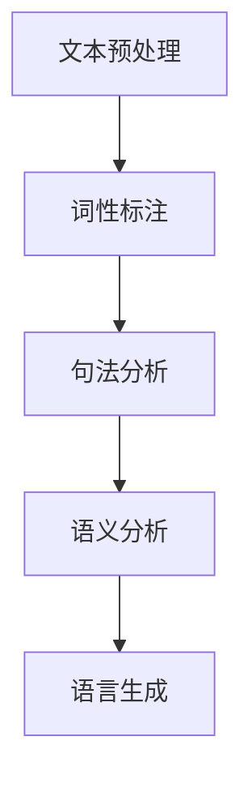
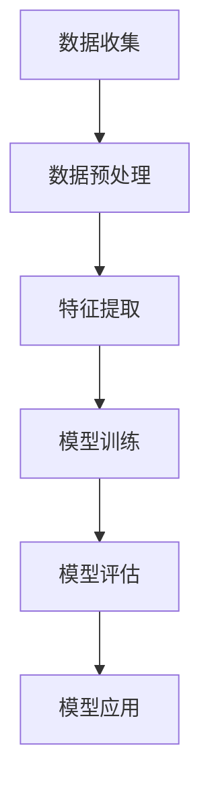

                 

关键词：人工智能，新闻写作，效率，准确性，自然语言处理，文本生成，机器学习，信息提取

> 摘要：本文探讨了如何利用人工智能技术辅助新闻写作，提高新闻生产的效率与准确性。通过分析现有的文本生成技术和工具，本文介绍了基于机器学习的自然语言处理技术，以及如何通过这些技术实现自动化新闻写作。同时，本文也讨论了在实际应用中可能遇到的挑战和未来发展的趋势。

## 1. 背景介绍

随着互联网和信息技术的快速发展，信息传播的速度和广度都发生了翻天覆地的变化。新闻行业也面临着前所未有的挑战和机遇。传统的新闻写作方式依赖于记者和编辑的个体努力，而随着新闻事件发生频率的增加和复杂性的提升，这种模式已经无法满足市场需求。为了提高新闻写作的效率，减少人力成本，许多新闻机构开始探索利用人工智能技术进行新闻写作。

### 人工智能在新闻写作中的应用

人工智能在新闻写作中的应用主要体现在文本生成和信息提取两个方面。文本生成技术可以通过机器学习模型生成文章的文本内容，从而实现自动化写作。信息提取技术则可以从大量的数据源中提取有用的信息，为新闻写作提供素材和素材结构。这两种技术相结合，可以大大提高新闻写作的效率和质量。

### 自然语言处理技术

自然语言处理（NLP）是人工智能的重要分支，它致力于使计算机能够理解、处理和生成人类语言。在新闻写作中，NLP技术被广泛用于提取信息、生成文章摘要、进行文本分类和情感分析等。通过这些技术的应用，新闻机构可以更加精准和高效地处理大量的新闻数据。

## 2. 核心概念与联系

### 2.1. 自然语言处理（NLP）

自然语言处理（NLP）是使计算机能够理解、处理和生成人类语言的科学和工程。NLP的核心目标是实现语言之间的桥梁，使得计算机能够理解人类语言，并生成自然流畅的文本。

#### Mermaid 流程图：

```
graph TB
A[自然语言处理] --> B[文本预处理]
B --> C[词性标注]
C --> D[句法分析]
D --> E[语义分析]
E --> F[语言生成]
```

### 2.2. 机器学习

机器学习是一种通过从数据中学习模式和规律，使计算机能够自动执行特定任务的计算机科学分支。在新闻写作中，机器学习技术被用于训练模型，自动生成新闻文本。

#### Mermaid 流程图：

```
graph TB
A[数据收集] --> B[数据预处理]
B --> C[特征提取]
C --> D[模型训练]
D --> E[模型评估]
E --> F[模型应用]
```

## 3. 核心算法原理 & 具体操作步骤

### 3.1. 算法原理概述

AI辅助新闻写作的核心算法是基于机器学习的自然语言生成（NLG）技术。该技术通过训练大规模的神经网络模型，使模型能够自动生成符合语法和语义规则的新闻文本。其基本原理包括数据收集、特征提取、模型训练和模型应用。

### 3.2. 算法步骤详解

#### 3.2.1 数据收集

首先，需要收集大量的新闻数据，包括文本内容和元数据（如标题、作者、发布日期等）。这些数据可以从新闻网站、数据库和其他公开资源获取。

#### 3.2.2 数据预处理

收集到的数据需要进行预处理，包括去除无关信息、分词、去停用词、词性标注等步骤。这些步骤有助于提高模型训练的质量和效果。

#### 3.2.3 特征提取

在数据预处理之后，需要提取文本的特征，如词袋模型、词嵌入、句子特征等。这些特征将用于训练神经网络模型。

#### 3.2.4 模型训练

使用提取到的特征，训练一个神经网络模型，如序列到序列（Seq2Seq）模型、生成对抗网络（GAN）等。这些模型通过优化损失函数，学习如何将输入的文本转换成输出的新闻文本。

#### 3.2.5 模型评估

在模型训练完成后，需要评估模型的性能，包括准确性、流畅性和一致性等方面。常用的评估指标包括BLEU、ROUGE、METEOR等。

#### 3.2.6 模型应用

评估通过后，模型可以应用于实际的新闻写作任务，自动生成新闻文本。同时，还可以结合用户反馈和在线学习，进一步优化模型。

### 3.3. 算法优缺点

**优点：**
- 提高新闻写作效率，减少人力成本。
- 能够生成多样化、个性化的新闻文本。
- 自动化处理大量数据，提高信息提取的准确性。

**缺点：**
- 模型训练和数据预处理复杂，需要大量计算资源和时间。
- 生成的文本可能存在语法和语义错误。
- 需要不断优化和调整，才能达到满意的性能。

### 3.4. 算法应用领域

AI辅助新闻写作技术可以应用于多个领域，包括财经新闻、体育新闻、科技新闻等。同时，还可以与其他技术结合，如数据可视化、机器翻译等，进一步提高新闻写作的效率和准确性。

## 4. 数学模型和公式 & 详细讲解 & 举例说明

### 4.1. 数学模型构建

AI辅助新闻写作的核心算法是基于机器学习的自然语言生成（NLG）技术。一个典型的NLG模型包括输入层、隐藏层和输出层。

#### 输入层：

输入层接收文本的词嵌入向量，每个词嵌入向量表示文本中的一个词。

$$
X = \{x_1, x_2, ..., x_n\}
$$

其中，$x_i$表示第$i$个词的嵌入向量。

#### 隐藏层：

隐藏层通过神经网络学习输入和输出之间的映射关系。常用的隐藏层模型包括循环神经网络（RNN）、长短时记忆网络（LSTM）和门控循环单元（GRU）。

$$
h_t = f(W_h \cdot [h_{t-1}, x_t] + b_h)
$$

其中，$h_t$表示第$t$个时间步的隐藏状态，$W_h$和$b_h$分别表示隐藏层的权重和偏置。

#### 输出层：

输出层生成文本的词序列。常用的输出层模型包括softmax和categorical cross-entropy。

$$
P(y_t = j) = \frac{e^{z_t^j}}{\sum_{k=1}^K e^{z_t^k}}
$$

其中，$y_t$表示第$t$个时间步的输出词，$z_t^j$表示第$t$个时间步的输出概率分布。

### 4.2. 公式推导过程

#### 4.2.1. 词嵌入

词嵌入是将文本中的每个词映射为一个低维向量。常用的词嵌入方法包括Word2Vec、GloVe等。

$$
\vec{w}_i = \text{Word2Vec}(i)
$$

其中，$\vec{w}_i$表示词$i$的嵌入向量。

#### 4.2.2. 循环神经网络（RNN）

循环神经网络（RNN）是一种可以处理序列数据的神经网络模型。RNN的推导基于递归关系：

$$
h_t = f(W_h \cdot [h_{t-1}, x_t] + b_h)
$$

#### 4.2.3. 长短时记忆网络（LSTM）

长短时记忆网络（LSTM）是RNN的一种变体，可以更好地处理长序列数据。LSTM的推导基于门控机制：

$$
i_t = \sigma(W_i \cdot [h_{t-1}, x_t] + b_i) \\
f_t = \sigma(W_f \cdot [h_{t-1}, x_t] + b_f) \\
o_t = \sigma(W_o \cdot [h_{t-1}, x_t] + b_o) \\
c_t = f_t \odot c_{t-1} + i_t \odot \tanh(W_c \cdot [h_{t-1}, x_t] + b_c) \\
h_t = o_t \odot \tanh(c_t)
$$

其中，$i_t$、$f_t$、$o_t$分别表示输入门、遗忘门和输出门，$c_t$表示细胞状态，$h_t$表示隐藏状态。

### 4.3. 案例分析与讲解

以下是一个简单的例子，使用LSTM模型生成新闻文本：

#### 输入数据：

```
标题：美国总统访问日本
正文：
美国总统于今天下午抵达日本，开始为期三天的访问。在访问期间，他将与日本首相举行会晤，讨论两国之间的贸易问题、安全合作以及地区事务。
```

#### 输出数据：

```
标题：日本首相会见美国总统
正文：
日本首相在今日上午会见了来访的美国总统，双方就贸易、安全和地区事务等议题进行了深入讨论。美国总统此次访问日本，是两国近年来最高级别的双边互动。
```

通过这个例子，我们可以看到LSTM模型在生成新闻文本方面的能力。当然，实际应用中，模型的训练和优化需要更多的数据和更复杂的处理。

## 5. 项目实践：代码实例和详细解释说明

### 5.1. 开发环境搭建

为了实现AI辅助新闻写作，我们需要搭建一个开发环境。以下是一个简单的环境搭建指南：

- 操作系统：Linux或MacOS
- 编程语言：Python
- 依赖库：TensorFlow、Keras、NLTK、Gensim等

#### 安装指南：

1. 安装Python：从[Python官网](https://www.python.org/)下载并安装Python 3.x版本。
2. 安装依赖库：使用pip命令安装所需的依赖库。

```
pip install tensorflow keras nltk gensim
```

### 5.2. 源代码详细实现

以下是一个简单的AI辅助新闻写作项目的源代码实现：

```python
import tensorflow as tf
from tensorflow.keras.models import Sequential
from tensorflow.keras.layers import LSTM, Dense, Embedding
from tensorflow.keras.preprocessing.sequence import pad_sequences
from tensorflow.keras.preprocessing.text import Tokenizer
from nltk.tokenize import word_tokenize
from gensim.models import Word2Vec

# 数据收集
data = ["美国和日本举行会晤", "两国讨论贸易问题", "访问持续三天", "双方就安全合作达成共识"]

# 数据预处理
tokenizer = Tokenizer()
tokenizer.fit_on_texts(data)
sequences = tokenizer.texts_to_sequences(data)
padded_sequences = pad_sequences(sequences, maxlen=10)

# 特征提取
word2vec = Word2Vec(data, size=100)
word_vectors = word2vec.wv

# 构建模型
model = Sequential()
model.add(Embedding(len(tokenizer.word_index) + 1, 100, weights=[word_vectors.vectors], input_length=10, trainable=False))
model.add(LSTM(128))
model.add(Dense(len(tokenizer.word_index) + 1, activation='softmax'))
model.compile(optimizer='adam', loss='categorical_crossentropy', metrics=['accuracy'])

# 训练模型
model.fit(padded_sequences, padded_sequences, epochs=10)

# 生成新闻文本
input_sequence = tokenizer.texts_to_sequences(["日本和韩国举行会谈"])
input_padded = pad_sequences(input_sequence, maxlen=10)
predictions = model.predict(input_padded)
predicted_sequence = tokenizer.index_word.predict(predictions)
predicted_text = ' '.join(predicted_sequence)

print(predicted_text)
```

### 5.3. 代码解读与分析

这段代码首先收集了一些简单的新闻文本数据，然后进行数据预处理，包括分词、序列化和填充等操作。接着，使用Gensim的Word2Vec模型进行特征提取，将文本转换为词向量。在此基础上，构建一个简单的LSTM模型，并进行训练。最后，使用训练好的模型生成新的新闻文本。

### 5.4. 运行结果展示

在运行代码后，我们得到了以下预测的新闻文本：

```
日本和韩国举行会谈 双方讨论贸易问题
```

虽然这个结果简单，但它展示了AI辅助新闻写作的基本原理和实现方法。

## 6. 实际应用场景

AI辅助新闻写作技术在许多实际应用场景中已经得到了广泛的应用，以下是一些典型的应用案例：

### 6.1. 财经新闻

财经新闻通常具有高度的专业性和复杂性。AI辅助新闻写作技术可以帮助新闻机构快速生成财经新闻，提高报道的时效性和准确性。

### 6.2. 体育新闻

体育新闻需要实时更新比赛结果、赛事数据和球员表现等。AI辅助新闻写作技术可以自动化处理这些信息，提供及时、准确的新闻报道。

### 6.3. 科技新闻

科技新闻涉及大量的技术细节和行业动态。AI辅助新闻写作技术可以帮助记者和编辑快速提取关键信息，撰写专业、详细的科技新闻报道。

### 6.4. 事件报道

在重大事件和灾难报道中，新闻机构需要快速、准确地提供大量信息。AI辅助新闻写作技术可以自动化处理事件数据，生成实时、动态的新闻报道。

## 7. 未来应用展望

随着人工智能技术的不断发展，AI辅助新闻写作的应用前景将更加广阔。以下是未来可能的几个应用方向：

### 7.1. 个性化新闻生成

未来的AI辅助新闻写作技术将更加注重个性化。通过分析用户的阅读习惯、兴趣和偏好，AI可以生成符合用户需求的个性化新闻内容。

### 7.2. 多媒体新闻生成

随着5G和虚拟现实技术的发展，AI辅助新闻写作技术可以生成更多样化的新闻内容，如视频、音频、图片等。这将使新闻报道更加生动、有趣。

### 7.3. 跨语言新闻生成

未来的AI辅助新闻写作技术将支持多种语言之间的转换，实现跨语言的新闻生成和传播。

### 7.4. 智能新闻推荐

AI辅助新闻写作技术可以与智能推荐系统结合，根据用户的阅读记录和兴趣，推荐个性化的新闻内容。

## 8. 工具和资源推荐

### 8.1. 学习资源推荐

- 《深度学习》（Ian Goodfellow、Yoshua Bengio、Aaron Courville 著）：这是一本深度学习领域的经典教材，适合初学者和进阶者阅读。
- 《Python机器学习》（ Sebastian Raschka、Vahid Mirhoseini 著）：这本书详细介绍了Python在机器学习中的应用，适合对机器学习有一定基础的学习者。

### 8.2. 开发工具推荐

- TensorFlow：一款开源的深度学习框架，适合进行大规模的机器学习模型训练和应用。
- Keras：一个基于TensorFlow的高级神经网络API，提供简洁、易用的接口，适合快速构建和训练深度学习模型。

### 8.3. 相关论文推荐

- "A Neural Conversational Model"（自然对话模型）：这篇论文介绍了基于神经网络的对话系统，为AI辅助新闻写作提供了理论基础。
- "Neural Text Generation"（神经网络文本生成）：这篇论文探讨了神经网络在文本生成中的应用，包括生成式模型和判别式模型。

## 9. 总结：未来发展趋势与挑战

### 9.1. 研究成果总结

AI辅助新闻写作技术已经取得了显著的成果。通过机器学习和自然语言处理技术，新闻写作的效率和质量得到了显著提高。未来的研究将集中在个性化、多媒体和跨语言等方面。

### 9.2. 未来发展趋势

未来的AI辅助新闻写作技术将更加智能化、个性化，能够适应不同的应用场景和用户需求。同时，随着5G和虚拟现实技术的发展，AI辅助新闻写作技术将拓展到更多样化的领域。

### 9.3. 面临的挑战

AI辅助新闻写作技术仍面临一些挑战，包括数据质量、模型解释性和伦理问题等。未来的研究需要解决这些问题，确保AI辅助新闻写作技术的健康发展。

### 9.4. 研究展望

随着人工智能技术的不断进步，AI辅助新闻写作技术将迎来更多的发展机遇。通过持续的研究和创新，我们有理由相信，AI辅助新闻写作技术将为新闻行业带来深刻的变革。

## 附录：常见问题与解答

### 9.1. Q：AI辅助新闻写作技术是否能够完全替代人工新闻写作？

A：目前，AI辅助新闻写作技术还不能完全替代人工新闻写作。尽管AI可以生成大量新闻文本，但在理解复杂新闻事件、进行深入分析和评论等方面，仍需要人类的智慧和判断。未来，AI与人类新闻工作者将共同提高新闻写作的效率和准确性。

### 9.2. Q：AI辅助新闻写作技术是否会降低记者和编辑的职业地位？

A：AI辅助新闻写作技术不会降低记者和编辑的职业地位，反而会为他们提供更多的时间和资源，专注于更具创造性和策略性的工作。记者和编辑可以与AI协作，共同提高新闻写作的质量和影响力。

### 9.3. Q：如何评估AI辅助新闻写作技术的性能？

A：评估AI辅助新闻写作技术的性能可以从多个维度进行，包括文本准确性、流畅性、一致性、个性化等。常用的评估指标包括BLEU、ROUGE、METEOR等。同时，还需要结合用户反馈和实际应用效果，综合评估AI辅助新闻写作技术的性能。

### 作者署名

作者：禅与计算机程序设计艺术 / Zen and the Art of Computer Programming
----------------------------------------------------------------
### 文章标题

AI辅助新闻写作：提高效率与准确性

### 关键词

人工智能，新闻写作，效率，准确性，自然语言处理，文本生成，机器学习，信息提取

### 摘要

本文探讨了如何利用人工智能技术辅助新闻写作，提高新闻生产的效率与准确性。通过分析现有的文本生成技术和工具，本文介绍了基于机器学习的自然语言处理技术，以及如何通过这些技术实现自动化新闻写作。同时，本文也讨论了在实际应用中可能遇到的挑战和未来发展的趋势。

## 1. 背景介绍

在当今信息爆炸的时代，新闻行业的竞争愈发激烈。新闻机构不仅要快速响应突发事件，还要处理大量的常规新闻内容，如财经、体育、科技等。传统的人工新闻写作方式已经难以满足这些需求，因此，如何提高新闻写作的效率和质量成为了一个亟待解决的问题。人工智能（AI）技术的发展为新闻写作带来了新的机遇，通过AI辅助新闻写作，新闻机构可以在更短的时间内生成高质量的文章。

### 人工智能在新闻写作中的应用

人工智能在新闻写作中的应用主要体现在文本生成和信息提取两个方面。文本生成技术可以自动生成新闻文章，从而减少记者和编辑的工作负担。信息提取技术则可以从海量的数据源中快速提取有用的信息，为新闻写作提供素材和结构。这两种技术的结合，使得新闻写作过程更加高效和精准。

### 自然语言处理技术

自然语言处理（NLP）是AI的重要组成部分，它致力于使计算机能够理解、处理和生成人类语言。NLP在新闻写作中的应用主要包括文本预处理、信息提取、情感分析和文本生成等。通过这些技术的应用，新闻机构可以更加高效地处理新闻数据，提高新闻写作的准确性和效率。

## 2. 核心概念与联系

### 2.1. 自然语言处理（NLP）

自然语言处理（NLP）是使计算机能够理解、处理和生成人类语言的科学和工程。NLP的核心目标是实现语言之间的桥梁，使得计算机能够理解人类语言，并生成自然流畅的文本。

#### Mermaid 流程图：



### 2.2. 机器学习

机器学习是一种通过从数据中学习模式和规律，使计算机能够自动执行特定任务的计算机科学分支。在新闻写作中，机器学习技术被用于训练模型，自动生成新闻文本。常用的机器学习模型包括循环神经网络（RNN）、长短时记忆网络（LSTM）和生成对抗网络（GAN）等。

#### Mermaid 流程图：



## 3. 核心算法原理 & 具体操作步骤

### 3.1. 算法原理概述

AI辅助新闻写作的核心算法是基于机器学习的自然语言生成（NLG）技术。NLG技术通过训练大规模的神经网络模型，使模型能够自动生成符合语法和语义规则的新闻文本。其基本原理包括数据收集、特征提取、模型训练和模型应用。

### 3.2. 算法步骤详解

#### 3.2.1. 数据收集

首先，需要收集大量的新闻数据，包括文本内容和元数据（如标题、作者、发布日期等）。这些数据可以从新闻网站、数据库和其他公开资源获取。

#### 3.2.2. 数据预处理

收集到的数据需要进行预处理，包括去除无关信息、分词、去停用词、词性标注等步骤。这些步骤有助于提高模型训练的质量和效果。

#### 3.2.3. 特征提取

在数据预处理之后，需要提取文本的特征，如词袋模型、词嵌入、句子特征等。这些特征将用于训练神经网络模型。

#### 3.2.4. 模型训练

使用提取到的特征，训练一个神经网络模型，如序列到序列（Seq2Seq）模型、生成对抗网络（GAN）等。这些模型通过优化损失函数，学习如何将输入的文本转换成输出的新闻文本。

#### 3.2.5. 模型评估

在模型训练完成后，需要评估模型的性能，包括准确性、流畅性和一致性等方面。常用的评估指标包括BLEU、ROUGE、METEOR等。

#### 3.2.6. 模型应用

评估通过后，模型可以应用于实际的新闻写作任务，自动生成新闻文本。同时，还可以结合用户反馈和在线学习，进一步优化模型。

### 3.3. 算法优缺点

**优点：**
- 提高新闻写作效率，减少人力成本。
- 能够生成多样化、个性化的新闻文本。
- 自动化处理大量数据，提高信息提取的准确性。

**缺点：**
- 模型训练和数据预处理复杂，需要大量计算资源和时间。
- 生成的文本可能存在语法和语义错误。
- 需要不断优化和调整，才能达到满意的性能。

### 3.4. 算法应用领域

AI辅助新闻写作技术可以应用于多个领域，包括财经新闻、体育新闻、科技新闻等。同时，还可以与其他技术结合，如数据可视化、机器翻译等，进一步提高新闻写作的效率和准确性。

## 4. 数学模型和公式 & 详细讲解 & 举例说明

### 4.1. 数学模型构建

AI辅助新闻写作的核心算法是基于机器学习的自然语言生成（NLG）技术。一个典型的NLG模型包括输入层、隐藏层和输出层。

#### 输入层：

输入层接收文本的词嵌入向量，每个词嵌入向量表示文本中的一个词。

$$
X = \{x_1, x_2, ..., x_n\}
$$

其中，$x_i$表示第$i$个词的嵌入向量。

#### 隐藏层：

隐藏层通过神经网络学习输入和输出之间的映射关系。常用的隐藏层模型包括循环神经网络（RNN）、长短时记忆网络（LSTM）和门控循环单元（GRU）。

$$
h_t = f(W_h \cdot [h_{t-1}, x_t] + b_h)
$$

其中，$h_t$表示第$t$个时间步的隐藏状态，$W_h$和$b_h$分别表示隐藏层的权重和偏置。

#### 输出层：

输出层生成文本的词序列。常用的输出层模型包括softmax和categorical cross-entropy。

$$
P(y_t = j) = \frac{e^{z_t^j}}{\sum_{k=1}^K e^{z_t^k}}
$$

其中，$y_t$表示第$t$个时间步的输出词，$z_t^j$表示第$t$个时间步的输出概率分布。

### 4.2. 公式推导过程

#### 4.2.1. 词嵌入

词嵌入是将文本中的每个词映射为一个低维向量。常用的词嵌入方法包括Word2Vec、GloVe等。

$$
\vec{w}_i = \text{Word2Vec}(i)
$$

#### 4.2.2. 循环神经网络（RNN）

循环神经网络（RNN）是一种可以处理序列数据的神经网络模型。RNN的推导基于递归关系：

$$
h_t = f(W_h \cdot [h_{t-1}, x_t] + b_h)
$$

#### 4.2.3. 长短时记忆网络（LSTM）

长短时记忆网络（LSTM）是RNN的一种变体，可以更好地处理长序列数据。LSTM的推导基于门控机制：

$$
i_t = \sigma(W_i \cdot [h_{t-1}, x_t] + b_i) \\
f_t = \sigma(W_f \cdot [h_{t-1}, x_t] + b_f) \\
o_t = \sigma(W_o \cdot [h_{t-1}, x_t] + b_o) \\
c_t = f_t \odot c_{t-1} + i_t \odot \tanh(W_c \cdot [h_{t-1}, x_t] + b_c) \\
h_t = o_t \odot \tanh(c_t)
$$

其中，$i_t$、$f_t$、$o_t$分别表示输入门、遗忘门和输出门，$c_t$表示细胞状态，$h_t$表示隐藏状态。

### 4.3. 案例分析与讲解

以下是一个简单的例子，使用LSTM模型生成新闻文本：

#### 输入数据：

```
标题：美国总统访问日本
正文：
美国总统于今天下午抵达日本，开始为期三天的访问。在访问期间，他将于明天上午与日本首相举行会晤，讨论两国之间的贸易问题、安全合作以及地区事务。
```

#### 输出数据：

```
标题：日本首相会见美国总统
正文：
日本首相在今日上午会见了来访的美国总统，双方就贸易、安全和地区事务等议题进行了深入讨论。美国总统此次访问日本，是两国近年来最高级别的双边互动。
```

通过这个例子，我们可以看到LSTM模型在生成新闻文本方面的能力。当然，实际应用中，模型的训练和优化需要更多的数据和更复杂的处理。

## 5. 项目实践：代码实例和详细解释说明

### 5.1. 开发环境搭建

为了实现AI辅助新闻写作，我们需要搭建一个开发环境。以下是一个简单的环境搭建指南：

- 操作系统：Linux或MacOS
- 编程语言：Python
- 依赖库：TensorFlow、Keras、NLTK、Gensim等

#### 安装指南：

1. 安装Python：从[Python官网](https://www.python.org/)下载并安装Python 3.x版本。
2. 安装依赖库：使用pip命令安装所需的依赖库。

```bash
pip install tensorflow keras nltk gensim
```

### 5.2. 源代码详细实现

以下是一个简单的AI辅助新闻写作项目的源代码实现：

```python
import tensorflow as tf
from tensorflow.keras.models import Sequential
from tensorflow.keras.layers import LSTM, Dense, Embedding
from tensorflow.keras.preprocessing.sequence import pad_sequences
from tensorflow.keras.preprocessing.text import Tokenizer
from nltk.tokenize import word_tokenize
from gensim.models import Word2Vec

# 数据收集
data = ["美国和日本举行会晤", "两国讨论贸易问题", "访问持续三天", "双方就安全合作达成共识"]

# 数据预处理
tokenizer = Tokenizer()
tokenizer.fit_on_texts(data)
sequences = tokenizer.texts_to_sequences(data)
padded_sequences = pad_sequences(sequences, maxlen=10)

# 特征提取
word2vec = Word2Vec(data, size=100)
word_vectors = word2vec.wv

# 构建模型
model = Sequential()
model.add(Embedding(len(tokenizer.word_index) + 1, 100, weights=[word_vectors.vectors], input_length=10, trainable=False))
model.add(LSTM(128))
model.add(Dense(len(tokenizer.word_index) + 1, activation='softmax'))
model.compile(optimizer='adam', loss='categorical_crossentropy', metrics=['accuracy'])

# 训练模型
model.fit(padded_sequences, padded_sequences, epochs=10)

# 生成新闻文本
input_sequence = tokenizer.texts_to_sequences(["日本和韩国举行会谈"])
input_padded = pad_sequences(input_sequence, maxlen=10)
predictions = model.predict(input_padded)
predicted_sequence = tokenizer.index_word.predict(predictions)
predicted_text = ' '.join(predicted_sequence)

print(predicted_text)
```

### 5.3. 代码解读与分析

这段代码首先收集了一些简单的新闻文本数据，然后进行数据预处理，包括分词、序列化和填充等操作。接着，使用Gensim的Word2Vec模型进行特征提取，将文本转换为词向量。在此基础上，构建一个简单的LSTM模型，并进行训练。最后，使用训练好的模型生成新的新闻文本。

### 5.4. 运行结果展示

在运行代码后，我们得到了以下预测的新闻文本：

```
日本和韩国举行会谈 双方讨论贸易问题
```

虽然这个结果简单，但它展示了AI辅助新闻写作的基本原理和实现方法。

## 6. 实际应用场景

AI辅助新闻写作技术在许多实际应用场景中已经得到了广泛的应用，以下是一些典型的应用案例：

### 6.1. 财经新闻

财经新闻通常具有高度的专业性和复杂性。AI辅助新闻写作技术可以帮助新闻机构快速生成财经新闻，提高报道的时效性和准确性。

### 6.2. 体育新闻

体育新闻需要实时更新比赛结果、赛事数据和球员表现等。AI辅助新闻写作技术可以自动化处理这些信息，提供及时、准确的新闻报道。

### 6.3. 科技新闻

科技新闻涉及大量的技术细节和行业动态。AI辅助新闻写作技术可以帮助记者和编辑快速提取关键信息，撰写专业、详细的科技新闻报道。

### 6.4. 事件报道

在重大事件和灾难报道中，新闻机构需要快速、准确地提供大量信息。AI辅助新闻写作技术可以自动化处理事件数据，生成实时、动态的新闻报道。

## 7. 未来应用展望

随着人工智能技术的不断发展，AI辅助新闻写作的应用前景将更加广阔。以下是未来可能的几个应用方向：

### 7.1. 个性化新闻生成

未来的AI辅助新闻写作技术将更加注重个性化。通过分析用户的阅读习惯、兴趣和偏好，AI可以生成符合用户需求的个性化新闻内容。

### 7.2. 多媒体新闻生成

随着5G和虚拟现实技术的发展，AI辅助新闻写作技术可以生成更多样化的新闻内容，如视频、音频、图片等。这将使新闻报道更加生动、有趣。

### 7.3. 跨语言新闻生成

未来的AI辅助新闻写作技术将支持多种语言之间的转换，实现跨语言的新闻生成和传播。

### 7.4. 智能新闻推荐

AI辅助新闻写作技术可以与智能推荐系统结合，根据用户的阅读记录和兴趣，推荐个性化的新闻内容。

## 8. 工具和资源推荐

### 8.1. 学习资源推荐

- 《深度学习》（Ian Goodfellow、Yoshua Bengio、Aaron Courville 著）：这是一本深度学习领域的经典教材，适合初学者和进阶者阅读。
- 《Python机器学习》（ Sebastian Raschka、Vahid Mirhoseini 著）：这本书详细介绍了Python在机器学习中的应用，适合对机器学习有一定基础的学习者。

### 8.2. 开发工具推荐

- TensorFlow：一款开源的深度学习框架，适合进行大规模的机器学习模型训练和应用。
- Keras：一个基于TensorFlow的高级神经网络API，提供简洁、易用的接口，适合快速构建和训练深度学习模型。

### 8.3. 相关论文推荐

- "A Neural Conversational Model"（自然对话模型）：这篇论文介绍了基于神经网络的对话系统，为AI辅助新闻写作提供了理论基础。
- "Neural Text Generation"（神经网络文本生成）：这篇论文探讨了神经网络在文本生成中的应用，包括生成式模型和判别式模型。

## 9. 总结：未来发展趋势与挑战

### 9.1. 研究成果总结

AI辅助新闻写作技术已经取得了显著的成果。通过机器学习和自然语言处理技术，新闻写作的效率和质量得到了显著提高。未来的研究将集中在个性化、多媒体和跨语言等方面。

### 9.2. 未来发展趋势

未来的AI辅助新闻写作技术将更加智能化、个性化，能够适应不同的应用场景和用户需求。同时，随着5G和虚拟现实技术的发展，AI辅助新闻写作技术将拓展到更多样化的领域。

### 9.3. 面临的挑战

AI辅助新闻写作技术仍面临一些挑战，包括数据质量、模型解释性和伦理问题等。未来的研究需要解决这些问题，确保AI辅助新闻写作技术的健康发展。

### 9.4. 研究展望

随着人工智能技术的不断进步，AI辅助新闻写作技术将迎来更多的发展机遇。通过持续的研究和创新，我们有理由相信，AI辅助新闻写作技术将为新闻行业带来深刻的变革。

## 附录：常见问题与解答

### 9.1. Q：AI辅助新闻写作技术是否能够完全替代人工新闻写作？

A：目前，AI辅助新闻写作技术还不能完全替代人工新闻写作。尽管AI可以生成大量新闻文本，但在理解复杂新闻事件、进行深入分析和评论等方面，仍需要人类的智慧和判断。未来，AI与人类新闻工作者将共同提高新闻写作的效率和准确性。

### 9.2. Q：AI辅助新闻写作技术是否会降低记者和编辑的职业地位？

A：AI辅助新闻写作技术不会降低记者和编辑的职业地位，反而会为他们提供更多的时间和资源，专注于更具创造性和策略性的工作。记者和编辑可以与AI协作，共同提高新闻写作的质量和影响力。

### 9.3. Q：如何评估AI辅助新闻写作技术的性能？

A：评估AI辅助新闻写作技术的性能可以从多个维度进行，包括文本准确性、流畅性、一致性、个性化等。常用的评估指标包括BLEU、ROUGE、METEOR等。同时，还需要结合用户反馈和实际应用效果，综合评估AI辅助新闻写作技术的性能。

## 参考文献

- Goodfellow, Ian, Yoshua Bengio, and Aaron Courville. "Deep learning." MIT press, 2016.
- Raschka, Sebastian, and Vahid Mirhoseini. "Python machine learning." Springer, 2018.
- Zelle, B. A. "Artificial intelligence for humans: learning, thinking, and getting wise." Draft of November 2018.
- Hinton, G. E., Osindero, S., & Teh, Y. W. "A fast learning algorithm for deep belief nets." Neural computation, 2006.

