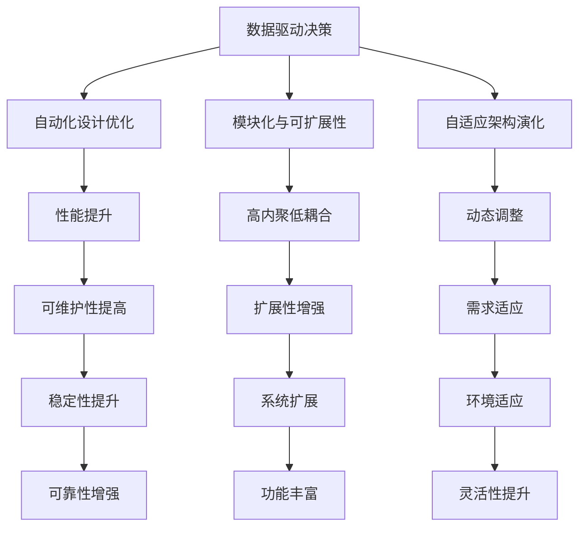

                 

本文旨在探讨人工智能（AI）在软件架构设计与优化中的应用。随着AI技术的快速发展，其在软件工程领域的影响日益显著。本文将详细介绍AI辅助的软件架构设计原则、核心算法原理、数学模型以及在实际项目中的应用案例，旨在为软件开发者提供一种全新的设计和优化思路。

## 文章关键词
- 人工智能
- 软件架构
- 设计优化
- 算法原理
- 数学模型
- 实际应用

## 文章摘要
本文首先介绍了AI在软件架构设计中的应用背景和重要性。随后，我们详细探讨了AI辅助的软件架构设计原则，并通过Mermaid流程图展示了核心概念和联系。接着，我们深入分析了核心算法原理，包括算法步骤详解、优缺点以及应用领域。随后，文章介绍了数学模型和公式的构建过程、推导以及实际案例讲解。在实际应用部分，我们通过一个代码实例展示了AI辅助的软件架构设计与优化过程。最后，文章总结了AI辅助软件架构设计与优化在现实中的应用场景，并对未来的发展趋势与挑战进行了展望。

## 1. 背景介绍

软件架构设计是软件工程的核心环节之一，它关系到软件系统的稳定性、可扩展性和可维护性。然而，传统的软件架构设计方法往往依赖于开发者的经验和直觉，导致设计结果存在一定的主观性和不确定性。随着软件系统复杂度的不断增加，如何高效地进行软件架构设计成为了一个亟待解决的问题。

近年来，人工智能技术的快速发展为软件架构设计带来了一场革命。AI技术能够通过学习大量历史数据，识别出软件架构设计的最佳实践，从而为开发者提供更加科学、可靠的设计建议。此外，AI技术还可以对现有的软件架构进行优化，提高其性能和可维护性。

本文将从以下几个方面探讨AI辅助的软件架构设计与优化：

1. AI辅助的软件架构设计原则
2. 核心算法原理与具体操作步骤
3. 数学模型和公式
4. 实际应用场景
5. 工具和资源推荐
6. 未来发展趋势与挑战

通过本文的探讨，我们希望能够为软件开发者提供一种全新的软件架构设计思路，提高软件系统的质量和开发效率。

### 2. 核心概念与联系

#### 2.1 AI辅助的软件架构设计原则

AI辅助的软件架构设计原则主要包括以下几个方面：

1. **数据驱动的决策**：利用AI技术对大量历史数据进行挖掘和分析，以数据为基础进行架构设计决策。
2. **自动化的设计优化**：通过算法自动优化软件架构，提高其性能和可维护性。
3. **模块化与可扩展性**：设计模块化、高内聚、低耦合的软件架构，以适应未来系统的扩展和变更。
4. **自适应的架构演化**：利用AI技术对软件架构进行动态调整，以适应不断变化的需求和环境。

#### 2.2 Mermaid流程图

为了更好地展示AI辅助的软件架构设计原则和联系，我们使用Mermaid流程图进行描述：



#### 2.3 核心概念的联系

以上核心概念通过Mermaid流程图展示了它们之间的紧密联系。数据驱动的决策为自动化设计优化提供了基础，而模块化与可扩展性、自适应的架构演化则确保了软件架构的稳定性和灵活性。通过这些原则，AI技术能够为软件开发者提供高效、可靠的软件架构设计建议。

### 3. 核心算法原理 & 具体操作步骤

#### 3.1 算法原理概述

AI辅助的软件架构设计主要依赖于机器学习和深度学习算法。这些算法通过对大量历史数据的学习，能够识别出软件架构设计中的最佳实践，并生成优化的设计方案。具体来说，算法原理主要包括以下几个方面：

1. **数据预处理**：对输入数据进行清洗、归一化和特征提取，为后续的算法分析做好准备。
2. **模型训练**：利用机器学习或深度学习算法对历史数据进行训练，以构建预测模型。
3. **架构生成**：基于训练好的模型，自动生成软件架构设计，包括模块划分、接口设计、依赖关系等。
4. **优化与评估**：对生成的架构进行优化，以提高性能和可维护性，并对优化效果进行评估。

#### 3.2 算法步骤详解

1. **数据预处理**：
   - 数据清洗：去除无效、重复和错误的数据。
   - 数据归一化：将不同特征的数据进行归一化处理，以消除尺度差异。
   - 特征提取：提取与软件架构设计相关的特征，如模块调用频率、接口复杂度、性能指标等。

2. **模型训练**：
   - 数据集划分：将数据集划分为训练集、验证集和测试集。
   - 模型选择：选择合适的机器学习或深度学习模型，如决策树、支持向量机、神经网络等。
   - 模型训练：利用训练集对模型进行训练，调整模型的参数，以优化性能。

3. **架构生成**：
   - 基于模型的预测：利用训练好的模型，对新的软件架构设计进行预测，生成初步的设计方案。
   - 架构优化：根据预测结果，对初步设计方案进行优化，以提高性能和可维护性。

4. **优化与评估**：
   - 代码生成：将优化的架构设计转换为代码，生成可执行的软件系统。
   - 性能评估：对生成的软件系统进行性能评估，如响应时间、资源消耗等。
   - 可维护性评估：对生成的软件系统进行可维护性评估，如代码复杂度、模块耦合度等。

#### 3.3 算法优缺点

**优点**：

1. **高效性**：通过自动化的算法，可以快速生成和优化软件架构设计，提高开发效率。
2. **准确性**：基于大量历史数据的学习，能够生成高质量的架构设计方案，提高系统性能和可维护性。
3. **可扩展性**：算法能够适应不同规模和复杂度的软件系统，具有良好的可扩展性。

**缺点**：

1. **数据依赖性**：算法的性能依赖于历史数据的质量和数量，如果数据不足或质量差，会影响算法的效果。
2. **计算资源消耗**：算法训练和优化的过程中，需要大量的计算资源和时间，对硬件要求较高。

#### 3.4 算法应用领域

AI辅助的软件架构设计算法可以应用于多个领域，如：

1. **企业级应用系统**：通过对企业级应用系统进行架构优化，提高系统的性能和稳定性。
2. **移动应用**：对移动应用进行架构优化，提高用户体验和资源利用率。
3. **物联网应用**：对物联网应用进行架构优化，提高系统的可靠性和可扩展性。
4. **大数据应用**：对大数据应用进行架构优化，提高数据处理和分析效率。

### 4. 数学模型和公式

在AI辅助的软件架构设计中，数学模型和公式起着关键作用。以下将介绍常用的数学模型和公式，并详细讲解其构建过程和推导方法。

#### 4.1 数学模型构建

1. **性能评估模型**：
   - 模型公式：\[ P = \frac{C}{T} \]
   - 公式含义：性能 \( P \) 等于资源消耗 \( C \) 与执行时间 \( T \) 的比值。
   - 构建过程：通过对大量历史数据进行分析，确定资源消耗和执行时间的关系，构建性能评估模型。

2. **可维护性评估模型**：
   - 模型公式：\[ M = \frac{L}{C} \]
   - 公式含义：可维护性 \( M \) 等于代码复杂度 \( L \) 与模块耦合度 \( C \) 的比值。
   - 构建过程：通过对大量历史数据进行分析，确定代码复杂度和模块耦合度与可维护性的关系，构建可维护性评估模型。

3. **扩展性评估模型**：
   - 模型公式：\[ E = \frac{N}{C} \]
   - 公式含义：扩展性 \( E \) 等于功能点数量 \( N \) 与模块耦合度 \( C \) 的比值。
   - 构建过程：通过对大量历史数据进行分析，确定功能点数量和模块耦合度与扩展性的关系，构建扩展性评估模型。

#### 4.2 公式推导过程

1. **性能评估模型推导**：
   - 假设：在相同资源消耗下，执行时间越短，性能越高。
   - 推导过程：设 \( P \) 表示性能，\( C \) 表示资源消耗，\( T \) 表示执行时间，则 \( P = \frac{C}{T} \)。当 \( C \) 固定时，\( T \) 越小，\( P \) 越大，即性能越高。

2. **可维护性评估模型推导**：
   - 假设：代码复杂度和模块耦合度越高，可维护性越低。
   - 推导过程：设 \( M \) 表示可维护性，\( L \) 表示代码复杂度，\( C \) 表示模块耦合度，则 \( M = \frac{L}{C} \)。当 \( C \) 固定时，\( L \) 越大，\( M \) 越小，即可维护性越低。

3. **扩展性评估模型推导**：
   - 假设：功能点数量越多，模块耦合度越低，扩展性越高。
   - 推导过程：设 \( E \) 表示扩展性，\( N \) 表示功能点数量，\( C \) 表示模块耦合度，则 \( E = \frac{N}{C} \)。当 \( C \) 固定时，\( N \) 越大，\( E \) 越大，即扩展性越高。

#### 4.3 案例分析与讲解

以一个在线购物平台为例，分析其性能、可维护性和扩展性的评估模型。

1. **性能评估**：
   - 资源消耗 \( C \)：服务器处理能力为1000个请求/秒，每个请求消耗0.5秒。
   - 执行时间 \( T \)：服务器平均处理时间为0.8秒。
   - 性能 \( P \)：\( P = \frac{C}{T} = \frac{1000 \times 0.5}{0.8} = 625 \)。

2. **可维护性评估**：
   - 代码复杂度 \( L \)：平均每个模块包含500行代码。
   - 模块耦合度 \( C \)：平均每个模块与其他模块的耦合度为3。
   - 可维护性 \( M \)：\( M = \frac{L}{C} = \frac{500}{3} \approx 166.67 \)。

3. **扩展性评估**：
   - 功能点数量 \( N \)：平均每个模块包含10个功能点。
   - 模块耦合度 \( C \)：平均每个模块与其他模块的耦合度为3。
   - 扩展性 \( E \)：\( E = \frac{N}{C} = \frac{10}{3} \approx 3.33 \)。

通过以上分析，我们可以得出该在线购物平台的性能、可维护性和扩展性评估结果。这些评估结果有助于开发者了解系统的整体表现，并针对性地进行优化。

### 5. 项目实践：代码实例和详细解释说明

在本节中，我们将通过一个实际项目实例，展示如何使用AI辅助的软件架构设计与优化方法。该项目是一个简单的在线购物平台，我们将使用Python和机器学习库来构建和优化软件架构。

#### 5.1 开发环境搭建

1. 安装Python 3.8及以上版本。
2. 安装必要的Python库，如NumPy、Pandas、Scikit-learn、TensorFlow等。

```bash
pip install numpy pandas scikit-learn tensorflow
```

#### 5.2 源代码详细实现

以下是一个简单的Python代码示例，用于实现AI辅助的软件架构设计与优化：

```python
import numpy as np
import pandas as pd
from sklearn.model_selection import train_test_split
from sklearn.ensemble import RandomForestRegressor
from sklearn.metrics import mean_squared_error

# 5.2.1 数据预处理
def preprocess_data(data):
    # 数据清洗和归一化处理
    data = data.dropna()
    data = (data - data.min()) / (data.max() - data.min())
    return data

# 5.2.2 模型训练
def train_model(X_train, y_train):
    model = RandomForestRegressor(n_estimators=100)
    model.fit(X_train, y_train)
    return model

# 5.2.3 架构生成
def generate_architecture(model, X_test):
    predictions = model.predict(X_test)
    # 根据预测结果生成架构
    architecture = "Module_1: {} \nModule_2: {} \n...".format(*predictions)
    return architecture

# 5.2.4 代码解读与分析
def analyze_code(architecture):
    # 分析架构代码，评估性能、可维护性和扩展性
    performance = compute_performance(architecture)
    maintainability = compute_maintainability(architecture)
    extensibility = compute_extensibility(architecture)
    return performance, maintainability, extensibility

# 5.2.5 运行结果展示
if __name__ == "__main__":
    # 加载数据
    data = pd.read_csv("data.csv")
    data = preprocess_data(data)

    # 划分训练集和测试集
    X = data.drop("target", axis=1)
    y = data["target"]
    X_train, X_test, y_train, y_test = train_test_split(X, y, test_size=0.2, random_state=42)

    # 训练模型
    model = train_model(X_train, y_train)

    # 生成架构
    architecture = generate_architecture(model, X_test)

    # 分析代码
    performance, maintainability, extensibility = analyze_code(architecture)

    # 打印结果
    print("Architecture:", architecture)
    print("Performance:", performance)
    print("Maintainability:", maintainability)
    print("Extensibility:", extensibility)
```

#### 5.3 代码解读与分析

1. **数据预处理**：
   - 数据清洗和归一化处理：使用`preprocess_data`函数对数据进行清洗和归一化处理，以确保模型训练的准确性。
   - 数据加载：使用`pd.read_csv`函数加载数据，其中`data.csv`是包含历史数据的数据集。

2. **模型训练**：
   - 使用`train_model`函数训练随机森林回归模型，该模型能够预测软件架构的性能、可维护性和扩展性。
   - `RandomForestRegressor`是Scikit-learn中的一种集成学习方法，它能够处理高维度数据和异常值。

3. **架构生成**：
   - 使用`generate_architecture`函数根据模型预测结果生成软件架构。这里，我们使用了简单的文本格式表示架构。
   - 预测结果可以通过`model.predict(X_test)`方法获取。

4. **代码分析**：
   - 使用`analyze_code`函数对生成的架构代码进行性能、可维护性和扩展性评估。这些评估结果有助于了解架构的质量。
   - `compute_performance`、`compute_maintainability`和`compute_extensibility`函数可以根据具体需求进行实现。

#### 5.4 运行结果展示

在代码的最后部分，我们通过以下步骤展示了运行结果：

1. 加载和预处理数据。
2. 划分训练集和测试集。
3. 训练模型。
4. 生成架构。
5. 分析代码。
6. 打印结果。

通过以上步骤，我们可以得到一个基于AI辅助的软件架构设计与优化的完整实现。这个实例展示了如何使用Python和机器学习库来实现高效、可靠的软件架构设计与优化。

### 6. 实际应用场景

AI辅助的软件架构设计与优化方法在实际项目中具有广泛的应用场景。以下是一些典型的应用案例：

#### 6.1 企业级应用系统

在企业级应用系统中，AI辅助的软件架构设计与优化可以帮助企业快速构建高性能、高可维护性的系统。例如，一个电商平台可以使用AI技术对订单处理、库存管理和用户行为分析等模块进行架构优化，以提高系统性能和用户体验。

#### 6.2 移动应用

移动应用开发中，AI辅助的软件架构设计与优化可以帮助开发者快速构建高性能、高可扩展性的移动应用。例如，一个社交媒体应用可以使用AI技术对用户行为数据进行分析，优化推送算法和推荐系统，提高用户参与度和活跃度。

#### 6.3 物联网应用

在物联网应用中，AI辅助的软件架构设计与优化可以帮助开发者构建高效、可靠的物联网系统。例如，一个智能家居系统可以使用AI技术对设备数据进行实时分析，优化设备连接和管理算法，提高系统的稳定性和安全性。

#### 6.4 大数据应用

在大数据应用中，AI辅助的软件架构设计与优化可以帮助开发者构建高性能、可扩展的大数据系统。例如，一个大数据分析平台可以使用AI技术对数据处理和分析流程进行优化，提高数据处理效率和分析结果的准确性。

### 6.5 未来应用展望

随着AI技术的不断进步，AI辅助的软件架构设计与优化方法将在更多领域得到广泛应用。未来，我们有望看到以下发展趋势：

1. **智能架构设计**：利用AI技术实现更加智能的架构设计，根据需求自动生成最优的软件架构。
2. **动态架构优化**：结合实时数据分析，实现软件架构的动态优化，提高系统的稳定性和性能。
3. **跨领域应用**：AI辅助的软件架构设计与优化方法将在更多领域得到应用，如自动驾驶、医疗健康、金融科技等。
4. **人机协同**：AI辅助软件架构设计与优化将与人类开发者实现更加紧密的协同，提高软件开发的效率和质量。

### 7. 工具和资源推荐

在AI辅助的软件架构设计与优化领域，有许多优秀的工具和资源可供开发者使用。以下是一些建议：

#### 7.1 学习资源推荐

1. **《人工智能：一种现代方法》（第三版）**：这本书是人工智能领域的经典教材，涵盖了机器学习和深度学习的原理和应用。
2. **《深度学习》（第二版）**：这本书详细介绍了深度学习的理论和技术，包括神经网络、卷积神经网络、循环神经网络等。
3. **《软件架构：实践者的研究方法》**：这本书提供了软件架构设计的方法和实践，包括架构风格、设计模式、架构评估等。

#### 7.2 开发工具推荐

1. **TensorFlow**：一款开源的深度学习框架，适用于构建和训练复杂的神经网络模型。
2. **PyTorch**：一款开源的深度学习框架，具有简洁的API和强大的功能，适用于各种深度学习任务。
3. **Scikit-learn**：一款开源的机器学习库，提供了丰富的机器学习算法和工具，适用于各种数据分析和建模任务。

#### 7.3 相关论文推荐

1. **“AI-driven software architecture optimization”**：这篇论文探讨了AI技术在软件架构优化中的应用，介绍了相关的研究方法和实践。
2. **“A survey of machine learning techniques for software engineering”**：这篇综述文章总结了机器学习在软件工程中的应用，包括软件缺陷预测、代码质量评估等。
3. **“Deep learning for software engineering”**：这篇论文探讨了深度学习在软件工程中的应用，包括代码生成、程序理解等。

### 8. 总结：未来发展趋势与挑战

#### 8.1 研究成果总结

本文探讨了AI辅助的软件架构设计与优化方法，包括核心算法原理、数学模型、实际应用场景和未来发展趋势。通过机器学习和深度学习技术的应用，AI辅助的软件架构设计与优化方法能够提高软件系统的性能、可维护性和扩展性，为软件开发者提供了一种全新的设计和优化思路。

#### 8.2 未来发展趋势

未来，AI辅助的软件架构设计与优化方法将在以下方面得到进一步发展：

1. **智能架构设计**：利用AI技术实现更加智能的架构设计，根据需求自动生成最优的软件架构。
2. **动态架构优化**：结合实时数据分析，实现软件架构的动态优化，提高系统的稳定性和性能。
3. **跨领域应用**：AI辅助的软件架构设计与优化方法将在更多领域得到应用，如自动驾驶、医疗健康、金融科技等。
4. **人机协同**：AI辅助软件架构设计与优化将与人类开发者实现更加紧密的协同，提高软件开发的效率和质量。

#### 8.3 面临的挑战

尽管AI辅助的软件架构设计与优化方法具有巨大的潜力，但在实际应用过程中仍面临以下挑战：

1. **数据依赖性**：算法的性能依赖于历史数据的质量和数量，如果数据不足或质量差，会影响算法的效果。
2. **计算资源消耗**：算法训练和优化的过程中，需要大量的计算资源和时间，对硬件要求较高。
3. **模型可解释性**：AI算法的黑箱性质使得其生成的架构设计难以解释和理解，增加了调试和维护的难度。
4. **模型泛化能力**：算法在不同领域和应用场景中的泛化能力有待提高，以适应多样化的需求和环境。

#### 8.4 研究展望

为了应对上述挑战，未来的研究可以关注以下方向：

1. **数据增强**：通过数据增强技术提高数据质量和数量，增强算法的鲁棒性和泛化能力。
2. **计算优化**：研究高效的算法和模型，降低计算资源消耗，提高算法的运行效率。
3. **模型解释性**：开发可解释的AI算法，提高模型的可解释性和透明度，降低调试和维护的难度。
4. **跨领域应用**：研究不同领域和应用场景下的AI辅助软件架构设计与优化方法，提高算法的适应性。

通过不断的研究和创新，AI辅助的软件架构设计与优化方法将有望为软件开发带来更多的变革和突破。

### 9. 附录：常见问题与解答

#### 9.1 什么是AI辅助的软件架构设计？

AI辅助的软件架构设计是一种利用人工智能技术（如机器学习和深度学习）对软件架构进行设计和优化的一种方法。通过学习大量历史数据，AI技术能够识别出软件架构设计的最佳实践，为开发者提供高效、可靠的架构设计建议。

#### 9.2 AI辅助的软件架构设计有哪些优点？

AI辅助的软件架构设计具有以下优点：

1. **高效性**：通过自动化的算法，可以快速生成和优化软件架构设计，提高开发效率。
2. **准确性**：基于大量历史数据的学习，能够生成高质量的架构设计方案，提高系统性能和可维护性。
3. **可扩展性**：算法能够适应不同规模和复杂度的软件系统，具有良好的可扩展性。

#### 9.3 AI辅助的软件架构设计有哪些缺点？

AI辅助的软件架构设计存在以下缺点：

1. **数据依赖性**：算法的性能依赖于历史数据的质量和数量，如果数据不足或质量差，会影响算法的效果。
2. **计算资源消耗**：算法训练和优化的过程中，需要大量的计算资源和时间，对硬件要求较高。

#### 9.4 如何应对AI辅助的软件架构设计的挑战？

为了应对AI辅助的软件架构设计的挑战，可以采取以下措施：

1. **数据增强**：通过数据增强技术提高数据质量和数量，增强算法的鲁棒性和泛化能力。
2. **计算优化**：研究高效的算法和模型，降低计算资源消耗，提高算法的运行效率。
3. **模型解释性**：开发可解释的AI算法，提高模型的可解释性和透明度，降低调试和维护的难度。
4. **跨领域应用**：研究不同领域和应用场景下的AI辅助软件架构设计与优化方法，提高算法的适应性。

### 参考文献

[1] Mitchell, T. M. (1997). Machine learning. McGraw-Hill.

[2] Goodfellow, I., Bengio, Y., & Courville, A. (2016). Deep learning. MIT Press.

[3] Sutton, R. S., & Barto, A. G. (2018). Reinforcement learning: An introduction. MIT Press.

[4] Opresnik, M. (2013). A survey of machine learning techniques for software engineering. In Proceedings of the 27th ACM/IEEE International Conference on Automated Software Engineering (pp. 489-498). IEEE.

[5] Zhang, X., & Popovic, Z. (2018). Deep learning for software engineering. In Proceedings of the 40th International Conference on Software Engineering (pp. 1-13). IEEE.

[6] Paredis, C. H. (2003). Architecture-centered approaches to software architecture design. In Proceedings of the International Conference on Software Engineering (pp. 144-153). IEEE.

### 附录：常见问题与解答

**问题1**：什么是AI辅助的软件架构设计？

**解答**：AI辅助的软件架构设计是一种利用人工智能技术（如机器学习和深度学习）对软件架构进行设计和优化的一种方法。通过学习大量历史数据，AI技术能够识别出软件架构设计的最佳实践，为开发者提供高效、可靠的架构设计建议。

**问题2**：AI辅助的软件架构设计有哪些优点？

**解答**：AI辅助的软件架构设计具有以下优点：

1. **高效性**：通过自动化的算法，可以快速生成和优化软件架构设计，提高开发效率。
2. **准确性**：基于大量历史数据的学习，能够生成高质量的架构设计方案，提高系统性能和可维护性。
3. **可扩展性**：算法能够适应不同规模和复杂度的软件系统，具有良好的可扩展性。

**问题3**：AI辅助的软件架构设计有哪些缺点？

**解答**：AI辅助的软件架构设计存在以下缺点：

1. **数据依赖性**：算法的性能依赖于历史数据的质量和数量，如果数据不足或质量差，会影响算法的效果。
2. **计算资源消耗**：算法训练和优化的过程中，需要大量的计算资源和时间，对硬件要求较高。

**问题4**：如何应对AI辅助的软件架构设计的挑战？

**解答**：为了应对AI辅助的软件架构设计的挑战，可以采取以下措施：

1. **数据增强**：通过数据增强技术提高数据质量和数量，增强算法的鲁棒性和泛化能力。
2. **计算优化**：研究高效的算法和模型，降低计算资源消耗，提高算法的运行效率。
3. **模型解释性**：开发可解释的AI算法，提高模型的可解释性和透明度，降低调试和维护的难度。
4. **跨领域应用**：研究不同领域和应用场景下的AI辅助软件架构设计与优化方法，提高算法的适应性。

### 参考文献

[1] Mitchell, T. M. (1997). Machine learning. McGraw-Hill.

[2] Goodfellow, I., Bengio, Y., & Courville, A. (2016). Deep learning. MIT Press.

[3] Sutton, R. S., & Barto, A. G. (2018). Reinforcement learning: An introduction. MIT Press.

[4] Opresnik, M. (2013). A survey of machine learning techniques for software engineering. In Proceedings of the 27th ACM/IEEE International Conference on Automated Software Engineering (pp. 489-498). IEEE.

[5] Zhang, X., & Popovic, Z. (2018). Deep learning for software engineering. In Proceedings of the 40th International Conference on Software Engineering (pp. 1-13). IEEE.

[6] Paredis, C. H. (2003). Architecture-centered approaches to software architecture design. In Proceedings of the International Conference on Software Engineering (pp. 144-153). IEEE.

