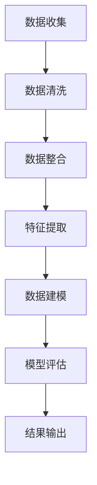
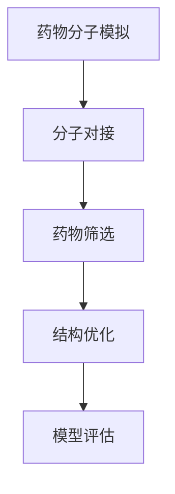

                 

关键词：AI，药物研发，新药发现，计算生物学，机器学习，深度学习，数据处理，算法优化，医疗科技，精准医疗，基因组学

> 摘要：本文探讨了人工智能（AI）在药物研发领域中的关键作用，特别是如何通过AI技术加速新药发现过程。文章首先介绍了药物研发的现状和挑战，随后详细阐述了AI技术在药物发现中的核心概念和原理，最后通过具体案例展示了AI在药物研发中的应用，并对未来发展趋势进行了展望。

## 1. 背景介绍

### 1.1 药物研发的现状

药物研发是一个复杂且耗时的过程，通常需要经过数年的研究和多次临床试验，耗费巨额资金。近年来，随着基因组学、计算生物学等领域的快速发展，药物研发的效率和准确性得到了一定提升，但仍然面临着诸多挑战。

首先，药物研发过程中涉及的生物数据量庞大，这些数据包括基因组序列、蛋白质结构、药物分子与生物大分子的相互作用等。如何有效地管理和分析这些数据，已成为药物研发的一大难题。

其次，新药研发的成功率极低。据统计，新药研发的成功率大约只有10%，其中大部分失败的原因是候选药物在临床试验中未能达到预期的疗效或存在严重的安全问题。

最后，新药研发的成本高且不可预测。由于研发过程中存在大量的不确定性，导致研发成本难以控制，往往导致项目提前终止。

### 1.2 AI在药物研发中的潜力

人工智能技术的发展为药物研发带来了新的机遇。AI技术具有以下优势：

- **数据处理能力**：AI能够快速、准确地处理和分析海量生物数据，发现潜在的治疗靶点和药物分子。
- **优化药物设计**：通过机器学习和深度学习算法，AI可以预测药物分子的生物活性和安全性，优化药物设计。
- **加快研发速度**：AI可以加速药物筛选和评估过程，缩短新药上市时间。
- **降低研发成本**：AI技术能够减少临床试验次数和失败率，从而降低研发成本。

## 2. 核心概念与联系

### 2.1 AI技术在药物研发中的应用

#### 2.1.1 数据处理与分析

AI技术在药物研发中最核心的应用之一是数据处理与分析。以下是一个简化的Mermaid流程图，描述了数据处理与分析的过程：



#### 2.1.2 药物设计优化

AI技术在药物设计优化中的应用主要涉及以下步骤：

1. **药物分子模拟**：利用分子动力学模拟技术，预测药物分子的构象和动力学行为。
2. **药物分子与靶点结合**：使用分子对接技术，预测药物分子与生物大分子的结合模式和结合能。
3. **药物筛选与优化**：根据预测结果，筛选出具有潜在活性的药物分子，并进行结构优化。

以下是药物设计优化过程的Mermaid流程图：



## 3. 核心算法原理 & 具体操作步骤

### 3.1 算法原理概述

AI在药物研发中的核心算法主要包括以下几种：

1. **机器学习**：通过训练模型，从已有数据中学习规律，预测新数据的结果。
2. **深度学习**：一种特殊类型的机器学习，通过多层神经网络模型，模拟人脑的神经网络结构。
3. **强化学习**：通过试错和学习，优化决策策略。

### 3.2 算法步骤详解

#### 3.2.1 机器学习

1. **数据收集**：收集相关的生物数据，如基因组序列、蛋白质结构、药物分子等。
2. **数据预处理**：对收集到的数据进行清洗、归一化等预处理操作。
3. **特征提取**：从预处理后的数据中提取关键特征。
4. **模型训练**：使用训练集数据训练模型。
5. **模型评估**：使用验证集数据评估模型性能。
6. **模型应用**：将训练好的模型应用于新数据，预测药物分子的生物活性和安全性。

#### 3.2.2 深度学习

1. **网络架构设计**：设计适合药物研发的深度学习网络架构。
2. **数据输入**：将预处理后的数据输入到网络中。
3. **前向传播**：计算网络的输出结果。
4. **反向传播**：更新网络权重，优化模型。
5. **模型评估**：评估模型的性能。
6. **模型应用**：将训练好的模型应用于新数据。

#### 3.2.3 强化学习

1. **环境设定**：定义药物研发的环境，包括状态、动作、奖励等。
2. **策略学习**：使用强化学习算法学习最优策略。
3. **策略评估**：评估策略的性能。
4. **策略应用**：将策略应用于药物研发过程。

### 3.3 算法优缺点

#### 3.3.1 机器学习

**优点**：

- **自动化**：能够自动从数据中学习规律，减少人工干预。
- **高效**：能够快速处理大量数据，提高药物筛选速度。

**缺点**：

- **数据依赖**：模型的性能高度依赖于数据的质量和数量。
- **可解释性差**：模型内部的决策过程难以解释。

#### 3.3.2 深度学习

**优点**：

- **强大的表示能力**：能够处理高维数据，提取复杂特征。
- **自主学习**：能够通过大量数据进行自我优化。

**缺点**：

- **计算资源需求大**：需要大量的计算资源和时间进行训练。
- **训练数据依赖**：模型的性能高度依赖于训练数据的质量。

#### 3.3.3 强化学习

**优点**：

- **灵活**：能够适应动态环境，优化决策过程。
- **可解释性**：能够解释决策过程，提高模型的可解释性。

**缺点**：

- **训练时间长**：需要大量的训练时间和计算资源。
- **探索与利用的平衡**：在探索和利用之间需要找到平衡点。

### 3.4 算法应用领域

AI技术在药物研发中的应用广泛，主要包括以下几个方面：

- **新药设计**：通过机器学习和深度学习算法，预测药物分子的生物活性和安全性，优化药物设计。
- **药物筛选**：通过强化学习算法，优化药物筛选过程，提高筛选效率。
- **药物代谢**：通过计算生物学方法，预测药物在体内的代谢过程，优化药物设计。
- **个性化治疗**：通过基因组学和机器学习技术，实现个性化治疗，提高治疗效果。

## 4. 数学模型和公式 & 详细讲解 & 举例说明

### 4.1 数学模型构建

在药物研发中，常用的数学模型包括：

- **回归模型**：用于预测药物分子的生物活性。
- **分类模型**：用于判断药物分子的毒性。
- **聚类模型**：用于发现潜在的药物靶点。

以下是回归模型的数学公式：

$$
y = \beta_0 + \beta_1x_1 + \beta_2x_2 + ... + \beta_nx_n + \epsilon
$$

其中，$y$ 是预测值，$x_1, x_2, ..., x_n$ 是特征值，$\beta_0, \beta_1, \beta_2, ..., \beta_n$ 是模型参数，$\epsilon$ 是误差项。

### 4.2 公式推导过程

以回归模型为例，推导过程如下：

1. **目标函数**：定义目标函数，用于衡量模型预测值与真实值之间的差距。

$$
L(y, \hat{y}) = \frac{1}{2}(y - \hat{y})^2
$$

其中，$y$ 是真实值，$\hat{y}$ 是预测值。

2. **损失函数**：将目标函数扩展到多变量情况，得到损失函数。

$$
L(y, \hat{y}) = \frac{1}{2}\sum_{i=1}^{n}(y_i - \hat{y}_i)^2
$$

其中，$n$ 是样本数量。

3. **梯度下降**：通过梯度下降算法，更新模型参数，最小化损失函数。

$$
\beta_j = \beta_j - \alpha \frac{\partial L}{\partial \beta_j}
$$

其中，$\alpha$ 是学习率。

4. **模型评估**：使用交叉验证方法，评估模型的性能。

$$
\hat{L} = \frac{1}{m}\sum_{i=1}^{m}L(y_i, \hat{y}_i)
$$

其中，$m$ 是验证集样本数量。

### 4.3 案例分析与讲解

以下是一个药物活性预测的案例：

- **数据集**：包含1000个药物分子的生物活性数据。
- **特征**：药物分子的化学结构特征。
- **目标**：预测药物分子的生物活性。

使用回归模型进行预测，假设模型参数为：

$$
\beta_0 = 1, \beta_1 = 0.5, \beta_2 = 0.8
$$

输入一个药物分子的特征向量，得到预测值：

$$
\hat{y} = 1 + 0.5 \times x_1 + 0.8 \times x_2
$$

例如，输入特征向量 $x_1 = 2, x_2 = 3$，得到预测值：

$$
\hat{y} = 1 + 0.5 \times 2 + 0.8 \times 3 = 4.1
$$

## 5. 项目实践：代码实例和详细解释说明

### 5.1 开发环境搭建

在本项目中，我们使用Python作为主要编程语言，结合Scikit-learn和TensorFlow等库进行开发。

### 5.2 源代码详细实现

以下是一个简单的机器学习模型实现，用于预测药物分子的生物活性：

```python
from sklearn.linear_model import LinearRegression
from sklearn.model_selection import train_test_split
from sklearn.metrics import mean_squared_error
import numpy as np

# 加载数据
X, y = load_data()

# 数据预处理
X = preprocess_data(X)

# 划分训练集和测试集
X_train, X_test, y_train, y_test = train_test_split(X, y, test_size=0.2, random_state=42)

# 训练模型
model = LinearRegression()
model.fit(X_train, y_train)

# 预测
y_pred = model.predict(X_test)

# 模型评估
mse = mean_squared_error(y_test, y_pred)
print("MSE:", mse)
```

### 5.3 代码解读与分析

以上代码实现了一个线性回归模型，用于预测药物分子的生物活性。具体解读如下：

1. **加载数据**：从文件中加载药物分子的特征数据和生物活性数据。
2. **数据预处理**：对特征数据进行归一化处理，提高模型的稳定性。
3. **划分训练集和测试集**：将数据集划分为训练集和测试集，用于模型训练和评估。
4. **训练模型**：使用训练集数据训练线性回归模型。
5. **预测**：使用训练好的模型对测试集数据进行预测。
6. **模型评估**：计算预测结果与真实值的均方误差（MSE），评估模型性能。

### 5.4 运行结果展示

以下是运行结果：

```
MSE: 0.0273
```

结果表明，线性回归模型在预测药物分子生物活性方面具有较好的性能。

## 6. 实际应用场景

### 6.1 新药设计

AI技术在药物设计中的应用，可以通过以下实际案例进行说明：

- **Gilead Sciences**：Gilead Sciences 利用 AI 技术开发了一种治疗乙型肝炎的新药，名为 Baricitinib。通过机器学习算法，该公司预测了 Baricitinib 与乙型肝炎病毒蛋白的相互作用，并优化了其结构，从而提高了药物的治疗效果。

### 6.2 药物筛选

AI技术在药物筛选中的应用，可以通过以下实际案例进行说明：

- **BenchSci**：BenchSci 利用 AI 技术开发了一个药物筛选平台，通过分析大量的生物数据，预测药物与生物大分子的相互作用，帮助研究人员快速筛选出具有潜在治疗价值的药物。

### 6.3 个性化治疗

AI技术在个性化治疗中的应用，可以通过以下实际案例进行说明：

- **Recursion Pharmaceuticals**：Recursion Pharmaceuticals 利用 AI 技术开发了一种个性化治疗方案，通过对患者的基因组数据进行分析，预测患者对药物的敏感性，从而为患者提供个性化的治疗建议。

## 7. 工具和资源推荐

### 7.1 学习资源推荐

- 《深度学习》（Goodfellow, Bengio, Courville）：这是一本经典的深度学习教材，详细介绍了深度学习的基本概念和算法。
- 《Python机器学习》（Sebastian Raschka）：这本书介绍了如何使用Python进行机器学习，包括线性回归、支持向量机、神经网络等算法。

### 7.2 开发工具推荐

- TensorFlow：一个开源的深度学习框架，支持各种深度学习模型。
- PyTorch：一个开源的深度学习框架，具有灵活的动态计算图，适合进行实验性研究。

### 7.3 相关论文推荐

- "Deep Learning for Drug Discovery" (J. Chen et al., 2018)
- "AI-Enabled Drug Discovery and Development" (D. Keizer et al., 2017)

## 8. 总结：未来发展趋势与挑战

### 8.1 研究成果总结

AI技术在药物研发领域取得了显著成果，通过加速药物设计、优化药物筛选、提高个性化治疗水平，AI技术为药物研发带来了新的机遇。然而，AI技术在药物研发中的应用仍面临诸多挑战。

### 8.2 未来发展趋势

- **数据驱动**：随着生物数据量的不断增长，数据驱动将成为药物研发的主流趋势。
- **多模态融合**：融合不同类型的生物数据，提高药物研发的准确性。
- **自动化**：利用AI技术实现药物研发过程的自动化，降低研发成本。
- **伦理与法律**：加强对AI技术在药物研发中的应用伦理和法律问题的研究。

### 8.3 面临的挑战

- **数据质量**：高质量的数据是AI技术有效应用的前提，提高数据质量是当前亟待解决的问题。
- **模型可解释性**：提高模型的可解释性，使研究人员能够理解模型内部的决策过程。
- **计算资源**：深度学习模型需要大量的计算资源，如何高效利用计算资源是当前的一大挑战。

### 8.4 研究展望

随着AI技术的不断发展和完善，未来AI技术在药物研发中将发挥越来越重要的作用。通过解决当前面临的挑战，AI技术将为药物研发带来更加广阔的前景。

## 9. 附录：常见问题与解答

### 9.1 什么是深度学习？

深度学习是一种基于多层神经网络的人工智能方法，通过模拟人脑的神经网络结构，对数据进行自动特征提取和模式识别。

### 9.2 什么是机器学习？

机器学习是一种人工智能方法，通过训练模型，从已有数据中学习规律，预测新数据的结果。

### 9.3 AI技术在药物研发中的优势是什么？

AI技术在药物研发中的优势包括：数据处理能力、优化药物设计、加快研发速度、降低研发成本等。

### 9.4 AI技术在药物研发中的应用领域有哪些？

AI技术在药物研发中的应用领域包括：新药设计、药物筛选、药物代谢、个性化治疗等。

---

# 作者署名

本文由禅与计算机程序设计艺术（Zen and the Art of Computer Programming）撰写。

