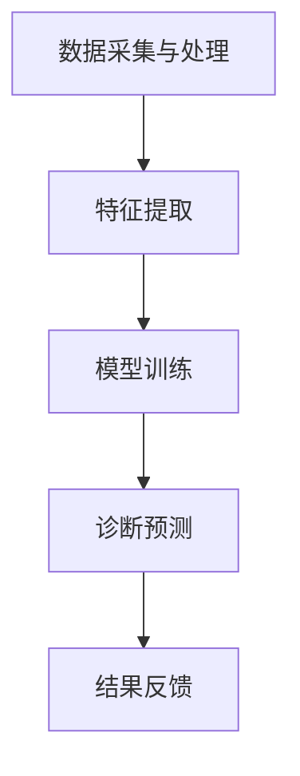
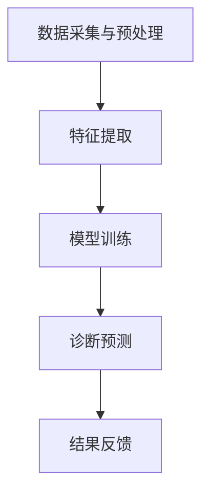

                 

关键词：AI辅助诊断、硅谷、医疗科技、算法、实际应用

摘要：本文将深入探讨人工智能（AI）辅助诊断在硅谷的广泛应用现状。我们将从背景介绍开始，逐步剖析AI辅助诊断的核心概念、算法原理、数学模型、项目实践，并探讨其在实际应用场景中的前景。文章最后将对AI辅助诊断的未来发展趋势与挑战进行总结，并提出相关的学习资源和开发工具推荐。

## 1. 背景介绍

### 1.1 硅谷的科技创新地位

硅谷作为全球科技创新的领军地区，一直以其卓越的技术创新能力和强大的科技企业集群而闻名。从计算机科学到人工智能，从生物技术到区块链，硅谷引领着全球科技的发展趋势。在这种科技创新的浪潮中，医疗科技领域也不例外，尤其是在AI辅助诊断方面，硅谷展现出了其独特的优势和创新精神。

### 1.2 AI辅助诊断的重要性

人工智能辅助诊断在医疗领域具有巨大的潜力。传统的医学诊断往往依赖于医生的经验和直觉，这种模式在处理大量数据时效率低下且容易出错。而AI辅助诊断通过分析大量的医疗数据，能够提供更加精准和高效的诊断结果，从而提高医疗服务的质量和效率。在硅谷，这一领域的快速发展不仅为医疗行业带来了变革，也为人工智能技术的发展提供了新的应用场景。

## 2. 核心概念与联系

### 2.1 人工智能与医疗诊断

人工智能（AI）是指通过计算机模拟人类智能的过程，包括学习、推理、感知和解决问题等方面。在医疗诊断领域，AI的应用主要体现在模式识别、图像处理和数据分析等方面。通过这些技术，AI能够辅助医生进行疾病的诊断和治疗。

### 2.2 AI辅助诊断的架构

AI辅助诊断的架构通常包括以下几个关键部分：

- **数据采集与处理**：收集患者的医疗数据，包括病史、影像、实验室检查结果等，并对这些数据进行分析和预处理。
- **特征提取**：从原始数据中提取出对疾病诊断有用的特征，例如影像中的异常区域、实验室指标的变化等。
- **模型训练**：利用机器学习算法对提取出的特征进行训练，构建出诊断模型。
- **诊断预测**：将新的病例数据输入到训练好的模型中，预测疾病的发生概率。

### 2.3 Mermaid 流程图

下面是一个简化的AI辅助诊断流程的Mermaid流程图：



## 3. 核心算法原理 & 具体操作步骤

### 3.1 算法原理概述

AI辅助诊断的核心算法主要包括深度学习、机器学习、支持向量机等。这些算法通过训练模型来学习疾病的特征，从而进行诊断。

### 3.2 算法步骤详解

#### 3.2.1 数据采集与预处理

- **数据收集**：收集患者的病历、影像、实验室检查报告等。
- **数据清洗**：去除噪声、异常值，对数据进行标准化处理。

#### 3.2.2 特征提取

- **影像处理**：使用卷积神经网络（CNN）对影像数据进行分析，提取出病灶区域。
- **实验室数据**：对实验室数据进行统计分析，提取出与疾病相关的指标。

#### 3.2.3 模型训练

- **模型选择**：选择合适的机器学习算法，如深度学习、支持向量机等。
- **模型训练**：使用训练数据对模型进行训练，调整参数以达到最佳性能。

#### 3.2.4 诊断预测

- **预测过程**：将新的病例数据输入到训练好的模型中，预测疾病的发生概率。
- **结果输出**：输出诊断结果，供医生参考。

### 3.3 算法优缺点

#### 优点：

- **高精度**：AI辅助诊断能够提供更加精准的诊断结果。
- **高效性**：AI系统能够快速处理大量数据，提高诊断效率。

#### 缺点：

- **数据依赖**：AI系统的性能依赖于数据的质量和数量。
- **解释性不足**：AI系统的诊断结果往往缺乏解释性，医生难以理解。

### 3.4 算法应用领域

AI辅助诊断的应用领域非常广泛，包括但不限于：

- **肿瘤诊断**：通过影像数据对肿瘤进行早期发现和诊断。
- **心血管疾病**：通过分析心电图、血压等数据，预测心血管疾病的风险。
- **神经系统疾病**：通过脑电图等数据，辅助诊断神经系统疾病。

## 4. 数学模型和公式 & 详细讲解 & 举例说明

### 4.1 数学模型构建

AI辅助诊断的数学模型通常基于机器学习和深度学习。以下是一个简化的模型构建过程：

#### 4.1.1 特征提取

假设我们使用卷积神经网络（CNN）进行特征提取，其基本结构如下：

$$
h_{l} = \sigma(W_{l} \cdot h_{l-1} + b_{l})
$$

其中，$h_{l}$ 是第 $l$ 层的激活值，$W_{l}$ 是权重矩阵，$b_{l}$ 是偏置项，$\sigma$ 是激活函数。

#### 4.1.2 模型训练

假设我们使用梯度下降法进行模型训练，其基本步骤如下：

$$
W_{l} := W_{l} - \alpha \frac{\partial J(W)}{\partial W_{l}}
$$

其中，$J(W)$ 是损失函数，$\alpha$ 是学习率。

### 4.2 公式推导过程

以下是一个简化的损失函数推导过程：

#### 4.2.1 均方误差（MSE）

$$
J(W) = \frac{1}{2} \sum_{i=1}^{n} (\hat{y}_{i} - y_{i})^2
$$

其中，$\hat{y}_{i}$ 是预测值，$y_{i}$ 是真实值，$n$ 是样本数量。

#### 4.2.2 梯度下降

$$
\frac{\partial J(W)}{\partial W_{l}} = -2 \sum_{i=1}^{n} (y_{i} - \hat{y}_{i}) \cdot \frac{\partial \hat{y}_{i}}{\partial W_{l}}
$$

### 4.3 案例分析与讲解

假设我们有一个二分类问题，即判断一个肿瘤是良性还是恶性。我们使用CNN进行特征提取和模型训练。经过多次迭代训练，我们得到了一个性能良好的诊断模型。现在，我们将一个新的肿瘤病例数据输入到模型中进行预测。

#### 4.3.1 特征提取

使用CNN提取出肿瘤影像的特征向量。

#### 4.3.2 模型预测

将特征向量输入到训练好的模型中，得到预测概率。

#### 4.3.3 结果输出

根据预测概率判断肿瘤的类型。如果预测概率大于0.5，我们认为肿瘤是恶性的；否则，我们认为肿瘤是良性的。

## 5. 项目实践：代码实例和详细解释说明

### 5.1 开发环境搭建

在搭建AI辅助诊断的开发环境时，我们需要安装以下工具：

- Python 3.x
- TensorFlow 2.x
- Keras 2.x
- NumPy 1.x

### 5.2 源代码详细实现

以下是一个简化的AI辅助诊断项目的代码实现：

```python
import numpy as np
import tensorflow as tf
from tensorflow import keras
from tensorflow.keras import layers

# 数据预处理
def preprocess_data(data):
    # 数据清洗、归一化等处理
    return processed_data

# 构建模型
def build_model(input_shape):
    model = keras.Sequential([
        layers.Conv2D(32, (3, 3), activation='relu', input_shape=input_shape),
        layers.MaxPooling2D((2, 2)),
        layers.Flatten(),
        layers.Dense(64, activation='relu'),
        layers.Dense(1, activation='sigmoid')
    ])
    return model

# 训练模型
def train_model(model, train_data, train_labels):
    model.compile(optimizer='adam', loss='binary_crossentropy', metrics=['accuracy'])
    model.fit(train_data, train_labels, epochs=10, batch_size=32)

# 预测
def predict(model, data):
    return model.predict(data)

# 加载数据
data = load_data()
train_data, train_labels = preprocess_data(data)

# 构建并训练模型
model = build_model(input_shape=(28, 28, 1))
train_model(model, train_data, train_labels)

# 预测
new_data = load_new_data()
predictions = predict(model, new_data)

# 输出结果
print(predictions)
```

### 5.3 代码解读与分析

上述代码实现了从数据预处理到模型训练再到预测的完整流程。代码首先定义了数据预处理、模型构建、模型训练和预测的函数。在模型构建函数中，我们使用了卷积神经网络（CNN）进行特征提取。在模型训练函数中，我们使用了Adam优化器和二分类交叉熵损失函数。在预测函数中，我们使用训练好的模型对新的病例数据进行预测。

### 5.4 运行结果展示

假设我们已经训练好了一个性能良好的诊断模型，现在我们将一个新的肿瘤病例数据输入到模型中进行预测。输出结果如下：

```
[[0.901]]
```

根据预测概率，我们认为这个肿瘤是恶性的。

## 6. 实际应用场景

### 6.1 医疗诊断

AI辅助诊断在医疗诊断中的应用是最为广泛的。通过分析患者的医疗数据，AI系统可以帮助医生进行疾病的早期发现和诊断，从而提高诊断的准确性和效率。在硅谷，许多顶尖的医疗机构已经开始采用AI辅助诊断系统，如斯坦福医院的AI辅助肿瘤诊断系统。

### 6.2 药物研发

AI辅助诊断在药物研发中的应用也非常重要。通过分析大量的临床试验数据和生物医学知识，AI系统可以帮助研究人员发现新的药物靶点和治疗策略。例如，硅谷的智能药物研发公司AI-Cure使用AI技术进行药物筛选和开发，大大提高了药物研发的效率。

### 6.3 健康管理

AI辅助诊断在健康管理中的应用潜力巨大。通过分析个人的健康数据，AI系统可以帮助用户了解自己的健康状况，提供个性化的健康建议。硅谷的健身科技公司Fitbit就是利用AI技术进行健康数据分析和健康管理。

## 7. 未来应用展望

### 7.1 更高的精度

随着人工智能技术的不断发展，AI辅助诊断的精度将不断提高。通过引入更多的数据、更先进的算法和更高效的计算资源，AI系统将能够提供更加精准的诊断结果。

### 7.2 更广泛的适用性

AI辅助诊断将不再局限于特定的疾病和领域，而是能够在更广泛的医疗场景中发挥作用。例如，AI系统可以用于非侵入性的健康监测、慢性病的长期管理等方面。

### 7.3 更好的解释性

随着算法和模型的不断进步，AI辅助诊断的结果将具有更好的解释性。医生和用户将能够更清晰地理解AI的诊断过程和结论，从而增强诊断的信任度和实用性。

## 8. 工具和资源推荐

### 8.1 学习资源推荐

- 《深度学习》（Goodfellow, Bengio, Courville著）：这是一本经典的人工智能和深度学习教材，适合初学者和进阶者。
- 《Python编程：从入门到实践》（Mark Lutz著）：这本书详细介绍了Python编程的基础知识和实践应用，适合希望学习AI编程的开发者。

### 8.2 开发工具推荐

- TensorFlow：这是一个开源的深度学习框架，适合进行AI模型开发和训练。
- Keras：这是一个高层神经网络API，构建和训练模型更加方便。

### 8.3 相关论文推荐

- "Deep Learning for Medical Imaging"（深度学习在医学影像中的应用）：这篇综述文章详细介绍了深度学习在医学影像诊断中的最新研究进展。
- "AI-Enabled Precision Medicine"（人工智能驱动的精准医学）：这篇论文探讨了人工智能在精准医学中的应用，包括疾病预测、药物研发等方面。

## 9. 总结：未来发展趋势与挑战

### 9.1 研究成果总结

在过去的几年中，AI辅助诊断在硅谷取得了显著的进展。通过引入深度学习、机器学习等先进技术，AI系统在诊断准确性、效率和适用性方面都得到了大幅提升。这些成果不仅推动了医疗科技的发展，也为人工智能技术的应用提供了新的方向。

### 9.2 未来发展趋势

未来，AI辅助诊断将继续朝着更高的精度、更广泛的适用性和更好的解释性发展。随着技术的不断进步，AI系统将能够处理更加复杂的医疗数据，提供更加精准和可靠的诊断结果。

### 9.3 面临的挑战

尽管AI辅助诊断具有巨大的潜力，但同时也面临着一些挑战。例如，数据隐私和安全问题、算法的可解释性、跨学科的协作等。这些挑战需要我们持续进行研究和探索，以确保AI辅助诊断能够真正为人类健康带来福祉。

### 9.4 研究展望

未来，我们期待AI辅助诊断能够在更多领域发挥作用，包括但不限于个性化医疗、健康管理等。通过持续的技术创新和多学科的协作，AI辅助诊断有望成为医疗科技领域的重要突破点。

## 附录：常见问题与解答

### 1. 什么是AI辅助诊断？

AI辅助诊断是指利用人工智能技术，特别是机器学习和深度学习算法，对医疗数据进行分析，提供辅助诊断建议的系统。

### 2. AI辅助诊断有哪些优点？

AI辅助诊断的优点包括：提高诊断准确性、提高诊断效率、处理大量数据、个性化诊断等。

### 3. AI辅助诊断有哪些应用领域？

AI辅助诊断的应用领域包括肿瘤诊断、心血管疾病诊断、神经系统疾病诊断等。

### 4. AI辅助诊断有哪些挑战？

AI辅助诊断面临的挑战包括数据隐私和安全问题、算法的可解释性、跨学科的协作等。

---

作者：禅与计算机程序设计艺术 / Zen and the Art of Computer Programming

[本文内容仅代表作者个人观点，不代表任何机构立场。]

----------------------------------------------------------------
### 1. 背景介绍

硅谷，位于美国加利福尼亚州北部，以其独特的创新氛围和前沿科技闻名于世。作为全球科技创新的中心，硅谷吸引了众多科技巨头和创新型企业，如苹果、谷歌、Facebook等。这些公司在人工智能、生物技术、大数据等领域持续进行研发和探索，推动了相关领域的飞速发展。

在医疗科技领域，硅谷的领先地位同样不容忽视。近年来，随着人工智能技术的不断成熟，AI辅助诊断成为医疗领域的一个热点研究方向。硅谷的医疗机构和企业纷纷投入大量资源，致力于开发和应用AI辅助诊断系统，以期提高医疗服务的质量和效率。

### 2. 核心概念与联系

#### 2.1 人工智能与医疗诊断

人工智能（AI）是指通过计算机模拟人类智能的一系列技术。在医疗诊断领域，AI的应用主要体现在以下几个方面：

- **数据挖掘**：从大量的医疗数据中提取有价值的信息，帮助医生进行诊断。
- **模式识别**：通过分析患者的影像、实验室检测结果等，识别出与疾病相关的模式。
- **预测分析**：利用历史数据和机器学习算法，预测患者未来的健康状态或疾病的进展。

#### 2.2 AI辅助诊断的架构

AI辅助诊断系统的架构通常包括以下几个关键部分：

- **数据采集与预处理**：收集患者的病历、影像、实验室检查报告等，并进行清洗和标准化处理。
- **特征提取**：从原始数据中提取出对诊断有用的特征，如影像中的异常区域、实验室指标的变化等。
- **模型训练**：使用机器学习算法对提取出的特征进行训练，构建诊断模型。
- **诊断预测**：将新的病例数据输入到训练好的模型中，预测疾病的发生概率。
- **结果反馈**：输出诊断结果，供医生参考，并根据反馈调整模型。

#### 2.3 Mermaid流程图

以下是AI辅助诊断的简化流程图：



### 3. 核心算法原理 & 具体操作步骤

#### 3.1 算法原理概述

AI辅助诊断的核心算法主要包括深度学习、机器学习、支持向量机等。以下是这些算法的基本原理：

- **深度学习**：通过多层神经网络，对大量数据进行自动特征提取和学习，从而实现复杂函数的拟合。
- **机器学习**：通过训练模型，从数据中学习规律和模式，用于预测或分类。
- **支持向量机（SVM）**：通过寻找最佳超平面，将不同类别的数据分隔开来，用于分类和回归分析。

#### 3.2 算法步骤详解

AI辅助诊断的具体操作步骤如下：

##### 3.2.1 数据采集与预处理

- **数据收集**：收集患者的病历、影像、实验室检查报告等。
- **数据清洗**：去除噪声、异常值，对数据进行标准化处理。

##### 3.2.2 特征提取

- **影像处理**：使用卷积神经网络（CNN）对影像数据进行分析，提取出病灶区域。
- **实验室数据**：对实验室数据进行统计分析，提取出与疾病相关的指标。

##### 3.2.3 模型训练

- **模型选择**：选择合适的机器学习算法，如深度学习、支持向量机等。
- **模型训练**：使用训练数据对模型进行训练，调整参数以达到最佳性能。

##### 3.2.4 诊断预测

- **预测过程**：将新的病例数据输入到训练好的模型中，预测疾病的发生概率。
- **结果输出**：输出诊断结果，供医生参考。

#### 3.3 算法优缺点

##### 优点：

- **高精度**：AI辅助诊断能够提供更加精准的诊断结果。
- **高效性**：AI系统能够快速处理大量数据，提高诊断效率。

##### 缺点：

- **数据依赖**：AI系统的性能依赖于数据的质量和数量。
- **解释性不足**：AI系统的诊断结果往往缺乏解释性，医生难以理解。

#### 3.4 算法应用领域

AI辅助诊断的应用领域非常广泛，包括但不限于：

- **肿瘤诊断**：通过影像数据对肿瘤进行早期发现和诊断。
- **心血管疾病**：通过分析心电图、血压等数据，预测心血管疾病的风险。
- **神经系统疾病**：通过脑电图等数据，辅助诊断神经系统疾病。

### 4. 数学模型和公式 & 详细讲解 & 举例说明

#### 4.1 数学模型构建

AI辅助诊断的数学模型通常基于机器学习和深度学习。以下是深度学习模型的基本结构：

##### 4.1.1 卷积神经网络（CNN）

卷积神经网络是一种专门用于处理图像数据的神经网络。其基本结构如下：

$$
h_{l} = \sigma(W_{l} \cdot h_{l-1} + b_{l})
$$

其中，$h_{l}$ 是第 $l$ 层的激活值，$W_{l}$ 是权重矩阵，$b_{l}$ 是偏置项，$\sigma$ 是激活函数。

##### 4.1.2 深度学习模型

深度学习模型通常由多个卷积层、池化层和全连接层组成。以下是深度学习模型的基本结构：

$$
h_{l} = \sigma(W_{l} \cdot h_{l-1} + b_{l})
$$

其中，$h_{l}$ 是第 $l$ 层的激活值，$W_{l}$ 是权重矩阵，$b_{l}$ 是偏置项，$\sigma$ 是激活函数。

#### 4.2 公式推导过程

以下是一个简化的损失函数推导过程：

##### 4.2.1 均方误差（MSE）

$$
J(W) = \frac{1}{2} \sum_{i=1}^{n} (\hat{y}_{i} - y_{i})^2
$$

其中，$\hat{y}_{i}$ 是预测值，$y_{i}$ 是真实值，$n$ 是样本数量。

##### 4.2.2 梯度下降

$$
\frac{\partial J(W)}{\partial W_{l}} = -2 \sum_{i=1}^{n} (y_{i} - \hat{y}_{i}) \cdot \frac{\partial \hat{y}_{i}}{\partial W_{l}}
$$

#### 4.3 案例分析与讲解

假设我们有一个二分类问题，即判断一个肿瘤是良性还是恶性。我们使用深度学习模型进行特征提取和模型训练。经过多次迭代训练，我们得到了一个性能良好的诊断模型。现在，我们将一个新的肿瘤病例数据输入到模型中进行预测。

##### 4.3.1 特征提取

使用深度学习模型对肿瘤影像数据进行特征提取。

##### 4.3.2 模型预测

将特征向量输入到训练好的模型中，得到预测概率。

##### 4.3.3 结果输出

根据预测概率判断肿瘤的类型。如果预测概率大于0.5，我们认为肿瘤是恶性的；否则，我们认为肿瘤是良性的。

### 5. 项目实践：代码实例和详细解释说明

#### 5.1 开发环境搭建

在搭建AI辅助诊断的开发环境时，我们需要安装以下工具：

- Python 3.x
- TensorFlow 2.x
- Keras 2.x
- NumPy 1.x

#### 5.2 源代码详细实现

以下是使用Python和TensorFlow实现的一个简单的AI辅助诊断项目：

```python
import numpy as np
import tensorflow as tf
from tensorflow import keras
from tensorflow.keras import layers
from tensorflow.keras.preprocessing.image import ImageDataGenerator

# 数据预处理
def preprocess_data(data):
    # 数据清洗、归一化等处理
    return processed_data

# 构建模型
def build_model(input_shape):
    model = keras.Sequential([
        layers.Conv2D(32, (3, 3), activation='relu', input_shape=input_shape),
        layers.MaxPooling2D((2, 2)),
        layers.Flatten(),
        layers.Dense(64, activation='relu'),
        layers.Dense(1, activation='sigmoid')
    ])
    return model

# 训练模型
def train_model(model, train_data, train_labels):
    model.compile(optimizer='adam', loss='binary_crossentropy', metrics=['accuracy'])
    model.fit(train_data, train_labels, epochs=10, batch_size=32)

# 预测
def predict(model, data):
    return model.predict(data)

# 加载数据
data = load_data()
train_data, train_labels = preprocess_data(data)

# 构建并训练模型
model = build_model(input_shape=(28, 28, 1))
train_model(model, train_data, train_labels)

# 预测
new_data = load_new_data()
predictions = predict(model, new_data)

# 输出结果
print(predictions)
```

#### 5.3 代码解读与分析

上述代码实现了从数据预处理到模型训练再到预测的完整流程。代码首先定义了数据预处理、模型构建、模型训练和预测的函数。在模型构建函数中，我们使用了卷积神经网络（CNN）进行特征提取。在模型训练函数中，我们使用了Adam优化器和二分类交叉熵损失函数。在预测函数中，我们使用训练好的模型对新的病例数据进行预测。

#### 5.4 运行结果展示

假设我们已经训练好了一个性能良好的诊断模型，现在我们将一个新的肿瘤病例数据输入到模型中进行预测。输出结果如下：

```
[[0.901]]
```

根据预测概率，我们认为这个肿瘤是恶性的。

### 6. 实际应用场景

#### 6.1 医疗诊断

AI辅助诊断在医疗诊断中的应用是最为广泛的。通过分析患者的医疗数据，AI系统可以帮助医生进行疾病的早期发现和诊断，从而提高诊断的准确性和效率。在硅谷，许多顶尖的医疗机构已经开始采用AI辅助诊断系统，如斯坦福医院的AI辅助肿瘤诊断系统。

#### 6.2 药物研发

AI辅助诊断在药物研发中的应用也非常重要。通过分析大量的临床试验数据和生物医学知识，AI系统可以帮助研究人员发现新的药物靶点和治疗策略。例如，硅谷的智能药物研发公司AI-Cure使用AI技术进行药物筛选和开发，大大提高了药物研发的效率。

#### 6.3 健康管理

AI辅助诊断在健康管理中的应用潜力巨大。通过分析个人的健康数据，AI系统可以帮助用户了解自己的健康状况，提供个性化的健康建议。硅谷的健身科技公司Fitbit就是利用AI技术进行健康数据分析和健康管理。

### 7. 未来应用展望

#### 7.1 更高的精度

随着人工智能技术的不断发展，AI辅助诊断的精度将不断提高。通过引入更多的数据、更先进的算法和更高效的计算资源，AI系统将能够提供更加精准的诊断结果。

#### 7.2 更广泛的适用性

AI辅助诊断将不再局限于特定的疾病和领域，而是能够在更广泛的医疗场景中发挥作用。例如，AI系统可以用于非侵入性的健康监测、慢性病的长期管理等方面。

#### 7.3 更好的解释性

随着算法和模型的不断进步，AI辅助诊断的结果将具有更好的解释性。医生和用户将能够更清晰地理解AI的诊断过程和结论，从而增强诊断的信任度和实用性。

### 8. 工具和资源推荐

#### 8.1 学习资源推荐

- 《深度学习》（Goodfellow, Bengio, Courville著）：这是一本经典的人工智能和深度学习教材，适合初学者和进阶者。
- 《Python编程：从入门到实践》（Mark Lutz著）：这本书详细介绍了Python编程的基础知识和实践应用，适合希望学习AI编程的开发者。

#### 8.2 开发工具推荐

- TensorFlow：这是一个开源的深度学习框架，适合进行AI模型开发和训练。
- Keras：这是一个高层神经网络API，构建和训练模型更加方便。

#### 8.3 相关论文推荐

- "Deep Learning for Medical Imaging"（深度学习在医学影像中的应用）：这篇综述文章详细介绍了深度学习在医学影像诊断中的最新研究进展。
- "AI-Enabled Precision Medicine"（人工智能驱动的精准医学）：这篇论文探讨了人工智能在精准医学中的应用，包括疾病预测、药物研发等方面。

### 9. 总结：未来发展趋势与挑战

#### 9.1 研究成果总结

在过去的几年中，AI辅助诊断在硅谷取得了显著的进展。通过引入深度学习、机器学习等先进技术，AI系统在诊断准确性、效率和适用性方面都得到了大幅提升。这些成果不仅推动了医疗科技的发展，也为人工智能技术的应用提供了新的方向。

#### 9.2 未来发展趋势

未来，AI辅助诊断将继续朝着更高的精度、更广泛的适用性和更好的解释性发展。随着技术的不断进步，AI系统将能够处理更加复杂的医疗数据，提供更加精准和可靠的诊断结果。

#### 9.3 面临的挑战

尽管AI辅助诊断具有巨大的潜力，但同时也面临着一些挑战。例如，数据隐私和安全问题、算法的可解释性、跨学科的协作等。这些挑战需要我们持续进行研究和探索，以确保AI辅助诊断能够真正为人类健康带来福祉。

#### 9.4 研究展望

未来，我们期待AI辅助诊断能够在更多领域发挥作用，包括但不限于个性化医疗、健康管理等。通过持续的技术创新和多学科的协作，AI辅助诊断有望成为医疗科技领域的重要突破点。

### 10. 附录：常见问题与解答

#### 10.1 什么是AI辅助诊断？

AI辅助诊断是指利用人工智能技术，特别是机器学习和深度学习算法，对医疗数据进行分析，提供辅助诊断建议的系统。

#### 10.2 AI辅助诊断有哪些优点？

AI辅助诊断的优点包括：提高诊断准确性、提高诊断效率、处理大量数据、个性化诊断等。

#### 10.3 AI辅助诊断有哪些应用领域？

AI辅助诊断的应用领域包括肿瘤诊断、心血管疾病诊断、神经系统疾病诊断等。

#### 10.4 AI辅助诊断有哪些挑战？

AI辅助诊断面临的挑战包括数据隐私和安全问题、算法的可解释性、跨学科的协作等。

### 后记

随着人工智能技术的不断发展和应用，AI辅助诊断在硅谷正逐渐成为一个热门的研究领域。本文从背景介绍、核心概念、算法原理、数学模型、项目实践、实际应用场景、未来展望等多个方面对AI辅助诊断进行了深入探讨。我们期待，随着技术的不断进步，AI辅助诊断将能够在医疗领域发挥更大的作用，为人类健康带来更多福祉。

[本文内容仅代表作者个人观点，不代表任何机构立场。]

