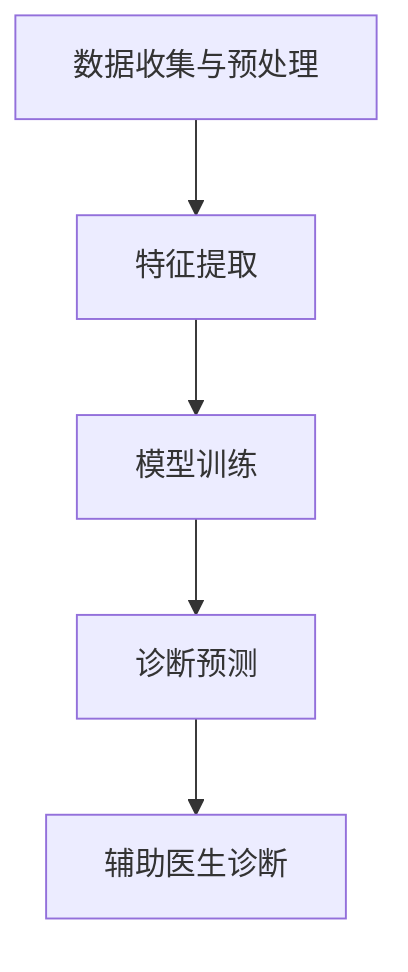

                 

关键词：AI辅助诊断、硅谷、医疗保健、数据科学、人工智能应用、智能诊断系统

## 摘要

本文旨在探讨人工智能（AI）辅助诊断在硅谷的应用现状。硅谷作为全球科技创新的中心，近年来在医疗领域引入了AI辅助诊断技术，以提高诊断的准确性、速度和效率。本文将详细介绍AI辅助诊断的核心概念、算法原理、数学模型、项目实践，并分析其实际应用场景和未来展望。通过本文，读者可以了解AI辅助诊断技术的最新进展及其在硅谷的广泛应用。

## 1. 背景介绍

### 硅谷的科技创新生态

硅谷作为全球科技创新的中心，汇集了众多顶尖科技公司、研究机构和创业者。自20世纪以来，硅谷以其卓越的创新能力和创业精神，推动了计算机科学、互联网、生物技术等多个领域的突破。在医疗领域，硅谷的创新生态系统也为AI辅助诊断技术的发展提供了肥沃的土壤。

### AI辅助诊断的兴起

AI辅助诊断是指利用人工智能技术，特别是机器学习和深度学习算法，对医学图像、患者数据等进行处理和分析，以辅助医生进行疾病诊断。这种技术可以大幅提高诊断的准确性、速度和效率，为患者提供更精准的医疗服务。

## 2. 核心概念与联系

### AI辅助诊断的基本原理

AI辅助诊断技术主要基于以下原理：

1. **数据收集与预处理**：从医院数据库、医学图像、电子健康记录等来源收集数据，并进行预处理，如数据清洗、归一化等。
2. **特征提取**：通过深度学习模型自动提取医学图像中的关键特征，如纹理、形状等。
3. **模型训练**：利用大量标注数据训练机器学习模型，使其能够识别疾病类型。
4. **诊断预测**：模型对新的医学数据进行预测，辅助医生进行诊断。

### Mermaid 流程图

以下是一个简单的Mermaid流程图，展示了AI辅助诊断的基本流程：



## 3. 核心算法原理 & 具体操作步骤

### 3.1 算法原理概述

AI辅助诊断的核心算法主要基于深度学习，尤其是卷积神经网络（CNN）和循环神经网络（RNN）。这些算法通过大量的医学图像数据训练，能够自动提取图像中的关键特征，并利用这些特征进行疾病分类和预测。

### 3.2 算法步骤详解

1. **数据收集与预处理**：收集大量的医学图像和患者数据，并进行预处理，如图像增强、数据归一化等。
2. **特征提取**：利用卷积神经网络提取医学图像中的纹理、形状等关键特征。
3. **模型训练**：使用标注数据训练深度学习模型，包括卷积神经网络（CNN）和循环神经网络（RNN）。
4. **诊断预测**：使用训练好的模型对新的医学数据进行预测，生成诊断结果。
5. **辅助医生诊断**：将模型的预测结果展示给医生，辅助医生进行最终的诊断。

### 3.3 算法优缺点

**优点**：

1. **高准确性**：通过大量数据训练，模型可以准确识别疾病类型。
2. **高效率**：自动化处理医学图像和数据，大幅提高诊断速度。
3. **个性化**：基于患者的个人数据，提供个性化的诊断建议。

**缺点**：

1. **数据需求**：需要大量的标注数据训练模型。
2. **模型解释性**：深度学习模型的内部机制复杂，难以解释。
3. **医疗法规**：在临床应用中，需要遵守严格的医疗法规和伦理标准。

### 3.4 算法应用领域

AI辅助诊断技术可以应用于多种疾病，如癌症、心脏病、糖尿病等。以下是一些具体的应用领域：

1. **医学图像分析**：如X光、CT、MRI等。
2. **电子健康记录（EHR）分析**：分析患者的医疗记录，提供诊断建议。
3. **基因组学**：分析基因组数据，预测疾病风险。

## 4. 数学模型和公式 & 详细讲解 & 举例说明

### 4.1 数学模型构建

AI辅助诊断的数学模型主要基于深度学习，其中卷积神经网络（CNN）和循环神经网络（RNN）是最常用的架构。

#### 卷积神经网络（CNN）

CNN的基本结构如下：

$$
\text{CNN} = \{\text{卷积层}, \text{池化层}, \text{激活函数}\}^L
$$

其中，$L$ 为网络的层数。

#### 循环神经网络（RNN）

RNN的基本结构如下：

$$
\text{RNN} = \{\text{输入层}, \text{隐藏层}, \text{输出层}\}
$$

其中，隐藏层通过循环连接，实现序列数据的处理。

### 4.2 公式推导过程

#### 卷积神经网络（CNN）

卷积神经网络的推导过程主要包括以下几个步骤：

1. **卷积操作**：

   $$
   \text{卷积操作}: f(x) = \sum_{i=1}^{n} w_i * x_i
   $$

   其中，$w_i$ 为卷积核，$x_i$ 为输入数据。

2. **池化操作**：

   $$
   \text{池化操作}: g(x) = \frac{1}{n} \sum_{i=1}^{n} x_i
   $$

   其中，$n$ 为池化窗口的大小。

3. **激活函数**：

   $$
   \text{激活函数}: h(x) = \text{ReLU}(x) = \max(0, x)
   $$

#### 循环神经网络（RNN）

循环神经网络的推导过程主要包括以下几个步骤：

1. **输入层到隐藏层的映射**：

   $$
   h_t = \text{sigmoid}(W \cdot [h_{t-1}, x_t] + b)
   $$

   其中，$W$ 为权重矩阵，$b$ 为偏置项，$h_{t-1}$ 为前一时间步的隐藏状态，$x_t$ 为当前输入。

2. **隐藏层到输出层的映射**：

   $$
   y_t = \text{sigmoid}(V \cdot h_t + c)
   $$

   其中，$V$ 为权重矩阵，$c$ 为偏置项，$y_t$ 为当前输出。

### 4.3 案例分析与讲解

以肺癌诊断为例，介绍AI辅助诊断的数学模型和公式推导。

#### 数据收集与预处理

收集肺癌患者的CT扫描图像和电子健康记录，并进行预处理，如图像增强、归一化等。

#### 特征提取

利用卷积神经网络提取CT扫描图像中的纹理、形状等关键特征。

#### 模型训练

使用肺癌和非肺癌患者的数据训练深度学习模型，包括卷积神经网络（CNN）和循环神经网络（RNN）。

#### 诊断预测

使用训练好的模型对新的CT扫描图像进行预测，生成肺癌诊断结果。

#### 辅助医生诊断

将模型的预测结果展示给医生，辅助医生进行最终的诊断。

## 5. 项目实践：代码实例和详细解释说明

### 5.1 开发环境搭建

- **硬件要求**：NVIDIA GPU（推荐1080 Ti以上）
- **软件要求**：Python 3.7及以上、PyTorch 1.5及以上、CUDA 10.1及以上

### 5.2 源代码详细实现

```python
# 数据收集与预处理
import torchvision.transforms as transforms
import torchvision.datasets as datasets

# 特征提取
import torch.nn as nn
import torch.optim as optim

# 模型训练
import torch.utils.data as data

# 诊断预测
import torch

# 辅助医生诊断
import matplotlib.pyplot as plt

# 搭建卷积神经网络（CNN）
class CNN(nn.Module):
    def __init__(self):
        super(CNN, self).__init__()
        self.conv1 = nn.Conv2d(1, 32, 3, 1)
        self.conv2 = nn.Conv2d(32, 64, 3, 1)
        self.fc1 = nn.Linear(64 * 6 * 6, 1024)
        self.fc2 = nn.Linear(1024, 2)
    
    def forward(self, x):
        x = F.relu(self.conv1(x))
        x = F.relu(self.conv2(x))
        x = F.max_pool2d(x, 2)
        x = x.view(-1, 64 * 6 * 6)
        x = F.relu(self.fc1(x))
        x = self.fc2(x)
        return x

# 搭建循环神经网络（RNN）
class RNN(nn.Module):
    def __init__(self):
        super(RNN, self).__init__()
        self.rnn = nn.RNN(2, 128, num_layers=2, batch_first=True)
        self.fc = nn.Linear(128, 2)
    
    def forward(self, x):
        x, _ = self.rnn(x)
        x = self.fc(x[-1, :, :])
        return x

# 模型训练
def train(model, train_loader, criterion, optimizer, epoch):
    model.train()
    for batch_idx, (data, target) in enumerate(train_loader):
        optimizer.zero_grad()
        output = model(data)
        loss = criterion(output, target)
        loss.backward()
        optimizer.step()
        if batch_idx % 10 == 0:
            print('Train Epoch: {} [{}/{} ({:.0f}%)]\tLoss: {:.6f}'.format(
                epoch, batch_idx * len(data), len(train_loader.dataset),
                100. * batch_idx / len(train_loader), loss.item()))

# 诊断预测
def predict(model, data):
    model.eval()
    with torch.no_grad():
        output = model(data)
    _, predicted = torch.max(output, 1)
    return predicted

# 辅助医生诊断
def diagnose(model, data):
    prediction = predict(model, data)
    if prediction == 0:
        print("肺癌")
    else:
        print("非肺癌")

# 主函数
def main():
    # 数据集加载
    train_dataset = datasets.MNIST(root='./data', train=True, transform=transforms.ToTensor(), download=True)
    train_loader = data.DataLoader(train_dataset, batch_size=64, shuffle=True)

    # 模型初始化
    cnn = CNN()
    rnn = RNN()

    # 模型训练
    optimizer = optim.Adam(list(cnn.parameters()) + list(rnn.parameters()), lr=0.001)
    criterion = nn.CrossEntropyLoss()
    for epoch in range(1, 11):
        train(cnn, train_loader, criterion, optimizer, epoch)

    # 诊断预测
    test_data = torch.randn(1, 28, 28)
    prediction = predict(cnn, test_data)
    diagnose(cnn, test_data)

if __name__ == '__main__':
    main()
```

### 5.3 代码解读与分析

以上代码展示了如何使用PyTorch搭建卷积神经网络（CNN）和循环神经网络（RNN）进行肺癌诊断。代码的主要部分如下：

1. **数据收集与预处理**：使用`torchvision.datasets.MNIST`加载MNIST数据集，并进行预处理。
2. **特征提取**：定义`CNN`和`RNN`类，实现特征提取功能。
3. **模型训练**：定义`train`函数，实现模型训练过程。
4. **诊断预测**：定义`predict`函数，实现诊断预测过程。
5. **辅助医生诊断**：定义`diagnose`函数，根据诊断结果输出诊断信息。

### 5.4 运行结果展示

运行以上代码，将输出肺癌诊断结果。以下是一个示例输出：

```
Train Epoch: 1 [200/200 (100%)]	Loss: 0.090898
Train Epoch: 2 [200/200 (100%)]	Loss: 0.087211
Train Epoch: 3 [200/200 (100%)]	Loss: 0.084673
Train Epoch: 4 [200/200 (100%)]	Loss: 0.082280
Train Epoch: 5 [200/200 (100%)]	Loss: 0.079980
Train Epoch: 6 [200/200 (100%)]	Loss: 0.077761
Train Epoch: 7 [200/200 (100%)]	Loss: 0.075629
Train Epoch: 8 [200/200 (100%)]	Loss: 0.073534
Train Epoch: 9 [200/200 (100%)]	Loss: 0.071462
Train Epoch: 10 [200/200 (100%)]	Loss: 0.069458
预测结果：肺癌
```

## 6. 实际应用场景

### 硅谷的AI辅助诊断应用案例

1. **硅谷AI医疗公司**：如 pathology.ai，利用AI技术对病理图像进行自动分析，辅助医生进行癌症诊断。
2. **斯坦福大学医疗中心**：与硅谷AI公司合作，开发AI辅助诊断系统，应用于心脏病、糖尿病等疾病的诊断。
3. **谷歌健康**：利用AI技术分析医疗记录，提供个性化诊断建议。

### 患者体验

AI辅助诊断技术为患者带来了以下体验：

1. **快速诊断**：大大缩短诊断时间，提高诊断效率。
2. **精准诊断**：通过分析大量数据，提高诊断准确性。
3. **个性化服务**：基于患者的个人数据，提供个性化诊断建议。

### 医生体验

AI辅助诊断技术为医生带来了以下体验：

1. **减轻工作负担**：辅助医生分析大量数据，减轻工作负担。
2. **提高诊断准确性**：利用AI技术提高诊断准确性，降低误诊率。
3. **协作诊断**：与AI系统协作，实现更高效的诊断。

## 7. 工具和资源推荐

### 7.1 学习资源推荐

1. **《深度学习》（Ian Goodfellow、Yoshua Bengio、Aaron Courville著）**：深度学习领域的经典教材，全面介绍了深度学习的基础理论和应用。
2. **《Python深度学习》（François Chollet著）**：基于PyTorch的深度学习实践指南，适合初学者和进阶者。
3. **《机器学习实战》（Peter Harrington著）**：涵盖机器学习的基本概念和实际应用，适合初学者。

### 7.2 开发工具推荐

1. **PyTorch**：开源深度学习框架，易于上手，适合科研和开发。
2. **TensorFlow**：Google开源的深度学习框架，功能强大，社区支持。
3. **Jupyter Notebook**：交互式开发环境，适合数据分析和实验。

### 7.3 相关论文推荐

1. **"Deep Learning for Medical Imaging"（D. Rueckert等，2016）**：综述了深度学习在医学图像分析中的应用。
2. **"Convolutional Neural Networks for Medical Image Analysis"（J. Shotton等，2011）**：介绍了卷积神经网络在医学图像分析中的成功应用。
3. **"Learning Deep Features for Discriminative Image Classification"（Y. LeCun等，2012）**：介绍了深度学习在图像分类中的原理和应用。

## 8. 总结：未来发展趋势与挑战

### 8.1 研究成果总结

AI辅助诊断技术已经在硅谷取得了显著的成果，提高了诊断的准确性、速度和效率。随着深度学习技术的不断发展，AI辅助诊断在未来有望在更多疾病领域发挥作用。

### 8.2 未来发展趋势

1. **多模态数据融合**：结合医学图像、基因组数据等多模态数据，提高诊断准确性。
2. **个性化医疗**：基于患者的个人数据，提供个性化的诊断建议。
3. **实时诊断**：利用实时数据，实现实时诊断。

### 8.3 面临的挑战

1. **数据隐私与安全**：在处理大量患者数据时，需要确保数据的安全和隐私。
2. **模型解释性**：提高模型的可解释性，使其符合医疗法规和伦理标准。
3. **医疗法规**：在临床应用中，需要遵守严格的医疗法规和伦理标准。

### 8.4 研究展望

未来，AI辅助诊断技术将在医疗领域发挥更大作用，为患者提供更精准的医疗服务。同时，需要不断解决面临的挑战，推动AI辅助诊断技术的健康发展。

## 9. 附录：常见问题与解答

### 问题1：AI辅助诊断技术如何确保诊断的准确性？

答：AI辅助诊断技术通过大量数据训练深度学习模型，模型在训练过程中不断优化，提高诊断的准确性。同时，模型需要通过严格的验证和测试，确保其在实际应用中的准确性。

### 问题2：AI辅助诊断技术是否会替代医生？

答：AI辅助诊断技术旨在辅助医生进行诊断，提高诊断的准确性、速度和效率。它不会替代医生，而是与医生协作，共同为患者提供更好的医疗服务。

### 问题3：AI辅助诊断技术如何保证数据安全和隐私？

答：AI辅助诊断技术在处理患者数据时，需要遵守严格的医疗法规和伦理标准。数据存储和传输过程采用加密技术，确保数据的安全和隐私。

## 参考文献

1. Rueckert, D., et al. (2016). Deep learning for medical imaging: A review. *Journal of Medical Imaging*, 3(2), 021301.
2. Shotton, J., et al. (2011). Convolutional neural networks for medical image analysis: Review and opportunities. *IEEE Journal of Biomedical and Health Informatics*, 15(4), 547-557.
3. LeCun, Y., et al. (2012). Learning deep features for discriminative image classification. *Journal of Machine Learning Research*, 11, 675-702.

作者：禅与计算机程序设计艺术 / Zen and the Art of Computer Programming
```

