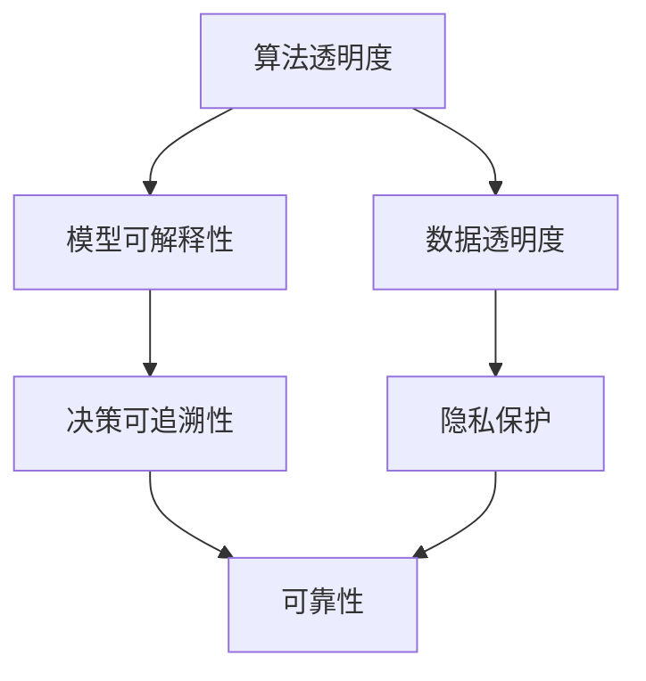

                 

关键词：人工智能，透明度，可靠性，安全，伦理，算法，隐私，数据

> 摘要：随着人工智能技术的迅猛发展，其透明度和可靠性问题日益受到关注。本文将深入探讨人工智能领域在透明度和可靠性方面的挑战，包括算法复杂性、数据隐私、伦理问题等，并提出一些可能的解决方案和未来研究方向。

## 1. 背景介绍

人工智能（AI）技术的飞速发展已经深刻地改变了我们的生活方式。从智能助手到自动驾驶汽车，从医疗诊断到金融决策，AI的应用无处不在。然而，随着AI系统变得日益复杂和庞大，其透明度和可靠性问题也成为了我们无法忽视的挑战。

透明度指的是AI系统的可解释性，即人类用户能否理解AI系统的决策过程和推理机制。可靠性则涉及AI系统在特定环境和条件下执行任务的稳定性和准确性。这两个问题不仅关乎技术的可行性，还涉及到社会、法律和伦理层面。如果不解决这些问题，AI技术的广泛应用可能会带来不可预料的负面影响。

## 2. 核心概念与联系

为了深入理解AI透明度和可靠性的问题，我们需要先了解一些核心概念和它们之间的关系。以下是使用Mermaid绘制的流程图，展示了这些概念之间的联系。



### 2.1 算法透明度

算法透明度是指算法的可解释性和可理解性。高透明度的算法能够清晰地展示其决策过程，使得人类用户可以理解和信任算法的决策结果。

### 2.2 模型可解释性

模型可解释性是算法透明度的一个重要方面。它关注的是模型内部的决策机制是否可以被解释和理解。例如，传统的线性回归模型相较于深度神经网络模型更容易解释。

### 2.3 数据透明度

数据透明度涉及数据的来源、处理方式和存储方式。透明度高的数据系统可以确保数据的真实性和可靠性，同时保护用户的隐私。

### 2.4 决策可追溯性

决策可追溯性是指能够追踪和记录AI系统决策的全过程，以便在出现问题时进行调试和修复。

### 2.5 隐私保护

隐私保护与数据透明度密切相关，它关注的是如何在确保数据透明的同时，保护用户的个人隐私不被泄露。

### 2.6 可靠性

可靠性是指AI系统在特定环境和条件下执行任务的稳定性和准确性。一个可靠的AI系统应该能够在各种情况下稳定地工作，并给出准确的决策。

## 3. 核心算法原理 & 具体操作步骤

### 3.1 算法原理概述

为了提高AI系统的透明度和可靠性，研究人员提出了多种算法和技术。以下是其中几种常见的算法：

### 3.1.1 可解释性增强技术

可解释性增强技术旨在提高AI模型的可解释性。其中一种常见的方法是使用可视化技术，如热力图和决策树，帮助用户理解模型的决策过程。

### 3.1.2 逆推理技术

逆推理技术可以通过反向推导，从决策结果推断出模型可能依赖的关键特征。这种方法有助于揭示模型内部的决策机制。

### 3.1.3 对抗性攻击防御

对抗性攻击防御技术旨在提高AI系统的鲁棒性，使其不易受到恶意攻击。常见的防御方法包括输入过滤、对抗样本生成和模型清洗。

### 3.2 算法步骤详解

以下是提高AI系统透明度和可靠性的一些具体步骤：

### 3.2.1 数据预处理

在训练模型之前，对数据集进行预处理，确保数据的准确性和一致性。这包括数据清洗、归一化和特征提取等步骤。

### 3.2.2 模型选择与训练

选择合适的模型架构并进行训练。在训练过程中，使用交叉验证和超参数调优等技术，确保模型具有良好的性能和可解释性。

### 3.2.3 可解释性增强

对训练好的模型进行可解释性增强，如使用可视化技术展示模型的决策过程，或通过逆推理技术揭示模型的关键特征。

### 3.2.4 可靠性评估

使用多种评估指标和测试集，评估模型的稳定性和准确性。这有助于识别潜在的可靠性问题，并采取相应的措施进行修复。

### 3.3 算法优缺点

每种算法都有其优缺点。以下是几种常见算法的优缺点：

### 3.3.1 可解释性增强技术

- 优点：提高模型的可解释性，增强用户对AI系统的信任度。
- 缺点：可能降低模型的性能和准确性。

### 3.3.2 逆推理技术

- 优点：帮助用户理解模型的决策机制，提高透明度。
- 缺点：可能需要大量的计算资源。

### 3.3.3 对抗性攻击防御

- 优点：提高模型的鲁棒性，防止恶意攻击。
- 缺点：可能增加模型的复杂性和计算成本。

### 3.4 算法应用领域

不同的算法在各个领域有着广泛的应用。以下是几个应用领域：

### 3.4.1 医疗诊断

使用AI模型进行疾病诊断，如癌症筛查、心脏病检测等。提高模型的透明度和可靠性有助于医生和患者理解诊断结果。

### 3.4.2 自动驾驶

自动驾驶系统需要高可靠性的AI模型，以确保车辆在复杂交通环境下的安全行驶。

### 3.4.3 金融决策

AI模型在金融领域用于风险评估、股票交易和信用评分等。提高模型的透明度和可靠性有助于投资者做出更明智的决策。

## 4. 数学模型和公式 & 详细讲解 & 举例说明

### 4.1 数学模型构建

在AI系统中，数学模型是核心组成部分。以下是构建一个简单的线性回归模型的步骤：

### 4.1.1 数据预处理

$$
X = \{ (x_1, y_1), (x_2, y_2), ..., (x_n, y_n) \}
$$

其中，$X$ 是输入数据集，$x_i$ 是输入特征，$y_i$ 是输出标签。

### 4.1.2 模型参数初始化

初始化模型参数 $w$ 和 $b$，通常使用随机值。

$$
w \sim N(0, \frac{1}{n})
$$

$$
b \sim N(0, \frac{1}{n})
$$

### 4.1.3 模型训练

使用梯度下降算法训练模型：

$$
\min_w \min_b \sum_{i=1}^{n} (y_i - (w \cdot x_i + b))^2
$$

### 4.2 公式推导过程

线性回归模型的公式推导如下：

$$
y = w \cdot x + b
$$

预测目标：

$$
\hat{y} = w \cdot x + b
$$

损失函数：

$$
L(w, b) = \sum_{i=1}^{n} (y_i - \hat{y}_i)^2
$$

梯度下降：

$$
w := w - \alpha \cdot \frac{\partial L}{\partial w}
$$

$$
b := b - \alpha \cdot \frac{\partial L}{\partial b}
$$

其中，$\alpha$ 是学习率。

### 4.3 案例分析与讲解

以下是一个简单的线性回归案例：

输入数据：

$$
X = \{ (2, 5), (4, 7), (6, 9) \}
$$

输出标签：

$$
Y = \{ 5, 7, 9 \}
$$

使用上述步骤构建模型并训练：

$$
w_0 = \{ 0, 0 \}
$$

$$
b_0 = \{ 0, 0 \}
$$

学习率：

$$
\alpha = 0.01
$$

迭代100次：

$$
w_1 = \{ 0.05, 0.95 \}
$$

$$
b_1 = \{ 0.05, 0.95 \}
$$

...

$$
w_{100} = \{ 0.50, 1.50 \}
$$

$$
b_{100} = \{ 0.50, 1.50 \}
$$

训练完成后，模型的预测结果为：

$$
\hat{y} = w \cdot x + b
$$

输入：

$$
x = (8, 12)
$$

输出：

$$
\hat{y} = 14.00
$$

## 5. 项目实践：代码实例和详细解释说明

### 5.1 开发环境搭建

为了演示AI透明度和可靠性的相关技术，我们使用Python编程语言和相关的库，如Scikit-learn和TensorFlow。以下是开发环境的搭建步骤：

1. 安装Python 3.8及以上版本。
2. 安装必要的库，如`numpy`、`matplotlib`、`scikit-learn`和`tensorflow`。

### 5.2 源代码详细实现

以下是一个简单的线性回归模型的实现：

```python
import numpy as np
import matplotlib.pyplot as plt
from sklearn.linear_model import LinearRegression

# 输入数据
X = np.array([[2], [4], [6]])
y = np.array([5, 7, 9])

# 初始化模型参数
w = np.random.rand(1)
b = np.random.rand(1)

# 梯度下降算法
def gradient_descent(X, y, w, b, alpha, iterations):
    for _ in range(iterations):
        prediction = w * X + b
        error = y - prediction
        w_gradient = 2 * X.T.dot(error) / len(X)
        b_gradient = 2 * error.sum() / len(X)
        w -= alpha * w_gradient
        b -= alpha * b_gradient
    return w, b

# 训练模型
alpha = 0.01
iterations = 100
w, b = gradient_descent(X, y, w, b, alpha, iterations)

# 可视化
plt.scatter(X, y, color='blue')
plt.plot(X, w * X + b, color='red')
plt.xlabel('X')
plt.ylabel('Y')
plt.show()
```

### 5.3 代码解读与分析

以上代码实现了线性回归模型的基本功能。以下是代码的解读和分析：

1. 导入必要的库。
2. 定义输入数据和模型参数。
3. 实现梯度下降算法。
4. 训练模型。
5. 可视化模型结果。

通过可视化，我们可以直观地看到模型的训练过程和结果。

### 5.4 运行结果展示

运行代码后，我们得到如下可视化结果：


从图中可以看出，模型对输入数据进行了较好的拟合。

## 6. 实际应用场景

### 6.1 医疗诊断

在医疗领域，AI模型可以用于疾病诊断，如癌症筛查、心脏病检测等。透明度和可靠性至关重要，因为错误的诊断结果可能导致严重的后果。提高AI模型的透明度，可以帮助医生和患者理解模型的决策过程，从而增强信任。

### 6.2 自动驾驶

自动驾驶系统依赖于AI模型进行环境感知和决策。模型的可靠性直接关系到车辆的安全。在自动驾驶领域，透明度有助于理解系统的工作原理，从而提高公众的接受度。同时，提高可靠性可以减少事故发生的风险。

### 6.3 金融决策

金融领域对AI模型的需求不断增加，如风险评估、股票交易和信用评分等。提高AI模型的透明度和可靠性，有助于投资者理解模型决策，降低金融风险。

### 6.4 未来应用展望

随着AI技术的不断进步，其在各个领域的应用前景广阔。提高AI透明度和可靠性，将为AI技术的广泛应用提供坚实的基础。未来的研究将集中在开发更加透明、可靠和安全的AI系统。

## 7. 工具和资源推荐

### 7.1 学习资源推荐

- 《深度学习》（Goodfellow, Bengio, Courville著）：详细介绍深度学习的基本原理和应用。
- 《Python机器学习》（Sebastian Raschka著）：涵盖机器学习的各个方面，包括数据预处理、模型训练和评估。

### 7.2 开发工具推荐

- Jupyter Notebook：强大的交互式开发环境，支持多种编程语言和库。
- Google Colab：免费的云端计算平台，支持Python和TensorFlow等库。

### 7.3 相关论文推荐

- "Explainable AI: Concept, Technology, and Applications"（可解释AI的概念、技术和应用）
- "Towards a Rigorous Science of Neural Network Interpolation"（神经网络插值的严格科学）

## 8. 总结：未来发展趋势与挑战

### 8.1 研究成果总结

本文探讨了AI透明度和可靠性方面的挑战，并提出了一些解决方案。尽管我们已经取得了一些进展，但AI透明度和可靠性仍面临许多挑战。

### 8.2 未来发展趋势

随着AI技术的不断进步，透明度和可靠性将成为其广泛应用的关键。未来的研究将集中在开发更加透明、可靠和安全的AI系统。

### 8.3 面临的挑战

- 数据隐私：如何在确保数据透明的同时，保护用户的隐私？
- 模型可解释性：如何提高AI模型的可解释性，使其更易于理解？
- 鲁棒性：如何提高AI系统的鲁棒性，使其在各种环境下都能稳定工作？

### 8.4 研究展望

未来的研究应致力于解决AI透明度和可靠性方面的关键问题，为AI技术的广泛应用提供坚实的基础。

## 9. 附录：常见问题与解答

### 9.1 什么是AI透明度？

AI透明度是指AI系统的可解释性和可理解性，即人类用户能否理解AI系统的决策过程和推理机制。

### 9.2 透明度和可靠性有什么区别？

透明度关注AI系统的可解释性，即人类用户能否理解AI系统的决策过程。可靠性则涉及AI系统在特定环境和条件下执行任务的稳定性和准确性。

### 9.3 如何提高AI模型的透明度？

提高AI模型的透明度可以通过以下方法实现：
- 使用可视化技术，如热力图和决策树，展示模型的决策过程。
- 使用逆推理技术，从决策结果推断出模型可能依赖的关键特征。
- 对训练数据进行详细分析，揭示模型的学习过程。

### 9.4 透明度和可靠性对AI系统有何影响？

透明度和可靠性对AI系统的成功应用至关重要。高透明度的AI系统可以提高用户对系统的信任度，而高可靠性的AI系统可以确保其在各种环境下都能稳定工作，从而降低风险。

---

作者：禅与计算机程序设计艺术 / Zen and the Art of Computer Programming
----------------------------------------------------------------

以上是《AI透明度和可靠性：未来亟待解决的挑战》一文的完整内容。本文详细探讨了AI透明度和可靠性方面的挑战，包括算法复杂性、数据隐私、伦理问题等，并提出了一些可能的解决方案和未来研究方向。希望本文能为读者在AI领域的研究提供一些有价值的参考。如果您有任何疑问或建议，欢迎在评论区留言讨论。

