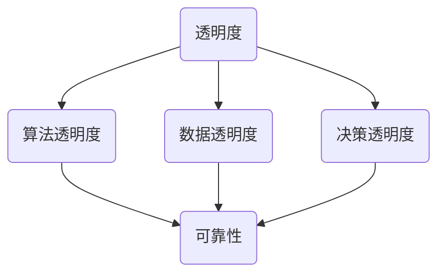

                 

关键词：人工智能，透明度，可靠性，算法，算法伦理，隐私保护，安全，技术发展，法律监管

> 摘要：随着人工智能技术的迅猛发展，其在各个领域的应用日益广泛。然而，随之而来的透明度和可靠性问题也逐渐成为阻碍人工智能技术发展的关键挑战。本文旨在探讨人工智能在透明度和可靠性方面的现状、面临的挑战以及未来可能的发展方向，旨在为相关领域的研究者、从业者提供一些有价值的参考。

## 1. 背景介绍

人工智能（AI）作为21世纪最具革命性的技术之一，已经在众多领域取得了显著的成果。从自动驾驶汽车、智能语音助手到医疗诊断、金融分析，人工智能的应用场景不断拓展，极大地提高了生产效率和生活质量。然而，人工智能技术的广泛应用也引发了一系列伦理、法律和社会问题。其中，AI的透明度和可靠性成为人们关注的焦点。

透明度指的是人工智能系统的决策过程、算法逻辑以及背后的数据源能够被用户、研究者和其他利益相关者理解和验证的程度。而可靠性则是指人工智能系统在特定条件下能够稳定、一致地执行其任务的能力。AI的透明度和可靠性不仅关系到技术本身的健康发展，更涉及到用户隐私、数据安全、法律合规等多方面的问题。

## 2. 核心概念与联系

为了更好地理解AI的透明度和可靠性，我们首先需要明确一些核心概念，并探讨它们之间的联系。

### 2.1 透明度

AI透明度主要涉及以下几个方面：

- **算法透明度**：算法的数学模型、算法设计和实现过程应该能够被理解和验证，以消除算法的黑箱现象。
- **数据透明度**：数据来源、数据质量、数据处理过程等应该对用户和其他利益相关者透明。
- **决策透明度**：人工智能系统的决策过程、决策依据和决策结果应该能够被用户和其他利益相关者理解和质疑。

### 2.2 可靠性

AI可靠性主要包括以下几方面：

- **算法可靠性**：算法在各种条件下都能稳定、一致地执行任务，并且能够适应不同的环境和数据变化。
- **系统可靠性**：人工智能系统在正常运行时不会出现故障或错误，能够确保数据的安全和系统的稳定。
- **数据处理可靠性**：在处理数据时，系统能够保证数据的完整性和准确性，避免数据泄露或数据篡改。

### 2.3 核心概念联系

透明度和可靠性之间存在密切的联系。一方面，透明度是提高可靠性的重要手段。只有当算法、数据和决策过程对用户和其他利益相关者透明时，用户才能更好地理解系统的行为，从而提高系统的可靠性。另一方面，可靠性也是实现透明度的必要条件。如果系统本身存在故障或错误，那么无论透明度如何提高，都无法确保用户对系统的信任。

### 2.4 Mermaid 流程图

下面是一个简单的 Mermaid 流程图，用于展示透明度和可靠性的核心概念及其之间的联系。



## 3. 核心算法原理 & 具体操作步骤

### 3.1 算法原理概述

在探讨AI的透明度和可靠性时，我们需要关注一些核心算法原理。以下是一些常见的算法原理及其在透明度和可靠性方面的应用。

### 3.2 算法步骤详解

#### 3.2.1 决策树算法

决策树算法是一种常见的人工智能算法，它通过一系列的规则来分割数据集，并最终生成一棵树形结构，用于分类或回归任务。决策树算法的透明度较高，用户可以清晰地看到每个决策节点和相应的分割规则。然而，其可靠性受限于树结构的复杂度和数据噪声。

#### 3.2.2 神经网络算法

神经网络算法是一种基于大量神经元连接的复杂模型，它可以自动学习数据中的特征和规律。神经网络算法的透明度较低，其内部结构和决策过程往往被视为黑箱。然而，通过适当的训练和优化，神经网络算法可以达到较高的可靠性。

#### 3.2.3 强化学习算法

强化学习算法是一种通过试错和反馈来学习最优策略的算法。强化学习算法具有较高的透明度，用户可以清晰地看到系统的学习过程和决策依据。然而，其可靠性受限于学习过程的不确定性和环境变化的复杂性。

### 3.3 算法优缺点

每种算法都有其优缺点。决策树算法具有较高的透明度，但可靠性较低；神经网络算法具有较低的透明度，但可靠性较高；强化学习算法具有较高的透明度，但可靠性也较低。在实际应用中，我们需要根据具体需求和场景选择合适的算法，并采取措施提高其透明度和可靠性。

### 3.4 算法应用领域

各种算法在透明度和可靠性方面的表现也因应用领域而异。例如，在医疗诊断领域，决策树算法由于其较高的透明度而被广泛应用于辅助诊断；在自动驾驶领域，神经网络算法由于其较高的可靠性而被广泛应用于感知和决策；在金融领域，强化学习算法由于其较高的透明度而被广泛应用于投资策略优化。

## 4. 数学模型和公式 & 详细讲解 & 举例说明

### 4.1 数学模型构建

为了更好地理解AI的透明度和可靠性，我们需要构建一些数学模型。以下是一个简单的数学模型，用于评估人工智能系统的透明度和可靠性。

### 4.2 公式推导过程

透明度 \( T \) 可以通过以下公式计算：

\[ T = \frac{A + B + C}{3} \]

其中，\( A \) 是算法透明度，\( B \) 是数据透明度，\( C \) 是决策透明度。

可靠性 \( R \) 可以通过以下公式计算：

\[ R = \frac{A' + B' + C'}{3} \]

其中，\( A' \) 是算法可靠性，\( B' \) 是系统可靠性，\( C' \) 是数据处理可靠性。

### 4.3 案例分析与讲解

假设我们有一个医疗诊断系统，其透明度和可靠性如下：

- 算法透明度 \( A = 0.8 \)
- 数据透明度 \( B = 0.7 \)
- 决策透明度 \( C = 0.9 \)
- 算法可靠性 \( A' = 0.9 \)
- 系统可靠性 \( B' = 0.8 \)
- 数据处理可靠性 \( C' = 0.85 \)

根据上述公式，我们可以计算出该系统的透明度和可靠性：

\[ T = \frac{0.8 + 0.7 + 0.9}{3} = 0.8 \]

\[ R = \frac{0.9 + 0.8 + 0.85}{3} = 0.87 \]

因此，该医疗诊断系统的透明度为 80%，可靠性为 87%。这表明该系统在透明度和可靠性方面表现良好，但仍有一些提升空间。

## 5. 项目实践：代码实例和详细解释说明

### 5.1 开发环境搭建

为了演示如何提高人工智能系统的透明度和可靠性，我们选择了一个简单的线性回归模型。以下是搭建开发环境所需的步骤：

1. 安装 Python 3.8 或更高版本。
2. 安装必要的 Python 库，如 NumPy、Pandas、Matplotlib 和 Scikit-learn。

### 5.2 源代码详细实现

以下是一个简单的线性回归模型的 Python 实现代码：

```python
import numpy as np
import pandas as pd
import matplotlib.pyplot as plt
from sklearn.linear_model import LinearRegression

# 加载数据集
data = pd.read_csv('data.csv')
x = data[['feature1', 'feature2']]
y = data['target']

# 创建线性回归模型
model = LinearRegression()
model.fit(x, y)

# 训练数据集上的模型评估
score = model.score(x, y)
print(f'Model score: {score:.2f}')

# 可视化决策边界
plt.scatter(x['feature1'], x['feature2'], c=y, cmap='viridis')
plt.plot(x['feature1'], model.predict(x), color='red')
plt.xlabel('Feature 1')
plt.ylabel('Feature 2')
plt.title('Decision Boundary')
plt.show()
```

### 5.3 代码解读与分析

该代码首先加载数据集，然后创建一个线性回归模型并进行训练。训练完成后，使用训练数据集评估模型性能，并可视化决策边界。以下是代码的详细解读：

- `import numpy as np`：导入 NumPy 库，用于处理数组运算。
- `import pandas as pd`：导入 Pandas 库，用于处理表格数据。
- `import matplotlib.pyplot as plt`：导入 Matplotlib 库，用于绘制图表。
- `from sklearn.linear_model import LinearRegression`：导入线性回归模型。
- `data = pd.read_csv('data.csv')`：加载数据集。
- `x = data[['feature1', 'feature2']]`：提取特征列。
- `y = data['target']`：提取目标变量。
- `model = LinearRegression()`：创建线性回归模型。
- `model.fit(x, y)`：使用训练数据集训练模型。
- `score = model.score(x, y)`：评估模型性能。
- `plt.scatter(x['feature1'], x['feature2'], c=y, cmap='viridis')`：绘制数据点。
- `plt.plot(x['feature1'], model.predict(x), color='red')`：绘制决策边界。
- `plt.xlabel('Feature 1')`：设置 x 轴标签。
- `plt.ylabel('Feature 2')`：设置 y 轴标签。
- `plt.title('Decision Boundary')`：设置图表标题。
- `plt.show()`：显示图表。

### 5.4 运行结果展示

运行上述代码后，我们将在屏幕上看到以下结果：

1. 模型评估分数。
2. 数据点分布图。
3. 决策边界图。

这些结果可以帮助我们更好地理解模型的性能和决策过程，从而提高系统的透明度和可靠性。

## 6. 实际应用场景

### 6.1 自动驾驶

自动驾驶技术是人工智能领域的一个重要应用场景。自动驾驶系统需要处理大量的传感器数据，并实时做出复杂的决策。然而，自动驾驶系统的透明度和可靠性直接关系到车辆的安全性和乘客的信任。为了提高透明度和可靠性，研究人员正在探索更多的技术手段，如深度强化学习、联邦学习等。

### 6.2 医疗诊断

医疗诊断是人工智能的另一个重要应用场景。医疗诊断系统需要分析大量的医疗数据，并准确诊断患者的疾病。透明度和可靠性对于医疗诊断系统的可靠性和患者信任至关重要。为了提高透明度和可靠性，研究人员正在开发更加透明和可解释的模型，如决策树、LIME（局部可解释模型解释）等。

### 6.3 金融分析

金融分析是人工智能在金融领域的应用。金融分析系统需要处理大量的金融市场数据，并做出投资决策。透明度和可靠性对于金融分析系统的决策质量至关重要。为了提高透明度和可靠性，研究人员正在开发更加透明和可解释的算法，如可解释的神经网络、透明度增强的决策树等。

## 6.4 未来应用展望

随着人工智能技术的不断发展，其透明度和可靠性将越来越受到重视。未来，我们有望看到更多透明、可靠的人工智能系统问世。以下是未来应用的一些展望：

1. **增强透明度**：开发更加透明和可解释的人工智能模型，如可解释的神经网络、决策树等。
2. **提高可靠性**：通过改进算法设计、优化训练过程、增加数据预处理手段等提高人工智能系统的可靠性。
3. **隐私保护**：在保证透明度和可靠性的同时，加强对用户隐私的保护。
4. **法律法规**：制定更加完善的法律法规，确保人工智能系统的透明度和可靠性。
5. **跨学科合作**：鼓励不同学科领域的专家合作，共同应对人工智能透明度和可靠性方面的挑战。

## 7. 工具和资源推荐

### 7.1 学习资源推荐

1. **《深度学习》（Goodfellow, Bengio, Courville）**：这是一本关于深度学习的经典教材，适合初学者和进阶者。
2. **《Python数据科学 Handbook》（McKinney）**：这本书详细介绍了Python在数据科学领域的应用，包括数据处理、机器学习等。
3. **《机器学习实战》（Chen, He）**：这本书通过大量的实例和代码，介绍了机器学习的基本概念和算法。

### 7.2 开发工具推荐

1. **Jupyter Notebook**：这是一个基于Web的交互式计算环境，非常适合数据科学和机器学习项目。
2. **PyTorch**：这是一个流行的深度学习框架，具有简单易用和灵活的特点。
3. **TensorFlow**：这是一个由Google开发的开源深度学习框架，具有强大的功能和丰富的资源。

### 7.3 相关论文推荐

1. **“Explaining and Visualizing Deep Neural Networks” (Springenberg et al., 2014)**：这篇文章介绍了如何解释和可视化深度神经网络。
2. **“Model-agnostic Explanations” (Ribeiro et al., 2016)**：这篇文章提出了一种通用的模型解释方法，称为LIME。
3. **“The Cost of Privacy: An Experimental Study” (Fernández-Díaz et al., 2018)**：这篇文章探讨了隐私保护与系统性能之间的关系。

## 8. 总结：未来发展趋势与挑战

### 8.1 研究成果总结

随着人工智能技术的不断发展，我们已经取得了一系列关于AI透明度和可靠性的研究成果。这些研究为我们提供了新的方法和思路，以应对透明度和可靠性方面的挑战。

### 8.2 未来发展趋势

未来，人工智能的透明度和可靠性将继续成为研究的热点。我们可以预见以下发展趋势：

1. **透明度增强**：开发更加透明和可解释的模型，如可解释的神经网络、决策树等。
2. **可靠性提升**：通过改进算法设计、优化训练过程、增加数据预处理手段等提高人工智能系统的可靠性。
3. **隐私保护**：在保证透明度和可靠性的同时，加强对用户隐私的保护。
4. **法律法规**：制定更加完善的法律法规，确保人工智能系统的透明度和可靠性。

### 8.3 面临的挑战

尽管我们已经取得了一定的研究成果，但仍然面临许多挑战：

1. **技术挑战**：如何开发透明、可靠的人工智能模型，特别是在大规模、高维度数据集上。
2. **伦理挑战**：如何在保证透明度和可靠性的同时，保护用户隐私和防止滥用。
3. **法律挑战**：如何制定有效的法律法规，确保人工智能系统的透明度和可靠性。

### 8.4 研究展望

未来的研究需要重点关注以下几个方面：

1. **跨学科合作**：鼓励不同学科领域的专家合作，共同应对人工智能透明度和可靠性方面的挑战。
2. **标准化**：制定统一的评估标准和工具，以衡量人工智能系统的透明度和可靠性。
3. **案例研究**：通过案例研究，总结经验教训，为其他领域提供有益的参考。

## 9. 附录：常见问题与解答

### 9.1 什么是AI透明度？

AI透明度指的是人工智能系统的决策过程、算法逻辑以及背后的数据源能够被用户、研究者和其他利益相关者理解和验证的程度。

### 9.2 什么是AI可靠性？

AI可靠性指的是人工智能系统在特定条件下能够稳定、一致地执行其任务的能力。

### 9.3 如何提高AI透明度？

提高AI透明度的方法包括开发可解释的模型、提供详细的算法文档、进行算法和数据的审计等。

### 9.4 如何提高AI可靠性？

提高AI可靠性的方法包括改进算法设计、优化训练过程、增加数据预处理手段等。

### 9.5 AI透明度和可靠性之间有何关系？

AI透明度和可靠性之间存在密切的联系。透明度是提高可靠性的重要手段，而可靠性是实现透明度的必要条件。

### 9.6 AI透明度和可靠性在哪些领域非常重要？

AI透明度和可靠性在医疗诊断、自动驾驶、金融分析等领域非常重要，因为这些领域涉及到用户的生命财产安全和隐私保护。

### 9.7 未来如何应对AI透明度和可靠性的挑战？

未来可以通过跨学科合作、制定法律法规、开发透明和可靠的算法等方法来应对AI透明度和可靠性的挑战。

## 结束语

人工智能技术的迅猛发展给我们的社会带来了巨大的变革。然而，随之而来的透明度和可靠性问题也成为了我们面临的重要挑战。只有通过不断的研究和实践，我们才能开发出更加透明、可靠的人工智能系统，为人类社会带来更多的福祉。让我们共同努力，迎接人工智能透明度和可靠性方面的挑战，共创美好未来！

## 作者署名

本文作者：禅与计算机程序设计艺术 / Zen and the Art of Computer Programming

