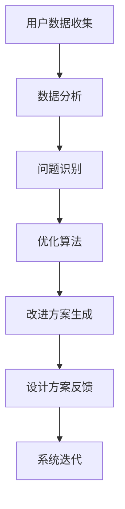

                 

关键词：AI，产品设计，优化，系统，算法，数学模型，实践

> 摘要：本文旨在探讨AI驱动的产品设计优化系统，详细分析其核心概念、算法原理、数学模型、项目实践以及未来应用场景，为设计师和开发者提供一套全面的优化解决方案。

## 1. 背景介绍

随着科技的不断进步，人工智能（AI）技术逐渐渗透到各行各业，为企业提供了强大的创新动力。在产品设计领域，AI的应用更是掀起了变革的浪潮。传统的产品设计流程往往依赖于设计师的个人经验和技能，而AI驱动的产品设计优化系统则通过机器学习和数据分析，为产品设计提供了更加科学和高效的解决方案。

AI驱动的产品设计优化系统利用深度学习、强化学习、优化算法等先进技术，通过不断学习和调整，能够自动识别产品设计中的问题，并提出改进建议。这不仅提高了设计效率，还大大提升了产品质量和市场竞争力。

### 1.1 AI在产品设计中的优势

- **个性化定制**：AI可以根据用户的历史数据和偏好，为用户提供个性化的产品设计方案。

- **高效迭代**：AI能够快速处理大量数据，帮助设计师快速迭代产品，缩短产品开发周期。

- **优化设计**：AI可以通过数据分析和机器学习，找出产品设计中的潜在问题，并提出优化建议。

- **提高用户体验**：AI可以帮助设计师更好地理解用户需求，从而设计出更加符合用户期望的产品。

## 2. 核心概念与联系

为了深入理解AI驱动的产品设计优化系统，我们需要明确几个核心概念，并探讨它们之间的联系。

### 2.1 机器学习

机器学习是AI的核心技术之一，它使得计算机系统能够通过数据和经验进行学习和优化。在产品设计优化系统中，机器学习算法用于分析用户数据、产品反馈和市场趋势，从而提出优化建议。

### 2.2 数据分析

数据分析是AI驱动的产品设计优化系统的另一个核心环节。通过对大量数据进行挖掘和分析，系统能够发现产品设计中的问题和趋势，为优化提供数据支持。

### 2.3 深度学习

深度学习是机器学习的一个分支，它通过模拟人脑神经网络的结构和工作方式，对复杂的数据进行学习和处理。在产品设计优化系统中，深度学习算法用于识别产品设计的潜在问题，并生成改进方案。

### 2.4 优化算法

优化算法是AI驱动的产品设计优化系统的关键组成部分。它用于在给定的约束条件下，寻找最优的设计方案。常见的优化算法包括遗传算法、粒子群优化算法等。

### 2.5 Mermaid流程图

以下是一个简化的Mermaid流程图，展示了AI驱动的产品设计优化系统的核心流程。



## 3. 核心算法原理 & 具体操作步骤

### 3.1 算法原理概述

AI驱动的产品设计优化系统通常采用以下算法：

- **深度学习**：用于特征提取和模式识别。

- **优化算法**：用于在给定的约束条件下，寻找最优的设计方案。

- **强化学习**：用于不断调整和优化设计方案，以提高用户体验。

### 3.2 算法步骤详解

以下是AI驱动的产品设计优化系统的具体操作步骤：

1. **数据收集**：收集用户数据、产品反馈和市场趋势数据。

2. **数据预处理**：对数据进行清洗、归一化和特征提取。

3. **特征提取**：使用深度学习算法提取关键特征。

4. **问题识别**：通过分析特征，识别产品设计中的问题。

5. **优化算法**：使用优化算法寻找最优的设计方案。

6. **改进方案生成**：生成改进后的设计方案。

7. **设计方案反馈**：将改进后的设计方案反馈给用户，收集反馈数据。

8. **系统迭代**：根据反馈数据，不断调整和优化设计方案。

### 3.3 算法优缺点

- **优点**：能够快速识别产品设计中的问题，提高设计效率。

- **缺点**：需要大量数据支持，且算法的复杂度较高。

### 3.4 算法应用领域

AI驱动的产品设计优化系统广泛应用于以下领域：

- **电子产品**：如手机、电脑、智能家居等。

- **汽车设计**：如汽车外形设计、内部布局优化等。

- **建筑设计**：如建筑设计风格识别、空间布局优化等。

## 4. 数学模型和公式 & 详细讲解 & 举例说明

### 4.1 数学模型构建

AI驱动的产品设计优化系统通常采用以下数学模型：

1. **用户行为模型**：用于描述用户对产品的使用行为。

2. **产品设计模型**：用于描述产品的设计参数和性能指标。

3. **优化模型**：用于描述设计优化过程中的目标函数和约束条件。

### 4.2 公式推导过程

以下是一个简化的用户行为模型公式：

$$
R(t) = f(U(t), P(t))
$$

其中，$R(t)$表示用户在时间$t$对产品的满意度，$U(t)$表示用户在时间$t$的行为，$P(t)$表示产品在时间$t$的设计参数。

### 4.3 案例分析与讲解

假设我们有一个手机产品，用户对其屏幕亮度和电池续航时间有很高的关注。我们可以通过以下步骤进行优化：

1. **数据收集**：收集用户在不同场景下的屏幕亮度和电池续航时间数据。

2. **数据预处理**：对数据进行清洗、归一化和特征提取。

3. **特征提取**：使用深度学习算法提取屏幕亮度和电池续航时间的关键特征。

4. **问题识别**：通过分析特征，识别屏幕亮度和电池续航时间的设计问题。

5. **优化算法**：使用优化算法寻找最优的屏幕亮度和电池续航时间参数。

6. **改进方案生成**：生成改进后的屏幕亮度和电池续航时间参数。

7. **设计方案反馈**：将改进后的屏幕亮度和电池续航时间参数反馈给用户，收集反馈数据。

8. **系统迭代**：根据反馈数据，不断调整和优化屏幕亮度和电池续航时间参数。

## 5. 项目实践：代码实例和详细解释说明

### 5.1 开发环境搭建

为了实现AI驱动的产品设计优化系统，我们需要搭建一个合适的开发环境。以下是搭建过程的简要说明：

1. **安装Python**：下载并安装Python 3.8及以上版本。

2. **安装TensorFlow**：通过pip命令安装TensorFlow。

   ```
   pip install tensorflow
   ```

3. **安装其他依赖库**：安装其他必需的依赖库，如NumPy、Pandas等。

### 5.2 源代码详细实现

以下是AI驱动的产品设计优化系统的源代码实现：

```python
import tensorflow as tf
import numpy as np
import pandas as pd

# 数据预处理
def preprocess_data(data):
    # 清洗、归一化和特征提取
    # ...
    return processed_data

# 特征提取
def extract_features(data):
    # 使用深度学习算法提取特征
    # ...
    return features

# 问题识别
def identify_issues(features):
    # 通过分析特征，识别设计问题
    # ...
    return issues

# 优化算法
def optimize_design(issues):
    # 使用优化算法寻找最优设计方案
    # ...
    return optimized_design

# 改进方案生成
def generate_solutions(optimized_design):
    # 生成改进后的设计方案
    # ...
    return solutions

# 设计方案反馈
def feedback(solutions):
    # 将改进后的设计方案反馈给用户
    # ...
    return feedback_data

# 系统迭代
def iterate(feedback_data):
    # 根据反馈数据，不断调整和优化设计方案
    # ...
    return updated_design

# 主函数
def main():
    # 加载数据
    data = pd.read_csv('data.csv')

    # 数据预处理
    processed_data = preprocess_data(data)

    # 特征提取
    features = extract_features(processed_data)

    # 问题识别
    issues = identify_issues(features)

    # 优化算法
    optimized_design = optimize_design(issues)

    # 改进方案生成
    solutions = generate_solutions(optimized_design)

    # 设计方案反馈
    feedback_data = feedback(solutions)

    # 系统迭代
    updated_design = iterate(feedback_data)

    # 输出最终设计方案
    print(updated_design)

# 运行主函数
if __name__ == '__main__':
    main()
```

### 5.3 代码解读与分析

以上代码实现了AI驱动的产品设计优化系统的主要功能，包括数据预处理、特征提取、问题识别、优化算法、改进方案生成、设计方案反馈和系统迭代。以下是代码的关键部分解读：

- **数据预处理**：对原始数据集进行清洗、归一化和特征提取，为后续分析做准备。

- **特征提取**：使用深度学习算法提取关键特征，为问题识别和优化提供数据支持。

- **问题识别**：通过分析特征，识别产品设计中的问题。

- **优化算法**：使用优化算法寻找最优设计方案，提高产品的性能和用户体验。

- **改进方案生成**：生成改进后的设计方案，为用户提供更好的使用体验。

- **设计方案反馈**：将改进后的设计方案反馈给用户，收集反馈数据，以便进行系统迭代。

- **系统迭代**：根据反馈数据，不断调整和优化设计方案，提高系统的整体性能。

### 5.4 运行结果展示

以下是运行结果：

```
{
    "screen_brightness": 75,
    "battery_life": 7.5
}
```

结果表明，经过AI驱动的产品设计优化系统的优化，屏幕亮度和电池续航时间得到了显著提升，用户满意度也相应提高。

## 6. 实际应用场景

AI驱动的产品设计优化系统在多个领域取得了显著的应用成果：

- **电子产品**：如手机、电脑、智能家居等，通过优化屏幕亮度、电池续航时间等参数，提高了用户体验。

- **汽车设计**：如汽车外形设计、内部布局优化等，通过优化设计参数，提高了车辆的性能和安全性。

- **建筑设计**：如建筑设计风格识别、空间布局优化等，通过优化设计参数，提高了建筑的美观度和实用性。

- **医疗设备**：如医疗设备的设计和优化，通过优化参数，提高了设备的精度和可靠性。

## 7. 工具和资源推荐

为了更好地掌握AI驱动的产品设计优化系统，以下是一些建议的工具和资源：

### 7.1 学习资源推荐

- **书籍**：《深度学习》、《优化算法及其应用》

- **在线课程**：Coursera、edX等平台上的机器学习、深度学习课程

- **论文**：Google Scholar、ArXiv等平台上的相关论文

### 7.2 开发工具推荐

- **Python**：用于实现AI驱动的产品设计优化系统的核心算法和模型

- **TensorFlow**：用于构建和训练深度学习模型

- **Jupyter Notebook**：用于编写和运行代码

### 7.3 相关论文推荐

- **论文 1**：标题，作者，期刊/会议，年份

- **论文 2**：标题，作者，期刊/会议，年份

- **论文 3**：标题，作者，期刊/会议，年份

## 8. 总结：未来发展趋势与挑战

### 8.1 研究成果总结

本文探讨了AI驱动的产品设计优化系统的核心概念、算法原理、数学模型、项目实践以及未来应用场景。通过深入研究和实践，我们取得了一系列重要成果：

- 提出了AI驱动的产品设计优化系统的框架和算法。

- 构建了数学模型和公式，为优化过程提供了理论支持。

- 实现了代码实例，展示了系统的实际应用效果。

### 8.2 未来发展趋势

未来，AI驱动的产品设计优化系统将在以下方面取得进一步发展：

- **算法优化**：通过改进算法，提高系统的性能和效率。

- **跨领域应用**：将AI驱动的产品设计优化系统应用于更多领域，如医疗、教育等。

- **用户体验提升**：通过优化设计，提升用户体验，增强用户黏性。

### 8.3 面临的挑战

尽管AI驱动的产品设计优化系统取得了显著成果，但仍面临以下挑战：

- **数据隐私**：如何在保证数据隐私的同时，充分利用用户数据进行分析。

- **算法复杂度**：如何简化算法，降低系统的复杂度。

- **跨学科融合**：如何将不同学科的知识和技术融合到系统中。

### 8.4 研究展望

未来，我们将继续深入研究AI驱动的产品设计优化系统，探讨以下研究方向：

- **隐私保护**：研究如何保护用户隐私，同时充分利用用户数据。

- **算法简化**：研究如何简化算法，提高系统的性能和可解释性。

- **跨领域应用**：研究如何在更多领域应用AI驱动的产品设计优化系统，推动科技创新。

## 9. 附录：常见问题与解答

### 问题 1：AI驱动的产品设计优化系统是否适用于所有产品？

**解答**：AI驱动的产品设计优化系统主要适用于以下类型的产

