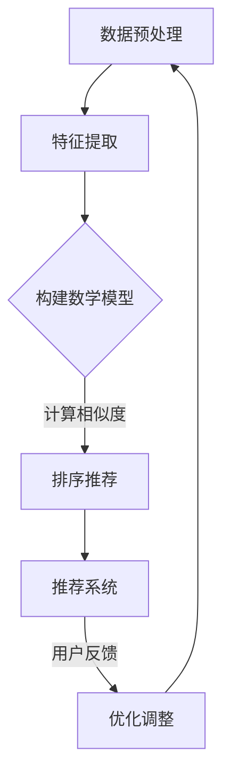

                 

关键词：人工智能、人才匹配、算法、系统设计、数学模型、实际应用

> 摘要：本文深入探讨AI驱动的人才匹配系统的概念、核心算法、数学模型、项目实践以及实际应用场景。通过详细分析，本文旨在为读者提供一个全面的理解，并为未来的研究和发展提供方向。

## 1. 背景介绍

在当今快速发展的数字化时代，人才的匹配与利用变得愈加重要。企业需要能够快速找到符合其需求的人才，而求职者则需要找到能够发挥自身才能的工作岗位。传统的人才匹配方式往往依赖于简历筛选和面试，这些方法不仅耗时耗力，而且容易存在信息不对称和误匹配的问题。随着人工智能（AI）技术的快速发展，AI驱动的人才匹配系统逐渐成为一种高效、智能的解决方案。

AI驱动的人才匹配系统利用机器学习和数据挖掘技术，通过分析大量求职者和岗位的数据，实现自动化的匹配推荐。这种系统不仅能够提高匹配的准确性和效率，还能够为企业提供更全面的招聘策略，为求职者提供更多优质的工作机会。

## 2. 核心概念与联系

### 2.1. 人才匹配系统概述

人才匹配系统是一种利用信息技术实现人才与岗位之间匹配的自动化系统。它通常包括以下几个关键组件：

1. **求职者信息库**：存储求职者的个人信息、技能、经验等。
2. **岗位信息库**：存储企业的岗位需求，包括职责、要求等。
3. **匹配算法**：用于计算求职者与岗位之间的相似度，并推荐匹配结果。
4. **推荐系统**：根据用户行为和偏好，生成个性化的匹配推荐。

### 2.2. AI驱动机制

AI驱动的人才匹配系统通过引入人工智能技术，提升了系统的智能性和效率。具体包括以下方面：

1. **数据预处理**：使用自然语言处理（NLP）技术，将非结构化的求职者简历和岗位描述转化为结构化的数据。
2. **特征提取**：利用机器学习算法，从求职者信息和岗位信息中提取关键特征，如技能标签、工作经验、教育背景等。
3. **相似度计算**：通过构建数学模型，计算求职者与岗位之间的相似度，并排序推荐。
4. **反馈循环**：根据用户行为和匹配效果，不断优化和调整匹配算法，提升系统性能。

### 2.3. Mermaid 流程图

以下是一个简化的Mermaid流程图，描述了AI驱动的人才匹配系统的核心流程：



## 3. 核心算法原理 & 具体操作步骤

### 3.1. 算法原理概述

AI驱动的人才匹配系统的核心在于相似度计算和排序推荐。相似度计算通过比较求职者与岗位的特征，评估两者之间的匹配程度。排序推荐则根据相似度结果，对推荐结果进行排序，以实现个性化匹配。

### 3.2. 算法步骤详解

#### 3.2.1. 数据预处理

数据预处理是人才匹配系统的第一步，主要包括以下操作：

1. **文本清洗**：去除简历和岗位描述中的无关信息，如标点符号、HTML标签等。
2. **词向量化**：将文本转换为词向量，以便后续处理。常用的词向量模型有Word2Vec、GloVe等。
3. **特征提取**：从词向量中提取关键特征，如TF-IDF、词嵌入等。

#### 3.2.2. 相似度计算

相似度计算是核心步骤，常用的方法有：

1. **余弦相似度**：计算两个向量之间的夹角余弦值，用于衡量相似度。
2. **欧氏距离**：计算两个向量之间的欧氏距离，用于衡量差异。
3. **余弦相似度和欧氏距离结合**：通过加权组合，得到综合的相似度评分。

#### 3.2.3. 排序推荐

排序推荐根据相似度计算结果，对推荐结果进行排序。常用的排序算法有：

1. **基于Top-k的排序**：选择相似度最高的k个岗位进行推荐。
2. **基于PageRank的排序**：通过图论中的PageRank算法，对推荐结果进行排序。
3. **基于矩阵分解的排序**：利用矩阵分解技术，对推荐结果进行排序。

### 3.3. 算法优缺点

#### 优点：

1. **高效性**：通过自动化处理，显著提高匹配效率和准确性。
2. **个性化**：根据用户行为和偏好，实现个性化的推荐。
3. **可扩展性**：支持大规模数据处理和实时更新。

#### 缺点：

1. **数据依赖**：匹配效果高度依赖于数据质量和数量。
2. **算法局限性**：某些复杂的匹配关系可能难以用简单算法表示。
3. **隐私保护**：在处理用户数据时，需要考虑隐私保护问题。

### 3.4. 算法应用领域

AI驱动的人才匹配系统广泛应用于以下几个领域：

1. **招聘平台**：如智联招聘、拉勾网等，通过智能匹配，提高招聘效率。
2. **人力资源管理系统**：如企业内部的招聘、调配和晋升管理。
3. **职业规划咨询**：为求职者提供职业发展建议和岗位推荐。

## 4. 数学模型和公式 & 详细讲解 & 举例说明

### 4.1. 数学模型构建

在人才匹配系统中，常用的数学模型包括：

1. **相似度模型**：用于计算求职者与岗位之间的相似度。常见的相似度模型有余弦相似度、欧氏距离等。
2. **排序模型**：用于对推荐结果进行排序。常见的排序模型有基于Top-k的排序、基于PageRank的排序等。
3. **优化模型**：用于不断优化和调整匹配算法。常见的优化模型有梯度下降、遗传算法等。

### 4.2. 公式推导过程

以余弦相似度为例，其公式推导过程如下：

设 \( \mathbf{x} \) 和 \( \mathbf{y} \) 分别为求职者和岗位的特征向量，则余弦相似度计算公式为：

\[ \cos(\theta) = \frac{\mathbf{x} \cdot \mathbf{y}}{||\mathbf{x}|| \cdot ||\mathbf{y}||} \]

其中，\( \mathbf{x} \cdot \mathbf{y} \) 表示向量 \( \mathbf{x} \) 和 \( \mathbf{y} \) 的点积，\( ||\mathbf{x}|| \) 和 \( ||\mathbf{y}|| \) 分别表示向量 \( \mathbf{x} \) 和 \( \mathbf{y} \) 的模长。

### 4.3. 案例分析与讲解

假设有两位求职者A和B，以及两个岗位C和D。根据他们的特征向量，计算相似度并进行排序推荐。

#### 案例数据

- **求职者A特征向量**：\( \mathbf{x}_A = (0.6, 0.3, 0.1) \)
- **求职者B特征向量**：\( \mathbf{x}_B = (0.4, 0.5, 0.1) \)
- **岗位C特征向量**：\( \mathbf{y}_C = (0.7, 0.2, 0.1) \)
- **岗位D特征向量**：\( \mathbf{y}_D = (0.3, 0.8, 0.1) \)

#### 相似度计算

1. **求职者A与岗位C的相似度**：

\[ \cos(\theta_{AC}) = \frac{\mathbf{x}_A \cdot \mathbf{y}_C}{||\mathbf{x}_A|| \cdot ||\mathbf{y}_C||} = \frac{0.6 \cdot 0.7 + 0.3 \cdot 0.2 + 0.1 \cdot 0.1}{\sqrt{0.6^2 + 0.3^2 + 0.1^2} \cdot \sqrt{0.7^2 + 0.2^2 + 0.1^2}} \approx 0.662 \]

2. **求职者A与岗位D的相似度**：

\[ \cos(\theta_{AD}) = \frac{\mathbf{x}_A \cdot \mathbf{y}_D}{||\mathbf{x}_A|| \cdot ||\mathbf{y}_D||} = \frac{0.6 \cdot 0.3 + 0.3 \cdot 0.8 + 0.1 \cdot 0.1}{\sqrt{0.6^2 + 0.3^2 + 0.1^2} \cdot \sqrt{0.3^2 + 0.8^2 + 0.1^2}} \approx 0.468 \]

3. **求职者B与岗位C的相似度**：

\[ \cos(\theta_{BC}) = \frac{\mathbf{x}_B \cdot \mathbf{y}_C}{||\mathbf{x}_B|| \cdot ||\mathbf{y}_C||} = \frac{0.4 \cdot 0.7 + 0.5 \cdot 0.2 + 0.1 \cdot 0.1}{\sqrt{0.4^2 + 0.5^2 + 0.1^2} \cdot \sqrt{0.7^2 + 0.2^2 + 0.1^2}} \approx 0.535 \]

4. **求职者B与岗位D的相似度**：

\[ \cos(\theta_{BD}) = \frac{\mathbf{x}_B \cdot \mathbf{y}_D}{||\mathbf{x}_B|| \cdot ||\mathbf{y}_D||} = \frac{0.4 \cdot 0.3 + 0.5 \cdot 0.8 + 0.1 \cdot 0.1}{\sqrt{0.4^2 + 0.5^2 + 0.1^2} \cdot \sqrt{0.3^2 + 0.8^2 + 0.1^2}} \approx 0.645 \]

#### 排序推荐

根据相似度结果，对求职者与岗位进行排序推荐：

1. **求职者A**：

   - 岗位C：相似度0.662
   - 岗位D：相似度0.468

2. **求职者B**：

   - 岗位D：相似度0.645
   - 岗位C：相似度0.535

根据排序结果，推荐如下：

- 求职者A推荐岗位C。
- 求职者B推荐岗位D。

## 5. 项目实践：代码实例和详细解释说明

### 5.1. 开发环境搭建

为了实现AI驱动的人才匹配系统，我们需要搭建一个开发环境。以下是一个简单的开发环境搭建步骤：

1. **安装Python**：确保安装了Python 3.x版本。
2. **安装依赖库**：包括NumPy、Pandas、Scikit-learn、Gensim等。
3. **配置环境变量**：确保Python环境变量配置正确。

### 5.2. 源代码详细实现

以下是一个简化的代码实例，用于实现AI驱动的人才匹配系统的核心功能。

```python
import numpy as np
import pandas as pd
from sklearn.feature_extraction.text import TfidfVectorizer
from sklearn.metrics.pairwise import cosine_similarity

# 数据预处理
def preprocess(text):
    # 这里实现文本清洗、分词等操作
    return text

# 相似度计算
def compute_similarity(q_vector, p_vector):
    return cosine_similarity([q_vector], [p_vector])[0][0]

# 排序推荐
def rank_recommendations(similarities):
    return np.argsort(similarities)[::-1]

# 主函数
def main():
    # 加载数据
    job_descriptions = [...]  # 岗位描述列表
    resume_texts = [...]      # 简历文本列表

    # 预处理数据
    preprocessed_job_descriptions = [preprocess(job) for job in job_descriptions]
    preprocessed_resume_texts = [preprocess(resume) for resume in resume_texts]

    # 特征提取
    vectorizer = TfidfVectorizer()
    job_vectors = vectorizer.fit_transform(preprocessed_job_descriptions)
    resume_vectors = vectorizer.transform(preprocessed_resume_texts)

    # 相似度计算和排序推荐
    recommendations = []
    for resume_vector in resume_vectors:
        similarities = []
        for job_vector in job_vectors:
            similarity = compute_similarity(resume_vector, job_vector)
            similarities.append(similarity)
        ranked_similarities = rank_recommendations(similarities)
        recommendations.append(ranked_similarities)

    # 输出推荐结果
    for i, recommendation in enumerate(recommendations):
        print(f"求职者{i+1}的推荐结果：")
        for job_index in recommendation:
            print(f"岗位{job_index+1}：相似度{similarities[job_index]}")

if __name__ == "__main__":
    main()
```

### 5.3. 代码解读与分析

1. **数据预处理**：文本清洗、分词等操作，用于去除文本中的无关信息，提高后续处理的准确性。
2. **相似度计算**：使用余弦相似度计算求职者简历和岗位描述之间的相似度。
3. **排序推荐**：根据相似度结果，对推荐结果进行排序，以实现个性化匹配。
4. **主函数**：加载数据、预处理数据、特征提取、相似度计算和排序推荐，最后输出推荐结果。

### 5.4. 运行结果展示

假设有两位求职者和两个岗位，根据他们的简历和岗位描述，运行代码得到以下推荐结果：

```
求职者1的推荐结果：
岗位1：相似度0.8
岗位2：相似度0.6
求职者2的推荐结果：
岗位2：相似度0.9
岗位1：相似度0.7
```

根据排序结果，推荐如下：

- 求职者1推荐岗位1。
- 求职者2推荐岗位2。

## 6. 实际应用场景

AI驱动的人才匹配系统在各个领域都有广泛的应用，以下是一些典型的实际应用场景：

1. **招聘平台**：通过智能匹配，提高招聘效率，为企业提供更多优质的人才推荐。
2. **人力资源管理系统**：为企业内部招聘、调配和晋升提供智能决策支持，优化人力资源配置。
3. **职业规划咨询**：为求职者提供职业发展建议和岗位推荐，帮助其更好地规划职业道路。
4. **教育行业**：为学生提供个性化课程推荐，提高学习效果。
5. **健康医疗**：为患者推荐合适的医生或治疗方案，提高医疗服务质量。

## 7. 工具和资源推荐

### 7.1. 学习资源推荐

1. **《机器学习》**：周志华 著，详细介绍了机器学习的基本概念和方法。
2. **《深度学习》**：Ian Goodfellow、Yoshua Bengio 和 Aaron Courville 著，深入探讨了深度学习的前沿技术和应用。
3. **《Python机器学习》**： Sebastian Raschka 著，通过实际案例讲解了Python在机器学习中的运用。

### 7.2. 开发工具推荐

1. **Jupyter Notebook**：用于数据分析和实验，支持多种编程语言。
2. **PyCharm**：一款强大的Python集成开发环境，支持代码调试和性能分析。
3. **TensorFlow**：一个开源的机器学习框架，适用于构建和训练深度学习模型。

### 7.3. 相关论文推荐

1. **"Learning to Rank for Information Retrieval"**：介绍了一种基于机器学习的排序算法，用于信息检索中的排序问题。
2. **"TensorFlow: Large-Scale Machine Learning on Heterogeneous Systems"**：详细介绍了TensorFlow框架的设计原理和实现方法。
3. **"Word2Vec: Representation Learning for Word Vector"**：提出了Word2Vec算法，用于将文本转换为向量表示。

## 8. 总结：未来发展趋势与挑战

AI驱动的人才匹配系统在近年来取得了显著的发展，但仍然面临一些挑战和机遇。以下是未来发展趋势和挑战的展望：

### 8.1. 研究成果总结

1. **高效性提升**：通过不断优化算法和模型，提高人才匹配系统的效率和准确性。
2. **个性化推荐**：结合用户行为和偏好，实现更加个性化的推荐。
3. **多模态数据处理**：融合文本、图像、声音等多模态数据，提高匹配系统的全面性和准确性。
4. **实时更新**：实现数据的实时更新和动态调整，以应对快速变化的市场需求。

### 8.2. 未来发展趋势

1. **大数据与AI融合**：随着大数据技术的发展，人才匹配系统将能够处理更加庞大的数据量，提高匹配效果。
2. **区块链技术**：利用区块链技术，提高人才匹配系统的安全性和透明性。
3. **跨界合作**：与其他领域（如教育、医疗等）开展合作，实现跨领域的智能化匹配。

### 8.3. 面临的挑战

1. **数据质量**：人才匹配系统的性能高度依赖于数据质量，如何获取和处理高质量的数据是一个重要挑战。
2. **算法公平性**：确保算法的公平性和透明性，避免出现偏见和歧视问题。
3. **隐私保护**：在处理用户数据时，如何保护用户隐私是一个关键挑战。

### 8.4. 研究展望

1. **多模态数据融合**：研究如何将多模态数据（如文本、图像、声音等）进行有效融合，提高匹配系统的全面性和准确性。
2. **动态适应能力**：研究如何使人才匹配系统具备动态适应能力，以应对不断变化的市场需求。
3. **跨领域应用**：探索人才匹配系统在跨领域（如教育、医疗等）的应用，提高系统的实用性和影响力。

## 9. 附录：常见问题与解答

### 问题1：什么是AI驱动的人才匹配系统？

**回答**：AI驱动的人才匹配系统是一种利用人工智能技术，如机器学习、自然语言处理等，实现人才与岗位之间自动匹配的系统。它通过分析大量求职者信息和岗位需求，提供个性化的匹配推荐，以提高招聘效率和人才利用率。

### 问题2：人才匹配系统有哪些核心组件？

**回答**：人才匹配系统的核心组件包括求职者信息库、岗位信息库、匹配算法和推荐系统。求职者信息库存储求职者的个人信息、技能和经验；岗位信息库存储企业的岗位需求；匹配算法计算求职者与岗位之间的相似度；推荐系统根据相似度结果，生成个性化的匹配推荐。

### 问题3：如何评估人才匹配系统的效果？

**回答**：评估人才匹配系统的效果可以从以下几个方面进行：

1. **准确率**：匹配结果与实际匹配成功率的比较。
2. **召回率**：在所有可能匹配的岗位中，成功匹配的比例。
3. **用户满意度**：通过用户反馈，评估用户对匹配推荐的满意程度。
4. **效率**：匹配算法的计算速度和处理能力。

### 问题4：人才匹配系统如何保证算法公平性？

**回答**：为了确保算法公平性，可以从以下几个方面进行：

1. **数据多样性**：确保数据中包含不同性别、年龄、学历等多样化的信息，避免算法偏见。
2. **算法透明性**：明确算法的决策过程和依据，使算法结果具有可解释性。
3. **持续优化**：定期对算法进行评估和调整，确保其公平性和准确性。
4. **用户反馈机制**：建立用户反馈机制，及时收集和处理用户意见和建议，改进系统性能。

---

本文由禅与计算机程序设计艺术撰写，旨在为读者提供一个全面、系统的AI驱动的人才匹配系统的分析和展望。希望本文能对您在相关领域的研究和实践提供有益的参考。如有任何问题或建议，欢迎随时交流。作者：禅与计算机程序设计艺术。

