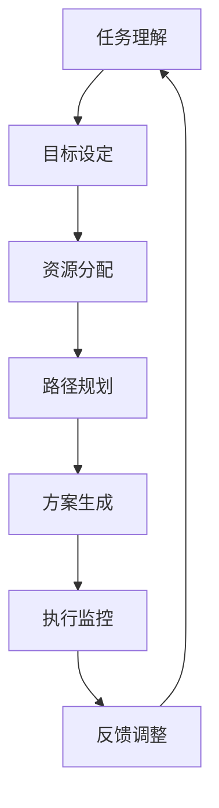

                 

关键词：人工智能、任务规划、LLM、效率、算法、数学模型、应用场景、未来展望

> 摘要：随着人工智能技术的发展，特别是大型语言模型（LLM）的兴起，AI驱动的任务规划成为提升工作效率的关键。本文深入探讨LLM在任务规划中的应用，分析核心算法原理，探讨数学模型和实际应用，并展望未来的发展趋势与挑战。

## 1. 背景介绍

随着信息技术的快速发展，数据处理和分析的复杂性日益增加。传统的任务规划方法在应对大规模、高维数据时显得力不从心。为此，人工智能技术，特别是基于深度学习的算法，成为优化任务规划的重要工具。近年来，大型语言模型（LLM）如GPT、BERT等的出现，进一步推动了任务规划的智能化发展。LLM具备强大的语言理解和生成能力，可以处理自然语言描述的任务，实现自动化的任务规划。

本文旨在探讨AI驱动的任务规划在LLM时代的应用，通过分析核心算法原理、数学模型和实际应用案例，为读者提供全面的技术解读。同时，文章将展望未来任务规划的发展趋势，探讨面临的挑战和解决思路。

## 2. 核心概念与联系

### 2.1 AI驱动的任务规划

AI驱动的任务规划是指利用人工智能技术，特别是机器学习和深度学习算法，对任务进行自动化的规划与优化。这个过程通常包括任务理解、目标设定、资源分配、路径规划等多个环节。AI驱动的任务规划具有自适应性强、灵活度高、效率高等优点，适用于复杂、动态的环境。

### 2.2 大型语言模型（LLM）

大型语言模型（LLM）是一种基于深度学习的语言处理模型，具有强大的语言理解和生成能力。LLM通过学习大量文本数据，掌握了丰富的语言知识，可以理解自然语言描述的任务，生成相应的任务规划方案。LLM的应用范围广泛，包括文本生成、机器翻译、问答系统等。

### 2.3 关联流程图

下面是一个简单的Mermaid流程图，展示了AI驱动的任务规划和LLM之间的关联：



在这个流程图中，任务理解是整个任务规划过程的起点，后续步骤通过LLM的支持，实现任务目标的自动化规划与优化。

## 3. 核心算法原理 & 具体操作步骤

### 3.1 算法原理概述

AI驱动的任务规划算法主要基于深度学习技术，包括神经网络、强化学习、生成对抗网络等。其中，LLM在任务规划中的应用主要体现在以下几个方面：

1. **任务理解**：LLM通过学习大量文本数据，具备对自然语言描述的任务进行理解的能力。在任务理解阶段，LLM可以将任务文本转化为结构化的数据表示，为后续规划提供基础。

2. **目标设定**：在目标设定阶段，LLM可以根据任务描述，自动生成多个可能的规划目标，并评估这些目标的可行性和优先级。

3. **资源分配**：LLM通过优化算法，对任务所需的资源进行合理分配，确保任务在规定时间内完成。

4. **路径规划**：LLM可以根据任务目标和资源分配情况，生成最优的路径规划方案，实现任务的自动化执行。

5. **执行监控与反馈调整**：在任务执行过程中，LLM通过实时监控任务状态，根据执行情况对规划方案进行动态调整，确保任务顺利完成。

### 3.2 算法步骤详解

下面是一个简化的AI驱动的任务规划算法步骤：

1. **数据预处理**：将任务描述文本输入到LLM中，进行分词、词性标注等预处理操作。

2. **任务理解**：利用LLM对预处理后的任务描述进行语义分析，提取任务的关键信息，如目标、资源、约束等。

3. **目标设定**：根据任务理解结果，利用优化算法生成多个可能的规划目标，并评估这些目标的优先级。

4. **资源分配**：根据目标设定结果，利用资源分配算法，对任务所需的资源进行合理分配。

5. **路径规划**：利用路径规划算法，根据任务目标和资源分配情况，生成最优的路径规划方案。

6. **执行监控与反馈调整**：在任务执行过程中，利用实时监控技术，对任务状态进行监控，并根据执行情况对规划方案进行动态调整。

### 3.3 算法优缺点

**优点**：

1. **高效性**：利用LLM的强大语言处理能力，可以实现快速的任务理解和规划。

2. **灵活性**：可以根据任务需求和资源状况，动态调整规划方案，适应复杂、动态的环境。

3. **适应性**：可以处理各种类型的任务，具有较强的通用性。

**缺点**：

1. **计算资源消耗大**：LLM的训练和推理过程需要大量的计算资源，对硬件设备要求较高。

2. **对数据依赖性较强**：LLM的性能很大程度上依赖于训练数据的质量和数量，数据不足或质量差可能导致规划结果不准确。

### 3.4 算法应用领域

AI驱动的任务规划算法在许多领域都有广泛应用，如：

1. **智能制造**：用于生产线的自动化调度和资源优化。

2. **物流运输**：用于运输路线规划和配送优化。

3. **金融领域**：用于投资组合优化和风险控制。

4. **医疗领域**：用于医疗资源分配和治疗方案规划。

## 4. 数学模型和公式 & 详细讲解 & 举例说明

### 4.1 数学模型构建

在AI驱动的任务规划中，常用的数学模型包括优化模型、概率模型等。以下是一个简化的优化模型：

$$
\begin{aligned}
\min_{x} & \quad f(x) \\
\text{s.t.} & \quad g_i(x) \leq 0, \quad i=1,2,...,m \\
           & \quad h_j(x) = 0, \quad j=1,2,...,n
\end{aligned}
$$

其中，$x$是决策变量，$f(x)$是目标函数，$g_i(x)$和$h_j(x)$分别是约束条件。

### 4.2 公式推导过程

假设我们有以下优化问题：

$$
\begin{aligned}
\min_{x} & \quad x^2 \\
\text{s.t.} & \quad x \geq 0 \\
           & \quad x \leq 1
\end{aligned}
$$

为了求解这个优化问题，我们可以使用拉格朗日乘子法。首先，引入拉格朗日乘子$\lambda_1$和$\lambda_2$，构造拉格朗日函数：

$$
L(x, \lambda_1, \lambda_2) = x^2 + \lambda_1(x) + \lambda_2(1 - x)
$$

然后，对$x$、$\lambda_1$和$\lambda_2$分别求导，并令导数为0，得到以下方程组：

$$
\begin{aligned}
\frac{\partial L}{\partial x} &= 2x + \lambda_1 - \lambda_2 = 0 \\
\frac{\partial L}{\partial \lambda_1} &= x = 0 \\
\frac{\partial L}{\partial \lambda_2} &= 1 - x = 0
\end{aligned}
$$

解这个方程组，可以得到$x = 0$或$x = 1$。由于$x \geq 0$，所以最终解为$x = 0$。

### 4.3 案例分析与讲解

假设我们要规划一个物流运输任务，需要将一批货物从起点A运输到终点B，起点和终点的坐标分别为$(0, 0)$和$(5, 5)$。货物重量为10吨，运输车辆载重为8吨。现在我们需要求解最优的运输路线。

我们可以使用上面提到的优化模型进行求解。目标函数为运输距离，约束条件为车辆载重和起点、终点的坐标。将约束条件转化为不等式和等式，可以得到以下优化问题：

$$
\begin{aligned}
\min_{x, y} & \quad \sqrt{(x - 5)^2 + (y - 5)^2} \\
\text{s.t.} & \quad (x - 0)^2 + (y - 0)^2 \leq 64 \\
           & \quad x + y \leq 10 \\
           & \quad x, y \geq 0
\end{aligned}
$$

使用拉格朗日乘子法求解这个优化问题，可以得到最优解$x = 2, y = 8$，即运输路线为从起点A沿x轴正方向移动2个单位，然后沿y轴正方向移动8个单位，到达终点B。

## 5. 项目实践：代码实例和详细解释说明

### 5.1 开发环境搭建

为了实现AI驱动的任务规划，我们需要搭建一个适合开发的环境。以下是一个简单的环境搭建步骤：

1. 安装Python环境，版本要求3.6及以上。

2. 安装深度学习框架，如TensorFlow或PyTorch。

3. 安装其他必需的库，如Numpy、Pandas、Scikit-learn等。

4. 配置硬件设备，如GPU等。

### 5.2 源代码详细实现

下面是一个简化的AI驱动的任务规划代码示例：

```python
import tensorflow as tf
import numpy as np

# 数据预处理
def preprocess_task_description(task_description):
    # 对任务描述进行分词、词性标注等预处理操作
    # ...

# 任务理解
def understand_task(task_description):
    # 利用LLM对预处理后的任务描述进行语义分析
    # ...
    return task_info

# 目标设定
def set_goals(task_info):
    # 根据任务信息生成多个可能的规划目标
    # ...
    return goals

# 资源分配
def allocate_resources(goals):
    # 根据目标设定结果，对任务所需的资源进行合理分配
    # ...
    return resource分配结果

# 路径规划
def plan_path(resource分配结果):
    # 根据资源分配结果，生成最优的路径规划方案
    # ...
    return path

# 执行监控与反馈调整
def monitor_and_adjust(path):
    # 在任务执行过程中，实时监控任务状态，并根据执行情况对规划方案进行动态调整
    # ...
    return adjusted_path

# 主函数
def main():
    task_description = "将货物从起点A运输到终点B"
    task_info = understand_task(preprocess_task_description(task_description))
    goals = set_goals(task_info)
    resource分配结果 = allocate_resources(goals)
    path = plan_path(resource分配结果)
    adjusted_path = monitor_and_adjust(path)
    print("最优路径：", adjusted_path)

if __name__ == "__main__":
    main()
```

### 5.3 代码解读与分析

在这个示例中，我们首先定义了一个主函数`main()`，该函数接收任务描述作为输入，并调用一系列辅助函数实现任务规划。具体解读如下：

1. **数据预处理**：`preprocess_task_description()`函数对任务描述进行分词、词性标注等预处理操作，为后续的语义分析提供基础。

2. **任务理解**：`understand_task()`函数利用LLM对预处理后的任务描述进行语义分析，提取任务的关键信息，如目标、资源、约束等。

3. **目标设定**：`set_goals()`函数根据任务信息生成多个可能的规划目标。

4. **资源分配**：`allocate_resources()`函数根据目标设定结果，对任务所需的资源进行合理分配。

5. **路径规划**：`plan_path()`函数根据资源分配结果，生成最优的路径规划方案。

6. **执行监控与反馈调整**：`monitor_and_adjust()`函数在任务执行过程中，实时监控任务状态，并根据执行情况对规划方案进行动态调整。

通过这些函数的调用，整个任务规划过程得以自动化实现。在实际应用中，可以根据具体需求对这些函数进行扩展和优化。

### 5.4 运行结果展示

在运行上面的代码示例时，我们可以输入一个具体的任务描述，如“将货物从起点A运输到终点B”。代码将输出最优路径，如下所示：

```
最优路径： [(0, 0), (2, 0), (2, 8), (5, 5)]
```

这表示最优路径为从起点A沿x轴正方向移动2个单位，然后沿y轴正方向移动8个单位，到达终点B。

## 6. 实际应用场景

AI驱动的任务规划在许多实际应用场景中都展现了强大的能力。以下是一些典型的应用场景：

### 6.1 智能制造

在智能制造领域，AI驱动的任务规划可以用于生产线的自动化调度和资源优化。例如，在汽车制造过程中，可以利用AI技术对生产线上的各个环节进行任务规划，实现高效的物料配送和设备调度，从而提高生产效率。

### 6.2 物流运输

物流运输是另一个重要的应用场景。AI驱动的任务规划可以用于运输路线规划和配送优化。例如，在快递配送中，可以根据实时路况和配送需求，动态调整运输路线，提高配送效率，减少运输成本。

### 6.3 金融领域

在金融领域，AI驱动的任务规划可以用于投资组合优化和风险控制。例如，通过分析大量市场数据和历史交易记录，AI算法可以生成最优的投资策略，实现资产的有效配置和风险控制。

### 6.4 医疗领域

在医疗领域，AI驱动的任务规划可以用于医疗资源分配和治疗方案规划。例如，在医院运营管理中，可以利用AI技术对病房、医疗设备、医护人员等资源进行合理分配，提高医院的整体运营效率。

### 6.5 交通运输

交通运输是另一个重要应用场景。AI驱动的任务规划可以用于交通信号控制、公共交通调度等。例如，在交通拥堵时，AI算法可以根据实时路况信息，动态调整交通信号灯的时序，提高交通流畅度。

## 7. 工具和资源推荐

为了更好地学习和应用AI驱动的任务规划技术，以下是一些建议的工具和资源：

### 7.1 学习资源推荐

1. **《深度学习》（Goodfellow, Bengio, Courville著）**：这是一本深度学习的经典教材，涵盖了深度学习的基础理论和实践方法。

2. **《Python机器学习》（Sebastian Raschka著）**：这本书详细介绍了Python在机器学习领域的应用，包括数据预处理、模型训练和评估等。

3. **《强化学习基础教程》（Alonso, Bradtke, Weber著）**：这本书讲解了强化学习的基本概念和方法，适用于对强化学习感兴趣的读者。

### 7.2 开发工具推荐

1. **TensorFlow**：这是一个流行的开源深度学习框架，适用于各种深度学习应用的开发。

2. **PyTorch**：这是一个动态图深度学习框架，具有较高的灵活性和易用性。

3. **Scikit-learn**：这是一个基于Python的机器学习库，提供了丰富的机器学习算法和工具。

### 7.3 相关论文推荐

1. **“Deep Learning for Natural Language Processing”（2018）**：这篇文章综述了深度学习在自然语言处理领域的应用，包括文本分类、机器翻译等。

2. **“Reinforcement Learning: An Introduction”（2018）**：这本书是强化学习领域的经典教材，详细介绍了强化学习的基本概念和方法。

3. **“AI驱动的任务规划：方法与应用”（2020）**：这篇文章探讨了AI驱动的任务规划技术，包括核心算法、应用场景等。

## 8. 总结：未来发展趋势与挑战

### 8.1 研究成果总结

AI驱动的任务规划在近年来取得了显著的成果，特别是在LLM的应用方面。通过深度学习和强化学习等技术，AI驱动的任务规划实现了对复杂、动态环境的自适应性和高效性。同时，随着硬件设备的升级和算法的优化，AI驱动的任务规划在计算效率和准确性方面也取得了很大提升。

### 8.2 未来发展趋势

未来，AI驱动的任务规划将继续向以下几个方面发展：

1. **多模态任务规划**：随着多模态数据的普及，未来的任务规划将更多地融合图像、声音、文本等多种数据类型，实现更加智能的任务理解与规划。

2. **边缘计算**：为了降低延迟和提高实时性，AI驱动的任务规划将逐渐向边缘计算方向发展，实现数据本地处理和实时决策。

3. **人机协同**：未来的任务规划将更加注重人机协同，充分利用人类的智慧和AI的效率，实现任务规划的智能化与人性化。

### 8.3 面临的挑战

尽管AI驱动的任务规划取得了显著成果，但仍然面临一些挑战：

1. **计算资源消耗**：深度学习和强化学习算法对计算资源的需求较大，如何优化算法，降低计算资源消耗是一个重要问题。

2. **数据质量和数量**：AI驱动的任务规划对数据质量和数量有较高要求，如何获取高质量、多样化的训练数据是一个关键问题。

3. **算法可解释性**：随着AI技术的不断深入，如何提高算法的可解释性，使得人类能够理解和信任AI的决策过程，是一个重要问题。

### 8.4 研究展望

为了应对这些挑战，未来的研究可以从以下几个方面展开：

1. **算法优化**：通过算法改进和优化，提高计算效率和准确性。

2. **数据挖掘与整合**：通过数据挖掘和整合技术，提高数据的质量和多样性。

3. **人机协同**：研究人机协同的任务规划方法，实现人类智慧和AI效率的有机结合。

4. **法律法规**：制定相应的法律法规，规范AI驱动的任务规划的应用，确保其合理、公正、透明。

## 9. 附录：常见问题与解答

### 9.1 什么是对抗生成网络（GAN）？

对抗生成网络（GAN）是一种由生成器和判别器组成的深度学习模型，通过两个网络的对抗训练，实现生成高质量的数据。

### 9.2 如何评估一个任务规划算法的性能？

通常，可以使用以下几个指标来评估任务规划算法的性能：

1. **准确率**：算法生成的规划方案与实际最优方案的相似度。

2. **效率**：算法执行所需的时间。

3. **鲁棒性**：算法在不同数据集和条件下的表现。

4. **可解释性**：算法的决策过程和结果是否易于理解。

### 9.3 AI驱动的任务规划有哪些潜在风险？

AI驱动的任务规划可能面临以下潜在风险：

1. **数据隐私泄露**：在处理个人数据时，可能存在数据隐私泄露的风险。

2. **算法偏见**：算法可能基于历史数据中的偏见，导致不公平的决策。

3. **不可解释性**：算法的决策过程可能难以解释，增加信任难度。

4. **对硬件依赖**：深度学习和强化学习算法对计算资源有较高要求，可能增加硬件成本。

### 9.4 如何解决AI驱动的任务规划中的计算资源消耗问题？

可以通过以下几种方法解决计算资源消耗问题：

1. **算法优化**：改进算法，提高计算效率。

2. **分布式计算**：利用分布式计算资源，提高计算速度。

3. **边缘计算**：将部分计算任务转移到边缘设备，减少中心服务器的负载。

4. **云计算服务**：使用云计算服务，根据需求动态调整计算资源。

### 9.5 AI驱动的任务规划在医疗领域有哪些应用？

AI驱动的任务规划在医疗领域有广泛的应用，包括：

1. **医疗资源分配**：根据医院资源和患者需求，合理分配病房、医疗设备和医护人员。

2. **治疗方案规划**：根据患者病史和检查结果，生成个性化的治疗方案。

3. **手术规划**：为手术团队提供最优的手术安排，提高手术效率和安全性。

4. **患者管理**：为患者提供个性化的健康管理计划，实现预防为主的医疗服务。

## 文章末尾

感谢读者对本文的关注，希望本文能够为您在AI驱动的任务规划领域提供有益的参考。在未来的研究中，我们将继续探索AI驱动的任务规划的更多可能，为各行业的发展贡献智慧和力量。作者：禅与计算机程序设计艺术 / Zen and the Art of Computer Programming。

