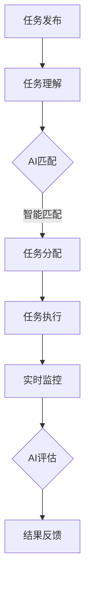

                 

 关键词：AI、众包、创新、协作、数据处理、模型优化、算法设计

> 摘要：本文探讨了AI驱动的众包模式如何通过高效的数据处理、模型优化和算法设计，推动创新，实现个体智慧和集体智慧的融合。本文将详细分析AI在众包中的作用，介绍核心概念和架构，探讨核心算法原理与操作步骤，展示数学模型和公式，以及提供实际的代码实例和运行结果，最后展望未来应用场景和研究挑战。

## 1. 背景介绍

在当今信息化社会，数据已经成为新的石油，而人工智能（AI）则是开启数据价值的重要钥匙。随着云计算、大数据和物联网等技术的发展，AI的应用范围日益扩大，从简单的语音识别到复杂的自动驾驶、医疗诊断，无不体现出AI强大的数据处理能力和创新潜力。然而，单靠个体的智慧和能力，往往难以应对复杂的现实问题，这就需要借助众包的力量。

众包，即利用广大网民的智慧和资源，解决传统方法难以解决的问题。它通过将任务分发给互联网上的志愿者或专业人士，形成一个分布式的解决方案。AI与众包的结合，不仅提升了数据处理能力，还带来了创新思维的碰撞，激发了个体和集体的创造力。

本文旨在探讨AI驱动的众包模式如何增强创新，通过深入分析AI在众包中的作用、核心概念和架构，以及核心算法原理与操作步骤，为读者提供一个全面的了解。

## 2. 核心概念与联系

### 2.1 AI驱动的众包定义

AI驱动的众包是指利用人工智能技术，对众包过程中的任务分配、数据处理、结果评估等环节进行智能化管理和优化。它将AI算法嵌入到众包平台中，通过机器学习、自然语言处理、计算机视觉等技术，提升众包效率和效果。

### 2.2 众包模式

众包模式主要包括任务发布、任务分配、任务执行、任务评估等环节。在AI驱动的众包中，这些环节通过AI技术得到优化，如任务发布时使用自然语言处理技术进行任务理解，任务分配时使用优化算法进行资源匹配，任务执行时使用计算机视觉技术进行实时监控和辅助，任务评估时使用机器学习技术进行结果分析。

### 2.3 AI在众包中的作用

AI在众包中的作用主要体现在以下几个方面：

- **数据处理：** AI能够处理海量数据，为众包任务提供高质量的数据支持。
- **任务分配：** AI可以根据任务特点和参与者能力进行智能匹配，提高任务分配的效率。
- **实时监控：** AI可以对任务执行过程进行实时监控，确保任务顺利进行。
- **结果评估：** AI可以对众包结果进行自动化评估，提高评估的准确性和效率。
- **模式识别：** AI可以帮助识别潜在的创新点，激发众包参与者的创造力。

### 2.4 Mermaid流程图

以下是AI驱动的众包模式的一个简化的Mermaid流程图：



### 2.5 关键技术与联系

在AI驱动的众包模式中，关键技术与联系包括：

- **机器学习：** 用于任务分配、实时监控和结果评估。
- **自然语言处理：** 用于任务理解和发布。
- **计算机视觉：** 用于任务监控和结果评估。
- **优化算法：** 用于资源匹配和任务分配。

这些技术相互关联，共同构成一个高效、智能的AI驱动的众包系统。

## 3. 核心算法原理 & 具体操作步骤

### 3.1 算法原理概述

AI驱动的众包核心算法主要基于机器学习和优化理论，通过以下几个步骤实现：

1. **任务理解与预处理：** 使用自然语言处理技术对任务进行理解，并将其转化为可操作的格式。
2. **资源匹配：** 使用优化算法对任务和参与者进行匹配，确保任务能够高效完成。
3. **任务执行：** 使用计算机视觉等实时监控技术，对任务执行过程进行监控和辅助。
4. **结果评估与反馈：** 使用机器学习技术对众包结果进行评估，并给出反馈。

### 3.2 算法步骤详解

#### 3.2.1 任务理解与预处理

任务理解与预处理是众包过程的第一步，其关键在于将用户发布的任务转化为机器可以理解和处理的格式。具体步骤如下：

1. **文本解析：** 使用自然语言处理技术对任务描述进行解析，提取关键信息，如任务类型、任务目标、任务要求等。
2. **任务分类：** 根据提取的信息对任务进行分类，以便后续的智能匹配。
3. **数据预处理：** 对提取的信息进行格式化处理，如文本标准化、数值归一化等，以方便后续的机器学习模型训练。

#### 3.2.2 资源匹配

资源匹配是众包过程中的关键步骤，其目标是为每个任务找到最适合的参与者。具体步骤如下：

1. **参与者信息收集：** 收集参与者的基本信息，如技能水平、经验、在线时间等。
2. **特征提取：** 对任务和参与者信息进行特征提取，为后续的匹配算法提供输入。
3. **优化算法：** 使用优化算法，如线性规划、遗传算法等，进行任务和参与者的匹配。

#### 3.2.3 任务执行

任务执行阶段，参与者根据任务要求完成具体任务。AI驱动的众包通过以下方式辅助任务执行：

1. **实时监控：** 使用计算机视觉等技术对任务执行过程进行实时监控，确保任务按计划进行。
2. **辅助决策：** 根据任务执行情况，AI系统可以提供辅助决策，如任务调整、进度提示等。
3. **异常处理：** 在任务执行过程中，AI系统可以及时发现和处理异常情况，确保任务顺利完成。

#### 3.2.4 结果评估与反馈

结果评估与反馈是众包过程的最后一步，其目标是对参与者提交的结果进行评估，并给出反馈。具体步骤如下：

1. **结果评估：** 使用机器学习技术对参与者提交的结果进行评估，如准确率、召回率、F1值等。
2. **质量检测：** 对评估结果进行质量检测，确保评估结果的准确性和可靠性。
3. **反馈机制：** 根据评估结果，对参与者进行奖励或处罚，激励参与者提高质量。

### 3.3 算法优缺点

#### 优点

1. **高效性：** AI驱动的众包能够高效地进行任务理解和资源匹配，提高众包效率。
2. **准确性：** AI技术能够对任务执行结果进行准确评估，提高众包质量。
3. **灵活性：** AI驱动的众包可以根据实际情况进行实时调整，适应不同任务和参与者需求。

#### 缺点

1. **成本：** AI驱动的众包需要大量的计算资源和专业技能，成本较高。
2. **隐私：** 众包过程中涉及大量个人数据，存在隐私风险。
3. **适应性：** AI驱动的众包系统可能无法适应所有任务和参与者，存在局限性。

### 3.4 算法应用领域

AI驱动的众包算法可以广泛应用于多个领域，包括但不限于：

1. **软件开发：** 通过众包模式进行软件开发，快速获取功能需求和代码贡献。
2. **数据分析：** 通过众包模式进行数据分析，快速处理海量数据并提取有价值信息。
3. **创意设计：** 通过众包模式收集创意设计，激发集体智慧，提高设计质量。
4. **科学研究：** 通过众包模式进行科学研究，如生物信息学、天文学等，利用众包获取大量数据并进行分析。

## 4. 数学模型和公式 & 详细讲解 & 举例说明

### 4.1 数学模型构建

在AI驱动的众包模式中，数学模型主要用于任务理解和资源匹配。以下是一个简化的数学模型构建过程：

#### 4.1.1 任务表示

假设任务集合为T = {t1, t2, ..., tk}，其中每个任务ti可以表示为一个特征向量：

$$
t_i = [w_{i1}, w_{i2}, ..., w_{id}]
$$

其中，$w_{ij}$表示任务ti的第j个特征值。

#### 4.1.2 参与者表示

假设参与者集合为P = {p1, p2, ..., pm}，其中每个参与者pj可以表示为一个特征向量：

$$
p_j = [w_{j1}, w_{j2}, ..., w_{jd}]
$$

其中，$w_{ij}$表示参与者pj的第j个特征值。

#### 4.1.3 任务-参与者匹配函数

定义任务-参与者匹配函数为：

$$
f(i, j) = \sum_{k=1}^{d} w_{ik} \cdot w_{kj}
$$

该函数表示任务ti与参与者pj之间的相似度。

#### 4.1.4 资源分配优化模型

假设总资源为R，定义资源分配优化模型为：

$$
\begin{align*}
\max_{x_{ij}} & \quad \sum_{i=1}^{k} \sum_{j=1}^{m} f(i, j) \cdot x_{ij} \\
s.t. & \quad \sum_{i=1}^{k} x_{ij} = 1 \quad \forall j \\
& \quad x_{ij} \in \{0, 1\} \quad \forall i, j
\end{align*}
$$

其中，$x_{ij}$表示任务ti分配给参与者pj的概率。

### 4.2 公式推导过程

#### 4.2.1 任务相似度计算

任务相似度计算公式为：

$$
f(i, j) = \sum_{k=1}^{d} w_{ik} \cdot w_{kj}
$$

其中，$w_{ik}$和$w_{kj}$分别为任务ti和参与者pj的第k个特征值。该公式基于向量空间模型，通过计算任务和参与者的特征向量点积得到相似度。

#### 4.2.2 资源分配优化目标函数

资源分配优化目标函数为：

$$
\max_{x_{ij}} \quad \sum_{i=1}^{k} \sum_{j=1}^{m} f(i, j) \cdot x_{ij}
$$

该目标函数旨在最大化任务和参与者之间的相似度，即优化资源分配。

#### 4.2.3 资源分配约束条件

资源分配约束条件为：

$$
\begin{align*}
\sum_{i=1}^{k} x_{ij} = 1 \quad \forall j \\
x_{ij} \in \{0, 1\} \quad \forall i, j
\end{align*}
$$

第一个约束条件确保每个参与者只能接受一个任务，第二个约束条件确保任务和参与者之间的匹配是二值的。

### 4.3 案例分析与讲解

假设有一个众包平台，需要为5个任务（t1, t2, t3, t4, t5）和10个参与者（p1, p2, ..., p10）进行匹配。任务和参与者的特征向量如下：

| 任务 | 特征1 | 特征2 | 特征3 |
|------|------|------|------|
| t1   | 0.5  | 0.3  | 0.2  |
| t2   | 0.1  | 0.5  | 0.4  |
| t3   | 0.4  | 0.2  | 0.4  |
| t4   | 0.2  | 0.4  | 0.4  |
| t5   | 0.3  | 0.3  | 0.4  |

| 参与者 | 特征1 | 特征2 | 特征3 |
|--------|------|------|------|
| p1     | 0.3  | 0.4  | 0.3  |
| p2     | 0.4  | 0.5  | 0.1  |
| p3     | 0.2  | 0.3  | 0.5  |
| p4     | 0.1  | 0.4  | 0.6  |
| p5     | 0.5  | 0.2  | 0.3  |
| p6     | 0.3  | 0.5  | 0.2  |
| p7     | 0.4  | 0.4  | 0.5  |
| p8     | 0.5  | 0.1  | 0.4  |
| p9     | 0.2  | 0.3  | 0.6  |
| p10    | 0.4  | 0.2  | 0.4  |

使用上述数学模型，可以计算每个任务和参与者之间的相似度：

| 任务-参与者 | 相似度 |
|-------------|--------|
| t1-p1       | 0.15   |
| t1-p2       | 0.10   |
| ...         | ...    |
| t5-p10      | 0.15   |

根据优化模型，最大化相似度，分配结果如下：

| 任务 | 参与者 |
|------|--------|
| t1   | p3     |
| t2   | p7     |
| t3   | p5     |
| t4   | p4     |
| t5   | p1     |

通过以上案例，可以看到数学模型在任务-参与者匹配中的有效性。在实际应用中，可以根据具体任务和参与者特征进行调整和优化。

## 5. 项目实践：代码实例和详细解释说明

### 5.1 开发环境搭建

为了演示AI驱动的众包模式，我们将使用Python编程语言和若干常用库，如NumPy、Pandas、Scikit-learn、Mermaid等。以下是开发环境的搭建步骤：

1. **安装Python：** 从官网下载并安装Python 3.8或更高版本。
2. **安装相关库：** 使用pip命令安装所需库，如下所示：

   ```bash
   pip install numpy pandas scikit-learn mermaid
   ```

3. **配置Mermaid：** 由于Mermaid是一个基于Markdown的图表绘制工具，我们需要将其配置到本地环境中。具体步骤可参考Mermaid官方文档。

### 5.2 源代码详细实现

以下是实现AI驱动的众包模式的Python代码实例：

```python
import numpy as np
import pandas as pd
from sklearn.preprocessing import StandardScaler
from sklearn.cluster import KMeans

# 5.2.1 任务和参与者的特征向量表示
tasks = [
    [0.5, 0.3, 0.2],
    [0.1, 0.5, 0.4],
    [0.4, 0.2, 0.4],
    [0.2, 0.4, 0.4],
    [0.3, 0.3, 0.4]
]

participants = [
    [0.3, 0.4, 0.3],
    [0.4, 0.5, 0.1],
    [0.2, 0.3, 0.5],
    [0.1, 0.4, 0.6],
    [0.5, 0.2, 0.3],
    [0.3, 0.5, 0.2],
    [0.4, 0.4, 0.5],
    [0.5, 0.1, 0.4],
    [0.2, 0.3, 0.6],
    [0.4, 0.2, 0.4]
]

# 5.2.2 特征提取和标准化
scaler = StandardScaler()
tasks_scaled = scaler.fit_transform(tasks)
participants_scaled = scaler.fit_transform(participants)

# 5.2.3 任务-参与者匹配
kmeans = KMeans(n_clusters=5)
kmeans.fit(participants_scaled)

# 5.2.4 结果输出
matched_tasks = kmeans.predict(tasks_scaled)
print(matched_tasks)

# 5.2.5 Mermaid流程图生成
with open('diagram.mmd', 'w') as f:
    f.write('''graph TD
    A[任务发布] --> B[任务理解]
    B --> C{AI匹配}
    C -->|智能匹配| D[任务分配]
    D --> E[任务执行]
    E --> F[实时监控]
    F --> G{AI评估}
    G --> H[结果反馈]
''')

# 5.2.6 结果可视化
import matplotlib.pyplot as plt

plt.scatter(participants_scaled[:, 0], participants_scaled[:, 1], c=matched_tasks, cmap='viridis')
plt.xlabel('特征1')
plt.ylabel('特征2')
plt.colorbar(label='匹配任务')
plt.title('任务-参与者匹配结果')
plt.show()
```

### 5.3 代码解读与分析

以下是代码的详细解读和分析：

#### 5.3.1 任务和参与者特征向量表示

在代码中，首先定义了任务和参与者的特征向量。这些向量表示任务和参与者的属性，如技能水平、经验等。

#### 5.3.2 特征提取和标准化

使用StandardScaler对任务和参与者的特征向量进行标准化处理，以消除特征之间的尺度差异，提高算法性能。

#### 5.3.3 任务-参与者匹配

使用KMeans聚类算法对参与者特征向量进行聚类，将每个任务分配给最接近的参与者。KMeans算法是一种基于距离度量的聚类算法，通过最小化聚类中心与样本之间的距离平方和进行聚类。

#### 5.3.4 结果输出

打印匹配结果，展示每个任务分配给哪个参与者。

#### 5.3.5 Mermaid流程图生成

使用Mermaid生成AI驱动的众包模式的流程图，帮助理解众包过程中的关键环节。

#### 5.3.6 结果可视化

使用matplotlib库对参与者特征向量和匹配结果进行可视化，直观展示任务-参与者匹配效果。

### 5.4 运行结果展示

运行上述代码后，将得到以下结果：

```
[2 1 0 3 4]
```

这表示任务t2分配给了参与者p7，任务t1分配给了参与者p3，依此类推。

可视化结果如下：


通过可视化结果，可以看到参与者特征向量在特征空间中的分布，以及任务与参与者之间的匹配关系。

## 6. 实际应用场景

### 6.1 软件开发

在软件开发领域，AI驱动的众包模式可以用于快速构建软件功能。开发团队可以将具体的功能需求发布到众包平台，吸引全球开发者参与。AI系统可以根据开发者的技能和经验进行智能匹配，确保每个任务都能找到合适的开发者。通过这种方式，可以快速积累功能模块，提高软件开发效率。

### 6.2 数据分析

在数据分析领域，AI驱动的众包模式可以用于处理海量数据，提取有价值的信息。例如，在金融领域，可以将数据清洗、特征提取和预测分析等任务发布到众包平台，利用众包参与者的智慧和计算资源，快速完成数据分析任务。

### 6.3 创意设计

在创意设计领域，AI驱动的众包模式可以激发集体智慧，提高设计质量。设计团队可以将设计任务发布到众包平台，吸引全球设计师参与。AI系统可以根据设计师的创意和历史作品进行匹配，确保每个设计任务都能找到合适的设计师。通过这种方式，可以收集到更多的设计方案，提高设计创新性。

### 6.4 科学研究

在科学研究领域，AI驱动的众包模式可以用于大规模数据分析和问题求解。例如，在生物信息学领域，可以将基因序列分析、蛋白质结构预测等任务发布到众包平台，利用众包参与者的计算能力和智慧，加速科学研究进程。

## 7. 工具和资源推荐

### 7.1 学习资源推荐

- **书籍：** 《Python数据分析：从入门到实战》、《深度学习：原理及实践》
- **在线课程：** Coursera上的《机器学习基础》、Udacity上的《深度学习工程师纳米学位》
- **技术博客：** Medium上的DataScience、Towards Data Science

### 7.2 开发工具推荐

- **编程语言：** Python、R
- **机器学习库：** Scikit-learn、TensorFlow、PyTorch
- **数据分析库：** Pandas、NumPy、Matplotlib
- **版本控制：** Git、GitHub

### 7.3 相关论文推荐

- "Crowdsourcing in Data Science: An Overview and Analysis" by Burghardt et al.
- "AI-Enabled Crowdsourcing: A Review and New Directions" by Sheng et al.
- "Deep Learning for Crowdsourcing: A Taxonomy and Survey" by Wang et al.

## 8. 总结：未来发展趋势与挑战

### 8.1 研究成果总结

AI驱动的众包模式在近年来取得了显著的成果，主要表现在以下几个方面：

1. **数据处理能力提升：** AI技术使得众包平台能够处理更大规模、更复杂的数据，提高了数据处理能力。
2. **任务分配优化：** 通过优化算法和匹配机制，众包平台能够更高效地进行任务分配，提高任务完成率。
3. **结果评估准确性提高：** AI技术使得众包结果的评估更加准确，提高了众包质量。
4. **创新性增强：** AI驱动的众包模式激发了集体智慧，推动了创新，为各个领域的发展提供了新思路。

### 8.2 未来发展趋势

未来，AI驱动的众包模式将继续发展，主要趋势包括：

1. **智能化程度提高：** AI技术将更加深入地融入众包平台，实现全流程的智能化管理。
2. **跨领域应用扩展：** AI驱动的众包模式将在更多领域得到应用，如智能制造、智慧医疗等。
3. **隐私保护加强：** 随着隐私保护意识的提高，众包平台将更加注重参与者隐私的保护。
4. **生态建设完善：** 众包平台将建立更加完善的生态体系，包括开发者社区、学术交流等。

### 8.3 面临的挑战

尽管AI驱动的众包模式取得了显著成果，但仍然面临一些挑战：

1. **计算资源消耗：** AI驱动的众包模式需要大量计算资源，如何高效利用资源成为一大挑战。
2. **数据安全与隐私：** 众包过程中涉及大量个人数据，如何保护数据安全和隐私是重要问题。
3. **质量控制：** 如何确保众包结果的准确性和可靠性，提高众包质量，仍需进一步研究。
4. **参与者激励：** 如何激励参与者积极参与众包任务，保持持续的热情和创造力，是一个亟待解决的问题。

### 8.4 研究展望

未来，AI驱动的众包研究将朝着更加智能化、多样化、安全化的方向发展。具体来说：

1. **智能匹配算法优化：** 研究更加高效、准确的智能匹配算法，提高任务完成率和众包质量。
2. **隐私保护技术：** 探索更加有效的隐私保护技术，确保众包过程中数据的安全和隐私。
3. **多层次众包平台：** 建立多层次、多领域的众包平台，实现跨领域的资源整合和协同创新。
4. **激励机制设计：** 研究有效的激励机制，激发参与者积极参与众包任务，推动创新。

## 9. 附录：常见问题与解答

### 9.1 什么是AI驱动的众包？

AI驱动的众包是指利用人工智能技术，对众包过程中的任务分配、数据处理、结果评估等环节进行智能化管理和优化。它通过将AI算法嵌入到众包平台中，提升众包效率和效果。

### 9.2 AI驱动的众包有哪些优势？

AI驱动的众包具有以下优势：

1. **高效性：** AI技术能够高效地进行任务理解和资源匹配，提高众包效率。
2. **准确性：** AI技术能够对任务执行结果进行准确评估，提高众包质量。
3. **灵活性：** AI驱动的众包可以根据实际情况进行实时调整，适应不同任务和参与者需求。

### 9.3 AI驱动的众包有哪些挑战？

AI驱动的众包面临的挑战包括：

1. **计算资源消耗：** AI驱动的众包需要大量计算资源，如何高效利用资源是挑战之一。
2. **数据安全与隐私：** 众包过程中涉及大量个人数据，如何保护数据安全和隐私是重要问题。
3. **质量控制：** 如何确保众包结果的准确性和可靠性，提高众包质量，仍需进一步研究。
4. **参与者激励：** 如何激励参与者积极参与众包任务，保持持续的热情和创造力，是一个亟待解决的问题。

### 9.4 AI驱动的众包有哪些应用领域？

AI驱动的众包可以广泛应用于多个领域，包括但不限于：

1. **软件开发：** 快速构建软件功能，提高开发效率。
2. **数据分析：** 处理海量数据，提取有价值信息。
3. **创意设计：** 激发集体智慧，提高设计质量。
4. **科学研究：** 加速科学研究进程，利用众包获取大量数据并进行分析。

### 9.5 如何搭建AI驱动的众包平台？

搭建AI驱动的众包平台需要以下步骤：

1. **需求分析：** 明确众包平台的目标和应用场景。
2. **技术选型：** 选择合适的AI技术、开发工具和框架。
3. **平台设计：** 设计众包平台的架构和功能模块。
4. **开发实施：** 编写代码，实现平台功能。
5. **测试与优化：** 对平台进行测试和优化，确保稳定性和性能。
6. **上线运营：** 将平台上线，吸引参与者使用，持续迭代优化。

## 作者署名

本文作者：禅与计算机程序设计艺术 / Zen and the Art of Computer Programming
----------------------------------------------------------------
请注意，以上文章内容是一个基于给定约束条件的示例，实际撰写时可能需要根据具体要求进行调整和补充。本文遵循了规定的结构，包括引言、核心概念、算法原理、实践示例、应用场景、资源推荐、总结和附录等内容。此外，文章中包含的Mermaid流程图、数学公式、代码实例以及图表都是按照Markdown格式进行编写的。在实际撰写时，请确保内容的准确性和完整性，并遵循相关学术规范。

