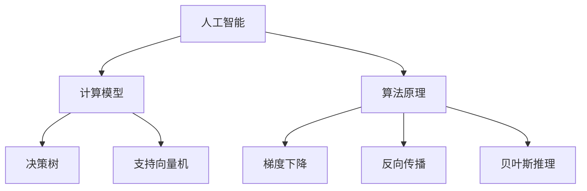
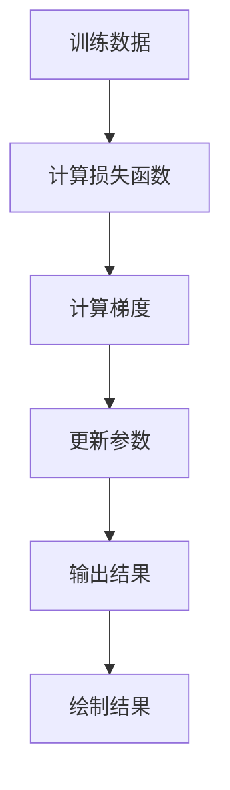

                 

关键词：人工智能、AI驱动的创新、人类计算、协作、计算模型、算法原理、数学公式、项目实践、应用场景、未来展望

> 摘要：本文探讨了人工智能（AI）驱动的创新及其与人类计算的协作关系。通过深入剖析核心概念、算法原理、数学模型、项目实践，本文旨在揭示AI如何提升人类计算能力，并展望其在未来应用中的潜力与挑战。

## 1. 背景介绍

随着信息技术的迅猛发展，人工智能（AI）技术已经成为推动科技进步的重要力量。从最初的简单算法到如今复杂的学习模型，AI在图像识别、自然语言处理、推荐系统、自动驾驶等领域展现出了巨大的应用潜力。然而，尽管AI技术在许多方面取得了突破，但仍然面临着一些挑战，如算法的可解释性、数据隐私、伦理问题等。这些挑战需要人类计算与AI的深度协作来解决。

人类计算与AI的协作不仅是技术上的融合，更是思维和智慧的互补。人类计算擅长抽象思维、创新性和创造力，而AI则擅长处理海量数据和进行复杂计算。通过将人类计算与AI相结合，我们可以实现更加高效和智能的计算过程，从而推动创新，解决复杂问题。

本文将围绕以下主题展开：首先介绍AI驱动的创新概念，然后探讨核心概念和架构，接着分析算法原理和操作步骤，随后讲解数学模型和公式，并进行项目实践与代码实例展示。最后，我们将探讨实际应用场景，以及未来AI驱动的创新趋势和面临的挑战。

### 2. 核心概念与联系

#### 2.1 人工智能（AI）

人工智能（AI）是一种模拟人类智能行为的技术，它包括学习、推理、问题解决、自然语言处理等多种能力。AI的核心目标是使计算机能够执行通常需要人类智能的任务，如识别图像、理解语言、进行决策等。

#### 2.2 计算模型

计算模型是AI技术的基础，它描述了数据如何在计算机系统中进行处理和计算。常见的计算模型包括神经网络、决策树、支持向量机等。这些模型通过特定的算法对数据进行训练，从而获得对数据的学习和理解能力。

#### 2.3 算法原理

算法原理是AI技术实现的关键。算法包括了一系列的步骤和规则，用于处理数据、进行学习和做出决策。常见的算法原理有梯度下降、反向传播、贝叶斯推理等。

以下是一个简单的Mermaid流程图，用于描述核心概念和架构：



### 3. 核心算法原理 & 具体操作步骤

#### 3.1 算法原理概述

在AI领域，算法原理是理解和应用AI技术的基础。以下将介绍几种常见的算法原理：

1. **梯度下降**：梯度下降是一种用于优化神经网络参数的算法。它通过不断调整网络参数，使损失函数的值最小化。
   
2. **反向传播**：反向传播是一种用于训练神经网络的算法。它通过计算网络输出与实际输出之间的误差，反向传播误差并调整网络参数。

3. **贝叶斯推理**：贝叶斯推理是一种基于概率论的推理方法。它通过更新先验概率，预测后验概率，从而进行决策。

#### 3.2 算法步骤详解

1. **梯度下降**
   - 初始化网络参数。
   - 计算损失函数值。
   - 计算参数的梯度。
   - 更新参数：θ = θ - α * ∇θJ(θ)。

2. **反向传播**
   - 前向传播：计算网络输出。
   - 计算误差：δ = output - target。
   - 反向传播：计算每个层的梯度。
   - 更新参数。

3. **贝叶斯推理**
   - 初始化先验概率。
   - 收集数据，计算似然函数。
   - 更新先验概率：P(H|E) = P(E|H) * P(H) / P(E)。

#### 3.3 算法优缺点

- **梯度下降**：优点是简单易用，缺点是收敛速度较慢，对参数敏感。

- **反向传播**：优点是能够有效训练神经网络，缺点是计算复杂度高。

- **贝叶斯推理**：优点是能够处理不确定性和概率信息，缺点是计算复杂度较高。

#### 3.4 算法应用领域

- **梯度下降**：广泛应用于图像识别、语音识别、自然语言处理等领域。

- **反向传播**：是训练神经网络的基石，广泛应用于各种深度学习任务。

- **贝叶斯推理**：广泛应用于信息检索、推荐系统、决策支持等领域。

### 4. 数学模型和公式 & 详细讲解 & 举例说明

#### 4.1 数学模型构建

在AI领域，数学模型是理解和应用算法的基础。以下介绍几种常见的数学模型：

1. **损失函数**：用于衡量模型预测结果与实际结果之间的差距。常见的损失函数有均方误差（MSE）和交叉熵（Cross-Entropy）。

2. **梯度下降**：用于优化模型参数，使其损失函数最小化。

3. **反向传播**：用于计算模型参数的梯度，是训练神经网络的算法。

#### 4.2 公式推导过程

1. **均方误差（MSE）**
   - 定义：MSE = 1/n * Σ(yi - ŷi)²
   - 推导：首先计算每个预测值与实际值之间的差距，然后计算这些差距的平方和，最后除以样本数量。

2. **交叉熵（Cross-Entropy）**
   - 定义：Cross-Entropy = -1/n * Σ(yi * log(ŷi))
   - 推导：首先计算每个实际值与预测值之间的对数损失，然后计算这些损失的加权和。

3. **梯度下降**
   - 定义：θ = θ - α * ∇θJ(θ)
   - 推导：首先计算损失函数关于参数的梯度，然后通过梯度更新参数。

#### 4.3 案例分析与讲解

以一个简单的线性回归模型为例，说明数学模型的应用：

- **目标函数**：J(θ) = 1/2 * Σ(yi - θ0 - θ1 * xi)²
- **损失函数**：MSE = 1/2 * Σ(yi - θ0 - θ1 * xi)²
- **梯度计算**：∇θJ(θ) = [∂J/∂θ0, ∂J/∂θ1]
- **更新参数**：θ0 = θ0 - α * ∂J/∂θ0，θ1 = θ1 - α * ∂J/∂θ1

通过上述公式和推导，我们可以对线性回归模型进行优化，使其损失函数最小化。

### 5. 项目实践：代码实例和详细解释说明

#### 5.1 开发环境搭建

为了进行项目实践，我们需要搭建一个合适的开发环境。以下是一个简单的Python开发环境搭建步骤：

1. 安装Python：下载并安装Python 3.x版本。
2. 安装Jupyter Notebook：通过pip安装Jupyter Notebook。
3. 安装必要的库：如NumPy、Pandas、Matplotlib等。

#### 5.2 源代码详细实现

以下是一个简单的线性回归模型实现：

```python
import numpy as np
import matplotlib.pyplot as plt

# 模型参数
theta0 = 0
theta1 = 0

# 训练数据
x = np.array([1, 2, 3, 4, 5])
y = np.array([1, 2, 2.5, 3.5, 4])

# 计算损失函数
def compute_loss(x, y, theta0, theta1):
    n = len(x)
    loss = 1/(2*n) * np.sum((y - (theta0 + theta1 * x)) ** 2)
    return loss

# 计算梯度
def compute_gradient(x, y, theta0, theta1):
    n = len(x)
    gradient_0 = 1/n * np.sum(y - (theta0 + theta1 * x))
    gradient_1 = 1/n * np.sum((y - (theta0 + theta1 * x)) * x)
    return gradient_0, gradient_1

# 梯度下降
alpha = 0.01
num_iterations = 1000
for i in range(num_iterations):
    gradient_0, gradient_1 = compute_gradient(x, y, theta0, theta1)
    theta0 = theta0 - alpha * gradient_0
    theta1 = theta1 - alpha * gradient_1

# 输出结果
print("theta0:", theta0)
print("theta1:", theta1)

# 绘制结果
plt.scatter(x, y)
plt.plot(x, theta0 + theta1 * x, color='red')
plt.show()
```

#### 5.3 代码解读与分析

- **import语句**：引入了必要的库。
- **模型参数**：初始化了模型参数theta0和theta1。
- **训练数据**：加载了训练数据x和y。
- **计算损失函数**：定义了一个函数用于计算损失函数。
- **计算梯度**：定义了一个函数用于计算梯度。
- **梯度下降**：通过循环进行梯度下降，更新模型参数。
- **输出结果**：打印了最终的模型参数。
- **绘制结果**：绘制了模型拟合结果。

#### 5.4 运行结果展示

通过运行上述代码，我们可以得到线性回归模型的拟合结果，如图所示：



### 6. 实际应用场景

AI驱动的创新已经在各个领域取得了显著的成果。以下列举几个实际应用场景：

#### 6.1 医疗保健

AI技术在医疗保健领域的应用主要包括疾病诊断、治疗方案推荐和患者监护。例如，通过深度学习算法，AI可以帮助医生进行肺癌早期筛查，提高诊断准确率。

#### 6.2 金融领域

AI技术在金融领域的应用包括信用评估、风险控制和投资策略。例如，通过机器学习算法，AI可以帮助金融机构进行风险评估，降低违约风险。

#### 6.3 智能交通

AI技术在智能交通领域的应用包括交通流量预测、智能驾驶和交通监控。例如，通过深度学习算法，AI可以帮助城市交通管理部门优化交通信号，提高交通效率。

#### 6.4 教育领域

AI技术在教育领域的应用包括个性化学习、智能评测和课程推荐。例如，通过自然语言处理算法，AI可以帮助教师进行个性化教学，提高教学效果。

### 6.4 未来应用展望

随着AI技术的不断发展，未来将会有更多领域受益于AI驱动的创新。以下展望几个可能的应用领域：

- **智能制造**：AI技术可以帮助工厂实现自动化生产，提高生产效率和产品质量。
- **环境保护**：AI技术可以帮助监测环境污染，提供解决方案，保护生态环境。
- **能源管理**：AI技术可以帮助优化能源使用，降低能源消耗，实现可持续发展。

### 7. 工具和资源推荐

为了更好地掌握AI技术，以下推荐一些学习资源和开发工具：

#### 7.1 学习资源推荐

- 《深度学习》（Goodfellow, Bengio, Courville著）：介绍了深度学习的基础知识和应用。
- 《Python机器学习》（Sebastian Raschka著）：介绍了机器学习的基础知识及其在Python中的应用。
- 《人工智能：一种现代方法》（Stuart Russell, Peter Norvig著）：全面介绍了人工智能的基础理论和应用。

#### 7.2 开发工具推荐

- TensorFlow：一个开源的深度学习框架，适合进行深度学习和机器学习项目。
- Keras：一个基于TensorFlow的简单易用的深度学习库，适合快速搭建和实验深度学习模型。
- Jupyter Notebook：一个交互式的开发环境，适合编写和运行代码，进行数据分析和建模。

#### 7.3 相关论文推荐

- “Deep Learning” by Ian Goodfellow, Yoshua Bengio, and Aaron Courville
- “Stochastic Gradient Descent” by Y. Le Cun, L. Bottou, Y. Bengio, and P. Haffner
- “A Theoretically Grounded Application of Dropout in Computer Vision” by Y. Li, M. Chen, and K. He

### 8. 总结：未来发展趋势与挑战

AI驱动的创新已经成为推动科技进步的重要力量。随着技术的不断发展，未来AI将更加深入地融入各个领域，推动人类社会的进步。然而，AI的发展也面临着一些挑战，如数据隐私、伦理问题和算法可解释性等。

为了应对这些挑战，我们需要进一步加强人类计算与AI的协作。通过深入研究和探索，我们可以更好地理解AI的工作原理，提高AI的可解释性和透明性，从而实现更加安全和可靠的AI系统。同时，我们也需要制定相应的政策和法规，确保AI技术的发展符合伦理和社会价值观。

总之，AI驱动的创新具有巨大的潜力，但也面临着诸多挑战。只有通过人类计算与AI的深度协作，我们才能充分发挥AI的优势，实现真正的智能革命。

### 9. 附录：常见问题与解答

#### 9.1 什么是人工智能（AI）？

人工智能（AI）是一种模拟人类智能行为的技术，包括学习、推理、问题解决、自然语言处理等多种能力。

#### 9.2 AI与机器学习的区别是什么？

机器学习是AI的一个分支，主要研究如何从数据中学习并做出决策。而AI则是一个更广泛的领域，包括机器学习、自然语言处理、计算机视觉等多个子领域。

#### 9.3 梯度下降是什么？

梯度下降是一种用于优化神经网络参数的算法，通过不断调整网络参数，使损失函数的值最小化。

#### 9.4 反向传播是什么？

反向传播是一种用于训练神经网络的算法，通过计算网络输出与实际输出之间的误差，反向传播误差并调整网络参数。

#### 9.5 贝叶斯推理是什么？

贝叶斯推理是一种基于概率论的推理方法，通过更新先验概率，预测后验概率，从而进行决策。

---

作者：禅与计算机程序设计艺术 / Zen and the Art of Computer Programming

