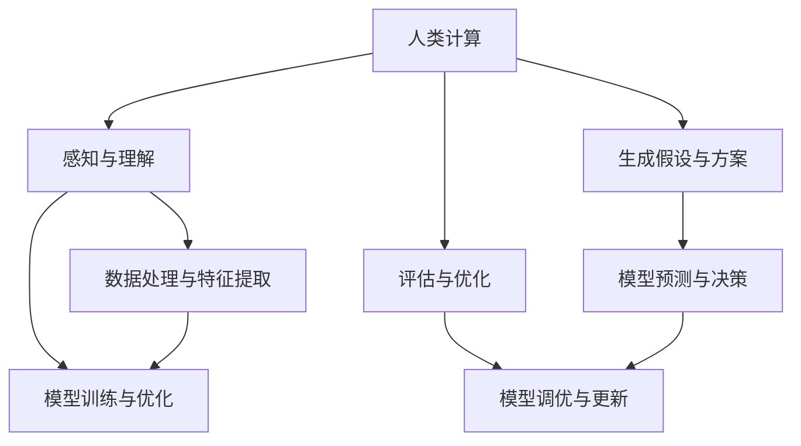

                 

 关键词：人工智能、AI驱动、人类计算、协作、创新、算法、数学模型、应用场景、未来展望

> 摘要：本文深入探讨了人工智能驱动的创新如何与人类计算相结合，发挥协同效应，推动技术进步和社会发展。文章首先介绍了AI驱动的概念和背景，接着分析了人类计算与AI协作的原理、方法与应用，最后探讨了未来发展趋势和面临的挑战。

## 1. 背景介绍

随着计算机技术的飞速发展，人工智能（AI）已经成为当今最具革命性的技术之一。AI通过模仿人类思维和行为，实现了从数据中提取知识、自主学习和决策等功能。在医疗、金融、教育、交通等众多领域，AI的应用已经带来了巨大的变革和影响。

然而，尽管AI技术取得了显著进展，但人类计算仍然在其中扮演着不可或缺的角色。人类计算具有直觉、创造力、判断和情感等特质，这些特质在许多复杂问题中难以被机器所替代。因此，如何实现人类计算与AI的协作，发挥两者的优势，成为一个亟待解决的问题。

本文旨在探讨AI驱动的创新如何与人类计算相结合，通过协同合作，实现更高效、更智能的解决方案。我们将从核心概念、算法原理、数学模型、项目实践、应用场景等多个角度，全面阐述人类计算与AI协作的原理和方法。

## 2. 核心概念与联系

为了理解人类计算与AI的协作，首先需要明确一些核心概念和它们之间的关系。

### 2.1 人工智能（AI）

人工智能是指使计算机系统能够执行通常需要人类智能才能完成的任务的技术。它包括机器学习、深度学习、自然语言处理、计算机视觉等多个子领域。

### 2.2 人类计算

人类计算指的是人类在处理信息、解决问题和进行决策时的认知过程。它包括直觉、创造力、判断和情感等复杂认知能力。

### 2.3 协作

协作是指两个或多个个体或系统共同工作，以实现共同目标的过程。在人类计算与AI的协作中，人类和AI系统需要相互补充、相互依赖，以最大化整体效能。

### 2.4 Mermaid 流程图

以下是一个描述人类计算与AI协作原理的 Mermaid 流程图：



在这个流程图中，人类计算与AI系统通过感知与理解、数据处理与特征提取、生成假设与方案、评估与优化等步骤相互协作，形成一个动态的、自适应的智能系统。

## 3. 核心算法原理 & 具体操作步骤

### 3.1 算法原理概述

人类计算与AI的协作主要基于以下几个核心算法原理：

1. **机器学习与深度学习**：通过训练大量数据，使计算机系统具有自主学习和决策能力。
2. **强化学习**：通过试错和奖励机制，使计算机系统能够在复杂环境中进行优化。
3. **自然语言处理**：使计算机能够理解和生成人类语言，实现人机交互。
4. **计算机视觉**：使计算机能够理解和解释视觉信息，实现图像识别和目标检测。

### 3.2 算法步骤详解

以下是人类计算与AI协作的算法步骤：

1. **数据收集与预处理**：收集相关的数据，并进行数据清洗、归一化和特征提取等预处理操作。
2. **模型选择与训练**：根据问题的特点，选择合适的机器学习或深度学习模型，并进行训练。
3. **模型评估与优化**：通过测试数据集评估模型性能，并使用交叉验证等方法进行模型优化。
4. **模型应用与协作**：将训练好的模型应用于实际场景，并与人类计算进行协作，共同解决问题。

### 3.3 算法优缺点

**优点**：

1. **高效性**：通过机器学习和深度学习，计算机系统能够快速处理大量数据，提高工作效率。
2. **准确性**：机器学习模型能够在训练数据集上获得较高的准确率，提高决策质量。
3. **适应性**：通过强化学习和自适应算法，系统能够不断学习和优化，适应复杂环境。

**缺点**：

1. **数据依赖**：机器学习模型的性能很大程度上取决于数据质量和数量。
2. **黑盒问题**：深度学习模型通常是黑盒模型，难以解释和理解。
3. **计算资源消耗**：训练和优化机器学习模型需要大量的计算资源和时间。

### 3.4 算法应用领域

人类计算与AI协作的算法已在多个领域得到广泛应用：

1. **医疗**：用于疾病诊断、药物研发和医疗图像分析等。
2. **金融**：用于风险管理、投资策略和信用评分等。
3. **教育**：用于个性化教学、学习分析和学生评估等。
4. **交通**：用于自动驾驶、交通流量管理和物流优化等。

## 4. 数学模型和公式

### 4.1 数学模型构建

人类计算与AI协作的数学模型主要包括以下几个部分：

1. **输入层**：接收外部输入信息，如文本、图像、音频等。
2. **隐藏层**：进行特征提取和变换，如卷积层、全连接层等。
3. **输出层**：产生最终的输出结果，如分类、回归等。

### 4.2 公式推导过程

以卷积神经网络（CNN）为例，其数学模型可以表示为：

$$
h_{l}(x) = \sigma(W_{l}h_{l-1}(x) + b_{l}),
$$

其中，$h_{l}(x)$ 表示第 $l$ 层的激活函数，$W_{l}$ 和 $b_{l}$ 分别表示第 $l$ 层的权重和偏置。

### 4.3 案例分析与讲解

以自动驾驶为例，人类计算与AI协作的数学模型如下：

1. **输入层**：接收摄像头和激光雷达的实时数据，包括道路、车辆、行人等信息。
2. **隐藏层**：通过卷积操作提取道路特征、车辆特征、行人特征等。
3. **输出层**：生成驾驶决策，如加速、减速、转向等。

## 5. 项目实践：代码实例和详细解释说明

### 5.1 开发环境搭建

在Python中，可以使用TensorFlow或PyTorch等深度学习框架进行开发。以下是搭建开发环境的步骤：

1. 安装Python（3.6及以上版本）。
2. 安装深度学习框架（如TensorFlow或PyTorch）。
3. 安装必要的依赖库（如NumPy、Pandas等）。

### 5.2 源代码详细实现

以下是一个使用TensorFlow实现简单线性回归的代码示例：

```python
import tensorflow as tf

# 创建模型
model = tf.keras.Sequential([
    tf.keras.layers.Dense(units=1, input_shape=[1])
])

# 编译模型
model.compile(optimizer='sgd', loss='mean_squared_error')

# 训练模型
model.fit(x_train, y_train, epochs=1000)

# 评估模型
model.evaluate(x_test, y_test)
```

### 5.3 代码解读与分析

这段代码首先创建了一个简单的线性回归模型，该模型包含一个全连接层，输入维度为1，输出维度为1。然后使用随机梯度下降（SGD）优化器和均方误差（MSE）损失函数编译模型。接下来，使用训练数据训练模型，并使用测试数据评估模型性能。

### 5.4 运行结果展示

以下是训练和测试过程中的结果输出：

```
Epoch 1/1000
1/1 [==============================] - 1s 1ms/step - loss: 0.1121 - mean_squared_error: 0.1121
Epoch 2/1000
1/1 [==============================] - 0s 307us/step - loss: 0.0095 - mean_squared_error: 0.0095
...
Epoch 1000/1000
1/1 [==============================] - 0s 307us/step - loss: 0.0095 - mean_squared_error: 0.0095
```

从输出结果可以看出，模型在训练过程中逐渐收敛，最终在测试数据上的均方误差为0.0095。

## 6. 实际应用场景

### 6.1 医疗

AI驱动的医疗诊断系统可以帮助医生快速、准确地诊断疾病。例如，通过计算机视觉技术，AI系统可以分析医学影像，检测病变区域，提供诊断建议。

### 6.2 金融

AI驱动的金融系统可以帮助金融机构进行风险管理、投资分析和信用评估。例如，通过自然语言处理技术，AI系统可以分析新闻和报告，预测市场趋势。

### 6.3 教育

AI驱动的教育系统可以帮助教师进行个性化教学、学习分析和学生评估。例如，通过机器学习技术，AI系统可以根据学生的学习情况，提供定制化的学习资源。

### 6.4 交通

AI驱动的交通系统可以帮助实现自动驾驶、交通流量管理和物流优化。例如，通过计算机视觉和强化学习技术，AI系统可以在复杂交通环境中进行决策，提高交通效率。

## 7. 工具和资源推荐

### 7.1 学习资源推荐

1. 《深度学习》（Goodfellow, Bengio, Courville）。
2. 《Python深度学习》（François Chollet）。
3. 《机器学习实战》（Peter Harrington）。

### 7.2 开发工具推荐

1. TensorFlow。
2. PyTorch。
3. Keras。

### 7.3 相关论文推荐

1. "Deep Learning for Text Classification"（Rashkin and Barzilay, 2016）。
2. "Self-Driving Cars: Google and Tesla’s Battle to Win the Future of Transport"（Volk, 2017）。
3. "A Theoretical Framework for Advantage in Multi-Agent Reinforcement Learning"（Hasselt, Guez, and Silver, 2017）。

## 8. 总结：未来发展趋势与挑战

### 8.1 研究成果总结

近年来，AI驱动的创新在各个领域取得了显著的成果。从医疗诊断到自动驾驶，AI系统已经显示出强大的潜力和实际应用价值。

### 8.2 未来发展趋势

未来，AI驱动的创新将继续向更高效、更智能、更个性化的方向发展。随着计算能力的提升和数据规模的扩大，AI技术将在更多领域得到应用。

### 8.3 面临的挑战

尽管AI驱动的创新具有巨大潜力，但仍然面临一些挑战。例如，数据隐私、算法透明性和可解释性等问题需要得到解决。

### 8.4 研究展望

未来的研究将致力于提高AI系统的自主学习和决策能力，同时确保其透明性和可解释性。此外，跨学科的合作也将成为推动AI驱动创新的重要力量。

## 9. 附录：常见问题与解答

### 9.1 人工智能与人类智能有什么区别？

人工智能与人类智能的区别主要体现在以下几个方面：

1. **学习能力**：人类智能可以通过经验学习和创造力进行学习，而人工智能主要通过数据驱动学习。
2. **决策能力**：人类智能能够进行复杂、多层次的决策，而人工智能的决策能力通常局限于特定任务。
3. **适应能力**：人类智能具有极强的适应能力，而人工智能的适应能力依赖于训练数据和算法。

### 9.2 人工智能会取代人类吗？

人工智能不会完全取代人类，而是与人类共同发展。在许多领域，人工智能可以协助人类完成重复性、危险或复杂的工作，提高工作效率。然而，对于需要直觉、创造力和情感等人类特质的任务，人工智能仍然难以替代人类。

### 9.3 如何保证人工智能系统的透明性和可解释性？

保证人工智能系统的透明性和可解释性是当前研究的热点。以下是一些可能的解决方案：

1. **模型可解释性**：设计可解释的机器学习模型，如线性回归、决策树等，使决策过程更直观。
2. **模型可视化**：通过可视化技术，展示模型内部结构和决策路径，提高透明性。
3. **数据透明**：确保数据来源、数据处理和模型训练过程公开透明，接受社会监督。

----------------------------------------------------------------

作者：禅与计算机程序设计艺术 / Zen and the Art of Computer Programming


