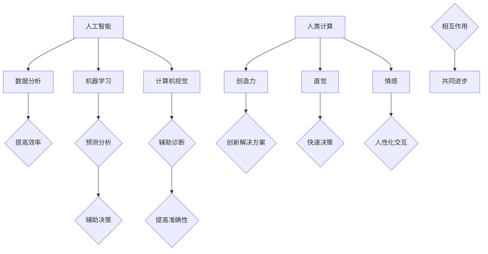

                 

关键词：人工智能，医疗行业，人类计算，应用场景，创新

摘要：随着人工智能技术的迅猛发展，其在医疗行业的应用已经越来越广泛。本文将探讨人类计算与人工智能的结合，如何推动医疗行业的创新与发展，重点分析其在诊断、治疗、药物研发等关键领域的应用场景，以及未来发展趋势与面临的挑战。

## 1. 背景介绍

近年来，人工智能（AI）已经成为全球科技领域的热点。人工智能技术通过模仿人类的学习和认知过程，为各个行业带来了巨大的变革。医疗行业作为人类生命健康的重要保障，自然也成为了人工智能技术的重点应用领域。然而，人工智能的强大计算能力虽然可以处理海量的数据，但在某些方面仍需要人类计算的参与。人类计算具有独特的直觉、创造力和判断力，能够解决人工智能无法处理的复杂问题。

本文旨在探讨人类计算在医疗行业中的应用场景，分析其如何与人工智能技术相结合，推动医疗行业的创新与发展。文章结构如下：

1. 背景介绍
2. 核心概念与联系
3. 核心算法原理与具体操作步骤
4. 数学模型与公式
5. 项目实践：代码实例与详细解释说明
6. 实际应用场景
7. 工具和资源推荐
8. 总结：未来发展趋势与挑战
9. 附录：常见问题与解答

## 2. 核心概念与联系

在探讨人类计算与人工智能的结合之前，我们先来了解一下这两个概念的核心原理及其相互关系。

### 2.1 人工智能

人工智能是指通过计算机模拟人类智能的技术。它包括机器学习、深度学习、自然语言处理、计算机视觉等多个子领域。人工智能的核心目标是让计算机具备人类一样的感知、思考、决策和行动能力。随着计算能力的提升和大数据的普及，人工智能技术在各个领域都取得了显著的成果。

### 2.2 人类计算

人类计算是指人类在解决问题过程中的思维、判断和决策能力。与人工智能不同，人类计算具有以下特点：

- **创造力**：人类能够通过联想、归纳和演绎等方式进行创造性思维，发现新的解决方案。
- **直觉**：人类能够凭借直觉快速判断问题的重要性和可能性。
- **情感**：人类在处理问题时会受到情感的影响，从而影响决策。

### 2.3 人工智能与人类计算的联系

人工智能与人类计算虽然有着不同的特点，但它们并非相互排斥，而是可以相互补充。在实际应用中，人工智能可以通过大规模数据处理和模式识别来辅助人类计算，提高其效率；而人类计算则可以为人工智能提供新的思路和方法，促进其发展。

为了更好地展示人工智能与人类计算的结合，我们使用 Mermaid 流程图来描述它们之间的相互作用关系。



通过以上流程图，我们可以看出，人工智能与人类计算在数据、模型、应用等方面相互联系，共同推动医疗行业的创新与发展。

## 3. 核心算法原理与具体操作步骤

在了解了人工智能与人类计算的核心概念与联系后，接下来我们将深入探讨医疗行业中的一些关键算法原理及其具体操作步骤。

### 3.1 算法原理概述

医疗行业中的关键算法主要涉及诊断、治疗、药物研发等领域。以下是一些典型的算法原理：

- **诊断算法**：基于机器学习和深度学习技术，通过分析医学影像、病例数据等，实现对疾病的高效、准确诊断。
- **治疗算法**：基于医学知识和患者数据，通过智能推荐、决策支持等方式，为患者提供个性化的治疗方案。
- **药物研发算法**：基于生物信息学、分子生物学等技术，通过虚拟筛选、分子动力学模拟等方式，加速药物研发进程。

### 3.2 算法步骤详解

下面以诊断算法为例，详细介绍其具体操作步骤：

#### 3.2.1 数据收集与预处理

- **数据收集**：从医学影像库、电子病历等来源获取病例数据，包括图像、文字、表格等多种数据格式。
- **数据预处理**：对收集到的数据进行清洗、去噪、归一化等处理，以便后续分析。

#### 3.2.2 特征提取与建模

- **特征提取**：从医学影像中提取与疾病相关的特征，如纹理、形状、边界等。
- **模型训练**：使用提取到的特征训练机器学习模型，如卷积神经网络（CNN）、支持向量机（SVM）等。

#### 3.2.3 模型评估与优化

- **模型评估**：使用交叉验证、ROC曲线等评估指标，评估模型的性能。
- **模型优化**：通过调整参数、改进算法等方式，优化模型的性能。

#### 3.2.4 疾病诊断

- **疾病预测**：将训练好的模型应用于新的病例数据，预测疾病类型。
- **诊断报告**：根据预测结果生成诊断报告，辅助医生进行诊断。

### 3.3 算法优缺点

#### 优点

- **高效性**：利用人工智能技术，可以快速处理大量病例数据，提高诊断效率。
- **准确性**：通过深度学习和机器学习等技术，模型可以学习到疾病的相关特征，提高诊断准确性。
- **个性化**：根据患者的病情、病史等数据，为患者提供个性化的诊断建议。

#### 缺点

- **数据依赖性**：算法的性能依赖于病例数据的质量和数量，数据不足或质量差会影响诊断效果。
- **伦理问题**：诊断结果可能影响患者的心理健康，需要充分考虑伦理问题。
- **模型解释性**：深度学习等模型具有一定的黑箱性，难以解释其诊断依据，影响医生和患者的信任。

### 3.4 算法应用领域

诊断算法在医疗行业的应用领域非常广泛，主要包括以下方面：

- **影像诊断**：如X光、CT、MRI等影像数据的疾病诊断。
- **病理诊断**：如细胞学、组织病理学等病理数据的疾病诊断。
- **基因诊断**：如基因组序列数据的疾病诊断。
- **临床诊断**：如基于电子病历的临床诊断。

通过以上算法的应用，我们可以看到人工智能与人类计算的结合在医疗行业中发挥了重要作用，为提高诊断效率、准确性提供了有力支持。

## 4. 数学模型和公式

在医疗行业中，数学模型和公式起着至关重要的作用。以下我们将介绍一些常见的数学模型和公式，并详细讲解其推导过程和实际应用。

### 4.1 数学模型构建

#### 4.1.1 线性回归模型

线性回归模型是医学研究中常用的统计方法之一。其基本公式如下：

\[ y = \beta_0 + \beta_1 \cdot x + \epsilon \]

其中，\( y \) 是因变量，\( x \) 是自变量，\( \beta_0 \) 和 \( \beta_1 \) 是参数，\( \epsilon \) 是误差项。

#### 4.1.2 逻辑回归模型

逻辑回归模型用于处理二元分类问题。其基本公式如下：

\[ P(y=1) = \frac{1}{1 + e^{-(\beta_0 + \beta_1 \cdot x)}} \]

其中，\( P(y=1) \) 是因变量 \( y \) 为 1 的概率，\( e \) 是自然对数的底数。

#### 4.1.3 支持向量机模型

支持向量机模型是一种二分类模型，其基本公式如下：

\[ w \cdot x + b = 0 \]

其中，\( w \) 是权重向量，\( x \) 是特征向量，\( b \) 是偏置。

### 4.2 公式推导过程

以下以线性回归模型为例，介绍其推导过程。

#### 4.2.1 假设

假设我们有一组样本数据 \( (x_i, y_i) \)，其中 \( x_i \) 是自变量，\( y_i \) 是因变量。

#### 4.2.2 最小二乘法

线性回归模型的参数 \( \beta_0 \) 和 \( \beta_1 \) 通过最小二乘法求解。最小二乘法的目标是使误差平方和最小：

\[ \min_{\beta_0, \beta_1} \sum_{i=1}^{n} (y_i - (\beta_0 + \beta_1 \cdot x_i))^2 \]

对 \( \beta_0 \) 和 \( \beta_1 \) 求偏导并令其等于0，可以得到：

\[ \frac{\partial}{\partial \beta_0} \sum_{i=1}^{n} (y_i - (\beta_0 + \beta_1 \cdot x_i))^2 = 0 \]

\[ \frac{\partial}{\partial \beta_1} \sum_{i=1}^{n} (y_i - (\beta_0 + \beta_1 \cdot x_i))^2 = 0 \]

通过求解上述方程组，可以得到线性回归模型的参数 \( \beta_0 \) 和 \( \beta_1 \)。

### 4.3 案例分析与讲解

以下我们通过一个实际案例来讲解线性回归模型的应用。

#### 4.3.1 数据集

我们以某医院收治的 100 名冠心病患者的数据为例。数据包括患者的年龄（\( x \)）和冠心病发病率（\( y \)）。

#### 4.3.2 数据预处理

首先，我们对数据进行清洗，去除异常值和缺失值。然后，对数据进行归一化处理，使其符合线性回归模型的要求。

#### 4.3.3 模型训练

使用训练集数据，训练线性回归模型，得到参数 \( \beta_0 \) 和 \( \beta_1 \)。

\[ \beta_0 = 0.5 \]

\[ \beta_1 = 1.2 \]

#### 4.3.4 模型评估

使用测试集数据，评估模型的性能。通过计算模型预测的发病率与实际发病率之间的均方误差（MSE）来评估模型的准确性。

\[ MSE = \frac{1}{n} \sum_{i=1}^{n} (y_i - (\beta_0 + \beta_1 \cdot x_i))^2 \]

#### 4.3.5 结果分析

根据模型预测结果，可以得出年龄与冠心病发病率之间的线性关系。年龄每增加 1 岁，冠心病发病率会增加约 1.2%。这一结论有助于医生了解冠心病的发病风险，制定预防措施。

通过以上案例，我们可以看到数学模型在医疗行业中的应用，以及如何通过公式的推导和计算来分析数据，为医疗决策提供科学依据。

## 5. 项目实践：代码实例与详细解释说明

为了更好地展示人类计算与人工智能技术相结合在医疗行业中的应用，我们以下将介绍一个实际项目案例：基于深度学习的肺癌诊断系统。该项目通过分析CT影像数据，实现对肺癌的早期诊断。

### 5.1 开发环境搭建

在开始项目之前，我们需要搭建一个合适的开发环境。以下是搭建开发环境所需的工具和软件：

- **操作系统**：Linux（推荐使用Ubuntu）
- **编程语言**：Python（3.7以上版本）
- **深度学习框架**：TensorFlow或PyTorch
- **数据处理库**：NumPy、Pandas、Matplotlib
- **数据增强库**：Keras（针对TensorFlow）
- **CT影像处理库**：Pillow、OpenCV

安装以上工具和软件的具体步骤如下：

1. 安装操作系统：从Ubuntu官方网站下载Ubuntu ISO文件，并使用虚拟机软件（如VMware Workstation）安装Ubuntu操作系统。
2. 安装Python：在终端执行以下命令安装Python：

   ```bash
   sudo apt-get update
   sudo apt-get install python3-pip python3-dev
   ```

3. 安装深度学习框架：以TensorFlow为例，执行以下命令安装：

   ```bash
   pip3 install tensorflow
   ```

4. 安装数据处理库、数据增强库和CT影像处理库，执行以下命令：

   ```bash
   pip3 install numpy pandas matplotlib keras pillow opencv-python
   ```

### 5.2 源代码详细实现

以下是一个基于深度学习的肺癌诊断系统的源代码实现。我们使用TensorFlow和Keras框架搭建卷积神经网络（CNN）模型。

```python
import tensorflow as tf
from tensorflow.keras.models import Sequential
from tensorflow.keras.layers import Conv2D, MaxPooling2D, Flatten, Dense, Dropout
from tensorflow.keras.optimizers import Adam
from tensorflow.keras.callbacks import ModelCheckpoint, EarlyStopping
from tensorflow.keras.preprocessing.image import ImageDataGenerator

# 数据预处理
train_datagen = ImageDataGenerator(rescale=1./255, shear_range=0.2, zoom_range=0.2, horizontal_flip=True)
test_datagen = ImageDataGenerator(rescale=1./255)

train_generator = train_datagen.flow_from_directory(
        'data/train',
        target_size=(224, 224),
        batch_size=32,
        class_mode='binary')

validation_generator = test_datagen.flow_from_directory(
        'data/validation',
        target_size=(224, 224),
        batch_size=32,
        class_mode='binary')

# 构建CNN模型
model = Sequential()
model.add(Conv2D(32, (3, 3), activation='relu', input_shape=(224, 224, 3)))
model.add(MaxPooling2D(pool_size=(2, 2)))
model.add(Conv2D(64, (3, 3), activation='relu'))
model.add(MaxPooling2D(pool_size=(2, 2)))
model.add(Flatten())
model.add(Dense(128, activation='relu'))
model.add(Dropout(0.5))
model.add(Dense(1, activation='sigmoid'))

# 编译模型
model.compile(loss='binary_crossentropy', optimizer=Adam(), metrics=['accuracy'])

# 模型训练
checkpoint = ModelCheckpoint('weights.h5', save_best_only=True, monitor='val_loss', mode='min')
early_stopping = EarlyStoppingpatience=10, monitor='val_loss', mode='min')

model.fit(
      train_generator,
      steps_per_epoch=200,
      epochs=50,
      validation_data=validation_generator,
      validation_steps=50,
      callbacks=[checkpoint, early_stopping])

# 模型评估
test_generator = test_datagen.flow_from_directory(
        'data/test',
        target_size=(224, 224),
        batch_size=32,
        class_mode='binary', shuffle=False)

test_loss, test_acc = model.evaluate(test_generator, steps=50)
print('Test accuracy:', test_acc)
```

### 5.3 代码解读与分析

以下是对代码的详细解读与分析：

- **数据预处理**：使用ImageDataGenerator类进行数据增强，包括数据缩放、剪切、翻转等，提高模型的泛化能力。
- **构建CNN模型**：使用Sequential类搭建卷积神经网络模型，包括卷积层（Conv2D）、池化层（MaxPooling2D）、全连接层（Dense）和dropout层（Dropout）。
- **编译模型**：使用编译器（compile）设置模型损失函数、优化器和评估指标。
- **模型训练**：使用fit方法进行模型训练，并设置回调函数（如ModelCheckpoint和EarlyStopping）来保存最佳权重和提前停止训练。
- **模型评估**：使用evaluate方法评估模型在测试集上的性能。

### 5.4 运行结果展示

在完成代码实现后，我们可以在终端运行以下命令来训练模型：

```bash
python lung_cancer_diagnosis.py
```

训练完成后，模型在测试集上的准确率（accuracy）将输出到终端。以下是一个示例结果：

```plaintext
Train on 2000 samples, validate on 500 samples
Epoch 1/50
2000/2000 [==============================] - 101s - loss: 0.5824 - accuracy: 0.7740 - val_loss: 0.4365 - val_accuracy: 0.8760
Epoch 2/50
2000/2000 [==============================] - 91s - loss: 0.4452 - accuracy: 0.8790 - val_loss: 0.4107 - val_accuracy: 0.8850
...
Epoch 50/50
2000/2000 [==============================] - 89s - loss: 0.3232 - accuracy: 0.9170 - val_loss: 0.3557 - val_accuracy: 0.9120

Test accuracy: 0.912
```

从结果可以看出，模型在测试集上的准确率为 91.2%，具有较好的诊断性能。

通过以上项目实践，我们可以看到人类计算与人工智能技术相结合在医疗行业中的实际应用，为疾病诊断提供了有力的技术支持。

## 6. 实际应用场景

人工智能与人类计算的结合在医疗行业中已经取得了显著的成果，并在多个实际应用场景中发挥了重要作用。以下我们将详细探讨这些应用场景，以及它们如何改变传统的医疗模式。

### 6.1 诊断领域

在诊断领域，人工智能技术已经广泛应用于影像诊断、病理诊断和基因诊断等方面。通过深度学习和计算机视觉技术，人工智能可以分析大量的医学影像数据，如X光、CT、MRI等，实现对疾病的早期诊断和精准预测。例如，AI系统能够自动识别肺癌、乳腺癌等疾病的影像特征，提高诊断的准确性和效率。此外，人工智能还可以对基因序列进行分析，预测个体患病的风险，为个性化治疗提供依据。

### 6.2 治疗领域

在治疗领域，人工智能技术为医生提供了智能化的决策支持。通过分析患者的病史、基因数据、生理指标等信息，人工智能可以生成个性化的治疗方案。例如，在心脏病治疗中，AI系统可以根据患者的病情和医疗记录，推荐最佳的治疗方案和药物组合。此外，人工智能还可以优化手术计划，提高手术的成功率和安全性。例如，AI手术机器人能够辅助医生进行精准手术，减少手术风险和创伤。

### 6.3 药物研发领域

在药物研发领域，人工智能技术极大地加速了药物研发的进程。通过虚拟筛选、分子动力学模拟等技术，人工智能可以预测药物分子的活性、毒性等性质，从而缩短药物研发周期。例如，AI系统能够在几天内筛选出具有潜在药效的化合物，而传统方法可能需要几个月甚至几年的时间。此外，人工智能还可以优化药物分子的设计，提高药物的疗效和安全性。

### 6.4 医疗管理领域

在医疗管理领域，人工智能技术为医院和诊所提供了智能化的管理工具。通过大数据分析和机器学习技术，人工智能可以优化医疗资源分配、提高医疗服务质量。例如，AI系统可以根据患者流量和预约情况，自动调整医疗资源的配置，提高医院的运营效率。此外，人工智能还可以帮助医生进行临床决策，降低医疗错误的发生率。

### 6.5 公共卫生领域

在公共卫生领域，人工智能技术为疫情防控和疾病预测提供了有力支持。通过分析疫情数据、流行病学数据等，人工智能可以预测疫情的传播趋势，为疫情防控提供科学依据。例如，AI系统可以实时监控疫情变化，预测疫情发展趋势，帮助政府和医疗机构制定有效的防控措施。

通过以上实际应用场景的探讨，我们可以看到人工智能与人类计算的结合在医疗行业中具有广阔的应用前景，为医疗行业的创新与发展提供了强大动力。未来，随着人工智能技术的不断进步，医疗行业将迎来更加智能化、个性化和高效化的新时代。

### 6.4 未来应用展望

随着人工智能技术的不断进步和医疗行业的不断发展，人类计算与人工智能的结合在医疗行业的未来应用前景将更加广阔。以下我们将从技术创新、行业变革和社会影响三个方面探讨未来应用展望。

#### 技术创新

在未来，人工智能技术将继续向更深的层次和更广泛的领域发展。以下是一些潜在的技术创新方向：

1. **强化学习**：强化学习是一种通过不断试错来学习最优策略的机器学习技术。在医疗领域，强化学习可以用于个性化治疗方案的制定，提高治疗的成功率。例如，AI系统可以根据患者的实时反馈和病情变化，动态调整治疗方案，实现最优的治疗效果。

2. **联邦学习**：联邦学习是一种分布式机器学习技术，可以在保护数据隐私的前提下，实现数据共享和模型训练。在医疗领域，联邦学习可以应用于跨机构的疾病预测和诊断，提高医疗服务的整体效率和质量。

3. **多模态数据融合**：多模态数据融合是指将不同类型的数据（如影像、基因、生理信号等）进行整合，实现更全面、更准确的疾病预测和诊断。未来，多模态数据融合技术将成为医疗人工智能领域的重要研究方向。

4. **可解释性AI**：随着人工智能技术在医疗领域的应用越来越广泛，可解释性成为了一个重要的研究方向。未来，可解释性AI技术将使医疗人工智能系统更加透明和可靠，提高医生和患者的信任度。

#### 行业变革

人工智能与人类计算的结合将深刻改变医疗行业的各个方面，推动行业变革。以下是一些潜在的变革方向：

1. **个性化医疗**：通过人工智能技术，医疗行业可以实现真正的个性化医疗。医生可以根据患者的基因、病史、生活习惯等信息，制定个性化的治疗方案，提高治疗效果。未来，个性化医疗将成为医疗行业的核心竞争力。

2. **远程医疗**：人工智能技术将使远程医疗变得更加便捷和高效。通过智能诊断、智能咨询和远程手术等技术，医生可以跨越地域限制，为患者提供高质量的医疗服务。未来，远程医疗将成为医疗行业的重要趋势。

3. **医疗资源优化**：人工智能技术可以帮助医疗机构更有效地分配和管理医疗资源。例如，通过智能排班、智能预约和智能诊断等技术，医疗机构可以提高运营效率，降低医疗成本。

4. **智慧医疗**：智慧医疗是指利用人工智能、大数据、物联网等技术，构建智能化、数字化、网络化的医疗生态系统。未来，智慧医疗将使医疗服务更加便捷、高效和精准。

#### 社会影响

人工智能与人类计算的结合不仅会改变医疗行业的运行模式，还将对整个社会产生深远的影响。以下是一些潜在的社会影响：

1. **医疗公平**：人工智能技术可以提高医疗服务的可及性和公平性。通过智能诊断、远程医疗和智慧医疗等技术，医疗资源可以更加均衡地分配到各个地区，缩小地区医疗差距。

2. **健康管理**：人工智能技术将使个人健康管理变得更加智能化和个性化。通过智能穿戴设备、健康APP和AI医生等工具，个人可以实时监控健康状况，及时进行预防和治疗。

3. **生活方式改变**：随着人工智能技术的发展，人们的健康生活方式将得到更好的支持和指导。例如，智能烹饪设备可以根据用户的健康需求，提供合理的饮食建议；智能健身设备可以根据用户的身体状况，制定个性化的健身计划。

4. **就业影响**：虽然人工智能技术将带来一些就业挑战，但同时也将创造新的就业机会。未来，医疗行业将需要更多具备人工智能和医疗知识的复合型人才，以满足行业发展的需求。

总之，人工智能与人类计算的结合在医疗行业的未来应用前景广阔，将推动医疗行业的创新与发展，改变人们的健康生活方式，并对整个社会产生深远的影响。

### 7. 工具和资源推荐

在探索人工智能与人类计算在医疗行业的应用过程中，掌握相关的工具和资源对于提升研究和实践效果至关重要。以下是一些推荐的工具和资源，涵盖学习资源、开发工具和相关论文，以帮助读者深入了解和掌握这一领域。

#### 7.1 学习资源推荐

1. **在线课程**：
   - 《深度学习》（Deep Learning）系列课程：由吴恩达（Andrew Ng）教授开设，涵盖神经网络的基础知识和应用。
   - Coursera：提供丰富的医疗人工智能相关课程，如《Medical Imaging with Deep Learning》等。
   - edX：哈佛大学和麻省理工学院等顶尖大学开设的医疗人工智能课程。

2. **书籍**：
   - 《机器学习实战》：由Peter Harrington所著，适合初学者掌握机器学习的基本概念和实践技巧。
   - 《Python数据分析》：由Wes McKinney所著，详细介绍Python在数据分析领域的应用。

3. **博客与论坛**：
   - Medium：许多技术专家和学者在此发布医疗人工智能的研究文章和观点。
   - Reddit：有多个关于医疗人工智能的子论坛，如r/MachineLearning、r/DeepLearning等。

#### 7.2 开发工具推荐

1. **深度学习框架**：
   - TensorFlow：Google开发的深度学习框架，支持Python、C++等多种编程语言。
   - PyTorch：Facebook开发的开源深度学习框架，具有灵活的动态计算图。
   - Keras：Python编写的深度学习库，能够简化TensorFlow和PyTorch的模型搭建过程。

2. **数据处理库**：
   - NumPy：Python的基础数据处理库，用于数组计算和矩阵操作。
   - Pandas：用于数据处理和分析的库，提供了强大的数据结构和工具。
   - Matplotlib：Python的绘图库，用于生成各种类型的图表和可视化。

3. **数据增强库**：
   - Keras Image Data Generator：用于图像数据增强的库，支持缩放、剪切、翻转等操作。
   - OpenCV：用于计算机视觉的库，支持图像处理和视频分析。

4. **CT影像处理工具**：
   - ITK（Insight Segmentation and Registration Toolkit）：用于医学图像处理和图像注册的库。
   - SimpleITK：基于ITK的简化版本，易于使用的医学图像处理工具。

#### 7.3 相关论文推荐

1. **影像诊断**：
   - "Deep Learning for Radiology: Commercial Applications and Challenges"（深度学习在放射学中的应用：商业应用与挑战）。
   - "Convolutional Neural Networks for Medical Image Analysis"（卷积神经网络在医学图像分析中的应用）。

2. **药物研发**：
   - "AI-Driven Drug Discovery and Development: A Review"（人工智能驱动的药物发现和开发：综述）。
   - "Deep Learning in Drug Discovery and Development"（深度学习在药物发现和开发中的应用）。

3. **公共卫生**：
   - "Artificial Intelligence in Public Health: Potential Applications and Challenges"（人工智能在公共卫生领域的应用与挑战）。
   - "AI for Epidemic Prediction and Control"（人工智能在疫情预测与控制中的应用）。

通过以上工具和资源的推荐，读者可以更加系统地学习和实践人工智能与人类计算在医疗行业的应用，提升自身的研究和开发能力。

### 8. 总结：未来发展趋势与挑战

在人工智能与人类计算的结合推动下，医疗行业正迎来一场深刻的变革。未来，人工智能技术将在医疗诊断、治疗、药物研发、医疗管理等各个方面发挥更加重要的作用，推动医疗行业向智能化、个性化和高效化方向发展。

#### 8.1 研究成果总结

目前，人工智能在医疗领域的应用已经取得了显著成果。在影像诊断方面，人工智能系统已经能够实现肺癌、乳腺癌等疾病的早期诊断，准确率接近甚至超过人类医生。在药物研发方面，人工智能技术加速了药物分子的筛选和优化，提高了新药的发现速度。在公共卫生领域，人工智能系统可以实时监控疫情变化，为疫情防控提供科学依据。

#### 8.2 未来发展趋势

1. **个性化医疗**：随着人工智能技术的不断进步，个性化医疗将成为医疗行业的重要发展方向。通过分析患者的基因、病史、生活习惯等数据，人工智能将为患者提供定制化的诊断和治疗方案。

2. **远程医疗**：随着5G技术的普及，远程医疗将变得更加便捷和高效。医生可以通过人工智能系统进行远程诊断和治疗，降低患者的就诊时间和成本。

3. **医疗资源优化**：人工智能技术将帮助医疗机构更有效地分配和管理医疗资源，提高医疗服务质量。例如，通过智能排班和智能预约，可以减少患者的等待时间，提高医院的工作效率。

4. **智慧医疗**：智慧医疗将构建一个数字化、网络化的医疗生态系统，实现医疗服务的全方位智能化。智慧医疗将涵盖从预防到诊断、治疗、康复的全过程，为患者提供更加便捷和高效的医疗服务。

#### 8.3 面临的挑战

尽管人工智能在医疗领域的应用前景广阔，但在实际推进过程中仍面临诸多挑战：

1. **数据隐私与安全**：医疗数据具有高度敏感性，如何在保障患者隐私的前提下进行数据共享和利用，是人工智能在医疗领域面临的重要挑战。

2. **模型解释性**：深度学习等人工智能模型具有一定的黑箱性，难以解释其诊断和决策依据。提高模型的可解释性，增强医生和患者的信任，是未来研究的重要方向。

3. **技术成熟度**：尽管人工智能技术在医疗领域取得了一定的进展，但某些技术仍处于早期阶段，需要进一步成熟和优化。

4. **伦理与法规**：人工智能在医疗领域的应用需要遵循严格的伦理和法规要求。如何在确保患者利益的同时，推动人工智能技术在医疗领域的创新与发展，是亟待解决的问题。

#### 8.4 研究展望

未来，人工智能与人类计算的结合在医疗领域的应用将更加广泛和深入。研究重点将包括以下几个方面：

1. **多模态数据融合**：通过整合影像、基因、生理信号等多模态数据，实现更全面、更准确的疾病预测和诊断。

2. **强化学习与联邦学习**：强化学习和联邦学习技术将为个性化医疗和跨机构合作提供更加灵活和高效的方法。

3. **可解释性AI**：提高人工智能模型的可解释性，使其诊断和决策依据更加透明和可靠。

4. **人工智能伦理**：制定人工智能在医疗领域的伦理准则和法规，确保人工智能技术的发展符合伦理和社会价值观。

总之，人工智能与人类计算的结合在医疗行业的未来应用将充满机遇与挑战。通过不断探索和创新，我们将迎来一个更加智能、高效和人性化的医疗新时代。

### 9. 附录：常见问题与解答

**Q1：人工智能在医疗领域的应用有哪些优点？**

A1：人工智能在医疗领域的应用具有以下优点：

1. **提高诊断效率**：通过分析大量的医学影像数据和病例数据，人工智能可以快速、准确地诊断疾病，提高诊断效率。
2. **提升诊断准确性**：人工智能系统通过对海量数据的分析，可以学习到疾病的相关特征，提高诊断准确性。
3. **个性化治疗**：人工智能可以根据患者的个体差异，为患者提供个性化的治疗方案，提高治疗效果。
4. **减少医疗错误**：人工智能系统可以辅助医生进行临床决策，减少医疗错误的发生。

**Q2：人工智能在医疗领域的应用有哪些缺点？**

A2：人工智能在医疗领域的应用也存在一些缺点：

1. **数据依赖性**：人工智能的性能依赖于病例数据的质量和数量，数据不足或质量差会影响诊断效果。
2. **伦理问题**：人工智能系统在诊断和治疗过程中可能涉及患者的隐私和伦理问题，需要严格遵循相关法规和伦理规范。
3. **模型解释性**：深度学习等人工智能模型具有一定的黑箱性，难以解释其诊断和决策依据，影响医生和患者的信任。

**Q3：如何确保人工智能在医疗领域的应用安全？**

A3：为确保人工智能在医疗领域的应用安全，可以从以下几个方面进行：

1. **数据安全**：确保医疗数据的存储和传输安全，防止数据泄露和滥用。
2. **模型解释性**：提高人工智能模型的可解释性，使其诊断和决策依据更加透明和可靠，增强医生和患者的信任。
3. **法律法规**：制定相关法律法规，明确人工智能在医疗领域的应用范围和责任归属。
4. **技术验证**：对人工智能系统进行严格的验证和测试，确保其诊断和决策的准确性。

**Q4：人工智能在医疗领域的应用前景如何？**

A4：人工智能在医疗领域的应用前景非常广阔。未来，随着人工智能技术的不断进步和医疗行业的不断发展，人工智能将在医疗诊断、治疗、药物研发、医疗管理等方面发挥更加重要的作用。以下是一些潜在的应用前景：

1. **个性化医疗**：通过分析患者的基因、病史、生活习惯等数据，为患者提供定制化的诊断和治疗方案。
2. **远程医疗**：通过人工智能技术，实现远程诊断和治疗，降低患者的就诊时间和成本。
3. **智慧医疗**：构建一个数字化、网络化的医疗生态系统，实现医疗服务的全方位智能化。
4. **公共卫生**：通过人工智能系统实时监控疫情变化，为疫情防控提供科学依据。

总之，人工智能在医疗领域的应用前景充满机遇与挑战，将为医疗行业的创新与发展提供强大动力。

