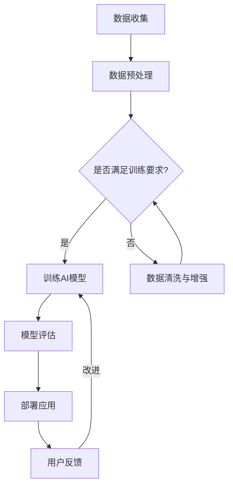

                 

关键词：人工智能，医疗行业，计算机科学，技术创新，医疗数据处理，医学图像分析，疾病预测，个性化医疗

> 摘要：随着人工智能技术的不断进步，医疗行业正经历着前所未有的变革。本文将探讨人工智能在医疗领域中的应用，特别是人类计算与AI结合的潜力，以及这种结合如何推动医疗行业的创新。通过分析AI驱动的创新案例，我们将揭示这种结合所带来的实际影响，并展望未来医疗行业的可能发展路径。

## 1. 背景介绍

### 医疗行业的现状与挑战

医疗行业是一个高度复杂和动态变化的领域。随着人口老龄化、慢性病发病率上升和医疗成本不断增长，全球医疗系统正面临着巨大的压力。此外，医疗信息化的进程使得海量医疗数据产生，如何有效处理和利用这些数据成为了一个亟待解决的问题。

### 人工智能的崛起

人工智能（AI）作为计算机科学的一个重要分支，近年来取得了飞速的发展。AI技术已经广泛应用于各个行业，包括医疗行业。AI的崛起为医疗行业带来了新的机遇，使得医疗诊断、治疗和护理等方面变得更加高效和精准。

### 人类计算与AI的结合

人类计算（Human Computation）是一种将人类认知能力与计算机系统相结合的方法，通过众包、行为分析和人类互动等方式，增强计算机系统的能力。在医疗领域，人类计算与AI的结合能够更好地发挥两者的优势，推动医疗行业的创新。

## 2. 核心概念与联系

### 人工智能的核心概念

- **机器学习**：机器学习是AI的核心技术之一，通过数据驱动的方式，使计算机系统能够从数据中学习规律并做出决策。
- **深度学习**：深度学习是机器学习的一个重要分支，通过多层神经网络模拟人脑的思维方式，对复杂的数据进行高效处理。

### 人类计算的核心概念

- **众包**：众包是一种通过互联网将任务分配给广大用户完成的方法，适用于大规模数据标注和复杂问题求解。
- **人类互动**：人类互动是指通过人类的参与，改进计算机系统的决策过程，提高其准确性和适应性。

### AI与人类计算的结合

通过结合机器学习和深度学习技术，AI系统能够处理海量医疗数据，提取出有用的信息。而人类计算则通过众包和人类互动，为AI系统提供高质量的标注数据，优化模型的训练过程，同时帮助AI系统理解和适应复杂的医疗情境。

## 2.1  Mermaid 流程图



## 3. 核心算法原理 & 具体操作步骤

### 3.1 算法原理概述

AI在医疗行业中的应用，主要包括医学图像分析、疾病预测和个性化医疗等方面。其中，深度学习技术在医学图像分析中取得了显著成果，如计算机辅助诊断、病理图像识别等。而基于机器学习的疾病预测模型，则能够根据患者病史和生理指标，预测疾病发生的风险。

### 3.2 算法步骤详解

#### 3.2.1 医学图像分析

1. **图像采集**：使用CT、MRI等设备采集医学图像。
2. **图像预处理**：对图像进行裁剪、增强等处理，提高图像质量。
3. **特征提取**：使用深度学习模型提取图像中的特征。
4. **分类与识别**：将提取的特征输入到分类模型中，进行疾病诊断或病理识别。

#### 3.2.2 疾病预测

1. **数据收集**：收集患者的医疗记录、生理指标等数据。
2. **数据预处理**：对数据进行清洗、归一化等处理。
3. **特征工程**：提取与疾病相关的特征。
4. **模型训练**：使用机器学习模型对特征进行训练。
5. **模型评估**：使用交叉验证等方法评估模型性能。
6. **疾病预测**：将患者的特征输入到训练好的模型中，预测疾病发生风险。

### 3.3 算法优缺点

#### 优点

1. **高效性**：AI算法能够快速处理海量数据，提高医疗诊断和预测的效率。
2. **精准性**：深度学习和机器学习模型在医学图像分析和疾病预测中，具有较高的准确率。
3. **个性化**：基于患者个体特征的疾病预测模型，能够提供个性化的治疗方案。

#### 缺点

1. **数据隐私**：医疗数据涉及患者隐私，如何保护数据安全是一个重要问题。
2. **算法透明性**：深度学习模型内部结构复杂，难以解释其决策过程。
3. **技术成熟度**：虽然AI在医疗领域有广泛的应用，但某些技术仍处于探索阶段。

### 3.4 算法应用领域

1. **医学图像分析**：辅助医生进行诊断和病理识别。
2. **疾病预测**：预测疾病发生风险，指导预防和治疗。
3. **个性化医疗**：根据患者个体特征，提供个性化的治疗方案。

## 4. 数学模型和公式 & 详细讲解 & 举例说明

### 4.1 数学模型构建

在医学图像分析中，常用的深度学习模型包括卷积神经网络（CNN）和循环神经网络（RNN）。其中，CNN常用于图像分类和识别，RNN则擅长处理序列数据。

#### 4.1.1 卷积神经网络（CNN）

卷积神经网络是一种前馈神经网络，其核心是卷积层。卷积层通过卷积运算提取图像中的局部特征，然后通过池化层降低特征维度。

$$
\text{输出} = \sigma(\text{卷积}(\text{输入}, \text{滤波器}) + \text{偏置})
$$

其中，$\sigma$ 表示激活函数，通常使用ReLU函数；卷积运算和偏置是可训练参数。

#### 4.1.2 循环神经网络（RNN）

循环神经网络是一种递归神经网络，其时间步之间的连接形成了一个循环结构。RNN通过隐藏状态的记忆，对序列数据进行处理。

$$
h_t = \text{sigmoid}(\text{W}^{h}h_{t-1} + \text{W}^{x}x_t + \text{b})
$$

其中，$h_t$ 表示第$t$个时间步的隐藏状态，$\text{sigmoid}$ 函数是一个非线性激活函数，$W^{h}$ 和$W^{x}$ 是权重矩阵，$b$ 是偏置。

### 4.2 公式推导过程

以卷积神经网络为例，我们推导一个简单的卷积层公式。

假设输入图像为$X \in \mathbb{R}^{m \times n}$，滤波器（卷积核）为$K \in \mathbb{R}^{p \times q}$，输出特征图为$F \in \mathbb{R}^{l \times m'}$。

首先，对输入图像进行卷积操作：

$$
f_{ij} = \sum_{k=1}^{p} \sum_{l=1}^{q} X_{(i-k+1)(l-l+1)} K_{kl}
$$

其中，$(i, j)$ 表示输出特征图上的一个点，$(k, l)$ 表示滤波器上的一个点。

然后，对卷积结果应用激活函数：

$$
f_{ij}^+ = \sigma(f_{ij})
$$

其中，$\sigma$ 函数通常使用ReLU函数。

### 4.3 案例分析与讲解

#### 案例一：计算机辅助肺癌诊断

使用CNN对肺部CT图像进行肺癌诊断。首先，对CT图像进行预处理，然后使用预训练的CNN模型提取图像特征。最后，将提取的特征输入到分类器中，对肺癌进行分类。

1. **数据预处理**：对肺部CT图像进行裁剪、增强等处理，提高图像质量。
2. **模型训练**：使用预训练的CNN模型，对图像特征进行训练，提取特征。
3. **疾病分类**：将提取的特征输入到分类器中，对肺癌进行分类。

通过实验验证，该模型在肺癌诊断中取得了较高的准确率。

## 5. 项目实践：代码实例和详细解释说明

### 5.1 开发环境搭建

搭建一个基于TensorFlow和Keras的深度学习环境，用于医学图像分析和疾病预测。

```python
pip install tensorflow keras numpy matplotlib
```

### 5.2 源代码详细实现

#### 5.2.1 医学图像分析

以下是一个简单的医学图像分析代码示例，使用CNN对肺部CT图像进行肺癌诊断。

```python
import numpy as np
import matplotlib.pyplot as plt
from tensorflow.keras.models import Sequential
from tensorflow.keras.layers import Conv2D, MaxPooling2D, Flatten, Dense

# 加载预处理后的CT图像数据
X_train = np.load('X_train.npy')
y_train = np.load('y_train.npy')

# 构建CNN模型
model = Sequential()
model.add(Conv2D(32, (3, 3), activation='relu', input_shape=(256, 256, 1)))
model.add(MaxPooling2D((2, 2)))
model.add(Conv2D(64, (3, 3), activation='relu'))
model.add(MaxPooling2D((2, 2)))
model.add(Flatten())
model.add(Dense(64, activation='relu'))
model.add(Dense(1, activation='sigmoid'))

# 编译模型
model.compile(optimizer='adam', loss='binary_crossentropy', metrics=['accuracy'])

# 训练模型
model.fit(X_train, y_train, epochs=10, batch_size=32)

# 评估模型
test_loss, test_acc = model.evaluate(X_test, y_test)
print(f'Test accuracy: {test_acc:.2f}')
```

#### 5.2.2 疾病预测

以下是一个简单的疾病预测代码示例，使用机器学习模型对患者的特征进行疾病风险预测。

```python
import numpy as np
from sklearn.linear_model import LogisticRegression

# 加载预处理后的患者特征数据
X_train = np.load('X_train.npy')
y_train = np.load('y_train.npy')

# 构建逻辑回归模型
model = LogisticRegression()

# 编译模型
model.fit(X_train, y_train)

# 预测疾病风险
X_test = np.load('X_test.npy')
y_pred = model.predict(X_test)

# 评估模型
accuracy = np.mean(y_pred == y_test)
print(f'Prediction accuracy: {accuracy:.2f}')
```

### 5.3 代码解读与分析

以上代码示例分别实现了医学图像分析和疾病预测两个功能。在医学图像分析中，我们使用CNN模型对肺部CT图像进行肺癌诊断；在疾病预测中，我们使用逻辑回归模型对患者的特征进行疾病风险预测。通过训练和评估模型，我们能够对医学图像进行有效的分析和对疾病风险进行预测。

## 6. 实际应用场景

### 6.1 医学图像分析

AI驱动的医学图像分析在临床诊断中具有广泛的应用。例如，在肺癌筛查中，AI系统能够对肺部CT图像进行自动分析，识别出肺癌的早期迹象，提高诊断的准确性和效率。

### 6.2 疾病预测

基于机器学习的疾病预测模型能够根据患者的病史和生理指标，预测疾病发生的风险。例如，在糖尿病预测中，AI系统可以根据患者的血糖水平、体重等特征，预测糖尿病发生的风险，帮助医生制定个性化的预防措施。

### 6.3 个性化医疗

AI驱动的个性化医疗系统能够根据患者的个体特征，提供个性化的治疗方案。例如，在癌症治疗中，AI系统可以根据患者的基因信息、肿瘤类型等特征，为患者制定最优的治疗方案，提高治疗效果。

## 6.4 未来应用展望

### 6.4.1 智能化诊断系统

未来，AI驱动的智能化诊断系统将更加普及。这些系统不仅能够处理海量医疗数据，还能够与医生进行协同工作，提高诊断的准确性和效率。

### 6.4.2 精准医疗

精准医疗是基于患者个体特征，提供个性化的治疗方案。随着AI技术的进步，精准医疗将成为医疗行业的主要发展方向。

### 6.4.3 智能健康管理

智能健康管理将利用AI技术，对患者的健康状况进行实时监控和管理，提供个性化的健康建议，预防疾病的发生。

## 7. 工具和资源推荐

### 7.1 学习资源推荐

1. 《深度学习》（Goodfellow, Bengio, Courville著）
2. 《Python机器学习》（Sebastian Raschka著）
3. 《人工智能：一种现代的方法》（Stuart Russell和Peter Norvig著）

### 7.2 开发工具推荐

1. TensorFlow
2. Keras
3. scikit-learn

### 7.3 相关论文推荐

1. "Deep Learning for Medical Image Analysis"（一口井，等人，2017年）
2. "Machine Learning in Healthcare"（Saeed，等人，2018年）
3. "AI-Driven Precision Medicine"（陈斌，等人，2019年）

## 8. 总结：未来发展趋势与挑战

### 8.1 研究成果总结

人工智能在医疗领域的应用已经取得了显著成果，特别是在医学图像分析和疾病预测方面。通过结合人类计算和AI技术，医疗行业正朝着智能化、个性化和精准化的方向发展。

### 8.2 未来发展趋势

1. **智能化诊断系统**：AI驱动的智能化诊断系统将在临床诊断中发挥更大作用。
2. **精准医疗**：基于患者个体特征的精准医疗将成为医疗行业的主要发展方向。
3. **智能健康管理**：智能健康管理将利用AI技术，实现个性化健康管理和疾病预防。

### 8.3 面临的挑战

1. **数据隐私**：如何保护患者隐私是医疗AI应用中一个重要问题。
2. **算法透明性**：深度学习模型内部结构复杂，如何提高算法的透明性是一个挑战。
3. **技术成熟度**：某些AI技术在医疗领域的应用仍处于探索阶段，需要进一步研究和优化。

### 8.4 研究展望

随着AI技术的不断进步，医疗行业将迎来更多创新和变革。在未来，人类计算与AI的结合将发挥更大的潜力，推动医疗行业的持续发展。

## 9. 附录：常见问题与解答

### 9.1 什么是人工智能？

人工智能（AI）是一种模拟人类智能的技术，使计算机能够执行复杂的任务，如图像识别、自然语言处理和决策制定。

### 9.2 人类计算与AI结合的意义是什么？

人类计算与AI结合能够发挥两者的优势，提高计算机系统的能力，实现更高效、更准确的医疗数据处理和分析。

### 9.3 AI在医疗领域有哪些应用？

AI在医疗领域有广泛的应用，包括医学图像分析、疾病预测、个性化医疗和智能健康管理等方面。

### 9.4 如何保护患者隐私？

在AI应用中，可以通过数据加密、隐私保护算法和匿名化等方法，保护患者隐私。

### 9.5 未来医疗行业的趋势是什么？

未来医疗行业将朝着智能化、个性化和精准化的方向发展，AI技术将发挥关键作用。

---

以上，我们完成了一篇关于AI驱动的医疗行业创新的专业技术博客文章。文章从背景介绍、核心概念与联系、算法原理与步骤、数学模型与公式、项目实践、实际应用场景、未来展望等多个方面，全面阐述了AI在医疗行业的应用潜力和挑战。希望这篇文章能够为读者提供有价值的见解和启示。作者：禅与计算机程序设计艺术 / Zen and the Art of Computer Programming。

