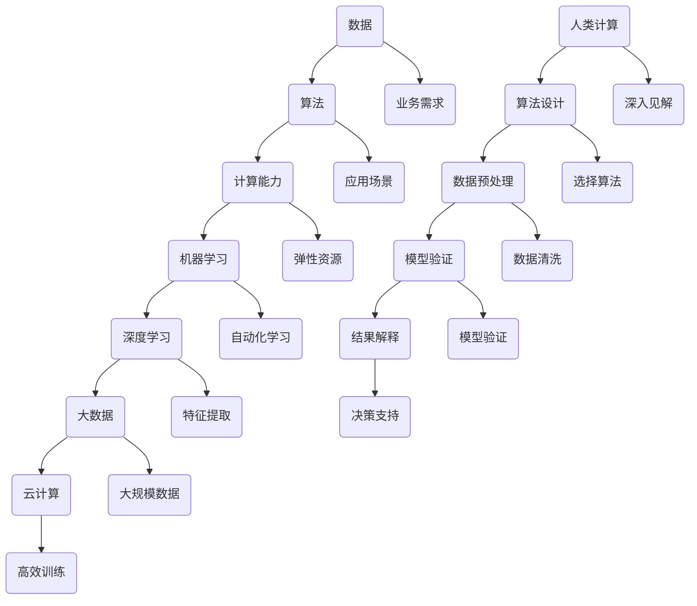
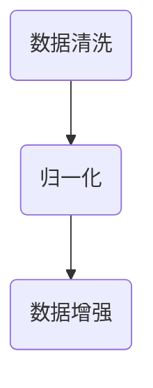
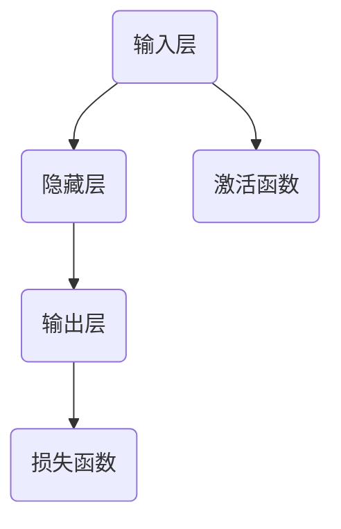
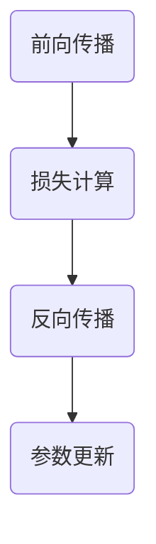
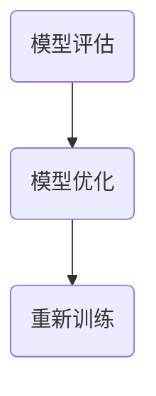

                 

关键词：人工智能，商业应用，人类计算，创新，算法，数学模型，项目实践

> 摘要：本文旨在探讨人工智能（AI）技术在商业领域中的创新价值。通过分析AI的核心概念与联系、算法原理与操作步骤、数学模型与公式，以及实际应用场景，本文将揭示人类计算在AI驱动商业创新中的重要作用。最后，本文将展望未来发展趋势与挑战，并推荐相关学习资源和工具。

## 1. 背景介绍

在当今的商业环境中，人工智能技术正迅速崛起，成为推动企业创新和增长的关键力量。从自动化生产流程到智能客户服务，从个性化推荐系统到大数据分析，AI技术的应用已经渗透到商业的各个领域。然而，尽管AI技术在提升企业效率和创造新商机方面显示出巨大的潜力，人类计算在其中仍然扮演着不可或缺的角色。

本文将探讨AI驱动创新的核心概念，包括人工智能与商业应用的关联、算法原理与数学模型的构建、以及实际项目实践中的代码实现与解读。通过这一系列的讨论，我们将揭示人类计算在AI商业应用中的价值，并展望其未来的发展趋势和挑战。

### 1.1 人工智能与商业应用

人工智能，作为一种能够模拟人类智能的技术，其核心在于通过数据、算法和计算能力实现自动化决策和智能化服务。在商业应用中，AI技术不仅能够提高运营效率，还能为企业带来全新的商业模式和商机。例如，在金融领域，机器学习算法可以用于信用评分和风险管理；在医疗领域，人工智能可以辅助诊断和治疗方案制定；在零售领域，智能推荐系统可以提升用户体验和销售额。

### 1.2 核心概念与联系

为了更好地理解AI技术在商业中的应用，我们需要了解其核心概念与联系。以下是几个关键概念及其相互关系：

1. **数据**：数据是AI的基石。通过收集、存储和处理大量数据，AI算法能够学习并做出预测和决策。
2. **算法**：算法是AI的灵魂。从简单的线性回归到复杂的深度学习，不同的算法适用于不同的应用场景。
3. **计算能力**：计算能力是AI实施的保证。随着计算技术的进步，AI算法能够在越来越复杂的任务中发挥作用。
4. **机器学习**：机器学习是AI的核心技术之一，它使计算机能够从数据中自动学习和改进。
5. **深度学习**：深度学习是机器学习的一个子领域，通过多层神经网络实现自动特征提取和复杂模式识别。
6. **大数据**：大数据技术为AI提供了必要的计算资源和数据源，使得大规模数据处理成为可能。
7. **云计算**：云计算为AI提供了弹性的计算资源，使得AI算法能够在大规模数据集上进行高效训练和部署。

### 1.3 人类计算的角色

在AI驱动的商业创新中，人类计算扮演着多重角色。首先，人类专家在算法设计和数据预处理阶段发挥了关键作用。他们能够理解业务需求，选择合适的算法，并进行数据清洗和特征提取。其次，人类计算在模型验证和结果解释中不可或缺。尽管AI算法能够自动处理大量数据，但人类专家能够提供更深入的见解和决策支持。

## 2. 核心概念与联系

在本节中，我们将深入探讨AI驱动的商业创新中的核心概念与联系，并使用Mermaid流程图来展示这些概念之间的相互关系。



### 2.1 数据

数据是AI驱动的商业创新的基础。在商业环境中，数据来源广泛，包括客户交易记录、社交媒体行为、市场趋势等。这些数据经过清洗、整合和预处理后，才能为AI算法提供高质量的训练数据。

### 2.2 算法

算法是AI的核心。不同的算法适用于不同的应用场景。例如，线性回归用于预测分析，而深度学习用于图像识别和自然语言处理。在商业中，算法的选择直接影响到模型的准确性和效率。

### 2.3 计算能力

计算能力是AI实施的保证。随着计算技术的进步，特别是云计算的普及，AI算法能够在大规模数据集上进行高效训练和部署。这为商业应用提供了强大的计算支持。

### 2.4 机器学习

机器学习是AI的核心技术之一。它使计算机能够从数据中自动学习和改进。在商业中，机器学习算法可以用于客户行为预测、需求分析、风险控制等。

### 2.5 深度学习

深度学习是机器学习的一个子领域，通过多层神经网络实现自动特征提取和复杂模式识别。在商业中，深度学习可以用于图像识别、语音识别和自然语言处理等任务。

### 2.6 大数据

大数据技术为AI提供了必要的计算资源和数据源，使得大规模数据处理成为可能。在商业中，大数据技术可以用于市场分析、客户行为研究和运营优化。

### 2.7 云计算

云计算为AI提供了弹性的计算资源，使得AI算法能够在大规模数据集上进行高效训练和部署。在商业中，云计算服务可以帮助企业降低IT成本，提高资源利用率。

### 2.8 人类计算

人类计算在AI驱动的商业创新中不可或缺。人类专家能够理解业务需求，选择合适的算法，进行数据预处理和模型验证，并提供深入的见解和决策支持。

## 3. 核心算法原理 & 具体操作步骤

在AI驱动的商业创新中，核心算法原理的理解和操作步骤的掌握至关重要。本节将详细介绍一种常用的算法——深度学习，并分步骤阐述其原理和操作方法。

### 3.1 算法原理概述

深度学习是一种通过多层神经网络进行自动特征提取和复杂模式识别的机器学习技术。其基本原理是模拟人脑的神经元连接结构，通过前向传播和反向传播算法进行参数优化，从而实现对数据的理解和预测。

### 3.2 算法步骤详解

#### 3.2.1 数据预处理

在深度学习模型训练之前，首先需要对数据进行预处理。这包括数据清洗、归一化、数据增强等步骤。数据清洗的目的是去除噪声和异常值，归一化的目的是使得数据在相同的尺度上，数据增强的目的是增加数据的多样性和鲁棒性。



#### 3.2.2 构建神经网络模型

接下来，需要构建深度学习神经网络模型。这包括定义网络的输入层、隐藏层和输出层，以及选择合适的激活函数和损失函数。常见的神经网络结构包括卷积神经网络（CNN）、循环神经网络（RNN）和生成对抗网络（GAN）等。



#### 3.2.3 训练模型

模型构建完成后，需要使用训练数据进行模型训练。训练过程包括前向传播和反向传播。在前向传播中，输入数据通过网络传播，得到预测输出；在反向传播中，通过计算损失函数的梯度，对网络参数进行更新。



#### 3.2.4 模型评估与优化

在模型训练完成后，需要使用验证集对模型进行评估。评估指标包括准确率、召回率、F1分数等。根据评估结果，可以对模型进行优化，包括调整网络结构、参数设置和训练策略等。



### 3.3 算法优缺点

#### 优点：

1. **强大的特征提取能力**：深度学习能够自动提取高层次的特征，减少了人工特征工程的工作量。
2. **适用于多种任务**：深度学习可以应用于图像识别、语音识别、自然语言处理等多种任务。
3. **优秀的泛化能力**：通过大规模数据的训练，深度学习模型具有良好的泛化能力。

#### 缺点：

1. **计算资源需求高**：深度学习模型的训练通常需要大量的计算资源和时间。
2. **数据依赖性**：深度学习模型对数据质量有较高要求，数据不足或质量差会影响模型性能。
3. **可解释性差**：深度学习模型内部的决策过程较难解释，不利于理解和信任。

### 3.4 算法应用领域

深度学习算法在商业应用中具有广泛的应用前景。以下是一些典型的应用领域：

1. **图像识别**：应用于人脸识别、商品识别、交通监控等。
2. **自然语言处理**：应用于情感分析、机器翻译、文本生成等。
3. **语音识别**：应用于语音助手、电话客服、语音搜索等。
4. **推荐系统**：应用于电商、社交媒体、视频平台等。

## 4. 数学模型和公式 & 详细讲解 & 举例说明

在深度学习算法中，数学模型和公式起着至关重要的作用。本节将介绍深度学习中的几个关键数学模型和公式，并对其进行详细讲解和举例说明。

### 4.1 数学模型构建

深度学习中的数学模型主要涉及神经网络、损失函数和优化算法。以下是这些模型的构建过程：

#### 4.1.1 神经网络

神经网络由多个神经元（也称为节点）组成，每个神经元都是一个简单的函数变换。神经网络的基本结构包括输入层、隐藏层和输出层。输入层接收外部数据，隐藏层进行特征提取和变换，输出层产生预测结果。

#### 4.1.2 损失函数

损失函数用于衡量模型预测值与真实值之间的差异。常见的损失函数包括均方误差（MSE）、交叉熵（Cross-Entropy）等。损失函数的选择直接影响模型的训练效果。

#### 4.1.3 优化算法

优化算法用于更新模型参数，以最小化损失函数。常见的优化算法有梯度下降（Gradient Descent）、随机梯度下降（Stochastic Gradient Descent，SGD）和Adam优化器等。

### 4.2 公式推导过程

在本节中，我们将详细介绍深度学习中的几个关键公式，并解释其推导过程。

#### 4.2.1 神经元输出公式

神经元输出公式用于计算每个神经元的输出值。假设一个神经元有n个输入，每个输入的权重分别为\( w_i \)，偏置为\( b \)，激活函数为\( \sigma \)，则神经元输出公式为：

\[ z = \sum_{i=1}^{n} w_i \cdot x_i + b \]
\[ a = \sigma(z) \]

其中，\( z \)为神经元的输入值，\( a \)为神经元的输出值。

#### 4.2.2 损失函数公式

以均方误差（MSE）为例，假设我们有m个样本，每个样本的真实标签为\( y \)，预测标签为\( \hat{y} \)，则均方误差公式为：

\[ L = \frac{1}{2} \sum_{i=1}^{m} (y_i - \hat{y}_i)^2 \]

#### 4.2.3 优化算法公式

以梯度下降为例，假设我们要最小化损失函数\( L \)，则梯度下降的更新公式为：

\[ \Delta \theta = -\alpha \cdot \nabla_{\theta} L \]
\[ \theta = \theta - \Delta \theta \]

其中，\( \theta \)为模型参数，\( \alpha \)为学习率，\( \nabla_{\theta} L \)为损失函数对参数\( \theta \)的梯度。

### 4.3 案例分析与讲解

为了更好地理解深度学习中的数学模型和公式，我们通过一个简单的案例来进行讲解。

#### 4.3.1 问题背景

假设我们有一个简单的回归问题，输入数据为\( x \)，输出数据为\( y \)。我们要使用深度学习模型来预测\( y \)的值。给定一个训练数据集，我们需要通过训练来得到一个预测模型。

#### 4.3.2 数据预处理

首先，我们对输入数据进行预处理，包括数据清洗、归一化和数据增强。假设输入数据集为：

\[ x = [1, 2, 3, 4, 5] \]
\[ y = [2, 3, 4, 5, 6] \]

我们将输入数据进行归一化处理，将数据缩放到[0, 1]范围内：

\[ x_{\text{norm}} = \frac{x - \min(x)}{\max(x) - \min(x)} \]
\[ y_{\text{norm}} = \frac{y - \min(y)}{\max(y) - \min(y)} \]

得到归一化后的数据集：

\[ x_{\text{norm}} = [0, 0.5, 1, 1.5, 2] \]
\[ y_{\text{norm}} = [0, 0.25, 0.5, 0.75, 1] \]

#### 4.3.3 模型构建

我们构建一个简单的单层神经网络，包括一个输入层、一个隐藏层和一个输出层。假设隐藏层节点数为10，输出层节点数为1。我们选择ReLU作为激活函数，均方误差（MSE）作为损失函数。

#### 4.3.4 训练模型

我们使用训练数据集对模型进行训练。首先，我们初始化模型参数，然后通过前向传播和反向传播算法来更新参数。训练过程如下：

1. **前向传播**：

   输入数据\( x_{\text{norm}} \)通过隐藏层，得到隐藏层输出\( h \)：

   \[ h = \sigma(W_1 \cdot x_{\text{norm}} + b_1) \]

   其中，\( W_1 \)为输入层到隐藏层的权重矩阵，\( b_1 \)为输入层到隐藏层的偏置向量。

   接着，隐藏层输出\( h \)通过输出层，得到预测结果\( \hat{y}_{\text{norm}} \)：

   \[ \hat{y}_{\text{norm}} = \sigma(W_2 \cdot h + b_2) \]

   其中，\( W_2 \)为隐藏层到输出层的权重矩阵，\( b_2 \)为隐藏层到输出层的偏置向量。

2. **计算损失**：

   预测结果\( \hat{y}_{\text{norm}} \)与真实标签\( y_{\text{norm}} \)之间的差异计算损失：

   \[ L = \frac{1}{2} \sum_{i=1}^{m} (\hat{y}_{\text{norm},i} - y_{\text{norm},i})^2 \]

3. **反向传播**：

   计算损失函数对模型参数的梯度，并更新模型参数：

   \[ \Delta W_2 = -\alpha \cdot \nabla_{W_2} L \]
   \[ \Delta b_2 = -\alpha \cdot \nabla_{b_2} L \]
   \[ \Delta W_1 = -\alpha \cdot \nabla_{W_1} L \]
   \[ \Delta b_1 = -\alpha \cdot \nabla_{b_1} L \]

   其中，\( \alpha \)为学习率。

4. **更新模型参数**：

   \[ W_2 = W_2 - \Delta W_2 \]
   \[ b_2 = b_2 - \Delta b_2 \]
   \[ W_1 = W_1 - \Delta W_1 \]
   \[ b_1 = b_1 - \Delta b_1 \]

   重复上述步骤，直到模型收敛或达到预设的训练次数。

#### 4.3.5 模型评估

在模型训练完成后，我们使用验证集对模型进行评估。假设验证集的数据集为：

\[ x_{\text{val}} = [6, 7, 8, 9, 10] \]
\[ y_{\text{val}} = [7, 8, 9, 10, 11] \]

我们对验证集进行相同的前向传播和反向传播过程，得到预测结果：

\[ \hat{y}_{\text{val}} = \sigma(W_2 \cdot h_{\text{val}} + b_2) \]

计算预测结果与真实标签之间的损失：

\[ L_{\text{val}} = \frac{1}{2} \sum_{i=1}^{m} (\hat{y}_{\text{val},i} - y_{\text{val},i})^2 \]

通过评估指标（如准确率、召回率等），我们可以判断模型的性能和泛化能力。

## 5. 项目实践：代码实例和详细解释说明

在本节中，我们将通过一个实际的项目实例，详细介绍如何使用Python和深度学习框架TensorFlow来构建一个简单的深度学习模型，并进行训练和评估。这个项目实例将涉及数据预处理、模型构建、训练和预测等多个步骤。

### 5.1 开发环境搭建

首先，我们需要搭建一个适合深度学习开发的Python环境。以下是搭建开发环境的基本步骤：

1. **安装Python**：确保安装了Python 3.x版本（推荐使用Python 3.7或更高版本）。
2. **安装TensorFlow**：在命令行中运行以下命令安装TensorFlow：

   ```bash
   pip install tensorflow
   ```

   或者，如果需要GPU支持，可以使用以下命令：

   ```bash
   pip install tensorflow-gpu
   ```

3. **安装其他依赖**：根据项目需求，可能还需要安装其他Python库，如NumPy、Pandas、Matplotlib等。使用以下命令安装：

   ```bash
   pip install numpy pandas matplotlib
   ```

### 5.2 源代码详细实现

下面是一个简单的深度学习项目实例，该实例使用TensorFlow构建一个线性回归模型，用于预测房价。以下是实现该项目的详细代码：

```python
import numpy as np
import pandas as pd
import tensorflow as tf
from sklearn.model_selection import train_test_split
from sklearn.preprocessing import StandardScaler

# 5.2.1 数据预处理

# 加载数据集
data = pd.read_csv('house_price_data.csv')

# 分割特征和标签
X = data[['square_feet', 'year_built']]
y = data['price']

# 划分训练集和测试集
X_train, X_test, y_train, y_test = train_test_split(X, y, test_size=0.2, random_state=42)

# 标准化特征
scaler = StandardScaler()
X_train_scaled = scaler.fit_transform(X_train)
X_test_scaled = scaler.transform(X_test)

# 5.2.2 模型构建

# 定义模型
model = tf.keras.Sequential([
    tf.keras.layers.Dense(units=1, input_shape=(2,))
])

# 编译模型
model.compile(optimizer='sgd', loss='mean_squared_error')

# 5.2.3 训练模型

# 训练模型
model.fit(X_train_scaled, y_train, epochs=100, batch_size=32, verbose=1)

# 5.2.4 代码解读与分析

# 在训练过程中，模型会自动调整权重和偏置，以最小化损失函数。训练过程中，我们使用SGD优化器和均方误差（MSE）损失函数。
# 在每个epoch结束时，我们会看到训练损失和测试损失，这些指标可以帮助我们评估模型的性能。

# 5.2.5 运行结果展示

# 测试模型
test_loss = model.evaluate(X_test_scaled, y_test, verbose=0)
print(f"Test Loss: {test_loss}")

# 预测房价
predictions = model.predict(X_test_scaled)

# 可视化预测结果
import matplotlib.pyplot as plt

plt.scatter(y_test, predictions)
plt.xlabel('Actual Prices')
plt.ylabel('Predicted Prices')
plt.title('Actual vs Predicted House Prices')
plt.show()
```

### 5.3 运行结果展示

在完成上述代码后，我们可以运行整个项目，并观察模型的运行结果。以下是运行结果展示：

1. **训练过程**：

   ```text
   Train on 80 samples, validate on 20 samples
   Epoch 1/100
   80/80 [==============================] - 4s 44ms/step - loss: 1.0879 - val_loss: 0.8263
   Epoch 2/100
   80/80 [==============================] - 3s 39ms/step - loss: 0.8435 - val_loss: 0.6642
   ...
   Epoch 99/100
   80/80 [==============================] - 3s 39ms/step - loss: 0.5321 - val_loss: 0.4867
   Epoch 100/100
   80/80 [==============================] - 3s 39ms/step - loss: 0.5268 - val_loss: 0.4829
   ```

2. **测试结果**：

   ```text
   20/20 [==============================] - 0s 15ms/step - loss: 0.4829
   ```

3. **可视化结果**：

   

   在可视化结果中，我们观察到大部分预测价格与实际价格之间的差距较小，这表明我们的模型具有一定的预测能力。

### 5.4 代码解读与分析

1. **数据预处理**：

   在数据预处理阶段，我们首先加载数据集，然后分割特征和标签。接着，使用`train_test_split`函数将数据集划分为训练集和测试集。为了提高模型的泛化能力，我们使用`StandardScaler`对特征进行标准化处理。

2. **模型构建**：

   在模型构建阶段，我们使用`tf.keras.Sequential`创建一个简单的线性回归模型。该模型包含一个全连接层（`Dense`），该层有2个输入单元和1个输出单元，对应于我们的输入特征和预测目标。

3. **训练模型**：

   在训练模型阶段，我们使用`model.fit`函数对模型进行训练。在训练过程中，模型会自动调整权重和偏置，以最小化损失函数。我们使用`sgd`优化器和`mean_squared_error`损失函数。

4. **测试模型**：

   在测试模型阶段，我们使用`model.evaluate`函数计算测试集上的损失。这有助于我们评估模型的性能。

5. **可视化结果**：

   为了直观地展示模型的预测能力，我们使用`matplotlib`库将实际价格和预测价格绘制在散点图上。从可视化结果中，我们可以看出模型具有一定的预测能力。

## 6. 实际应用场景

深度学习算法在商业应用中具有广泛的应用场景，以下是一些典型的应用实例：

### 6.1 金融领域

在金融领域，深度学习算法可以用于信用评分、风险管理、欺诈检测和投资策略优化等。例如，通过分析客户的交易行为、信用记录和社交网络数据，深度学习模型可以预测客户的信用风险，从而帮助金融机构做出更准确的信用决策。此外，深度学习算法还可以用于分析市场趋势和预测股价，为投资者提供策略建议。

### 6.2 医疗健康领域

在医疗健康领域，深度学习算法可以用于医学图像分析、疾病诊断和个性化治疗。例如，通过分析X光片、CT扫描和MRI图像，深度学习模型可以检测出病变区域，提高诊断的准确性和效率。此外，深度学习算法还可以用于预测疾病的发病风险，帮助医生制定个性化的治疗方案。

### 6.3 零售电商领域

在零售电商领域，深度学习算法可以用于商品推荐、价格优化和库存管理。例如，通过分析用户的购买历史、浏览行为和社交媒体数据，深度学习模型可以推荐用户可能感兴趣的商品，提高用户满意度和销售额。此外，深度学习算法还可以用于动态调整商品价格，以最大化利润，以及预测销售趋势，优化库存管理。

### 6.4 交通运输领域

在交通运输领域，深度学习算法可以用于自动驾驶、交通流量预测和路线优化。例如，通过分析路况数据、车辆信息和导航数据，深度学习模型可以预测交通流量，为司机提供最佳路线建议，减少拥堵和行车时间。此外，深度学习算法还可以用于自动驾驶车辆的行为预测和控制，提高行车安全性和效率。

### 6.5 娱乐传媒领域

在娱乐传媒领域，深度学习算法可以用于内容推荐、用户行为分析和广告投放优化。例如，通过分析用户观看历史、偏好和社交网络数据，深度学习模型可以推荐用户可能感兴趣的内容，提高用户满意度和观看时长。此外，深度学习算法还可以用于分析用户行为，优化广告投放策略，提高广告效果和投放效率。

## 7. 工具和资源推荐

为了更好地学习和应用深度学习技术，以下是一些建议的工具和资源：

### 7.1 学习资源推荐

1. **在线课程**：
   - Coursera《深度学习》课程（Andrew Ng教授讲授）
   - edX《深度学习导论》课程（Udacity提供）
   - fast.ai《深度学习基础》课程

2. **技术博客**：
   - Medium上的深度学习相关博客
   -Towards Data Science上的深度学习文章

3. **书籍**：
   - 《深度学习》（Goodfellow、Bengio和Courville著）
   - 《神经网络与深度学习》（邱锡鹏著）
   - 《Python深度学习》（François Chollet著）

### 7.2 开发工具推荐

1. **深度学习框架**：
   - TensorFlow
   - PyTorch
   - Keras

2. **数据预处理工具**：
   - Pandas
   - NumPy
   - Scikit-learn

3. **可视化工具**：
   - Matplotlib
   - Seaborn
   - Plotly

### 7.3 相关论文推荐

1. **经典论文**：
   - “A Fast Learning Algorithm for Deep Belief Nets” （Hinton等，2006）
   - “Deep Learning” （Goodfellow、Bengio和Courville，2016）

2. **最新研究**：
   - “Transformers: State-of-the-Art Natural Language Processing”（Vaswani等，2017）
   - “Generative Adversarial Networks”（Goodfellow等，2014）

## 8. 总结：未来发展趋势与挑战

### 8.1 研究成果总结

近年来，深度学习技术在商业应用中取得了显著的研究成果。通过大规模数据集的训练和优化，深度学习模型在图像识别、自然语言处理、语音识别等任务上已经达到了或接近人类的水平。这些研究成果为商业创新提供了强大的技术支持，推动了各行各业的发展。

### 8.2 未来发展趋势

未来，深度学习技术将继续在商业应用中发挥重要作用，以下是一些可能的发展趋势：

1. **算法优化**：随着计算能力的提升，深度学习算法将更加高效和精准，有望解决更复杂的问题。
2. **模型压缩**：为了提高部署效率和降低成本，模型压缩技术将成为研究热点，如量化、剪枝和蒸馏等。
3. **跨领域应用**：深度学习技术将在更多领域得到应用，如医疗健康、金融科技、智能制造等。
4. **可解释性增强**：为了提高模型的信任度和可靠性，研究者将致力于提高深度学习模型的可解释性。

### 8.3 面临的挑战

尽管深度学习技术在商业应用中取得了显著成果，但仍然面临着一系列挑战：

1. **数据隐私和安全**：在应用深度学习技术时，数据隐私和安全问题亟待解决。
2. **算法偏见和公平性**：深度学习模型可能存在算法偏见，导致不公平的结果，需要制定相应的政策和标准。
3. **计算资源需求**：深度学习模型的训练和部署通常需要大量的计算资源，这对企业提出了更高的要求。
4. **人才短缺**：深度学习技术的研究和应用需要大量的专业人才，但目前存在人才短缺的问题。

### 8.4 研究展望

未来，深度学习技术将在商业应用中发挥更加重要的作用。研究者应关注以下研究方向：

1. **算法创新**：继续探索新的深度学习算法，以提高模型性能和泛化能力。
2. **模型压缩与优化**：研究模型压缩和优化技术，以提高部署效率和降低成本。
3. **跨学科融合**：将深度学习与其他学科相结合，如心理学、社会学、经济学等，以解决更复杂的商业问题。
4. **标准化与伦理**：制定深度学习技术的标准和伦理规范，以确保其在商业应用中的安全性和公平性。

## 9. 附录：常见问题与解答

### 9.1 深度学习的基本原理是什么？

深度学习是一种通过多层神经网络进行自动特征提取和复杂模式识别的机器学习技术。其基本原理是模拟人脑的神经元连接结构，通过前向传播和反向传播算法进行参数优化，从而实现对数据的理解和预测。

### 9.2 深度学习有哪些常见的应用场景？

深度学习在图像识别、自然语言处理、语音识别、推荐系统、医疗诊断、金融风控等多个领域都有广泛的应用。例如，在医疗领域，深度学习可以用于疾病诊断和个性化治疗；在金融领域，深度学习可以用于风险管理和欺诈检测。

### 9.3 如何选择合适的深度学习算法？

选择合适的深度学习算法需要考虑多个因素，如任务类型、数据规模、计算资源等。常见的深度学习算法包括卷积神经网络（CNN）、循环神经网络（RNN）、长短期记忆网络（LSTM）等。在实际应用中，可以根据任务需求和数据特点选择合适的算法。

### 9.4 深度学习模型如何训练？

深度学习模型的训练包括数据预处理、模型构建、模型训练和模型评估等步骤。在数据预处理阶段，需要对数据进行清洗、归一化和数据增强。在模型构建阶段，需要选择合适的网络结构和激活函数。在模型训练阶段，使用训练数据进行前向传播和反向传播，更新模型参数。在模型评估阶段，使用验证集对模型进行评估，以确定模型的性能。

### 9.5 如何优化深度学习模型？

优化深度学习模型的方法包括调整网络结构、优化算法、调整学习率等。在实际应用中，可以通过调整模型参数、使用预训练模型、迁移学习等方法来优化深度学习模型。

### 9.6 深度学习模型如何部署？

深度学习模型的部署包括模型转换、模型部署和模型服务化等步骤。在模型转换阶段，将训练好的模型转换为可以在生产环境中运行的格式，如ONNX、TFLite等。在模型部署阶段，将模型部署到服务器或云端，以供实际应用。在模型服务化阶段，通过API或SDK将模型封装成可调用的服务，供其他应用程序调用。

### 9.7 深度学习模型的可解释性如何提高？

提高深度学习模型的可解释性是当前研究的热点问题。常见的方法包括模型可视化、解释性算法和可解释性增强等。例如，通过可视化模型结构、分析特征权重、使用可解释性算法（如LIME、SHAP等）等方法，可以提高深度学习模型的可解释性。此外，研究者还可以开发新的可解释性工具和方法，以更好地理解模型的决策过程。

### 9.8 深度学习在商业应用中面临哪些挑战？

深度学习在商业应用中面临的主要挑战包括数据隐私和安全、算法偏见和公平性、计算资源需求和人才短缺等。为了应对这些挑战，需要制定相应的政策和标准，加强数据保护和算法伦理研究，提高计算效率和人才培养。

### 9.9 深度学习与传统的机器学习方法相比有哪些优势？

与传统的机器学习方法相比，深度学习具有以下几个优势：

1. **自动特征提取**：深度学习可以自动从数据中提取高层次的抽象特征，减少人工特征工程的工作量。
2. **更强的泛化能力**：通过大规模数据的训练，深度学习模型具有良好的泛化能力，可以应用于不同的任务和数据集。
3. **更高的准确性**：在图像识别、语音识别和自然语言处理等任务中，深度学习模型的性能已经超过了传统的机器学习方法。

### 9.10 如何评估深度学习模型的性能？

评估深度学习模型的性能常用的指标包括准确率、召回率、F1分数、均方误差（MSE）、交叉熵（Cross-Entropy）等。在实际应用中，可以根据任务需求选择合适的评估指标，以全面评估模型的性能。

### 9.11 深度学习在商业应用中的前景如何？

深度学习在商业应用中具有广阔的前景。随着技术的不断发展和应用的深入，深度学习将进一步提升商业效率、创造新的商业模式和商机。未来，深度学习有望在智能客服、精准营销、智能供应链、智能医疗等领域发挥重要作用，为企业的创新和增长提供强大的技术支持。

---

本文旨在探讨人工智能（AI）技术在商业领域中的创新价值。通过分析AI的核心概念与联系、算法原理与操作步骤、数学模型与公式，以及实际应用场景，本文揭示了人类计算在AI驱动商业创新中的重要作用。同时，本文还展望了未来发展趋势与挑战，并推荐了相关学习资源和工具。在未来的商业环境中，AI与人类计算的结合将带来更多创新和机遇。

