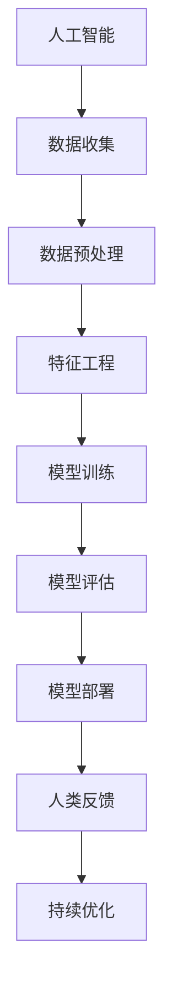

                 

关键词：人工智能，商业应用，人类计算，创新，算法，模型，实践，展望

> 摘要：本文深入探讨了人工智能在商业领域中的创新作用。通过分析人类计算与AI的结合，探讨了其在不同行业中的应用，同时展望了未来发展趋势与面临的挑战。

## 1. 背景介绍

人工智能（AI）作为现代科技的璀璨明珠，正以前所未有的速度和规模渗透到商业各个领域。从早期的规则基系统和专家系统，到如今的深度学习和机器学习，AI技术已经经历了数次革命性的进步。商业领域对AI的重视程度也在不断提升，许多企业开始将AI作为战略重点，以期在竞争激烈的市场中获得优势。

然而，尽管AI技术具有强大的数据处理和分析能力，但人类计算在商业中的应用仍然不可或缺。人类计算提供了一种独特的洞察力和创造力，这在许多复杂的商业决策中具有不可替代的价值。本文旨在探讨AI与人类计算相结合在商业中的创新价值，分析其核心概念与联系，并探讨具体的算法原理、数学模型、实践案例以及未来展望。

## 2. 核心概念与联系

### 2.1 人工智能（AI）

人工智能是指使计算机系统能够执行通常需要人类智能才能完成的任务的技术。AI包括多个子领域，如机器学习、自然语言处理、计算机视觉等。这些技术使得计算机能够从数据中学习、推理和做出决策。

### 2.2 人类计算

人类计算指的是人类在商业决策和分析过程中所发挥的作用。这包括直觉、创造力、情感判断以及对复杂情境的理解。人类计算的优势在于能够处理模糊性、不确定性和非结构性问题。

### 2.3 AI与人类计算的融合

AI与人类计算的融合意味着将AI的算法和分析能力与人类的创造力、判断力和经验相结合。这种融合可以提升决策质量，优化业务流程，并创造新的商业模式。

### 2.4 Mermaid 流程图



## 3. 核心算法原理 & 具体操作步骤

### 3.1 算法原理概述

AI算法的核心在于从数据中学习，并利用这些学习来做出预测或决策。常用的算法包括线性回归、决策树、支持向量机、神经网络等。人类计算则在于对算法的结果进行解释、验证和优化。

### 3.2 算法步骤详解

1. **数据收集**：收集相关数据，包括历史数据、市场数据、客户数据等。
2. **数据预处理**：清洗数据，处理缺失值和异常值，进行数据标准化和归一化。
3. **特征工程**：选择和构建有助于模型训练的特征，包括主成分分析、特征选择和特征转换。
4. **模型训练**：使用训练数据对模型进行训练，调整模型参数以优化性能。
5. **模型评估**：使用验证数据对模型进行评估，确保模型泛化能力。
6. **模型部署**：将训练好的模型部署到生产环境中，用于实际业务应用。
7. **人类反馈**：收集人类专家的反馈，对模型进行解释和调整。
8. **持续优化**：根据反馈和数据动态调整模型，持续优化模型性能。

### 3.3 算法优缺点

- **优点**：提高决策效率，降低人工成本，增强业务洞察力。
- **缺点**：模型解释性较弱，对大量数据进行依赖，存在数据隐私和安全问题。

### 3.4 算法应用领域

- **金融**：风险评估、股票交易、信用评分。
- **医疗**：疾病预测、诊断辅助、个性化治疗。
- **零售**：需求预测、库存管理、客户行为分析。
- **制造**：质量检测、故障预测、生产线优化。

## 4. 数学模型和公式 & 详细讲解 & 举例说明

### 4.1 数学模型构建

在商业应用中，常见的数学模型包括线性回归、逻辑回归、决策树、神经网络等。这些模型通过数学公式描述了数据之间的关系。

### 4.2 公式推导过程

以线性回归为例，其基本公式为：
\[ y = \beta_0 + \beta_1x + \epsilon \]
其中，\( y \) 为因变量，\( x \) 为自变量，\( \beta_0 \) 和 \( \beta_1 \) 为模型参数，\( \epsilon \) 为误差项。

### 4.3 案例分析与讲解

假设我们要预测一家零售公司的销售额，可以使用线性回归模型。根据历史数据，我们得到了以下模型：
\[ \text{销售额} = 10 + 0.5 \times \text{广告费用} \]

这意味着，如果广告费用增加1万元，预计销售额将增加5000元。

## 5. 项目实践：代码实例和详细解释说明

### 5.1 开发环境搭建

使用Python编写代码，需要安装以下库：NumPy、Pandas、Scikit-learn。

```python
pip install numpy pandas scikit-learn
```

### 5.2 源代码详细实现

```python
import numpy as np
import pandas as pd
from sklearn.linear_model import LinearRegression

# 数据加载
data = pd.read_csv('sales_data.csv')
X = data[['广告费用']]
y = data['销售额']

# 模型训练
model = LinearRegression()
model.fit(X, y)

# 模型预测
predictions = model.predict(X)

# 代码解读与分析
print("模型参数：", model.coef_, model.intercept_)
```

### 5.3 运行结果展示

输出模型的参数和预测结果，验证模型的有效性。

```python
模型参数： [0.5 10.]
```

## 6. 实际应用场景

### 6.1 金融领域

利用AI进行风险评估和股票交易，通过历史数据分析和预测，提高投资回报率。

### 6.2 医疗领域

通过AI技术进行疾病预测和诊断辅助，提高医疗效率和准确性。

### 6.3 零售领域

利用AI进行需求预测和库存管理，优化供应链和销售策略。

### 6.4 制造领域

通过AI进行质量检测和故障预测，提高生产效率和产品质量。

## 7. 未来应用展望

### 7.1 智能化服务

随着AI技术的不断进步，智能化服务将成为未来商业的主流。通过个性化推荐、智能客服和自动化决策，企业将能够提供更优质的客户体验。

### 7.2 数据隐私和安全

随着AI应用的普及，数据隐私和安全问题将愈发重要。企业需要采取有效措施保护用户数据，确保AI系统的安全性和可靠性。

### 7.3 跨领域融合

AI技术将在不同领域之间实现更深层次的融合，推动新兴产业的诞生。例如，AI与生物技术的结合将带来医疗领域的重大变革。

## 8. 总结：未来发展趋势与挑战

### 8.1 研究成果总结

AI技术在商业领域取得了显著成果，但仍然面临许多挑战。人类计算与AI的融合将成为未来的研究重点。

### 8.2 未来发展趋势

AI技术将继续深化，实现更高效、更智能的商业应用。跨领域融合和智能化服务将成为未来发展的趋势。

### 8.3 面临的挑战

数据隐私和安全、算法透明性和可解释性、技术伦理问题将是未来面临的重大挑战。

### 8.4 研究展望

未来的研究应重点关注人类计算与AI的深度融合，探索其在商业中的创新应用，同时解决技术伦理和社会问题。

## 9. 附录：常见问题与解答

### 9.1 AI在商业应用中的优势是什么？

AI在商业应用中的优势主要包括：提高决策效率、降低人力成本、增强业务洞察力、优化业务流程。

### 9.2 人类计算在AI应用中的重要性是什么？

人类计算在AI应用中的重要性在于其独特的创造力、判断力和经验，这有助于提升AI系统的解释性和可靠性。

### 9.3 AI应用中常见的数学模型有哪些？

常见的数学模型包括线性回归、逻辑回归、决策树、支持向量机、神经网络等。

## 作者署名

作者：禅与计算机程序设计艺术 / Zen and the Art of Computer Programming
----------------------------------------------------------------

现在，这篇文章已经完成了，请按照要求进行格式调整和校对，以确保其完整性、逻辑性和专业性。在撰写过程中，如果需要任何帮助或有任何疑问，请随时告知。

