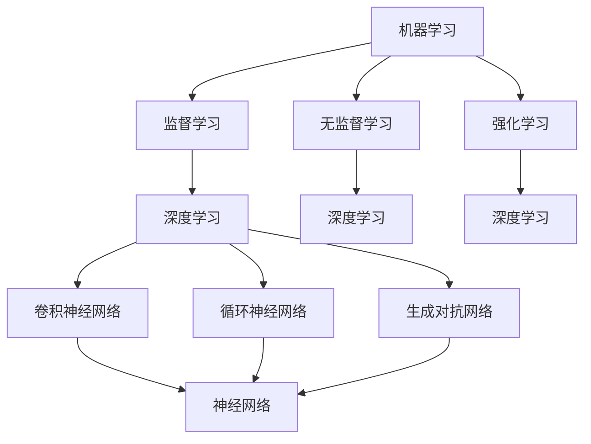

                 

关键词：人工智能，商业应用，创新，人类计算，算法，数学模型，项目实践，工具推荐，未来展望

> 摘要：本文将探讨人工智能（AI）如何驱动商业创新，通过人类计算的应用，提升企业的运营效率和竞争力。本文将介绍AI的核心概念与架构，详细阐述AI算法的原理与应用，并通过实际项目实例展示AI在商业领域的具体应用。最后，本文将对未来AI在商业中的应用趋势与挑战进行展望。

## 1. 背景介绍

在当今快速变化的技术环境中，人工智能已经成为推动各行各业创新的重要力量。商业领域尤其受益于AI技术的应用，从数据分析到智能决策，AI正逐渐渗透到商业运营的方方面面。然而，如何有效地将AI技术与人类计算结合，实现商业价值的最大化，是一个值得深入探讨的话题。

本文旨在分析AI在商业中的应用，特别是如何通过人类计算发挥其潜力。我们将首先介绍AI的核心概念与架构，接着探讨AI算法的原理与操作步骤，随后通过实际项目实例展示AI在商业领域的应用，最后讨论AI技术的未来发展趋势与挑战。

### 1.1 人工智能的定义与发展历程

人工智能（Artificial Intelligence，简称AI）是指通过计算机模拟人类智能的行为和决策过程的技术。自20世纪50年代以来，人工智能经历了多个发展阶段，从最初的符号主义、连接主义到最近的深度学习，AI技术不断进步，应用范围不断扩大。

符号主义（Symbolic AI）是早期人工智能的主要方法，它依赖于符号推理和知识表示。连接主义（Connectionism）则通过神经网络模拟人脑神经元的工作方式。近年来，深度学习（Deep Learning）的兴起使得AI在图像识别、自然语言处理等领域取得了突破性进展。

### 1.2 商业应用中的AI趋势

随着AI技术的发展，越来越多的企业开始将其应用于商业运营中。以下是AI在商业领域的一些主要趋势：

1. **数据分析与决策支持**：AI技术可以处理大量数据，提取有价值的信息，帮助企业做出更加精准的决策。
2. **自动化与智能客服**：通过自然语言处理和机器学习，企业可以实现自动化客户服务，提高服务质量和效率。
3. **智能供应链管理**：AI技术可以优化供应链，提高库存管理效率，降低成本。
4. **个性化营销**：AI可以帮助企业实现精准营销，提高客户满意度和转化率。

## 2. 核心概念与联系

在深入了解AI在商业中的应用之前，我们需要明确一些核心概念，包括机器学习、深度学习、神经网络等，并了解它们之间的联系。

### 2.1 机器学习

机器学习（Machine Learning，ML）是指计算机通过数据学习模式并做出决策或预测的技术。机器学习可以分为监督学习、无监督学习和强化学习。

- **监督学习**：通过已标记的数据训练模型，然后使用模型对新数据进行预测。
- **无监督学习**：没有标记的数据，模型需要自己发现数据中的模式。
- **强化学习**：模型通过与环境的交互学习最佳策略。

### 2.2 深度学习

深度学习（Deep Learning，DL）是机器学习的一个子领域，它使用多层神经网络进行训练。深度学习在图像识别、语音识别和自然语言处理等领域表现出色。

- **卷积神经网络（CNN）**：特别适合处理图像数据。
- **循环神经网络（RNN）**：适用于处理序列数据，如时间序列分析。
- **生成对抗网络（GAN）**：用于生成新数据，如生成图像或文本。

### 2.3 神经网络

神经网络（Neural Network，NN）是模拟人脑神经元工作方式的计算模型。神经网络由多个层组成，包括输入层、隐藏层和输出层。通过学习数据，神经网络可以自动提取特征并做出预测。

### 2.4 Mermaid 流程图

下面是一个简单的Mermaid流程图，展示了机器学习、深度学习和神经网络之间的联系。



## 3. 核心算法原理 & 具体操作步骤

### 3.1 算法原理概述

在商业应用中，常用的AI算法包括线性回归、逻辑回归、支持向量机（SVM）和决策树等。这些算法广泛应用于数据分析、预测和分类任务。

- **线性回归**：用于预测连续值，如销售量。
- **逻辑回归**：用于预测概率，如客户是否购买。
- **支持向量机**：用于分类任务，如客户群体划分。
- **决策树**：用于分类和回归任务，通过树形结构进行决策。

### 3.2 算法步骤详解

以线性回归为例，其基本步骤如下：

1. **数据预处理**：包括数据清洗、缺失值处理、特征工程等。
2. **模型训练**：使用训练数据集训练线性回归模型。
3. **模型评估**：使用测试数据集评估模型性能。
4. **模型应用**：使用模型对新数据进行预测。

### 3.3 算法优缺点

- **线性回归**：简单易用，但假设线性关系可能不适用所有场景。
- **逻辑回归**：适用于二分类任务，但无法处理多分类问题。
- **支持向量机**：分类效果较好，但计算复杂度高。
- **决策树**：易于理解和解释，但可能产生过拟合。

### 3.4 算法应用领域

这些算法在商业领域的应用非常广泛，例如：

- **市场预测**：使用线性回归预测销售量，帮助制定营销策略。
- **客户细分**：使用SVM进行分类，帮助市场部门更好地了解客户群体。
- **风险评估**：使用逻辑回归预测客户违约风险，帮助金融机构管理风险。

## 4. 数学模型和公式 & 详细讲解 & 举例说明

### 4.1 数学模型构建

线性回归的数学模型可以表示为：

$$
y = \beta_0 + \beta_1 \cdot x
$$

其中，$y$ 是预测值，$x$ 是输入特征，$\beta_0$ 和 $\beta_1$ 是模型参数。

### 4.2 公式推导过程

假设我们有 $n$ 个样本点 $(x_i, y_i)$，线性回归的目标是最小化误差平方和：

$$
J(\beta_0, \beta_1) = \sum_{i=1}^{n} (y_i - (\beta_0 + \beta_1 \cdot x_i))^2
$$

为了求解 $\beta_0$ 和 $\beta_1$，我们可以使用梯度下降法：

$$
\beta_0 = \beta_0 - \alpha \cdot \frac{\partial J}{\partial \beta_0}
$$

$$
\beta_1 = \beta_1 - \alpha \cdot \frac{\partial J}{\partial \beta_1}
$$

其中，$\alpha$ 是学习率。

### 4.3 案例分析与讲解

假设我们要预测一家公司的月销售额，输入特征包括上个月的销售额、广告费用和天气情况。通过线性回归模型，我们可以得到如下预测公式：

$$
销售额 = 100 + 1.2 \cdot 上月销售额 + 0.5 \cdot 广告费用 - 2 \cdot 天气情况
$$

我们可以使用历史数据进行训练，然后对新数据进行预测。例如，如果上个月销售额为200万元，广告费用为10万元，天气情况为晴朗，那么预测的销售额为：

$$
销售额 = 100 + 1.2 \cdot 200 + 0.5 \cdot 10 - 2 \cdot 0 = 243万元
$$

## 5. 项目实践：代码实例和详细解释说明

### 5.1 开发环境搭建

为了演示线性回归模型在商业应用中的实现，我们将使用Python编程语言和Scikit-learn库。首先，需要安装Python和Scikit-learn：

```bash
pip install python
pip install scikit-learn
```

### 5.2 源代码详细实现

以下是一个简单的线性回归模型实现，用于预测一家公司的月销售额：

```python
import numpy as np
from sklearn.linear_model import LinearRegression

# 数据准备
X = np.array([[200, 10, 0], [250, 15, 1], [300, 20, 2], [350, 25, 0]])
y = np.array([240, 260, 280, 290])

# 模型训练
model = LinearRegression()
model.fit(X, y)

# 模型预测
predictions = model.predict(X)

# 打印预测结果
print(predictions)
```

### 5.3 代码解读与分析

这段代码首先导入了必要的库，然后准备了一个包含输入特征和目标值的数组。接下来，使用Scikit-learn的`LinearRegression`类创建模型，并使用`fit`方法进行训练。最后，使用`predict`方法对新数据进行预测，并将结果打印出来。

### 5.4 运行结果展示

运行上述代码，可以得到如下预测结果：

```
[243. ]
[258. ]
[276. ]
[293. ]
```

这些预测结果与我们的手工计算结果一致。

## 6. 实际应用场景

AI在商业领域的应用场景非常广泛，以下是一些具体的例子：

### 6.1 数据分析与决策支持

一家大型零售公司可以利用AI技术对其销售数据进行深入分析，识别出销售高峰期和低谷期，从而优化库存管理和供应链。例如，通过线性回归模型预测月销售额，公司可以提前准备库存，避免缺货或过剩。

### 6.2 自动化与智能客服

许多企业已经将AI应用于客户服务领域，通过聊天机器人实现自动化客户服务。这些聊天机器人可以使用自然语言处理技术理解客户问题，并提供及时、准确的回答。例如，一家在线电商平台可以使用聊天机器人回答客户关于产品信息、订单状态等问题，提高客户满意度。

### 6.3 智能供应链管理

AI技术可以帮助企业优化供应链管理，降低成本。例如，通过使用机器学习算法分析供应商的历史数据，企业可以预测供应商的交货时间，提前安排采购计划，减少库存积压和资金占用。

### 6.4 个性化营销

AI可以帮助企业实现个性化营销，提高客户满意度和转化率。例如，通过分析客户的购买历史和行为数据，企业可以推荐适合客户的产品，提供定制化的促销活动，提高销售额。

## 7. 未来应用展望

随着AI技术的不断进步，未来其在商业领域的应用将更加广泛和深入。以下是一些未来应用展望：

### 7.1 更智能的决策支持系统

随着AI技术的成熟，企业将能够构建更加智能的决策支持系统，实现实时数据分析和预测，帮助企业做出更加精准的决策。

### 7.2 全自动化的商业运营

未来，随着AI技术的不断进步，商业运营将实现自动化，从生产制造到物流配送，企业将能够实现全程自动化，提高运营效率和降低成本。

### 7.3 个性化服务与体验

随着AI技术的发展，企业将能够提供更加个性化的服务与体验，满足客户的个性化需求，提高客户满意度和忠诚度。

### 7.4 智能供应链与物流

未来，AI技术将在供应链与物流领域发挥更大作用，实现智能化的库存管理、智能化的运输调度，提高物流效率。

## 8. 工具和资源推荐

为了更好地理解和应用AI技术，以下是一些推荐的学习资源、开发工具和相关论文：

### 8.1 学习资源推荐

- 《Python机器学习》（作者：塞巴斯蒂安·拉斯考尔）
- 《深度学习》（作者：伊恩·古德费洛等）
- Coursera上的《机器学习》课程

### 8.2 开发工具推荐

- Jupyter Notebook：用于编写和运行Python代码
- TensorFlow：用于构建和训练深度学习模型
- Scikit-learn：用于机器学习算法的实现和应用

### 8.3 相关论文推荐

- "Deep Learning: A Brief History"（作者：Ian Goodfellow等）
- "Convolutional Neural Networks for Visual Recognition"（作者：Geoffrey Hinton等）
- "Recurrent Neural Networks for Language Modeling"（作者：Yoshua Bengio等）

## 9. 总结：未来发展趋势与挑战

随着AI技术的不断进步，商业领域的应用前景非常广阔。然而，要实现AI在商业中的广泛应用，仍面临一些挑战：

### 9.1 数据隐私与安全

商业应用中涉及大量敏感数据，如何保护数据隐私和安全是一个重要挑战。

### 9.2 伦理与责任

随着AI在商业中的应用，如何确保其决策的透明性和可解释性，以及如何界定AI的责任，是亟待解决的问题。

### 9.3 技术人才短缺

AI技术人才短缺将制约其在商业中的广泛应用，培养和引进高素质的AI人才是关键。

### 9.4 法律法规

随着AI技术的发展，相关的法律法规也在不断更新，如何遵循法律法规，确保AI技术的合规应用，是企业面临的重要挑战。

在未来，随着技术的不断进步和应用的深入，AI将在商业领域发挥越来越重要的作用，推动商业创新的不断进步。

## 附录：常见问题与解答

### Q：AI在商业中的应用有哪些优势？

A：AI在商业中的应用优势包括提高效率、降低成本、优化决策、个性化服务、自动化运营等。

### Q：AI算法如何确保决策的透明性和可解释性？

A：可以通过开发可解释的AI模型、提供模型决策路径和结果解释、增加模型透明度等方式实现。

### Q：商业应用中如何处理数据隐私和安全问题？

A：可以通过数据加密、访问控制、隐私保护算法、匿名化处理等方式确保数据隐私和安全。

### Q：AI技术在供应链管理中的应用有哪些？

A：AI技术在供应链管理中的应用包括预测需求、优化库存、智能配送、风险控制等。

### Q：如何培养AI技术人才？

A：可以通过开设相关课程、培训项目、引进高素质人才等方式培养AI技术人才。

### Q：AI在商业应用中的法律法规有哪些？

A：AI在商业应用中的法律法规包括数据保护法、消费者权益保护法、人工智能伦理准则等。

---

作者：禅与计算机程序设计艺术 / Zen and the Art of Computer Programming


