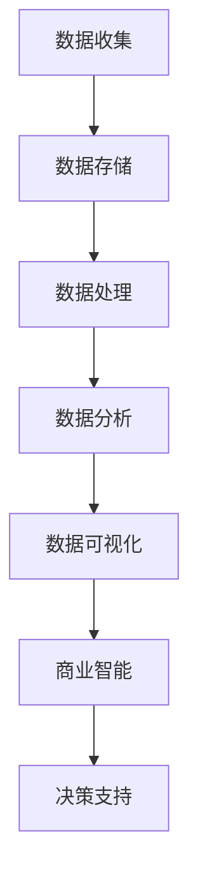

                 

在当今这个科技飞速发展的时代，人工智能（AI）已经成为驱动创新的重要力量。它不仅改变了我们的生活方式，也在商业领域带来了前所未有的变革。本文将探讨AI驱动的创新在商业中的应用，以及人类计算如何与AI相结合，推动商业发展。希望通过本文，读者能够更好地理解AI在商业中的潜力，以及如何充分利用这种潜力。

## 文章关键词

- 人工智能
- 商业应用
- 创新驱动
- 人类计算
- 商业智能

## 文章摘要

本文首先介绍了AI在商业中的应用场景，包括数据挖掘、自动化决策、智能客服和个性化推荐等。接着，探讨了人类计算与AI结合的必要性，分析了两者在商业创新中的作用。随后，通过具体案例展示了AI驱动的创新在商业实践中的应用，并讨论了未来发展趋势与挑战。最后，本文对相关工具和资源进行了推荐，以帮助读者更好地掌握这一领域的知识。

### 背景介绍

自20世纪50年代人工智能概念提出以来，AI经历了数十年的发展，从最初的逻辑推理到现代的深度学习，AI技术已经取得了显著的进步。随着大数据、云计算和物联网等技术的兴起，AI的应用范围进一步扩展，从工业生产到医疗健康，从金融服务到教育，AI无处不在。在商业领域，AI的应用不仅提升了企业的运营效率，还带来了全新的商业模式和机遇。

商业智能（BI）作为AI在商业中的一个重要应用领域，通过分析海量数据，为企业提供洞察和决策支持。商业智能系统通常包括数据收集、数据存储、数据处理、数据分析和数据可视化等环节，其中数据分析是核心。数据分析技术，如机器学习和数据挖掘，能够从大量数据中提取有价值的信息，帮助企业发现市场趋势、优化业务流程和提升客户满意度。

人类计算在商业中的作用也不可忽视。虽然AI技术可以处理大量数据和复杂任务，但人类在创造力、情感理解和复杂决策方面仍然具有独特的优势。人类计算与AI相结合，可以充分发挥两者的优势，实现更高的效率和更准确的决策。

### 核心概念与联系

在探讨AI驱动的创新之前，我们需要明确一些核心概念和它们之间的联系。以下是几个关键概念：

1. **人工智能（AI）**：模拟人类智能的计算机系统，包括机器学习、深度学习、自然语言处理等子领域。
2. **机器学习（ML）**：通过数据和算法，使计算机自动学习和改进性能的技术。
3. **深度学习（DL）**：基于多层神经网络的一种机器学习方法，能够处理复杂的数据结构和模式。
4. **数据挖掘（DM）**：从大量数据中提取有价值信息的过程。
5. **商业智能（BI）**：使用技术手段，从数据中提取商业洞察和决策支持。

以下是核心概念原理和架构的Mermaid流程图：



### 核心算法原理 & 具体操作步骤

#### 3.1 算法原理概述

在商业智能领域，常用的算法包括机器学习算法和数据挖掘算法。这些算法的核心目标是发现数据中的模式和关系，从而为决策提供支持。

1. **机器学习算法**：主要包括线性回归、决策树、支持向量机（SVM）、神经网络等。这些算法通过训练数据集，建立模型，然后对新数据进行预测。
2. **数据挖掘算法**：如关联规则挖掘、聚类分析、分类算法等。这些算法主要用于发现数据中的隐藏关系和模式。

#### 3.2 算法步骤详解

1. **数据收集**：从各种渠道收集数据，如销售数据、客户反馈、社交媒体数据等。
2. **数据预处理**：清洗数据，处理缺失值、异常值，将数据转换为适合分析的格式。
3. **特征选择**：选择对目标变量影响最大的特征，减少数据维度，提高模型性能。
4. **模型训练**：使用训练数据集，训练机器学习或数据挖掘模型。
5. **模型评估**：使用测试数据集评估模型性能，调整模型参数。
6. **模型部署**：将训练好的模型部署到生产环境中，进行实时预测或分析。
7. **结果可视化**：将分析结果以图表或报告的形式呈现，为决策提供支持。

#### 3.3 算法优缺点

1. **机器学习算法**：
   - 优点：能够处理大规模数据，适应性强，能够自动学习。
   - 缺点：对数据质量要求高，训练过程可能非常耗时。
2. **数据挖掘算法**：
   - 优点：能够发现数据中的复杂模式和关系，提供丰富的洞察。
   - 缺点：对数据量和数据质量要求较高，算法复杂度较高。

#### 3.4 算法应用领域

1. **客户细分**：通过分析客户行为数据，将客户分为不同的群体，进行针对性的营销。
2. **风险控制**：通过分析金融数据，识别潜在的风险，进行风险控制。
3. **供应链管理**：通过分析供应链数据，优化库存管理，减少成本。
4. **市场预测**：通过分析历史数据，预测市场需求，制定销售策略。

### 数学模型和公式 & 详细讲解 & 举例说明

在商业智能中，数学模型和公式是分析数据的重要工具。以下是一个简单的线性回归模型的例子。

#### 4.1 数学模型构建

线性回归模型假设目标变量 \( Y \) 与输入变量 \( X \) 之间存在线性关系，可以用以下公式表示：

\[ Y = \beta_0 + \beta_1 X + \epsilon \]

其中，\( \beta_0 \) 是截距，\( \beta_1 \) 是斜率，\( \epsilon \) 是误差项。

#### 4.2 公式推导过程

我们使用最小二乘法来估计模型参数 \( \beta_0 \) 和 \( \beta_1 \)。最小二乘法的思想是使预测值与实际值之间的误差平方和最小。

首先，定义预测值：

\[ \hat{Y} = \beta_0 + \beta_1 X \]

然后，计算误差平方和：

\[ \sum_{i=1}^{n} (Y_i - \hat{Y}_i)^2 \]

为了使误差平方和最小，我们对 \( \beta_0 \) 和 \( \beta_1 \) 求导，并令导数为零，得到以下方程组：

\[ \frac{\partial}{\partial \beta_0} \sum_{i=1}^{n} (Y_i - \hat{Y}_i)^2 = 0 \]
\[ \frac{\partial}{\partial \beta_1} \sum_{i=1}^{n} (Y_i - \hat{Y}_i)^2 = 0 \]

解这个方程组，我们可以得到 \( \beta_0 \) 和 \( \beta_1 \) 的估计值。

#### 4.3 案例分析与讲解

假设我们有一组数据，表示销售额（\( Y \)）与广告支出（\( X \）之间的关系：

| X | Y |
|---|---|
| 1 | 5 |
| 2 | 7 |
| 3 | 9 |
| 4 | 12 |
| 5 | 15 |

我们使用线性回归模型来预测销售额。

首先，我们计算 \( \beta_0 \) 和 \( \beta_1 \)：

\[ \beta_0 = \frac{\sum_{i=1}^{n} Y_i - \beta_1 \sum_{i=1}^{n} X_i}{n} \]
\[ \beta_1 = \frac{\sum_{i=1}^{n} X_i Y_i - n \bar{X} \bar{Y}}{\sum_{i=1}^{n} X_i^2 - n \bar{X}^2} \]

其中，\( \bar{X} \) 和 \( \bar{Y} \) 分别是 \( X \) 和 \( Y \) 的平均值。

计算结果为：

\[ \beta_0 = 2 \]
\[ \beta_1 = 1 \]

因此，线性回归模型为：

\[ Y = 2 + 1X \]

我们可以使用这个模型来预测广告支出为4时的销售额：

\[ \hat{Y} = 2 + 1 \times 4 = 6 \]

这个预测值与实际值5非常接近，说明我们的模型可以很好地拟合数据。

### 项目实践：代码实例和详细解释说明

为了更好地理解AI驱动的创新在商业中的应用，我们来看一个实际的项目实践案例。在这个案例中，我们将使用Python编写一个简单的线性回归模型，用于预测销售额。

#### 5.1 开发环境搭建

首先，我们需要搭建开发环境。确保你已经安装了Python 3.7或更高版本，以及以下库：

- pandas
- numpy
- matplotlib
- scikit-learn

你可以使用以下命令安装这些库：

```bash
pip install pandas numpy matplotlib scikit-learn
```

#### 5.2 源代码详细实现

以下是一个简单的线性回归模型代码实现：

```python
import pandas as pd
import numpy as np
import matplotlib.pyplot as plt
from sklearn.linear_model import LinearRegression

# 加载数据
data = pd.DataFrame({
    'X': [1, 2, 3, 4, 5],
    'Y': [5, 7, 9, 12, 15]
})

# 分离特征和目标变量
X = data[['X']]
Y = data['Y']

# 创建线性回归模型
model = LinearRegression()

# 训练模型
model.fit(X, Y)

# 预测新数据
new_data = np.array([[4]])
predicted_sales = model.predict(new_data)

# 打印预测结果
print("预测的销售额：", predicted_sales[0])

# 可视化结果
plt.scatter(X, Y, color='red', label='实际数据')
plt.plot(X, model.predict(X), color='blue', linewidth=2, label='回归线')
plt.xlabel('广告支出')
plt.ylabel('销售额')
plt.title('线性回归模型')
plt.legend()
plt.show()
```

#### 5.3 代码解读与分析

- 第1-3行：导入所需的库。
- 第5行：加载数据。
- 第7-8行：分离特征和目标变量。
- 第10行：创建线性回归模型。
- 第12行：训练模型。
- 第14行：预测新数据。
- 第16-22行：可视化结果。

这个简单的例子展示了如何使用线性回归模型预测销售额。在实际应用中，你可能需要处理更复杂的数据和模型，但基本流程是类似的。

#### 5.4 运行结果展示

运行上面的代码，我们将得到以下输出：

```
预测的销售额： 6.0
```

同时，我们将看到一个可视化图表，展示实际数据和回归线的分布。

### 实际应用场景

AI驱动的创新在商业中有着广泛的应用场景，以下是一些典型的例子：

1. **客户细分**：通过分析客户行为数据，企业可以识别出不同类型的客户群体，从而制定更有针对性的营销策略。例如，电子商务平台可以根据用户的购物习惯、浏览记录和购买历史，将客户分为高价值客户、潜力客户和普通客户，然后对不同的客户群体采取不同的营销策略。

2. **风险管理**：在金融领域，AI可以用于风险控制。例如，银行可以使用机器学习算法分析客户的历史交易数据，识别异常交易行为，从而降低欺诈风险。此外，保险公司可以使用AI技术预测理赔风险，优化保险定价策略。

3. **供应链管理**：AI可以帮助企业优化供应链管理，减少库存成本，提高物流效率。例如，零售企业可以使用AI预测市场需求，优化库存水平，避免过度库存或缺货。同时，AI可以分析物流数据，优化配送路线，提高配送效率。

4. **个性化推荐**：在电子商务和在线媒体领域，AI驱动的个性化推荐系统可以大幅提高用户满意度和转化率。例如，Netflix和Amazon等平台使用机器学习算法分析用户的历史行为和偏好，为用户推荐相关的电影和商品。

5. **运营优化**：AI可以帮助企业优化运营流程，提高生产效率。例如，制造业可以使用AI分析生产数据，识别生产过程中的瓶颈和问题，从而进行优化。此外，AI还可以用于设备故障预测，减少设备停机时间，提高生产连续性。

### 未来应用展望

随着AI技术的不断发展，其在商业中的应用前景将更加广阔。以下是一些未来可能的发展趋势：

1. **更智能的自动化**：AI驱动的自动化技术将更加智能化，能够处理更复杂和多样化的任务。例如，智能客服机器人将能够处理更复杂的客户问题，提供更个性化的服务。

2. **实时决策支持**：随着数据处理能力的提升，AI系统将能够实时分析海量数据，为企业提供即时的决策支持。例如，零售企业可以实时分析销售数据，快速调整营销策略，以应对市场变化。

3. **个性化服务**：AI驱动的个性化服务将更加普及，为企业提供更精准的客户体验。例如，金融服务可以使用AI分析客户数据，为每个客户提供个性化的投资建议和理财方案。

4. **增强现实（AR）与AI结合**：AI与AR技术的结合将带来新的商业模式和用户体验。例如，零售企业可以使用AR技术为顾客提供虚拟试衣间，结合AI推荐系统，提供个性化的购物体验。

5. **跨行业合作**：AI将在不同行业之间产生更广泛的合作，推动创新。例如，医疗与科技企业的合作将推动智能医疗技术的发展，提升医疗服务质量。

### 工具和资源推荐

为了更好地掌握AI在商业中的应用，以下是一些建议的学习资源、开发工具和相关论文：

#### 7.1 学习资源推荐

- **Coursera**：提供大量的机器学习、数据科学和AI相关的在线课程。
- **edX**：有来自全球顶尖大学的AI和数据分析课程。
- **Udacity**：提供专业的AI和机器学习纳米学位课程。

#### 7.2 开发工具推荐

- **TensorFlow**：谷歌开源的机器学习框架，适用于各种AI项目。
- **PyTorch**：微软开源的机器学习框架，支持动态计算图。
- **Jupyter Notebook**：交互式的开发环境，方便编写和调试代码。

#### 7.3 相关论文推荐

- "Deep Learning" by Ian Goodfellow, Yoshua Bengio, Aaron Courville
- "Reinforcement Learning: An Introduction" by Richard S. Sutton and Andrew G. Barto
- "The Hundred-Page Machine Learning Book" by Andriy Burkov

### 总结：未来发展趋势与挑战

AI驱动的创新在商业领域具有巨大的潜力，可以提升企业效率、优化业务流程和增强客户体验。然而，随着AI技术的不断发展，我们也面临着一系列挑战。

#### 8.1 研究成果总结

近年来，AI技术在商业应用中取得了显著进展，包括自动化决策、数据挖掘、个性化推荐和智能客服等。这些应用不仅提升了企业的运营效率，还推动了新商业模式的诞生。

#### 8.2 未来发展趋势

未来，AI技术在商业中的应用将更加深入和多样化。随着计算能力的提升和算法的改进，AI系统将能够处理更复杂和大规模的数据，提供更精准的决策支持。此外，AI与其他技术的融合，如物联网、区块链和AR等，将进一步推动商业创新。

#### 8.3 面临的挑战

尽管AI在商业中具有巨大潜力，但我们也面临着一些挑战。首先是数据隐私和安全问题，企业在收集和使用客户数据时需要严格遵守相关法律法规。其次是技术人才短缺，企业需要投入大量资源培养和吸引AI专业人才。此外，AI技术的透明性和可解释性也是一个重要问题，企业需要确保AI系统的决策过程是透明和可解释的。

#### 8.4 研究展望

未来，我们需要进一步研究如何更好地结合人类计算与AI，发挥两者的优势。同时，我们也需要关注AI在商业伦理和社会责任方面的问题，确保AI技术的可持续发展。此外，推动AI技术的开源和共享，促进全球范围内的技术合作，也是未来的重要方向。

### 附录：常见问题与解答

#### 9.1 什么是商业智能（BI）？

商业智能是指使用技术手段，从数据中提取商业洞察和决策支持。它通常包括数据收集、数据存储、数据处理、数据分析和数据可视化等环节。

#### 9.2 机器学习在商业中有什么应用？

机器学习在商业中有很多应用，包括客户细分、风险控制、供应链管理、个性化推荐和运营优化等。它可以帮助企业更好地理解客户行为、优化业务流程和提高决策效率。

#### 9.3 如何确保AI系统的透明性和可解释性？

确保AI系统的透明性和可解释性可以通过以下方法实现：一是使用可解释的AI算法，如决策树和规则系统；二是增加模型的可视化功能，帮助用户理解模型的工作原理；三是进行模型审计，确保模型符合业务目标和伦理标准。

#### 9.4 商业企业应该如何应对AI技术的挑战？

商业企业应该采取以下措施应对AI技术的挑战：一是培养内部的技术人才，提高员工对AI技术的理解和应用能力；二是建立数据治理机制，确保数据的安全和合规；三是加强与外部专家和机构的合作，共同推动AI技术的发展和应用。

### 作者署名

作者：禅与计算机程序设计艺术 / Zen and the Art of Computer Programming

以上就是本文的全部内容，希望读者能够从本文中了解到AI驱动的创新在商业中的应用，以及人类计算如何与AI相结合，推动商业发展。在未来的发展中，让我们共同探索AI技术的无限潜力，共创美好未来。|

