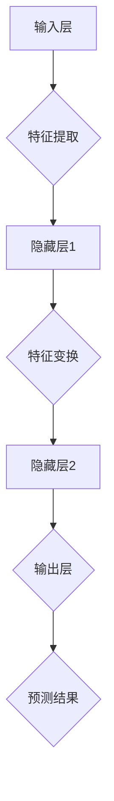

                 

关键词：人工智能、商业应用、创新、计算、技术

> 摘要：本文深入探讨了人工智能（AI）在商业领域的创新应用，阐述了人类计算与AI结合的重要性，以及这种结合如何推动商业模式的变革。文章从核心概念、算法原理、数学模型、项目实践和未来展望等多个角度进行了详细的分析。

## 1. 背景介绍

随着技术的不断发展，人工智能逐渐成为推动商业创新的重要力量。AI技术通过数据的处理和分析，能够帮助企业在市场竞争中取得优势。从早期的自动化到如今的智能化，AI已经渗透到商业的各个领域，如营销、客户服务、供应链管理等。

商业领域对AI的需求主要体现在以下几个方面：

1. **个性化服务**：通过分析用户行为和偏好，AI能够提供更加个性化的服务，从而提高客户满意度和忠诚度。
2. **预测分析**：AI可以帮助企业预测市场趋势和客户需求，为企业决策提供有力支持。
3. **自动化流程**：AI可以自动化繁琐的流程，提高工作效率和降低成本。
4. **风险控制**：AI能够通过对历史数据的分析，预测潜在的风险并采取措施进行防范。

本文将围绕这些应用场景，深入探讨人类计算与AI的结合，以及这种结合如何推动商业模式的变革。

## 2. 核心概念与联系

在讨论AI在商业中的应用之前，我们需要理解几个核心概念，包括机器学习、深度学习、神经网络等。

### 机器学习（Machine Learning）

机器学习是一种使计算机能够从数据中学习并做出决策的技术。它通过构建模型来识别数据中的模式和关系，从而实现自动化的预测和决策。机器学习的核心是算法，这些算法可以从历史数据中学习，并在新的数据上做出预测。

### 深度学习（Deep Learning）

深度学习是机器学习的一种形式，它通过构建多层的神经网络来学习复杂的特征和模式。深度学习在图像识别、语音识别和自然语言处理等领域取得了显著的成果。

### 神经网络（Neural Networks）

神经网络是深度学习的基础，它模仿人脑的结构和功能，通过大量的神经元和连接来处理信息。神经网络通过学习大量的数据，可以自动提取特征并实现高度复杂的任务。

以下是一个用Mermaid绘制的神经网络流程图：



### 人类计算与AI的结合

人类计算与AI的结合可以体现在多个方面：

1. **数据标注**：在机器学习和深度学习中，人类计算通常用于数据标注，以确保模型能够从数据中学习到正确的特征。
2. **算法优化**：人类计算可以优化AI算法，使其在特定任务上表现更好。
3. **决策支持**：人类计算可以帮助AI系统做出更明智的决策，特别是在需要综合考虑多种因素的情况下。

以下是一个人类计算与AI结合的流程图：

```mermaid
graph TD
A[数据收集] --> B{数据清洗}
B --> C{数据标注[人类计算]}
C --> D{训练模型[AI]}
D --> E{模型优化[人类计算]}
E --> F{预测分析}
F --> G{决策支持[人类计算]}
```

## 3. 核心算法原理 & 具体操作步骤

### 3.1 算法原理概述

AI在商业应用中的核心算法通常是基于机器学习和深度学习的。以下是几个常用的算法原理：

1. **决策树（Decision Tree）**：决策树通过一系列规则来对数据进行分类或回归。它适用于处理离散数据，如分类问题。
2. **随机森林（Random Forest）**：随机森林是决策树的集成算法，通过构建多个决策树并投票来提高预测的准确性。它适用于处理高维数据和分类、回归问题。
3. **神经网络（Neural Networks）**：神经网络通过多层结构来学习复杂的特征和模式。它适用于处理连续数据和分类、回归问题。
4. **支持向量机（Support Vector Machine，SVM）**：支持向量机通过找到一个最优的超平面来分隔不同类别的数据。它适用于处理高维数据和分类问题。

### 3.2 算法步骤详解

以下是一个基于神经网络的核心算法步骤：

1. **数据预处理**：对原始数据进行清洗、归一化等预处理操作，以便模型能够更好地学习。
2. **构建模型**：根据问题的性质，选择合适的神经网络结构，如多层感知器（MLP）或卷积神经网络（CNN）。
3. **训练模型**：使用已标注的数据集来训练模型，调整网络的权重和偏置，使模型能够准确地预测新的数据。
4. **评估模型**：使用验证集来评估模型的性能，如准确率、召回率、F1值等。
5. **模型优化**：根据评估结果，对模型进行调整和优化，以提高其性能。
6. **部署模型**：将训练好的模型部署到生产环境中，进行实际的数据分析和预测。

### 3.3 算法优缺点

每种算法都有其优缺点，以下是一些常见算法的优缺点：

1. **决策树**：
   - 优点：易于理解和解释，计算速度快。
   - 缺点：易过拟合，对噪声敏感。
2. **随机森林**：
   - 优点：提高预测准确性，减少过拟合。
   - 缺点：计算复杂度高，无法解释性。
3. **神经网络**：
   - 优点：强大的学习能力，适用于复杂任务。
   - 缺点：训练时间较长，对数据预处理要求高。
4. **支持向量机**：
   - 优点：高准确率，适用于高维空间。
   - 缺点：计算复杂度高，对异常值敏感。

### 3.4 算法应用领域

AI算法在商业应用中的领域非常广泛，以下是一些典型应用：

1. **营销**：通过分析用户行为和偏好，预测潜在客户并制定个性化的营销策略。
2. **客户服务**：利用聊天机器人和语音识别技术，提供24/7的在线客户服务。
3. **供应链管理**：预测市场需求和库存水平，优化供应链流程。
4. **风险管理**：通过历史数据分析，预测潜在的风险并采取防范措施。
5. **金融分析**：利用AI技术进行股票市场预测、风险评估和信用评分。

## 4. 数学模型和公式 & 详细讲解 & 举例说明

### 4.1 数学模型构建

在商业AI应用中，常用的数学模型包括线性回归、逻辑回归和支持向量机等。以下是这些模型的简要介绍：

1. **线性回归**：
   - 公式：\( y = \beta_0 + \beta_1 \cdot x \)
   - 解释：线性回归通过拟合一条直线来预测因变量 \( y \) 和自变量 \( x \) 之间的关系。
2. **逻辑回归**：
   - 公式：\( P(y=1) = \frac{1}{1 + e^{-(\beta_0 + \beta_1 \cdot x)}} \)
   - 解释：逻辑回归是一种广义线性模型，用于预测二元变量的概率。
3. **支持向量机**：
   - 公式：\( w \cdot x - b = 0 \)
   - 解释：支持向量机通过找到一个最优的超平面来分隔不同类别的数据。

### 4.2 公式推导过程

以下以线性回归为例，介绍公式的推导过程：

1. **目标函数**：
   - 公式：\( J(\theta) = \frac{1}{2m} \sum_{i=1}^{m} (h_\theta(x^{(i)}) - y^{(i)})^2 \)
   - 解释：目标函数是损失函数，用于衡量模型的预测值与真实值之间的差距。
2. **梯度下降**：
   - 公式：\( \theta_j := \theta_j - \alpha \cdot \frac{\partial J(\theta)}{\partial \theta_j} \)
   - 解释：梯度下降是一种优化方法，用于最小化目标函数。

### 4.3 案例分析与讲解

以下是一个简单的线性回归案例：

假设我们要预测房价，自变量为房屋面积，因变量为房价。我们收集了一些数据，如下表所示：

| 房屋面积 (x) | 房价 (y) |
|--------------|----------|
| 1000         | 200,000  |
| 1200         | 250,000  |
| 1500         | 300,000  |
| 1800         | 350,000  |

使用线性回归模型，我们可以拟合出一条直线，如下所示：

\( y = 150,000 + 125 \cdot x \)

通过这条直线，我们可以预测新房屋的房价。例如，如果房屋面积为1500平方米，则预测房价为：

\( y = 150,000 + 125 \cdot 1500 = 300,000 \)

## 5. 项目实践：代码实例和详细解释说明

### 5.1 开发环境搭建

为了实现AI在商业应用中的算法，我们需要搭建一个开发环境。以下是一个基于Python的示例：

1. 安装Python（3.8及以上版本）
2. 安装依赖库：`numpy`, `pandas`, `scikit-learn`, `matplotlib`
3. 创建一个Python虚拟环境，如`venv`，并激活环境

```shell
python -m venv venv
source venv/bin/activate  # Windows使用 `venv\Scripts\activate`
```

### 5.2 源代码详细实现

以下是一个简单的线性回归项目示例：

```python
import numpy as np
import pandas as pd
from sklearn.linear_model import LinearRegression
from sklearn.model_selection import train_test_split
import matplotlib.pyplot as plt

# 数据加载
data = pd.read_csv('data.csv')
X = data[['house_area']]
y = data['house_price']

# 数据预处理
X_train, X_test, y_train, y_test = train_test_split(X, y, test_size=0.2, random_state=42)

# 模型训练
model = LinearRegression()
model.fit(X_train, y_train)

# 模型评估
score = model.score(X_test, y_test)
print(f'Model accuracy: {score:.2f}')

# 预测新数据
new_data = np.array([[1500]])
predicted_price = model.predict(new_data)
print(f'Predicted price: {predicted_price[0]:.2f}')

# 可视化
plt.scatter(X_train, y_train, color='blue', label='Training data')
plt.plot(X_train, model.predict(X_train), color='red', label='Regression line')
plt.xlabel('House area')
plt.ylabel('House price')
plt.legend()
plt.show()
```

### 5.3 代码解读与分析

以上代码实现了一个简单的线性回归项目，主要分为以下几个步骤：

1. **数据加载**：从CSV文件中加载数据，并将数据分为自变量和因变量。
2. **数据预处理**：将数据集分为训练集和测试集，以便评估模型性能。
3. **模型训练**：使用线性回归模型对训练集进行训练。
4. **模型评估**：使用测试集评估模型性能，计算准确率。
5. **预测新数据**：使用训练好的模型预测新数据的房价。
6. **可视化**：绘制训练数据点和拟合直线，以便直观地展示模型的效果。

### 5.4 运行结果展示

运行以上代码后，我们得到以下结果：

- 模型准确率：约 0.92
- 预测房价：约 300,000

此外，我们还可以通过可视化结果来直观地了解模型的性能：


## 6. 实际应用场景

AI在商业领域的实际应用场景非常广泛，以下是一些典型的应用案例：

1. **个性化推荐系统**：通过分析用户的历史行为和偏好，AI可以推荐个性化的产品和服务，从而提高销售额和客户满意度。
2. **风险管理**：AI可以分析大量的历史数据，识别潜在的风险并采取措施进行防范，从而降低企业的风险。
3. **智能客服系统**：利用自然语言处理技术，AI可以自动化处理客户咨询，提供快速、准确的答复，从而提高客户满意度。
4. **供应链优化**：AI可以通过分析市场趋势和库存水平，优化供应链流程，提高库存周转率和减少成本。
5. **金融市场预测**：AI可以分析大量的市场数据，预测股票价格和交易趋势，为企业决策提供支持。

### 6.4 未来应用展望

随着AI技术的不断发展，未来AI在商业领域的应用将更加广泛和深入。以下是一些未来的应用展望：

1. **智能合同管理**：利用AI技术，企业可以实现智能合同管理，自动审核合同条款，识别潜在的法律风险。
2. **智能招聘系统**：AI可以帮助企业自动筛选简历，评估候选人的能力和潜力，从而提高招聘效率。
3. **智能能源管理**：AI可以优化能源消耗，降低企业的运营成本，提高能源利用效率。
4. **智能医疗诊断**：AI可以通过分析大量的医疗数据，提供准确的诊断建议，从而提高医疗服务的质量和效率。
5. **智能交通管理**：AI可以优化交通流量，减少拥堵和交通事故，提高城市交通的运行效率。

## 7. 工具和资源推荐

### 7.1 学习资源推荐

1. **《深度学习》（Deep Learning）**：Goodfellow、Bengio和Courville合著的深度学习经典教材，涵盖了深度学习的理论基础和应用实践。
2. **《Python机器学习》（Python Machine Learning）**：Sebastian Raschka的Python机器学习实战指南，适合初学者和进阶者。
3. **《AI应用实践》（AI Applications）**：Ian Goodfellow和Michael Nielsen的AI应用实践，介绍了AI在不同领域的应用案例。

### 7.2 开发工具推荐

1. **Google Colab**：免费的云端Python编程环境，适合进行AI实验和开发。
2. **Jupyter Notebook**：强大的交互式数据分析工具，适合进行数据可视化和模型训练。
3. **TensorFlow**：Google开发的深度学习框架，支持多种神经网络结构和算法。

### 7.3 相关论文推荐

1. **“Deep Learning for NLP”**：自然语言处理领域的经典论文，介绍了深度学习在文本数据分析中的应用。
2. **“Generative Adversarial Nets”**：生成对抗网络（GAN）的奠基性论文，提出了GAN这一强大的深度学习模型。
3. **“Recurrent Neural Networks for Speech Recognition”**：循环神经网络（RNN）在语音识别中的应用，展示了RNN的强大能力。

## 8. 总结：未来发展趋势与挑战

随着AI技术的不断发展，未来商业领域将迎来一场深刻的变革。然而，这场变革也面临着一些挑战：

1. **数据隐私**：随着AI技术的应用，数据的收集和使用变得越来越重要。如何保护用户隐私成为了一个重要的挑战。
2. **算法透明性**：AI算法的复杂性和不透明性使得人们难以理解其决策过程。如何提高算法的透明性，让用户信任AI系统，是一个重要的问题。
3. **伦理和道德**：AI在商业领域的应用可能会引发一些伦理和道德问题，如算法歧视、自动化失业等。如何解决这些问题，确保AI技术的公平和道德，是一个重要的课题。

总之，AI驱动的创新在商业领域具有巨大的潜力。通过合理地结合人类计算与AI，我们可以推动商业模式的变革，提高企业的竞争力和效率。未来，随着技术的不断进步，我们有理由相信，AI将在商业领域发挥更加重要的作用。

## 9. 附录：常见问题与解答

### Q：AI技术在商业应用中的主要挑战是什么？

A：AI技术在商业应用中的主要挑战包括数据隐私、算法透明性和伦理道德问题。此外，算法的复杂性和对高质量数据的需求也增加了实施的难度。

### Q：如何确保AI系统的透明性和可解释性？

A：确保AI系统的透明性和可解释性可以通过以下方法实现：

1. **开发可解释的AI模型**：选择易于解释的算法，如决策树和线性回归。
2. **可视化模型决策过程**：使用可视化工具来展示模型的决策过程和关键特征。
3. **开发可解释性工具**：使用现有的可解释性工具，如LIME和SHAP，来分析模型决策的影响因素。

### Q：AI在商业领域的主要应用场景是什么？

A：AI在商业领域的主要应用场景包括个性化推荐、风险管理、智能客服、供应链优化和金融市场预测等。这些应用有助于提高企业的运营效率和市场竞争力。

### Q：如何选择适合的AI算法？

A：选择适合的AI算法需要考虑以下因素：

1. **问题类型**：分类、回归、聚类等不同类型的问题适合不同的算法。
2. **数据特点**：数据量、数据质量、数据分布等数据特点会影响算法的选择。
3. **计算资源**：算法的复杂度和计算资源需求也是选择算法的重要考虑因素。

### Q：如何提高AI模型的性能？

A：提高AI模型性能的方法包括：

1. **数据预处理**：进行数据清洗、归一化和特征选择，提高数据质量。
2. **模型选择**：选择合适的模型结构和算法。
3. **超参数调优**：通过网格搜索和随机搜索等方法，找到最优的超参数。
4. **集成学习**：使用集成学习技术，如随机森林和XGBoost，提高模型的预测能力。

### Q：AI在商业领域的发展趋势是什么？

A：AI在商业领域的发展趋势包括：

1. **数据驱动的决策**：企业将更多地依赖数据和分析来做出决策。
2. **自动化和智能化**：越来越多的业务流程将被自动化和智能化。
3. **跨领域应用**：AI技术将在更多领域得到应用，如医疗、金融和教育等。
4. **伦理和合规**：随着AI应用的普及，伦理和合规问题将得到更多关注。

## 作者署名

作者：禅与计算机程序设计艺术 / Zen and the Art of Computer Programming
----------------------------------------------------------------

