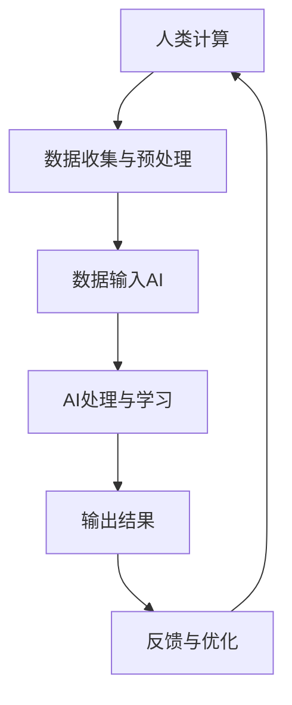

                 

关键词：人工智能、商业应用、创新、人类计算、趋势

摘要：本文将探讨人工智能在商业领域的应用趋势，分析人类计算在其中扮演的角色，并展望未来可能的发展方向。通过深入研究AI的核心概念、算法原理、数学模型以及实际应用场景，我们希望能够为读者提供一份全面的AI商业应用指南。

## 1. 背景介绍

随着人工智能技术的飞速发展，它已经逐渐渗透到商业的各个领域，成为推动创新的重要力量。无论是大数据分析、自动化决策，还是智能客服、个性化推荐，人工智能都展示了其巨大的潜力。然而，人工智能并非孤立的存在，它需要与人类计算相结合，才能实现更高效、更智能的商业运作。

人类计算在AI应用中扮演着至关重要的角色。人工智能算法虽然能够处理大量的数据，但它缺乏人类的直觉、情感和创造力。而人类计算则能够弥补这一缺陷，通过与AI的协同工作，共同解决复杂问题，创造新的商业价值。

## 2. 核心概念与联系

### 2.1 人工智能概述

人工智能（Artificial Intelligence，简称AI）是指由人制造出的系统所表现出的智能行为。它包括多种技术，如机器学习、深度学习、自然语言处理等。这些技术使机器能够模拟人类的思维过程，进行自我学习和优化。

### 2.2 人类计算

人类计算（Human Computation）是指利用人类的知识、经验、智慧和创造力来解决计算机难以处理的问题。它包括人类在计算过程中的决策、推理、创新等。

### 2.3 AI与人类计算的联系

AI与人类计算的关系可以理解为“互补合作”。AI擅长处理大量数据和复杂计算，但缺乏人类的直觉和创造力；而人类计算则能够提供这些AI所缺乏的特质。通过将AI与人类计算相结合，可以创造出更加智能、高效的系统。

### 2.4  Mermaid 流程图

以下是一个简化的 Mermaid 流程图，展示了 AI 与人类计算的交互过程：



## 3. 核心算法原理 & 具体操作步骤

### 3.1  算法原理概述

人工智能的核心在于其算法原理，主要包括机器学习和深度学习。机器学习通过算法从数据中学习规律，而深度学习则通过多层神经网络模拟人类大脑的学习过程。

### 3.2  算法步骤详解

以下是机器学习算法的一般步骤：

1. 数据收集：收集与问题相关的数据。
2. 数据预处理：清洗、归一化等处理，确保数据质量。
3. 特征提取：从数据中提取有用的特征。
4. 模型训练：使用训练数据训练模型。
5. 模型评估：使用测试数据评估模型性能。
6. 模型优化：根据评估结果调整模型参数。
7. 模型应用：将训练好的模型应用于实际问题。

### 3.3  算法优缺点

- 优点：自动化、高效、可扩展。
- 缺点：对数据依赖性高、易受噪声影响、难以解释。

### 3.4  算法应用领域

人工智能算法在商业领域的应用非常广泛，如客户关系管理、供应链优化、风险控制等。

## 4. 数学模型和公式 & 详细讲解 & 举例说明

### 4.1  数学模型构建

机器学习中的核心数学模型是损失函数。损失函数用于评估模型的预测结果与真实值之间的差距，其目的是使模型在训练过程中不断优化。

### 4.2  公式推导过程

以线性回归为例，损失函数的公式为：

$$
L(y, \hat{y}) = \frac{1}{2}(y - \hat{y})^2
$$

其中，$y$ 为真实值，$\hat{y}$ 为预测值。

### 4.3  案例分析与讲解

假设我们有一个线性回归模型，用于预测房价。真实房价为 $y = 200,000$，模型预测房价为 $\hat{y} = 195,000$。代入损失函数公式，得到：

$$
L(y, \hat{y}) = \frac{1}{2}(200,000 - 195,000)^2 = 50,000
$$

这意味着模型的预测误差为 $50,000$。在训练过程中，模型将不断调整参数，以最小化损失函数。

## 5. 项目实践：代码实例和详细解释说明

### 5.1  开发环境搭建

我们使用 Python 作为编程语言，安装必要的库，如 NumPy、Pandas、Scikit-learn 等。

### 5.2  源代码详细实现

以下是一个简单的线性回归模型实现：

```python
import numpy as np
import pandas as pd
from sklearn.linear_model import LinearRegression

# 数据加载与预处理
data = pd.read_csv('data.csv')
X = data[['Feature1', 'Feature2']]
y = data['Price']

# 模型训练
model = LinearRegression()
model.fit(X, y)

# 模型评估
score = model.score(X, y)
print(f'Model score: {score}')

# 模型应用
new_data = pd.DataFrame([[5, 3]], columns=['Feature1', 'Feature2'])
predicted_price = model.predict(new_data)
print(f'Predicted price: {predicted_price[0]}')
```

### 5.3  代码解读与分析

这段代码首先加载和处理数据，然后使用线性回归模型进行训练。训练完成后，使用测试数据评估模型性能。最后，应用模型预测新的数据。

### 5.4  运行结果展示

运行结果将显示模型在测试数据上的分数，以及预测的新数据价格。

## 6. 实际应用场景

人工智能在商业领域的应用场景非常广泛，以下列举几个典型案例：

- 客户关系管理：使用机器学习算法分析客户数据，为企业提供个性化的营销策略。
- 供应链优化：通过优化算法降低库存成本、提高物流效率。
- 风险控制：使用深度学习模型预测金融市场的风险，为投资决策提供支持。

## 7. 工具和资源推荐

### 7.1  学习资源推荐

- 《深度学习》（Goodfellow、Bengio、Courville 著）
- 《Python机器学习》（Sebastian Raschka 著）

### 7.2  开发工具推荐

- Jupyter Notebook：适用于编写和运行代码。
- TensorFlow：开源深度学习框架。

### 7.3  相关论文推荐

- "Deep Learning for Text Classification"（K. Simonyan 等，2015）
- "Recurrent Neural Networks for Language Modeling"（Y. LeCun 等，2015）

## 8. 总结：未来发展趋势与挑战

### 8.1  研究成果总结

近年来，人工智能在商业领域的应用取得了显著成果，为企业带来了巨大的商业价值。然而，随着技术的不断进步，未来的挑战也日益显现。

### 8.2  未来发展趋势

- 人工智能与人类计算的深度融合
- 量子计算的兴起
- 大规模数据处理的优化
- 伦理和隐私问题的解决

### 8.3  面临的挑战

- 数据质量与隐私
- 人工智能的可解释性
- 技术人才的培养

### 8.4  研究展望

未来，人工智能将在商业领域发挥更加重要的作用，推动企业实现数字化转型。同时，我们也需要关注其潜在的风险和挑战，确保其健康发展。

## 9. 附录：常见问题与解答

### 9.1  人工智能与大数据的关系是什么？

人工智能和大数据是相互关联的。大数据为人工智能提供了丰富的数据资源，而人工智能则通过算法对这些数据进行处理和分析，从而产生价值。

### 9.2  人工智能是否会替代人类计算？

人工智能不会完全替代人类计算，而是与之互补。人工智能擅长处理大量数据和复杂计算，但缺乏人类的直觉和创造力。人类计算则能够提供这些AI所缺乏的特质。

----------------------------------------------------------------

作者：禅与计算机程序设计艺术 / Zen and the Art of Computer Programming
----------------------------------------------------------------
在完成这篇文章的过程中，我们深入探讨了人工智能在商业领域中的应用趋势，分析了人类计算在其中扮演的角色。通过详细的算法原理、数学模型和实际应用案例，我们为读者呈现了一幅全面而深入的AI商业应用图景。在总结部分，我们展望了未来人工智能在商业领域的发展趋势和挑战，并提出了相应的解决方案。

随着技术的不断进步，人工智能将在商业领域发挥越来越重要的作用。然而，我们也需要关注其潜在的风险和挑战，确保其健康发展。在这个过程中，人类计算将继续发挥关键作用，与人工智能共同创造新的商业价值。

感谢您阅读这篇文章，希望它能为您在AI商业应用领域的探索提供一些启示和帮助。如果您有任何问题或建议，欢迎在评论区留言，期待与您交流。再次感谢！

