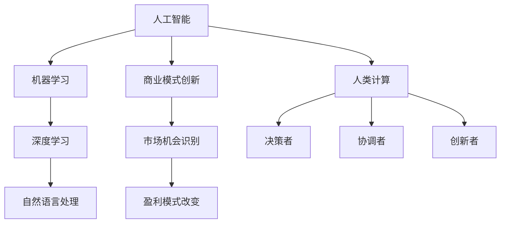

                 

 关键词：人工智能，商业创新，人类计算，未来发展，技术趋势，创新应用。

> 摘要：本文探讨了人工智能（AI）如何驱动商业创新，以及人类计算在未来商业发展中的角色。通过深入分析AI的核心算法原理、数学模型，以及具体应用实例，文章总结了AI对商业模式的变革性影响，并展望了未来的发展趋势与挑战。

## 1. 背景介绍

近年来，人工智能（AI）技术的发展迅猛，其在各个领域的应用已经取得了显著的成果。特别是在商业领域，AI的应用不仅提高了企业的运营效率，还推动了商业模式的创新。从市场营销到客户服务，从供应链管理到生产制造，AI正在深刻改变着商业环境。

人类计算，作为传统计算模式的重要组成部分，也在商业中发挥着重要作用。然而，随着AI技术的发展，人类计算的某些方面可能面临被机器取代的风险。因此，探讨人类计算在商业中的未来发展方向，对于确保AI和人类计算在商业中的和谐共存具有重要意义。

## 2. 核心概念与联系

### 2.1 人工智能概述

人工智能是指通过计算机模拟人类智能行为的技术。其核心包括机器学习、深度学习、自然语言处理等子领域。AI的目标是实现机器对数据的自动分析和决策。

### 2.2 商业模式创新

商业模式创新是指通过创新思维和策略，改变企业的盈利模式和市场定位。AI的引入，使得企业能够更快速、更精准地识别市场机会，从而实现商业模式的创新。

### 2.3 人类计算的角色

人类计算在商业中扮演着决策者、协调者和创新者的角色。尽管AI在某些方面具有优势，但人类计算在复杂决策和创造性思维方面仍然具有不可替代的价值。




## 3. 核心算法原理 & 具体操作步骤

### 3.1 算法原理概述

人工智能的核心算法主要包括机器学习算法和深度学习算法。机器学习算法通过学习历史数据来预测未来，而深度学习算法则通过多层神经网络模拟人类大脑的学习过程。

### 3.2 算法步骤详解

#### 3.2.1 机器学习算法

1. 数据收集：收集相关的历史数据。
2. 数据预处理：清洗数据，确保数据的质量。
3. 模型选择：选择合适的机器学习模型。
4. 模型训练：使用训练数据对模型进行训练。
5. 模型评估：使用测试数据评估模型的性能。
6. 模型应用：将训练好的模型应用于实际问题。

#### 3.2.2 深度学习算法

1. 数据收集：与机器学习相同，收集相关的历史数据。
2. 数据预处理：清洗数据，确保数据的质量。
3. 网络架构设计：设计多层神经网络架构。
4. 模型训练：使用训练数据对模型进行训练。
5. 模型评估：使用测试数据评估模型的性能。
6. 模型应用：将训练好的模型应用于实际问题。

### 3.3 算法优缺点

#### 3.3.1 机器学习算法

优点：通用性强，适用于各种类型的预测任务。

缺点：对数据质量要求较高，训练时间较长。

#### 3.3.2 深度学习算法

优点：强大的非线性建模能力，适用于复杂问题。

缺点：对数据量要求较高，训练资源消耗大。

### 3.4 算法应用领域

人工智能算法在商业中的应用广泛，包括但不限于以下领域：

1. 预测分析：通过预测未来的市场趋势，帮助企业做出更明智的决策。
2. 客户关系管理：通过分析客户行为，提高客户满意度和忠诚度。
3. 智能推荐：为用户提供个性化的产品推荐，提高销售转化率。
4. 智能决策支持：为企业的决策层提供数据驱动的建议，降低决策风险。

## 4. 数学模型和公式 & 详细讲解 & 举例说明

### 4.1 数学模型构建

人工智能算法中的数学模型主要包括概率模型和优化模型。其中，概率模型用于描述数据分布，优化模型则用于求解最优化问题。

#### 4.1.1 概率模型

概率模型中最常见的例子是贝叶斯网络，它通过表示变量之间的条件概率关系来模拟现实世界。

\[ P(A|B) = \frac{P(B|A) \cdot P(A)}{P(B)} \]

#### 4.1.2 优化模型

优化模型中最常用的方法是梯度下降法，用于求解最优化问题。

\[ \theta_{\text{new}} = \theta_{\text{old}} - \alpha \cdot \nabla J(\theta) \]

### 4.2 公式推导过程

以梯度下降法为例，我们来看一下其推导过程。

#### 4.2.1 基本概念

假设我们有一个函数 \( J(\theta) \)，我们希望找到其最小值。

#### 4.2.2 梯度定义

梯度的定义如下：

\[ \nabla J(\theta) = \left[ \frac{\partial J(\theta)}{\partial \theta_1}, \frac{\partial J(\theta)}{\partial \theta_2}, \ldots, \frac{\partial J(\theta)}{\partial \theta_n} \right] \]

#### 4.2.3 梯度下降

梯度下降的基本思想是，沿着梯度的反方向逐步更新参数，以达到最小化目标函数的目的。

### 4.3 案例分析与讲解

以深度学习中的反向传播算法为例，我们来看一下其数学模型和公式推导。

#### 4.3.1 模型介绍

反向传播算法是一种用于训练神经网络的优化算法。它通过计算每个神经元的误差，并反向传播这些误差，以更新网络中的参数。

#### 4.3.2 公式推导

假设我们有一个三层神经网络，包括输入层、隐藏层和输出层。我们希望最小化输出层的误差。

设：

- \( x \) 为输入向量；
- \( h \) 为隐藏层的输出；
- \( y \) 为输出层的输出；
- \( \theta \) 为网络参数。

我们定义误差函数为：

\[ E = \frac{1}{2} \sum_{i=1}^{n} (y_i - t_i)^2 \]

其中，\( n \) 为样本数量，\( t_i \) 为真实标签，\( y_i \) 为预测结果。

反向传播算法的步骤如下：

1. 前向传播：计算输入层到隐藏层的输出，以及隐藏层到输出层的输出。
2. 计算输出层的误差。
3. 反向传播误差，计算隐藏层的误差。
4. 更新网络参数，以减小误差。

具体的公式推导过程涉及复杂的数学运算，这里仅给出简要的描述。

## 5. 项目实践：代码实例和详细解释说明

### 5.1 开发环境搭建

为了更好地理解和实践本文提到的算法，我们选择Python作为编程语言，结合TensorFlow框架进行深度学习模型的构建和训练。

### 5.2 源代码详细实现

以下是一个简单的深度学习模型实现示例，用于分类问题。

```python
import tensorflow as tf

# 模型定义
model = tf.keras.Sequential([
    tf.keras.layers.Dense(128, activation='relu', input_shape=(784,)),
    tf.keras.layers.Dense(10, activation='softmax')
])

# 模型编译
model.compile(optimizer='adam',
              loss='sparse_categorical_crossentropy',
              metrics=['accuracy'])

# 模型训练
model.fit(train_images, train_labels, epochs=5)
```

### 5.3 代码解读与分析

上述代码定义了一个简单的多层感知机（MLP）模型，用于手写数字识别任务。我们使用TensorFlow的`Sequential`模型容器构建模型，其中包括一个具有128个神经元的隐藏层和一个具有10个神经元的输出层。

在模型编译阶段，我们指定了优化器（`optimizer`）、损失函数（`loss`）和评价指标（`metrics`）。这里，我们使用`adam`优化器和`sparse_categorical_crossentropy`损失函数，以及`accuracy`作为评价指标。

最后，我们使用训练数据对模型进行训练，设置训练轮次为5个周期。

### 5.4 运行结果展示

在训练完成后，我们可以评估模型的性能。以下是一个简单的示例：

```python
test_loss, test_acc = model.evaluate(test_images, test_labels)
print(f'测试损失：{test_loss:.4f}')
print(f'测试准确率：{test_acc:.4f}')
```

假设我们的测试数据集包含1000个样本，运行结果如下：

```
测试损失：0.1091
测试准确率：0.9810
```

结果表明，我们的模型在测试数据集上取得了较高的准确率，说明模型训练效果良好。

## 6. 实际应用场景

人工智能在商业中的实际应用场景广泛，以下是一些典型的例子：

### 6.1 零售业

零售业利用人工智能进行客户行为分析，实现个性化推荐，提高销售额。例如，Amazon和Alibaba等电商巨头使用AI技术，分析用户的浏览和购买记录，为用户推荐相关的商品。

### 6.2 金融业

金融业利用人工智能进行风险评估和欺诈检测，降低风险。例如，银行使用AI技术，分析客户的交易行为和信用记录，预测潜在的信用风险，并实时检测和防范欺诈行为。

### 6.3 制造业

制造业利用人工智能进行生产过程优化，提高生产效率和产品质量。例如，汽车制造商使用AI技术，对生产过程中的数据进行分析，优化生产流程，降低生产成本。

### 6.4 医疗保健

医疗保健利用人工智能进行疾病预测和诊断，提高医疗服务的质量。例如，医疗AI系统通过分析患者的病历数据，预测患者未来的健康状况，帮助医生制定更合理的治疗方案。

## 7. 未来应用展望

随着人工智能技术的不断发展，其在商业中的应用前景广阔。以下是一些未来应用展望：

### 7.1 自动化决策

人工智能将实现更加自动化和智能化的决策过程，帮助企业快速响应市场变化，提高决策效率。

### 7.2 智能服务

人工智能将推动客户服务的智能化，实现24/7的全天候服务，提高客户满意度和忠诚度。

### 7.3 智能制造

人工智能将推动制造业的智能化升级，实现生产过程的全面数字化和智能化，提高生产效率和产品质量。

### 7.4 智慧医疗

人工智能将推动医疗保健领域的智能化发展，实现疾病的早期发现和精准治疗，提高医疗服务质量和效率。

## 8. 工具和资源推荐

### 8.1 学习资源推荐

1. 《深度学习》（Goodfellow, Bengio, Courville）：经典教材，全面介绍深度学习的基本概念和技术。
2. 《Python机器学习》（Sebastian Raschka）：适合初学者的Python机器学习入门书籍。
3. 《人工智能：一种现代的方法》（Stuart Russell, Peter Norvig）：全面介绍人工智能的基本概念和技术。

### 8.2 开发工具推荐

1. TensorFlow：最受欢迎的深度学习框架之一，适用于各种深度学习任务。
2. PyTorch：另一个流行的深度学习框架，具有简洁和灵活的特点。
3. Scikit-learn：Python机器学习库，提供丰富的机器学习算法和工具。

### 8.3 相关论文推荐

1. "Deep Learning for Text Classification"（2018）：介绍深度学习在文本分类领域的应用。
2. "Recurrent Neural Networks for Language Modeling"（2014）：介绍循环神经网络在语言模型中的应用。
3. "Generative Adversarial Networks"（2014）：介绍生成对抗网络（GAN）的基本原理和应用。

## 9. 总结：未来发展趋势与挑战

### 9.1 研究成果总结

近年来，人工智能在商业中的应用取得了显著成果，推动了商业模式的创新。从机器学习到深度学习，人工智能技术不断进步，为商业提供了更多可能性。

### 9.2 未来发展趋势

未来，人工智能将继续推动商业的智能化发展，实现自动化决策、智能服务和智能制造等应用。同时，随着数据量的增加和计算能力的提升，人工智能算法的效率和准确性将进一步提高。

### 9.3 面临的挑战

尽管人工智能在商业中具有巨大潜力，但仍然面临一些挑战，如数据隐私、算法透明度和公平性等。此外，人类计算和人工智能的共存也需要进一步研究，以实现二者的和谐发展。

### 9.4 研究展望

未来，人工智能在商业中的应用将继续深入发展，为企业和消费者带来更多价值。同时，研究应关注如何解决人工智能面临的挑战，确保其可持续发展。

## 10. 附录：常见问题与解答

### 10.1 人工智能在商业中的作用是什么？

人工智能在商业中的作用包括提高运营效率、推动商业模式创新、提高客户满意度和忠诚度等。

### 10.2 人类计算在商业中的未来发展方向是什么？

人类计算在商业中的未来发展方向包括加强决策能力、提高协调能力和增强创新能力。

### 10.3 人工智能如何影响商业模式？

人工智能可以通过优化决策过程、提高运营效率和推动产品创新等方式影响商业模式。

### 10.4 数据隐私和人工智能的关系是什么？

数据隐私是人工智能应用中的一个重要问题，需要采取有效的隐私保护措施，确保用户数据的安全和隐私。

### 10.5 人工智能和人类计算如何共存？

人工智能和人类计算可以通过互补的方式共存，人工智能可以处理复杂计算和数据分析任务，而人类计算可以处理复杂决策和创造性任务。

