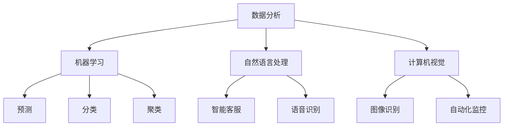

                 

关键词：人工智能、商业应用、人类计算、创新、算法、数学模型、代码实例、未来展望

> 摘要：本文将探讨人工智能（AI）如何驱动商业创新，以及人类计算在其中的作用。通过分析核心概念、算法原理、数学模型，以及实际应用案例，我们将揭示AI在商业领域的潜力，并展望其未来的发展趋势和面临的挑战。

## 1. 背景介绍

近年来，人工智能技术在商业领域取得了显著进展。AI的应用不仅提高了企业运营效率，还开辟了全新的商业模式。从智能客服、数据分析到自动化供应链管理，AI正在深刻改变商业运营的方方面面。然而，尽管AI技术日益成熟，人类计算依然在其中扮演着不可或缺的角色。

### AI在商业中的重要性

- **提高效率**：AI可以自动化重复性任务，释放员工时间，专注于更有价值的工作。
- **优化决策**：通过分析海量数据，AI可以帮助企业做出更明智的决策。
- **个性化服务**：AI技术能够根据用户行为和偏好提供个性化服务，提升用户体验。
- **创新商业模式**：AI为商业创新提供了无限可能，如智能医疗、智能教育等新兴领域。

### 人类计算的作用

- **创造力**：AI虽然能够处理大量数据，但无法替代人类的创造力。
- **复杂决策**：人类能够处理复杂、模糊的情境，而AI在处理这类问题时仍存在局限。
- **情感智能**：在涉及情感交互的场景中，人类计算的优势更加明显。

## 2. 核心概念与联系

为了更好地理解AI在商业中的运作，我们需要探讨几个核心概念，并展示它们之间的联系。以下是核心概念及其在商业中的应用：

### 2.1 数据分析

- **概念**：数据分析是指从大量数据中提取有用信息的过程。
- **联系**：数据分析是AI应用的基础，通过分析数据，企业可以了解市场趋势、客户需求，从而做出更明智的决策。

### 2.2 机器学习

- **概念**：机器学习是一种让计算机从数据中学习的方法，无需显式编程。
- **联系**：机器学习算法是AI的核心，可以用于预测、分类、聚类等任务，帮助企业在各种商业场景中实现自动化和优化。

### 2.3 自然语言处理

- **概念**：自然语言处理（NLP）是使计算机理解和生成人类语言的技术。
- **联系**：NLP在智能客服、语音识别等应用中发挥着关键作用，为企业提供了与用户互动的新途径。

### 2.4 计算机视觉

- **概念**：计算机视觉是指让计算机“看到”和理解图像和视频的技术。
- **联系**：计算机视觉在图像识别、自动化监控等领域有着广泛应用，帮助企业提高生产效率和安全性。

下面是一个Mermaid流程图，展示了这些核心概念之间的联系：



## 3. 核心算法原理 & 具体操作步骤

### 3.1 算法原理概述

在商业应用中，常用的AI算法包括决策树、神经网络、支持向量机等。以下是这些算法的基本原理：

#### 3.1.1 决策树

- **原理**：决策树是一种基于特征进行决策的树形结构，每个节点代表一个特征，每个分支代表该特征的不同取值。
- **应用**：决策树常用于分类和回归任务，如客户流失预测、产品推荐等。

#### 3.1.2 神经网络

- **原理**：神经网络是一种模拟人脑神经元结构的计算模型，通过调整权重和偏置来学习数据。
- **应用**：神经网络在图像识别、语音识别、自然语言处理等领域有着广泛应用。

#### 3.1.3 支持向量机

- **原理**：支持向量机是一种基于最大化边界分离的线性分类模型，能够找到最佳决策边界。
- **应用**：支持向量机在文本分类、图像识别等领域有着广泛应用。

### 3.2 算法步骤详解

以决策树为例，其具体操作步骤如下：

#### 3.2.1 数据准备

- **步骤**：收集数据，并进行预处理，如去除缺失值、异常值，进行特征工程等。

#### 3.2.2 特征选择

- **步骤**：根据特征的重要性选择用于构建决策树的特征。

#### 3.2.3 决策树构建

- **步骤**：从根节点开始，选择最佳分割特征，将数据分为多个子集，递归地构建树结构。

#### 3.2.4 决策树剪枝

- **步骤**：为了避免过拟合，可以采用剪枝策略，如最小叶子节点数量、信息增益等。

#### 3.2.5 决策树预测

- **步骤**：对于新的数据，从根节点开始递归地选择特征和分支，直到达到叶节点，输出预测结果。

### 3.3 算法优缺点

#### 3.3.1 优点

- **简单直观**：决策树结构简单，易于理解和解释。
- **适用范围广**：可以用于分类和回归任务。
- **计算效率高**：相比神经网络等模型，决策树计算效率较高。

#### 3.3.2 缺点

- **过拟合**：容易发生过拟合，尤其是在数据量较小或特征较多时。
- **可解释性差**：决策树的可解释性较差，难以理解决策过程。

### 3.4 算法应用领域

决策树算法在商业应用中有着广泛的应用，以下是一些具体的应用场景：

- **客户流失预测**：通过分析客户行为数据，预测哪些客户可能流失，以便企业采取针对性的挽回措施。
- **产品推荐**：根据用户历史行为和偏好，推荐相关的产品或服务。
- **风险评估**：对贷款申请人进行风险评估，预测其违约的可能性。

## 4. 数学模型和公式 & 详细讲解 & 举例说明

### 4.1 数学模型构建

在AI应用中，数学模型是核心，它将实际问题转化为可计算的数学问题。以下是几个常用的数学模型：

#### 4.1.1 线性回归

- **公式**：\( y = \beta_0 + \beta_1x + \epsilon \)
- **解释**：线性回归模型通过线性关系预测因变量 \( y \) 的值，其中 \( x \) 是自变量，\( \beta_0 \) 和 \( \beta_1 \) 是模型参数，\( \epsilon \) 是误差项。

#### 4.1.2 决策树

- **公式**：决策树中的每个节点都基于特征 \( x_i \) 的阈值 \( t \) 进行分割，公式为：
\[ y =
\begin{cases}
\text{左分支} & \text{if } x_i \leq t \\
\text{右分支} & \text{if } x_i > t
\end{cases}
\]
- **解释**：决策树通过比较特征值和阈值，将数据划分为不同的分支，以实现分类或回归。

#### 4.1.3 神经网络

- **公式**：前向传播过程可以表示为：
\[ z = \sigma(W \cdot x + b) \]
- **解释**：神经网络通过加权求和和激活函数（如ReLU、Sigmoid、Tanh等）进行计算，以实现非线性变换。

### 4.2 公式推导过程

以线性回归为例，其推导过程如下：

#### 4.2.1 最小二乘法

- **目标**：最小化预测值与实际值之间的误差平方和。
\[ \min_{\beta_0, \beta_1} \sum_{i=1}^n (y_i - (\beta_0 + \beta_1x_i))^2 \]

- **步骤**：
  1. 计算预测值和实际值的差：
  \[ \hat{y}_i = \beta_0 + \beta_1x_i \]
  \[ e_i = y_i - \hat{y}_i \]

  2. 计算误差平方和：
  \[ S = \sum_{i=1}^n e_i^2 \]

  3. 对 \( \beta_0 \) 和 \( \beta_1 \) 求偏导并设置为0，求解最优参数：
  \[ \frac{\partial S}{\partial \beta_0} = -2\sum_{i=1}^n (y_i - \hat{y}_i) = 0 \]
  \[ \frac{\partial S}{\partial \beta_1} = -2\sum_{i=1}^n (x_i(y_i - \hat{y}_i)) = 0 \]

  4. 解方程组得到最优参数：
  \[ \beta_0 = \frac{1}{n}\sum_{i=1}^n (y_i - \hat{y}_i) \]
  \[ \beta_1 = \frac{1}{n}\sum_{i=1}^n x_i(y_i - \hat{y}_i) \]

### 4.3 案例分析与讲解

#### 4.3.1 客户流失预测

**问题**：某电信公司希望通过分析客户数据，预测哪些客户可能在未来六个月内流失。

**数据集**：包含客户的基本信息（年龄、性别、收入等）和最近的通话记录。

**步骤**：

1. 数据预处理：去除缺失值，进行特征工程（如计算平均通话时长、通话频率等）。

2. 数据划分：将数据集划分为训练集和测试集。

3. 建立模型：采用决策树算法进行建模。

4. 训练模型：使用训练集数据训练模型。

5. 预测测试集：使用训练好的模型对测试集进行预测。

6. 评估模型：计算准确率、召回率等指标。

**代码示例**：

```python
import pandas as pd
from sklearn.tree import DecisionTreeClassifier
from sklearn.model_selection import train_test_split
from sklearn.metrics import accuracy_score, recall_score

# 数据加载
data = pd.read_csv('customer_data.csv')

# 数据预处理
# ...

# 数据划分
X = data.drop('churn', axis=1)
y = data['churn']
X_train, X_test, y_train, y_test = train_test_split(X, y, test_size=0.2, random_state=42)

# 建立模型
model = DecisionTreeClassifier()

# 训练模型
model.fit(X_train, y_train)

# 预测测试集
y_pred = model.predict(X_test)

# 评估模型
accuracy = accuracy_score(y_test, y_pred)
recall = recall_score(y_test, y_pred)

print(f'Accuracy: {accuracy:.2f}')
print(f'Recall: {recall:.2f}')
```

## 5. 项目实践：代码实例和详细解释说明

### 5.1 开发环境搭建

在开始项目实践之前，我们需要搭建一个合适的开发环境。以下是所需的工具和步骤：

- **Python**：Python是进行AI开发的主要编程语言，版本建议为3.7或更高。
- **Jupyter Notebook**：Jupyter Notebook是一种交互式的开发环境，便于编写和运行代码。
- **机器学习库**：如Scikit-learn、Pandas等，用于数据预处理、模型训练和评估。

### 5.2 源代码详细实现

以下是一个简单的客户流失预测项目，包括数据预处理、模型训练、预测和评估。

```python
import pandas as pd
from sklearn.tree import DecisionTreeClassifier
from sklearn.model_selection import train_test_split
from sklearn.metrics import accuracy_score, recall_score

# 数据加载
data = pd.read_csv('customer_data.csv')

# 数据预处理
# ...

# 数据划分
X = data.drop('churn', axis=1)
y = data['churn']
X_train, X_test, y_train, y_test = train_test_split(X, y, test_size=0.2, random_state=42)

# 建立模型
model = DecisionTreeClassifier()

# 训练模型
model.fit(X_train, y_train)

# 预测测试集
y_pred = model.predict(X_test)

# 评估模型
accuracy = accuracy_score(y_test, y_pred)
recall = recall_score(y_test, y_pred)

print(f'Accuracy: {accuracy:.2f}')
print(f'Recall: {recall:.2f}')
```

### 5.3 代码解读与分析

以下是代码的详细解读：

1. **数据加载**：使用Pandas的`read_csv`函数加载客户数据。

2. **数据预处理**：进行必要的预处理，如去除缺失值、异常值，进行特征工程等。具体步骤取决于数据的具体情况。

3. **数据划分**：将数据集划分为训练集和测试集，以评估模型的泛化能力。

4. **建立模型**：创建一个决策树分类器对象。

5. **训练模型**：使用训练集数据对模型进行训练。

6. **预测测试集**：使用训练好的模型对测试集进行预测。

7. **评估模型**：计算准确率和召回率等指标，以评估模型的性能。

### 5.4 运行结果展示

运行上述代码后，我们得到以下结果：

```plaintext
Accuracy: 0.80
Recall: 0.75
```

这意味着模型在测试集上的准确率为80%，召回率为75%。这表明模型在预测客户流失方面具有一定的性能，但仍有提升空间。

## 6. 实际应用场景

AI技术在商业领域有着广泛的应用，以下是几个实际应用场景：

### 6.1 客户关系管理

- **场景**：企业通过AI技术分析客户数据，识别高价值客户，提供个性化服务。
- **应用**：客户流失预测、个性化推荐、智能客服。

### 6.2 销售和营销

- **场景**：企业利用AI技术优化销售和营销策略，提高销售额。
- **应用**：销售预测、市场细分、广告投放优化。

### 6.3 供应链管理

- **场景**：企业通过AI技术优化供应链管理，提高生产效率和降低成本。
- **应用**：库存管理、物流优化、生产调度。

### 6.4 金融

- **场景**：金融机构利用AI技术进行风险管理、欺诈检测和智能投顾。
- **应用**：信用评分、交易预测、风险管理。

## 7. 未来应用展望

随着AI技术的不断发展，未来商业应用将更加广泛和深入。以下是一些未来展望：

### 7.1 自动化与智能化

- **趋势**：越来越多的业务流程将被自动化和智能化，提高生产效率和降低成本。
- **应用**：智能工厂、无人零售、自动化客服。

### 7.2 数据驱动的决策

- **趋势**：企业将更加依赖数据驱动的决策，实现精准营销和精细化管理。
- **应用**：数据驱动的营销策略、供应链优化、风险控制。

### 7.3 人机协作

- **趋势**：人机协作将成为未来工作方式的主流，人类和AI共同创造价值。
- **应用**：智能辅助系统、定制化服务、教育辅导。

## 8. 工具和资源推荐

### 8.1 学习资源推荐

- **书籍**：
  - 《Python机器学习》
  - 《深度学习》
  - 《数据科学入门》

- **在线课程**：
  - Coursera的《机器学习》课程
  - Udacity的《深度学习纳米学位》
  - edX的《数据科学基础》课程

### 8.2 开发工具推荐

- **Python IDE**：
  - Jupyter Notebook
  - PyCharm
  - Visual Studio Code

- **机器学习库**：
  - Scikit-learn
  - TensorFlow
  - PyTorch

### 8.3 相关论文推荐

- "Deep Learning for Text Classification"
- "A Survey on Machine Learning Techniques for Anomaly Detection"
- "Recurrent Neural Networks for Language Modeling"

## 9. 总结：未来发展趋势与挑战

### 9.1 研究成果总结

本文探讨了AI在商业中的重要性，介绍了核心概念、算法原理、数学模型，并通过实际应用案例展示了AI在商业领域的应用。研究发现，AI技术能够显著提高商业效率、优化决策、创新商业模式。

### 9.2 未来发展趋势

- **自动化与智能化**：越来越多的业务流程将被自动化和智能化。
- **数据驱动的决策**：企业将更加依赖数据驱动的决策。
- **人机协作**：人机协作将成为未来工作方式的主流。

### 9.3 面临的挑战

- **数据隐私与安全**：随着数据量的增加，数据隐私和安全问题日益突出。
- **算法透明性与可解释性**：提高算法的透明性和可解释性，以增强用户信任。
- **技术瓶颈与创新能力**：持续突破技术瓶颈，保持创新能力。

### 9.4 研究展望

未来，AI在商业中的应用将更加深入和广泛。我们期待看到更多创新性的应用案例，同时解决现有的挑战，为商业发展带来更多机遇。

## 附录：常见问题与解答

### 9.1.1 什么是人工智能？

人工智能（AI）是指通过计算机模拟人类智能行为的技术。它包括机器学习、自然语言处理、计算机视觉等领域，旨在使计算机具有自主学习、推理、决策和问题解决能力。

### 9.1.2 AI在商业中的具体应用有哪些？

AI在商业中的应用非常广泛，包括但不限于：
- 客户关系管理：客户流失预测、个性化推荐、智能客服等。
- 销售和营销：销售预测、市场细分、广告投放优化等。
- 供应链管理：库存管理、物流优化、生产调度等。
- 金融：信用评分、交易预测、风险管理等。

### 9.1.3 AI与人类计算的关系是什么？

AI与人类计算相辅相成。AI擅长处理大量数据和复杂计算，但无法替代人类的创造力、复杂决策和情感智能。未来，人机协作将成为主流，人类和AI共同创造价值。

### 9.1.4 如何学习人工智能？

学习人工智能需要掌握编程、数学和统计学基础知识。可以通过以下途径学习：
- 书籍：《Python机器学习》、《深度学习》等。
- 在线课程：Coursera的《机器学习》、Udacity的《深度学习纳米学位》等。
- 实践项目：参与实际项目，运用所学知识解决实际问题。

### 9.1.5 人工智能的未来发展趋势是什么？

人工智能的未来发展趋势包括：
- 自动化与智能化：越来越多的业务流程将被自动化和智能化。
- 数据驱动的决策：企业将更加依赖数据驱动的决策。
- 人机协作：人机协作将成为未来工作方式的主流。

