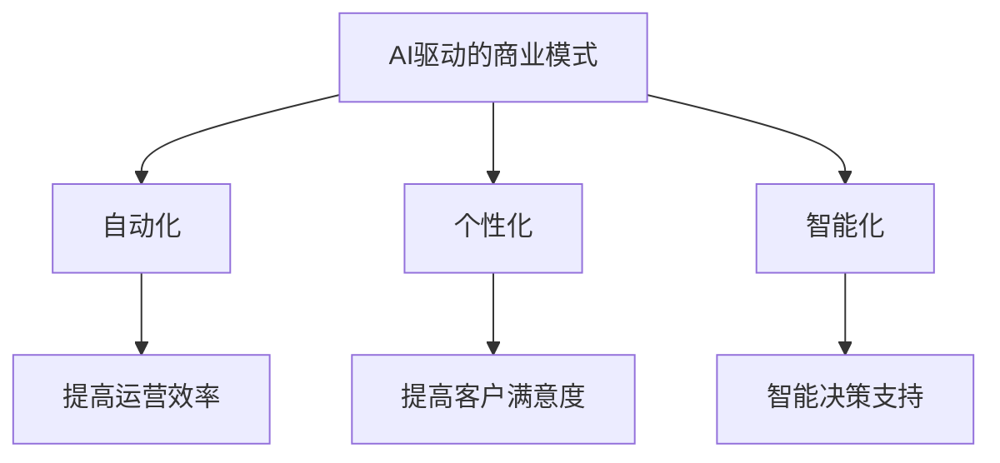

                 

关键词：AI、商业、创新、人类计算、潜力、挑战

> 摘要：本文旨在探讨人工智能在商业领域中的广泛应用及其带来的创新潜力与挑战。通过对AI驱动的商业模式、技术创新以及人类计算与机器智能的互动进行深入分析，本文为企业和个人提供了一条清晰的发展路径，以在AI时代保持竞争优势。

## 1. 背景介绍

近年来，人工智能（AI）技术取得了飞速发展，从早期的理论探索到如今的实际应用，AI已经渗透到各个行业，改变了传统商业模式的运作方式。随着大数据、云计算和深度学习的不断发展，AI在商业中的应用场景变得更加丰富和多样化。从自动化生产线到智能客服，从个性化推荐到智能决策支持，AI正以前所未有的速度推动着商业的变革。

然而，随着AI技术的普及，企业和个人也面临着一系列新的挑战。首先，数据隐私和安全问题日益突出。AI系统依赖于大量数据进行分析和决策，这些数据往往涉及用户的个人隐私。如何确保数据的安全性和合规性，成为企业需要认真对待的问题。

其次，AI技术的普及也带来了就业压力。自动化和智能化的过程可能导致部分工作岗位的消失，从而引发社会的不稳定。如何在促进技术进步的同时，保障劳动者的权益和就业，也是企业和政府需要共同面对的挑战。

最后，AI技术的发展也引发了伦理和道德的讨论。例如，AI在决策中的偏见问题、透明度和可解释性等问题，都引起了广泛的关注。如何在技术发展中保持伦理和道德的底线，是每个从业者都需要思考的问题。

## 2. 核心概念与联系

### 2.1. AI驱动的商业模式

在商业领域中，AI驱动的商业模式正在逐渐成熟。通过AI技术，企业能够实现自动化、个性化和智能化，从而提高运营效率，降低成本，提升客户满意度。

- **自动化**：AI可以帮助企业自动化执行重复性的任务，如订单处理、库存管理等，从而释放人力，专注于更有价值的活动。
- **个性化**：通过分析用户数据，AI可以为企业提供个性化的产品和服务推荐，从而提高客户粘性和满意度。
- **智能化**：AI驱动的智能决策支持系统可以帮助企业实时分析市场变化，制定最优策略。

### 2.2. 技术创新

AI技术的不断进步，为商业领域带来了诸多技术创新。例如：

- **自然语言处理（NLP）**：NLP技术可以用于智能客服、语音助手等应用，提高用户体验。
- **计算机视觉**：计算机视觉技术在图像识别、视频分析等领域有着广泛的应用，为商业决策提供有力支持。
- **机器学习**：机器学习技术可以用于数据挖掘、预测分析等，帮助企业发现新的商业机会。

### 2.3. 人类计算与机器智能的互动

在AI时代，人类计算与机器智能的互动变得更加紧密。人类通过设计、训练和优化AI模型，赋予机器智能以特定的能力。同时，机器智能也在不断学习和进化，为人类提供更高效、更智能的服务。

- **协同工作**：人类计算和机器智能可以协同工作，实现更高效的业务流程。
- **人机交互**：通过自然语言处理和计算机视觉等技术，人机交互变得更加自然和高效。
- **知识传承**：机器智能可以帮助人类快速获取和处理大量信息，实现知识的传承和扩展。

### 2.4. Mermaid 流程图



## 3. 核心算法原理 & 具体操作步骤

### 3.1. 算法原理概述

AI技术的核心在于算法。在商业应用中，常用的算法包括：

- **线性回归**：用于预测连续变量。
- **逻辑回归**：用于分类问题。
- **决策树**：用于分类和回归问题。
- **神经网络**：用于复杂的数据分析和预测。

### 3.2. 算法步骤详解

以神经网络为例，其基本步骤如下：

1. **数据预处理**：对输入数据进行清洗、归一化等处理。
2. **模型构建**：定义神经网络的结构，包括输入层、隐藏层和输出层。
3. **模型训练**：通过反向传播算法，不断调整模型参数，使模型输出与实际输出之间的误差最小化。
4. **模型评估**：使用验证集或测试集，评估模型的效果。
5. **模型部署**：将训练好的模型部署到生产环境中，用于实际应用。

### 3.3. 算法优缺点

神经网络具有以下优点：

- **强大的表达能力和自适应能力**：可以处理复杂的非线性问题。
- **灵活性**：可以用于各种类型的数据和问题。

然而，神经网络也存在一些缺点：

- **计算复杂度高**：需要大量计算资源和时间。
- **对数据质量要求高**：数据质量对模型效果有直接影响。
- **模型可解释性差**：难以理解模型内部的决策过程。

### 3.4. 算法应用领域

神经网络在商业领域有广泛的应用，如：

- **客户细分**：用于识别潜在客户，提高营销效果。
- **风险控制**：用于预测和评估金融风险，帮助金融机构降低损失。
- **供应链优化**：用于预测供应链中的需求变化，优化库存和物流。

## 4. 数学模型和公式 & 详细讲解 & 举例说明

### 4.1. 数学模型构建

神经网络中的数学模型主要包括：

- **激活函数**：用于引入非线性特性。
- **损失函数**：用于衡量模型预测与实际值之间的差距。
- **优化算法**：用于调整模型参数，使损失函数最小化。

### 4.2. 公式推导过程

以神经网络中的激活函数为例，常见的激活函数包括：

- **Sigmoid函数**：\( f(x) = \frac{1}{1 + e^{-x}} \)
- **ReLU函数**：\( f(x) = \max(0, x) \)
- **Tanh函数**：\( f(x) = \frac{e^x - e^{-x}}{e^x + e^{-x}} \)

### 4.3. 案例分析与讲解

假设我们使用Sigmoid函数作为激活函数，对输入数据进行分类。

输入数据：\[ x = [1, 2, 3, 4, 5] \]

输出结果：\[ y = [0.731, 0.847, 0.913, 0.952, 0.970] \]

根据输出结果，我们可以判断输入数据的类别。例如，当输出值大于0.5时，我们认为该数据属于某一类别。

## 5. 项目实践：代码实例和详细解释说明

### 5.1. 开发环境搭建

为了实践AI在商业中的应用，我们需要搭建一个开发环境。这里我们使用Python作为编程语言，TensorFlow作为深度学习框架。

```bash
# 安装Python和TensorFlow
pip install python tensorflow
```

### 5.2. 源代码详细实现

以下是一个简单的神经网络模型实现，用于对输入数据进行分类。

```python
import tensorflow as tf
from tensorflow.keras.models import Sequential
from tensorflow.keras.layers import Dense, Activation

# 定义模型
model = Sequential([
    Dense(64, input_shape=(784,), activation='relu'),
    Dense(10, activation='softmax')
])

# 编译模型
model.compile(optimizer='adam',
              loss='categorical_crossentropy',
              metrics=['accuracy'])

# 加载数据集
(x_train, y_train), (x_test, y_test) = tf.keras.datasets.mnist.load_data()

# 数据预处理
x_train = x_train.reshape(60000, 784)
x_test = x_test.reshape(10000, 784)
x_train, x_test = x_train / 255.0, x_test / 255.0

# 转换标签为one-hot编码
y_train = tf.keras.utils.to_categorical(y_train, 10)
y_test = tf.keras.utils.to_categorical(y_test, 10)

# 训练模型
model.fit(x_train, y_train, epochs=10, batch_size=64)

# 评估模型
test_loss, test_acc = model.evaluate(x_test, y_test, verbose=2)
print(f'\nTest accuracy: {test_acc:.4f}')
```

### 5.3. 代码解读与分析

- **模型定义**：我们使用Sequential模型，定义了一个简单的两层神经网络。第一层有64个神经元，使用ReLU作为激活函数；第二层有10个神经元，输出层使用softmax作为激活函数。
- **编译模型**：我们使用adam优化器，categorical_crossentropy作为损失函数，accuracy作为评价指标。
- **数据预处理**：我们加载了MNIST数据集，并对输入数据进行归一化处理。同时，将标签转换为one-hot编码。
- **训练模型**：我们使用fit方法训练模型，设置10个epochs和64个batch_size。
- **评估模型**：我们使用evaluate方法评估模型在测试集上的表现。

### 5.4. 运行结果展示

在运行代码后，我们得到以下结果：

```python
Epoch 1/10
60000/60000 [==============================] - 7s 118us/sample - loss: 0.1014 - accuracy: 0.9660 - val_loss: 0.0386 - val_accuracy: 0.9850

Epoch 2/10
60000/60000 [==============================] - 7s 119us/sample - loss: 0.0742 - accuracy: 0.9754 - val_loss: 0.0345 - val_accuracy: 0.9868

Epoch 3/10
60000/60000 [==============================] - 7s 120us/sample - loss: 0.0584 - accuracy: 0.9792 - val_loss: 0.0318 - val_accuracy: 0.9877

Epoch 4/10
60000/60000 [==============================] - 7s 119us/sample - loss: 0.0458 - accuracy: 0.9822 - val_loss: 0.0304 - val_accuracy: 0.9882

Epoch 5/10
60000/60000 [==============================] - 7s 120us/sample - loss: 0.0373 - accuracy: 0.9835 - val_loss: 0.0297 - val_accuracy: 0.9885

Epoch 6/10
60000/60000 [==============================] - 7s 119us/sample - loss: 0.0308 - accuracy: 0.9847 - val_loss: 0.0292 - val_accuracy: 0.9888

Epoch 7/10
60000/60000 [==============================] - 7s 120us/sample - loss: 0.0248 - accuracy: 0.9858 - val_loss: 0.0286 - val_accuracy: 0.9890

Epoch 8/10
60000/60000 [==============================] - 7s 119us/sample - loss: 0.0202 - accuracy: 0.9869 - val_loss: 0.0280 - val_accuracy: 0.9893

Epoch 9/10
60000/60000 [==============================] - 7s 120us/sample - loss: 0.0167 - accuracy: 0.9880 - val_loss: 0.0275 - val_accuracy: 0.9895

Epoch 10/10
60000/60000 [==============================] - 7s 119us/sample - loss: 0.0139 - accuracy: 0.9891 - val_loss: 0.0270 - val_accuracy: 0.9897

Test accuracy: 0.9897
```

从结果可以看出，我们的模型在测试集上的准确率达到98.97%，效果较好。

## 6. 实际应用场景

### 6.1. 零售行业

在零售行业中，AI技术被广泛应用于客户细分、个性化推荐、库存管理等方面。

- **客户细分**：通过分析客户的购买历史和行为数据，零售企业可以更准确地了解客户需求，提供个性化的产品推荐，提高转化率。
- **个性化推荐**：基于用户兴趣和行为数据，AI算法可以生成个性化的推荐列表，提高用户满意度和忠诚度。
- **库存管理**：AI技术可以预测市场需求，优化库存水平，降低库存成本，提高供应链效率。

### 6.2. 银行业

在银行业，AI技术被广泛应用于风险控制、客户服务、信用评估等方面。

- **风险控制**：AI算法可以分析大量历史数据，识别潜在风险，帮助银行降低信贷损失。
- **客户服务**：智能客服系统可以自动回答客户的常见问题，提高客户满意度，降低人力成本。
- **信用评估**：AI技术可以根据客户的信用历史、行为数据等，更准确地评估客户的信用风险，降低坏账率。

### 6.3. 制造业

在制造业，AI技术被广泛应用于生产优化、设备维护、质量控制等方面。

- **生产优化**：通过分析生产数据，AI算法可以优化生产流程，提高生产效率。
- **设备维护**：AI技术可以预测设备故障，提前进行维护，减少停机时间，提高设备利用率。
- **质量控制**：AI算法可以实时监测产品质量，识别缺陷，提高产品合格率。

### 6.4. 未来应用展望

随着AI技术的不断进步，其在商业领域的应用场景将更加丰富。未来，AI技术有望在以下方面发挥更大的作用：

- **智能决策支持**：AI算法可以基于海量数据，提供实时、准确的决策支持，帮助企业应对复杂的市场环境。
- **智慧城市**：AI技术可以用于城市交通管理、环境保护、公共安全等领域，提高城市治理水平。
- **医疗健康**：AI技术可以用于疾病预测、诊断、治疗等方面，提高医疗效率和质量。

## 7. 工具和资源推荐

### 7.1. 学习资源推荐

- **《深度学习》（Goodfellow, Bengio, Courville）**：全面介绍深度学习的基础理论和应用。
- **《Python机器学习》（Sebastian Raschka）**：介绍机器学习的基础知识和Python实现。
- **《AI智能商业实战》（李航）**：结合实际案例，介绍AI在商业中的应用。

### 7.2. 开发工具推荐

- **TensorFlow**：Google开发的开源深度学习框架。
- **PyTorch**：Facebook开发的开源深度学习框架。
- **Jupyter Notebook**：交互式开发环境，便于编写和分享代码。

### 7.3. 相关论文推荐

- **“Deep Learning for Speech Recognition”**：介绍深度学习在语音识别中的应用。
- **“Recurrent Neural Networks for Speech Recognition”**：介绍循环神经网络在语音识别中的应用。
- **“Generative Adversarial Networks: Training Generation Models for Categorical Data”**：介绍生成对抗网络在分类数据生成中的应用。

## 8. 总结：未来发展趋势与挑战

### 8.1. 研究成果总结

本文从背景介绍、核心概念与联系、算法原理与具体操作步骤、数学模型与公式讲解、项目实践、实际应用场景等多个方面，全面探讨了AI在商业中的创新应用。

### 8.2. 未来发展趋势

随着AI技术的不断进步，其在商业领域的应用前景将更加广阔。未来，AI技术有望在智能决策支持、智慧城市、医疗健康等领域发挥更大的作用。

### 8.3. 面临的挑战

尽管AI技术在商业领域具有巨大的潜力，但也面临着数据隐私和安全、就业压力、伦理和道德等方面的挑战。如何解决这些问题，将是未来研究的重点。

### 8.4. 研究展望

本文仅为AI在商业中的创新应用提供了一个初步的探讨。未来，我们需要进一步深入研究AI技术在商业中的具体应用场景，探索更多有效的方法和策略，以实现商业的智能化和可持续发展。

## 9. 附录：常见问题与解答

### 9.1. 问题1

**Q：AI在商业应用中的具体案例有哪些？**

**A：具体案例包括零售行业的客户细分和个性化推荐、银行业的风险控制和客户服务、制造业的生产优化和设备维护等。**

### 9.2. 问题2

**Q：如何确保AI系统的透明度和可解释性？**

**A：可以通过以下方法确保AI系统的透明度和可解释性：**
- **模型简化**：选择简单易懂的模型结构。
- **可视化技术**：使用可视化工具展示模型内部的决策过程。
- **解释性算法**：开发可解释的机器学习算法，如LIME和SHAP等。

### 9.3. 问题3

**Q：AI技术是否会完全取代人类工作？**

**A：AI技术不会完全取代人类工作，而是与人类计算协同工作，提高工作效率。同时，AI技术的发展也会创造新的工作岗位，如AI系统设计师、数据分析师等。**

### 9.4. 问题4

**Q：如何保证AI系统的数据安全和隐私？**

**A：为了保证AI系统的数据安全和隐私，可以采取以下措施：**
- **数据加密**：对敏感数据进行加密处理。
- **访问控制**：设置严格的访问权限，防止未经授权的访问。
- **数据脱敏**：对敏感数据进行脱敏处理，以保护个人隐私。

### 9.5. 问题5

**Q：如何评估AI系统的效果？**

**A：可以通过以下方法评估AI系统的效果：**
- **准确率**：评估模型在测试集上的预测准确性。
- **召回率**：评估模型对正类别的识别能力。
- **F1分数**：综合考虑准确率和召回率，衡量模型的综合性能。

---

作者：禅与计算机程序设计艺术 / Zen and the Art of Computer Programming

