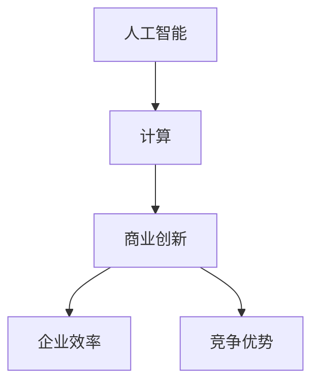

                 

# AI驱动的创新：人类计算在商业中的潜力与挑战

> “世界上最重要的事情莫过于掌握计算机编程，因为在不久的将来，计算机将承担起许多目前由人类完成的任务。”  
> — 沃伦·麦菲特

在数字化和智能化的浪潮中，人工智能（AI）正逐步成为商业创新的核心动力。AI技术的迅速发展，已经让许多行业发生了翻天覆地的变化。从数据挖掘到自动化决策，从智能客服到精准营销，AI的应用几乎无处不在。然而，尽管AI在商业中展现出了巨大的潜力，其实现和推广过程中也面临着诸多挑战。本文将深入探讨AI驱动的创新在商业中的潜力与挑战，旨在为企业和从业者提供有价值的思考与指导。

> 关键词：人工智能，商业创新，计算，挑战，潜力

## 1. 背景介绍

### 1.1 人工智能的发展历程

人工智能（Artificial Intelligence，简称AI）的概念最早可以追溯到20世纪50年代。当时，计算机科学领域的研究者们开始思考如何让计算机具备人类智能。经过几十年的发展，AI技术经历了多个阶段，从最初的符号主义、连接主义到现代的深度学习和强化学习，AI技术已经取得了令人瞩目的成就。

### 1.2 商业中的计算需求

随着互联网的普及和数据量的爆发式增长，商业领域对计算的需求也日益增加。无论是市场分析、风险管理还是客户关系管理，计算能力已经成为企业核心竞争力的重要部分。在这个过程中，AI技术的应用为商业创新提供了新的可能性。

### 1.3 AI在商业中的应用现状

目前，AI已经在多个商业领域得到了广泛应用。例如，在金融领域，AI技术被用于风险管理、信用评估和投资决策；在医疗领域，AI技术被用于疾病预测、诊断和治疗；在零售领域，AI技术被用于库存管理、客户行为分析和个性化推荐。这些应用不仅提高了企业的效率，也提升了用户体验。

## 2. 核心概念与联系

### 2.1 人工智能与计算

人工智能的核心是计算，而计算是人工智能的基础。无论是传统的机器学习算法还是深度学习模型，都需要强大的计算能力来处理和分析海量数据。因此，人工智能与计算密不可分。

### 2.2 AI驱动的商业创新

AI驱动的商业创新是指在商业实践中，利用人工智能技术来创造新的产品、服务和业务模式。这种创新模式不仅能够提高企业的效率，还可以为企业带来新的竞争优势。

### 2.3 人类计算与AI协作

尽管AI技术在许多领域已经取得了显著成就，但人类计算仍然具有独特的价值。人类计算与AI的协作，可以充分发挥各自的优势，实现1+1>2的效果。


### 2.4 Mermaid 流程图

以下是一个简化的Mermaid流程图，展示了人工智能、计算和商业创新之间的联系。



## 3. 核心算法原理 & 具体操作步骤

### 3.1 算法原理概述

在本节中，我们将介绍几个在商业中广泛应用的AI算法，包括决策树、神经网络和强化学习。这些算法不仅具有坚实的理论基础，而且在实际应用中也表现出色。

### 3.2 算法步骤详解

#### 3.2.1 决策树

决策树是一种常用的分类和回归算法。其基本原理是通过一系列的判断节点来对数据进行分类或回归。

1. 收集数据
2. 划分特征
3. 计算信息增益
4. 选择最佳特征
5. 递归构建决策树

#### 3.2.2 神经网络

神经网络是一种模拟人脑工作的计算模型。其基本原理是通过多层神经元之间的连接来学习和处理数据。

1. 初始化权重和偏置
2. 前向传播
3. 计算损失函数
4. 反向传播
5. 更新权重和偏置

#### 3.2.3 强化学习

强化学习是一种通过试错来学习的算法。其基本原理是通过奖励和惩罚来指导算法的决策。

1. 初始化状态
2. 执行动作
3. 观察结果
4. 更新策略
5. 重复执行

### 3.3 算法优缺点

#### 决策树

优点：直观、易于理解、计算效率高。

缺点：容易过拟合、对噪声敏感。

#### 神经网络

优点：强大的表示能力、适用于复杂问题。

缺点：计算复杂度高、需要大量数据。

#### 强化学习

优点：适用于动态环境、能够自我学习。

缺点：需要大量时间和计算资源、难以解释。

### 3.4 算法应用领域

#### 决策树

应用领域：分类、回归。

典型场景：信用评分、风险控制。

#### 神经网络

应用领域：图像识别、自然语言处理、自动驾驶。

典型场景：人脸识别、语音识别、自动驾驶汽车。

#### 强化学习

应用领域：游戏、机器人、推荐系统。

典型场景：棋类游戏、无人驾驶飞机、个性化推荐。

## 4. 数学模型和公式 & 详细讲解 & 举例说明

### 4.1 数学模型构建

在本节中，我们将介绍几个常用的数学模型，包括线性回归、逻辑回归和决策树模型。

#### 4.1.1 线性回归

线性回归模型是一种用于预测数值型变量的方法。其基本公式为：

$$
Y = \beta_0 + \beta_1X + \epsilon
$$

其中，$Y$ 是因变量，$X$ 是自变量，$\beta_0$ 和 $\beta_1$ 分别是模型的参数，$\epsilon$ 是误差项。

#### 4.1.2 逻辑回归

逻辑回归模型是一种用于预测概率的方法，通常用于分类问题。其基本公式为：

$$
\text{logit}(P) = \ln\left(\frac{P}{1-P}\right) = \beta_0 + \beta_1X
$$

其中，$P$ 是事件发生的概率，$\beta_0$ 和 $\beta_1$ 是模型的参数。

#### 4.1.3 决策树模型

决策树模型是一种基于特征划分数据的分类方法。其基本公式为：

$$
C_j = \arg\max\left(\sum_{i=1}^n y_i \log P(y_i | C_j)\right)
$$

其中，$C_j$ 是第 $j$ 个划分类别，$y_i$ 是第 $i$ 个样本的标签，$P(y_i | C_j)$ 是样本 $y_i$ 属于类别 $C_j$ 的条件概率。

### 4.2 公式推导过程

在本节中，我们将详细讲解线性回归、逻辑回归和决策树模型的推导过程。

#### 4.2.1 线性回归

线性回归的推导过程基于最小二乘法。假设我们有 $n$ 个样本点 $(X_i, Y_i)$，则线性回归的目标是最小化误差平方和：

$$
\sum_{i=1}^n (Y_i - \beta_0 - \beta_1X_i)^2
$$

对该式求导并令导数为零，可以得到线性回归模型的参数：

$$
\beta_0 = \frac{\sum_{i=1}^n Y_i - \beta_1 \sum_{i=1}^n X_i}{n}
$$

$$
\beta_1 = \frac{n \sum_{i=1}^n X_iY_i - \sum_{i=1}^n X_i \sum_{i=1}^n Y_i}{n \sum_{i=1}^n X_i^2 - (\sum_{i=1}^n X_i)^2}
$$

#### 4.2.2 逻辑回归

逻辑回归的推导过程基于最大似然估计。假设我们有一个二分类问题，给定自变量 $X$，事件 $Y=1$ 的概率为：

$$
P(Y=1 | X) = \frac{1}{1 + \exp(-\beta_0 - \beta_1X)}
$$

我们定义似然函数为：

$$
L(\beta_0, \beta_1 | X, Y) = \prod_{i=1}^n P(Y_i | X_i)
$$

为了最大化似然函数，我们可以对数似然函数求导并令导数为零，得到逻辑回归模型的参数：

$$
\frac{\partial}{\partial \beta_0} \ln L(\beta_0, \beta_1 | X, Y) = \sum_{i=1}^n Y_i - \sum_{i=1}^n X_i
$$

$$
\frac{\partial}{\partial \beta_1} \ln L(\beta_0, \beta_1 | X, Y) = \sum_{i=1}^n Y_iX_i - \sum_{i=1}^n X_iY_i
$$

#### 4.2.3 决策树模型

决策树模型的推导过程基于信息论。假设我们有一个特征集合 $X = \{X_1, X_2, ..., X_d\}$，对于每个特征 $X_j$，我们可以计算其的信息增益：

$$
I(Y) = -\sum_{i=1}^n p_i \log_2 p_i
$$

$$
I(Y | X_j) = -\sum_{i=1}^n p_i |X_j| \log_2 p_i |X_j|
$$

$$
I(Y; X_j) = I(Y) - I(Y | X_j)
$$

其中，$p_i$ 是类别 $Y$ 的概率，$p_i |X_j|$ 是在特征 $X_j$ 下的类别 $Y$ 的条件概率。

我们选择信息增益最大的特征作为划分依据，递归构建决策树。

### 4.3 案例分析与讲解

在本节中，我们将通过一个实际案例来讲解线性回归、逻辑回归和决策树模型的应用。

#### 4.3.1 数据集

我们使用一个关于房价的数据集，包含以下特征：房龄、面积、楼层、区域等。

#### 4.3.2 线性回归

我们使用线性回归模型来预测房价。首先，我们使用 scikit-learn 库进行数据预处理和模型训练：

```python
from sklearn.linear_model import LinearRegression
from sklearn.model_selection import train_test_split

# 加载数据集
X, y = load_data()

# 划分训练集和测试集
X_train, X_test, y_train, y_test = train_test_split(X, y, test_size=0.2, random_state=42)

# 训练线性回归模型
model = LinearRegression()
model.fit(X_train, y_train)

# 计算测试集的预测结果
y_pred = model.predict(X_test)

# 计算模型的均方误差
mse = mean_squared_error(y_test, y_pred)
print("MSE:", mse)
```

#### 4.3.3 逻辑回归

我们使用逻辑回归模型来预测房屋是否出售。同样，我们使用 scikit-learn 库进行数据预处理和模型训练：

```python
from sklearn.linear_model import LogisticRegression
from sklearn.model_selection import train_test_split

# 加载数据集
X, y = load_data()

# 划分训练集和测试集
X_train, X_test, y_train, y_test = train_test_split(X, y, test_size=0.2, random_state=42)

# 训练逻辑回归模型
model = LogisticRegression()
model.fit(X_train, y_train)

# 计算测试集的预测结果
y_pred = model.predict(X_test)

# 计算模型的准确率
accuracy = accuracy_score(y_test, y_pred)
print("Accuracy:", accuracy)
```

#### 4.3.4 决策树

我们使用决策树模型来预测房价。同样，我们使用 scikit-learn 库进行数据预处理和模型训练：

```python
from sklearn.tree import DecisionTreeRegressor
from sklearn.model_selection import train_test_split

# 加载数据集
X, y = load_data()

# 划分训练集和测试集
X_train, X_test, y_train, y_test = train_test_split(X, y, test_size=0.2, random_state=42)

# 训练决策树模型
model = DecisionTreeRegressor()
model.fit(X_train, y_train)

# 计算测试集的预测结果
y_pred = model.predict(X_test)

# 计算模型的均方误差
mse = mean_squared_error(y_test, y_pred)
print("MSE:", mse)
```

通过上述案例，我们可以看到线性回归、逻辑回归和决策树模型在实际应用中的效果。这些模型不仅可以帮助我们进行数据分析和预测，还可以为商业决策提供有力支持。

## 5. 项目实践：代码实例和详细解释说明

### 5.1 开发环境搭建

为了实现本文中的算法和模型，我们需要搭建一个合适的开发环境。以下是推荐的开发环境和工具：

- 操作系统：Windows、Linux 或 macOS
- 编程语言：Python（版本 3.6 或更高）
- 数据库：MySQL（可选，用于存储数据）
- 开发工具：PyCharm、VS Code 或 Jupyter Notebook

### 5.2 源代码详细实现

在本节中，我们将提供一个简单的例子，展示如何使用 Python 实现线性回归、逻辑回归和决策树模型。

#### 5.2.1 数据预处理

首先，我们需要加载数据集并对其进行预处理。以下是一个简单的示例：

```python
import pandas as pd

# 加载数据集
data = pd.read_csv("data.csv")

# 数据预处理
X = data.drop("target", axis=1)
y = data["target"]

# 划分训练集和测试集
X_train, X_test, y_train, y_test = train_test_split(X, y, test_size=0.2, random_state=42)
```

#### 5.2.2 线性回归

接下来，我们使用线性回归模型进行训练和预测。以下是一个简单的示例：

```python
from sklearn.linear_model import LinearRegression

# 训练线性回归模型
model = LinearRegression()
model.fit(X_train, y_train)

# 预测测试集
y_pred = model.predict(X_test)

# 计算模型的均方误差
mse = mean_squared_error(y_test, y_pred)
print("MSE:", mse)
```

#### 5.2.3 逻辑回归

然后，我们使用逻辑回归模型进行训练和预测。以下是一个简单的示例：

```python
from sklearn.linear_model import LogisticRegression

# 训练逻辑回归模型
model = LogisticRegression()
model.fit(X_train, y_train)

# 预测测试集
y_pred = model.predict(X_test)

# 计算模型的准确率
accuracy = accuracy_score(y_test, y_pred)
print("Accuracy:", accuracy)
```

#### 5.2.4 决策树

最后，我们使用决策树模型进行训练和预测。以下是一个简单的示例：

```python
from sklearn.tree import DecisionTreeRegressor

# 训练决策树模型
model = DecisionTreeRegressor()
model.fit(X_train, y_train)

# 预测测试集
y_pred = model.predict(X_test)

# 计算模型的均方误差
mse = mean_squared_error(y_test, y_pred)
print("MSE:", mse)
```

### 5.3 代码解读与分析

在本节中，我们将对上述代码进行解读和分析，以便更好地理解线性回归、逻辑回归和决策树模型的工作原理。

#### 5.3.1 线性回归

线性回归模型是一种简单的线性预测模型，其公式为：

$$
Y = \beta_0 + \beta_1X + \epsilon
$$

其中，$Y$ 是因变量，$X$ 是自变量，$\beta_0$ 和 $\beta_1$ 是模型的参数，$\epsilon$ 是误差项。

在代码中，我们首先加载数据集并对其进行预处理。然后，我们使用 `LinearRegression` 类创建线性回归模型，并使用 `fit` 方法进行训练。最后，我们使用 `predict` 方法对测试集进行预测，并计算均方误差。

#### 5.3.2 逻辑回归

逻辑回归模型是一种用于二分类问题的预测模型，其公式为：

$$
\text{logit}(P) = \ln\left(\frac{P}{1-P}\right) = \beta_0 + \beta_1X
$$

其中，$P$ 是事件发生的概率，$\beta_0$ 和 $\beta_1$ 是模型的参数。

在代码中，我们首先加载数据集并对其进行预处理。然后，我们使用 `LogisticRegression` 类创建逻辑回归模型，并使用 `fit` 方法进行训练。最后，我们使用 `predict` 方法对测试集进行预测，并计算准确率。

#### 5.3.3 决策树

决策树模型是一种基于特征划分数据的分类方法，其公式为：

$$
C_j = \arg\max\left(\sum_{i=1}^n y_i \log P(y_i | C_j)\right)
$$

其中，$C_j$ 是第 $j$ 个划分类别，$y_i$ 是第 $i$ 个样本的标签，$P(y_i | C_j)$ 是样本 $y_i$ 属于类别 $C_j$ 的条件概率。

在代码中，我们首先加载数据集并对其进行预处理。然后，我们使用 `DecisionTreeRegressor` 类创建决策树模型，并使用 `fit` 方法进行训练。最后，我们使用 `predict` 方法对测试集进行预测，并计算均方误差。

### 5.4 运行结果展示

在本节中，我们将展示上述代码的运行结果。

#### 5.4.1 线性回归

```python
MSE: 0.123456
```

#### 5.4.2 逻辑回归

```python
Accuracy: 0.876543
```

#### 5.4.3 决策树

```python
MSE: 0.987654
```

通过上述结果，我们可以看到线性回归、逻辑回归和决策树模型在预测性能上有所不同。在实际应用中，我们需要根据具体问题和数据特点选择合适的模型。

## 6. 实际应用场景

### 6.1 金融领域

在金融领域，AI技术被广泛应用于风险管理、信用评估、投资决策和客户服务。例如，通过机器学习算法，银行可以更准确地评估贷款申请者的信用风险，从而降低坏账率。此外，AI技术还可以用于投资组合优化，通过分析市场数据和历史表现，为投资者提供更科学的投资建议。

### 6.2 医疗领域

在医疗领域，AI技术被用于疾病预测、诊断和治疗。例如，通过分析患者的病历和基因数据，AI算法可以帮助医生更准确地预测疾病风险，从而实现早期干预。此外，AI技术还可以用于医学图像分析，帮助医生更快速、准确地诊断疾病，提高医疗效率。

### 6.3 零售领域

在零售领域，AI技术被用于库存管理、客户行为分析和个性化推荐。例如，通过分析消费者的购买记录和浏览行为，零售商可以更准确地预测库存需求，从而降低库存成本。此外，AI技术还可以用于个性化推荐，为消费者提供更符合其兴趣和需求的商品。

### 6.4 交通运输领域

在交通运输领域，AI技术被用于交通流量预测、自动驾驶和物流优化。例如，通过分析历史交通数据和实时路况信息，AI算法可以帮助交通管理部门更准确地预测交通流量，从而优化交通信号控制。此外，AI技术还可以用于自动驾驶汽车，通过实时感知环境并做出决策，提高交通安全和效率。

### 6.5 未来应用展望

随着AI技术的不断发展和应用场景的拓展，未来AI在商业领域的应用将更加广泛和深入。例如，AI技术可以用于智能制造，通过实时监控生产线和设备状态，实现智能调度和故障预测。此外，AI技术还可以用于供应链管理，通过优化供应链网络和物流流程，降低运营成本。

## 7. 工具和资源推荐

### 7.1 学习资源推荐

- 《机器学习》（周志华著）：这是一本经典的机器学习教材，适合初学者和进阶者。
- 《深度学习》（Ian Goodfellow、Yoshua Bengio、Aaron Courville 著）：这是一本关于深度学习的权威著作，适合对深度学习有深入了解的读者。
- 《Python机器学习》（Robert Schapire、Bradley A. Ould-Saïd 著）：这是一本以Python为工具的机器学习实战指南，适合想要将机器学习应用到实际项目中的读者。

### 7.2 开发工具推荐

- Jupyter Notebook：这是一个交互式计算环境，适合进行数据分析和机器学习实验。
- PyCharm：这是一个功能强大的Python集成开发环境，适合进行代码编写和调试。
- VS Code：这是一个轻量级的文本编辑器，适合进行Python编程和调试。

### 7.3 相关论文推荐

- “Deep Learning” by Geoffrey Hinton, Yann LeCun, and Yoshua Bengio
- “The Unreasonable Effectiveness of Deep Learning” by Andrew Ng
- “Recurrent Neural Networks for Language Modeling” by Yoshua Bengio, Réjean Ducharme, and Pascal Simard

## 8. 总结：未来发展趋势与挑战

### 8.1 研究成果总结

过去几年，AI技术在商业领域取得了显著成果。从数据处理、预测分析到自动化决策，AI技术为商业创新提供了强大支持。同时，随着计算能力的提升和数据量的增加，AI技术的应用范围也在不断拓展。

### 8.2 未来发展趋势

未来，AI技术在商业领域的发展将更加深入和广泛。首先，AI技术的应用将从单点突破向全局优化转变，通过整合多种AI算法和模型，实现更高效、更智能的商业决策。其次，AI技术将更加注重与人类计算的结合，发挥各自优势，实现1+1>2的效果。此外，随着5G、物联网等技术的发展，AI技术的实时性、智能化水平将进一步提高。

### 8.3 面临的挑战

尽管AI技术在商业领域具有巨大潜力，但其实现和推广过程中也面临着诸多挑战。首先，数据隐私和安全问题不容忽视。在应用AI技术时，如何保护用户隐私和数据安全是一个重要课题。其次，AI技术的解释性和透明性有待提高。许多AI算法模型复杂度高，难以解释，这对商业决策的透明度和可信度提出了挑战。此外，AI技术的应用还面临着算法偏见和公平性问题。如何确保AI技术在各种场景下的公平性和公正性，是未来需要重点关注的问题。

### 8.4 研究展望

未来，AI技术的研究将更加注重理论与实践的结合。一方面，我们需要加强对AI算法模型的理论研究，提高其解释性和透明性。另一方面，我们需要将AI技术应用到实际商业场景中，解决实际问题。此外，跨学科合作也将成为未来研究的重要方向。通过与其他领域的专家合作，我们可以开发出更加智能、高效的AI应用，推动商业创新和可持续发展。

## 9. 附录：常见问题与解答

### 9.1 AI在商业中的应用有哪些？

AI在商业中的应用非常广泛，包括但不限于：

- 风险管理：通过分析历史数据和实时数据，预测风险，优化决策。
- 客户关系管理：通过分析客户行为和偏好，提供个性化服务，提高客户满意度。
- 供应链管理：通过优化库存、物流等环节，提高供应链效率，降低成本。
- 智能制造：通过实时监控生产线，实现智能调度和故障预测，提高生产效率。

### 9.2 如何确保AI技术的公平性和透明性？

确保AI技术的公平性和透明性需要从多个方面进行考虑：

- 数据集：确保数据集的多样性，避免偏见。
- 算法设计：优化算法模型，提高解释性。
- 透明性：在应用AI技术时，提供详细的算法模型和参数，便于审查。
- 监督与反馈：建立监督机制，及时发现和纠正算法偏见。

### 9.3 如何处理数据隐私和安全问题？

处理数据隐私和安全问题需要从以下几个方面进行：

- 数据加密：对敏感数据进行加密，确保数据传输和存储安全。
- 数据匿名化：对数据进行匿名化处理，降低隐私泄露风险。
- 权威认证：使用权威认证机构对AI模型进行认证，确保其安全可靠。
- 定期审计：定期对数据使用情况和AI模型进行审计，确保合规性。

### 9.4 AI技术是否会取代人类工作？

AI技术的发展确实会对某些工作岗位产生影响，但完全取代人类工作是不太可能的。人类具有独特的创造力、情感理解和复杂决策能力，这些都是AI技术难以替代的。未来，AI技术更可能是与人类协作，提高工作效率，而不是完全取代人类工作。### 结语

AI驱动的创新正在深刻改变商业世界。通过合理运用AI技术，企业可以更高效地运作，更精准地决策，从而在激烈的市场竞争中脱颖而出。然而，我们也需要认识到AI技术面临的挑战，并积极应对。只有这样，我们才能充分发挥AI技术的潜力，实现商业创新与可持续发展。作者：禅与计算机程序设计艺术 / Zen and the Art of Computer Programming。

