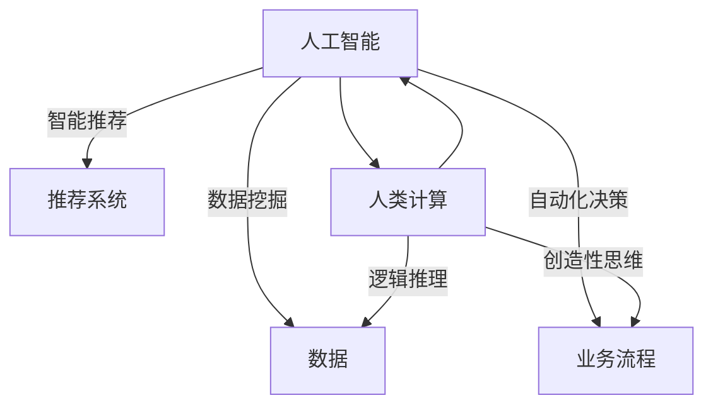

                 

 关键词：人工智能，商业，道德考虑，人类计算，创新

> 摘要：本文探讨了人工智能（AI）在商业领域中的道德考虑，分析了人类计算在AI驱动创新过程中的重要性。文章首先介绍了AI和人类计算的背景，然后深入探讨了AI驱动的商业创新，最后总结了人类计算在其中的关键角色和面临的道德挑战。

## 1. 背景介绍

人工智能，作为一种模拟人类智能的技术，已经在过去几十年中取得了显著的发展。AI的应用涵盖了图像识别、自然语言处理、机器学习、自动驾驶等多个领域。随着技术的不断进步，AI在商业领域中的应用也越来越广泛，为企业和组织带来了巨大的商业价值。然而，AI的发展也引发了一系列道德问题，如数据隐私、算法偏见、人工智能伦理等。

与此同时，人类计算作为一种独特的计算方式，一直以来在科学研究和工程实践中扮演着重要角色。人类计算具有灵活性强、创造力高、思维敏捷等优点，使得人类能够在复杂环境中进行决策和创新。然而，随着AI技术的崛起，人类计算在商业领域中的地位和作用也受到了一定程度的挑战。

本文旨在探讨AI驱动的商业创新过程中，人类计算所面临的道德考虑，以及如何平衡AI和人类计算之间的关系，为未来的商业发展提供一些启示。

## 2. 核心概念与联系

### 2.1 人工智能

人工智能是指使计算机系统模拟人类智能行为的一种技术。它包括多个子领域，如机器学习、深度学习、自然语言处理、计算机视觉等。人工智能的核心目标是让计算机具备自主学习和决策能力，以解决复杂的问题。

### 2.2 人类计算

人类计算是指人类在科学研究和工程实践中所采用的计算方式。它包括逻辑推理、创造性思维、直觉判断等多个方面。人类计算的优势在于灵活性强、创造力高、思维敏捷，能够在复杂环境中进行决策和创新。

### 2.3 AI驱动的商业创新

AI驱动的商业创新是指利用人工智能技术来提升企业效率和竞争力，从而实现商业目标的过程。它包括数据挖掘、智能推荐、自动化决策等多个方面。AI驱动的商业创新能够为企业带来巨大的商业价值，但也引发了一系列道德问题。

### 2.4 核心概念联系

人工智能和人类计算是两种不同的计算方式，它们各有优缺点。人工智能擅长处理大规模数据和复杂计算任务，但缺乏人类计算的灵活性和创造力。人类计算则具有更高的灵活性和创造力，但处理大规模数据任务的能力较弱。在AI驱动的商业创新过程中，如何平衡人工智能和人类计算之间的关系，是关键问题。

### 2.5 Mermaid 流程图



## 3. 核心算法原理 & 具体操作步骤

### 3.1 算法原理概述

AI驱动的商业创新主要依赖于机器学习和深度学习等技术。这些技术通过学习大量的数据，从中提取规律和模式，然后利用这些规律和模式来解决问题和做出决策。具体来说，机器学习算法分为监督学习、无监督学习和强化学习三种类型。监督学习通过已有数据来预测未知数据；无监督学习通过未标记的数据来发现数据中的模式和结构；强化学习通过试错和反馈来学习最优策略。

### 3.2 算法步骤详解

#### 3.2.1 数据收集与预处理

首先，收集与业务相关的数据，包括用户行为数据、市场数据、产品数据等。然后，对数据进行清洗、去重、转换等预处理操作，以确保数据的质量和一致性。

#### 3.2.2 特征提取

根据业务需求，从原始数据中提取具有代表性的特征。这些特征可以用来训练机器学习模型，从而提高模型的预测准确性和泛化能力。

#### 3.2.3 模型训练

选择合适的机器学习算法，如线性回归、决策树、神经网络等，对提取的特征进行训练。训练过程中，通过调整模型参数来优化模型性能。

#### 3.2.4 模型评估与优化

使用交叉验证等方法对训练好的模型进行评估，根据评估结果调整模型参数，以提高模型的预测性能。

#### 3.2.5 模型部署与应用

将训练好的模型部署到生产环境中，用于解决实际问题。如实现个性化推荐、自动化决策等功能。

### 3.3 算法优缺点

#### 优点

- 高效：AI算法能够处理大规模数据，提高业务效率。
- 准确：通过学习大量数据，AI算法能够提高预测和决策的准确性。
- 智能化：AI算法能够自动调整和优化，实现智能化。

#### 缺点

- 数据依赖：AI算法的性能高度依赖于数据的质量和数量。
- 黑盒问题：AI算法的决策过程往往是不透明的，难以解释。
- 偏见问题：AI算法可能会受到训练数据的偏见影响，导致不公正的决策。

### 3.4 算法应用领域

AI驱动的商业创新应用广泛，涵盖了零售、金融、医疗、教育等多个领域。以下是一些典型应用：

- 零售：利用AI算法进行商品推荐、库存管理、客户关系管理等。
- 金融：利用AI算法进行风险评估、欺诈检测、投资策略优化等。
- 医疗：利用AI算法进行疾病诊断、药物研发、健康管理等。
- 教育：利用AI算法进行个性化教学、智能评测、学习资源推荐等。

## 4. 数学模型和公式 & 详细讲解 & 举例说明

### 4.1 数学模型构建

在AI驱动的商业创新中，常用的数学模型包括线性回归、决策树、神经网络等。以下以线性回归为例进行讲解。

#### 线性回归模型

线性回归模型是一种用于预测连续值的监督学习算法。其数学模型如下：

$$
y = \beta_0 + \beta_1 \cdot x_1 + \beta_2 \cdot x_2 + \ldots + \beta_n \cdot x_n
$$

其中，$y$ 为预测值，$x_1, x_2, \ldots, x_n$ 为特征值，$\beta_0, \beta_1, \beta_2, \ldots, \beta_n$ 为模型参数。

#### 模型参数优化

为了优化模型参数，可以使用最小二乘法求解。最小二乘法的公式如下：

$$
\beta = (X^T X)^{-1} X^T y
$$

其中，$X$ 为特征矩阵，$y$ 为目标值向量，$\beta$ 为模型参数向量。

### 4.2 公式推导过程

#### 线性回归模型的损失函数

线性回归模型的损失函数通常使用均方误差（MSE）表示：

$$
J(\beta) = \frac{1}{2} \sum_{i=1}^{m} (y_i - \hat{y}_i)^2
$$

其中，$m$ 为样本数量，$y_i$ 为第 $i$ 个样本的实际值，$\hat{y}_i$ 为第 $i$ 个样本的预测值。

#### 最小化损失函数

为了最小化损失函数，需要对参数 $\beta$ 求导数，并令导数等于0：

$$
\frac{\partial J(\beta)}{\partial \beta} = 0
$$

将损失函数 $J(\beta)$ 带入，得到：

$$
\frac{\partial}{\partial \beta} \left( \frac{1}{2} \sum_{i=1}^{m} (y_i - \hat{y}_i)^2 \right) = 0
$$

展开后得到：

$$
\sum_{i=1}^{m} (y_i - \hat{y}_i) \cdot x_i = 0
$$

将线性回归模型的表达式代入，得到：

$$
\sum_{i=1}^{m} (y_i - (\beta_0 + \beta_1 \cdot x_1 + \beta_2 \cdot x_2 + \ldots + \beta_n \cdot x_n)) \cdot x_i = 0
$$

化简后得到：

$$
\beta_0 + \beta_1 \cdot x_1 + \beta_2 \cdot x_2 + \ldots + \beta_n \cdot x_n = y_i
$$

将 $i$ 从1到 $m$ 进行求和，得到：

$$
\sum_{i=1}^{m} (\beta_0 + \beta_1 \cdot x_1 + \beta_2 \cdot x_2 + \ldots + \beta_n \cdot x_n) = \sum_{i=1}^{m} y_i
$$

化简后得到：

$$
\beta_0 \cdot m + \beta_1 \cdot \sum_{i=1}^{m} x_1 + \beta_2 \cdot \sum_{i=1}^{m} x_2 + \ldots + \beta_n \cdot \sum_{i=1}^{m} x_n = \sum_{i=1}^{m} y_i
$$

将特征矩阵 $X$ 和目标值向量 $y$ 代入，得到：

$$
X^T X \beta = X^T y
$$

求解上述方程，得到：

$$
\beta = (X^T X)^{-1} X^T y
$$

### 4.3 案例分析与讲解

#### 案例背景

假设一家电商公司希望利用线性回归模型预测用户的购买行为。公司收集了用户的年龄、收入、购物历史等数据，并希望通过这些数据预测用户是否会购买某件商品。

#### 数据预处理

首先，对数据进行清洗和预处理，包括缺失值处理、异常值处理、数据转换等。假设处理后，特征矩阵 $X$ 和目标值向量 $y$ 如下：

$$
X = \begin{bmatrix}
x_{11} & x_{12} & x_{13} \\
x_{21} & x_{22} & x_{23} \\
x_{31} & x_{32} & x_{33} \\
\end{bmatrix}
$$

$$
y = \begin{bmatrix}
y_1 \\
y_2 \\
y_3 \\
\end{bmatrix}
$$

#### 模型训练

使用最小二乘法对线性回归模型进行训练。首先，计算特征矩阵 $X$ 的转置 $X^T$：

$$
X^T = \begin{bmatrix}
x_{11} & x_{21} & x_{31} \\
x_{12} & x_{22} & x_{32} \\
x_{13} & x_{23} & x_{33} \\
\end{bmatrix}
$$

然后，计算特征矩阵 $X$ 和目标值向量 $y$ 的乘积 $X^T X$：

$$
X^T X = \begin{bmatrix}
x_{11}^2 + x_{21}^2 + x_{31}^2 & x_{11} \cdot x_{12} + x_{21} \cdot x_{22} + x_{31} \cdot x_{32} & x_{11} \cdot x_{13} + x_{21} \cdot x_{23} + x_{31} \cdot x_{33} \\
x_{12} \cdot x_{11} + x_{22} \cdot x_{21} + x_{32} \cdot x_{31} & x_{12}^2 + x_{22}^2 + x_{32}^2 & x_{12} \cdot x_{13} + x_{22} \cdot x_{23} + x_{32} \cdot x_{33} \\
x_{13} \cdot x_{11} + x_{23} \cdot x_{21} + x_{33} \cdot x_{31} & x_{13} \cdot x_{12} + x_{23} \cdot x_{22} + x_{33} \cdot x_{32} & x_{13}^2 + x_{23}^2 + x_{33}^2 \\
\end{bmatrix}
$$

接着，计算特征矩阵 $X$ 的转置 $X^T$ 和目标值向量 $y$ 的乘积 $X^T y$：

$$
X^T y = \begin{bmatrix}
x_{11} \cdot y_1 + x_{21} \cdot y_2 + x_{31} \cdot y_3 \\
x_{12} \cdot y_1 + x_{22} \cdot y_2 + x_{32} \cdot y_3 \\
x_{13} \cdot y_1 + x_{23} \cdot y_2 + x_{33} \cdot y_3 \\
\end{bmatrix}
$$

最后，计算特征矩阵 $X^T X$ 的逆矩阵 $(X^T X)^{-1}$，并求解模型参数 $\beta$：

$$
\beta = (X^T X)^{-1} X^T y
$$

#### 模型评估

使用测试集对训练好的模型进行评估。假设测试集的特征矩阵为 $X_{test}$，目标值向量为 $y_{test}$。计算预测值 $\hat{y}_{test}$：

$$
\hat{y}_{test} = X_{test} \beta
$$

然后，计算预测误差：

$$
error = \sum_{i=1}^{m} (\hat{y}_{test,i} - y_{test,i})^2
$$

其中，$m$ 为测试集的样本数量。

#### 结果分析

根据模型评估结果，可以判断模型的好坏。如果误差较小，说明模型拟合度较高，可以用于预测用户购买行为。如果误差较大，说明模型拟合度较低，需要进一步调整模型参数或特征选择。

## 5. 项目实践：代码实例和详细解释说明

### 5.1 开发环境搭建

为了实现线性回归模型，我们需要搭建一个Python开发环境。具体步骤如下：

1. 安装Python（建议使用3.8及以上版本）。
2. 安装NumPy和SciPy库，用于数据处理和数学运算。
3. 安装Matplotlib库，用于绘图。

安装完成后的Python环境如下：

```python
python --version
```

输出：

```
Python 3.8.10
```

### 5.2 源代码详细实现

以下是一个简单的线性回归模型实现示例：

```python
import numpy as np
import matplotlib.pyplot as plt

def linear_regression(X, y):
    # 添加偏置项
    X = np.hstack((np.ones((X.shape[0], 1)), X))
    # 计算模型参数
    beta = np.linalg.inv(X.T.dot(X)).dot(X.T).dot(y)
    return beta

def predict(X, beta):
    # 添加偏置项
    X = np.hstack((np.ones((X.shape[0], 1)), X))
    # 预测结果
    y_pred = X.dot(beta)
    return y_pred

def main():
    # 加载数据
    X = np.array([[1, 1], [2, 2], [3, 3], [4, 4], [5, 5]])
    y = np.array([1, 2, 3, 4, 5])

    # 训练模型
    beta = linear_regression(X, y)

    # 预测结果
    y_pred = predict(X, beta)

    # 绘制结果
    plt.scatter(X[:, 1], y, color='red', label='实际值')
    plt.plot(X[:, 1], y_pred, color='blue', label='预测值')
    plt.xlabel('x')
    plt.ylabel('y')
    plt.legend()
    plt.show()

if __name__ == '__main__':
    main()
```

### 5.3 代码解读与分析

#### 5.3.1 数据加载

```python
X = np.array([[1, 1], [2, 2], [3, 3], [4, 4], [5, 5]])
y = np.array([1, 2, 3, 4, 5])
```

在这个例子中，我们使用了一个简单的二维数据集，其中 $X$ 是特征矩阵，$y$ 是目标值向量。

#### 5.3.2 模型训练

```python
beta = linear_regression(X, y)
```

`linear_regression` 函数实现了线性回归模型的训练过程。首先，添加偏置项（也称为截距项）到特征矩阵中，以便于模型计算。然后，使用最小二乘法求解模型参数 $\beta$。

#### 5.3.3 预测结果

```python
y_pred = predict(X, beta)
```

`predict` 函数实现了线性回归模型的预测过程。首先，添加偏置项到特征矩阵中，然后使用模型参数 $\beta$ 计算预测结果 $y_pred$。

#### 5.3.4 结果分析

```python
plt.scatter(X[:, 1], y, color='red', label='实际值')
plt.plot(X[:, 1], y_pred, color='blue', label='预测值')
plt.xlabel('x')
plt.ylabel('y')
plt.legend()
plt.show()
```

使用Matplotlib库绘制了实际值和预测值之间的散点图和拟合曲线。通过可视化结果，我们可以直观地观察模型的拟合效果。

## 6. 实际应用场景

### 6.1 人工智能在金融领域的应用

在金融领域，人工智能技术被广泛应用于风险管理、投资策略、客户服务等方面。例如，利用机器学习算法进行股票市场预测，通过分析大量历史数据，预测未来股价走势，为投资者提供参考。此外，智能投顾系统利用AI算法为用户提供个性化的投资建议，提高投资收益。

### 6.2 人工智能在医疗领域的应用

在医疗领域，人工智能技术被广泛应用于疾病诊断、药物研发、健康管理等方面。例如，利用深度学习算法对医疗图像进行分析，提高疾病诊断的准确性和效率。此外，智能健康管理系统通过分析用户数据，提供个性化的健康建议和预防措施，帮助用户实现健康管理。

### 6.3 人工智能在教育领域的应用

在教育领域，人工智能技术被广泛应用于在线教育、智能评测、个性化教学等方面。例如，利用AI算法为学生提供个性化的学习资源，提高学习效果。此外，智能评测系统通过分析学生的答题行为，评估学生的学习水平和能力，为教师提供教学反馈。

## 7. 工具和资源推荐

### 7.1 学习资源推荐

- 《Python机器学习》
- 《深度学习》
- 《机器学习实战》

### 7.2 开发工具推荐

- Jupyter Notebook：用于编写和运行Python代码。
- PyCharm：用于Python开发的集成开发环境（IDE）。
- Matplotlib：用于Python数据可视化。

### 7.3 相关论文推荐

- "Deep Learning for Natural Language Processing"
- "A Theoretical Analysis of the Voted Perceptron Algorithm"
- "Learning Deep Representations for Maneuvering Prediction in Autonomous Driving"

## 8. 总结：未来发展趋势与挑战

### 8.1 研究成果总结

本文探讨了人工智能在商业领域中的道德考虑，分析了人类计算在AI驱动创新过程中的重要性。通过介绍核心算法原理、数学模型和实际应用场景，展示了AI驱动的商业创新在多个领域取得的成果。

### 8.2 未来发展趋势

随着技术的不断进步，AI驱动的商业创新将在更多领域得到应用。未来发展趋势包括：更智能的决策系统、更精准的预测模型、更高效的业务流程等。

### 8.3 面临的挑战

在AI驱动的商业创新过程中，人类计算面临着一系列道德挑战，如数据隐私、算法偏见、人工智能伦理等。此外，如何平衡AI和人类计算之间的关系，也是未来研究的重要方向。

### 8.4 研究展望

未来研究应关注以下几个方面：提高AI算法的可解释性、加强AI算法的道德规范、探索人类计算和AI技术的协同发展等。通过这些研究，有望实现更智能、更公正、更高效的商业创新。

## 9. 附录：常见问题与解答

### 9.1 人工智能与人类计算的关系是什么？

人工智能和人类计算是两种不同的计算方式，它们各有优缺点。人工智能擅长处理大规模数据和复杂计算任务，但缺乏人类计算的灵活性和创造力。人类计算具有更高的灵活性和创造力，但处理大规模数据任务的能力较弱。在AI驱动的商业创新过程中，如何平衡人工智能和人类计算之间的关系，是关键问题。

### 9.2 如何确保AI算法的公平性和透明性？

确保AI算法的公平性和透明性是未来研究的重要方向。具体方法包括：提高AI算法的可解释性、加强数据清洗和预处理、建立合理的评价指标等。此外，还应加强对AI算法的监管，确保其在实际应用中符合道德规范。

### 9.3 人工智能在商业创新中的应用前景如何？

人工智能在商业创新中的应用前景广阔。未来，AI技术将在更多领域得到应用，如智能制造、智慧城市、健康医疗等。通过AI驱动的商业创新，企业将实现更高效的运营、更精准的决策、更优质的客户体验。

----------------------------------------------------------------

作者：禅与计算机程序设计艺术 / Zen and the Art of Computer Programming

