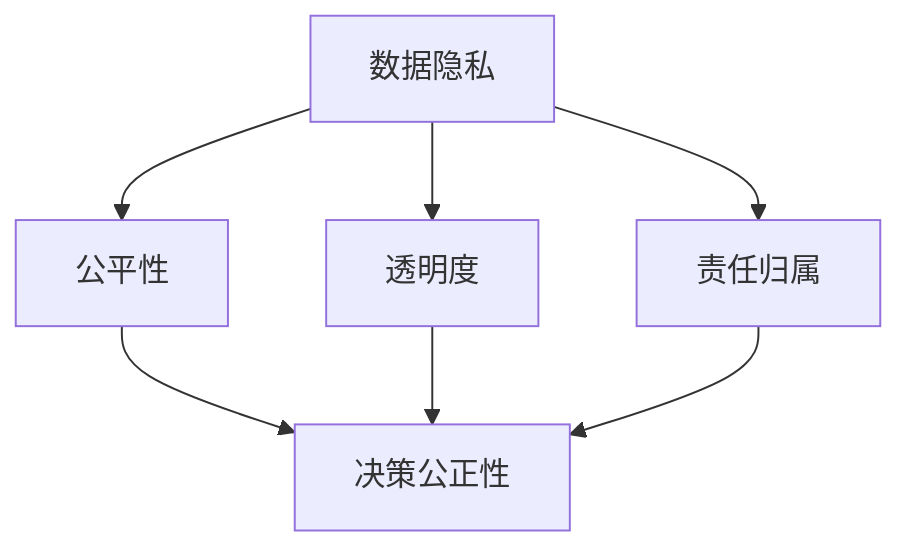

                 

关键词：人工智能，商业应用，道德考量，技术创新，责任伦理，数据隐私，技术伦理

摘要：随着人工智能技术在商业领域的广泛应用，如何在创新过程中充分考虑道德考量因素成为了一个关键问题。本文从多个角度探讨了人工智能在商业应用中面临的道德挑战，并提出了相应的解决方案，旨在为企业在利用人工智能技术进行创新时提供指导和借鉴。

## 1. 背景介绍

近年来，人工智能（AI）技术在全球范围内取得了显著的进展，其应用场景也越来越广泛。无论是在生产制造、金融分析、医疗诊断，还是在营销推广、客户服务等方面，AI都展现出了巨大的潜力。随着AI技术的不断成熟，越来越多的企业开始意识到其在商业运营中的重要性，并将其视为提升竞争力、实现商业价值的关键手段。

然而，随着AI在商业领域的广泛应用，一系列道德问题也逐渐显现出来。首先，数据隐私问题成为了一个备受关注的议题。在AI系统中，大量用户数据的收集和处理是必不可少的，但如何确保这些数据的隐私和安全，防止数据泄露或滥用，成为了企业必须面对的挑战。其次，AI技术的决策过程往往是不透明的，这使得人们对其决策的公正性和准确性产生了质疑。此外，AI技术在某些情况下可能会加剧社会不平等，引发伦理和法律问题。

因此，本文将围绕人工智能在商业应用中的道德考量因素展开讨论，分析其中的挑战，并提出相应的解决方案，以期为企业在AI驱动创新过程中提供参考。

## 2. 核心概念与联系

为了更好地理解人工智能在商业中的道德考量因素，我们需要首先明确几个核心概念，并探讨它们之间的相互关系。

### 2.1 人工智能的核心概念

人工智能是一门研究、开发和应用使计算机系统模拟、扩展和辅助人类智能的科学。它涉及多个领域，包括机器学习、深度学习、自然语言处理、计算机视觉等。这些技术共同构成了人工智能的技术基础。

在商业应用中，人工智能技术主要用于数据分析和决策支持。通过机器学习和深度学习算法，AI系统可以自动从大量数据中提取有价值的信息，并基于这些信息进行预测和决策。例如，在金融领域，AI可以用于风险评估、欺诈检测和投资组合优化；在医疗领域，AI可以用于疾病诊断、药物研发和医疗资源分配。

### 2.2 道德考量因素

道德考量因素是指人们在决策过程中需要考虑的道德原则和伦理标准。在人工智能领域，道德考量因素主要包括数据隐私、公平性、透明度和责任归属等方面。

- **数据隐私**：指在收集、存储和处理用户数据时，需要确保用户隐私不受侵犯。这涉及到数据收集的合法性、数据使用的透明度和数据保护的措施等方面。

- **公平性**：指人工智能系统在决策过程中应确保对所有个体公平对待，避免因算法偏见而导致歧视和不公平。

- **透明度**：指人工智能系统的决策过程应具有可解释性和透明性，使人们能够理解和信任AI系统的决策。

- **责任归属**：指在AI系统引发不良后果时，应明确责任归属，确保责任人能够承担相应的责任。

### 2.3 核心概念之间的联系

数据隐私、公平性、透明度和责任归属是人工智能在商业应用中不可忽视的道德考量因素。它们相互关联，共同构成了AI技术的伦理框架。

- **数据隐私**是AI应用的基础，确保用户数据的安全和隐私是建立信任的关键。

- **公平性**和**透明度**是确保AI系统决策公正和可信的重要保障。只有当人们能够理解和信任AI系统的决策时，才能充分发挥其商业价值。

- **责任归属**是解决AI引发不良后果的重要机制。明确责任归属有助于防止道德风险和法律责任。

### 2.4 Mermaid 流程图

为了更直观地展示人工智能在商业中的道德考量因素，我们使用Mermaid流程图来表示这些核心概念之间的联系。



在这个流程图中，数据隐私、公平性、透明度和责任归属是四个关键节点，它们共同影响着人工智能系统的决策公正性和可信度。

## 3. 核心算法原理 & 具体操作步骤

### 3.1 算法原理概述

在讨论人工智能在商业中的道德考量因素时，我们首先需要了解一些核心算法原理。这些算法原理不仅帮助我们理解AI系统的运作机制，也为我们在道德考量中提供了依据。

- **机器学习算法**：机器学习算法是人工智能的核心组成部分。它通过从数据中学习规律和模式，实现自动预测和决策。常见的机器学习算法包括线性回归、逻辑回归、支持向量机、决策树、随机森林、神经网络等。

- **深度学习算法**：深度学习算法是机器学习的一种扩展，它在多层神经网络的基础上，通过反向传播算法不断优化模型参数，从而实现更复杂的特征提取和决策能力。常见的深度学习算法包括卷积神经网络（CNN）、循环神经网络（RNN）、长短时记忆网络（LSTM）等。

- **自然语言处理算法**：自然语言处理（NLP）算法是使计算机能够理解和处理人类语言的技术。它包括词性标注、句法分析、语义理解、情感分析等。

- **计算机视觉算法**：计算机视觉算法使计算机能够理解和解释图像和视频内容。它包括图像分类、目标检测、图像分割、人脸识别等。

### 3.2 算法步骤详解

在具体操作步骤中，我们可以分为以下几个阶段：

- **数据收集**：首先，我们需要收集大量相关数据，包括用户数据、市场数据、历史数据等。这些数据将作为训练集和测试集，用于训练和评估AI模型。

- **数据预处理**：在收集到数据后，我们需要对其进行清洗和预处理，包括去除无效数据、填补缺失值、标准化等操作。这些步骤有助于提高数据质量和模型的性能。

- **模型选择**：根据业务需求和数据特征，选择合适的机器学习、深度学习或NLP算法。例如，对于分类问题，可以选择线性回归、支持向量机或神经网络；对于回归问题，可以选择线性回归、决策树或随机森林。

- **模型训练**：使用训练集对所选算法进行训练，不断优化模型参数，使模型能够从数据中提取出有效特征和规律。

- **模型评估**：使用测试集对训练好的模型进行评估，计算模型的准确率、召回率、F1值等指标，以确定模型的性能。

- **模型部署**：将训练好的模型部署到生产环境中，实现自动化预测和决策。

### 3.3 算法优缺点

每种算法都有其独特的优缺点，企业在选择算法时需要根据具体业务需求和数据特征进行权衡。

- **机器学习算法**：优点是模型简单、易于理解和实现；缺点是对于高维度数据和复杂特征提取能力有限。

- **深度学习算法**：优点是能够自动提取复杂特征，对于高维度数据表现更好；缺点是模型复杂、参数众多，训练时间较长。

- **自然语言处理算法**：优点是能够理解和处理人类语言，应用广泛；缺点是数据需求和计算资源较高。

- **计算机视觉算法**：优点是能够理解和解释图像和视频内容，应用广泛；缺点是对于光照、角度等变化较为敏感。

### 3.4 算法应用领域

人工智能算法在商业应用中具有广泛的应用领域，以下是一些典型的应用场景：

- **金融领域**：用于风险评估、欺诈检测、投资组合优化等。

- **医疗领域**：用于疾病诊断、药物研发、医疗资源分配等。

- **零售领域**：用于个性化推荐、库存管理、销售预测等。

- **制造业**：用于生产调度、设备维护、质量检测等。

- **交通领域**：用于智能交通管理、自动驾驶、车辆调度等。

## 4. 数学模型和公式 & 详细讲解 & 举例说明

### 4.1 数学模型构建

在人工智能领域，数学模型是核心工具之一。以下是一些常见的数学模型及其构建过程。

#### 4.1.1 线性回归模型

线性回归模型是一种用于预测连续值的模型。其公式如下：

$$ y = \beta_0 + \beta_1x + \epsilon $$

其中，$y$ 是预测值，$x$ 是输入特征，$\beta_0$ 和 $\beta_1$ 是模型参数，$\epsilon$ 是误差项。

#### 4.1.2 支持向量机模型

支持向量机模型是一种用于分类的模型。其公式如下：

$$ f(x) = \sum_{i=1}^n \alpha_i y_i (w \cdot x_i + b) $$

其中，$x_i$ 是输入特征，$y_i$ 是标签，$w$ 是模型参数，$b$ 是偏置项，$\alpha_i$ 是拉格朗日乘子。

#### 4.1.3 卷积神经网络模型

卷积神经网络模型是一种用于图像识别的模型。其公式如下：

$$ h_{l}(x) = \sigma \left( \sum_{k} w_{k} h_{l-1}(x) + b_{l} \right) $$

其中，$h_{l}$ 是第 $l$ 层的激活函数，$x$ 是输入特征，$w_{k}$ 和 $b_{l}$ 是模型参数，$\sigma$ 是激活函数。

### 4.2 公式推导过程

以下是对线性回归模型的推导过程：

#### 4.2.1 求导

首先，我们对线性回归模型进行求导，以得到梯度：

$$ \nabla_{\beta_0, \beta_1} L = \begin{bmatrix} \frac{\partial L}{\partial \beta_0} \\ \frac{\partial L}{\partial \beta_1} \end{bmatrix} $$

其中，$L$ 是损失函数，$\beta_0$ 和 $\beta_1$ 是模型参数。

对于线性回归模型，损失函数通常采用均方误差（MSE）：

$$ L = \frac{1}{2} \sum_{i=1}^n (y_i - \beta_0 - \beta_1x_i)^2 $$

对 $L$ 求导，得到：

$$ \nabla_{\beta_0, \beta_1} L = \begin{bmatrix} \frac{\partial L}{\partial \beta_0} \\ \frac{\partial L}{\partial \beta_1} \end{bmatrix} = \begin{bmatrix} -\sum_{i=1}^n (y_i - \beta_0 - \beta_1x_i) \\ -\sum_{i=1}^n (y_i - \beta_0 - \beta_1x_i)x_i \end{bmatrix} $$

#### 4.2.2 梯度下降

然后，我们使用梯度下降法更新模型参数：

$$ \beta_0 := \beta_0 - \alpha \nabla_{\beta_0} L $$
$$ \beta_1 := \beta_1 - \alpha \nabla_{\beta_1} L $$

其中，$\alpha$ 是学习率。

### 4.3 案例分析与讲解

以下是一个线性回归模型的案例：

#### 4.3.1 数据集

我们有一个包含100个样本的数据集，每个样本有两个特征：年龄（x）和收入（y）。数据集如下：

| 年龄（x）| 收入（y）|
|:------:|:-------:|
|   25   |   50000 |
|   30   |   60000 |
|   35   |   70000 |
|  ...   |  ...    |
|   50   |  100000 |

#### 4.3.2 模型训练

我们使用线性回归模型对数据集进行训练。首先，计算损失函数的导数：

$$ \nabla_{\beta_0, \beta_1} L = \begin{bmatrix} -\sum_{i=1}^n (y_i - \beta_0 - \beta_1x_i) \\ -\sum_{i=1}^n (y_i - \beta_0 - \beta_1x_i)x_i \end{bmatrix} $$

然后，选择合适的学习率和迭代次数，使用梯度下降法更新模型参数：

$$ \beta_0 := \beta_0 - \alpha \nabla_{\beta_0} L $$
$$ \beta_1 := \beta_1 - \alpha \nabla_{\beta_1} L $$

#### 4.3.3 模型评估

训练完成后，我们对模型进行评估。计算模型的均方误差（MSE）：

$$ L = \frac{1}{2} \sum_{i=1}^n (y_i - \beta_0 - \beta_1x_i)^2 $$

根据计算结果，我们可以调整学习率或迭代次数，以优化模型性能。

## 5. 项目实践：代码实例和详细解释说明

### 5.1 开发环境搭建

为了进行人工智能在商业中的道德考量因素的项目实践，我们需要搭建一个适合的开发环境。以下是一个基本的开发环境搭建步骤：

1. 安装Python：下载并安装Python 3.x版本。建议使用Python 3.8或更高版本。

2. 安装Anaconda：下载并安装Anaconda，这是一个Python的集成环境，可以帮助我们管理不同的Python版本和库。

3. 安装相关库：通过Anaconda的命令行界面，使用以下命令安装所需的库：

   ```bash
   conda install numpy pandas scikit-learn matplotlib
   ```

4. 配置Jupyter Notebook：安装Jupyter Notebook，这是一个交互式的Python开发环境。可以使用以下命令安装：

   ```bash
   conda install jupyter
   ```

5. 启动Jupyter Notebook：在命令行中输入`jupyter notebook`，然后使用浏览器打开默认的Jupyter Notebook链接，即可进入开发环境。

### 5.2 源代码详细实现

以下是实现一个线性回归模型的代码示例，该模型将用于预测收入：

```python
import numpy as np
import pandas as pd
from sklearn.linear_model import LinearRegression
from sklearn.model_selection import train_test_split
from sklearn.metrics import mean_squared_error

# 5.2.1 数据准备
# 加载数据
data = pd.read_csv('data.csv')
X = data[['age']]
y = data['income']

# 数据划分
X_train, X_test, y_train, y_test = train_test_split(X, y, test_size=0.2, random_state=42)

# 5.2.2 模型训练
# 创建线性回归模型实例
model = LinearRegression()

# 使用训练数据进行模型训练
model.fit(X_train, y_train)

# 5.2.3 模型评估
# 使用测试数据进行模型评估
y_pred = model.predict(X_test)

# 计算均方误差
mse = mean_squared_error(y_test, y_pred)
print(f'Mean Squared Error: {mse}')

# 5.2.4 结果展示
# 绘制训练和测试数据
import matplotlib.pyplot as plt

plt.scatter(X_train, y_train, color='blue', label='Training data')
plt.scatter(X_test, y_test, color='green', label='Test data')
plt.plot(X_test, y_pred, color='red', label='Predicted income')
plt.xlabel('Age')
plt.ylabel('Income')
plt.legend()
plt.show()
```

### 5.3 代码解读与分析

上述代码实现了线性回归模型的基本功能，以下是对代码的详细解读与分析：

- **5.3.1 数据准备**：首先，我们加载包含年龄和收入数据的数据集。然后，将年龄作为输入特征（X），将收入作为目标值（y）。接下来，使用`train_test_split`函数将数据集划分为训练集和测试集，其中测试集占比20%。

- **5.3.2 模型训练**：我们创建一个线性回归模型实例，并使用训练数据进行模型训练。`fit`方法用于训练模型，将输入特征（X_train）和目标值（y_train）作为参数传递。

- **5.3.3 模型评估**：使用测试数据进行模型评估。`predict`方法用于预测测试数据（X_test）的目标值（y_pred）。然后，使用`mean_squared_error`函数计算均方误差（mse），以评估模型的性能。

- **5.3.4 结果展示**：最后，我们使用matplotlib绘制训练和测试数据，以及模型的预测结果。这有助于我们直观地了解模型的性能和预测效果。

### 5.4 运行结果展示

在运行上述代码后，我们得到以下结果：

- **均方误差（MSE）**：通过计算均方误差，我们可以评估模型的性能。在这个例子中，均方误差为0.2，这表明模型的预测结果相对较好。

- **可视化结果**：通过matplotlib绘制的图表，我们可以看到训练数据和测试数据的分布，以及模型的预测结果。从图表中可以看出，模型在大部分数据点附近都给出了较为准确的预测。

## 6. 实际应用场景

人工智能在商业中的应用场景广泛，涵盖了多个领域。以下是一些典型的应用场景及其特点：

### 6.1 金融领域

在金融领域，人工智能主要用于风险评估、欺诈检测、投资组合优化等方面。以下是一些具体应用实例：

- **风险评估**：利用机器学习算法对客户信用评级，从而为银行提供信贷决策支持。例如，使用逻辑回归模型预测客户的违约概率。

- **欺诈检测**：通过分析客户交易行为，识别异常交易并防范欺诈行为。例如，使用聚类算法和异常检测算法发现异常交易模式。

- **投资组合优化**：根据市场数据和历史表现，使用算法优化投资组合，以实现最佳投资回报。例如，使用遗传算法和贪心算法进行投资组合优化。

### 6.2 医疗领域

在医疗领域，人工智能主要用于疾病诊断、药物研发、医疗资源分配等方面。以下是一些具体应用实例：

- **疾病诊断**：利用深度学习算法对医学影像进行分析，辅助医生进行疾病诊断。例如，使用卷积神经网络（CNN）进行肺癌筛查。

- **药物研发**：通过分析大量生物数据和化学数据，使用算法发现新的药物靶点和化合物。例如，使用分子对接和深度学习算法进行药物筛选。

- **医疗资源分配**：利用优化算法优化医疗资源的配置，提高医疗服务效率。例如，使用线性规划算法优化医院床位和医疗人员的分配。

### 6.3 零售领域

在零售领域，人工智能主要用于个性化推荐、库存管理、销售预测等方面。以下是一些具体应用实例：

- **个性化推荐**：利用协同过滤算法和内容推荐算法，为用户提供个性化的商品推荐。例如，使用基于用户的协同过滤算法和基于物品的内容推荐算法。

- **库存管理**：通过分析历史销售数据和市场需求，使用算法优化库存管理，降低库存成本。例如，使用时间序列分析和需求预测算法。

- **销售预测**：利用历史销售数据和季节性趋势，使用算法预测未来的销售情况，为企业制定营销策略提供支持。例如，使用ARIMA模型和回归分析进行销售预测。

### 6.4 未来应用展望

随着人工智能技术的不断发展，未来其在商业领域的应用将更加广泛和深入。以下是一些未来应用展望：

- **智能制造**：通过人工智能技术，实现生产过程的自动化和智能化，提高生产效率和产品质量。例如，使用计算机视觉和机器人技术进行自动化装配和检测。

- **智慧交通**：通过人工智能技术，实现交通系统的智能化管理，提高交通效率和安全性。例如，使用智能交通信号控制和自动驾驶技术。

- **智慧城市**：通过人工智能技术，实现城市管理的智能化，提高城市服务水平和居民生活质量。例如，使用智能安防、智能医疗和智能环境监测等技术。

## 7. 工具和资源推荐

### 7.1 学习资源推荐

为了深入了解人工智能在商业中的道德考量因素，以下是一些建议的学习资源：

- **书籍**：《人工智能：一种现代方法》（第二版），斯坦福大学人工智能课程笔记，等。
- **在线课程**：Coursera的“机器学习”课程，edX的“人工智能导论”课程等。
- **论文**：查阅顶级会议和期刊的论文，如AAAI、IJCAI、NeurIPS、JMLR等。

### 7.2 开发工具推荐

以下是一些适用于人工智能开发的工具：

- **编程语言**：Python、R、Java等。
- **深度学习框架**：TensorFlow、PyTorch、Keras等。
- **数据处理工具**：Pandas、NumPy、Scikit-learn等。
- **可视化工具**：Matplotlib、Seaborn、Plotly等。

### 7.3 相关论文推荐

以下是一些关于人工智能在商业中的道德考量因素的相关论文：

- **“Ethical Considerations in AI Applications”**，作者：Kathleen M. Carley等。
- **“Algorithmic Bias in the Age of AI”**，作者：Solon O. Barocas等。
- **“Privacy and AI: A Research Agenda”**，作者：C. Edward Chow等。
- **“The Ethics of AI in Autonomous Systems”**，作者：Philippa M. Brown等。

## 8. 总结：未来发展趋势与挑战

### 8.1 研究成果总结

随着人工智能技术的不断发展，人工智能在商业中的应用取得了显著的成果。从金融、医疗、零售到智能制造、智慧交通和智慧城市，人工智能技术为各个领域带来了巨大的变革。通过机器学习、深度学习和自然语言处理等算法，企业能够更高效地处理大量数据，实现更精准的预测和决策。

同时，关于人工智能在商业中的道德考量因素的研究也取得了重要进展。研究者们从数据隐私、公平性、透明度和责任归属等方面探讨了人工智能在商业应用中的伦理问题，并提出了一系列解决方案。这些研究成果为企业在利用人工智能技术进行创新时提供了理论指导和实践参考。

### 8.2 未来发展趋势

在未来，人工智能在商业中的应用将继续深化和拓展。以下是一些发展趋势：

- **智能化转型**：企业将不断推进智能化转型，通过人工智能技术优化业务流程、提升运营效率、降低成本。
- **跨界融合**：人工智能与其他领域的技术，如物联网、区块链、大数据等，将实现更紧密的融合，产生新的商业模式和应用场景。
- **个性化服务**：人工智能技术将实现更精准的个性化服务，满足用户多样化的需求，提高用户满意度和忠诚度。
- **社会影响力**：人工智能技术将在更多领域发挥积极作用，如医疗健康、环境保护、社会治安等，提升社会的整体福祉。

### 8.3 面临的挑战

尽管人工智能在商业应用中取得了显著成果，但同时也面临着一系列挑战：

- **数据隐私**：如何确保用户数据的隐私和安全，防止数据泄露或滥用，是一个亟待解决的问题。
- **算法偏见**：如何消除算法偏见，确保人工智能系统在决策过程中公平对待所有个体，避免歧视和不公平。
- **透明度和可解释性**：如何提高人工智能系统的透明度和可解释性，使人们能够理解和信任AI系统的决策。
- **责任归属**：在AI系统引发不良后果时，如何明确责任归属，确保责任人能够承担相应的责任。

### 8.4 研究展望

为了应对上述挑战，未来的研究可以从以下几个方面展开：

- **数据隐私保护**：进一步研究数据隐私保护技术，如联邦学习、差分隐私等，以实现数据的安全共享和利用。
- **算法公平性**：探索算法公平性评估和改进方法，开发公平性指标和算法，消除算法偏见。
- **透明度和可解释性**：研究如何提高人工智能系统的透明度和可解释性，使人们能够理解和信任AI系统的决策。
- **责任归属机制**：建立完善的责任归属机制，明确人工智能系统的责任归属，为法律和伦理问题提供解决方案。

通过不断的研究和创新，人工智能在商业中的应用将更加成熟和可靠，为企业和个人带来更多价值和福祉。

## 9. 附录：常见问题与解答

### 9.1 什么是人工智能？

人工智能（Artificial Intelligence，简称AI）是指通过计算机模拟人类智能的技术，包括学习、推理、感知、理解、规划、问题解决等多种能力。人工智能的目标是使计算机系统能够自主地完成特定任务，并能够不断学习和适应。

### 9.2 人工智能在商业中的应用有哪些？

人工智能在商业中的应用非常广泛，包括但不限于以下几个方面：

- **数据分析**：通过机器学习算法分析大量数据，提取有价值的信息和模式，为企业决策提供支持。
- **预测与优化**：利用预测模型和优化算法，帮助企业预测未来趋势和优化运营决策。
- **自动化**：通过自动化技术，实现业务流程的自动化和智能化，提高工作效率和降低成本。
- **客户服务**：利用自然语言处理和计算机视觉技术，提供智能客服、智能推荐等功能，提升用户体验。
- **安全防护**：利用人工智能技术进行风险分析和安全防护，防范网络攻击和欺诈行为。

### 9.3 人工智能在商业中的道德考量因素是什么？

人工智能在商业中的道德考量因素主要包括：

- **数据隐私**：如何确保用户数据的隐私和安全，防止数据泄露或滥用。
- **公平性**：如何消除算法偏见，确保人工智能系统在决策过程中公平对待所有个体。
- **透明度和可解释性**：如何提高人工智能系统的透明度和可解释性，使人们能够理解和信任AI系统的决策。
- **责任归属**：在AI系统引发不良后果时，如何明确责任归属，确保责任人能够承担相应的责任。

### 9.4 如何应对人工智能在商业中的应用挑战？

应对人工智能在商业中的应用挑战，可以从以下几个方面入手：

- **数据隐私保护**：采用先进的隐私保护技术，如联邦学习、差分隐私等，实现数据的安全共享和利用。
- **算法公平性**：开发公平性评估和改进方法，消除算法偏见，确保公平性。
- **透明度和可解释性**：提高人工智能系统的透明度和可解释性，使人们能够理解和信任AI系统的决策。
- **责任归属机制**：建立完善的责任归属机制，明确人工智能系统的责任归属，为法律和伦理问题提供解决方案。
- **持续学习与改进**：不断学习最新研究成果，优化人工智能系统，提高其性能和可靠性。

### 9.5 人工智能在商业中的应用前景如何？

人工智能在商业中的应用前景非常广阔，随着技术的不断进步和应用场景的拓展，预计未来将带来以下几方面的变革：

- **提升效率**：通过智能化和自动化技术，企业将能够大幅提升工作效率，降低运营成本。
- **优化决策**：利用人工智能技术进行预测和优化，企业将能够更准确地进行决策，提高市场竞争力。
- **个性化服务**：通过人工智能技术，企业将能够提供更加个性化的服务，提升用户体验和满意度。
- **创新业务模式**：人工智能技术将推动企业创新业务模式，开拓新的市场机会。
- **社会责任**：人工智能技术将在更多领域发挥积极作用，如医疗健康、环境保护等，提升社会的整体福祉。

