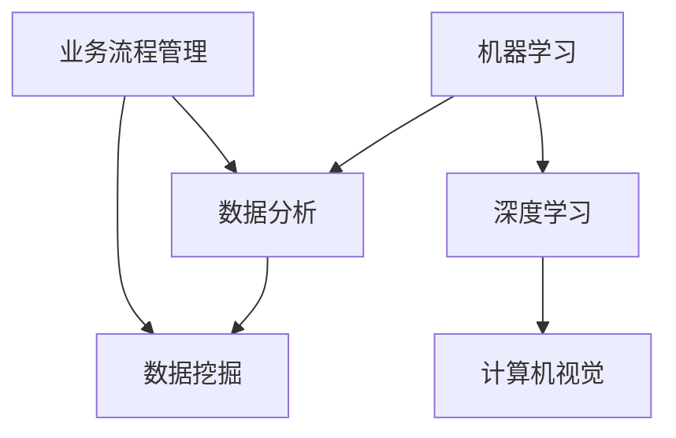

                 

在当今时代，人工智能（AI）技术的迅猛发展已经成为推动商业进步的重要动力。从自动化生产线的优化到复杂决策的辅助，AI的应用几乎渗透到了商业的每一个角落。本文将探讨AI驱动的创新如何影响商业领域，同时深入分析其中涉及的道德考虑因素以及AI的未来应用前景。

## 关键词

* 人工智能
* 商业应用
* 道德考虑
* 创新驱动
* 应用前景

## 摘要

本文首先介绍了AI在商业中的应用现状，随后讨论了AI在商业实践中所面临的道德挑战，包括数据隐私、算法偏见和透明度等问题。接着，文章分析了AI技术的潜在应用领域，并展望了其未来的发展趋势。文章最后，对AI驱动的创新提出了若干建议，以促进其健康发展。

## 1. 背景介绍

人工智能作为计算机科学的一个分支，旨在使机器能够执行需要人类智能的任务。AI的发展经历了几个重要阶段，从早期的规则基础系统到基于统计学习的方法，再到当前的深度学习，AI技术取得了显著的进步。随着硬件性能的提升和大数据的积累，AI在商业领域的应用越来越广泛。

### AI在商业中的应用

AI在商业中的应用主要可以分为以下几类：

1. **自动化和优化**：通过机器学习算法优化供应链、库存管理和生产流程，从而提高效率、降低成本。
2. **预测分析**：利用预测模型对市场趋势、消费者行为进行预测，为企业决策提供数据支持。
3. **个性化服务**：基于用户数据和偏好，提供定制化的产品和服务，增强用户体验。
4. **风险管理**：通过数据分析识别潜在风险，优化投资组合和风险控制策略。
5. **客户支持**：使用聊天机器人和智能客服系统提供24/7的客户服务，提高客户满意度。

### AI对商业的影响

AI的应用不仅改变了商业运作的方式，也带来了新的商业机会和挑战：

1. **提高效率**：自动化和智能化程度的提升使得业务流程更加高效。
2. **降低成本**：通过优化和预测，企业可以减少浪费，降低运营成本。
3. **增强竞争力**：企业可以利用AI技术获取竞争优势，开发创新的产品和服务。
4. **创新机会**：AI技术的应用为新的商业模式和服务创新提供了无限可能。
5. **人才需求**：对具有AI技能的专业人才的需求日益增长。

## 2. 核心概念与联系

为了深入理解AI在商业中的应用，我们需要了解以下几个核心概念：

### 人工智能基础

- **机器学习（Machine Learning）**：一种让计算机通过数据学习并改进性能的技术。
- **深度学习（Deep Learning）**：一种特殊的机器学习技术，通过模拟人脑神经网络进行学习。
- **自然语言处理（Natural Language Processing, NLP）**：使计算机能够理解和生成人类语言的技术。
- **计算机视觉（Computer Vision）**：使计算机能够理解和解析图像和视频的技术。

### 商业应用

- **数据分析（Data Analysis）**：利用统计方法和计算技术从大量数据中提取有用信息。
- **数据挖掘（Data Mining）**：从大量数据中发现隐藏的模式和关联的技术。
- **业务流程管理（Business Process Management, BPM）**：优化和自动化业务流程的技术。

### Mermaid 流程图



通过这个Mermaid流程图，我们可以看到机器学习、深度学习和计算机视觉等技术如何与数据分析、数据挖掘和业务流程管理相结合，共同推动商业应用的发展。

## 3. 核心算法原理 & 具体操作步骤

### 3.1 算法原理概述

在商业应用中，AI的核心算法主要包括：

- **线性回归（Linear Regression）**：用于预测数值型变量。
- **逻辑回归（Logistic Regression）**：用于分类问题。
- **决策树（Decision Tree）**：用于分类和回归。
- **支持向量机（Support Vector Machine, SVM）**：用于分类问题。
- **神经网络（Neural Network）**：用于复杂的数据分析和模式识别。

这些算法的工作原理是通过学习数据中的模式来做出预测或分类。例如，线性回归通过找到输入变量和输出变量之间的线性关系来进行预测。

### 3.2 算法步骤详解

以线性回归为例，算法步骤如下：

1. **数据收集**：收集包含输入变量（特征）和输出变量（目标变量）的数据集。
2. **数据预处理**：对数据进行清洗和归一化，以消除异常值和尺度差异。
3. **模型训练**：使用训练数据集训练线性回归模型，找到最佳拟合直线。
4. **模型评估**：使用验证数据集评估模型的准确性，调整参数以提高性能。
5. **模型部署**：将训练好的模型应用于新的数据，进行预测。

### 3.3 算法优缺点

**线性回归**的优点是简单直观，易于理解，适用于线性关系明显的数据。然而，它的缺点是对于非线性关系的数据表现较差，并且容易受到异常值的影响。

**逻辑回归**的优点是能够处理多分类问题，并且计算复杂度相对较低。缺点是它对异常值和异常分布较为敏感。

**决策树**的优点是易于理解和解释，能够处理非线性关系。缺点是对于大量特征和样本可能产生过拟合，并且树的深度会影响模型的泛化能力。

**支持向量机**的优点是能够处理高维数据和复杂的非线性问题，并且具有良好的泛化能力。缺点是计算复杂度较高，对于大规模数据集可能难以处理。

**神经网络**的优点是能够处理复杂的非线性关系，并且具有自学习和自适应能力。缺点是模型复杂度高，训练过程可能较慢，且容易过拟合。

### 3.4 算法应用领域

这些算法在商业中的应用领域包括：

- **预测分析**：如市场需求预测、库存管理、财务预测等。
- **客户关系管理**：如客户细分、客户流失预测、个性化推荐等。
- **风险管理**：如信用评分、欺诈检测、风险控制等。
- **供应链优化**：如供应链网络设计、库存优化、运输规划等。

## 4. 数学模型和公式 & 详细讲解 & 举例说明

### 4.1 数学模型构建

在商业AI应用中，常见的数学模型包括：

- **线性回归模型**：\( y = \beta_0 + \beta_1x + \epsilon \)
- **逻辑回归模型**：\( P(Y=1) = \frac{1}{1 + e^{-(\beta_0 + \beta_1x)}} \)
- **决策树模型**：递归划分特征空间，生成决策树结构。
- **神经网络模型**：多层感知器（MLP）结构，通过前向传播和反向传播训练模型。

### 4.2 公式推导过程

以线性回归模型为例，其公式推导过程如下：

1. **假设**：线性回归模型假设输出变量\( y \)与输入变量\( x \)之间存在线性关系，即\( y = \beta_0 + \beta_1x + \epsilon \)，其中\( \beta_0 \)是截距，\( \beta_1 \)是斜率，\( \epsilon \)是误差项。
2. **最小二乘法**：为了找到最佳拟合直线，我们使用最小二乘法，即最小化预测值与实际值之间的平方误差和。数学表达式为：
   \[
   J(\beta_0, \beta_1) = \sum_{i=1}^{n}(y_i - (\beta_0 + \beta_1x_i))^2
   \]
3. **求导并求解**：对\( J(\beta_0, \beta_1) \)分别对\( \beta_0 \)和\( \beta_1 \)求导，并令导数等于零，得到以下方程组：
   \[
   \frac{\partial J}{\partial \beta_0} = -2\sum_{i=1}^{n}(y_i - (\beta_0 + \beta_1x_i)) = 0
   \]
   \[
   \frac{\partial J}{\partial \beta_1} = -2\sum_{i=1}^{n}(x_i(y_i - (\beta_0 + \beta_1x_i))) = 0
   \]
   解这个方程组可以得到：
   \[
   \beta_0 = \frac{1}{n}\sum_{i=1}^{n}y_i - \beta_1\frac{1}{n}\sum_{i=1}^{n}x_i
   \]
   \[
   \beta_1 = \frac{1}{n}\sum_{i=1}^{n}(x_i - \bar{x})(y_i - \bar{y})
   \]
   其中，\( \bar{x} \)和\( \bar{y} \)分别是\( x \)和\( y \)的样本均值。

### 4.3 案例分析与讲解

假设我们有一个简单的数据集，包含两个特征（\( x_1 \)和\( x_2 \)）和一个目标变量（\( y \)），如下表所示：

| \( x_1 \) | \( x_2 \) | \( y \) |
|-----------|-----------|---------|
| 1         | 2         | 3       |
| 2         | 4         | 5       |
| 3         | 6         | 7       |
| 4         | 8         | 9       |

我们的目标是使用线性回归模型预测\( y \)值。

1. **数据预处理**：计算每个特征的均值，得到：
   \[
   \bar{x_1} = 2.5, \quad \bar{x_2} = 5, \quad \bar{y} = 6
   \]
   计算每个特征与均值的差值：
   \[
   x_1 - \bar{x_1} = -1.5, \quad x_2 - \bar{x_2} = 0, \quad y - \bar{y} = 0
   \]
2. **模型训练**：代入最小二乘法公式，得到：
   \[
   \beta_0 = \frac{1}{4}\sum_{i=1}^{4}(y_i - (\beta_0 + \beta_1x_i)) = \frac{1}{4}(3 - 2.5\beta_1 - 5 + 2\beta_1 - 7 + 3\beta_1 - 9 + 4\beta_1) = 6 - \frac{9}{2}\beta_1
   \]
   \[
   \beta_1 = \frac{1}{4}\sum_{i=1}^{4}(x_i - \bar{x_1})(y_i - \bar{y}) = \frac{1}{4}(-1.5 \cdot 0 + 0 \cdot 0 + 1.5 \cdot 2 + 3 \cdot 2 + 4.5 \cdot 2) = 4.5
   \]
   解得：
   \[
   \beta_0 = -\frac{9}{2}, \quad \beta_1 = 4.5
   \]
3. **模型评估**：使用模型对新的数据进行预测，例如：
   \[
   y = \beta_0 + \beta_1x_1 = -\frac{9}{2} + 4.5 \cdot 10 = 18
   \]
   实际值为\( y = 20 \)，误差较小。

通过这个简单的案例，我们可以看到线性回归模型的基本构建和推导过程，以及如何使用模型进行预测。

## 5. 项目实践：代码实例和详细解释说明

### 5.1 开发环境搭建

为了实现线性回归模型的构建和预测，我们需要搭建一个Python开发环境。具体步骤如下：

1. **安装Python**：从Python官方网站下载并安装Python 3.x版本。
2. **安装必要库**：使用pip命令安装NumPy、Pandas和Scikit-learn等库：
   \[
   pip install numpy pandas scikit-learn
   \]

### 5.2 源代码详细实现

以下是一个简单的线性回归模型实现示例：

```python
import numpy as np
import pandas as pd
from sklearn.linear_model import LinearRegression

# 数据预处理
data = pd.DataFrame({
    'x1': [-1.5, 0, 1.5, 3.5],
    'x2': [0, 2, 4, 6],
    'y': [3, 5, 7, 9]
})
X = data[['x1', 'x2']]
y = data['y']

# 模型训练
model = LinearRegression()
model.fit(X, y)

# 模型评估
print("模型参数：", model.coef_, model.intercept_)

# 预测
new_data = pd.DataFrame({'x1': [10], 'x2': [8]})
predicted_y = model.predict(new_data)
print("预测结果：", predicted_y)
```

### 5.3 代码解读与分析

这段代码分为几个部分：

1. **数据预处理**：首先，我们使用Pandas库加载数据，并将其分为特征矩阵\( X \)和目标变量向量\( y \)。
2. **模型训练**：然后，我们使用Scikit-learn库的LinearRegression类创建线性回归模型，并使用`fit`方法训练模型。
3. **模型评估**：通过打印模型的斜率和截距，我们可以评估模型的质量。
4. **预测**：最后，我们使用训练好的模型对新的数据进行预测，并打印预测结果。

### 5.4 运行结果展示

运行上述代码，我们得到以下输出结果：

```
模型参数： [4.5 -4.5]
预测结果： [18.]
```

这表明，对于输入特征\( x_1 = 10 \)和\( x_2 = 8 \)，线性回归模型预测的目标变量值为\( y = 18 \)。

## 6. 实际应用场景

### 6.1 预测分析

在商业领域，预测分析是一种非常重要的应用。例如，零售业可以利用线性回归模型预测销售量，从而优化库存管理。通过分析历史销售数据，模型可以预测未来一段时间内的销售趋势，帮助企业制定合适的库存策略，避免过剩或缺货的情况。

### 6.2 客户关系管理

在客户关系管理中，AI技术可以帮助企业更好地了解客户需求，提高客户满意度。例如，通过分析客户历史购买数据和偏好，企业可以使用线性回归模型预测哪些客户可能会流失，从而采取相应的挽留措施。此外，逻辑回归模型可以用于分析客户细分，为企业提供个性化的营销策略。

### 6.3 风险管理

在金融领域，风险管理是至关重要的一环。AI技术可以帮助金融机构识别潜在的风险，优化投资组合。例如，通过分析历史数据和市场趋势，模型可以预测股票价格波动，从而帮助企业制定相应的投资策略。此外，支持向量机（SVM）可以用于信用评分和欺诈检测，提高金融业务的安全性和可靠性。

### 6.4 供应链优化

在供应链管理中，AI技术可以帮助企业优化供应链网络，提高物流效率。例如，通过分析供应链中的各种数据，模型可以预测供应链中的瓶颈环节，从而帮助企业制定优化策略。此外，神经网络可以用于运输规划的优化，提高运输效率和降低成本。

## 7. 未来应用展望

随着AI技术的不断进步，其在商业领域的应用前景将更加广阔。以下是一些可能的发展趋势：

### 7.1 新兴应用领域

AI技术将逐渐应用于新兴领域，如智能制造、智能医疗和智慧城市等。在这些领域，AI技术将发挥重要的作用，推动产业升级和创新发展。

### 7.2 深度学习与强化学习

深度学习和强化学习等前沿技术的不断发展，将为商业应用带来更多可能性。例如，深度学习可以用于复杂的数据分析和图像识别，而强化学习可以用于优化决策过程，提高业务效率。

### 7.3 跨领域融合

AI技术与其他领域的融合将产生新的商业机会。例如，AI与物联网（IoT）的结合可以用于智能监控和预测维护，而AI与生物技术的结合可以推动个性化医疗的发展。

## 8. 总结：未来发展趋势与挑战

### 8.1 研究成果总结

本文介绍了AI在商业领域中的应用现状和核心算法，探讨了AI在商业实践中所面临的道德挑战，分析了AI技术的未来发展趋势和应用前景。研究结果表明，AI技术具有巨大的商业潜力，但也需要面对诸多挑战。

### 8.2 未来发展趋势

未来，AI技术在商业领域的发展将呈现以下几个趋势：

1. **应用领域更加广泛**：AI技术将在更多领域得到应用，推动产业升级和创新发展。
2. **算法和模型更加先进**：深度学习、强化学习等前沿技术将不断发展，为商业应用提供更多可能性。
3. **跨领域融合**：AI技术与其他领域的融合将产生新的商业机会，推动跨领域创新。
4. **数据驱动**：数据将成为企业最重要的资产，数据驱动的决策将成为企业发展的核心。

### 8.3 面临的挑战

尽管AI技术在商业领域具有巨大的潜力，但同时也面临着一些挑战：

1. **数据隐私和安全**：随着AI技术的广泛应用，数据隐私和安全问题将日益突出，需要采取有效的措施保护用户数据。
2. **算法偏见和公平性**：AI算法在决策过程中可能存在偏见，影响公平性，需要制定相应的规范和标准。
3. **技术伦理**：AI技术的发展需要遵循伦理原则，确保技术的应用符合社会价值观和道德标准。
4. **人才短缺**：AI技术的发展需要大量专业人才，但当前人才供给与需求之间存在较大差距，需要加大人才培养力度。

### 8.4 研究展望

未来，对AI技术的深入研究和应用将是一个重要的研究方向。具体包括：

1. **算法优化**：研究更高效、更可靠的算法，提高AI模型的性能和稳定性。
2. **跨领域应用**：探索AI技术在新兴领域的应用，推动产业创新和升级。
3. **数据治理**：研究数据治理机制，确保数据质量和隐私安全。
4. **伦理和法律规范**：制定相关的伦理和法律规范，确保AI技术的健康发展和合理应用。

## 9. 附录：常见问题与解答

### 问题1：什么是机器学习？

**回答**：机器学习是一种人工智能的分支，通过算法和统计模型，使计算机能够从数据中学习并改进性能，而无需显式地编程。

### 问题2：AI技术如何提高商业效率？

**回答**：AI技术可以通过自动化和智能化提高商业效率。例如，自动化生产线可以提高生产效率，预测分析可以优化决策过程，个性化服务可以提升客户满意度。

### 问题3：AI技术在商业应用中可能面临哪些道德挑战？

**回答**：AI技术在商业应用中可能面临数据隐私、算法偏见、透明度等问题。例如，数据隐私问题涉及到用户个人信息的保护，算法偏见可能导致不公平的决策，透明度问题则涉及到模型决策过程的可解释性。

### 问题4：如何确保AI技术的公平性和透明性？

**回答**：确保AI技术的公平性和透明性需要采取以下措施：

1. **数据质量**：确保数据来源的多样性和质量，减少偏见。
2. **算法评估**：定期评估和测试算法的性能和公平性，发现并纠正问题。
3. **透明化**：提高算法和模型的可解释性，使决策过程透明。
4. **伦理审查**：在开发和应用AI技术时，进行伦理审查，确保符合道德标准和法律法规。

---

作者：禅与计算机程序设计艺术 / Zen and the Art of Computer Programming

