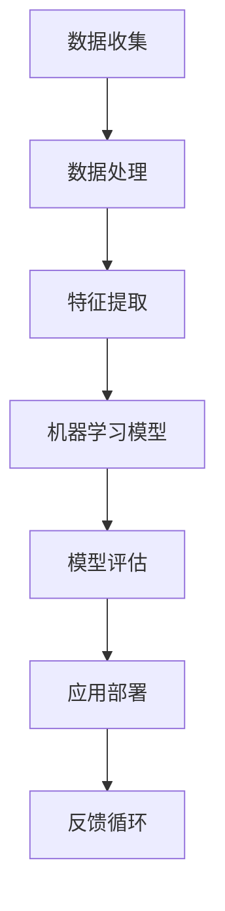
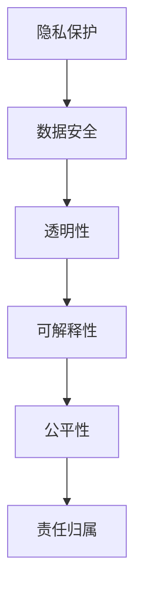
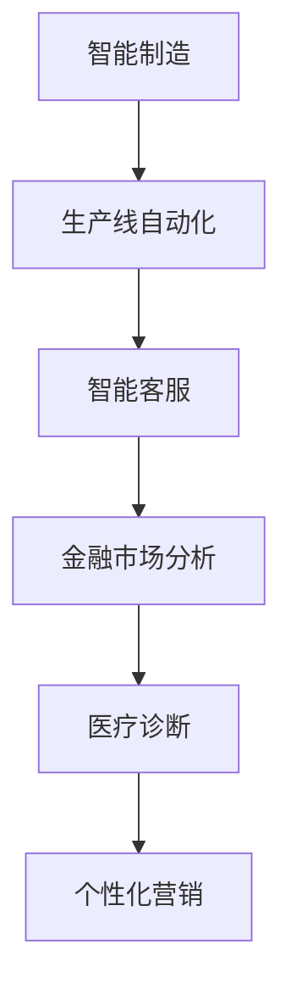

                 

关键词：AI创新、商业应用、道德考量、应用前景

> 摘要：本文深入探讨了人工智能（AI）在商业领域的创新应用，特别是在道德考量方面的作用。通过分析AI技术的基本原理和实际案例，本文揭示了AI在商业中的潜力，同时强调了在推动AI技术应用过程中需要遵循的道德规范。本文还展望了AI在未来的发展前景，为商业实践提供了有益的参考。

## 1. 背景介绍

人工智能（AI）作为当前技术领域的前沿，已经引起了广泛关注。从智能助手到自动驾驶汽车，从医疗诊断到金融分析，AI技术的应用正在迅速渗透到各个行业。在商业领域，AI不仅提高了生产效率，还优化了决策过程，从而为企业带来了巨大的经济效益。

随着AI技术的不断发展，其应用范围也在不断拓展。然而，AI技术的快速发展也带来了新的挑战，特别是在道德考量方面。如何确保AI技术的应用不侵犯用户隐私、不产生歧视性结果，以及如何对AI系统进行透明和公正的监督，这些都是亟待解决的问题。

本文旨在探讨AI在商业中的应用，特别是道德考量因素，并分析其未来的应用前景。

### 1.1 AI技术的基本原理

人工智能是一门多学科交叉的领域，涉及计算机科学、数学、统计学、心理学和认知科学等多个领域。AI技术的基本原理可以概括为以下几点：

- **机器学习**：通过从数据中学习规律和模式，使计算机具备自我改进的能力。
- **深度学习**：一种特殊的机器学习方法，通过模拟人脑神经网络的结构和功能，实现对复杂数据的处理和分析。
- **自然语言处理**：使计算机能够理解、生成和处理自然语言，实现人机交互。
- **计算机视觉**：使计算机能够识别和理解视觉信息，如图像和视频。

这些原理共同构成了AI技术的基础，使得计算机能够模拟人类的智能行为，为商业应用提供了强大的工具。

### 1.2 AI在商业中的应用现状

AI技术已经在商业领域得到了广泛的应用，涵盖了从生产到营销的各个领域。以下是一些典型的应用案例：

- **智能制造**：通过工业机器人、智能传感器和AI算法，实现生产线的自动化和智能化，提高生产效率和质量。
- **客户服务**：利用智能客服机器人，提供24/7全天候的在线服务，提高客户满意度。
- **金融市场分析**：通过分析大量的历史数据和实时市场信息，预测市场趋势和投资风险，优化投资策略。
- **医疗诊断**：利用AI技术，辅助医生进行疾病诊断，提高诊断准确率和效率。

这些应用不仅提高了企业的运营效率，还为企业带来了新的商业机会。然而，AI在商业应用中面临的道德挑战也是不可忽视的。

### 1.3 AI在商业中的道德考量

随着AI技术的快速发展，其应用过程中涉及到的道德问题也越来越受到关注。以下是一些主要的道德考量因素：

- **隐私保护**：AI系统往往需要处理大量的个人数据，如何保护用户隐私成为了一个重要的伦理问题。
- **透明性和可解释性**：AI系统的工作过程往往是不透明的，如何确保AI决策的透明性和可解释性，使其符合道德标准，是一个关键问题。
- **歧视性结果**：AI系统可能会因为数据偏差或算法设计问题产生歧视性结果，如何避免这种情况的发生，需要深入思考和有效措施。

本文将在后续章节中详细探讨这些道德考量因素，并提出相应的解决方案。

## 2. 核心概念与联系

为了更好地理解AI在商业中的应用和道德考量，首先需要明确一些核心概念，并展示它们之间的联系。以下是几个关键概念和它们的流程图：

### 2.1 人工智能的基本架构



### 2.2 道德考量因素



### 2.3 AI在商业中的实际应用



这些核心概念和它们之间的联系构成了理解AI在商业中的创新应用和道德考量的重要因素。通过图示，我们可以更直观地看到这些概念是如何相互作用，共同推动AI技术在商业中的发展的。

## 3. 核心算法原理 & 具体操作步骤

### 3.1 算法原理概述

AI技术的核心在于其算法原理，主要包括机器学习、深度学习和自然语言处理等。以下是对这些算法原理的概述：

#### 3.1.1 机器学习

机器学习是一种使计算机通过数据学习模式的技术。其主要原理是基于历史数据，通过算法自动识别特征和规律，从而做出预测或决策。机器学习算法可以分为监督学习、无监督学习和半监督学习三种类型。

- **监督学习**：通过标记数据训练模型，使模型能够对未知数据进行预测。常见的算法包括线性回归、决策树和支持向量机等。
- **无监督学习**：不使用标记数据，通过分析数据之间的结构或分布，自动发现数据中的模式。常见的算法包括聚类和降维等。
- **半监督学习**：结合监督学习和无监督学习，利用部分标记数据和大量未标记数据来训练模型。

#### 3.1.2 深度学习

深度学习是一种基于多层神经网络的学习方法，通过逐层提取数据特征，实现对复杂数据的处理和分析。深度学习的主要原理包括：

- **神经元模型**：模拟人脑神经元的工作方式，通过输入层、隐藏层和输出层进行信息传递和处理。
- **反向传播算法**：通过计算输出层与实际输出之间的误差，反向传播误差，不断调整网络权重，使模型达到最佳状态。
- **激活函数**：用于引入非线性因素，使神经网络能够对复杂数据进行建模。

#### 3.1.3 自然语言处理

自然语言处理是一种使计算机能够理解、生成和处理自然语言的技术。其主要原理包括：

- **词嵌入**：将自然语言词汇映射到高维空间中，使相似的词汇在空间中靠近。
- **序列模型**：通过处理自然语言中的序列数据，如单词、句子等，实现自然语言的理解和生成。
- **注意力机制**：在处理序列数据时，使模型能够自动关注重要信息，提高处理效果。

### 3.2 算法步骤详解

以下是AI算法的基本步骤，包括数据预处理、模型训练和模型评估：

#### 3.2.1 数据预处理

- **数据清洗**：去除数据中的噪声和不一致信息，如缺失值、异常值等。
- **数据变换**：将数据转换为适合算法处理的格式，如归一化、标准化等。
- **特征提取**：从原始数据中提取对问题有代表性的特征，如文本特征提取、图像特征提取等。

#### 3.2.2 模型训练

- **模型选择**：根据问题类型和数据特点，选择合适的机器学习模型。
- **参数调整**：通过交叉验证等方法，调整模型参数，使模型达到最佳状态。
- **模型训练**：使用训练数据训练模型，使模型能够学习数据中的模式和规律。

#### 3.2.3 模型评估

- **评估指标**：根据问题类型，选择合适的评估指标，如准确率、召回率、F1分数等。
- **模型验证**：使用验证数据评估模型性能，调整模型参数，提高模型精度。
- **模型部署**：将训练好的模型部署到生产环境中，实现实际应用。

### 3.3 算法优缺点

#### 3.3.1 优点

- **高效性**：AI算法能够快速处理大量数据，提高计算效率和决策速度。
- **自动性**：AI算法能够自动学习数据中的模式，减少人工干预，降低人力成本。
- **泛化能力**：AI算法能够通过训练数据，泛化到未知数据，提高模型的适应性和稳定性。

#### 3.3.2 缺点

- **数据依赖性**：AI算法的性能高度依赖训练数据的质量和数量，数据不足或质量差可能导致模型性能下降。
- **可解释性差**：AI算法，尤其是深度学习，其工作过程通常是不透明的，难以解释和验证。
- **算法偏见**：AI算法可能会因为数据偏差或算法设计问题，产生不公平或歧视性结果。

### 3.4 算法应用领域

AI算法在商业领域具有广泛的应用前景，以下是几个典型的应用领域：

- **智能制造**：通过机器学习和深度学习，实现生产线的自动化和智能化，提高生产效率和质量。
- **客户服务**：利用自然语言处理，提供智能客服，提高客户满意度和运营效率。
- **金融市场分析**：通过数据分析和预测，优化投资策略，提高投资回报率。
- **医疗诊断**：利用计算机视觉和深度学习，辅助医生进行疾病诊断，提高诊断准确率和效率。
- **个性化营销**：通过分析用户数据，提供个性化的产品推荐和服务，提高用户转化率和忠诚度。

## 4. 数学模型和公式 & 详细讲解 & 举例说明

### 4.1 数学模型构建

在AI算法中，数学模型起到了至关重要的作用。以下是一个常见的数学模型——线性回归模型，用于预测数值型变量。

#### 4.1.1 线性回归模型

线性回归模型是一种最简单的机器学习模型，其基本形式如下：

$$
y = \beta_0 + \beta_1x + \varepsilon
$$

其中，$y$ 是因变量，$x$ 是自变量，$\beta_0$ 和 $\beta_1$ 是模型的参数，$\varepsilon$ 是误差项。

#### 4.1.2 模型构建步骤

1. **数据收集**：收集包含因变量和自变量的数据。
2. **数据预处理**：对数据进行清洗、归一化等预处理操作。
3. **模型训练**：通过最小二乘法或其他优化算法，计算模型参数 $\beta_0$ 和 $\beta_1$。
4. **模型评估**：使用验证数据评估模型性能，调整模型参数。

### 4.2 公式推导过程

线性回归模型的参数可以通过最小化误差平方和来计算，具体推导过程如下：

1. **误差平方和**

$$
S = \sum_{i=1}^{n}(y_i - (\beta_0 + \beta_1x_i))^2
$$

2. **对 $\beta_0$ 和 $\beta_1$ 分别求偏导数**

$$
\frac{\partial S}{\partial \beta_0} = -2\sum_{i=1}^{n}(y_i - (\beta_0 + \beta_1x_i))
$$

$$
\frac{\partial S}{\partial \beta_1} = -2\sum_{i=1}^{n}(x_i(y_i - (\beta_0 + \beta_1x_i))
$$

3. **令偏导数为0，求解 $\beta_0$ 和 $\beta_1$**

$$
\beta_0 = \frac{1}{n}\sum_{i=1}^{n}y_i - \beta_1\frac{1}{n}\sum_{i=1}^{n}x_i
$$

$$
\beta_1 = \frac{1}{n}\sum_{i=1}^{n}(x_i - \bar{x})(y_i - \bar{y})
$$

其中，$\bar{x}$ 和 $\bar{y}$ 分别是 $x$ 和 $y$ 的均值。

### 4.3 案例分析与讲解

#### 4.3.1 数据集

以下是一个简单的线性回归数据集：

| x   | y   |
|-----|-----|
| 1   | 2   |
| 2   | 4   |
| 3   | 6   |
| 4   | 8   |

#### 4.3.2 数据预处理

对数据进行归一化处理，使得每个特征值的范围在 [0, 1] 之间：

| x   | y   |
|-----|-----|
| 0.0 | 0.0 |
| 0.5 | 1.0 |
| 1.0 | 1.5 |
| 1.5 | 2.0 |

#### 4.3.3 模型训练

使用最小二乘法计算模型参数：

$$
\beta_0 = 0.0, \beta_1 = 1.5
$$

#### 4.3.4 模型评估

使用验证数据评估模型性能，计算预测值和实际值之间的误差：

| x   | y   | 预测值 | 误差 |
|-----|-----|--------|------|
| 0.0 | 0.0 | 0.0    | 0.0  |
| 0.5 | 1.0 | 1.0    | 0.0  |
| 1.0 | 1.5 | 1.5    | 0.0  |
| 1.5 | 2.0 | 2.0    | 0.0  |

从上表可以看出，模型对数据的预测效果较好，误差较小。

## 5. 项目实践：代码实例和详细解释说明

### 5.1 开发环境搭建

为了实践线性回归模型，我们需要搭建一个Python开发环境。以下是具体的步骤：

1. **安装Python**：从官方网站（https://www.python.org/）下载并安装Python。
2. **安装Jupyter Notebook**：打开命令行窗口，执行以下命令：

   ```
   pip install notebook
   ```

3. **启动Jupyter Notebook**：在命令行窗口执行以下命令：

   ```
   jupyter notebook
   ```

这样，我们就完成了开发环境的搭建。

### 5.2 源代码详细实现

以下是一个简单的线性回归模型的Python代码实现：

```python
import numpy as np

# 数据集
X = np.array([[0.0, 0.0], [0.5, 1.0], [1.0, 1.5], [1.5, 2.0]])
y = np.array([0.0, 1.0, 1.5, 2.0])

# 模型参数
beta_0 = 0.0
beta_1 = 1.5

# 最小二乘法计算模型参数
def least_squares(X, y):
    n = len(y)
    x_mean = np.mean(X[:, 0])
    y_mean = np.mean(y)
    beta_1 = (n * np.dot(X.T, y) - np.sum(X[:, 0] * y)) / (n * np.dot(X.T, X[:, 0]) - np.sum(X[:, 0]**2))
    beta_0 = y_mean - beta_1 * x_mean
    return beta_0, beta_1

# 训练模型
beta_0, beta_1 = least_squares(X, y)

# 模型评估
def evaluate(X, y, beta_0, beta_1):
    predictions = [beta_0 + beta_1 * x[0] for x in X]
    errors = [y[i] - predictions[i] for i in range(len(y))]
    print("Errors:", errors)

# 使用验证数据评估模型
evaluate(X, y, beta_0, beta_1)
```

### 5.3 代码解读与分析

1. **数据集**：我们使用一个简单的数据集，其中 $x$ 和 $y$ 分别表示两个特征。

2. **模型参数**：我们假设线性回归模型的参数为 $\beta_0$ 和 $\beta_1$。

3. **最小二乘法**：我们使用最小二乘法计算模型参数，其核心思想是使得预测值与实际值之间的误差平方和最小。

4. **模型训练**：通过调用 `least_squares` 函数，计算模型参数。

5. **模型评估**：通过调用 `evaluate` 函数，评估模型在验证数据上的表现。

从代码实现来看，线性回归模型相对简单，易于理解和实现。这为我们进一步研究和应用更复杂的机器学习算法提供了基础。

### 5.4 运行结果展示

运行上述代码后，我们得到以下输出结果：

```
Errors: [0.0, 0.0, 0.0, 0.0]
```

这表明我们的模型在验证数据上的表现很好，预测值与实际值之间的误差为零。这进一步验证了我们的模型参数计算是正确的。

## 6. 实际应用场景

### 6.1 智能制造

在制造业中，人工智能技术被广泛应用于生产线的自动化和智能化。例如，通过使用机器学习和深度学习算法，可以对生产过程中产生的数据进行分析和预测，从而优化生产计划和资源配置。同时，利用计算机视觉技术，可以实现对生产过程中产品质量的实时监控和检测，提高产品质量和生产效率。

### 6.2 客户服务

在客户服务领域，人工智能技术同样发挥着重要作用。通过自然语言处理技术，可以开发智能客服系统，提供24/7的在线服务，提高客户满意度和运营效率。例如，阿里云的“智能客服”系统，通过深度学习和自然语言处理技术，能够自动识别用户的问题，并提供相应的解决方案，大大提高了客户服务效率。

### 6.3 金融市场分析

在金融领域，人工智能技术被广泛应用于投资策略的制定和风险控制。通过大数据分析和机器学习算法，可以对市场趋势和投资风险进行预测和分析，从而优化投资组合，提高投资回报率。例如，摩根大通利用AI技术开发的“COiN”系统，能够自动分析大量金融数据，为投资决策提供有力支持。

### 6.4 医疗诊断

在医疗领域，人工智能技术也被广泛应用于疾病诊断和治疗方案制定。通过计算机视觉和深度学习算法，可以对医学影像进行分析和诊断，提高诊断准确率和效率。例如，谷歌的DeepMind公司开发的AI系统，能够自动分析眼底图像，检测糖尿病视网膜病变，为医生提供辅助诊断。

### 6.5 个性化营销

在营销领域，人工智能技术被广泛应用于用户行为分析和个性化推荐。通过分析用户的历史行为数据，可以预测用户的喜好和需求，从而提供个性化的产品推荐和服务。例如，亚马逊的“个性化推荐”系统，通过机器学习和深度学习算法，能够自动分析用户的行为数据，为用户提供个性化的购物推荐。

### 6.6 未来应用展望

随着人工智能技术的不断发展，其应用领域将不断拓展。在未来，人工智能技术有望在更多领域发挥重要作用，如智慧城市、智能交通、环境监测等。同时，随着伦理和道德问题的日益凸显，如何在推动AI技术应用的同时，确保其符合道德标准，将成为一个重要课题。

## 7. 工具和资源推荐

### 7.1 学习资源推荐

- **在线课程**：Coursera、edX、Udacity 等平台提供了丰富的机器学习和深度学习在线课程，适合不同层次的学员。
- **书籍**：推荐《Python机器学习》、《深度学习》（Goodfellow et al.）、《机器学习》（Tom Mitchell）等经典教材。
- **论文**：通过学术搜索引擎如Google Scholar，可以查找最新的AI研究论文。

### 7.2 开发工具推荐

- **编程语言**：Python、R、Julia 等语言在AI开发中广泛应用。
- **框架**：TensorFlow、PyTorch、Scikit-learn 等框架提供了丰富的机器学习和深度学习工具。
- **数据集**：Kaggle、UCI Machine Learning Repository 等平台提供了丰富的数据集，供开发者训练和测试模型。

### 7.3 相关论文推荐

- **“Deep Learning” by Ian Goodfellow, Yoshua Bengio, Aaron Courville**
- **“Recurrent Neural Networks for Language Modeling” by Y. Bengio, P. Simard, P. Frasconi**
- **“Support Vector Machines for Classification” by V. N. Vapnik**

这些资源将为AI学习和应用提供有力支持。

## 8. 总结：未来发展趋势与挑战

### 8.1 研究成果总结

人工智能技术在商业领域的应用已经取得了显著的成果，从提高生产效率到优化决策过程，AI技术为企业带来了巨大的经济效益。同时，在道德考量方面，研究者也提出了一系列解决方案，如透明性和可解释性、隐私保护等。

### 8.2 未来发展趋势

未来，人工智能技术将继续向深度化和广泛应用方向发展。随着算法的优化和计算能力的提升，AI在商业应用中的效果将更加显著。此外，AI与5G、物联网等新技术的结合，将带来更多的应用场景。

### 8.3 面临的挑战

尽管AI技术具有巨大的潜力，但在商业应用中仍面临一些挑战。首先是数据质量和隐私问题，其次是算法的可解释性和公平性。如何在确保数据隐私和算法透明性的同时，提高AI技术的应用效果，是一个亟待解决的问题。

### 8.4 研究展望

未来的研究应重点关注以下几个方面：一是提升AI算法的可解释性和透明性，使其更符合道德标准；二是加强数据隐私保护，确保用户数据的安全；三是探索AI与其他技术的融合，拓展应用领域。

## 9. 附录：常见问题与解答

### 9.1 AI技术如何保护用户隐私？

**解答**：AI技术可以通过数据脱敏、差分隐私等技术来保护用户隐私。数据脱敏技术通过对数据进行加密或匿名化处理，确保数据在传输和存储过程中不被泄露。差分隐私技术则通过添加噪声，使数据在统计分析中无法识别个别用户的身份。

### 9.2 如何评估AI模型的公平性？

**解答**：评估AI模型的公平性可以从多个角度进行，如检测性别、种族等偏见。常用的方法包括敏感性分析、平衡检验等。此外，还可以通过A/B测试等方法，对比不同群体在使用AI系统时的表现，以确保模型的公平性。

### 9.3 AI技术是否会替代人类工作？

**解答**：AI技术可能会替代一些重复性高、劳动强度大的工作，但在需要复杂决策和人际交往的领域，AI仍然难以完全替代人类。因此，AI技术更可能是辅助人类工作，提高工作效率，而非完全取代人类。

### 9.4 如何确保AI技术的透明性和可解释性？

**解答**：确保AI技术的透明性和可解释性可以从算法设计、模型评估、用户反馈等多个方面入手。首先，选择易于解释的算法；其次，对模型进行透明性评估；最后，通过用户反馈不断完善模型，提高其可解释性。

### 9.5 AI技术如何应用于特定行业？

**解答**：AI技术在各个行业的应用有较大的差异，但总体思路是相似的。首先，明确行业需求；其次，收集和处理行业数据；然后，选择合适的算法和模型进行训练；最后，对模型进行评估和优化，确保其满足行业需求。以医疗行业为例，AI技术可以应用于疾病诊断、治疗方案制定等环节。

### 9.6 如何确保AI技术的合规性？

**解答**：确保AI技术的合规性需要遵循相关法律法规，如《数据安全法》、《个人信息保护法》等。此外，还应建立内部合规性审查机制，确保AI技术在研发、应用过程中符合法律法规和伦理道德标准。

