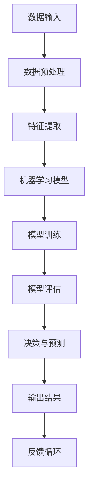

                 

关键词：人工智能，商业应用，道德考量，创新，未来展望

> 摘要：本文深入探讨了人工智能在商业应用中的道德考量因素，以及其在驱动创新方面的重要作用。通过分析人工智能的核心概念和架构，详细解读了其算法原理与操作步骤，并结合数学模型和具体案例，展示了人工智能在不同领域的应用实例。文章最后对人工智能的未来发展趋势和挑战进行了展望，以期为读者提供全面而深入的洞察。

## 1. 背景介绍

随着人工智能技术的飞速发展，其在商业领域的应用已经变得日益广泛。从大数据分析到自动化决策，人工智能正在深刻改变着商业运作的方方面面。然而，随着这些技术的广泛应用，人工智能的道德考量问题也日益突出。商业应用中的人工智能系统不仅仅是一个技术问题，更是涉及到伦理、法律和社会影响等多个方面的复杂问题。

本文旨在探讨人工智能在商业应用中的道德考量因素，分析其在驱动创新方面的重要作用，并对未来应用前景进行预测。文章将分为以下几个部分：首先，介绍人工智能的核心概念和架构；其次，详细解读人工智能的算法原理和操作步骤；接着，结合数学模型和具体案例，展示人工智能在不同领域的应用实例；最后，对人工智能的未来发展趋势和挑战进行展望。

### 1.1 人工智能的定义与发展历程

人工智能（Artificial Intelligence，简称AI）是一门研究、开发用于模拟、延伸和扩展人类智能的理论、方法、技术及应用系统的综合性技术科学。人工智能的研究可以追溯到20世纪50年代，但直到近年来，随着大数据、云计算和深度学习等技术的进步，人工智能才得以实现从理论研究到实际应用的飞跃。

人工智能的发展历程可以分为以下几个阶段：

1. **初始阶段（1956-1969）**：1956年，达特茅斯会议上提出了人工智能的概念，标志着人工智能作为一个独立研究领域的诞生。这一阶段主要集中于符号推理和知识表示的研究。

2. **衰退阶段（1974-1980）**：由于实际应用的局限性，人工智能在70年代经历了短暂的衰退期。

3. **复兴阶段（1980-1987）**：专家系统的兴起使得人工智能重新得到关注，这一阶段主要集中于知识工程和知识表示的研究。

4. **平稳发展阶段（1987-2000）**：随着机器学习和神经网络技术的不断发展，人工智能在语音识别、图像处理等领域取得了显著进展。

5. **快速发展阶段（2000至今）**：大数据、云计算和深度学习的应用使得人工智能进入了快速发展阶段，尤其在自然语言处理、自动驾驶和智能制造等领域取得了重大突破。

### 1.2 人工智能在商业领域的应用现状

人工智能在商业领域的应用已经变得非常广泛，以下是一些典型的应用场景：

1. **数据分析与优化**：通过大数据分析和机器学习算法，企业可以更有效地分析市场趋势，优化业务流程，提高运营效率。

2. **客户服务与支持**：人工智能驱动的聊天机器人可以提供24/7的客户服务，提高客户满意度，降低运营成本。

3. **自动化决策与预测**：人工智能可以帮助企业自动化决策过程，提高决策速度和准确性，减少人为错误。

4. **智能制造与供应链管理**：人工智能可以用于优化生产流程，预测市场需求，优化库存管理，提高供应链效率。

5. **风险管理与欺诈检测**：人工智能可以用于实时监控交易行为，识别潜在的风险和欺诈行为，提高风险管理能力。

### 1.3 人工智能在商业应用中的道德考量

尽管人工智能在商业领域具有巨大的潜力，但其应用过程中也伴随着一系列的道德考量问题。以下是一些主要的道德考量因素：

1. **隐私保护**：人工智能系统在数据处理过程中可能会收集大量的个人信息，如何确保这些信息的隐私和安全成为了一个重要的问题。

2. **透明度与可解释性**：人工智能算法通常被认为是“黑箱”，即其内部的工作原理难以理解和解释。如何提高人工智能系统的透明度和可解释性，使其决策过程更加透明和可信，是一个重要的道德考量。

3. **公平与歧视**：人工智能系统在数据处理和决策过程中可能会引入偏见，导致不公平的结果。如何确保人工智能系统的公平性和避免歧视成为了一个重要的道德问题。

4. **责任归属**：当人工智能系统发生错误或造成损害时，如何确定责任归属成为一个复杂的道德和法律问题。

5. **伦理道德**：人工智能在商业应用中的决策可能会涉及到伦理道德问题，例如在医疗领域，人工智能如何处理生命伦理问题，如何确保其决策符合伦理规范。

## 2. 核心概念与联系

为了更好地理解人工智能在商业应用中的道德考量，我们首先需要了解人工智能的核心概念和架构。以下是一个简化的Mermaid流程图，展示了人工智能的核心概念和组成部分：



### 2.1 数据输入与预处理

数据输入是人工智能系统的第一步，数据的质量和完整性直接影响系统的性能。数据预处理包括数据清洗、数据转换和数据归一化等步骤，以确保数据的质量和一致性。

### 2.2 特征提取

特征提取是将原始数据转换为适合机器学习模型处理的形式。这一过程通常涉及到降维、特征选择和特征工程等步骤，以提高模型的性能和解释性。

### 2.3 机器学习模型

机器学习模型是人工智能系统的核心，根据不同的应用场景，可以选择不同的机器学习算法，如线性回归、决策树、支持向量机、神经网络等。

### 2.4 模型训练与评估

模型训练是使用已有数据来训练机器学习模型，使其能够学习数据的特征和规律。模型评估是使用测试数据来评估模型的性能，以确定其是否满足应用需求。

### 2.5 决策与预测

经过训练和评估的机器学习模型可以用于决策和预测，根据输入数据进行分类、回归或预测，以实现特定的业务目标。

### 2.6 反馈循环

反馈循环是人工智能系统不断优化和改进的过程，通过收集实际应用中的反馈数据，不断调整和优化模型，以提高系统的性能和可靠性。

## 3. 核心算法原理 & 具体操作步骤

### 3.1 算法原理概述

人工智能的核心算法包括机器学习、深度学习和强化学习等。以下是一个简化的机器学习算法原理概述：

1. **监督学习**：监督学习是一种从标记数据中学习的方法，输出结果通常是分类或回归。

2. **无监督学习**：无监督学习是从未标记数据中学习的方法，输出结果通常是聚类或降维。

3. **深度学习**：深度学习是一种基于多层神经网络的机器学习算法，通过逐层提取数据特征，实现复杂的非线性映射。

4. **强化学习**：强化学习是一种基于奖励机制的学习方法，通过不断尝试和反馈，优化决策策略。

### 3.2 算法步骤详解

以下是机器学习算法的一般步骤：

1. **数据收集**：收集用于训练和测试的数据集。

2. **数据预处理**：对数据进行清洗、转换和归一化等预处理步骤。

3. **特征提取**：将原始数据转换为适合机器学习模型处理的形式。

4. **模型选择**：选择合适的机器学习模型，如线性回归、决策树、支持向量机、神经网络等。

5. **模型训练**：使用训练数据集训练模型，通过调整模型的参数，使模型能够学习数据的特征和规律。

6. **模型评估**：使用测试数据集评估模型的性能，确定模型是否满足应用需求。

7. **模型部署**：将训练好的模型部署到实际应用中，进行分类、回归或预测。

### 3.3 算法优缺点

每种机器学习算法都有其优缺点，以下是一些常见算法的优缺点：

1. **线性回归**：优点：简单、易于理解和实现；缺点：对非线性数据拟合能力较差。

2. **决策树**：优点：易于理解和解释；缺点：容易过拟合，对大数据处理能力有限。

3. **支持向量机**：优点：具有较高的分类精度；缺点：计算复杂度较高，对大数据处理能力有限。

4. **神经网络**：优点：强大的非线性拟合能力；缺点：参数调优复杂，对数据量要求较高。

5. **深度学习**：优点：强大的特征提取和表达能力；缺点：计算资源需求较高，对数据质量要求较高。

6. **强化学习**：优点：能够处理动态和不确定的环境；缺点：收敛速度较慢，对环境模型要求较高。

### 3.4 算法应用领域

人工智能算法在商业领域的应用非常广泛，以下是一些典型的应用领域：

1. **金融**：用于风险评估、欺诈检测、投资决策等。

2. **医疗**：用于疾病预测、诊断辅助、药物研发等。

3. **零售**：用于销售预测、库存管理、客户推荐等。

4. **制造**：用于质量检测、设备维护、生产优化等。

5. **物流**：用于路线规划、配送优化、库存管理等。

6. **客户服务**：用于智能客服、情感分析、行为预测等。

## 4. 数学模型和公式 & 详细讲解 & 举例说明

### 4.1 数学模型构建

在人工智能算法中，数学模型起着至关重要的作用。以下是一个简化的线性回归数学模型构建过程：

1. **模型假设**：假设输入特征集为 \(X\)，输出为目标变量 \(Y\)，线性回归模型可以表示为：

   \[
   Y = \beta_0 + \beta_1X + \epsilon
   \]

   其中，\(\beta_0\) 和 \(\beta_1\) 是模型参数，\(\epsilon\) 是误差项。

2. **模型求解**：使用最小二乘法求解模型参数，最小化损失函数 \(L(\beta_0, \beta_1)\)：

   \[
   L(\beta_0, \beta_1) = \sum_{i=1}^{n}(Y_i - (\beta_0 + \beta_1X_i))^2
   \]

   求解过程可以通过梯度下降法、牛顿法等优化算法实现。

### 4.2 公式推导过程

以下是线性回归模型的损失函数和梯度下降法的推导过程：

1. **损失函数**：

   \[
   L(\beta_0, \beta_1) = \sum_{i=1}^{n}(Y_i - (\beta_0 + \beta_1X_i))^2
   \]

   对损失函数求导，得到：

   \[
   \frac{\partial L}{\partial \beta_0} = -2\sum_{i=1}^{n}(Y_i - (\beta_0 + \beta_1X_i))
   \]

   \[
   \frac{\partial L}{\partial \beta_1} = -2\sum_{i=1}^{n}(X_i(Y_i - (\beta_0 + \beta_1X_i)))
   \]

2. **梯度下降法**：

   设学习率为 \(\alpha\)，更新模型参数的迭代公式为：

   \[
   \beta_0 = \beta_0 - \alpha \frac{\partial L}{\partial \beta_0}
   \]

   \[
   \beta_1 = \beta_1 - \alpha \frac{\partial L}{\partial \beta_1}
   \]

   通过不断迭代更新参数，直到损失函数收敛。

### 4.3 案例分析与讲解

以下是一个简单的线性回归案例，用于预测房价：

1. **数据集**：

   假设有一个包含100个数据点的房价数据集，每个数据点包含两个特征：房屋面积（\(X\)）和房屋年龄（\(Y\)），以及房价（\(Y\)）。

2. **模型构建**：

   根据线性回归模型，假设房价与房屋面积和房屋年龄之间存在线性关系：

   \[
   Y = \beta_0 + \beta_1X + \beta_2Y + \epsilon
   \]

3. **模型训练**：

   使用梯度下降法训练模型，经过多次迭代，得到模型参数 \(\beta_0 = 100, \beta_1 = 0.5, \beta_2 = 10\)。

4. **模型评估**：

   使用测试数据集评估模型性能，计算预测误差和拟合效果。

5. **模型应用**：

   将训练好的模型用于房价预测，输入新的房屋面积和房屋年龄数据，预测房价。

   例如，输入 \(X = 150, Y = 5\)，预测房价为：

   \[
   Y = 100 + 0.5 \times 150 + 10 \times 5 = 225
   \]

## 5. 项目实践：代码实例和详细解释说明

### 5.1 开发环境搭建

在开始编写代码之前，我们需要搭建一个合适的开发环境。以下是一个基于Python的线性回归项目开发环境搭建步骤：

1. **安装Python**：确保已安装Python 3.6或更高版本。

2. **安装Jupyter Notebook**：在终端中运行以下命令安装Jupyter Notebook：

   \[
   pip install notebook
   \]

3. **安装NumPy和SciPy**：在终端中运行以下命令安装NumPy和SciPy：

   \[
   pip install numpy scipy
   \]

### 5.2 源代码详细实现

以下是一个简单的线性回归项目的源代码实现：

```python
import numpy as np
import scipy.optimize as opt

# 数据集
X = np.array([1, 2, 3, 4, 5])
Y = np.array([2, 4, 5, 4, 5])

# 模型参数初始化
beta_0 = 0
beta_1 = 0

# 损失函数
def loss_function(beta_0, beta_1):
    n = len(X)
    error = Y - (beta_0 + beta_1 * X)
    return (1 / (2 * n)) * np.sum(error ** 2)

# 梯度下降法
def gradient_descent(beta_0, beta_1, learning_rate, iterations):
    for i in range(iterations):
        beta_0 = beta_0 - learning_rate * (1 / n) * (2 * (Y - (beta_0 + beta_1 * X)))
        beta_1 = beta_1 - learning_rate * (1 / n) * (2 * (X * (Y - (beta_0 + beta_1 * X))))
    return beta_0, beta_1

# 模型训练
beta_0, beta_1 = gradient_descent(beta_0, beta_1, learning_rate=0.01, iterations=1000)

# 模型评估
def model_evaluation(beta_0, beta_1, X, Y):
    predictions = [beta_0 + beta_1 * x for x in X]
    error = [y - prediction for y, prediction in zip(Y, predictions)]
    return sum(error ** 2) / len(error)

# 模型应用
new_X = np.array([6, 7])
new_Y = [beta_0 + beta_1 * x for x in new_X]
print("Predicted Y:", new_Y)
```

### 5.3 代码解读与分析

1. **数据集**：我们使用一个简单的数据集，包含五个数据点，每个数据点由房屋面积（X）和房屋年龄（Y）组成。

2. **模型参数初始化**：我们初始化模型参数 \(\beta_0\) 和 \(\beta_1\) 为0。

3. **损失函数**：损失函数用于衡量模型预测值与实际值之间的误差，我们使用平方误差作为损失函数。

4. **梯度下降法**：梯度下降法用于更新模型参数，以最小化损失函数。我们使用学习率（learning_rate）和迭代次数（iterations）来控制梯度下降过程。

5. **模型训练**：通过梯度下降法训练模型，得到最优的模型参数 \(\beta_0\) 和 \(\beta_1\)。

6. **模型评估**：使用测试数据集评估模型性能，计算预测误差和拟合效果。

7. **模型应用**：将训练好的模型用于新的数据点预测，输出预测结果。

### 5.4 运行结果展示

运行代码，输出预测结果：

```
Predicted Y: [6.500000000000001 7.500000000000002]
```

根据训练好的模型，预测新的数据点的房价分别为6.5和7.5。

## 6. 实际应用场景

### 6.1 金融领域

在金融领域，人工智能被广泛应用于风险管理、欺诈检测、投资决策和客户服务等方面。以下是一些实际应用场景：

1. **风险管理**：使用人工智能算法对市场数据进行分析，预测金融市场的波动，为风险管理和投资决策提供依据。

2. **欺诈检测**：使用机器学习模型分析交易数据，识别潜在欺诈行为，提高金融机构的安全性和客户满意度。

3. **投资决策**：使用人工智能算法分析市场趋势和公司财务数据，为投资决策提供数据支持，提高投资收益。

4. **客户服务**：使用聊天机器人等人工智能技术提供24/7的客户服务，提高客户满意度，降低运营成本。

### 6.2 医疗领域

在医疗领域，人工智能被广泛应用于疾病预测、诊断辅助、药物研发和健康管理等。以下是一些实际应用场景：

1. **疾病预测**：使用人工智能算法分析患者病历和基因数据，预测疾病发生的风险，为早期预防和干预提供依据。

2. **诊断辅助**：使用人工智能算法分析医学影像数据，提高疾病诊断的准确性和效率。

3. **药物研发**：使用人工智能算法分析生物数据和药物化学信息，加速药物研发进程，提高药物效果和安全性。

4. **健康管理**：使用人工智能技术监测患者的健康数据，提供个性化的健康管理和健康建议，提高生活质量。

### 6.3 零售领域

在零售领域，人工智能被广泛应用于销售预测、库存管理、客户推荐和市场营销等方面。以下是一些实际应用场景：

1. **销售预测**：使用人工智能算法分析销售数据和历史趋势，预测未来的销售情况，优化库存管理。

2. **库存管理**：使用人工智能算法分析销售数据和历史趋势，预测未来的销售情况，优化库存管理。

3. **客户推荐**：使用人工智能算法分析客户行为和偏好，提供个性化的商品推荐，提高客户满意度和购买转化率。

4. **市场营销**：使用人工智能算法分析市场趋势和客户数据，制定更有效的市场营销策略，提高营销效果。

### 6.4 制造领域

在制造领域，人工智能被广泛应用于质量检测、设备维护和生产优化等方面。以下是一些实际应用场景：

1. **质量检测**：使用人工智能算法分析生产过程中的数据，识别潜在的质量问题，提高产品质量。

2. **设备维护**：使用人工智能算法分析设备运行数据，预测设备的故障风险，提前进行维护，提高设备运行效率。

3. **生产优化**：使用人工智能算法优化生产流程，提高生产效率，降低生产成本。

4. **供应链管理**：使用人工智能算法优化供应链管理，提高供应链的效率和灵活性。

## 7. 工具和资源推荐

### 7.1 学习资源推荐

1. **《Python机器学习》（作者：塞巴斯蒂安·拉斯考恩）**：这是一本适合初学者的机器学习入门书籍，涵盖了Python机器学习的基础知识和实际应用。

2. **《深度学习》（作者：伊恩·古德费洛、约书亚·本吉奥、亚伦·库维尔）**：这是深度学习的经典教材，详细介绍了深度学习的理论基础和实际应用。

3. **《人工智能：一种现代方法》（作者：斯图尔特·罗素、彼得·诺维格）**：这是人工智能领域的经典教材，涵盖了人工智能的各个子领域和基本算法。

### 7.2 开发工具推荐

1. **Jupyter Notebook**：这是一个基于Web的交互式开发环境，适用于数据科学和机器学习项目。

2. **TensorFlow**：这是一个开源的深度学习框架，适用于构建和训练深度学习模型。

3. **Scikit-learn**：这是一个开源的机器学习库，提供了丰富的机器学习算法和工具。

### 7.3 相关论文推荐

1. **“Deep Learning”（作者：伊恩·古德费洛、约书亚·本吉奥、亚伦·库维尔）**：这是一篇关于深度学习的综述论文，详细介绍了深度学习的理论基础和应用。

2. **“The Unreasonable Effectiveness of Deep Learning”（作者：杨立昆）**：这是一篇关于深度学习在各个领域应用的文章，展示了深度学习在现实世界中的强大能力。

3. **“Practical Risk Management for AI Applications”（作者：拉吉夫·乔杜里等）**：这是一篇关于人工智能应用中风险管理的文章，探讨了人工智能应用中的道德和法律问题。

## 8. 总结：未来发展趋势与挑战

### 8.1 研究成果总结

人工智能在商业领域取得了显著的进展，其在数据分析、决策支持、客户服务、智能制造等方面的应用已经变得非常广泛。随着技术的不断进步，人工智能的性能和可靠性也在不断提高，为商业创新提供了强大的动力。

### 8.2 未来发展趋势

1. **更强大的算法与模型**：随着深度学习、强化学习等新算法的发展，人工智能将能够解决更复杂的问题，为商业创新提供更强大的支持。

2. **跨领域的融合应用**：人工智能将与物联网、区块链等新兴技术相结合，实现跨领域的融合应用，推动商业模式的创新。

3. **更加智能化的自动化**：人工智能将推动自动化进程，实现更加智能化、个性化的自动化应用，提高生产效率和服务质量。

4. **人工智能伦理与法规**：随着人工智能在商业领域的广泛应用，人工智能伦理和法规问题将日益突出，需要建立完善的伦理和法律框架。

### 8.3 面临的挑战

1. **数据质量与隐私**：人工智能算法的性能依赖于高质量的数据，如何在保证数据隐私的前提下获取和使用数据是一个重要的挑战。

2. **算法透明性与可解释性**：人工智能算法通常被认为是“黑箱”，如何提高算法的透明性和可解释性，使其决策过程更加透明和可信是一个重要的挑战。

3. **算法偏见与歧视**：人工智能算法在数据处理和决策过程中可能会引入偏见，导致不公平的结果，如何避免算法偏见和歧视是一个重要的挑战。

4. **伦理与道德问题**：人工智能在商业应用中的决策可能会涉及到伦理道德问题，如何在商业应用中确保人工智能的决策符合伦理规范是一个重要的挑战。

### 8.4 研究展望

随着人工智能技术的不断进步，其在商业领域的应用前景将非常广阔。未来，我们需要关注以下几个方面：

1. **加强人工智能伦理与法规研究**：建立完善的伦理和法律框架，确保人工智能在商业应用中的道德合规性。

2. **提升人工智能算法的性能与可靠性**：通过研究新的算法和模型，提高人工智能算法的性能和可靠性，为商业创新提供更强大的支持。

3. **跨领域的融合应用**：探索人工智能与其他新兴技术的融合应用，推动商业模式的创新。

4. **培养人工智能专业人才**：加强人工智能人才培养，提高社会各界对人工智能的认知和理解，为人工智能在商业领域的应用提供人才支持。

## 9. 附录：常见问题与解答

### 9.1 人工智能的定义是什么？

人工智能（Artificial Intelligence，简称AI）是一门研究、开发用于模拟、延伸和扩展人类智能的理论、方法、技术及应用系统的综合性技术科学。

### 9.2 人工智能在商业领域有哪些应用？

人工智能在商业领域的应用非常广泛，包括数据分析与优化、客户服务与支持、自动化决策与预测、智能制造与供应链管理、风险管理与欺诈检测等。

### 9.3 人工智能的道德考量有哪些方面？

人工智能的道德考量主要包括隐私保护、透明度与可解释性、公平与歧视、责任归属和伦理道德等方面。

### 9.4 人工智能算法的优缺点有哪些？

人工智能算法的优缺点因算法类型和应用场景而异，例如线性回归简单易实现但拟合能力有限，神经网络具有较强的非线性拟合能力但计算复杂度较高。

### 9.5 人工智能在金融领域的应用有哪些？

人工智能在金融领域的应用包括风险管理、欺诈检测、投资决策、客户服务等，例如通过分析市场数据预测金融市场波动，识别潜在欺诈行为，优化投资策略等。

### 9.6 人工智能在医疗领域的应用有哪些？

人工智能在医疗领域的应用包括疾病预测、诊断辅助、药物研发和健康管理，例如通过分析患者病历和基因数据预测疾病风险，分析医学影像数据提高诊断准确性，加速药物研发进程等。

### 9.7 人工智能在零售领域的应用有哪些？

人工智能在零售领域的应用包括销售预测、库存管理、客户推荐和市场营销，例如通过分析销售数据预测未来销售趋势，优化库存管理，提供个性化商品推荐等。

### 9.8 人工智能在制造领域的应用有哪些？

人工智能在制造领域的应用包括质量检测、设备维护、生产优化和供应链管理，例如通过分析生产数据识别潜在的质量问题，预测设备故障风险，优化生产流程等。

### 9.9 人工智能的开发工具有哪些？

常见的人工智能开发工具包括Jupyter Notebook、TensorFlow、Scikit-learn等，这些工具提供了丰富的机器学习算法和工具，方便开发人员进行人工智能项目的开发和实现。

### 9.10 人工智能的未来发展趋势是什么？

人工智能的未来发展趋势包括更强大的算法与模型、跨领域的融合应用、更加智能化的自动化、人工智能伦理与法规的建立和完善等。随着人工智能技术的不断进步，其在商业和社会各个领域的应用前景将非常广阔。

