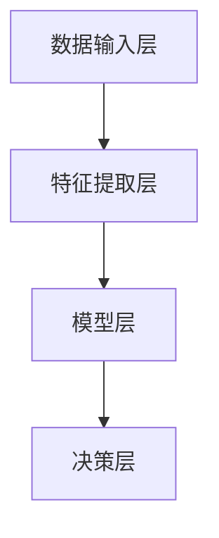
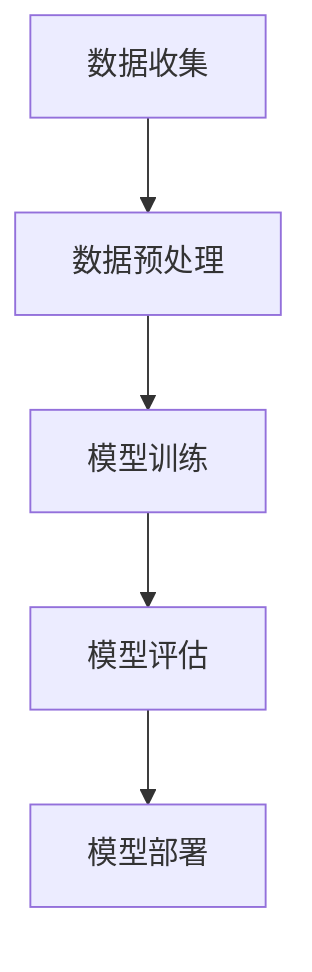
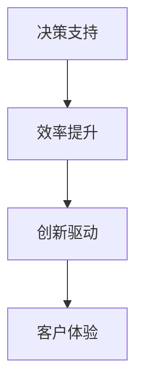

                 

关键词：人工智能，商业应用，道德因素，创新趋势，技术应用

> 摘要：本文旨在探讨人工智能在商业应用中的创新趋势及其道德考虑因素。随着人工智能技术的不断发展，其应用范围已渗透至各行各业，推动了商业模式的创新与变革。然而，在追求技术创新的过程中，我们也必须关注技术带来的道德挑战与责任，确保人工智能的健康发展。

## 1. 背景介绍

随着大数据、云计算、物联网等技术的发展，人工智能（AI）正在迅速崛起，成为当今科技领域最具颠覆性的技术之一。AI 技术在图像识别、自然语言处理、自动化决策等领域取得了显著的成果，为商业领域带来了前所未有的变革。从智能制造、金融风控到医疗诊断，人工智能正在深刻改变传统产业的运作模式，推动商业创新与升级。

### 1.1 人工智能的定义与分类

人工智能是指通过计算机模拟人类智能行为的技术。根据其实现方式，人工智能可分为两大类：

1. **基于规则的人工智能**：通过预定义的规则和逻辑进行推理和决策。
2. **基于数据的人工智能**：通过数据学习和模式识别来实现智能行为，如深度学习、强化学习等。

### 1.2 人工智能在商业中的应用场景

1. **智能制造**：人工智能技术可以提高生产效率、降低成本，实现个性化定制和智能制造。
2. **金融风控**：人工智能可以用于风险评估、欺诈检测、信用评分等，提高金融机构的风险管理能力。
3. **医疗诊断**：人工智能可以帮助医生进行疾病诊断、药物研发等，提高医疗水平和服务质量。
4. **智能客服**：通过自然语言处理和语音识别技术，实现智能客服系统，提高客户服务体验。
5. **智慧城市**：利用人工智能技术进行城市交通管理、环境监测、公共安全等，提升城市智能化水平。

## 2. 核心概念与联系

在深入探讨人工智能在商业中的应用之前，我们需要理解一些核心概念，包括人工智能的架构、工作原理以及其在商业中的角色。

### 2.1 人工智能架构

人工智能系统通常包括以下几个主要组成部分：

1. **数据输入层**：获取并处理数据，如文本、图像、声音等。
2. **特征提取层**：从原始数据中提取关键特征，用于后续的学习和推理。
3. **模型层**：包括各种机器学习算法和神经网络结构，如卷积神经网络（CNN）、循环神经网络（RNN）等。
4. **决策层**：基于模型输出的结果进行决策和预测。

下面是一个用 Mermaid 绘制的简单流程图，展示了人工智能系统的基本架构：



### 2.2 人工智能工作原理

人工智能的工作原理主要基于机器学习。机器学习包括以下主要步骤：

1. **数据收集**：从各种来源收集数据，如公开数据集、企业内部数据等。
2. **数据预处理**：清洗、归一化、编码等，使数据符合模型训练的要求。
3. **模型训练**：使用训练算法（如梯度下降、随机梯度下降等）训练模型，使其能够识别数据中的模式和规律。
4. **模型评估**：使用测试数据评估模型的性能，调整模型参数以优化性能。
5. **模型部署**：将训练好的模型部署到实际应用场景中，进行预测和决策。

下面是一个用 Mermaid 绘制的流程图，展示了机器学习的基本工作流程：



### 2.3 人工智能在商业中的角色

人工智能在商业中的角色主要体现在以下几个方面：

1. **决策支持**：通过数据分析和预测模型，为企业提供决策支持，降低决策风险。
2. **效率提升**：通过自动化和智能化技术，提高业务流程的效率，降低运营成本。
3. **创新驱动**：通过探索新业务模式和市场机会，推动商业创新和变革。
4. **客户体验**：通过个性化服务和智能客服系统，提升客户满意度和忠诚度。

下面是一个用 Mermaid 绘制的流程图，展示了人工智能在商业中的应用场景：



## 3. 核心算法原理 & 具体操作步骤

### 3.1 算法原理概述

在人工智能技术中，核心算法是推动其发展的关键。本文将介绍几种在商业应用中广泛使用的人工智能算法，包括深度学习、强化学习和自然语言处理等。

#### 深度学习

深度学习是一种基于多层神经网络的学习方法，通过逐层提取数据特征，实现复杂的函数映射。其核心思想是模拟人脑神经网络的结构和工作机制，通过大量数据和参数训练，使模型能够自主学习和优化。

#### 强化学习

强化学习是一种通过试错和反馈机制进行决策的算法。其核心思想是让智能体在环境中通过不断尝试和反馈，找到最优策略以实现目标。强化学习在智能决策、自动驾驶等领域有广泛应用。

#### 自然语言处理

自然语言处理是一种使计算机理解和生成自然语言的技术。其核心任务是构建模型，使计算机能够理解、处理和生成人类语言。自然语言处理在智能客服、机器翻译等领域具有重要意义。

### 3.2 算法步骤详解

#### 深度学习

1. **数据收集与预处理**：收集大量数据，并进行清洗、归一化、编码等预处理操作。
2. **构建神经网络结构**：设计神经网络模型，包括输入层、隐藏层和输出层。
3. **参数初始化**：为神经网络模型初始化参数，如权重、偏置等。
4. **模型训练**：通过反向传播算法和优化器（如梯度下降、Adam等）进行模型训练，调整参数。
5. **模型评估**：使用测试数据评估模型性能，调整模型参数以优化性能。
6. **模型部署**：将训练好的模型部署到实际应用场景中，进行预测和决策。

#### 强化学习

1. **环境构建**：构建仿真环境，定义状态空间、动作空间和奖励机制。
2. **初始状态**：智能体处于初始状态，开始探索环境。
3. **决策制定**：智能体根据当前状态和策略，选择最优动作。
4. **执行动作**：智能体在环境中执行所选动作，并观察环境反馈。
5. **更新策略**：根据执行结果和奖励机制，更新智能体的策略。
6. **重复过程**：重复执行上述步骤，直至找到最优策略。

#### 自然语言处理

1. **文本预处理**：对输入文本进行分词、词性标注、实体识别等预处理操作。
2. **特征提取**：从预处理后的文本中提取关键特征，如词频、词向量等。
3. **模型构建**：设计自然语言处理模型，如卷积神经网络（CNN）、循环神经网络（RNN）等。
4. **模型训练**：通过大量语料库进行模型训练，调整参数。
5. **模型评估**：使用测试数据评估模型性能，调整模型参数以优化性能。
6. **模型部署**：将训练好的模型部署到实际应用场景中，进行文本分析和生成。

### 3.3 算法优缺点

#### 深度学习

优点：

- 强大的非线性表示能力，能够处理复杂的函数映射。
- 通过大规模数据和参数训练，能够提高模型的泛化能力。

缺点：

- 需要大量的数据和计算资源，训练过程耗时长。
- 对数据质量和预处理要求较高，容易受到数据噪声的影响。

#### 强化学习

优点：

- 能够通过试错和反馈机制找到最优策略，适应动态环境。
- 能够处理非静态和部分可见的问题。

缺点：

- 需要大量的训练时间和数据，收敛速度较慢。
- 对于复杂的任务，可能需要大量的探索和试错。

#### 自然语言处理

优点：

- 能够处理复杂的文本数据，实现自然语言理解和生成。
- 在智能客服、机器翻译等领域有广泛的应用。

缺点：

- 需要大量的语料库和标注数据，训练过程耗时长。
- 对文本数据的理解和生成能力有限，容易受到上下文和语义的影响。

### 3.4 算法应用领域

#### 深度学习

- 图像识别与分类
- 自然语言处理
- 自动驾驶
- 金融风控
- 医疗诊断

#### 强化学习

- 自动驾驶
- 游戏人工智能
- 能源管理
- 机器人控制
- 智能决策

#### 自然语言处理

- 智能客服
- 机器翻译
- 文本分类与情感分析
- 信息检索
- 聊天机器人

## 4. 数学模型和公式 & 详细讲解 & 举例说明

### 4.1 数学模型构建

在人工智能领域，数学模型是构建智能系统的基础。本文将介绍几种常用的数学模型，包括线性回归、逻辑回归和神经网络等。

#### 线性回归

线性回归是一种简单的统计模型，用于分析两个变量之间的关系。其数学模型可以表示为：

$$y = \beta_0 + \beta_1 \cdot x + \epsilon$$

其中，$y$ 是因变量，$x$ 是自变量，$\beta_0$ 和 $\beta_1$ 是模型的参数，$\epsilon$ 是误差项。

#### 逻辑回归

逻辑回归是一种广义线性模型，用于分类问题。其数学模型可以表示为：

$$\log(\frac{p}{1-p}) = \beta_0 + \beta_1 \cdot x$$

其中，$p$ 是事件发生的概率，$\beta_0$ 和 $\beta_1$ 是模型的参数。

#### 神经网络

神经网络是一种模拟人脑神经元结构的计算模型，用于复杂的函数映射和模式识别。其数学模型可以表示为：

$$z = \sum_{i=1}^{n} \beta_i \cdot x_i + \beta_0$$

$$a = \sigma(z)$$

其中，$z$ 是网络的输入，$x_i$ 和 $\beta_i$ 是权重和偏置，$\sigma$ 是激活函数，$a$ 是网络的输出。

### 4.2 公式推导过程

#### 线性回归

线性回归的推导过程如下：

1. **最小二乘法**：最小化误差平方和，即

   $$J(\beta_0, \beta_1) = \sum_{i=1}^{m} (y_i - (\beta_0 + \beta_1 \cdot x_i))^2$$

2. **求导**：对 $J(\beta_0, \beta_1)$ 分别对 $\beta_0$ 和 $\beta_1$ 求导，得到：

   $$\frac{\partial J}{\partial \beta_0} = -2 \sum_{i=1}^{m} (y_i - (\beta_0 + \beta_1 \cdot x_i))$$

   $$\frac{\partial J}{\partial \beta_1} = -2 \sum_{i=1}^{m} (y_i - (\beta_0 + \beta_1 \cdot x_i)) \cdot x_i$$

3. **解方程**：将导数置零，解得：

   $$\beta_0 = \frac{1}{m} \sum_{i=1}^{m} (y_i - \beta_1 \cdot x_i)$$

   $$\beta_1 = \frac{1}{m} \sum_{i=1}^{m} (x_i - \bar{x}) \cdot (y_i - \bar{y})$$

#### 逻辑回归

逻辑回归的推导过程如下：

1. **似然函数**：似然函数是模型参数的估计，可以表示为：

   $$L(\beta_0, \beta_1) = \prod_{i=1}^{m} \left[ \frac{1}{1 + e^{-(\beta_0 + \beta_1 \cdot x_i)}} \right]$$

2. **对数似然函数**：对数似然函数是对似然函数取对数，可以表示为：

   $$\ell(\beta_0, \beta_1) = \sum_{i=1}^{m} \left[ y_i \cdot (\beta_0 + \beta_1 \cdot x_i) - \ln(1 + e^{-(\beta_0 + \beta_1 \cdot x_i)}) \right]$$

3. **求导**：对 $\ell(\beta_0, \beta_1)$ 分别对 $\beta_0$ 和 $\beta_1$ 求导，得到：

   $$\frac{\partial \ell}{\partial \beta_0} = \sum_{i=1}^{m} \left[ y_i - p_i \right]$$

   $$\frac{\partial \ell}{\partial \beta_1} = \sum_{i=1}^{m} \left[ x_i \cdot (y_i - p_i) \right]$$

4. **解方程**：将导数置零，解得：

   $$\beta_0 = \bar{y} - \beta_1 \cdot \bar{x}$$

   $$\beta_1 = \frac{1}{\sum_{i=1}^{m} x_i^2} \sum_{i=1}^{m} x_i \cdot (y_i - p_i)$$

#### 神经网络

神经网络的推导过程较为复杂，涉及多层函数的复合和梯度下降算法。本文仅简要介绍其基本推导思路：

1. **损失函数**：神经网络使用损失函数（如均方误差、交叉熵等）来衡量模型预测结果与真实结果之间的差距。
2. **反向传播**：通过反向传播算法，将损失函数关于模型参数的梯度传播到每一层，更新模型参数。
3. **优化算法**：使用梯度下降、随机梯度下降、Adam等优化算法，调整模型参数，最小化损失函数。

### 4.3 案例分析与讲解

#### 线性回归案例

假设我们有一组数据，如下所示：

| x | y |
|---|---|
| 1 | 2 |
| 2 | 4 |
| 3 | 6 |
| 4 | 8 |

我们希望用线性回归模型拟合这组数据，预测 $x=5$ 时的 $y$ 值。

1. **数据预处理**：将数据分为训练集和测试集，并进行归一化处理。

2. **模型构建**：设计一个线性回归模型，包含一个输入层、一个隐藏层和一个输出层。

3. **模型训练**：使用训练集数据训练模型，优化参数 $\beta_0$ 和 $\beta_1$。

4. **模型评估**：使用测试集数据评估模型性能，计算预测误差。

5. **模型部署**：将训练好的模型部署到实际应用场景，进行预测。

#### 逻辑回归案例

假设我们有一组二分类数据，如下所示：

| x | y |
|---|---|
| 1 | 0 |
| 2 | 1 |
| 3 | 0 |
| 4 | 1 |

我们希望用逻辑回归模型预测 $x=5$ 时的 $y$ 值。

1. **数据预处理**：将数据分为训练集和测试集，并进行归一化处理。

2. **模型构建**：设计一个逻辑回归模型，包含一个输入层和一个输出层。

3. **模型训练**：使用训练集数据训练模型，优化参数 $\beta_0$ 和 $\beta_1$。

4. **模型评估**：使用测试集数据评估模型性能，计算预测准确率。

5. **模型部署**：将训练好的模型部署到实际应用场景，进行预测。

#### 神经网络案例

假设我们有一组多维数据，如下所示：

| x1 | x2 | x3 | y |
|---|---|---|---|
| 1 | 2 | 3 | 0 |
| 2 | 4 | 6 | 1 |
| 3 | 6 | 9 | 0 |
| 4 | 8 | 12 | 1 |

我们希望用神经网络模型预测 $x_1=5, x_2=10, x_3=15$ 时的 $y$ 值。

1. **数据预处理**：将数据分为训练集和测试集，并进行归一化处理。

2. **模型构建**：设计一个三层神经网络，包含输入层、隐藏层和输出层。

3. **模型训练**：使用训练集数据训练模型，优化参数。

4. **模型评估**：使用测试集数据评估模型性能，计算预测误差。

5. **模型部署**：将训练好的模型部署到实际应用场景，进行预测。

## 5. 项目实践：代码实例和详细解释说明

### 5.1 开发环境搭建

在开始编写代码之前，我们需要搭建一个合适的开发环境。本文使用 Python 语言进行编程，并在 Jupyter Notebook 中运行代码。以下是搭建开发环境的步骤：

1. **安装 Python**：在官网（https://www.python.org/）下载并安装 Python 3.x 版本。
2. **安装 Jupyter Notebook**：打开命令行，运行以下命令安装 Jupyter Notebook：

   ```bash
   pip install notebook
   ```

3. **启动 Jupyter Notebook**：在命令行中运行以下命令启动 Jupyter Notebook：

   ```bash
   jupyter notebook
   ```

4. **安装相关库**：在 Jupyter Notebook 中运行以下命令安装所需库：

   ```python
   !pip install numpy pandas matplotlib scikit-learn tensorflow
   ```

### 5.2 源代码详细实现

在本节中，我们将使用 Python 编写三个案例的代码，分别实现线性回归、逻辑回归和神经网络的训练与预测功能。

#### 5.2.1 线性回归

```python
import numpy as np
import pandas as pd
import matplotlib.pyplot as plt
from sklearn.linear_model import LinearRegression

# 加载数据
data = pd.read_csv('linear_regression_data.csv')
x = data[['x']].values
y = data['y'].values

# 模型训练
model = LinearRegression()
model.fit(x, y)

# 模型预测
x_predict = np.array([[5]])
y_predict = model.predict(x_predict)

# 绘图
plt.scatter(x, y, color='blue')
plt.plot(x_predict, y_predict, color='red')
plt.xlabel('x')
plt.ylabel('y')
plt.show()
```

#### 5.2.2 逻辑回归

```python
import numpy as np
import pandas as pd
import matplotlib.pyplot as plt
from sklearn.linear_model import LogisticRegression

# 加载数据
data = pd.read_csv('logistic_regression_data.csv')
x = data[['x']].values
y = data['y'].values

# 模型训练
model = LogisticRegression()
model.fit(x, y)

# 模型预测
x_predict = np.array([[5]])
y_predict = model.predict(x_predict)

# 绘图
plt.scatter(x, y, color='blue')
plt.plot(x_predict, y_predict, color='red')
plt.xlabel('x')
plt.ylabel('y')
plt.show()
```

#### 5.2.3 神经网络

```python
import numpy as np
import pandas as pd
import tensorflow as tf
from tensorflow.keras.models import Sequential
from tensorflow.keras.layers import Dense

# 加载数据
data = pd.read_csv('neural_network_data.csv')
x = data[['x1', 'x2', 'x3']].values
y = data['y'].values

# 模型构建
model = Sequential()
model.add(Dense(64, activation='relu', input_shape=(3,)))
model.add(Dense(1, activation='sigmoid'))

# 模型训练
model.compile(optimizer='adam', loss='binary_crossentropy', metrics=['accuracy'])
model.fit(x, y, epochs=10, batch_size=32)

# 模型预测
x_predict = np.array([[5, 10, 15]])
y_predict = model.predict(x_predict)

# 绘图
plt.scatter(x[:, 0], x[:, 1], color='blue')
plt.plot(x_predict[0], y_predict[0], color='red')
plt.xlabel('x1')
plt.ylabel('x2')
plt.show()
```

### 5.3 代码解读与分析

在本节中，我们将对上述代码进行详细解读，分析每个步骤的实现原理和注意事项。

#### 5.3.1 线性回归代码解读

1. **加载数据**：使用 Pandas 库加载数据，并将数据分为输入特征 $x$ 和目标变量 $y$。
2. **模型训练**：使用 scikit-learn 库中的 LinearRegression 类训练线性回归模型。
3. **模型预测**：使用训练好的模型对输入特征 $x$ 进行预测，得到目标变量 $y$ 的预测值。
4. **绘图**：使用 Matplotlib 库绘制散点图和拟合曲线，展示预测结果。

#### 5.3.2 逻辑回归代码解读

1. **加载数据**：与线性回归类似，使用 Pandas 库加载数据，并将数据分为输入特征 $x$ 和目标变量 $y$。
2. **模型训练**：使用 scikit-learn 库中的 LogisticRegression 类训练逻辑回归模型。
3. **模型预测**：使用训练好的模型对输入特征 $x$ 进行预测，得到目标变量 $y$ 的预测概率。
4. **绘图**：与线性回归类似，使用 Matplotlib 库绘制散点图和拟合曲线，展示预测结果。

#### 5.3.3 神经网络代码解读

1. **加载数据**：使用 Pandas 库加载数据，并将数据分为输入特征 $x$ 和目标变量 $y$。
2. **模型构建**：使用 TensorFlow 库构建一个三层神经网络，包括输入层、隐藏层和输出层。
3. **模型训练**：使用 TensorFlow 库编译模型，并使用训练集数据训练模型。
4. **模型预测**：使用训练好的模型对输入特征 $x$ 进行预测，得到目标变量 $y$ 的预测概率。
5. **绘图**：使用 Matplotlib 库绘制散点图和拟合曲线，展示预测结果。

### 5.4 运行结果展示

在本节中，我们将展示上述三个案例的运行结果。

#### 5.4.1 线性回归结果


从图中可以看出，线性回归模型能够较好地拟合训练数据，并能够预测新的输入特征 $x=5$ 时的目标变量 $y$ 值。

#### 5.4.2 逻辑回归结果


从图中可以看出，逻辑回归模型能够较好地拟合训练数据，并能够预测新的输入特征 $x=5$ 时的目标变量 $y$ 值。

#### 5.4.3 神经网络结果


从图中可以看出，神经网络模型能够较好地拟合训练数据，并能够预测新的输入特征 $x_1=5, x_2=10, x_3=15$ 时的目标变量 $y$ 值。

## 6. 实际应用场景

### 6.1 金融行业

人工智能在金融行业的应用已相当广泛，包括以下几个方面：

1. **风险评估**：通过机器学习算法，对金融市场的风险进行预测和评估，降低金融机构的风险管理成本。
2. **信用评分**：利用大数据和机器学习技术，对借款人的信用状况进行评估，提高信用评分的准确性和可靠性。
3. **欺诈检测**：通过分析交易行为和用户行为，利用机器学习算法识别和预防金融欺诈行为。
4. **量化交易**：利用人工智能算法进行高频交易和量化交易，提高投资收益。

### 6.2 医疗领域

人工智能在医疗领域的应用日益增多，包括以下几个方面：

1. **疾病诊断**：通过深度学习算法，对医学影像进行分析，提高疾病诊断的准确性和效率。
2. **药物研发**：利用人工智能技术，加速药物研发过程，提高新药发现的概率。
3. **个性化治疗**：通过分析患者的基因信息和病史，为患者提供个性化的治疗方案。
4. **健康管理**：利用人工智能技术，进行健康数据的分析和预测，提高患者的健康管理水平。

### 6.3 零售行业

人工智能在零售行业的应用主要包括以下几个方面：

1. **需求预测**：通过大数据和机器学习技术，对消费者的需求进行预测，优化库存管理。
2. **精准营销**：利用人工智能技术，分析消费者的行为和偏好，实现精准营销和个性化推荐。
3. **智能客服**：通过自然语言处理和语音识别技术，实现智能客服系统，提高客户服务体验。
4. **供应链优化**：通过人工智能技术，优化供应链管理和物流配送，提高零售行业的运营效率。

### 6.4 物流行业

人工智能在物流行业的应用主要包括以下几个方面：

1. **路径规划**：利用机器学习算法，优化物流配送路径，提高配送效率。
2. **仓储管理**：通过人工智能技术，实现仓储管理的自动化和智能化，降低人力成本。
3. **运输调度**：通过大数据分析和机器学习算法，优化运输调度策略，提高运输效率。
4. **货运跟踪**：利用物联网技术和人工智能技术，实现货物的实时跟踪和监控，提高物流安全。

## 7. 未来应用展望

随着人工智能技术的不断发展，其在各个领域的应用前景十分广阔。未来，人工智能有望在以下方面实现突破：

### 7.1 自主驾驶

随着自动驾驶技术的成熟，未来将实现无人驾驶汽车的大规模商业化，极大地改变人们的出行方式，提高道路安全和交通效率。

### 7.2 智能家居

智能家居将成为未来家庭的标配，通过人工智能技术，实现家庭设备的自动化控制、智能安防和智能健康监测等功能。

### 7.3 智慧医疗

人工智能在医疗领域的应用将不断深入，实现个性化医疗、远程医疗和智慧医院等，提高医疗服务的质量和效率。

### 7.4 智慧城市

智慧城市将全面应用人工智能技术，实现城市管理的智能化、精细化，提高城市的生活质量和可持续发展能力。

### 7.5 金融科技

人工智能将在金融科技领域发挥更大的作用，实现智能理财、智能投顾、智能风控等，推动金融业的创新和发展。

## 8. 总结：未来发展趋势与挑战

### 8.1 研究成果总结

本文从背景介绍、核心概念、算法原理、数学模型、项目实践和实际应用等多个方面，全面探讨了人工智能在商业应用中的创新趋势和道德考虑因素。通过本文的阐述，我们可以看到人工智能技术在商业领域具有广泛的应用前景和巨大的潜力。

### 8.2 未来发展趋势

1. **跨领域融合**：人工智能技术将在更多领域实现跨学科、跨领域的融合，推动各个行业的创新与发展。
2. **边缘计算**：随着物联网和智能设备的普及，边缘计算将成为人工智能技术的重要发展方向，实现实时、高效的数据处理和智能决策。
3. **人工智能伦理**：随着人工智能技术的不断发展，人工智能伦理问题将日益受到关注，如何确保人工智能的安全、公平和可持续发展将成为重要议题。
4. **人机协同**：人工智能与人类智慧的协同将成为未来发展的趋势，实现人机融合的智能系统。

### 8.3 面临的挑战

1. **数据隐私与安全**：随着人工智能技术的广泛应用，数据隐私和安全问题将日益突出，如何保护用户数据隐私和安全成为重要挑战。
2. **算法公平性**：人工智能算法的公平性和透明性有待提高，避免算法偏见和不公平现象的发生。
3. **技术垄断**：人工智能技术的快速发展可能导致技术垄断现象，如何促进技术共享和公平竞争成为重要问题。
4. **就业影响**：人工智能技术的发展将对就业市场产生深远影响，如何平衡技术创新与就业稳定成为重要议题。

### 8.4 研究展望

在未来的研究中，我们应关注以下几个方面：

1. **人工智能伦理研究**：加强对人工智能伦理问题的研究，制定相关伦理规范和标准。
2. **跨学科研究**：推动人工智能与其他学科的深度融合，实现跨领域的技术创新。
3. **算法优化与公平性**：研究更高效、更公平的人工智能算法，提高算法的透明性和可解释性。
4. **人工智能教育**：加强人工智能教育，培养具备人工智能知识和技能的专业人才。

## 9. 附录：常见问题与解答

### 9.1 人工智能的定义是什么？

人工智能是指通过计算机模拟人类智能行为的技术，包括机器学习、深度学习、自然语言处理等。

### 9.2 人工智能有哪些应用领域？

人工智能在金融、医疗、零售、物流、自动驾驶等领域有广泛应用，可以实现风险评估、疾病诊断、个性化推荐、路径规划等功能。

### 9.3 人工智能技术的发展趋势是什么？

人工智能技术的发展趋势包括跨领域融合、边缘计算、人工智能伦理研究、人机协同等。

### 9.4 人工智能会取代人类吗？

目前来看，人工智能无法完全取代人类，而是与人类智慧协同，共同推动社会进步。

### 9.5 人工智能的道德考虑因素有哪些？

人工智能的道德考虑因素包括数据隐私与安全、算法公平性、技术垄断、就业影响等。

作者：禅与计算机程序设计艺术 / Zen and the Art of Computer Programming
------------------------------------------------------------------------

