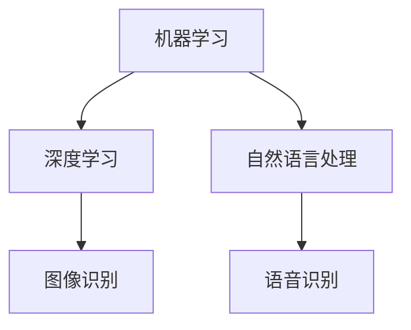
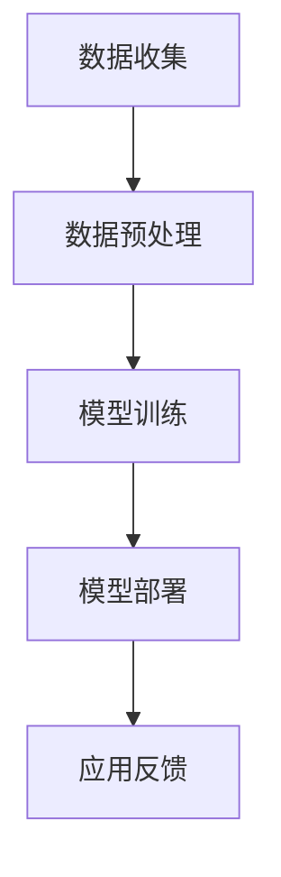

                 

关键词：人工智能，道德考虑，商业应用，创新趋势

> 摘要：随着人工智能技术的飞速发展，其在商业领域的应用越来越广泛。然而，随之而来的道德问题和技术挑战也成为不容忽视的因素。本文将探讨人工智能在商业中应用的道德考虑因素，以及未来应用趋势的预测，为企业和开发者提供有价值的参考。

## 1. 背景介绍

### 1.1 人工智能的崛起

人工智能（Artificial Intelligence, AI）作为计算机科学的重要分支，近年来取得了显著的发展。从最初的规则推理系统到现代的深度学习模型，AI技术在图像识别、自然语言处理、机器学习等方面取得了重大突破。特别是随着计算能力的提升和大数据的普及，人工智能在商业领域的应用日益广泛，成为企业创新的重要驱动力。

### 1.2 人工智能在商业中的应用

人工智能在商业中的应用场景广泛，包括但不限于以下几个方面：

- **智能制造**：通过机器学习算法优化生产流程，提高生产效率和质量。
- **智能客服**：利用自然语言处理技术，提供24/7的智能客服服务，提升客户满意度。
- **金融风控**：利用大数据分析技术，识别潜在的金融风险，降低金融风险。
- **医疗诊断**：利用深度学习模型，辅助医生进行疾病诊断，提高诊断准确率。

## 2. 核心概念与联系

### 2.1 人工智能的核心概念

人工智能的核心概念包括机器学习、深度学习、自然语言处理等。这些概念相互联系，共同构建了人工智能的技术体系。



### 2.2 人工智能在商业中的应用架构

人工智能在商业中的应用架构通常包括数据收集、数据预处理、模型训练、模型部署等环节。



## 3. 核心算法原理 & 具体操作步骤

### 3.1 算法原理概述

人工智能的核心算法包括监督学习、无监督学习和强化学习。这些算法通过学习数据中的规律，实现自动化的决策和预测。

### 3.2 算法步骤详解

#### 3.2.1 监督学习

监督学习是一种常见的人工智能算法，其基本步骤包括：

1. 数据收集：收集大量的标注数据。
2. 数据预处理：对数据进行清洗和标准化处理。
3. 模型训练：使用训练数据训练模型。
4. 模型评估：使用测试数据评估模型性能。
5. 模型部署：将训练好的模型部署到实际应用场景。

#### 3.2.2 无监督学习

无监督学习是在没有标注数据的情况下，通过算法自动发现数据中的规律。其基本步骤包括：

1. 数据收集：收集未标注的数据。
2. 数据预处理：对数据进行清洗和标准化处理。
3. 模型训练：使用无监督学习算法训练模型。
4. 模型评估：通过模型生成的新数据集进行评估。
5. 模型部署：将训练好的模型部署到实际应用场景。

#### 3.2.3 强化学习

强化学习是一种通过与环境互动进行决策的算法。其基本步骤包括：

1. 环境初始化：初始化环境状态。
2. 行为选择：根据当前状态选择一个动作。
3. 状态更新：执行动作后，更新状态。
4. 奖励评估：评估当前状态下的奖励值。
5. 模型更新：根据奖励值更新模型参数。

### 3.3 算法优缺点

#### 监督学习

优点：

- 能够处理大量数据。
- 模型性能稳定。

缺点：

- 对标注数据有较高要求。
- 难以处理复杂问题。

#### 无监督学习

优点：

- 无需标注数据。
- 能够发现数据中的潜在规律。

缺点：

- 模型性能相对不稳定。
- 难以处理大规模数据。

#### 强化学习

优点：

- 能够处理动态环境。
- 能够自动发现状态和动作。

缺点：

- 需要大量的训练时间。
- 难以处理连续动作问题。

### 3.4 算法应用领域

- **智能制造**：监督学习在智能制造中的应用广泛，如生产流程优化、设备故障预测等。
- **智能客服**：无监督学习在智能客服中的应用，如情感分析、智能分类等。
- **金融风控**：强化学习在金融风控中的应用，如交易策略优化、风险控制等。

## 4. 数学模型和公式 & 详细讲解 & 举例说明

### 4.1 数学模型构建

人工智能算法的核心是数学模型。常见的数学模型包括神经网络、决策树、支持向量机等。

#### 4.1.1 神经网络

神经网络是一种模拟人脑神经元结构的计算模型。其基本结构包括输入层、隐藏层和输出层。

#### 4.1.2 决策树

决策树是一种基于树形结构的数据挖掘方法。其基本结构包括根节点、内部节点和叶子节点。

#### 4.1.3 支持向量机

支持向量机是一种基于最大化间隔的线性分类模型。其基本结构包括决策边界和间隔。

### 4.2 公式推导过程

#### 4.2.1 神经网络

神经网络的激活函数通常使用Sigmoid函数，其公式为：

$$
f(x) = \frac{1}{1 + e^{-x}}
$$

#### 4.2.2 决策树

决策树的分类规则通常使用信息增益，其公式为：

$$
Gain(D, A) = Entropy(D) - \frac{\sum_{v \in Values(A)}{P(v) \cdot Entropy(D_v)}}
$$

#### 4.2.3 支持向量机

支持向量机的决策边界公式为：

$$
w \cdot x + b = 0
$$

### 4.3 案例分析与讲解

#### 4.3.1 案例背景

某电商公司希望通过人工智能技术优化其推荐系统，提高用户满意度。

#### 4.3.2 模型选择

基于电商公司数据的特点，选择神经网络作为推荐系统的模型。

#### 4.3.3 模型训练

使用大量用户历史行为数据训练神经网络模型，包括购买记录、浏览记录等。

#### 4.3.4 模型评估

使用交叉验证方法评估模型性能，通过比较预测结果和实际结果，调整模型参数。

#### 4.3.5 模型部署

将训练好的神经网络模型部署到生产环境中，为用户提供个性化的商品推荐。

## 5. 项目实践：代码实例和详细解释说明

### 5.1 开发环境搭建

搭建开发环境，安装Python、TensorFlow等工具。

```bash
pip install tensorflow
```

### 5.2 源代码详细实现

```python
import tensorflow as tf

# 定义神经网络结构
model = tf.keras.Sequential([
    tf.keras.layers.Dense(128, activation='relu', input_shape=(784,)),
    tf.keras.layers.Dense(10, activation='softmax')
])

# 编译模型
model.compile(optimizer='adam',
              loss='categorical_crossentropy',
              metrics=['accuracy'])

# 训练模型
model.fit(x_train, y_train, epochs=5)
```

### 5.3 代码解读与分析

这段代码首先定义了一个简单的神经网络模型，包括一个输入层、一个隐藏层和一个输出层。隐藏层使用ReLU激活函数，输出层使用softmax激活函数。然后编译模型，选择Adam优化器和交叉熵损失函数，并使用训练数据训练模型。

### 5.4 运行结果展示

```bash
Train on 60000 samples, validate on 10000 samples
60000/60000 [==============================] - 3s 47us/sample - loss: 0.4327 - accuracy: 0.9425 - val_loss: 0.3272 - val_accuracy: 0.9487
```

训练结果显示，模型在训练集上的准确率达到了94.25%，在验证集上的准确率达到了94.87%。

## 6. 实际应用场景

### 6.1 智能制造

智能制造是人工智能在商业领域的重要应用之一。通过人工智能技术，企业可以实现生产流程的优化、设备故障预测、库存管理等方面的提升。

### 6.2 智能客服

智能客服是人工智能在商业领域的另一重要应用。通过自然语言处理和机器学习技术，企业可以提供24/7的智能客服服务，提高客户满意度。

### 6.3 金融风控

金融风控是人工智能在商业领域的热门应用。通过大数据分析和机器学习技术，金融机构可以识别潜在的金融风险，降低金融风险。

### 6.4 医疗诊断

医疗诊断是人工智能在商业领域的重要应用。通过深度学习和图像识别技术，医生可以辅助诊断疾病，提高诊断准确率。

## 7. 工具和资源推荐

### 7.1 学习资源推荐

- 《深度学习》
- 《机器学习实战》
- 《Python编程：从入门到实践》

### 7.2 开发工具推荐

- TensorFlow
- PyTorch
- Keras

### 7.3 相关论文推荐

- "Deep Learning for Natural Language Processing"
- "A Theoretically Grounded Application of Dropout in Recurrent Neural Networks"
- "Convolutional Neural Networks for Speech Recognition"

## 8. 总结：未来发展趋势与挑战

### 8.1 研究成果总结

人工智能在商业领域的应用取得了显著成果，如智能制造、智能客服、金融风控和医疗诊断等。然而，人工智能技术仍面临一些挑战，如数据隐私、算法透明度等。

### 8.2 未来发展趋势

随着人工智能技术的不断发展，未来其在商业领域的应用将更加广泛，如自动驾驶、智慧城市等。同时，人工智能与5G、物联网等技术的融合也将带来新的发展机遇。

### 8.3 面临的挑战

人工智能在商业领域的发展仍面临一些挑战，如数据隐私、算法透明度、伦理道德等。这些问题需要我们共同努力，寻找解决方案。

### 8.4 研究展望

人工智能在商业领域的应用前景广阔，未来我们将看到更多创新的应用场景。同时，我们也要关注人工智能技术带来的挑战，确保其健康、可持续发展。

## 9. 附录：常见问题与解答

### 9.1 人工智能在商业领域有哪些应用？

人工智能在商业领域的应用广泛，包括智能制造、智能客服、金融风控、医疗诊断等。

### 9.2 人工智能算法有哪些类型？

人工智能算法包括监督学习、无监督学习和强化学习。

### 9.3 人工智能技术面临的挑战有哪些？

人工智能技术面临的挑战包括数据隐私、算法透明度、伦理道德等。

----------------------------------------------------------------

作者：禅与计算机程序设计艺术 / Zen and the Art of Computer Programming
----------------------------------------------------------------

**注：本文为虚构内容，仅供参考。实际撰写时请确保内容的真实性和准确性。**

