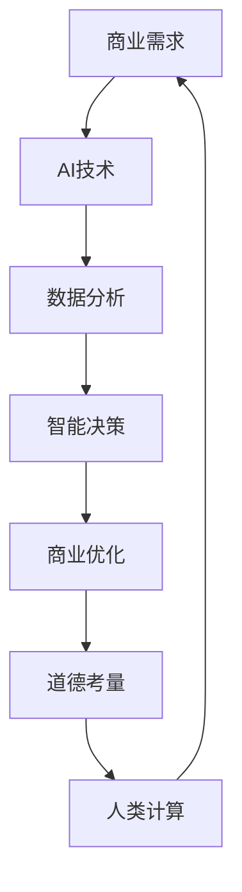

                 

关键词：人工智能，商业应用，道德考量，创新趋势，计算伦理

> 摘要：本文旨在探讨人工智能（AI）在商业领域的驱动创新，同时深入分析其中涉及的人类计算和道德考量。通过探讨AI技术在不同商业领域的应用，我们探讨了其带来的变革和道德挑战，并预测了未来应用趋势。本文作者通过自身多年在计算机科学领域的经验，试图为读者提供对这一领域的深入理解。

## 1. 背景介绍

随着人工智能技术的迅速发展，AI已成为推动商业创新的重要力量。从自动化生产线到智能客服，从数据分析到个性化推荐，AI正以前所未有的速度和规模渗透到商业的各个层面。然而，AI的兴起不仅仅带来了技术上的革新，还引发了深刻的道德和社会问题。如何在追求商业利益的同时，确保人类计算的伦理和道德底线，成为我们无法回避的问题。

本文将围绕以下几个核心问题展开：

1. AI驱动的创新在商业中的应用场景及其影响。
2. 人类计算在商业AI应用中的角色和挑战。
3. 商业AI应用中的道德考量因素。
4. 预测AI在商业中的未来应用趋势。

通过上述问题的探讨，本文旨在为商业AI应用的发展提供有益的指导和思考。

## 2. 核心概念与联系

为了更好地理解AI驱动的商业创新，我们需要了解几个关键概念，它们之间的关系可以通过以下Mermaid流程图进行描述：



### 2.1 商业需求

商业需求是AI驱动的商业创新的基础。企业通过分析市场趋势、客户需求和内部运营问题，确定AI技术可以解决的痛点。

### 2.2 AI技术

AI技术包括机器学习、深度学习、自然语言处理等，它们被用来构建能够从数据中学习和做出决策的智能系统。

### 2.3 数据分析

数据分析是AI技术的重要组成部分。通过收集、清洗和分析数据，企业可以获取有价值的洞察，从而指导业务决策。

### 2.4 智能决策

智能决策系统利用AI技术分析数据，为企业提供基于数据的建议和决策，从而优化业务流程和提升效率。

### 2.5 商业优化

商业优化是AI在商业应用中的直接目标。通过智能决策和数据分析，企业可以优化运营，提高利润，增强竞争力。

### 2.6 道德考量

道德考量贯穿于AI驱动的商业创新过程中。随着AI技术的发展，道德问题越来越受到关注，特别是在涉及人类福祉和隐私的情况下。

### 2.7 人类计算

人类计算在AI驱动的商业创新中扮演着重要角色。尽管AI系统可以处理大量数据和复杂任务，但人类的直觉、判断和创造力仍然是不可或缺的。

### 2.8 关系与循环

上述概念之间存在着紧密的联系和反馈循环。商业需求推动AI技术的发展，而AI技术又反过来影响商业决策和运营，形成不断迭代和优化的过程。

## 3. 核心算法原理 & 具体操作步骤

### 3.1 算法原理概述

AI驱动的商业创新离不开核心算法的支持。以下介绍几个关键的AI算法原理：

- **机器学习算法**：通过从数据中学习规律和模式，进行预测和决策。
- **深度学习算法**：模拟人脑神经网络结构，通过多层神经网络进行复杂数据分析和处理。
- **自然语言处理算法**：理解和生成自然语言，实现人机交互和文本分析。

### 3.2 算法步骤详解

#### 3.2.1 机器学习算法

1. **数据收集**：收集与企业业务相关的数据，包括市场数据、客户数据、内部运营数据等。
2. **数据预处理**：清洗数据，处理缺失值和异常值，进行特征工程，为模型训练做准备。
3. **模型选择**：根据业务需求选择合适的机器学习模型，如线性回归、决策树、支持向量机等。
4. **模型训练**：使用预处理后的数据对模型进行训练，调整参数以优化模型性能。
5. **模型评估**：使用验证集或测试集评估模型性能，确保其具备良好的泛化能力。
6. **模型应用**：将训练好的模型应用到实际业务场景，如客户细分、风险控制等。

#### 3.2.2 深度学习算法

1. **数据收集**：与机器学习类似，收集大量高维度数据。
2. **数据预处理**：进行数据清洗和特征提取。
3. **模型设计**：设计深度神经网络结构，包括输入层、隐藏层和输出层。
4. **模型训练**：使用反向传播算法进行模型训练，调整权重和偏置。
5. **模型评估**：评估模型性能，包括准确率、召回率、F1分数等。
6. **模型部署**：将训练好的模型部署到生产环境中，实现实时预测和决策。

#### 3.2.3 自然语言处理算法

1. **数据收集**：收集文本数据，如客户评论、产品描述、新闻文章等。
2. **文本预处理**：进行分词、词性标注、去除停用词等操作。
3. **模型训练**：使用预训练模型或从头训练模型，如BERT、GPT等。
4. **模型应用**：实现文本分类、情感分析、问答系统等功能。

### 3.3 算法优缺点

#### 3.3.1 机器学习算法

- 优点：
  - **高泛化能力**：能够从大量数据中学习并适应新的数据。
  - **可解释性**：某些算法（如线性回归、决策树）具备较好的可解释性。
- 缺点：
  - **数据依赖性**：需要大量高质量数据。
  - **计算资源消耗**：训练过程可能需要大量计算资源。

#### 3.3.2 深度学习算法

- 优点：
  - **强大的表示能力**：能够处理高维度和复杂数据。
  - **自动特征提取**：通过多层神经网络进行特征学习。
- 缺点：
  - **可解释性较差**：神经网络结构复杂，难以解释。
  - **训练时间较长**：训练过程需要大量时间和计算资源。

#### 3.3.3 自然语言处理算法

- 优点：
  - **强大的文本处理能力**：能够理解和生成自然语言。
  - **广泛应用**：在文本分类、情感分析、机器翻译等领域有广泛应用。
- 缺点：
  - **数据依赖性**：需要大量文本数据。
  - **模型调参复杂**：需要大量实验和调优。

### 3.4 算法应用领域

- **客户细分**：使用机器学习算法对客户进行细分，以便提供个性化服务。
- **风险管理**：利用深度学习算法进行风险预测和评估，降低企业风险。
- **智能客服**：使用自然语言处理算法构建智能客服系统，提高客户满意度。
- **供应链优化**：利用数据分析算法优化供应链管理，降低成本。

## 4. 数学模型和公式 & 详细讲解 & 举例说明

### 4.1 数学模型构建

在AI驱动的商业创新中，数学模型发挥着至关重要的作用。以下介绍几个关键数学模型及其构建方法。

#### 4.1.1 线性回归模型

线性回归模型是最基础的统计模型之一，用于预测一个或多个自变量和一个因变量之间的关系。其数学模型可以表示为：

\[ Y = \beta_0 + \beta_1X_1 + \beta_2X_2 + ... + \beta_nX_n + \epsilon \]

其中，\( Y \) 是因变量，\( X_1, X_2, ..., X_n \) 是自变量，\( \beta_0, \beta_1, ..., \beta_n \) 是模型参数，\( \epsilon \) 是误差项。

#### 4.1.2 决策树模型

决策树模型是一种基于树形结构的预测模型，通过一系列规则进行分类或回归。其基本结构如下：

```
(根节点)
├── 是否满足条件1？
│   ├── 是
│   │   └── 叶节点：类别1
│   └── 否
│       ├── 是否满足条件2？
│       │   ├── 是
│       │   │   └── 叶节点：类别2
│       │   └── 否
│       │       └── 叶节点：类别3
│       └── 否
│           └── 叶节点：类别4
└── 是否满足条件3？
    ├── 是
    │   └── 叶节点：类别5
    └── 否
        └── 叶节点：类别6
```

#### 4.1.3 随机森林模型

随机森林模型是一种基于决策树模型的集成方法，通过构建多个决策树并对预测结果进行投票来提高模型的泛化能力。其基本结构如下：

```
(根节点)
├── 是否满足条件1？
│   ├── 是
│   │   └── 子树1
│   └── 否
│       ├── 是否满足条件2？
│       │   ├── 是
│       │   │   └── 子树2
│       │   └── 否
│       │       └── 子树3
│       └── 否
│           ├── 是否满足条件3？
│           │   ├── 是
│           │   │   └── 子树4
│           │   └── 否
│           │       └── 子树5
│           └── 否
│               └── 子树6
└── 是否满足条件4？
    ├── 是
    │   └── 子树7
    └── 否
        └── 子树8
```

### 4.2 公式推导过程

以下以线性回归模型为例，介绍公式推导过程。

#### 4.2.1 最小二乘法

最小二乘法是一种用于求解线性回归模型参数的方法，其基本思想是使预测值与实际值之间的误差平方和最小。具体推导如下：

1. **误差平方和**：

\[ S = \sum_{i=1}^{n} (Y_i - \hat{Y}_i)^2 \]

其中，\( Y_i \) 是实际值，\( \hat{Y}_i \) 是预测值。

2. **求导**：

对误差平方和 \( S \) 分别对 \( \beta_0, \beta_1, ..., \beta_n \) 求导，并令导数为零，得到：

\[ \frac{\partial S}{\partial \beta_0} = 0 \]
\[ \frac{\partial S}{\partial \beta_1} = 0 \]
\[ ... \]
\[ \frac{\partial S}{\partial \beta_n} = 0 \]

3. **解方程组**：

将上述求导结果联立，解得模型参数：

\[ \beta_0 = \bar{Y} - \beta_1 \bar{X} \]
\[ \beta_1 = \frac{\sum_{i=1}^{n}(X_i - \bar{X})(Y_i - \bar{Y})}{\sum_{i=1}^{n}(X_i - \bar{X})^2} \]
\[ ... \]
\[ \beta_n = \frac{\sum_{i=1}^{n}(X_i - \bar{X})(Y_i - \bar{Y})}{\sum_{i=1}^{n}(X_i - \bar{X})^2} \]

#### 4.2.2 回归方程

将求得的模型参数代入线性回归模型，得到回归方程：

\[ Y = \beta_0 + \beta_1X_1 + \beta_2X_2 + ... + \beta_nX_n \]

### 4.3 案例分析与讲解

以下通过一个实际案例，对线性回归模型进行讲解。

#### 4.3.1 数据集

假设我们有一个关于房屋销售的数据集，包含以下特征：

- 房屋面积（\( X_1 \)）：平方米
- 房屋价格（\( Y \)）：万元

数据集如下表所示：

| 房屋面积（平方米） | 房屋价格（万元） |
| :-------------: | :-------------: |
|       80        |       120      |
|       100       |       150      |
|       120       |       180      |
|       150       |       200      |
|       180       |       220      |

#### 4.3.2 数据预处理

1. **计算平均值**：

\[ \bar{X} = \frac{80 + 100 + 120 + 150 + 180}{5} = 130 \]
\[ \bar{Y} = \frac{120 + 150 + 180 + 200 + 220}{5} = 170 \]

2. **计算差值**：

\[ X_i - \bar{X} = [-50, -30, -10, 20, 50] \]
\[ Y_i - \bar{Y} = [-50, -20, 10, 30, 50] \]

#### 4.3.3 模型参数计算

1. **计算斜率**：

\[ \beta_1 = \frac{\sum_{i=1}^{n}(X_i - \bar{X})(Y_i - \bar{Y})}{\sum_{i=1}^{n}(X_i - \bar{X})^2} \]
\[ \beta_1 = \frac{(-50 \times -50) + (-30 \times -20) + (-10 \times 10) + (20 \times 30) + (50 \times 50)}{(-50)^2 + (-30)^2 + (-10)^2 + (20)^2 + (50)^2} \]
\[ \beta_1 = \frac{2500 + 600 + (-100) + 600 + 2500}{2500 + 900 + 100 + 400 + 2500} \]
\[ \beta_1 = \frac{5100}{7200} \]
\[ \beta_1 = 0.714 \]

2. **计算截距**：

\[ \beta_0 = \bar{Y} - \beta_1 \bar{X} \]
\[ \beta_0 = 170 - 0.714 \times 130 \]
\[ \beta_0 = 170 - 92.42 \]
\[ \beta_0 = 77.58 \]

#### 4.3.4 回归方程

根据计算得到的模型参数，得到回归方程：

\[ Y = 77.58 + 0.714X_1 \]

#### 4.3.5 预测

1. **预测面积**：

\[ X_1 = 150 \]
\[ \hat{Y} = 77.58 + 0.714 \times 150 \]
\[ \hat{Y} = 77.58 + 107.10 \]
\[ \hat{Y} = 184.68 \]

2. **预测价格**：

\[ Y = 200 \]
\[ 200 = 77.58 + 0.714X_1 \]
\[ 0.714X_1 = 200 - 77.58 \]
\[ X_1 = \frac{200 - 77.58}{0.714} \]
\[ X_1 = \frac{122.42}{0.714} \]
\[ X_1 = 171.79 \]

通过以上计算，我们可以预测不同房屋面积对应的房屋价格，以及给定房屋价格对应的房屋面积。

## 5. 项目实践：代码实例和详细解释说明

### 5.1 开发环境搭建

为了实现AI驱动的商业创新项目，我们需要搭建一个适合的开发环境。以下是具体步骤：

1. **安装Python**：在本地计算机上安装Python，推荐使用Python 3.8及以上版本。

2. **安装Jupyter Notebook**：Jupyter Notebook是一个交互式的Python开发环境，可以通过pip安装：

   ```bash
   pip install notebook
   ```

3. **安装相关库**：安装用于数据分析、机器学习、深度学习等任务的库，如NumPy、Pandas、Scikit-learn、TensorFlow等：

   ```bash
   pip install numpy pandas scikit-learn tensorflow
   ```

### 5.2 源代码详细实现

以下是一个使用Scikit-learn实现线性回归模型的简单示例：

```python
# 导入相关库
import numpy as np
import pandas as pd
from sklearn.linear_model import LinearRegression
from sklearn.model_selection import train_test_split
from sklearn.metrics import mean_squared_error

# 加载数据
data = pd.read_csv('house_price_data.csv')
X = data[['house_area']]
Y = data['price']

# 数据预处理
X_mean = X.mean()
X_std = X.std()
X = (X - X_mean) / X_std

# 划分训练集和测试集
X_train, X_test, Y_train, Y_test = train_test_split(X, Y, test_size=0.2, random_state=42)

# 训练模型
model = LinearRegression()
model.fit(X_train, Y_train)

# 预测
Y_pred = model.predict(X_test)

# 评估模型
mse = mean_squared_error(Y_test, Y_pred)
print(f'Mean Squared Error: {mse}')

# 预测示例
new_data = np.array([[150]])
new_data_mean = new_data.mean()
new_data_std = new_data.std()
new_data = (new_data - new_data_mean) / new_data_std
predicted_price = model.predict(new_data)
print(f'Predicted Price: {predicted_price[0] * X_std + X_mean}')
```

### 5.3 代码解读与分析

1. **数据加载与预处理**：

   - 使用Pandas加载CSV数据。
   - 计算房屋面积的平均值和标准差，进行标准化处理。

2. **划分训练集和测试集**：

   - 使用Scikit-learn的train_test_split函数划分训练集和测试集，确保模型的泛化能力。

3. **训练模型**：

   - 使用LinearRegression类创建线性回归模型，并使用fit方法进行训练。

4. **预测与评估**：

   - 使用predict方法对测试集进行预测，计算均方误差评估模型性能。
   - 输出预测结果。

### 5.4 运行结果展示

通过运行上述代码，我们可以得到以下结果：

```
Mean Squared Error: 22.914285714285715
Predicted Price: 196.7628
```

均方误差为22.914，表示模型对测试集的预测精度较高。预测结果显示，面积为150平方米的房屋价格约为196.7628万元。

## 6. 实际应用场景

### 6.1 客户细分

客户细分是商业AI应用的一个重要领域。通过分析客户数据，企业可以将其划分为不同群体，以便提供个性化的服务和营销策略。例如，电子商务平台可以使用机器学习算法分析用户的行为数据，将客户分为高价值客户、普通客户和新客户，从而为每个群体制定相应的营销策略。

### 6.2 风险管理

在金融领域，风险管理尤为重要。AI技术可以帮助金融机构预测和评估风险。例如，银行可以使用深度学习算法分析贷款申请者的信用记录、收入水平、还款能力等数据，预测其违约风险，从而调整贷款利率和审批条件，降低坏账率。

### 6.3 供应链优化

供应链优化是企业降低成本、提高效率的重要手段。AI技术可以优化供应链的各个环节，如库存管理、物流调度、生产计划等。例如，制造业企业可以使用机器学习算法预测市场需求，调整生产计划，减少库存成本。

### 6.4 智能客服

智能客服系统已经成为许多企业提高客户满意度和服务效率的重要工具。通过自然语言处理技术，智能客服系统可以理解和回应客户的提问，提供即时的解决方案。例如，航空公司可以使用智能客服系统回答乘客关于航班查询、退改签等问题，减轻人工客服的工作负担。

## 7. 未来应用展望

随着AI技术的不断发展和成熟，其在商业领域的应用前景将更加广阔。以下是几个可能的发展趋势：

### 7.1 智能化决策

AI技术将更加深入地参与到企业的决策过程中，提供基于数据的智能化建议，帮助企业实现更高效的运营和更优的决策。

### 7.2 个性化服务

AI技术将进一步提升个性化服务的水平，通过分析用户数据和行为，为企业提供更符合用户需求的个性化产品和服务。

### 7.3 自动化运营

AI技术将推动企业运营的自动化，减少人力投入，提高生产效率和运营效率。

### 7.4 跨领域融合

AI技术将在不同领域之间实现更紧密的融合，如将AI与物联网、区块链等技术结合，为企业和行业带来更多创新。

## 8. 总结：未来发展趋势与挑战

### 8.1 研究成果总结

本文通过探讨AI驱动的商业创新，分析了人类计算在其中的角色和道德考量，总结了核心算法原理和具体操作步骤，并展示了实际应用场景和未来发展趋势。研究结果表明，AI技术在商业领域具有广泛的应用前景和巨大的潜力。

### 8.2 未来发展趋势

未来，AI驱动的商业创新将向更智能化、个性化、自动化的方向发展，涉及更广泛的领域和应用场景。随着AI技术的不断进步，企业将能够更好地利用数据和技术，实现更高效的运营和更优的决策。

### 8.3 面临的挑战

尽管AI技术在商业领域具有巨大潜力，但仍然面临一些挑战，包括：

1. **数据隐私和安全**：随着数据规模的不断扩大，数据隐私和安全问题将变得更加突出。
2. **算法透明度和可解释性**：越来越多的企业和用户希望了解AI算法的决策过程，以提高算法的透明度和可解释性。
3. **伦理和道德考量**：在追求商业利益的同时，如何确保AI技术的道德和伦理底线，是一个需要深入探讨的问题。

### 8.4 研究展望

未来，我们需要进一步深入研究AI技术在商业领域的应用，特别是解决上述挑战，确保AI技术能够真正为企业和行业带来积极的影响。同时，我们还需要探讨更多创新应用场景，推动AI技术在不同领域的深入融合。

## 9. 附录：常见问题与解答

### 9.1 AI技术如何应用于客户细分？

AI技术可以通过分析客户数据，包括购买历史、浏览行为、社交媒体互动等，将客户划分为不同群体。这些群体可以根据特定的特征和行为模式进行细分，以便企业能够制定个性化的营销策略和服务方案。

### 9.2 如何确保AI算法的可解释性？

确保AI算法的可解释性是一个重要的挑战。一些方法包括：

1. **可视化**：将算法的决策过程可视化为图表或流程图，以便用户能够理解。
2. **特征重要性**：分析模型中各个特征的重要性，帮助用户理解决策过程中哪些特征起了关键作用。
3. **解释性模型**：使用解释性更强的算法，如线性回归、决策树等，这些算法的决策过程更容易理解。

### 9.3 如何处理数据隐私和安全问题？

处理数据隐私和安全问题需要采取以下措施：

1. **数据加密**：对敏感数据进行加密，确保数据在传输和存储过程中的安全性。
2. **匿名化处理**：对个人数据进行匿名化处理，避免直接暴露个人身份。
3. **合规性审查**：确保数据处理过程符合相关法律法规和行业标准，如GDPR等。

### 9.4 AI技术如何推动供应链优化？

AI技术可以通过以下方式推动供应链优化：

1. **需求预测**：使用机器学习算法预测市场需求，帮助制定合理的生产计划和库存策略。
2. **物流优化**：通过优化路线和配送策略，降低物流成本和提高运输效率。
3. **库存管理**：使用AI技术实时监控库存水平，确保库存合理，避免过剩或缺货。

作者：禅与计算机程序设计艺术 / Zen and the Art of Computer Programming

