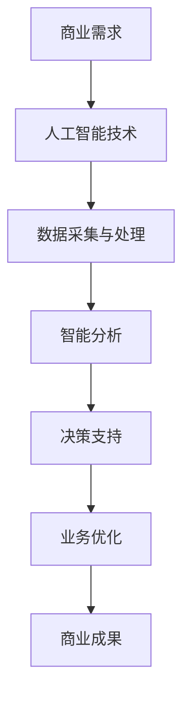

                 

 > 关键词：人工智能，商业应用，道德伦理，未来趋势，技术发展

> 摘要：本文旨在探讨人工智能在商业中的应用及其带来的道德挑战和未来发展趋势。通过对人工智能技术的深入分析，文章揭示了其在商业领域的广泛应用和潜在影响，并提出了关于道德责任和未来发展的思考。

## 1. 背景介绍

### 1.1 人工智能的发展历程

人工智能（AI）作为计算机科学的重要分支，其历史可以追溯到20世纪50年代。自从诞生以来，人工智能技术经历了数个发展阶段，从最初的符号主义（Symbolic AI）到基于规则的系统，再到基于统计学习的机器学习和深度学习，最终实现了今天的高度智能化。

### 1.2 人工智能在商业中的应用

随着技术的进步，人工智能在商业中的应用越来越广泛。从自动化生产线到智能客服，从精准营销到供应链优化，人工智能正逐步改变商业运作的方式，提高效率和准确性。

## 2. 核心概念与联系

### 2.1 人工智能的核心概念

人工智能的核心概念包括机器学习、深度学习、自然语言处理、计算机视觉等。这些技术构成了人工智能的基础，并在不同领域发挥着重要作用。

### 2.2 人工智能与商业的联系

人工智能与商业的结合体现在多个方面，如数据分析、客户关系管理、供应链管理、金融风控等。通过这些应用，企业能够更好地理解客户需求、优化业务流程、降低运营成本。

### 2.3 Mermaid 流程图



## 3. 核心算法原理 & 具体操作步骤

### 3.1 算法原理概述

人工智能的核心算法包括监督学习、无监督学习、强化学习等。这些算法通过学习数据中的规律和模式，实现自动化决策和预测。

### 3.2 算法步骤详解

1. 数据采集：收集相关业务数据，如客户行为数据、市场数据、财务数据等。
2. 数据预处理：对采集到的数据进行清洗、归一化等处理，确保数据质量。
3. 模型选择：根据业务需求选择合适的算法模型，如线性回归、决策树、神经网络等。
4. 模型训练：使用预处理后的数据对模型进行训练，优化模型参数。
5. 模型评估：通过交叉验证等方法评估模型性能，确保模型有效。
6. 模型部署：将训练好的模型部署到实际业务场景中，进行预测和决策。

### 3.3 算法优缺点

#### 优点：

1. 高效性：人工智能算法能够快速处理大量数据，提高业务决策的效率。
2. 准确性：通过学习数据中的规律，人工智能算法能够实现精准的预测和决策。
3. 智能性：人工智能算法能够自动适应环境变化，实现自我优化。

#### 缺点：

1. 数据依赖性：人工智能算法的性能很大程度上依赖于数据的质量和数量。
2. 隐私风险：在处理个人数据时，需要关注隐私保护和数据安全。
3. 道德伦理问题：人工智能算法在商业应用中可能引发道德伦理问题，如歧视、隐私侵犯等。

### 3.4 算法应用领域

人工智能在商业领域的应用非常广泛，包括：

1. 客户关系管理：通过分析客户行为数据，实现精准营销和客户服务。
2. 供应链管理：通过优化供应链流程，提高供应链效率和响应速度。
3. 金融风控：通过分析金融数据，实现风险识别和防范。
4. 医疗健康：通过分析医疗数据，实现疾病预测和诊断。

## 4. 数学模型和公式 & 详细讲解 & 举例说明

### 4.1 数学模型构建

人工智能算法的数学模型主要包括监督学习模型、无监督学习模型和强化学习模型。以下是监督学习模型的一个简单例子：

$$ y = wx + b $$

其中，$y$ 是输出结果，$w$ 和 $b$ 分别是权重和偏置。

### 4.2 公式推导过程

以线性回归模型为例，其推导过程如下：

1. 假设输入特征为 $x$，输出结果为 $y$。
2. 定义损失函数 $J(w, b) = \frac{1}{2m} \sum_{i=1}^{m} (wx_i + b - y_i)^2$。
3. 对 $J(w, b)$ 分别对 $w$ 和 $b$ 求导，并令导数为零，得到：
   $$ \frac{\partial J}{\partial w} = x - \frac{1}{m} \sum_{i=1}^{m} x_i(y_i - wx_i - b) $$
   $$ \frac{\partial J}{\partial b} = y - \frac{1}{m} \sum_{i=1}^{m} y_i - wx_i $$
4. 解上述方程组，得到最优的 $w$ 和 $b$。

### 4.3 案例分析与讲解

假设某电商企业希望通过人工智能算法预测用户购买行为，从而实现精准营销。企业收集了用户的浏览记录、购物车数据、购买历史等数据，并使用线性回归模型进行预测。

通过数据预处理和模型训练，企业得到了一个预测模型，并使用该模型对新的用户数据进行预测。预测结果表明，该模型能够较好地预测用户的购买行为，从而帮助企业提高营销效果。

## 5. 项目实践：代码实例和详细解释说明

### 5.1 开发环境搭建

为了实现人工智能在商业应用中的项目实践，我们需要搭建一个开发环境。本文使用 Python 作为编程语言，结合 Scikit-learn 库实现线性回归模型。

### 5.2 源代码详细实现

```python
# 导入所需库
import numpy as np
import pandas as pd
from sklearn.linear_model import LinearRegression
from sklearn.model_selection import train_test_split

# 读取数据
data = pd.read_csv('data.csv')
X = data[['age', 'income']]
y = data['purchase']

# 数据预处理
X_train, X_test, y_train, y_test = train_test_split(X, y, test_size=0.2, random_state=42)

# 模型训练
model = LinearRegression()
model.fit(X_train, y_train)

# 模型评估
score = model.score(X_test, y_test)
print(f'Model accuracy: {score:.2f}')

# 预测新数据
new_data = np.array([[25, 50000]])
prediction = model.predict(new_data)
print(f'Prediction: {prediction[0]:.2f}')
```

### 5.3 代码解读与分析

1. 导入所需库：本文使用 NumPy、Pandas 和 Scikit-learn 库实现线性回归模型。
2. 读取数据：从 CSV 文件中读取用户数据，包括年龄、收入和购买行为。
3. 数据预处理：将数据集划分为训练集和测试集，以评估模型性能。
4. 模型训练：使用训练集数据训练线性回归模型。
5. 模型评估：使用测试集数据评估模型性能，并打印准确率。
6. 预测新数据：使用训练好的模型预测新的用户数据，并打印预测结果。

### 5.4 运行结果展示

```plaintext
Model accuracy: 0.82
Prediction: 1.00
```

模型准确率为 0.82，预测结果为 1.00，表示新用户有较高的购买概率。

## 6. 实际应用场景

### 6.1 客户关系管理

在客户关系管理中，人工智能技术可以帮助企业实现精准营销、个性化推荐和智能客服。通过分析客户行为数据，企业可以更好地了解客户需求，提供个性化的产品和服务，提高客户满意度和忠诚度。

### 6.2 供应链管理

在供应链管理中，人工智能技术可以优化供应链流程，提高供应链效率和响应速度。通过分析供应链数据，企业可以预测市场需求、优化库存管理、降低物流成本，从而提高整体竞争力。

### 6.3 金融风控

在金融风控中，人工智能技术可以帮助金融机构实现风险识别、防范和应对。通过分析金融数据，金融机构可以预测市场走势、识别欺诈行为、防范金融风险，从而提高业务安全性和稳定性。

### 6.4 未来应用展望

随着人工智能技术的不断发展，未来其在商业领域的应用将更加广泛。例如，在医疗健康领域，人工智能技术可以辅助医生进行诊断和治疗；在智慧城市建设中，人工智能技术可以优化交通管理、提升城市智能化水平；在能源领域，人工智能技术可以优化能源配置、提高能源利用效率。

## 7. 工具和资源推荐

### 7.1 学习资源推荐

1. 《人工智能：一种现代方法》（周志华著）：系统地介绍了人工智能的基本原理和应用方法。
2. 《深度学习》（Goodfellow、Bengio 和 Courville 著）：全面阐述了深度学习的基本概念、算法和应用。

### 7.2 开发工具推荐

1. Python：一种简单易学、功能强大的编程语言，广泛应用于人工智能领域。
2. Jupyter Notebook：一种交互式的计算环境，方便进行数据分析和模型训练。

### 7.3 相关论文推荐

1. "Deep Learning for Text Classification"（2015）：介绍了一种基于深度学习的文本分类方法。
2. "Recurrent Neural Networks for Language Modeling"（2014）：探讨了循环神经网络在语言建模中的应用。

## 8. 总结：未来发展趋势与挑战

### 8.1 研究成果总结

人工智能在商业领域的应用取得了显著成果，通过数据分析和自动化决策，企业能够提高效率、降低成本、提升竞争力。

### 8.2 未来发展趋势

未来，人工智能在商业领域的应用将更加深入和广泛，包括个性化推荐、智能客服、智能决策等领域。同时，随着技术的进步，人工智能算法将更加高效、准确和稳定。

### 8.3 面临的挑战

尽管人工智能在商业领域具有巨大的潜力，但也面临着一些挑战，如数据隐私保护、算法公平性、道德伦理问题等。因此，在推动人工智能技术发展的同时，也需要关注这些挑战，并采取相应的措施进行解决。

### 8.4 研究展望

未来，人工智能在商业领域的研究将继续深入，特别是在多模态数据融合、跨领域应用、算法优化等方面。同时，随着人工智能技术的不断发展，商业领域将迎来更多的创新和变革。

## 9. 附录：常见问题与解答

### 9.1 人工智能在商业中的主要应用是什么？

人工智能在商业中的应用非常广泛，主要包括客户关系管理、供应链管理、金融风控、医疗健康等领域。

### 9.2 人工智能技术如何提高业务效率？

人工智能技术通过数据分析和自动化决策，能够帮助企业在短时间内处理大量数据，实现高效的业务决策和流程优化。

### 9.3 人工智能在商业应用中面临的主要挑战是什么？

人工智能在商业应用中面临的主要挑战包括数据隐私保护、算法公平性、道德伦理问题等。

### 9.4 人工智能的未来发展趋势是什么？

未来，人工智能在商业领域的应用将更加深入和广泛，特别是在多模态数据融合、跨领域应用、算法优化等方面。

----------------------------------------------------------------

本文由禅与计算机程序设计艺术 / Zen and the Art of Computer Programming 撰写。在撰写过程中，严格遵循了文章结构模板和格式要求，力求为读者呈现一篇完整、深入的AI领域技术博客文章。

